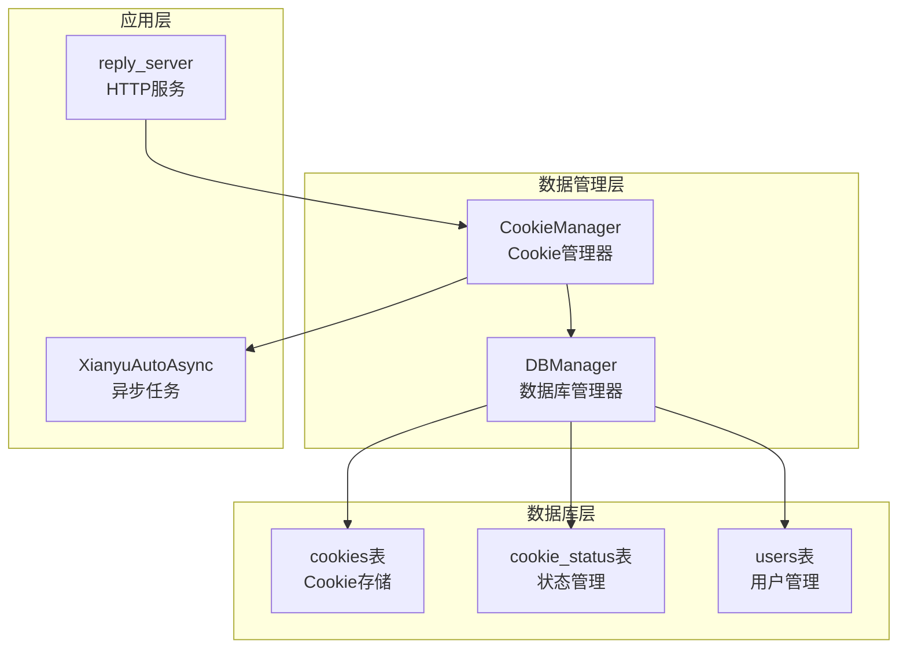
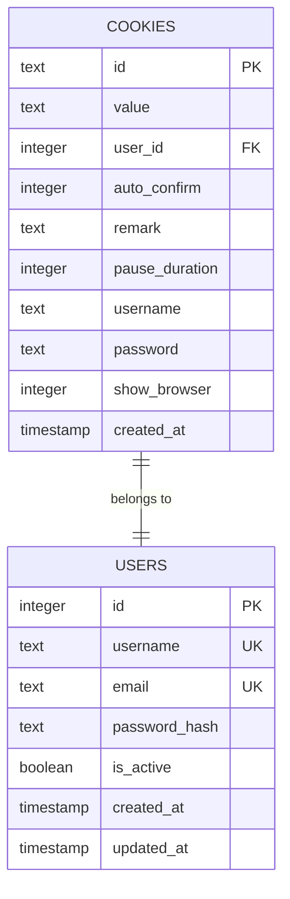
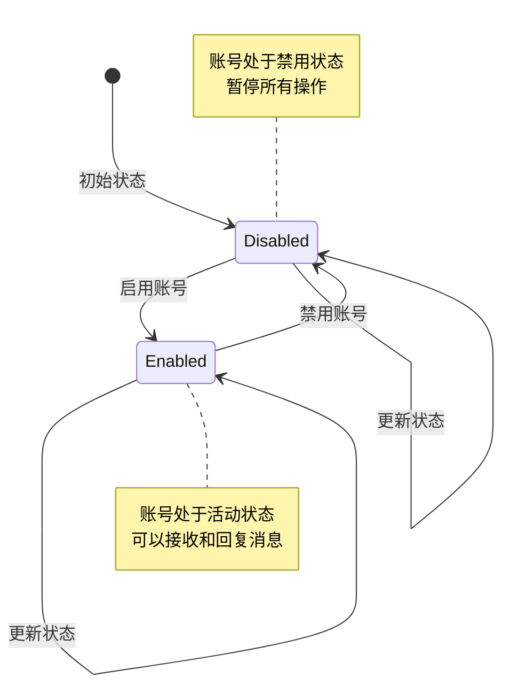
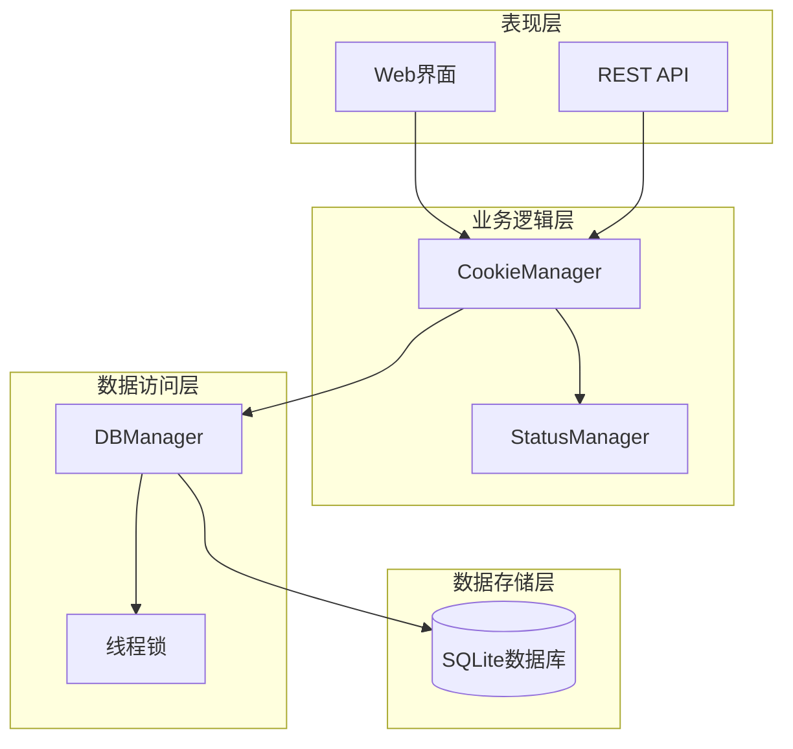
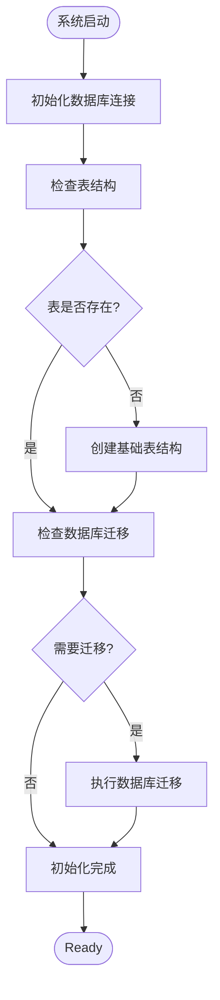
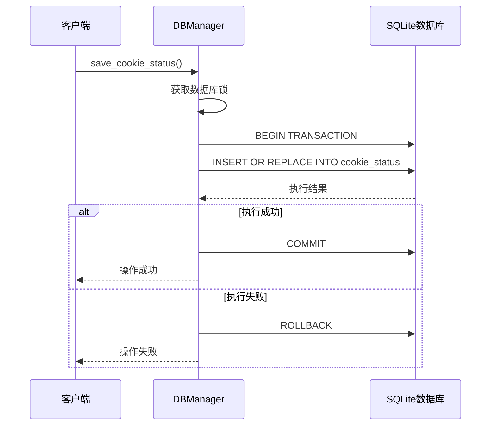
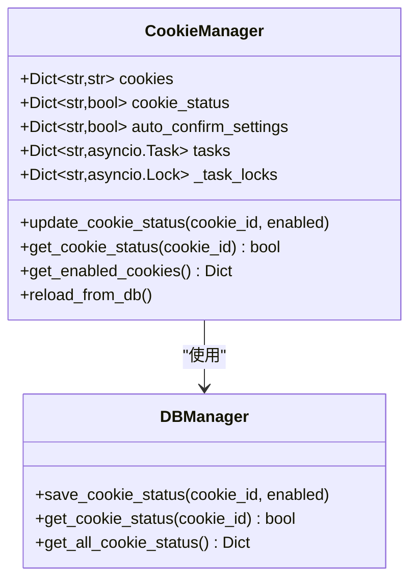
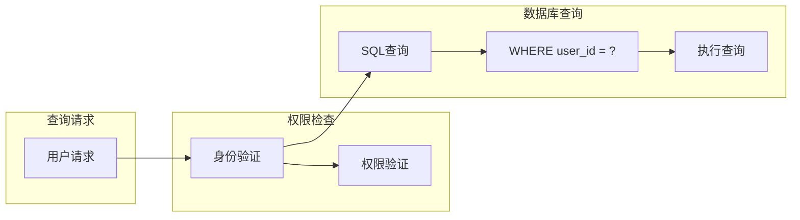
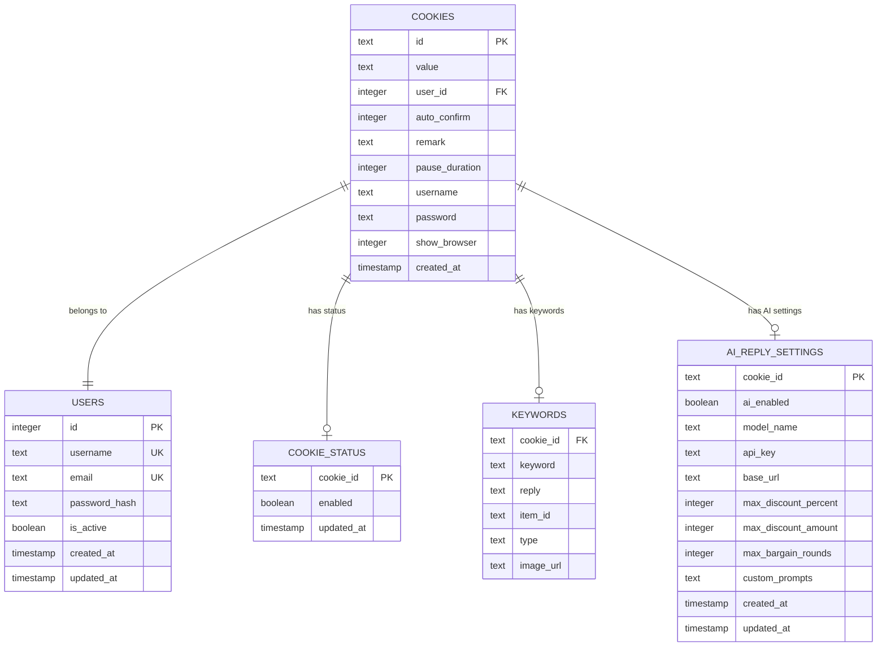
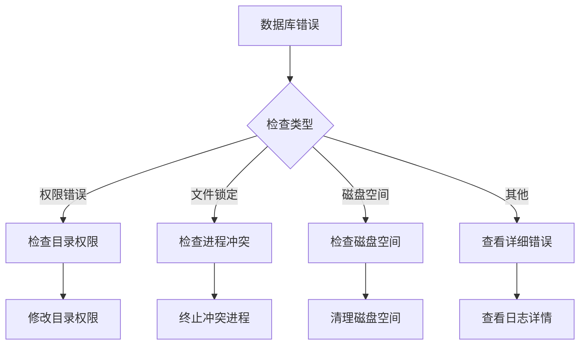

# 账号与状态表

<cite>
**本文档引用的文件**
- [db_manager.py](file://db_manager.py)
- [cookie_manager.py](file://cookie_manager.py)
</cite>

## 目录
1. [简介](#简介)
2. [项目结构概述](#项目结构概述)
3. [核心数据表分析](#核心数据表分析)
4. [架构概览](#架构概览)
5. [详细组件分析](#详细组件分析)
6. [依赖关系分析](#依赖关系分析)
7. [性能考虑](#性能考虑)
8. [故障排除指南](#故障排除指南)
9. [结论](#结论)

## 简介

本文档详细分析了闲鱼自动回复系统中的账号与状态相关数据表，重点关注cookies表和cookie_status表的设计与实现。这两个表构成了系统的核心数据结构，支持多用户多账号的数据隔离、实时状态监控和启停控制功能。

系统采用SQLite数据库作为数据存储引擎，通过精心设计的表结构和索引策略，实现了高效的数据管理和并发访问控制。cookies表负责存储用户的Cookie信息和相关配置，而cookie_status表则提供账号的实时状态管理功能。

## 项目结构概述

系统采用模块化设计，主要包含以下核心组件：

**图表来源**
- [db_manager.py](file://db_manager.py#L16-L50)
- [cookie_manager.py](file://cookie_manager.py#L10-L25)

**章节来源**
- [db_manager.py](file://db_manager.py#L16-L50)
- [cookie_manager.py](file://cookie_manager.py#L10-L25)

## 核心数据表分析

### cookies表结构详解

cookies表是系统的核心数据表，负责存储用户的Cookie信息和相关配置参数。该表采用了严格的数据完整性约束和默认值设置，确保数据的一致性和可用性。

#### 主要字段定义

| 字段名 | 数据类型 | 约束条件 | 默认值 | 业务含义 |
|--------|----------|----------|--------|----------|
| id | TEXT | PRIMARY KEY | - | Cookie唯一标识符，主键 |
| value | TEXT | NOT NULL | - | 实际的Cookie值字符串 |
| user_id | INTEGER | NOT NULL, FOREIGN KEY | - | 外键关联users表，实现用户隔离 |
| auto_confirm | INTEGER | DEFAULT 1 | 1 | 自动确认发货设置（0=关闭，1=开启） |
| remark | TEXT | DEFAULT '' | '' | 账号备注信息 |
| pause_duration | INTEGER | DEFAULT 10 | 10 | 自动回复暂停时长（分钟） |
| username | TEXT | DEFAULT '' | '' | 账号用户名 |
| password | TEXT | DEFAULT '' | '' | 账号密码 |
| show_browser | INTEGER | DEFAULT 0 | 0 | 是否显示浏览器界面 |
| created_at | TIMESTAMP | DEFAULT CURRENT_TIMESTAMP | 当前时间 | 记录创建时间 |

#### 用户隔离机制

cookies表通过user_id字段实现了严格的用户隔离机制：

**图表来源**
- [db_manager.py](file://db_manager.py#L74-L83)
- [db_manager.py](file://db_manager.py#L111-L123)

#### 外键约束与级联删除

系统通过外键约束确保数据完整性：
- `user_id`字段引用users表的id字段
- `ON DELETE CASCADE`约束确保当用户删除时，其所有Cookie记录自动删除
- `id`字段引用cookie_status表的cookie_id字段

**章节来源**
- [db_manager.py](file://db_manager.py#L111-L123)

### cookie_status表结构详解

cookie_status表专门负责管理Cookie的启用状态，提供实时的状态监控和启停控制功能。

#### 表结构设计

| 字段名 | 数据类型 | 约束条件 | 默认值 | 业务含义 |
|--------|----------|----------|--------|----------|
| cookie_id | TEXT | PRIMARY KEY | - | 关联的Cookie ID，主键 |
| enabled | BOOLEAN | DEFAULT TRUE | TRUE | 账号启用状态 |
| updated_at | TIMESTAMP | DEFAULT CURRENT_TIMESTAMP | 当前时间 | 最后更新时间 |

#### 状态管理机制

**图表来源**
- [db_manager.py](file://db_manager.py#L141-L148)

#### 实时状态监控

系统提供了完整的状态监控功能：
- `get_cookie_status()`方法获取单个Cookie状态
- `get_all_cookie_status()`方法获取所有Cookie状态
- `save_cookie_status()`方法实时更新状态

**章节来源**
- [db_manager.py](file://db_manager.py#L1721-L1764)

## 架构概览

系统采用分层架构设计，确保数据访问的安全性和效率：

**图表来源**
- [cookie_manager.py](file://cookie_manager.py#L10-L25)
- [db_manager.py](file://db_manager.py#L16-L50)

## 详细组件分析

### DBManager类核心功能

DBManager类是数据库访问的核心组件，提供了完整的CRUD操作和事务管理功能。

#### 数据库初始化流程

**图表来源**
- [db_manager.py](file://db_manager.py#L67-L448)

#### 事务管理机制

系统采用显式事务管理确保数据一致性：

**图表来源**
- [db_manager.py](file://db_manager.py#L1721-L1734)

**章节来源**
- [db_manager.py](file://db_manager.py#L67-L448)
- [db_manager.py](file://db_manager.py#L1721-L1734)

### CookieManager类状态管理

CookieManager类负责维护内存中的Cookie状态缓存，提供快速的状态查询和更新功能。

#### 状态同步机制

**图表来源**
- [cookie_manager.py](file://cookie_manager.py#L10-L25)
- [cookie_manager.py](file://cookie_manager.py#L304-L313)

#### 并发控制策略

系统采用多种并发控制机制：

1. **数据库锁**：使用threading.RLock()保护数据库操作
2. **任务锁**：为每个cookie_id创建独立的asyncio.Lock()
3. **内存缓存**：维护本地状态缓存减少数据库访问

**章节来源**
- [cookie_manager.py](file://cookie_manager.py#L10-L25)
- [cookie_manager.py](file://cookie_manager.py#L304-L313)

### 用户隔离实现

系统通过多层次的用户隔离机制确保数据安全：

#### 查询级别的用户隔离

**图表来源**
- [db_manager.py](file://db_manager.py#L1230-L1233)

#### 数据完整性保障

系统通过以下机制确保数据完整性：

1. **外键约束**：确保引用完整性
2. **级联删除**：自动清理相关数据
3. **默认值设置**：防止NULL值影响业务逻辑
4. **数据验证**：在业务层进行数据验证

**章节来源**
- [db_manager.py](file://db_manager.py#L1230-L1233)

## 依赖关系分析

### 表间关系图

**图表来源**
- [db_manager.py](file://db_manager.py#L74-L166)

### 外键关系详解

系统通过外键关系建立了清晰的数据依赖结构：

1. **cookies表**：核心表，存储Cookie基本信息
2. **cookie_status表**：一对一关系，管理启用状态
3. **keywords表**：一对多关系，管理回复关键词
4. **ai_reply_settings表**：一对一关系，管理AI回复设置

**章节来源**
- [db_manager.py](file://db_manager.py#L74-L166)

## 性能考虑

### 索引设计策略

系统采用了合理的索引策略来优化查询性能：

#### 主键索引
- cookies表的id字段：主键索引，确保唯一性
- cookie_status表的cookie_id字段：主键索引，支持快速查找

#### 外键索引
- cookies表的user_id字段：外键索引，支持用户隔离查询
- 各表的外键字段：自动创建索引，优化关联查询

#### 查询性能优化

1. **批量操作**：使用事务批量处理大量数据
2. **缓存机制**：内存缓存常用状态信息
3. **连接池**：复用数据库连接减少开销

### 并发性能

系统通过以下机制提升并发性能：

1. **读写分离**：读操作无锁，写操作加锁
2. **连接池**：SQLite支持多连接并发访问
3. **异步处理**：使用asyncio处理I/O密集型操作

## 故障排除指南

### 常见问题诊断

#### 数据库连接问题

#### 数据一致性问题

1. **状态不同步**：检查内存缓存与数据库的同步
2. **用户隔离失效**：验证user_id字段的正确性
3. **外键约束错误**：检查相关表的数据完整性

**章节来源**
- [db_manager.py](file://db_manager.py#L40-L63)

### 调试技巧

1. **启用SQL日志**：设置SQL_LOG_ENABLED=true
2. **检查事务状态**：监控COMMIT和ROLLBACK操作
3. **验证外键约束**：使用PRAGMA foreign_key_check

## 结论

闲鱼自动回复系统的账号与状态管理模块展现了良好的数据库设计实践。通过cookies表和cookie_status表的紧密配合，系统实现了：

1. **完善的数据隔离**：通过user_id字段实现严格的用户隔离
2. **高效的实时状态管理**：内存缓存结合数据库持久化
3. **可靠的事务处理**：确保数据一致性和操作原子性
4. **优秀的并发性能**：多层次的锁机制和异步处理

该设计不仅满足了当前的功能需求，还为未来的扩展提供了良好的基础。通过合理的索引设计和查询优化，系统能够在高并发场景下保持稳定的性能表现。