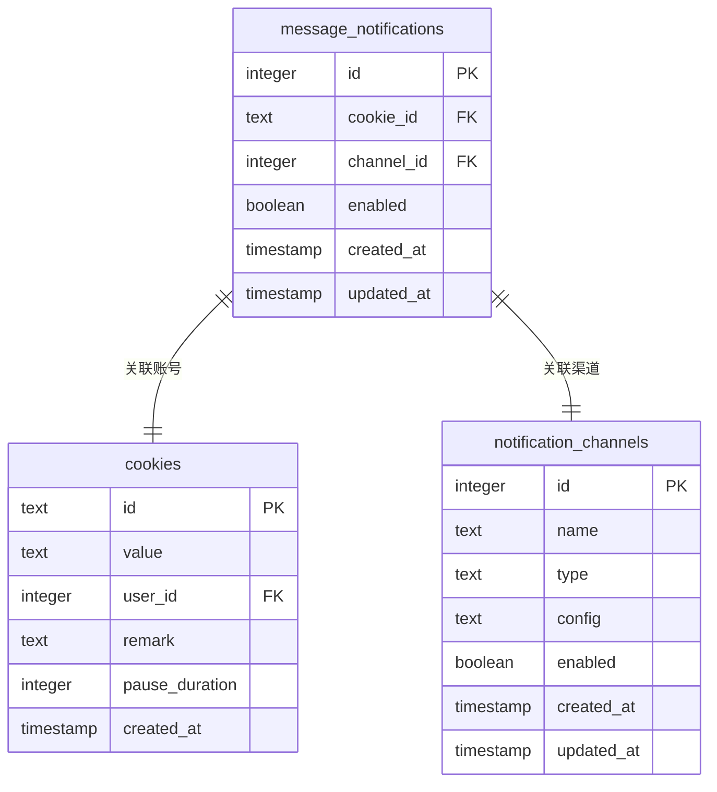
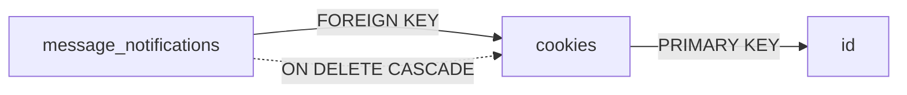
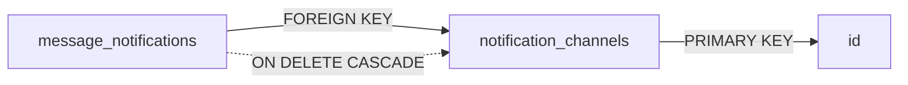
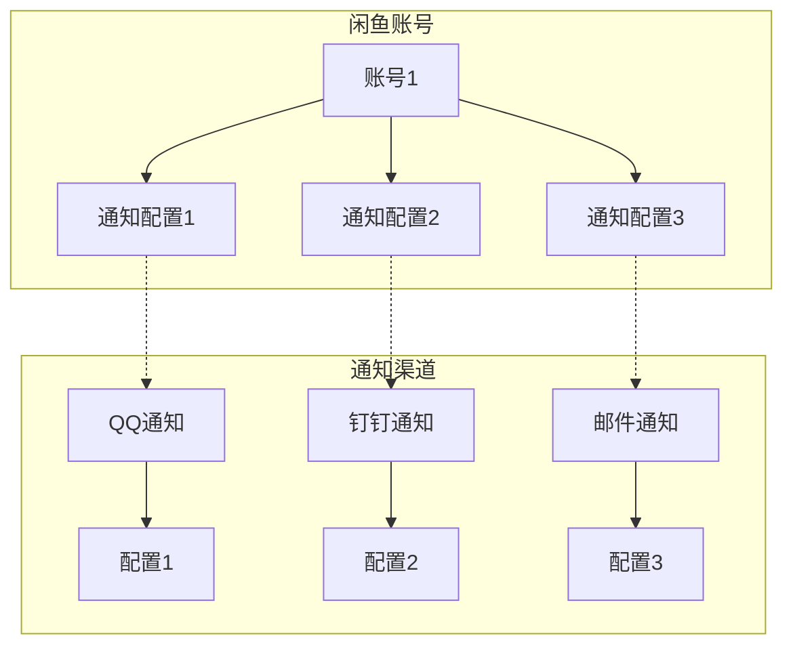
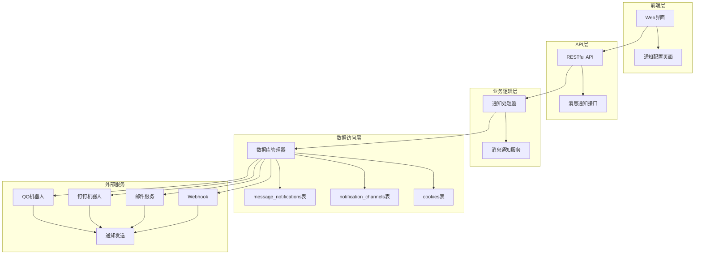
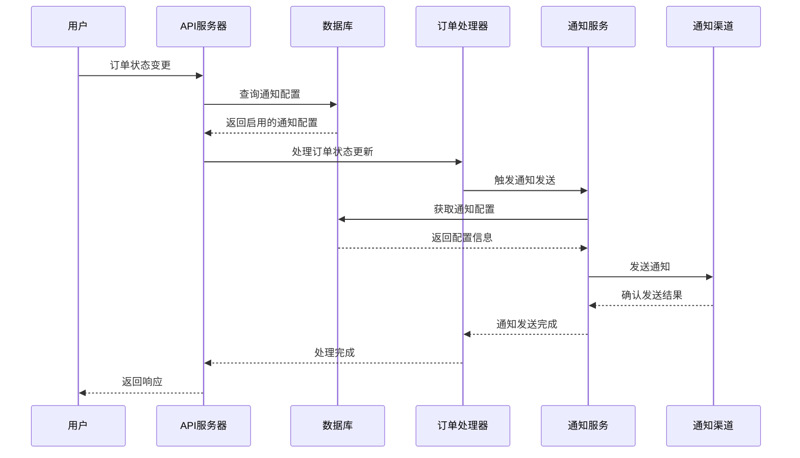
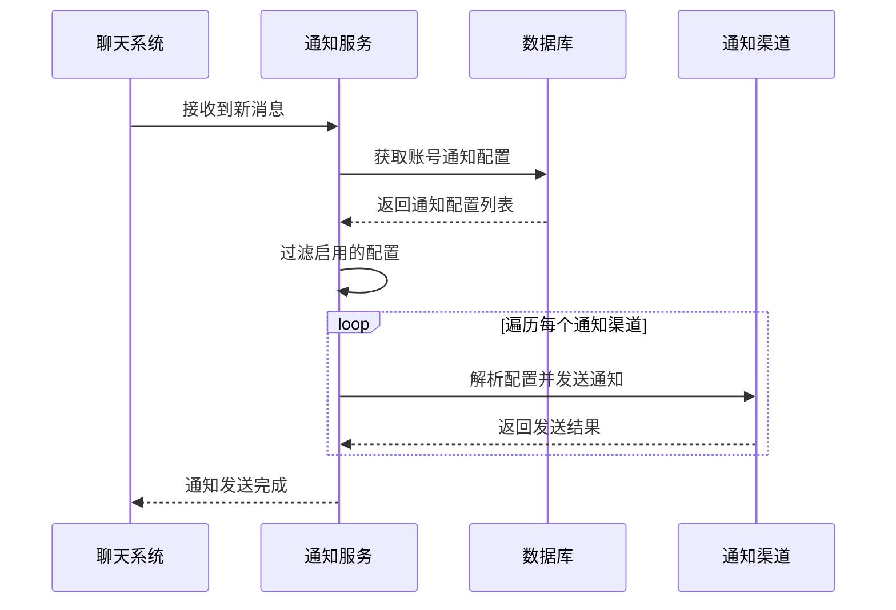

# 消息通知表（message_notifications）详细文档

<cite>
**本文档引用的文件**
- [db_manager.py](file://db_manager.py)
- [reply_server.py](file://reply_server.py)
- [XianyuAutoAsync.py](file://XianyuAutoAsync.py)
- [order_status_handler.py](file://order_status_handler.py)
- [static/js/app.js](file://static/js/app.js)
- [static/index.html](file://static/index.html)
</cite>

## 目录
1. [简介](#简介)
2. [表结构设计](#表结构设计)
3. [字段详解](#字段详解)
4. [外键约束分析](#外键约束分析)
5. [多对多关系实现](#多对多关系实现)
6. [SQL创建语句](#sql创建语句)
7. [系统架构中的作用](#系统架构中的作用)
8. [数据流转过程](#数据流转过程)
9. [实际应用场景](#实际应用场景)
10. [性能优化建议](#性能优化建议)
11. [故障排查指南](#故障排查指南)

## 简介

消息通知表（message_notifications）是闲鱼自动回复系统中的核心中间关联表，专门用于建立闲鱼账号（cookie_id）与通知渠道（channel_id）之间的多对多关系。该表的设计目的是实现灵活的通知配置机制，允许一个闲鱼账号绑定多个不同类型的通知渠道，同时支持每个渠道的独立启用/禁用控制。

## 表结构设计



**图表来源**
- [db_manager.py](file://db_manager.py#L379-L390)

**章节来源**
- [db_manager.py](file://db_manager.py#L379-L390)

## 字段详解

### id（主键）
- **类型**: INTEGER
- **属性**: PRIMARY KEY AUTOINCREMENT
- **描述**: 自增主键，唯一标识每条通知配置记录
- **用途**: 作为表的唯一标识符，支持删除特定通知配置

### cookie_id（关联闲鱼账号）
- **类型**: TEXT
- **属性**: NOT NULL, FOREIGN KEY
- **描述**: 关联到cookies表的id字段，表示该通知配置所属的闲鱼账号
- **约束**: 必须存在于cookies表中，支持ON DELETE CASCADE级联删除
- **用途**: 标识具体哪个闲鱼账号的通知配置

### channel_id（关联通知渠道ID）
- **类型**: INTEGER
- **属性**: NOT NULL, FOREIGN KEY
- **描述**: 关联到notification_channels表的id字段，表示具体的通知渠道
- **约束**: 必须存在于notification_channels表中，支持ON DELETE CASCADE级联删除
- **用途**: 指定使用哪种类型的通知渠道

### enabled（是否启用该通知组合）
- **类型**: BOOLEAN
- **属性**: DEFAULT TRUE
- **描述**: 控制该通知配置是否处于启用状态
- **默认值**: TRUE（启用状态）
- **用途**: 允许用户灵活地启用或禁用特定的通知组合

### created_at（创建时间）
- **类型**: TIMESTAMP
- **属性**: DEFAULT CURRENT_TIMESTAMP
- **描述**: 记录该通知配置的创建时间
- **用途**: 用于审计和统计分析

### updated_at（更新时间）
- **类型**: TIMESTAMP
- **属性**: DEFAULT CURRENT_TIMESTAMP
- **描述**: 记录该通知配置的最后更新时间
- **用途**: 支持时间戳更新和数据同步

**章节来源**
- [db_manager.py](file://db_manager.py#L380-L389)

## 外键约束分析

### cookie_id外键约束



**图表来源**
- [db_manager.py](file://db_manager.py#L387)

**约束特点**：
- **引用完整性**: 确保cookie_id必须存在于cookies表中
- **级联删除**: 当cookies表中的记录被删除时，message_notifications表中对应的记录也会自动删除
- **数据一致性**: 防止出现孤立的通知配置记录

### channel_id外键约束



**图表来源**
- [db_manager.py](file://db_manager.py#L388)

**约束特点**：
- **引用完整性**: 确保channel_id必须存在于notification_channels表中
- **级联删除**: 当notification_channels表中的记录被删除时，message_notifications表中对应的记录也会自动删除
- **数据一致性**: 保证通知配置的有效性

### UNIQUE约束

```sql
UNIQUE(cookie_id, channel_id)
```

**约束特点**：
- **防止重复配置**: 同一个账号不能重复绑定同一个通知渠道
- **业务逻辑保障**: 确保每个账号-渠道组合的配置唯一性
- **查询效率**: 支持快速查找特定账号的特定渠道配置

**章节来源**
- [db_manager.py](file://db_manager.py#L387-L389)

## 多对多关系实现

message_notifications表通过以下设计实现了"一个账号可绑定多个通知渠道"的多对多关系：

### 关系图示



**图表来源**
- [db_manager.py](file://db_manager.py#L2102-L2193)

### 实现原理

1. **中间表设计**: message_notifications作为中间表，连接两个实体表
2. **复合主键**: 通过UNIQUE约束确保每个账号只能有一个特定渠道的配置
3. **灵活配置**: 每个配置可以独立启用/禁用
4. **扩展性强**: 支持未来新增通知渠道类型

### 查询示例

```sql
-- 获取某个账号的所有通知配置
SELECT * FROM message_notifications WHERE cookie_id = 'your_cookie_id';

-- 获取所有启用的通知配置
SELECT * FROM message_notifications WHERE enabled = 1;

-- 获取特定渠道的通知配置
SELECT * FROM message_notifications WHERE channel_id = 1;
```

**章节来源**
- [db_manager.py](file://db_manager.py#L2102-L2193)

## SQL创建语句

以下是完整的SQL DDL创建语句：

```sql
CREATE TABLE IF NOT EXISTS message_notifications (
    id INTEGER PRIMARY KEY AUTOINCREMENT,
    cookie_id TEXT NOT NULL,
    channel_id INTEGER NOT NULL,
    enabled BOOLEAN DEFAULT TRUE,
    created_at TIMESTAMP DEFAULT CURRENT_TIMESTAMP,
    updated_at TIMESTAMP DEFAULT CURRENT_TIMESTAMP,
    FOREIGN KEY (cookie_id) REFERENCES cookies(id) ON DELETE CASCADE,
    FOREIGN KEY (channel_id) REFERENCES notification_channels(id) ON DELETE CASCADE,
    UNIQUE(cookie_id, channel_id)
);
```

### 约束说明

1. **PRIMARY KEY**: id字段作为主键，支持AUTOINCREMENT
2. **NOT NULL**: cookie_id和channel_id字段不能为空
3. **FOREIGN KEY**: 两个外键约束确保数据完整性
4. **ON DELETE CASCADE**: 级联删除保证数据一致性
5. **UNIQUE**: 防止重复配置

**章节来源**
- [db_manager.py](file://db_manager.py#L379-L390)

## 系统架构中的作用

### 在整体架构中的位置



**图表来源**
- [reply_server.py](file://reply_server.py#L2548-L2641)
- [XianyuAutoAsync.py](file://XianyuAutoAsync.py#L3420-L3538)

### 核心作用

1. **配置管理**: 存储和管理账号的通知配置
2. **关系维护**: 维护账号与通知渠道的关联关系
3. **权限控制**: 支持按账号隔离通知配置
4. **状态控制**: 管理通知的启用/禁用状态

**章节来源**
- [reply_server.py](file://reply_server.py#L2548-L2641)

## 数据流转过程

### 订单状态变更通知流程



**图表来源**
- [order_status_handler.py](file://order_status_handler.py#L48-L1073)
- [XianyuAutoAsync.py](file://XianyuAutoAsync.py#L3420-L3538)

### 消息通知发送流程



**图表来源**
- [XianyuAutoAsync.py](file://XianyuAutoAsync.py#L3420-L3538)

**章节来源**
- [order_status_handler.py](file://order_status_handler.py#L48-L1073)
- [XianyuAutoAsync.py](file://XianyuAutoAsync.py#L3420-L3538)

## 实际应用场景

### 场景1：多渠道通知配置

**需求**: 用户希望在不同情况下使用不同的通知方式

**解决方案**:
- QQ通知：用于实时消息提醒
- 钉钉通知：用于工作群组通知
- 邮件通知：用于重要事项确认

**配置示例**:
```json
{
    "cookie_id": "user_cookie_001",
    "channel_id": 1,
    "enabled": true
}
```

### 场景2：按条件启用通知

**需求**: 在不同时间段启用不同的通知渠道

**解决方案**:
- 白天启用QQ通知
- 晚上启用邮件通知

**实现方式**:
```python
# 动态控制通知启用状态
db_manager.set_message_notification(cookie_id, channel_id, enabled=True)
```

### 场景3：批量通知管理

**需求**: 为多个账号统一配置通知渠道

**解决方案**:
```python
# 批量添加通知配置
for cookie_id in account_list:
    db_manager.set_message_notification(cookie_id, channel_id, enabled=True)
```

**章节来源**
- [reply_server.py](file://reply_server.py#L2584-L2605)
- [static/js/app.js](file://static/js/app.js#L2626-L2862)

## 性能优化建议

### 索引优化

1. **复合索引**: 为(coinde_id, channel_id)创建复合索引
2. **单字段索引**: 为enabled字段创建索引以加速查询
3. **时间索引**: 为created_at和updated_at字段创建索引

### 查询优化

1. **分页查询**: 对于大量数据的查询使用分页
2. **条件过滤**: 优先使用WHERE子句过滤数据
3. **连接优化**: 使用JOIN查询减少多次查询

### 缓存策略

1. **配置缓存**: 缓存常用的通知配置
2. **用户缓存**: 缓存用户的通知偏好设置
3. **渠道缓存**: 缓存通知渠道的配置信息

## 故障排查指南

### 常见问题及解决方案

#### 1. 通知发送失败

**症状**: 通知配置正确但未收到通知

**排查步骤**:
1. 检查message_notifications表中的enabled字段
2. 验证notification_channels表中的配置有效性
3. 检查cookies表中的账号状态

**解决方案**:
```sql
-- 检查通知配置状态
SELECT * FROM message_notifications 
WHERE cookie_id = 'your_cookie_id' AND enabled = 1;

-- 检查通知渠道状态
SELECT * FROM notification_channels 
WHERE id = your_channel_id AND enabled = 1;
```

#### 2. 重复通知问题

**症状**: 同一条消息被多次通知

**原因分析**:
- 防重复机制失效
- 多个相同的通知配置
- 级联删除不完整

**解决方案**:
```sql
-- 清理重复配置
DELETE FROM message_notifications 
WHERE id NOT IN (
    SELECT MIN(id) 
    FROM message_notifications 
    GROUP BY cookie_id, channel_id
);
```

#### 3. 性能问题

**症状**: 查询通知配置响应缓慢

**优化措施**:
1. 添加适当的索引
2. 优化查询语句
3. 实施查询缓存

**章节来源**
- [db_manager.py](file://db_manager.py#L2102-L2193)

## 结论

消息通知表（message_notifications）作为闲鱼自动回复系统的核心组件，通过精心设计的多对多关系，实现了灵活、可扩展的通知配置机制。该表不仅支持多种通知渠道的组合使用，还提供了完善的权限控制和状态管理功能，为整个系统的通知功能奠定了坚实的基础。

通过合理的数据库设计、完善的约束机制和高效的查询优化，该表能够满足大规模用户场景下的通知需求，同时保证数据的一致性和系统的稳定性。随着系统的发展，该表的设计也为未来的功能扩展提供了良好的基础架构支持。