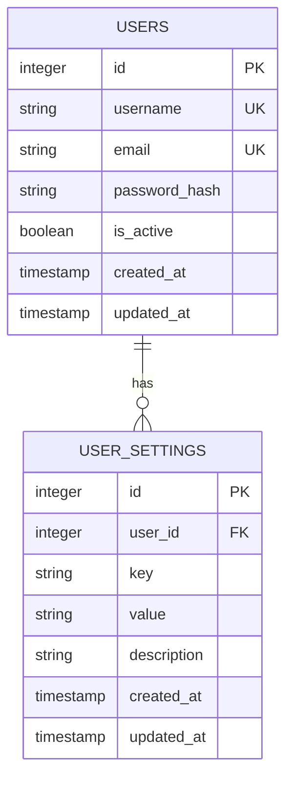
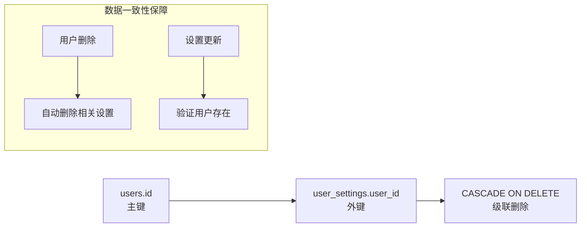
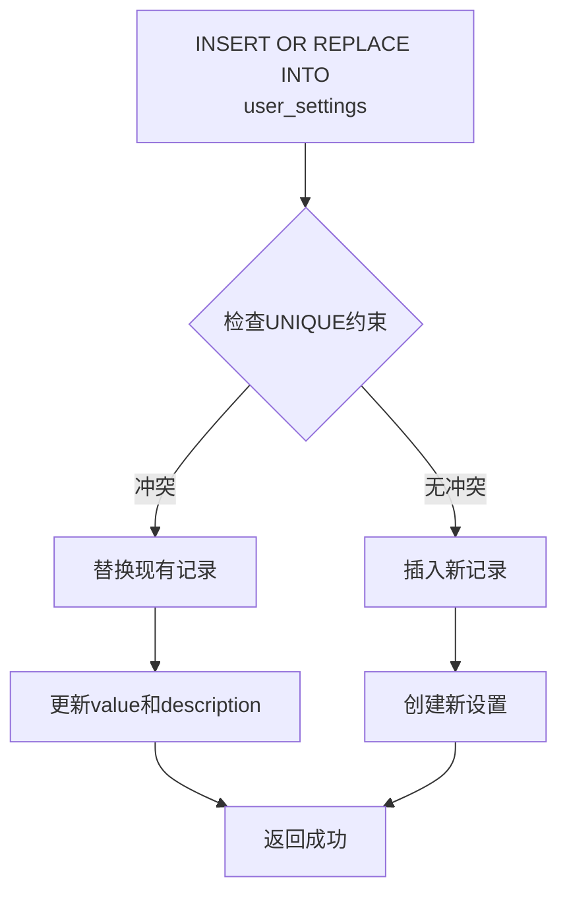
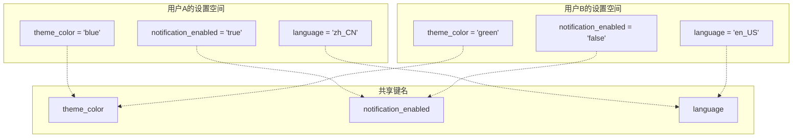
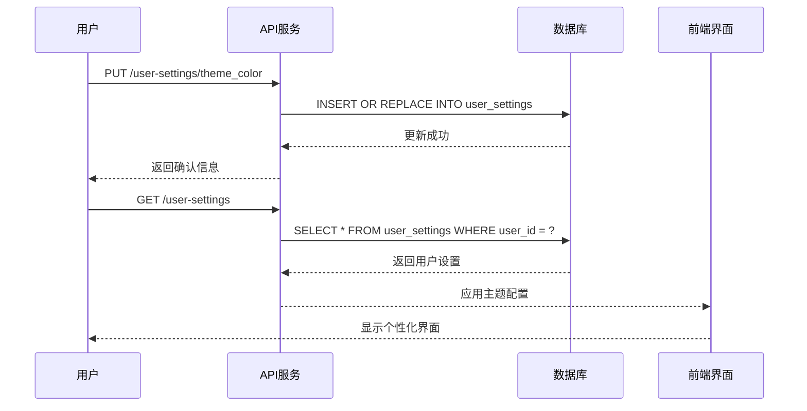
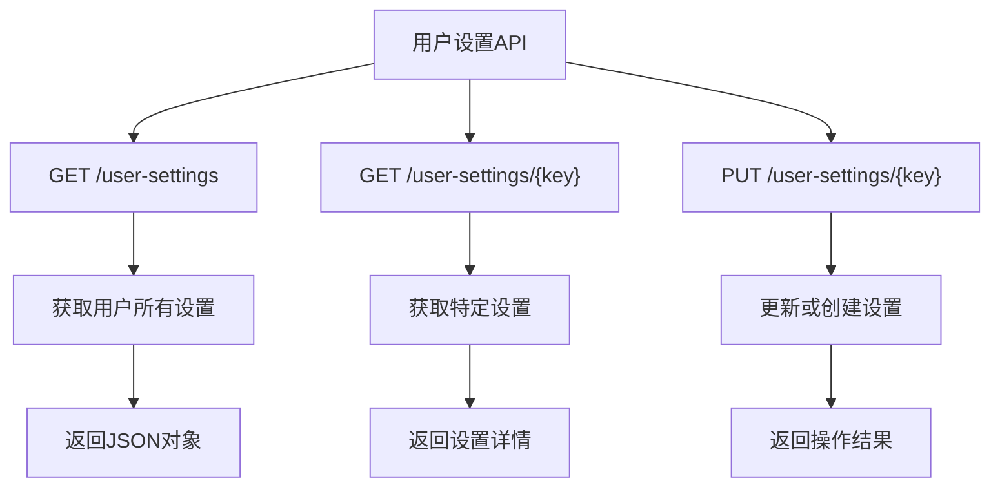
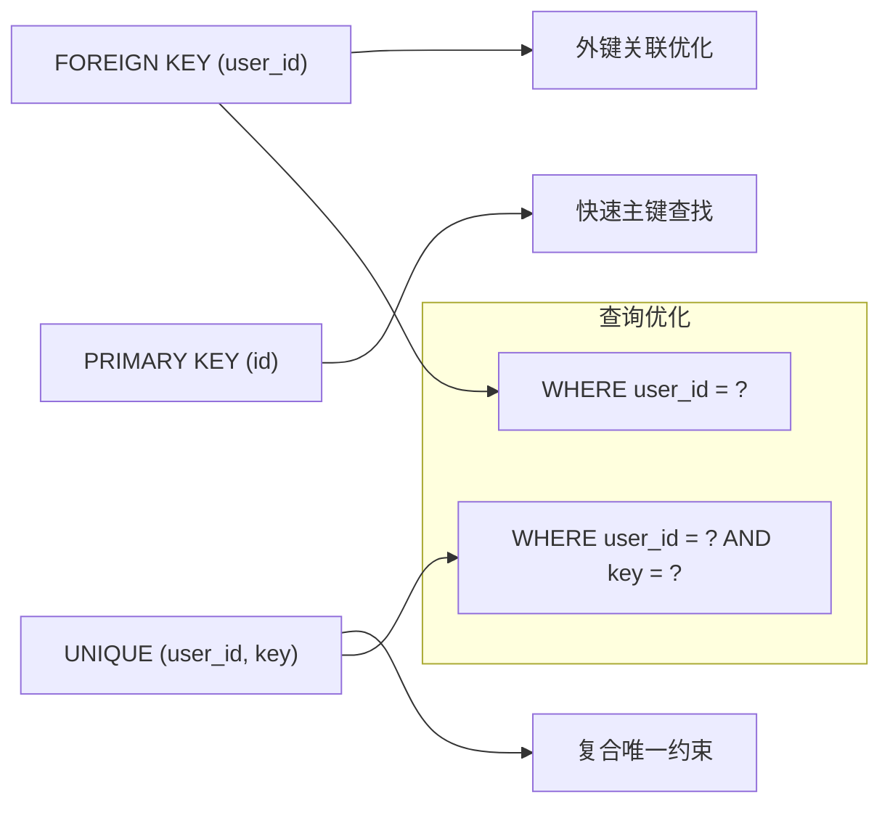

# 用户设置表（user_settings）

<cite>
**本文档引用的文件**
- [db_manager.py](file://db_manager.py)
- [reply_server.py](file://reply_server.py)
- [static/js/app.js](file://static/js/app.js)
- [static/index.html](file://static/index.html)
</cite>

## 目录
1. [简介](#简介)
2. [表结构设计](#表结构设计)
3. [字段详解](#字段详解)
4. [外键关系](#外键关系)
5. [约束机制](#约束机制)
6. [配置隔离机制](#配置隔离机制)
7. [实际应用场景](#实际应用场景)
8. [API接口设计](#api接口设计)
9. [性能优化考虑](#性能优化考虑)
10. [最佳实践建议](#最佳实践建议)

## 简介

用户设置表（user_settings）是系统中支持多用户个性化配置的核心数据库表。它采用键值对（Key-Value）存储模式，为每个用户提供了灵活的配置管理能力，实现了用户级别的配置隔离，确保不同用户可以拥有独立的界面主题、通知偏好和其他个性化设置。

该表的设计遵循了关系数据库的规范化原则，通过外键关联确保数据完整性，同时通过UNIQUE约束保证配置的唯一性，为系统的可扩展性和维护性奠定了坚实基础。

## 表结构设计

用户设置表采用了简洁而高效的表结构设计，包含以下核心字段：

**图表来源**
- [db_manager.py](file://db_manager.py#L74-L84)
- [db_manager.py](file://db_manager.py#L394-L406)

**章节来源**
- [db_manager.py](file://db_manager.py#L394-L406)

## 字段详解

### 核心字段说明

| 字段名 | 数据类型 | 约束条件 | 用途说明 |
|--------|----------|----------|----------|
| `id` | INTEGER | PRIMARY KEY AUTOINCREMENT | 主键标识符，自增序列 |
| `user_id` | INTEGER | NOT NULL, FOREIGN KEY | 外键关联users表，标识所属用户 |
| `key` | TEXT | NOT NULL, UNIQUE(user_id, key) | 设置键名，必须唯一 |
| `value` | TEXT | NOT NULL | 设置值，支持字符串格式 |
| `description` | TEXT | NULLABLE | 设置描述信息，便于理解用途 |

### 时间戳字段

| 字段名 | 数据类型 | 默认值 | 用途说明 |
|--------|----------|--------|----------|
| `created_at` | TIMESTAMP | CURRENT_TIMESTAMP | 记录设置创建时间 |
| `updated_at` | TIMESTAMP | CURRENT_TIMESTAMP | 记录设置最后更新时间 |

这些时间戳字段为系统提供了完整的审计跟踪能力，支持配置变更的历史记录和时间线追踪。

**章节来源**
- [db_manager.py](file://db_manager.py#L396-L402)

## 外键关系

用户设置表与用户表（users）建立了严格的外键关系，确保数据的一致性和完整性：

**图表来源**
- [db_manager.py](file://db_manager.py#L397-L403)

这种外键关系具有以下特点：
- **参照完整性**：确保user_id指向有效的用户记录
- **级联删除**：当用户被删除时，自动清理相关设置
- **数据一致性**：防止出现孤立的设置记录

**章节来源**
- [db_manager.py](file://db_manager.py#L397-L403)

## 约束机制

### UNIQUE约束设计

用户设置表采用了复合唯一约束（UNIQUE(user_id, key)），这是系统设计的关键创新点：

**图表来源**
- [db_manager.py](file://db_manager.py#L404)
- [db_manager.py](file://db_manager.py#L4253-L4256)

这种约束设计的优势：
1. **配置唯一性**：每个用户只能有一个特定键的设置
2. **原子操作**：INSERT OR REPLACE保证了操作的原子性
3. **自动更新**：相同键的设置会自动更新值而非创建重复记录
4. **简化API**：开发者无需先查询再决定是插入还是更新

**章节来源**
- [db_manager.py](file://db_manager.py#L404)
- [db_manager.py](file://db_manager.py#L4253-L4256)

## 配置隔离机制

### 用户级别隔离

用户设置表通过user_id字段实现了严格的用户级别配置隔离：

**图表来源**
- [db_manager.py](file://db_manager.py#L4204-L4209)
- [db_manager.py](file://db_manager.py#L4228-L4233)

### 隔离特性

1. **数据独立性**：不同用户的设置完全隔离，互不影响
2. **访问控制**：只有对应用户才能访问和修改自己的设置
3. **安全性**：防止跨用户的数据泄露
4. **可扩展性**：新增设置键无需修改表结构

**章节来源**
- [db_manager.py](file://db_manager.py#L4204-L4209)
- [db_manager.py](file://db_manager.py#L4228-L4233)

## 实际应用场景

### 界面主题配置

系统支持多种界面主题配置，每个用户可以独立设置：

**图表来源**
- [reply_server.py](file://reply_server.py#L4633-L4648)
- [static/js/app.js](file://static/js/app.js#L4983-L5002)

### 通知偏好设置

用户可以配置不同类型的通知偏好：

| 通知类型 | 设置键 | 可能值 | 描述 |
|----------|--------|--------|------|
| 邮件通知 | `email_notifications` | `true/false` | 是否启用邮件通知 |
| 系统通知 | `system_alerts` | `true/false` | 是否显示系统警告 |
| 移动推送 | `mobile_push` | `true/false` | 是否接收移动推送 |
| 声音提醒 | `sound_enabled` | `true/false` | 是否启用声音提醒 |

### 系统行为配置

除了界面设置，还可以配置系统行为：

| 配置类别 | 设置键示例 | 数据类型 | 用途说明 |
|----------|------------|----------|----------|
| 自动化 | `auto_reply_delay` | INTEGER | 自动回复延迟时间（秒） |
| 安全性 | `two_factor_auth` | BOOLEAN | 是否启用双因素认证 |
| 性能 | `max_concurrent_tasks` | INTEGER | 最大并发任务数 |
| 兼容性 | `legacy_mode` | BOOLEAN | 是否启用兼容模式 |

**章节来源**
- [db_manager.py](file://db_manager.py#L4247-L4264)
- [static/js/app.js](file://static/js/app.js#L2725-L3374)

## API接口设计

### RESTful接口规范

系统提供了完整的RESTful API接口来管理用户设置：

**图表来源**
- [reply_server.py](file://reply_server.py#L4622-L4667)

### 接口详细说明

#### 获取用户所有设置
- **端点**：`GET /user-settings`
- **权限**：当前用户
- **响应**：返回用户的所有设置键值对

#### 获取特定设置
- **端点**：`GET /user-settings/{key}`
- **权限**：当前用户
- **响应**：返回指定键的设置详情，不存在时返回404

#### 更新设置
- **端点**：`PUT /user-settings/{key}`
- **权限**：当前用户
- **请求体**：包含`value`和可选的`description`
- **响应**：返回操作结果和设置详情

**章节来源**
- [reply_server.py](file://reply_server.py#L4622-L4667)

## 性能优化考虑

### 索引策略

为了确保查询性能，系统采用了以下索引策略：

**图表来源**
- [db_manager.py](file://db_manager.py#L396-L404)

### 查询优化技巧

1. **批量查询**：使用`IN`语句减少网络往返
2. **缓存策略**：对频繁访问的设置进行内存缓存
3. **懒加载**：按需加载非关键设置
4. **连接池**：使用数据库连接池提高并发性能

**章节来源**
- [db_manager.py](file://db_manager.py#L4204-L4209)
- [db_manager.py](file://db_manager.py#L4228-L4233)

## 最佳实践建议

### 设计原则

1. **单一职责**：每个设置键只负责一个功能领域
2. **命名规范**：使用清晰、一致的键名命名约定
3. **类型安全**：确保设置值的数据类型一致性
4. **向后兼容**：新增设置时不破坏现有功能

### 安全考虑

1. **敏感信息保护**：避免在设置中存储敏感数据
2. **权限验证**：严格验证用户身份和操作权限
3. **输入验证**：对设置值进行必要的验证和过滤
4. **审计日志**：记录重要的设置变更操作

### 扩展性设计

1. **预留空间**：为未来功能预留设置键
2. **版本控制**：支持设置格式的版本演进
3. **默认值管理**：合理设置默认值减少配置负担
4. **批量操作**：支持批量设置操作提高效率

### 维护建议

1. **定期清理**：清理无效或过期的设置记录
2. **性能监控**：监控设置查询的性能指标
3. **备份策略**：重要设置的定期备份
4. **文档维护**：保持设置文档的及时更新

通过以上设计和实践，用户设置表不仅满足了当前的功能需求，还为未来的功能扩展和系统演进提供了坚实的基础。这种灵活而可靠的配置管理机制，使得系统能够更好地适应不同用户的需求，提供个性化的使用体验。