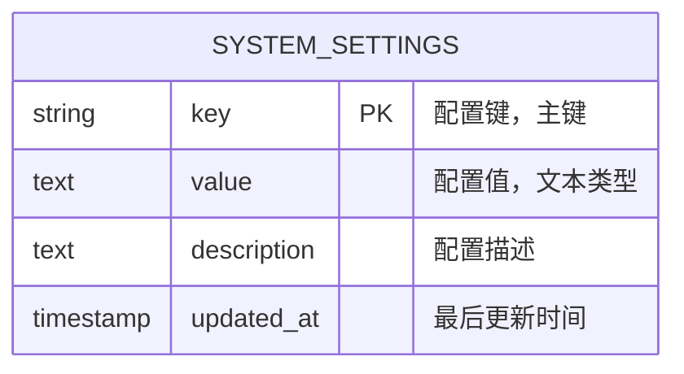
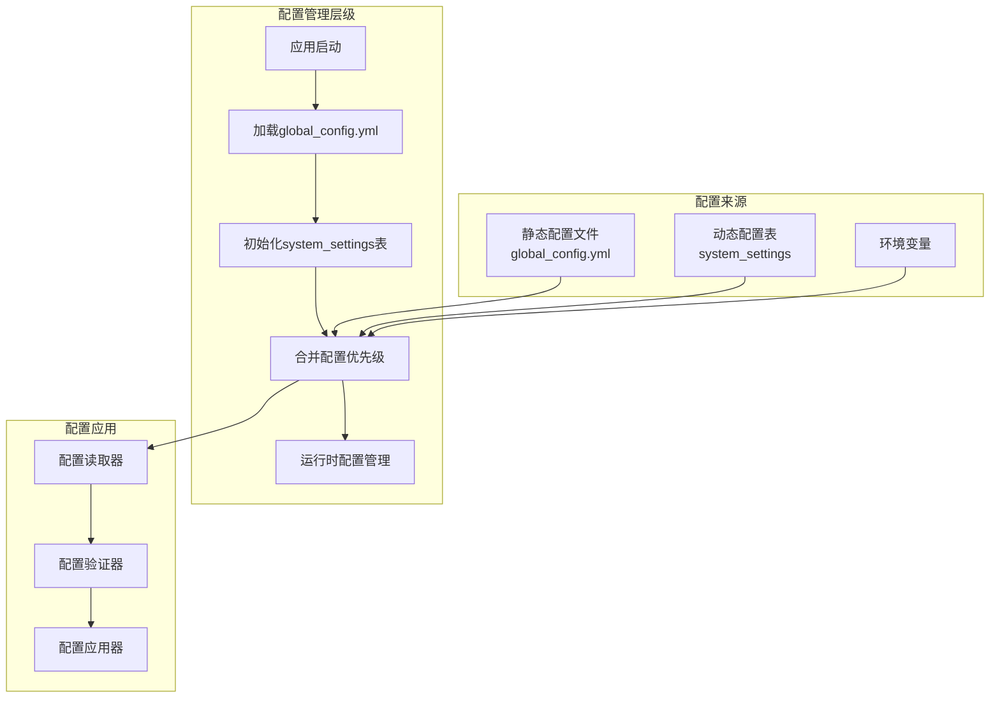
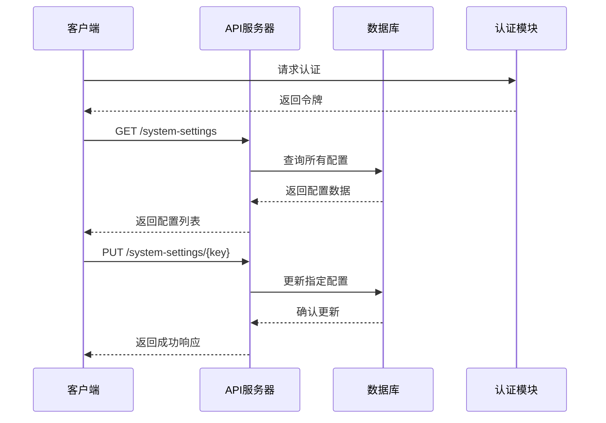
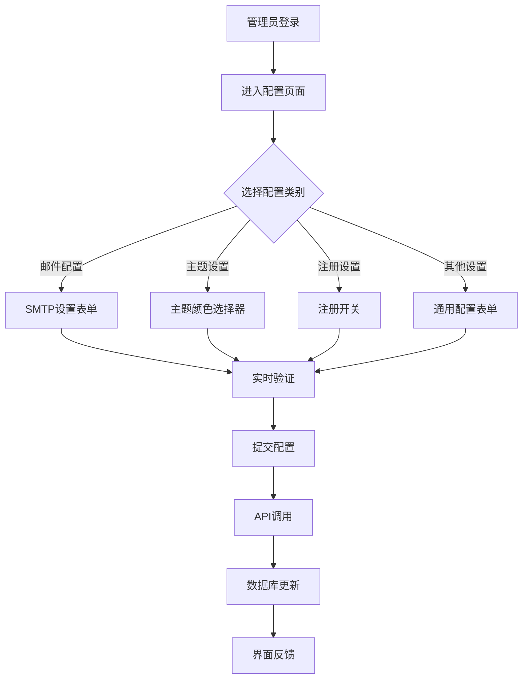
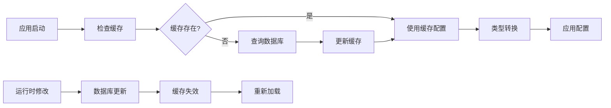

# 系统设置表（system_settings）详细文档

<cite>
**本文档引用的文件**
- [db_manager.py](file://db_manager.py)
- [global_config.yml](file://global_config.yml)
- [config.py](file://config.py)
- [reply_server.py](file://reply_server.py)
- [static/js/app.js](file://static/js/app.js)
- [utils/slider_patch.py](file://utils/slider_patch.py)
- [static/index.html](file://static/index.html)
</cite>

## 目录
1. [简介](#简介)
2. [表结构设计](#表结构设计)
3. [核心字段详解](#核心字段详解)
4. [数据库初始化与默认值](#数据库初始化与默认值)
5. [配置管理架构](#配置管理架构)
6. [动态配置与静态配置的职责划分](#动态配置与静态配置的职责划分)
7. [API接口设计](#api接口设计)
8. [前端界面集成](#前端界面集成)
9. [运行时读取与应用机制](#运行时读取与应用机制)
10. [最佳实践与注意事项](#最佳实践与注意事项)

## 简介

系统设置表（system_settings）是闲鱼自动回复系统的核心配置存储组件，采用SQLite数据库实现全局配置的动态管理。该表为系统提供了灵活的配置管理能力，支持运行时动态修改配置而无需重启服务，同时保持配置的持久化存储。

系统设置表的设计遵循了配置管理的最佳实践，将可变的系统配置与静态的基础配置分离，实现了配置的层次化管理和灵活的运维控制。

## 表结构设计

### 核心表结构



**图表来源**
- [db_manager.py](file://db_manager.py#L369-L375)

### 字段设计原理

系统设置表采用了简洁而高效的字段设计：

- **key字段**：作为主键，确保每个配置项的唯一性
- **value字段**：使用TEXT类型存储配置值，支持各种数据类型的字符串表示
- **description字段**：提供配置项的功能说明，便于维护和理解
- **updated_at字段**：自动记录配置的最后修改时间，支持审计和版本控制

**章节来源**
- [db_manager.py](file://db_manager.py#L369-L375)

## 核心字段详解

### key字段（配置键）

key字段是系统设置表的主键，具有以下特性：

- **唯一性约束**：每个配置键必须唯一，确保配置的独立性
- **命名规范**：采用小写字母和下划线的命名约定，如`smtp_server`、`theme_color`
- **分类组织**：按照功能域进行分组，如邮件配置、主题设置、注册开关等

### value字段（配置值）

value字段采用TEXT类型存储，具有以下特点：

- **灵活性**：支持字符串、数字、布尔值等多种数据类型的字符串表示
- **序列化支持**：复杂配置可通过JSON序列化存储
- **类型转换**：在应用层进行适当的类型转换和验证

### description字段（描述）

description字段提供配置项的功能说明：

- **文档化**：为每个配置项提供清晰的功能描述
- **维护友好**：便于系统维护人员理解和修改配置
- **动态生成**：可用于自动生成配置文档

### updated_at字段（最后更新时间）

updated_at字段记录配置的最后修改时间：

- **审计追踪**：支持配置变更的历史追踪
- **版本控制**：可用于配置的版本管理和回滚
- **自动更新**：使用CURRENT_TIMESTAMP自动更新

**章节来源**
- [db_manager.py](file://db_manager.py#L2377-L2404)

## 数据库初始化与默认值

### DDL创建语句

系统设置表的创建语句如下：

```sql
CREATE TABLE IF NOT EXISTS system_settings (
    key TEXT PRIMARY KEY,
    value TEXT NOT NULL,
    description TEXT,
    updated_at TIMESTAMP DEFAULT CURRENT_TIMESTAMP
)
```

### 默认配置初始化

系统启动时会插入一组默认配置，这些配置涵盖了系统的核心功能设置：

| 配置键 | 默认值 | 描述 |
|--------|--------|------|
| theme_color | blue | 主题颜色 |
| registration_enabled | true | 是否开启用户注册 |
| show_default_login_info | true | 是否显示默认登录信息 |
| smtp_server | 空字符串 | SMTP服务器地址 |
| smtp_port | 587 | SMTP端口 |
| smtp_user | 空字符串 | SMTP登录用户名（发件邮箱） |
| smtp_password | 空字符串 | SMTP登录密码/授权码 |
| smtp_from | 空字符串 | 发件人显示名（留空则使用用户名） |
| smtp_use_tls | true | 是否启用TLS |
| smtp_use_ssl | false | 是否启用SSL |
| qq_reply_secret_key | xianyu_qq_reply_2024 | QQ回复消息API秘钥 |

**章节来源**
- [db_manager.py](file://db_manager.py#L369-L375)
- [db_manager.py](file://db_manager.py#L424-L437)

## 配置管理架构

### 配置管理层级



**图表来源**
- [config.py](file://config.py#L1-L126)
- [db_manager.py](file://db_manager.py#L369-L439)

### 配置加载流程

系统配置的加载遵循以下优先级顺序：

1. **环境变量**：最高优先级，用于容器化部署
2. **system_settings表**：动态配置，支持运行时修改
3. **global_config.yml**：静态配置文件，基础配置项
4. **默认值**：配置不存在时的后备值

**章节来源**
- [config.py](file://config.py#L34-L53)
- [db_manager.py](file://db_manager.py#L2377-L2404)

## 动态配置与静态配置的职责划分

### 动态配置（存储在system_settings表中）

以下配置项适合存储在数据库中，支持动态修改：

#### 邮件系统配置
- **smtp_server**：SMTP服务器地址
- **smtp_port**：SMTP端口号
- **smtp_user**：SMTP用户名
- **smtp_password**：SMTP密码/授权码
- **smtp_from**：发件人显示名称
- **smtp_use_tls**：是否启用TLS加密
- **smtp_use_ssl**：是否启用SSL加密

#### 系统行为配置
- **registration_enabled**：用户注册开关
- **show_default_login_info**：默认登录信息显示开关
- **theme_color**：系统主题颜色

#### API安全配置
- **qq_reply_secret_key**：QQ回复API密钥

### 静态配置（保留在global_config.yml中）

以下配置项更适合保留在配置文件中：

#### 基础系统配置
- **API_ENDPOINTS**：API端点配置
- **APP_CONFIG**：应用基本信息
- **DEFAULT_HEADERS**：默认HTTP头
- **WEBSOCKET_URL**：WebSocket连接地址

#### 性能相关配置
- **HEARTBEAT_INTERVAL**：心跳间隔
- **HEARTBEAT_TIMEOUT**：心跳超时
- **TOKEN_REFRESH_INTERVAL**：令牌刷新间隔
- **MESSAGE_EXPIRE_TIME**：消息过期时间

#### 日志配置
- **LOG_CONFIG**：日志格式和级别

#### 安全配置
- **SLIDER_VERIFICATION**：滑块验证配置

### 职责划分原则

1. **运行时可变性**：经常需要在运行时调整的配置
2. **用户可见性**：管理员可以通过界面直接修改的配置
3. **安全性考虑**：涉及敏感信息的配置需要特殊处理
4. **部署灵活性**：不同部署环境需要差异化配置

**章节来源**
- [global_config.yml](file://global_config.yml#L1-L77)
- [db_manager.py](file://db_manager.py#L424-L437)

## API接口设计

### RESTful接口规范

系统设置了完整的RESTful API接口来管理配置：



**图表来源**
- [reply_server.py](file://reply_server.py#L2646-L2677)

### 接口详情

#### 获取所有系统设置
- **URL**: `/system-settings`
- **方法**: `GET`
- **认证**: 需要管理员权限
- **响应**: 包含所有系统配置的JSON对象

#### 更新系统设置
- **URL**: `/system-settings/{key}`
- **方法**: `PUT`
- **认证**: 需要管理员权限
- **请求体**: 包含value和description字段的JSON对象
- **响应**: 成功时返回`{"msg": "system setting updated"}`

#### 获取注册状态
- **URL**: `/registration-status`
- **方法**: `GET`
- **认证**: 无需认证
- **响应**: 包含注册开关状态的JSON对象

#### 更新注册设置
- **URL**: `/registration-settings`
- **方法**: `PUT`
- **认证**: 需要管理员权限
- **请求体**: 包含enabled字段的JSON对象
- **响应**: 包含更新结果的JSON对象

**章节来源**
- [reply_server.py](file://reply_server.py#L2646-L2784)

## 前端界面集成

### 管理员配置界面

系统提供了完整的管理员配置界面，支持实时修改各项配置：



**图表来源**
- [static/js/app.js](file://static/js/app.js#L8340-L8699)

### 配置界面特性

1. **实时验证**：前端对配置输入进行实时验证
2. **即时反馈**：配置修改后立即显示效果
3. **权限控制**：只有管理员可以访问配置页面
4. **状态指示**：显示配置的当前状态和修改历史

### 配置表单组件

系统为不同类型配置提供了专门的表单组件：

- **文本输入框**：用于简单的字符串配置
- **数字输入框**：用于端口号等数值配置
- **选择框**：用于布尔值和枚举值配置
- **密码输入框**：用于敏感信息的安全输入

**章节来源**
- [static/js/app.js](file://static/js/app.js#L2548-L2618)
- [static/js/app.js](file://static/js/app.js#L8485-L8699)

## 运行时读取与应用机制

### 配置读取策略

系统采用多种策略来读取和应用配置：



**图表来源**
- [db_manager.py](file://db_manager.py#L2377-L2404)

### 配置应用流程

1. **延迟加载**：配置在首次使用时才从数据库加载
2. **缓存机制**：频繁使用的配置会被缓存以提高性能
3. **热更新**：配置修改后可以立即生效，无需重启
4. **类型转换**：根据配置用途进行适当的类型转换

### 配置优先级处理

系统在多个配置源之间建立了明确的优先级：

1. **环境变量**：最高优先级，用于容器化部署
2. **数据库配置**：动态配置，支持运行时修改
3. **配置文件**：静态配置，基础设置
4. **默认值**：最低优先级，确保系统可用性

**章节来源**
- [db_manager.py](file://db_manager.py#L2377-L2404)
- [config.py](file://config.py#L34-L53)

## 最佳实践与注意事项

### 配置管理最佳实践

1. **配置分类**：按照功能域对配置进行分类管理
2. **命名规范**：使用一致的命名约定
3. **文档维护**：及时更新配置描述和说明
4. **权限控制**：限制配置修改的权限范围
5. **备份策略**：定期备份配置数据

### 常见问题与解决方案

#### 配置冲突处理
- **优先级机制**：建立明确的配置优先级
- **冲突检测**：在配置加载时检测潜在冲突
- **日志记录**：记录配置加载过程中的关键步骤

#### 性能优化
- **缓存策略**：对频繁访问的配置进行缓存
- **批量操作**：支持批量配置更新
- **异步处理**：非关键配置的异步加载

#### 安全考虑
- **敏感信息保护**：对密码等敏感信息进行加密存储
- **访问控制**：严格的权限验证机制
- **审计日志**：记录所有配置变更操作

### 扩展建议

1. **配置版本控制**：引入配置版本管理机制
2. **配置模板**：提供配置模板以简化部署
3. **配置导入导出**：支持配置的批量导入导出
4. **配置监控**：实时监控配置状态和变更

**章节来源**
- [db_manager.py](file://db_manager.py#L2377-L2404)
- [reply_server.py](file://reply_server.py#L2663-L2677)

## 结论

系统设置表（system_settings）作为闲鱼自动回复系统的核心配置管理组件，成功实现了配置的动态化、持久化和可管理性。通过合理的表结构设计、完善的API接口和丰富的前端界面，系统为管理员提供了灵活的配置管理能力，同时保证了系统的稳定性和安全性。

该设计充分体现了现代软件架构中配置管理的最佳实践，为类似系统的配置管理提供了有价值的参考。随着系统的发展，这套配置管理体系将继续发挥重要作用，支持系统的持续演进和优化。