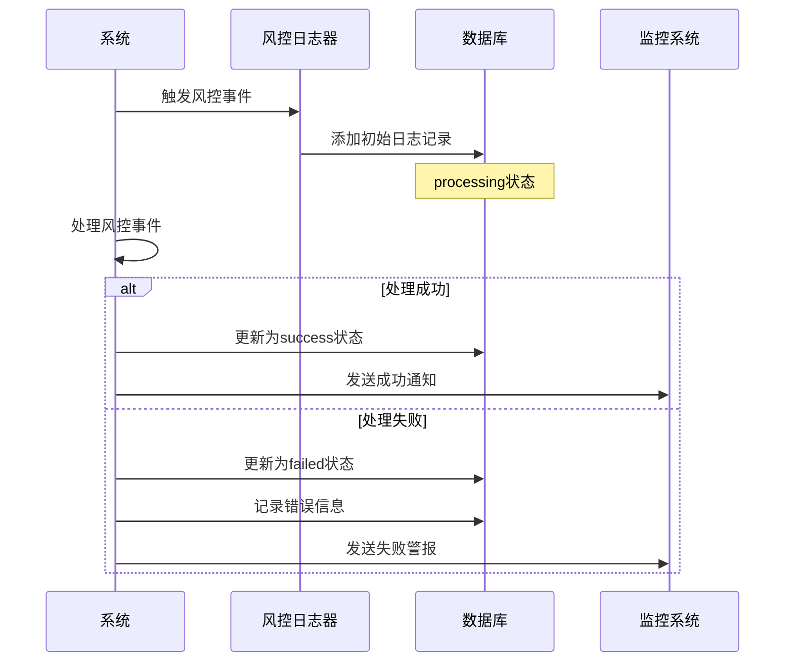
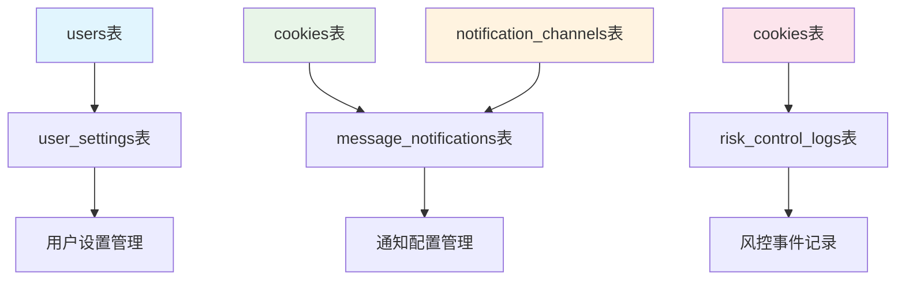

# 通知与日志表详细文档

<cite>
**本文档引用的文件**
- [db_manager.py](file://db_manager.py)
- [reply_server.py](file://reply_server.py)
- [config.py](file://config.py)
- [global_config.yml](file://global_config.yml)
- [XianyuAutoAsync.py](file://XianyuAutoAsync.py)
- [static/js/app.js](file://static/js/app.js)
- [static/index.html](file://static/index.html)
</cite>

## 目录
1. [简介](#简介)
2. [数据库架构概览](#数据库架构概览)
3. [notification_channels表详解](#notification_channels表详解)
4. [message_notifications表详解](#message_notifications表详解)
5. [system_settings表详解](#system_settings表详解)
6. [user_settings表详解](#user_settings表详解)
7. [risk_control_logs表详解](#risk_control_logs表详解)
8. [表间关联关系](#表间关联关系)
9. [实际应用示例](#实际应用示例)
10. [总结](#总结)

## 简介

本文档详细分析了闲鱼自动回复系统中的五个核心通知与日志相关数据表：`notification_channels`（通知渠道表）、`message_notifications`（消息通知配置表）、`system_settings`（系统设置表）、`user_settings`（用户设置表）和`risk_control_logs`（风控日志表）。这些表构成了系统的通知机制、配置管理和风险控制的核心基础设施。

## 数据库架构概览

```mermaid
erDiagram
notification_channels {
integer id PK
text name
text type CHECK(type IN (...))
text config
boolean enabled
timestamp created_at
timestamp updated_at
}
message_notifications {
integer id PK
text cookie_id FK
integer channel_id FK
boolean enabled
timestamp created_at
timestamp updated_at
}
system_settings {
text key PK
text value
text description
timestamp updated_at
}
user_settings {
integer id PK
integer user_id FK
text key
text value
text description
timestamp created_at
timestamp updated_at
}
risk_control_logs {
integer id PK
text cookie_id FK
text event_type
text event_description
text processing_result
text processing_status
text error_message
timestamp created_at
timestamp updated_at
}
cookies {
text id PK
text value
integer user_id FK
timestamp created_at
}
users {
integer id PK
text username
text email
text password_hash
boolean is_active
timestamp created_at
}
notification_channels ||--o{ message_notifications : "channels"
cookies ||--o{ message_notifications : "notifications"
users ||--o{ user_settings : "settings"
cookies ||--o{ risk_control_logs : "logs"
```

**图表来源**
- [db_manager.py](file://db_manager.py#L356-L422)

## notification_channels表详解

### 表结构设计

`notification_channels`表负责管理各种通知渠道的配置信息，支持多种通知方式的统一管理。

```sql
CREATE TABLE IF NOT EXISTS notification_channels (
    id INTEGER PRIMARY KEY AUTOINCREMENT,
    name TEXT NOT NULL,
    type TEXT NOT NULL CHECK (type IN ('qq','ding_talk','dingtalk','feishu','lark','bark','email','webhook','wechat','telegram')),
    config TEXT NOT NULL,
    enabled BOOLEAN DEFAULT TRUE,
    created_at TIMESTAMP DEFAULT CURRENT_TIMESTAMP,
    updated_at TIMESTAMP DEFAULT CURRENT_TIMESTAMP
)
```

### 字段详细说明

| 字段名 | 类型 | 约束 | 说明 |
|--------|------|------|------|
| id | INTEGER | PRIMARY KEY AUTOINCREMENT | 主键，自增ID |
| name | TEXT | NOT NULL | 通知渠道名称，如"钉钉工作群" |
| type | TEXT | NOT NULL CHECK | 通知类型，支持的类型包括：qq、ding_talk、feishu、bark、email、webhook、wechat、telegram |
| config | TEXT | NOT NULL | 渠道配置JSON字符串，包含具体的配置参数 |
| enabled | BOOLEAN | DEFAULT TRUE | 启用状态，TRUE表示启用，FALSE表示禁用 |
| created_at | TIMESTAMP | DEFAULT CURRENT_TIMESTAMP | 创建时间 |
| updated_at | TIMESTAMP | DEFAULT CURRENT_TIMESTAMP | 更新时间 |

### 支持的通知类型

系统支持以下通知渠道类型：

- **qq**: QQ私聊通知
- **ding_talk**/**dingtalk**: 钉钉工作通知
- **feishu**/**lark**: 飞书通知
- **bark**: iOS推送通知
- **email**: 邮件通知
- **webhook**: HTTP Webhook通知
- **wechat**: 微信企业号通知
- **telegram**: Telegram机器人通知

### 配置示例

不同类型的配置格式示例：

```json
{
    "type": "ding_talk",
    "config": {
        "webhook_url": "https://oapi.dingtalk.com/robot/send?access_token=xxx",
        "secret_key": "SECxxx"
    }
}

{
    "type": "qq",
    "config": {
        "qq_number": "123456789"
    }
}

{
    "type": "email",
    "config": {
        "smtp_server": "smtp.gmail.com",
        "smtp_port": 587,
        "sender_email": "user@gmail.com",
        "recipient_email": "admin@example.com"
    }
}
```

**节来源**
- [db_manager.py](file://db_manager.py#L356-L366)

## message_notifications表详解

### 表结构设计

`message_notifications`表建立了账号与通知渠道之间的多对多关系，实现灵活的消息通知配置。

```sql
CREATE TABLE IF NOT EXISTS message_notifications (
    id INTEGER PRIMARY KEY AUTOINCREMENT,
    cookie_id TEXT NOT NULL,
    channel_id INTEGER NOT NULL,
    enabled BOOLEAN DEFAULT TRUE,
    created_at TIMESTAMP DEFAULT CURRENT_TIMESTAMP,
    updated_at TIMESTAMP DEFAULT CURRENT_TIMESTAMP,
    FOREIGN KEY (cookie_id) REFERENCES cookies(id) ON DELETE CASCADE,
    FOREIGN KEY (channel_id) REFERENCES notification_channels(id) ON DELETE CASCADE,
    UNIQUE(cookie_id, channel_id)
)
```

### 字段详细说明

| 字段名 | 类型 | 约束 | 说明 |
|--------|------|------|------|
| id | INTEGER | PRIMARY KEY AUTOINCREMENT | 主键，自增ID |
| cookie_id | TEXT | NOT NULL | 关联的账号Cookie ID，外键引用cookies表 |
| channel_id | INTEGER | NOT NULL | 关联的通知渠道ID，外键引用notification_channels表 |
| enabled | BOOLEAN | DEFAULT TRUE | 通知启用状态 |
| created_at | TIMESTAMP | DEFAULT CURRENT_TIMESTAMP | 创建时间 |
| updated_at | TIMESTAMP | DEFAULT CURRENT_TIMESTAMP | 更新时间 |

### 多对多关系说明

该表实现了账号与通知渠道之间的多对多关系：

- **一个账号可以配置多个通知渠道**：例如，一个账号可以同时配置QQ和钉钉通知
- **一个通知渠道可以被多个账号使用**：多个账号可以共享同一个钉钉群配置
- **独立的启用状态**：每个账号-渠道组合可以独立启用或禁用

### 关联查询示例

获取某个账号的所有通知配置：

```sql
SELECT mn.id, mn.channel_id, mn.enabled, nc.name, nc.type, nc.config
FROM message_notifications mn
JOIN notification_channels nc ON mn.channel_id = nc.id
WHERE mn.cookie_id = ? AND nc.enabled = 1
ORDER BY mn.id
```

**节来源**
- [db_manager.py](file://db_manager.py#L380-L391)

## system_settings表详解

### 表结构设计

`system_settings`表采用键值对形式存储全局系统配置，支持灵活的配置管理。

```sql
CREATE TABLE IF NOT EXISTS system_settings (
    key TEXT PRIMARY KEY,
    value TEXT NOT NULL,
    description TEXT,
    updated_at TIMESTAMP DEFAULT CURRENT_TIMESTAMP
)
```

### 字段详细说明

| 字段名 | 类型 | 约束 | 说明 |
|--------|------|------|------|
| key | TEXT | PRIMARY KEY | 配置键，唯一标识 |
| value | TEXT | NOT NULL | 配置值，支持各种数据类型 |
| description | TEXT | - | 配置描述信息 |
| updated_at | TIMESTAMP | DEFAULT CURRENT_TIMESTAMP | 更新时间 |

### 配置项分类

系统配置分为两大类：

#### 1. 用户界面配置
- `theme_color`: 主题颜色设置
- `registration_enabled`: 用户注册开关
- `show_default_login_info`: 显示默认登录信息

#### 2. 通信配置
- `smtp_server`: SMTP服务器地址
- `smtp_port`: SMTP端口
- `smtp_user`: SMTP登录用户名
- `smtp_password`: SMTP登录密码/授权码
- `smtp_from`: 发件人显示名
- `smtp_use_tls`: 是否启用TLS
- `smtp_use_ssl`: 是否启用SSL

#### 3. 安全配置
- `qq_reply_secret_key`: QQ回复消息API密钥

### 配置优先级

系统配置的优先级顺序：

1. **数据库配置** (`system_settings`表) - 动态可修改
2. **配置文件** (`global_config.yml`) - 静态配置
3. **环境变量** - 最高优先级

### 默认配置初始化

系统启动时会初始化以下默认配置：

```sql
INSERT OR IGNORE INTO system_settings (key, value, description) VALUES
('theme_color', 'blue', '主题颜色'),
('registration_enabled', 'true', '是否开启用户注册'),
('show_default_login_info', 'true', '是否显示默认登录信息'),
('smtp_server', '', 'SMTP服务器地址'),
('smtp_port', '587', 'SMTP端口'),
('smtp_user', '', 'SMTP登录用户名（发件邮箱）'),
('smtp_password', '', 'SMTP登录密码/授权码'),
('smtp_from', '', '发件人显示名（留空则使用用户名）'),
('smtp_use_tls', 'true', '是否启用TLS'),
('smtp_use_ssl', 'false', '是否启用SSL'),
('qq_reply_secret_key', 'xianyu_qq_reply_2024', 'QQ回复消息API秘钥')
```

**节来源**
- [db_manager.py](file://db_manager.py#L368-L377)
- [db_manager.py](file://db_manager.py#L424-L438)

## user_settings表详解

### 表结构设计

`user_settings`表采用用户-键值对的形式存储个性化设置，支持每个用户的独立配置。

```sql
CREATE TABLE IF NOT EXISTS user_settings (
    id INTEGER PRIMARY KEY AUTOINCREMENT,
    user_id INTEGER NOT NULL,
    key TEXT NOT NULL,
    value TEXT NOT NULL,
    description TEXT,
    created_at TIMESTAMP DEFAULT CURRENT_TIMESTAMP,
    updated_at TIMESTAMP DEFAULT CURRENT_TIMESTAMP,
    FOREIGN KEY (user_id) REFERENCES users(id) ON DELETE CASCADE,
    UNIQUE(user_id, key)
)
```

### 字段详细说明

| 字段名 | 类型 | 约束 | 说明 |
|--------|------|------|------|
| id | INTEGER | PRIMARY KEY AUTOINCREMENT | 主键，自增ID |
| user_id | INTEGER | NOT NULL | 用户ID，外键引用users表 |
| key | TEXT | NOT NULL | 设置键，支持的键值 |
| value | TEXT | NOT NULL | 设置值 |
| description | TEXT | - | 设置描述信息 |
| created_at | TIMESTAMP | DEFAULT CURRENT_TIMESTAMP | 创建时间 |
| updated_at | TIMESTAMP | DEFAULT CURRENT_TIMESTAMP | 更新时间 |

### 用户设置机制

#### 1. 设置键的分类
- **界面设置**: theme, language, timezone
- **功能偏好**: notification_preferences, auto_reply_enabled
- **安全设置**: two_factor_auth, password_change_required

#### 2. 设置继承机制
- 用户设置优先级高于系统默认设置
- 新用户创建时自动继承系统默认设置
- 系统设置变更不会影响已有用户的个性化设置

#### 3. 设置验证
- 使用UNIQUE约束防止重复设置
- 支持设置的动态添加和修改
- 自动维护更新时间戳

### 实际应用场景

```python
# 获取用户通知偏好设置
def get_user_notification_preferences(user_id: int) -> Dict[str, Any]:
    preferences = db_manager.get_user_setting(user_id, 'notification_preferences')
    return json.loads(preferences['value']) if preferences else {}

# 设置用户界面语言
def set_user_language(user_id: int, language: str) -> bool:
    return db_manager.set_user_setting(user_id, 'language', language, '用户界面语言')
```

**节来源**
- [db_manager.py](file://db_manager.py#L394-L406)

## risk_control_logs表详解

### 表结构设计

`risk_control_logs`表专门用于记录系统风控事件的处理过程，提供完整的审计跟踪。

```sql
CREATE TABLE IF NOT EXISTS risk_control_logs (
    id INTEGER PRIMARY KEY AUTOINCREMENT,
    cookie_id TEXT NOT NULL,
    event_type TEXT NOT NULL DEFAULT 'slider_captcha',
    event_description TEXT,
    processing_result TEXT,
    processing_status TEXT DEFAULT 'processing',
    error_message TEXT,
    created_at TIMESTAMP DEFAULT CURRENT_TIMESTAMP,
    updated_at TIMESTAMP DEFAULT CURRENT_TIMESTAMP,
    FOREIGN KEY (cookie_id) REFERENCES cookies(id) ON DELETE CASCADE
)
```

### 字段详细说明

| 字段名 | 类型 | 约束 | 说明 |
|--------|------|------|------|
| id | INTEGER | PRIMARY KEY AUTOINCREMENT | 主键，自增ID |
| cookie_id | TEXT | NOT NULL | 关联的账号Cookie ID |
| event_type | TEXT | NOT NULL DEFAULT 'slider_captcha' | 事件类型 |
| event_description | TEXT | - | 事件描述信息 |
| processing_result | TEXT | - | 处理结果描述 |
| processing_status | TEXT | DEFAULT 'processing' | 处理状态 |
| error_message | TEXT | - | 错误信息 |
| created_at | TIMESTAMP | DEFAULT CURRENT_TIMESTAMP | 创建时间 |
| updated_at | TIMESTAMP | DEFAULT CURRENT_TIMESTAMP | 更新时间 |

### 事件类型分类

#### 1. 滑块验证事件
- `slider_captcha`: 滑块验证码事件
- `captcha_detection`: 验证码检测事件
- `captcha_solving`: 验证码解决事件

#### 2. 登录安全事件
- `login_attempt`: 登录尝试事件
- `login_success`: 登录成功事件
- `login_failed`: 登录失败事件

#### 3. 系统监控事件
- `rate_limit_exceeded`: 速率限制超出
- `unusual_activity`: 异常活动检测
- `system_health`: 系统健康检查

### 处理状态定义

| 状态值 | 说明 |
|--------|------|
| processing | 处理中 |
| success | 处理成功 |
| failed | 处理失败 |
| timeout | 处理超时 |

### 风控日志记录流程



**图表来源**
- [db_manager.py](file://db_manager.py#L4828-L4858)

### 实际应用示例

#### 滑块验证日志记录

```python
# 添加滑块验证日志
def log_slider_captcha_event(cookie_id: str, success: bool, duration: float, cookies_length: int):
    event_type = 'slider_captcha'
    event_desc = f'滑块验证耗时: {duration:.2f}秒, cookies长度: {cookies_length}'
    
    if success:
        processing_result = f"滑块验证成功，耗时: {duration:.2f}秒, cookies长度: {len(new_cookies_str)}"
        processing_status = 'success'
    else:
        processing_result = f"滑块验证失败，耗时: {duration:.2f}秒"
        processing_status = 'failed'
    
    db_manager.add_risk_control_log(
        cookie_id=cookie_id,
        event_type=event_type,
        event_description=event_desc,
        processing_result=processing_result,
        processing_status=processing_status
    )
```

**节来源**
- [db_manager.py](file://db_manager.py#L409-L422)
- [db_manager.py](file://db_manager.py#L4828-L4858)

## 表间关联关系

### 外键约束关系



**图表来源**
- [db_manager.py](file://db_manager.py#L356-L422)

### 关联查询示例

#### 1. 获取用户的所有通知配置

```sql
SELECT 
    u.username,
    nc.name AS channel_name,
    nc.type AS channel_type,
    mn.enabled AS notification_enabled
FROM 
    users u
JOIN 
    cookies c ON u.id = c.user_id
JOIN 
    message_notifications mn ON c.id = mn.cookie_id
JOIN 
    notification_channels nc ON mn.channel_id = nc.id
WHERE 
    u.id = ?
```

#### 2. 查询账号的风控事件统计

```sql
SELECT 
    event_type,
    processing_status,
    COUNT(*) as event_count,
    MAX(created_at) as last_occurrence
FROM 
    risk_control_logs
WHERE 
    cookie_id = ?
GROUP BY 
    event_type, processing_status
ORDER BY 
    last_occurrence DESC
```

#### 3. 系统配置与用户设置的对比查询

```sql
SELECT 
    ss.key as system_key,
    ss.value as system_value,
    us.value as user_value,
    CASE 
        WHEN us.value IS NULL THEN '使用系统默认值'
        ELSE '使用用户自定义值'
    END as override_status
FROM 
    system_settings ss
LEFT JOIN 
    user_settings us ON ss.key = us.key AND us.user_id = ?
ORDER BY 
    ss.key
```

**节来源**
- [db_manager.py](file://db_manager.py#L386-L388)
- [db_manager.py](file://db_manager.py#L419-L421)

## 实际应用示例

### 通知系统完整流程

#### 1. 配置通知渠道

```python
# 创建钉钉通知渠道
def create_dingtalk_channel(name: str, webhook_url: str, secret_key: str):
    config = {
        "webhook_url": webhook_url,
        "secret_key": secret_key
    }
    return db_manager.create_notification_channel(
        name=name,
        type="ding_talk",
        config=json.dumps(config),
        user_id=current_user.id
    )

# 配置账号通知
def configure_account_notifications(cookie_id: str, channel_id: int, enabled: bool = True):
    return db_manager.set_message_notification(cookie_id, channel_id, enabled)
```

#### 2. 发送通知

```python
# 异步发送通知到所有渠道
async def send_notifications_to_all_channels(cookie_id: str, message: str):
    notifications = db_manager.get_account_notifications(cookie_id)
    
    tasks = []
    for notification in notifications:
        if notification['enabled']:
            task = send_single_notification(notification, message)
            tasks.append(task)
    
    await asyncio.gather(*tasks)
```

#### 3. 风控事件处理

```python
# 记录滑块验证事件
def handle_slider_captcha(cookie_id: str, success: bool, duration: float):
    try:
        # 记录初始事件
        db_manager.add_risk_control_log(
            cookie_id=cookie_id,
            event_type='slider_captcha',
            event_description=f'滑块验证耗时: {duration:.2f}秒',
            processing_status='processing'
        )
        
        # 处理验证逻辑...
        
        # 更新事件状态
        db_manager.update_risk_control_log(
            log_id=log_id,
            processing_status='success' if success else 'failed',
            processing_result=f"验证{'成功' if success else '失败'}"
        )
        
    except Exception as e:
        db_manager.update_risk_control_log(
            log_id=log_id,
            processing_status='failed',
            error_message=str(e)
        )
```

### 配置管理系统

#### 1. 系统配置管理

```python
# 获取SMTP配置
def get_smtp_config():
    server = db_manager.get_system_setting('smtp_server')
    port = db_manager.get_system_setting('smtp_port')
    user = db_manager.get_system_setting('smtp_user')
    password = db_manager.get_system_setting('smtp_password')
    
    return {
        'server': server,
        'port': int(port),
        'user': user,
        'password': password
    }

# 更新系统配置
def update_system_config(key: str, value: str, description: str = None):
    return db_manager.set_system_setting(key, value, description)
```

#### 2. 用户个性化设置

```python
# 获取用户界面设置
def get_user_interface_settings(user_id: int):
    theme = db_manager.get_user_setting(user_id, 'theme')
    language = db_manager.get_user_setting(user_id, 'language')
    timezone = db_manager.get_user_setting(user_id, 'timezone')
    
    return {
        'theme': theme['value'] if theme else 'blue',
        'language': language['value'] if language else 'zh_CN',
        'timezone': timezone['value'] if timezone else 'UTC'
    }

# 设置用户通知偏好
def set_user_notification_preference(user_id: int, preference: dict):
    return db_manager.set_user_setting(
        user_id=user_id,
        key='notification_preferences',
        value=json.dumps(preference)
    )
```

**节来源**
- [XianyuAutoAsync.py](file://XianyuAutoAsync.py#L3420-L3539)
- [reply_server.py](file://reply_server.py#L2464-L2625)

## 总结

本文档详细分析了闲鱼自动回复系统中的五个核心通知与日志相关数据表，涵盖了：

1. **notification_channels表**：支持多种通知渠道的统一管理，通过CHECK约束确保类型安全
2. **message_notifications表**：建立账号与通知渠道的多对多关系，实现灵活的通知配置
3. **system_settings表**：采用键值对形式存储全局系统配置，支持动态配置管理
4. **user_settings表**：为每个用户提供个性化的设置管理，支持用户偏好定制
5. **risk_control_logs表**：提供完整的风控事件审计跟踪，支持系统安全监控

这些表共同构成了系统的完整通知与日志基础设施，支持：
- 多渠道、多账号的通知管理
- 灵活的系统和用户配置管理  
- 完整的安全事件审计
- 可扩展的配置管理机制

通过合理的表结构设计和外键约束，确保了数据的一致性和完整性，同时提供了良好的扩展性，支持未来功能的平滑演进。