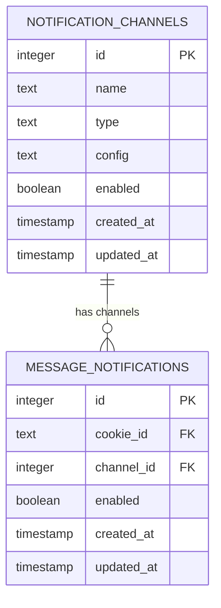
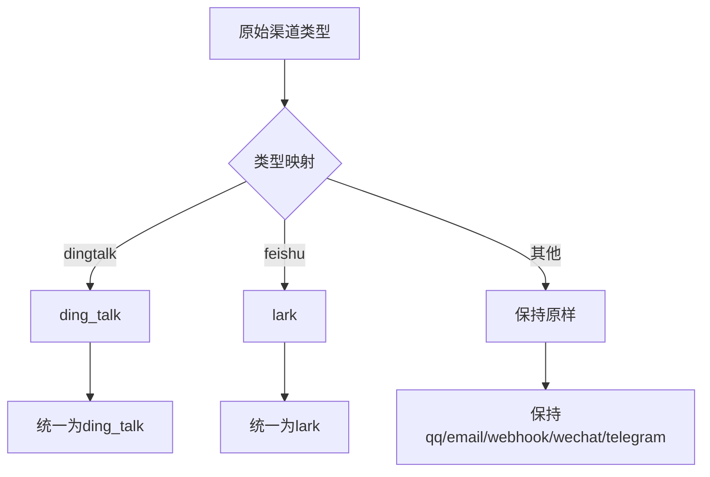
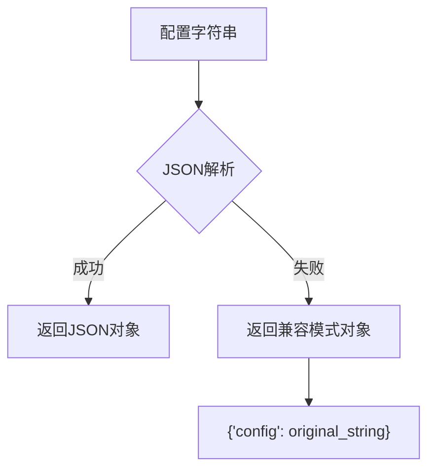
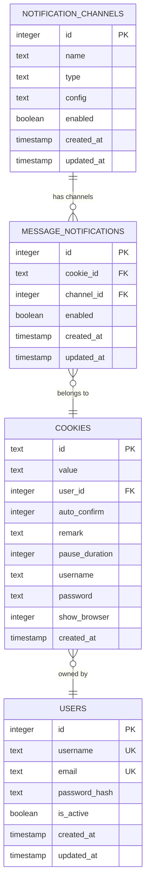
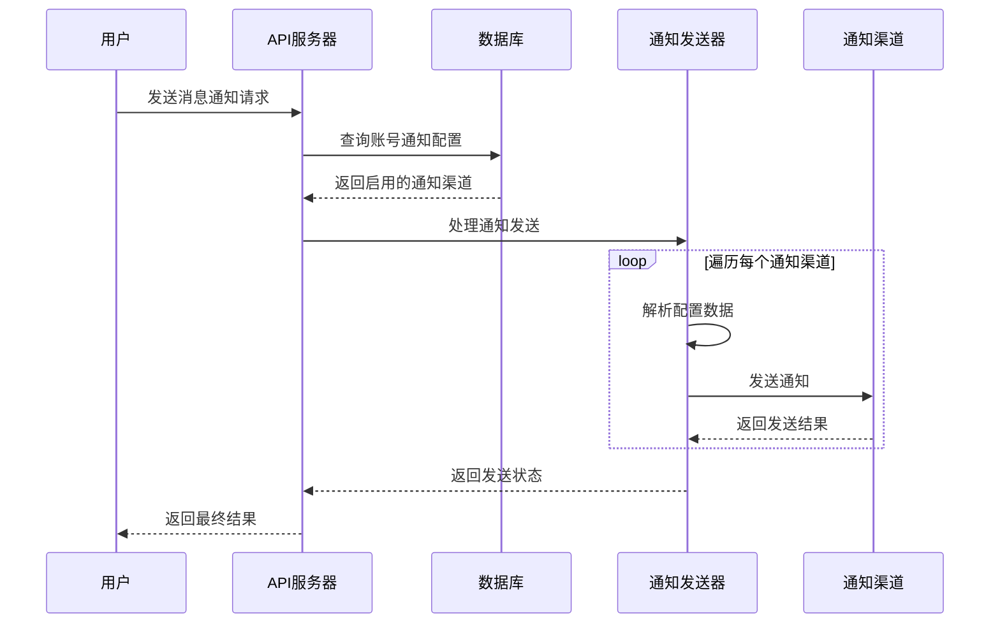
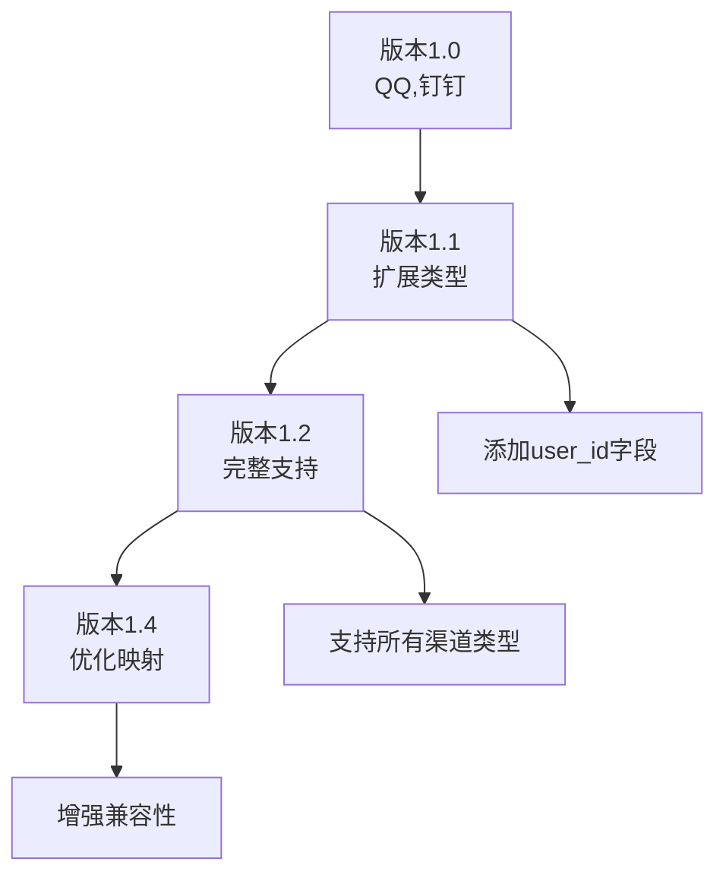

# 通知渠道表（notification_channels）详细文档

<cite>
**本文档引用的文件**
- [db_manager.py](file://db_manager.py)
- [XianyuAutoAsync.py](file://XianyuAutoAsync.py)
- [reply_server.py](file://reply_server.py)
- [app.js](file://static/js/app.js)
</cite>

## 目录
1. [简介](#简介)
2. [表结构设计](#表结构设计)
3. [字段详细说明](#字段详细说明)
4. [支持的通知渠道类型](#支持的通知渠道类型)
5. [配置结构详解](#配置结构详解)
6. [数据库架构分析](#数据库架构分析)
7. [业务逻辑实现](#业务逻辑实现)
8. [版本演进历程](#版本演进历程)
9. [最佳实践建议](#最佳实践建议)
10. [故障排除指南](#故障排除指南)

## 简介

通知渠道表（notification_channels）是闲鱼自动回复系统的核心组件之一，负责管理各种通知渠道的配置信息。该表支持多种通知方式，包括QQ、钉钉、飞书、Bark、邮件、Webhook、微信、Telegram等，为系统提供了灵活的通知机制。

## 表结构设计

### 基本表结构



**图表来源**
- [db_manager.py](file://db_manager.py#L355-L366)
- [db_manager.py](file://db_manager.py#L378-L391)

**章节来源**
- [db_manager.py](file://db_manager.py#L355-L366)

## 字段详细说明

### 主键字段

#### id
- **类型**: INTEGER PRIMARY KEY AUTOINCREMENT
- **作用**: 通知渠道的唯一标识符
- **特点**: 自动递增，确保每个渠道都有唯一的ID
- **用途**: 外键关联其他表，如message_notifications表

### 基础配置字段

#### name
- **类型**: TEXT NOT NULL
- **作用**: 通知渠道的显示名称
- **特点**: 必填字段，用于在用户界面中识别渠道
- **示例**: "工作群通知"、"个人QQ"、"邮件通知"

#### type
- **类型**: TEXT NOT NULL CHECK (type IN (...))
- **作用**: 通知渠道类型标识
- **约束**: 通过CHECK约束限制为预定义的枚举值
- **重要性**: 决定使用哪种通知发送逻辑

#### config
- **类型**: TEXT NOT NULL
- **作用**: JSON格式的渠道配置信息
- **特点**: 存储具体的连接参数和配置信息
- **格式**: JSON字符串，包含各种渠道特定的配置项

### 状态控制字段

#### enabled
- **类型**: BOOLEAN DEFAULT TRUE
- **作用**: 控制通知渠道的启用状态
- **默认值**: TRUE（启用状态）
- **用途**: 动态启用或禁用通知渠道

### 时间戳字段

#### created_at
- **类型**: TIMESTAMP DEFAULT CURRENT_TIMESTAMP
- **作用**: 记录渠道创建时间
- **特点**: 自动生成时间戳
- **用途**: 跟踪渠道生命周期

#### updated_at
- **类型**: TIMESTAMP DEFAULT CURRENT_TIMESTAMP
- **作用**: 记录渠道最后更新时间
- **特点**: 自动生成时间戳
- **用途**: 监控配置变更

**章节来源**
- [db_manager.py](file://db_manager.py#L355-L366)

## 支持的通知渠道类型

### 当前支持的渠道类型

根据数据库表结构和代码实现，当前支持以下通知渠道类型：

| 渠道类型 | 枚举值 | 描述 |
|---------|--------|------|
| QQ通知 | `qq` | 通过QQ私聊发送通知 |
| 钉钉通知 | `ding_talk` | 钉钉群机器人通知 |
| 飞书通知 | `feishu` | 飞书群机器人通知 |
| Bark通知 | `bark` | iOS设备推送通知 |
| 邮件通知 | `email` | SMTP邮件通知 |
| Webhook通知 | `webhook` | HTTP回调通知 |
| 微信通知 | `wechat` | 企业微信机器人通知 |
| Telegram通知 | `telegram` | Telegram机器人通知 |

### 渠道类型映射关系



**图表来源**
- [db_manager.py](file://db_manager.py#L776-L784)

**章节来源**
- [db_manager.py](file://db_manager.py#L359-L360)

## 配置结构详解

### JSON配置格式规范

通知渠道的config字段采用JSON格式存储配置信息，不同渠道的配置结构如下：

#### QQ通知配置
```json
{
  "qq_number": "123456789",
  "config": "123456789"
}
```

#### 钉钉通知配置
```json
{
  "webhook_url": "https://oapi.dingtalk.com/robot/send?access_token=xxx",
  "secret": "SECxxx"
}
```

#### 飞书通知配置
```json
{
  "webhook_url": "https://open.feishu.cn/open_api/message/send",
  "secret": "your-sign-secret"
}
```

#### Bark通知配置
```json
{
  "server_url": "https://api.day.app",
  "device_key": "your-device-key",
  "title": "闲鱼自动回复通知",
  "sound": "default",
  "icon": "",
  "group": "xianyu",
  "url": ""
}
```

#### 邮件通知配置
```json
{
  "smtp_server": "smtp.gmail.com",
  "smtp_port": 587,
  "email_user": "your-email@gmail.com",
  "email_password": "your-password-or-app-password",
  "recipient_email": "recipient@example.com",
  "smtp_use_tls": true,
  "smtp_use_ssl": false,
  "smtp_from": "Your Name"
}
```

#### Webhook通知配置
```json
{
  "webhook_url": "https://your-webhook-endpoint.com",
  "http_method": "POST",
  "headers": "{\"Authorization\": \"Bearer token\", \"Content-Type\": \"application/json\"}"
}
```

#### 微信通知配置
```json
{
  "webhook_url": "https://qyapi.weixin.qq.com/cgi-bin/webhook/send?key=your-key"
}
```

#### Telegram通知配置
```json
{
  "bot_token": "123456789:ABCdefGHIjklMNOpqrsTUVwxyz",
  "chat_id": "123456789"
}
```

### 配置解析机制

系统通过`_parse_notification_config`方法解析配置：



**图表来源**
- [XianyuAutoAsync.py](file://XianyuAutoAsync.py#L3540-L3548)

**章节来源**
- [XianyuAutoAsync.py](file://XianyuAutoAsync.py#L3540-L3548)

## 数据库架构分析

### 表间关系



**图表来源**
- [db_manager.py](file://db_manager.py#L355-L366)
- [db_manager.py](file://db_manager.py#L378-L391)

### 外键约束分析

#### notification_channels表
- **主键**: id (INTEGER PRIMARY KEY AUTOINCREMENT)
- **CHECK约束**: type字段限制为预定义的枚举值
- **级联删除**: 无直接级联删除

#### message_notifications表
- **主键**: id (INTEGER PRIMARY KEY AUTOINCREMENT)
- **外键**: channel_id REFERENCES notification_channels(id) ON DELETE CASCADE
- **外键**: cookie_id REFERENCES cookies(id) ON DELETE CASCADE
- **唯一约束**: (cookie_id, channel_id)

**章节来源**
- [db_manager.py](file://db_manager.py#L378-L391)

## 业务逻辑实现

### 通知发送流程



**图表来源**
- [XianyuAutoAsync.py](file://XianyuAutoAsync.py#L3420-L3538)
- [reply_server.py](file://reply_server.py#L2584-L2606)

### 通知渠道管理API

系统提供了完整的RESTful API用于管理通知渠道：

#### 创建通知渠道
```python
@app.post('/notification-channels')
def create_notification_channel(channel_data: NotificationChannelCreate, current_user: Dict[str, Any] = Depends(get_current_user)):
    # 实现创建通知渠道的逻辑
```

#### 更新通知渠道
```python
@app.put('/notification-channels/{channel_id}')
def update_notification_channel(channel_id: int, channel_data: NotificationChannelUpdate, current_user: Dict[str, Any] = Depends(get_current_user)):
    # 实现更新通知渠道的逻辑
```

#### 删除通知渠道
```python
@app.delete('/notification-channels/{channel_id}')
def delete_notification_channel(channel_id: int, current_user: Dict[str, Any] = Depends(get_current_user)):
    # 实现删除通知渠道的逻辑
```

**章节来源**
- [reply_server.py](file://reply_server.py#L2509-L2528)

## 版本演进历程

### 数据库版本升级历史

系统通过数据库版本管理机制实现了通知渠道表的逐步完善：

#### 版本1.0
- 初始版本，支持基本的QQ和钉钉通知
- 表结构简单，仅包含基础字段

#### 版本1.1
- 扩展type字段约束，支持更多渠道类型
- 添加user_id字段支持多用户管理

#### 版本1.2
- 支持完整的渠道类型集合
- 包含所有主流通知渠道

#### 版本1.4
- 进一步优化渠道类型映射
- 增强向后兼容性



**图表来源**
- [db_manager.py](file://db_manager.py#L564-L597)

**章节来源**
- [db_manager.py](file://db_manager.py#L564-L597)

## 最佳实践建议

### 配置管理最佳实践

1. **配置验证**
   - 在保存配置前验证必需字段
   - 测试配置的有效性
   - 提供配置模板

2. **安全性考虑**
   - 敏感信息加密存储
   - 定期轮换密钥
   - 访问权限控制

3. **性能优化**
   - 缓存配置信息
   - 异步发送通知
   - 错误重试机制

### 监控和维护

1. **状态监控**
   - 定期检查通知渠道状态
   - 监控发送成功率
   - 记录发送时间

2. **日志记录**
   - 详细记录发送过程
   - 错误信息完整
   - 性能指标跟踪

## 故障排除指南

### 常见问题及解决方案

#### 1. 通知发送失败
**症状**: 通知渠道配置正确但无法发送
**排查步骤**:
- 检查网络连接
- 验证配置参数
- 查看错误日志

#### 2. 配置格式错误
**症状**: JSON解析失败
**解决方案**:
- 使用在线JSON验证工具
- 检查特殊字符转义
- 验证必需字段

#### 3. 权限问题
**症状**: 无法访问通知渠道
**解决方案**:
- 检查用户权限
- 验证外键关联
- 确认数据完整性

### 调试技巧

1. **启用详细日志**
   ```python
   logger.setLevel(logging.DEBUG)
   ```

2. **配置测试**
   - 使用简单的测试消息
   - 分步骤验证配置
   - 对比成功案例

3. **网络诊断**
   - 测试目标服务可达性
   - 检查防火墙设置
   - 验证SSL证书

**章节来源**
- [XianyuAutoAsync.py](file://XianyuAutoAsync.py#L3530-L3538)

## 结论

通知渠道表（notification_channels）作为闲鱼自动回复系统的重要组成部分，通过精心设计的表结构和灵活的配置机制，为系统提供了强大的多渠道通知能力。其支持的丰富渠道类型、完善的版本演进、以及健壮的业务逻辑，确保了系统能够适应各种通知需求场景。

随着系统的不断发展，该表将继续演进，支持更多的通知渠道和更复杂的配置需求，为用户提供更加便捷和可靠的通知体验。