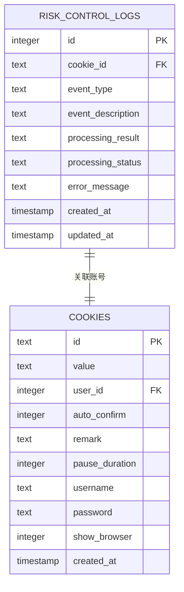
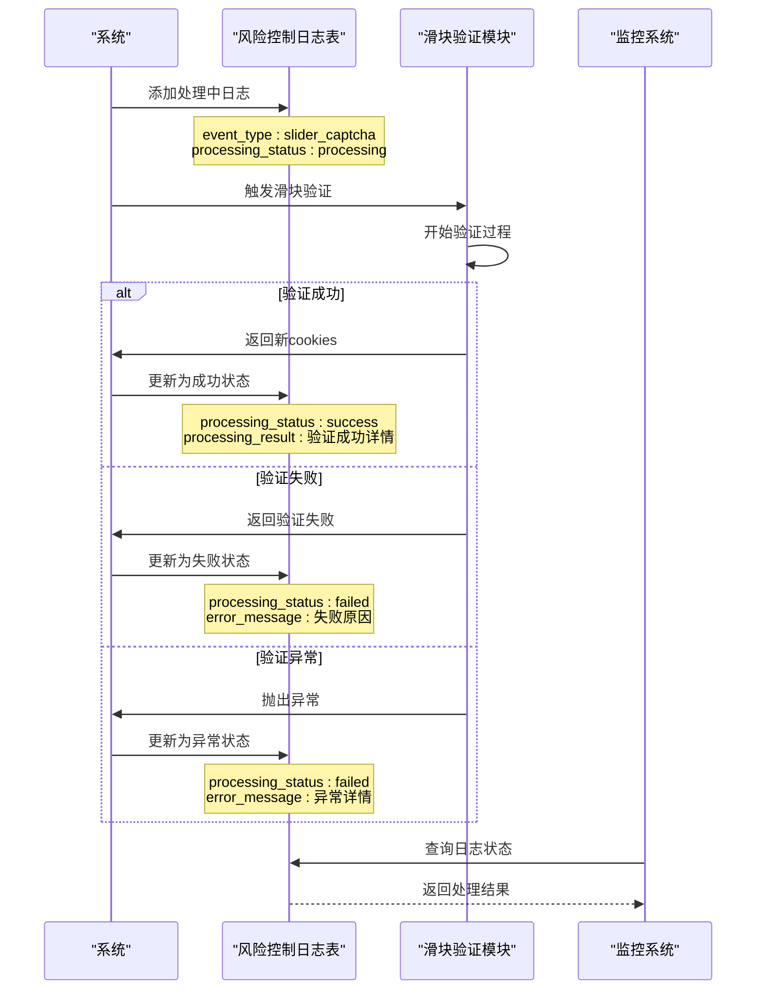
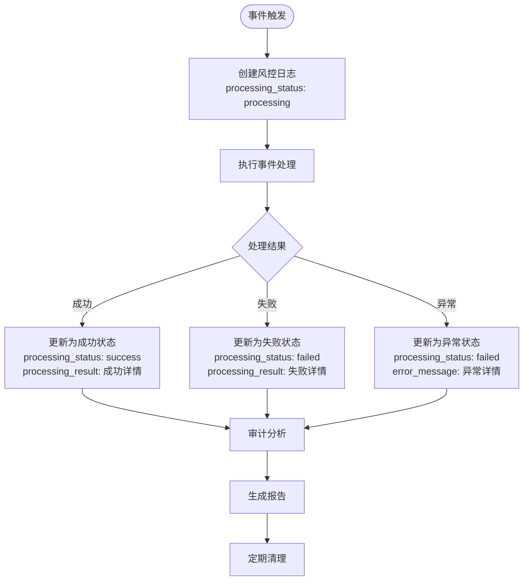

# 风控日志表（risk_control_logs）详细文档

<cite>
**本文档引用的文件**
- [db_manager.py](file://db_manager.py)
- [XianyuAutoAsync.py](file://XianyuAutoAsync.py)
- [reply_server.py](file://reply_server.py)
- [app.js](file://static/js/app.js)
- [index.html](file://static/index.html)
</cite>

## 目录
1. [简介](#简介)
2. [表结构设计](#表结构设计)
3. [核心字段详解](#核心字段详解)
4. [业务流程分析](#业务流程分析)
5. [前端管理界面](#前端管理界面)
6. [API接口设计](#api接口设计)
7. [数据清理机制](#数据清理机制)
8. [安全审计功能](#安全审计功能)
9. [最佳实践建议](#最佳实践建议)

## 简介

风控日志表（risk_control_logs）是该自动化系统的核心监控组件，专门用于记录和跟踪所有关键风控事件，特别是滑块验证、登录异常等安全相关操作。该表为系统提供了完整的审计轨迹，支持异常排查、安全分析和系统优化。

## 表结构设计

### SQL DDL创建语句

```sql
CREATE TABLE IF NOT EXISTS risk_control_logs (
    id INTEGER PRIMARY KEY AUTOINCREMENT,
    cookie_id TEXT NOT NULL,
    event_type TEXT NOT NULL DEFAULT 'slider_captcha',
    event_description TEXT,
    processing_result TEXT,
    processing_status TEXT DEFAULT 'processing',
    error_message TEXT,
    created_at TIMESTAMP DEFAULT CURRENT_TIMESTAMP,
    updated_at TIMESTAMP DEFAULT CURRENT_TIMESTAMP,
    FOREIGN KEY (cookie_id) REFERENCES cookies(id) ON DELETE CASCADE
)
```

### 结构图



**图表来源**
- [db_manager.py](file://db_manager.py#L408-L421)

**节来源**
- [db_manager.py](file://db_manager.py#L408-L421)

## 核心字段详解

### 主键字段 - id
- **类型**: INTEGER PRIMARY KEY AUTOINCREMENT
- **作用**: 唯一标识每条风控日志记录
- **特点**: 自动递增，确保每条记录的唯一性
- **用途**: 支持日志的精确查询和删除操作

### 关联字段 - cookie_id
- **类型**: TEXT NOT NULL
- **作用**: 关联到cookies表，标识产生该日志的用户账号
- **外键约束**: REFERENCES cookies(id) ON DELETE CASCADE
- **意义**: 实现日志数据的可追溯性，支持按账号维度进行审计分析

### 事件类型 - event_type
- **类型**: TEXT NOT NULL DEFAULT 'slider_captcha'
- **默认值**: slider_captcha
- **常见取值**: 
  - `slider_captcha`: 滑块验证事件
  - 其他可能的值（根据业务扩展）
- **作用**: 标识风控事件的具体类型，便于分类统计和分析

### 事件描述 - event_description
- **类型**: TEXT
- **作用**: 详细描述事件发生的具体情况
- **示例**: `"检测到需要滑块验证，触发场景: Token刷新, URL: https://example.com"`
- **重要性**: 为异常排查提供上下文信息

### 处理结果 - processing_result
- **类型**: TEXT
- **作用**: 记录事件处理的最终结果
- **示例**: 
  - `"滑块验证成功，耗时: 2.45秒, cookies长度: 128"`
  - `"滑块验证失败，耗时: 3.12秒, 原因: 未获取到新cookies"`
- **价值**: 支持性能分析和成功率统计

### 处理状态 - processing_status
- **类型**: TEXT DEFAULT 'processing'
- **默认值**: processing
- **可能取值**:
  - `processing`: 处理中
  - `success`: 处理成功
  - `failed`: 处理失败
- **作用**: 实时反映事件处理进度，支持状态监控

### 错误信息 - error_message
- **类型**: TEXT
- **作用**: 记录处理过程中遇到的错误详情
- **示例**: `"滑块验证处理异常: TimeoutError: 操作超时"`
- **重要性**: 为故障诊断提供关键线索

### 时间戳字段
- **created_at**: TIMESTAMP DEFAULT CURRENT_TIMESTAMP
  - **作用**: 记录日志创建时间
  - **用途**: 支持时间序列分析和趋势监控
- **updated_at**: TIMESTAMP DEFAULT CURRENT_TIMESTAMP
  - **作用**: 记录日志最后更新时间
  - **自动更新**: 在更新操作时自动设置为当前时间

**节来源**
- [db_manager.py](file://db_manager.py#L408-L421)

## 业务流程分析

### 滑块验证事件处理流程



**图表来源**
- [XianyuAutoAsync.py](file://XianyuAutoAsync.py#L1507-L1587)
- [db_manager.py](file://db_manager.py#L4829-L4906)

### 完整事件生命周期



**图表来源**
- [XianyuAutoAsync.py](file://XianyuAutoAsync.py#L1507-L1587)

**节来源**
- [XianyuAutoAsync.py](file://XianyuAutoAsync.py#L1507-L1587)

## 前端管理界面

### 日志列表展示

前端提供了完整的风控日志管理界面，支持实时监控和历史分析：

#### 功能特性
- **实时刷新**: 支持手动刷新日志列表
- **分页浏览**: 支持大数据量的分页显示
- **条件筛选**: 支持按账号、状态、时间范围筛选
- **状态标签**: 直观的状态标识（处理中、成功、失败）

#### 界面元素

| 字段 | 宽度 | 描述 |
|------|------|------|
| 时间 | 120px | 创建时间，格式化显示 |
| 账号 | 100px | 关联的cookie_id |
| 事件类型 | 100px | 如slider_captcha |
| 状态 | 80px | 处理状态标签 |
| 事件描述 | 自适应 | 详细事件信息 |
| 处理结果 | 自适应 | 处理结果详情 |
| 操作 | 80px | 删除按钮 |

### 管理功能

#### 日志清理
- **批量删除**: 支持删除单条或多条日志
- **清空功能**: 管理员可清空所有风控日志
- **权限控制**: 仅管理员可执行删除操作

#### 数据导出
- **下载功能**: 支持将日志导出为文件
- **格式支持**: JSON格式，便于数据分析

**节来源**
- [app.js](file://static/js/app.js#L10426-L10662)
- [index.html](file://static/index.html#L1503-L1590)

## API接口设计

### 获取风控日志

```python
@app.get("/risk-control-logs")
async def get_risk_control_logs(
    cookie_id: str = None,
    limit: int = 100,
    offset: int = 0,
    admin_user: Dict[str, Any] = Depends(require_admin)
):
    """获取风控日志（管理员专用）"""
```

#### 参数说明
- **cookie_id**: 可选，按账号筛选
- **limit**: 可选，默认100，限制返回数量
- **offset**: 可选，默认0，分页偏移量
- **权限**: 需要管理员权限

#### 返回格式
```json
{
    "success": true,
    "data": [...],
    "total": 1000,
    "limit": 100,
    "offset": 0
}
```

### 删除风控日志

```python
@app.delete("/risk-control-logs/{log_id}")
async def delete_risk_control_log(
    log_id: int,
    admin_user: Dict[str, Any] = Depends(require_admin)
):
    """删除风控日志记录（管理员专用）"""
```

#### 权限要求
- 仅管理员用户可访问
- 提供详细的错误信息反馈

**节来源**
- [reply_server.py](file://reply_server.py#L4423-L4478)

## 数据清理机制

### 自动清理策略

系统实现了智能的数据清理机制，防止数据库无限增长：

```python
def cleanup_old_data(self, days: int = 90) -> dict:
    """清理过期的历史数据，防止数据库无限增长"""
```

#### 清理规则

| 表名 | 保留期限 | 清理条件 |
|------|----------|----------|
| risk_control_logs | 90天 | created_at < datetime('now', '-90 days') |
| ai_conversations | 90天 | created_at < datetime('now', '-90 days') |
| ai_item_cache | 最大30天 | last_updated < datetime('now', '-min(days, 30) days') |
| captcha_codes | 1天 | created_at < datetime('now', '-1 day') |
| email_verifications | 7天 | created_at < datetime('now', '-7 days') |

### VACUUM优化

- **触发条件**: 当清理超过100条记录时
- **目的**: 释放磁盘空间，优化数据库性能
- **执行时机**: 清理操作完成后自动执行

**节来源**
- [db_manager.py](file://db_manager.py#L4998-L5095)

## 安全审计功能

### 异常监控能力

#### 滑块验证异常检测
- **检测点**: Token刷新、登录请求等关键节点
- **监控指标**: 
  - 验证成功率
  - 处理耗时分布
  - 失败原因统计
  - 异常频率分析

#### 登录异常追踪
- **异常类型**:
  - 频繁滑块验证
  - 长时间处理超时
  - 重复失败模式
  - IP异常行为

### 审计分析支持

#### 统计报表
- **每日/每周统计**: 各类事件的发生频率
- **成功率分析**: 不同事件类型的处理成功率
- **性能监控**: 处理时间分布和异常趋势
- **账号维度**: 按账号统计异常行为

#### 安全告警
- **阈值监控**: 异常频率超过阈值时触发告警
- **实时通知**: 关键安全事件的即时通知
- **趋势分析**: 异常模式的识别和预测

### 可追溯性保证

#### 数据完整性
- **外键约束**: 与cookies表的级联删除保证数据一致性
- **时间戳**: 精确的时间记录支持事件重放
- **状态链**: 完整的事件处理状态变化记录

#### 审计轨迹
- **操作记录**: 所有日志变更都有完整的审计轨迹
- **责任追踪**: 通过cookie_id可追溯到具体用户
- **合规支持**: 符合安全审计的合规要求

## 最佳实践建议

### 数据管理建议

#### 日志保留策略
- **短期保留**: 30天内的重要事件日志
- **中期归档**: 3个月内的完整日志备份
- **长期保存**: 1年以上的关键安全事件记录

#### 性能优化
- **索引策略**: 在cookie_id和created_at字段上建立索引
- **分区表**: 对于大规模数据，考虑按时间分区
- **读写分离**: 读密集场景下实现读写分离

### 监控告警配置

#### 关键指标监控
- **异常率**: 滑块验证失败率超过5%
- **响应时间**: 平均处理时间超过3秒
- **频率异常**: 单账号异常频率超过阈值

#### 告警策略
- **分级告警**: 根据严重程度设置不同级别的告警
- **聚合通知**: 避免告警风暴，适当聚合通知
- **自动恢复**: 设置合理的自动恢复机制

### 安全加固措施

#### 访问控制
- **最小权限**: 仅授权必要人员访问风控日志
- **操作审计**: 记录所有日志访问和操作行为
- **加密传输**: 敏感日志数据的传输加密

#### 数据保护
- **脱敏处理**: 敏感信息的日志脱敏
- **备份策略**: 定期备份风控日志数据
- **灾难恢复**: 建立完善的日志数据恢复机制

通过以上详细的风控日志表设计和实现，系统能够提供全面的安全监控和审计能力，为自动化操作的安全性和可靠性提供坚实保障。