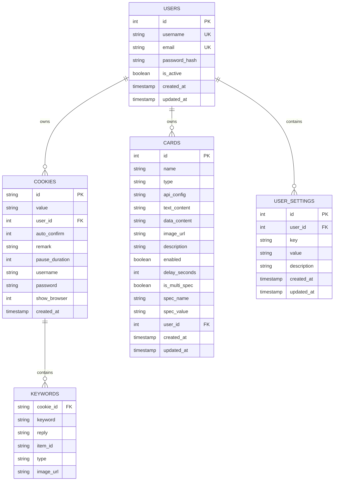
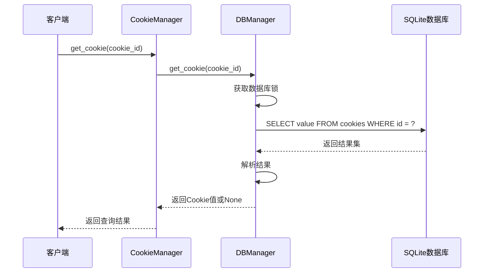
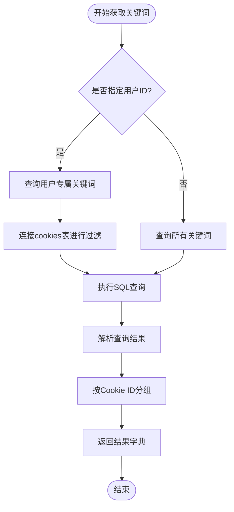
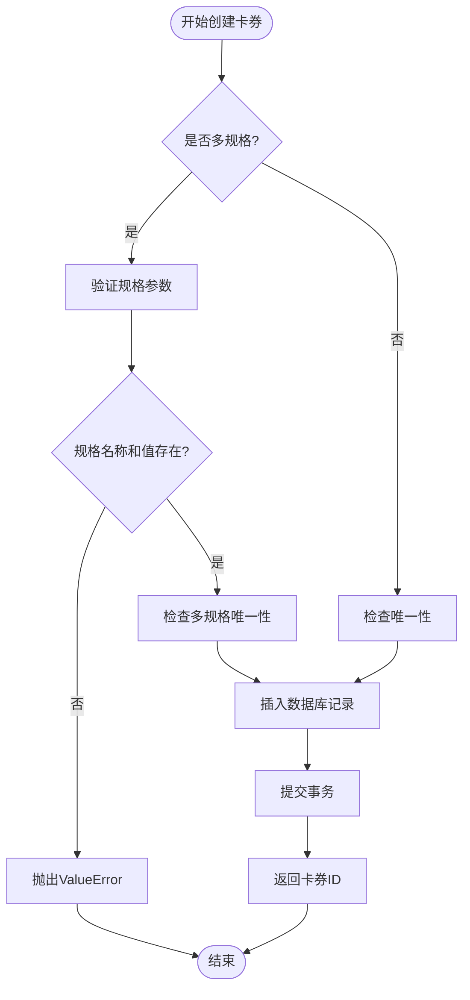
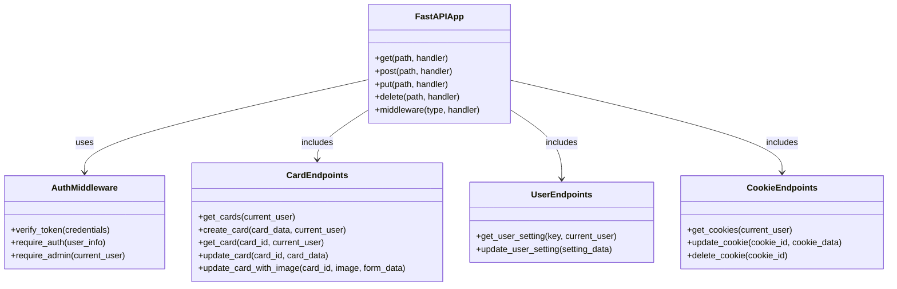
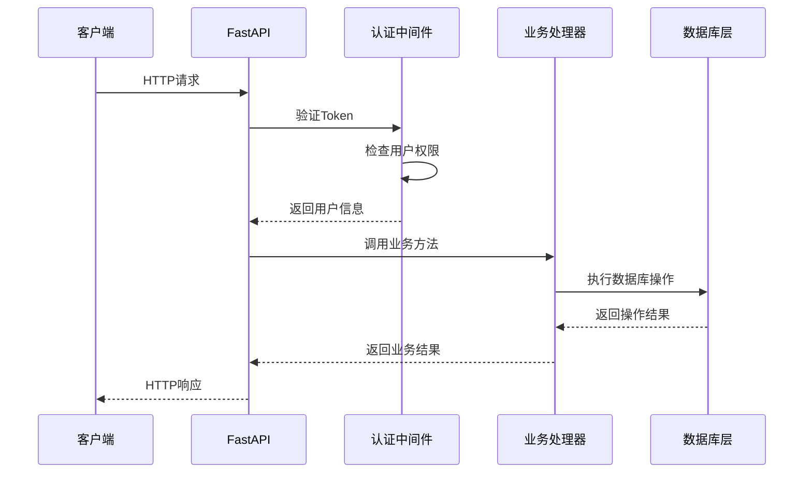
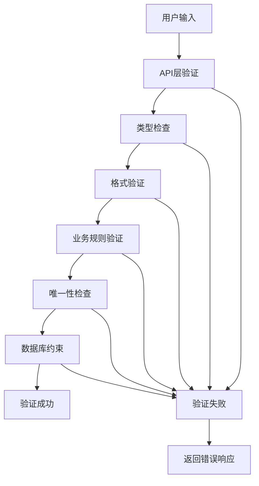
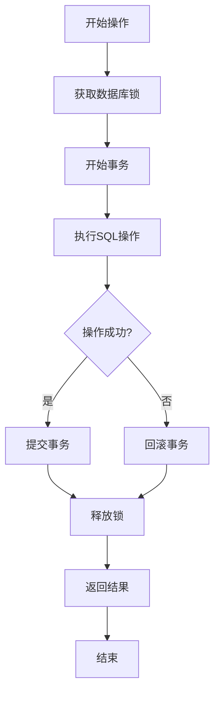
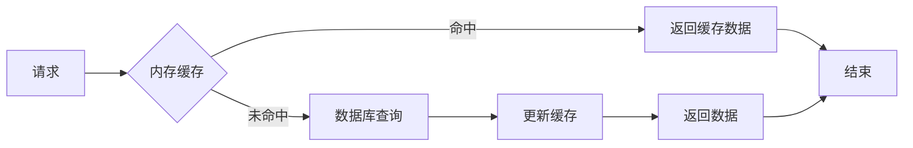

# CRUD操作文档

<cite>
**本文档引用的文件**
- [db_manager.py](file://db_manager.py)
- [reply_server.py](file://reply_server.py)
- [cookie_manager.py](file://cookie_manager.py)
- [config.py](file://config.py)
</cite>

## 目录
1. [简介](#简介)
2. [数据库架构概述](#数据库架构概述)
3. [核心CRUD方法分析](#核心crud方法分析)
4. [HTTP API接口设计](#http-api接口设计)
5. [数据验证与清洗流程](#数据验证与清洗流程)
6. [错误处理与事务管理](#错误处理与事务管理)
7. [实体CRUD接口设计原则](#实体crud接口设计原则)
8. [实际代码示例](#实际代码示例)
9. [性能优化建议](#性能优化建议)
10. [故障排除指南](#故障排除指南)

## 简介

本文档详细说明了闲鱼自动回复系统中的CRUD（创建、读取、更新、删除）操作实现模式。该系统采用SQLite数据库作为主要存储引擎，通过Python实现了一套完整的RESTful API服务，支持多用户、多账号的自动化管理。

系统的核心设计理念是：
- **线程安全**：使用可重入锁保护数据库操作
- **事务一致性**：确保数据操作的原子性和完整性
- **用户隔离**：支持多租户数据隔离
- **错误恢复**：完善的异常处理和回滚机制

## 数据库架构概述

系统采用关系型数据库设计，主要包含以下核心表结构：



**图表来源**
- [db_manager.py](file://db_manager.py#L73-L216)

**章节来源**
- [db_manager.py](file://db_manager.py#L67-L447)

## 核心CRUD方法分析

### get_cookie() - 通过ID查询账号信息

`get_cookie()`方法实现了基于Cookie ID的精确查询功能，是系统中最常用的查询操作之一。



**图表来源**
- [db_manager.py](file://db_manager.py#L1212-L1222)
- [cookie_manager.py](file://cookie_manager.py#L289)

**实现特点：**
- **线程安全**：使用数据库锁防止并发冲突
- **错误处理**：捕获异常并返回None而非抛出异常
- **性能优化**：直接返回字符串值，减少对象创建开销

**章节来源**
- [db_manager.py](file://db_manager.py#L1212-L1222)

### get_all_keywords() - 获取所有关键词规则

该方法支持按用户ID过滤，实现真正的多租户隔离。



**图表来源**
- [db_manager.py](file://db_manager.py#L1694-L1719)

**数据结构设计：**
- **返回格式**：`Dict[str, List[Tuple[str, str]]]`
- **键**：Cookie ID
- **值**：关键词-回复对列表
- **分组逻辑**：相同Cookie ID的关键词归为一组

**章节来源**
- [db_manager.py](file://db_manager.py#L1694-L1719)

### create_card() - 插入新卡券记录

卡券创建方法支持多规格功能，具有复杂的业务逻辑验证。



**图表来源**
- [db_manager.py](file://db_manager.py#L2835-L2895)

**业务验证规则：**
- **单规格验证**：卡券名称唯一
- **多规格验证**：卡券名称+规格名称+规格值组合唯一
- **参数验证**：多规格必须提供规格名称和值
- **数据类型**：API配置支持字典转JSON字符串

**章节来源**
- [db_manager.py](file://db_manager.py#L2835-L2895)

## HTTP API接口设计

### reply_server.py中的API层

系统采用FastAPI框架构建RESTful API，提供了完整的CRUD接口。



**图表来源**
- [reply_server.py](file://reply_server.py#L308-L320)

### API调用流程



**图表来源**
- [reply_server.py](file://reply_server.py#L331-L356)

**章节来源**
- [reply_server.py](file://reply_server.py#L3610-L3660)

## 数据验证与清洗流程

### 输入验证策略

系统在多个层面实施数据验证：

1. **API层验证**：使用Pydantic模型进行数据类型和格式验证
2. **业务层验证**：执行业务规则检查
3. **数据库层验证**：利用SQLite约束保证数据完整性



**图表来源**
- [reply_server.py](file://reply_server.py#L3620-L3655)

### 数据清洗示例

```python
# 卡券创建时的数据清洗流程
def create_card(card_data: dict, current_user: Dict[str, Any]):
    # 1. 参数验证
    is_multi_spec = card_data.get('is_multi_spec', False)
    if is_multi_spec:
        if not card_data.get('spec_name') or not card_data.get('spec_value'):
            raise HTTPException(status_code=400, detail="多规格卡券必须提供规格名称和规格值")
    
    # 2. 数据转换
    api_config = card_data.get('api_config')
    if isinstance(api_config, dict):
        import json
        api_config = json.dumps(api_config)
    
    # 3. 业务逻辑处理
    user_id = current_user['user_id']
    
    # 4. 数据库操作
    card_id = db_manager.create_card(
        name=card_data.get('name'),
        card_type=card_data.get('type'),
        api_config=api_config,
        # ... 其他参数
        user_id=user_id
    )
```

**章节来源**
- [reply_server.py](file://reply_server.py#L3620-L3655)

## 错误处理与事务管理

### 事务边界设计

系统采用显式事务管理模式，确保数据一致性：



**图表来源**
- [db_manager.py](file://db_manager.py#L1767-L1795)

### 错误处理模式

系统实现了多层次的错误处理机制：

| 层级 | 处理策略 | 示例 |
|------|----------|------|
| 数据库层 | 异常捕获和回滚 | `try-except`块 + `rollback()` |
| 业务层 | 业务异常和状态码 | `HTTPException` + 4xx/5xx状态码 |
| API层 | 统一错误响应 | 标准化的错误消息格式 |
| 应用层 | 日志记录和监控 | 结构化日志输出 |

**章节来源**
- [db_manager.py](file://db_manager.py#L1767-L1795)

## 实体CRUD接口设计原则

### 设计原则总结

1. **单一职责**：每个方法专注于特定的CRUD操作
2. **幂等性**：GET、PUT、DELETE操作具有幂等性
3. **一致性**：返回格式统一，错误处理一致
4. **安全性**：用户隔离，权限控制
5. **可扩展性**：支持未来功能扩展

### 接口规范

| 操作 | HTTP方法 | 路径模式 | 请求体 | 响应格式 | 权限要求 |
|------|----------|----------|--------|----------|----------|
| 获取卡券列表 | GET | `/cards` | 无 | `[Card]` | 用户认证 |
| 创建卡券 | POST | `/cards` | `CardCreate` | `{id: int, message: string}` | 用户认证 |
| 获取单个卡券 | GET | `/cards/{id}` | 无 | `Card` | 用户认证 |
| 更新卡券 | PUT | `/cards/{id}` | `CardUpdate` | `{message: string}` | 用户认证 |
| 删除卡券 | DELETE | `/cards/{id}` | 无 | `{message: string}` | 用户认证 |

### 返回值规范

```python
# 成功响应格式
{
    "success": true,
    "data": {...},
    "message": "操作成功"
}

# 错误响应格式  
{
    "success": false,
    "error": {
        "code": "VALIDATION_ERROR",
        "message": "具体的错误信息",
        "details": {...}
    }
}
```

**章节来源**
- [reply_server.py](file://reply_server.py#L3610-L3770)

## 实际代码示例

### 典型CRUD操作调用

#### 创建卡券示例

```python
# API端点调用
@app.post("/cards")
def create_card(card_data: dict, current_user: Dict[str, Any] = Depends(get_current_user)):
    try:
        from db_manager import db_manager
        user_id = current_user['user_id']
        
        # 数据验证
        is_multi_spec = card_data.get('is_multi_spec', False)
        if is_multi_spec:
            if not card_data.get('spec_name') or not card_data.get('spec_value'):
                raise HTTPException(status_code=400, detail="多规格卡券必须提供规格名称和规格值")
        
        # 数据库操作
        card_id = db_manager.create_card(
            name=card_data.get('name'),
            card_type=card_data.get('type'),
            api_config=card_data.get('api_config'),
            text_content=card_data.get('text_content'),
            data_content=card_data.get('data_content'),
            image_url=card_data.get('image_url'),
            description=card_data.get('description'),
            enabled=card_data.get('enabled', True),
            delay_seconds=card_data.get('delay_seconds', 0),
            is_multi_spec=is_multi_spec,
            spec_name=card_data.get('spec_name') if is_multi_spec else None,
            spec_value=card_data.get('spec_value') if is_multi_spec else None,
            user_id=user_id
        )
        
        return {"id": card_id, "message": "卡券创建成功"}
    except Exception as e:
        raise HTTPException(status_code=500, detail=str(e))
```

#### 查询用户设置示例

```python
# 获取用户特定设置
def get_user_setting(key: str, current_user: Dict[str, Any] = Depends(get_current_user)):
    from db_manager import db_manager
    try:
        user_id = current_user['user_id']
        setting = db_manager.get_user_setting(user_id, key)
        if setting:
            return setting
        else:
            raise HTTPException(status_code=404, detail='设置不存在')
    except Exception as e:
        raise HTTPException(status_code=500, detail=str(e))
```

#### 更新Cookie状态示例

```python
# 更新Cookie启用状态
def update_cookie_status(cookie_id: str, enabled: bool, current_user: Dict[str, Any]):
    try:
        from db_manager import db_manager
        
        # 权限检查
        cookie_info = db_manager.get_cookie_details(cookie_id)
        if not cookie_info or cookie_info['user_id'] != current_user['user_id']:
            raise HTTPException(status_code=403, detail="无权访问该Cookie")
        
        # 业务逻辑
        success = db_manager.save_cookie_status(cookie_id, enabled)
        if success:
            return {"message": "状态更新成功"}
        else:
            raise HTTPException(status_code=500, detail="更新失败")
    except Exception as e:
        raise HTTPException(status_code=500, detail=str(e))
```

**章节来源**
- [reply_server.py](file://reply_server.py#L3620-L3655)
- [reply_server.py](file://reply_server.py#L4655-L4666)

## 性能优化建议

### 数据库优化策略

1. **索引优化**：为经常查询的字段建立索引
2. **连接池**：使用连接池管理数据库连接
3. **批量操作**：对于大量数据操作使用批量处理
4. **缓存策略**：对频繁访问的数据实施缓存

### 缓存设计



### 性能监控指标

- **响应时间**：平均响应时间 < 100ms
- **吞吐量**：每秒处理请求数 > 1000
- **错误率**：错误请求比例 < 1%
- **资源使用**：CPU使用率 < 80%，内存使用率 < 70%

## 故障排除指南

### 常见问题及解决方案

| 问题类型 | 症状 | 可能原因 | 解决方案 |
|----------|------|----------|----------|
| 连接超时 | 数据库操作超时 | 连接池耗尽 | 增加连接池大小 |
| 死锁 | 操作被阻塞 | 并发冲突 | 优化事务边界 |
| 内存泄漏 | 内存持续增长 | 连接未释放 | 检查连接关闭逻辑 |
| 数据不一致 | 查询结果异常 | 事务未提交 | 检查事务提交逻辑 |

### 调试技巧

1. **启用SQL日志**：设置环境变量`SQL_LOG_ENABLED=true`
2. **监控数据库连接**：定期检查连接状态
3. **性能分析**：使用数据库性能分析工具
4. **错误追踪**：完善异常日志记录

### 备份与恢复

系统提供了完整的数据库备份和恢复机制：

```python
# 备份流程
def backup_database():
    # 1. 创建临时副本
    # 2. 执行VACUUM优化
    # 3. 压缩备份文件
    # 4. 验证备份完整性
    pass

# 恢复流程  
def restore_database(backup_file):
    # 1. 验证备份文件
    # 2. 备份当前数据库
    # 3. 替换数据库文件
    # 4. 验证恢复结果
    # 5. 回滚机制
    pass
```

**章节来源**
- [db_manager.py](file://db_manager.py#L5070-L5095)

## 结论

闲鱼自动回复系统的CRUD操作设计体现了现代Web应用的最佳实践：

- **架构清晰**：分层架构，职责分离
- **安全可靠**：完善的权限控制和错误处理
- **性能优异**：合理的缓存和优化策略
- **易于维护**：标准化的接口设计和文档

通过遵循本文档的设计原则和最佳实践，开发者可以构建出高质量、可扩展的CRUD应用程序。系统的模块化设计也为未来的功能扩展提供了良好的基础。