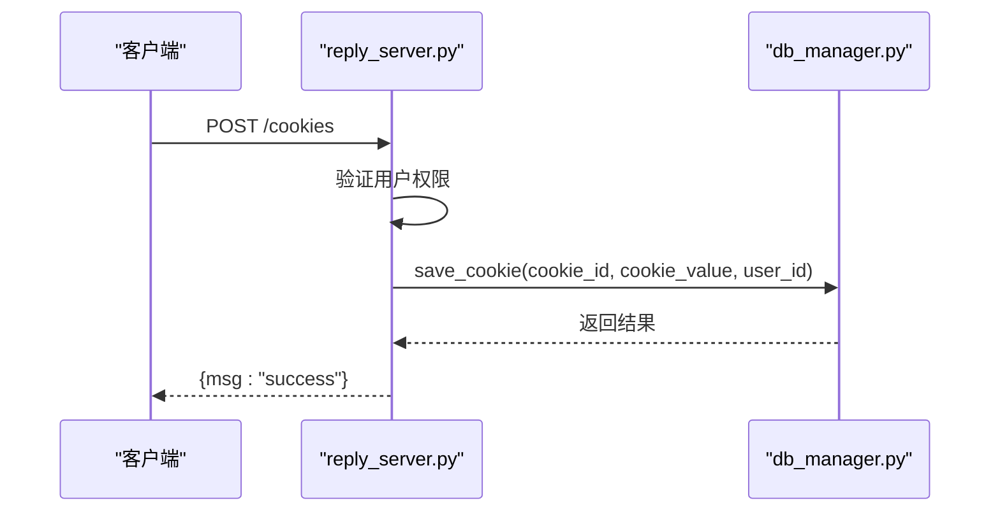
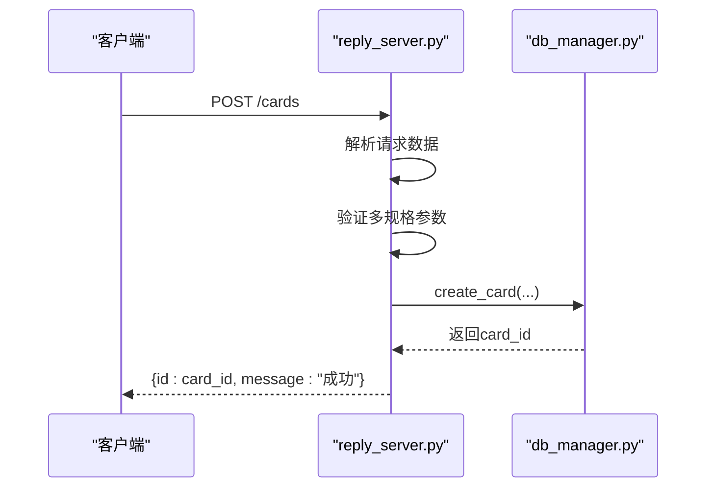
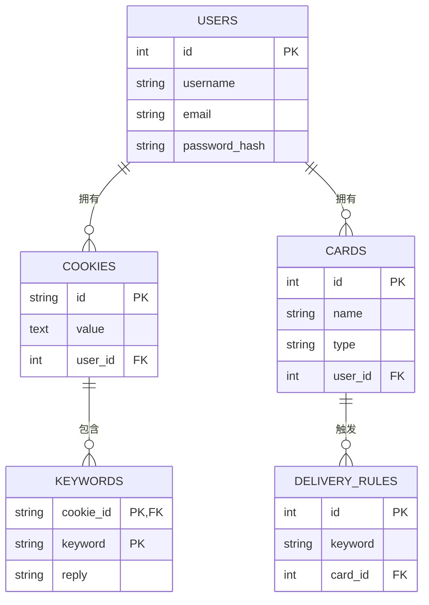

# 创建操作

<cite>
**本文档引用的文件**   
- [db_manager.py](file://db_manager.py)
- [reply_server.py](file://reply_server.py)
- [config.py](file://config.py)
</cite>

## 目录
1. [简介](#简介)
2. [数据库创建操作核心方法](#数据库创建操作核心方法)
3. [HTTP POST请求触发机制](#http-post请求触发机制)
4. [数据验证流程](#数据验证流程)
5. [事务处理机制](#事务处理机制)
6. [代码示例与错误处理](#代码示例与错误处理)

## 简介
本文档详细说明了闲鱼自动回复系统中数据库创建操作的实现机制。系统通过`db_manager.py`中的`save_cookie()`、`create_card()`和`add_keyword()`方法实现数据持久化，并通过`reply_server.py`中的HTTP POST接口接收外部请求，触发相应的创建操作。文档将深入解析数据验证、事务处理和错误处理等关键流程。

## 数据库创建操作核心方法

### save_cookie() 方法
`save_cookie()`方法用于在数据库中插入或更新闲鱼账号的Cookie信息。该方法接收`cookie_id`、`cookie_value`和可选的`user_id`参数，确保每个Cookie都与特定用户关联。方法内部使用`INSERT OR REPLACE`语句，实现了“存在则更新，不存在则插入”的逻辑，保证了数据的一致性。

**Section sources**
- [db_manager.py](file://db_manager.py#L1155-L1193)

### create_card() 方法
`create_card()`方法用于添加新的卡券记录。该方法支持多种卡券类型（API、文本、数据、图片），并允许配置延迟发货时间、多规格信息等高级功能。在插入新记录前，方法会进行严格的唯一性检查，防止创建重复的卡券。

**Section sources**
- [db_manager.py](file://db_manager.py#L2835-L2896)

### add_keyword() 方法
系统通过`update_keywords()`和`update_keywords_with_item_id()`等方法来添加关键词回复规则。这些方法接收关键词和回复内容的映射关系，并将其持久化到`keywords`表中。系统支持为特定商品ID设置关键词，实现了精细化的自动回复策略。

**Section sources**
- [db_manager.py](file://db_manager.py#L2835-L2896)

## HTTP POST请求触发机制

### 添加账号接口
`/cookies`端点的POST请求用于添加新的闲鱼账号。当客户端发送包含`id`和`value`字段的JSON数据时，`reply_server.py`中的`add_cookie()`函数会被调用。该函数首先验证用户权限，然后调用`db_manager.save_cookie()`方法将Cookie信息保存到数据库。



**Diagram sources**
- [reply_server.py](file://reply_server.py#L1182-L1214)
- [db_manager.py](file://db_manager.py#L1155-L1193)

### 添加卡券接口
`/cards`端点的POST请求用于创建新卡券。`create_card()`函数接收卡券的详细信息，如名称、类型、内容等，经过验证后调用`db_manager.create_card()`方法完成数据库插入操作。



**Diagram sources**
- [reply_server.py](file://reply_server.py#L3620-L3656)
- [db_manager.py](file://db_manager.py#L2835-L2896)

## 数据验证流程

### 输入参数检查
系统在多个层面实施输入参数检查。在HTTP接口层，使用FastAPI的`BaseModel`进行请求体验证。在业务逻辑层，`create_card()`等方法会检查`is_multi_spec`标志，确保多规格卡券提供了必要的`spec_name`和`spec_value`。

### SQL注入防护
系统通过使用参数化查询（Parameterized Queries）来有效防止SQL注入攻击。在`db_manager.py`中，所有SQL语句都使用`?`占位符，并通过`execute()`方法的安全参数传递机制执行，确保用户输入不会被解释为SQL代码。

### 数据完整性约束
数据库通过定义外键约束和CHECK约束来保证数据完整性。例如，`cards`表的`user_id`字段外键引用`users`表的`id`，确保卡券始终关联到一个有效的用户。`type`字段的CHECK约束限制了其值只能是`api`、`text`、`data`或`image`。



**Diagram sources**
- [db_manager.py](file://db_manager.py#L73-L216)

## 事务处理机制
系统使用SQLite的事务机制来确保多表操作的原子性。`DBManager`类中的`save_cookie()`和`create_card()`等方法都包裹在`with self.lock:`和数据库事务中。一旦操作开始，所有相关的数据库更改（如插入主表记录、更新关联状态）都会作为一个整体提交。如果在操作过程中发生任何异常，事务将被回滚（`conn.rollback()`），从而保证数据库不会处于不一致的状态。

**Section sources**
- [db_manager.py](file://db_manager.py#L1158-L1193)

## 代码示例与错误处理

### 典型创建操作调用
以下是一个通过HTTP API添加新卡券的Python代码示例：

```python
import requests

url = "http://localhost:8000/cards"
headers = {"Authorization": "Bearer your_token", "Content-Type": "application/json"}
data = {
    "name": "优惠券A",
    "type": "text",
    "text_content": "恭喜您获得10元优惠券！",
    "description": "新用户专享",
    "enabled": True
}

response = requests.post(url, json=data, headers=headers)
if response.status_code == 200:
    print("卡券创建成功，ID:", response.json()["id"])
else:
    print("创建失败:", response.text)
```

### 错误处理模式
系统采用分层的错误处理模式。在数据库层，方法捕获`Exception`并记录详细的错误日志，然后回滚事务并返回`False`或抛出异常。在API层，使用`try-except`块捕获业务逻辑异常，并将其转换为标准的HTTP错误响应（如400 Bad Request, 500 Internal Server Error），向客户端提供清晰的错误信息。

**Section sources**
- [reply_server.py](file://reply_server.py#L3654-L3656)
- [db_manager.py](file://db_manager.py#L1190-L1193)