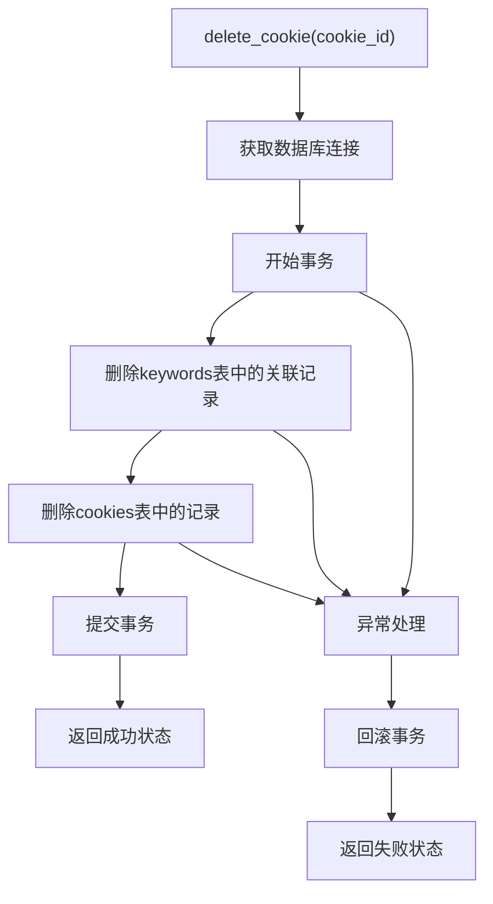
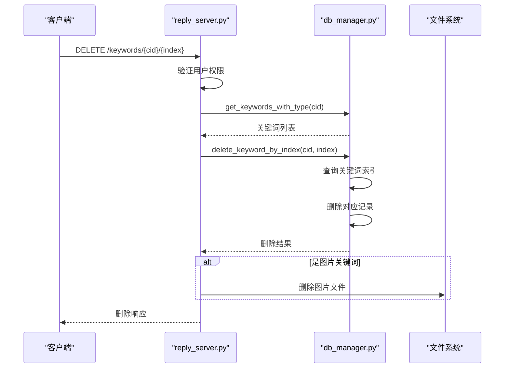
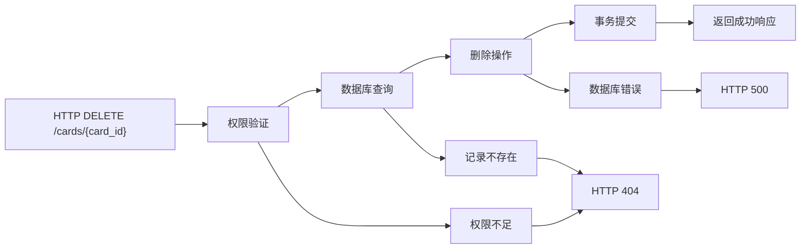
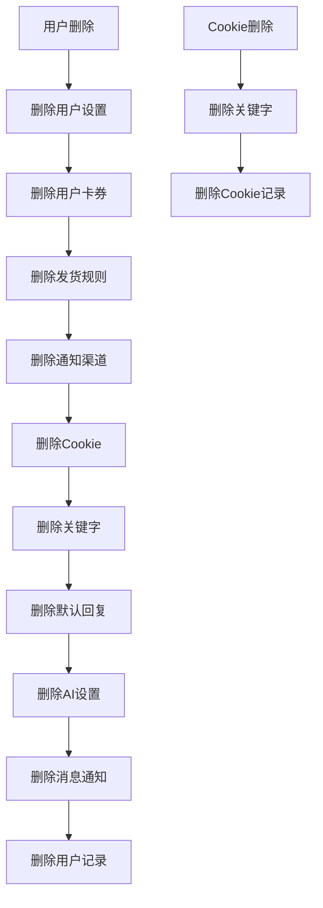
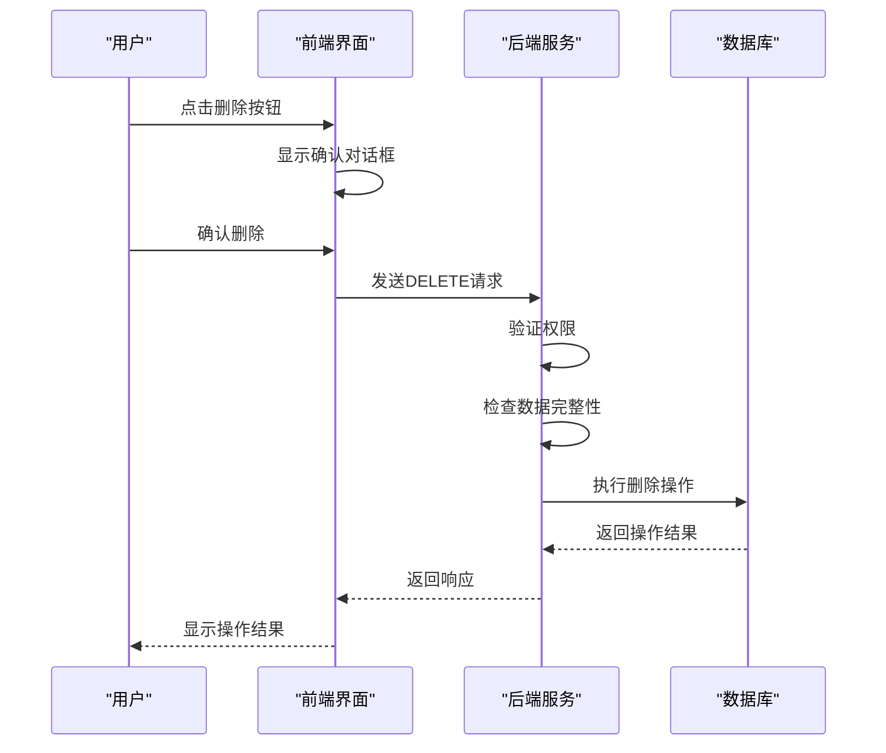
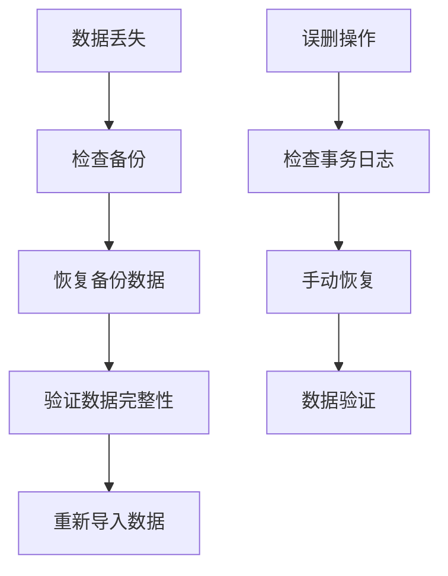
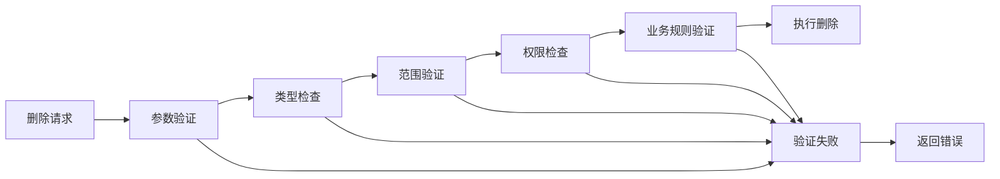
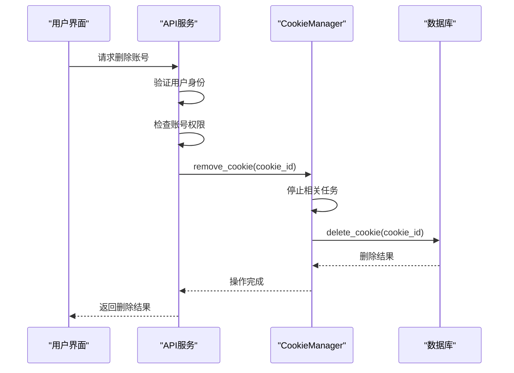
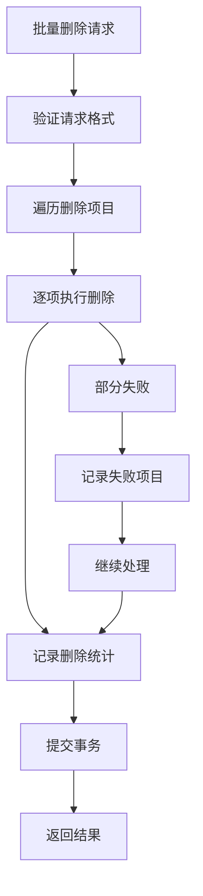
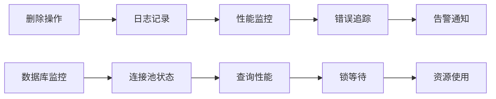

# 删除操作

<cite>
**本文档引用的文件**
- [db_manager.py](file://db_manager.py)
- [reply_server.py](file://reply_server.py)
- [cookie_manager.py](file://cookie_manager.py)
- [static/js/app.js](file://static/js/app.js)
</cite>

## 目录
1. [简介](#简介)
2. [核心删除方法](#核心删除方法)
3. [HTTP DELETE请求处理](#http-delete请求处理)
4. [级联删除机制](#级联删除机制)
5. [软删除与硬删除策略](#软删除与硬删除策略)
6. [回收站功能](#回收站功能)
7. [安全防护措施](#安全防护措施)
8. [实际代码示例](#实际代码示例)
9. [故障排除指南](#故障排除指南)
10. [总结](#总结)

## 简介

闲鱼自动回复系统提供了完整的数据库删除操作功能，支持通过HTTP DELETE请求删除闲鱼账号、关键词规则和卡券记录。系统采用严格的权限控制和级联删除机制，确保数据完整性的同时提供灵活的数据管理能力。

## 核心删除方法

### delete_cookie() 方法

`delete_cookie()` 方法负责删除指定的闲鱼账号及其所有关联数据。



**图表来源**
- [db_manager.py](file://db_manager.py#L1196-L1208)

**节来源**
- [db_manager.py](file://db_manager.py#L1196-L1208)

### delete_keyword() 方法

`delete_keyword_by_index()` 方法根据索引删除特定的关键词规则。



**图表来源**
- [reply_server.py](file://reply_server.py#L3540-L3568)
- [db_manager.py](file://db_manager.py#L1667-L1692)

**节来源**
- [reply_server.py](file://reply_server.py#L3540-L3568)
- [db_manager.py](file://db_manager.py#L1667-L1692)

### delete_card() 方法

`delete_card()` 方法删除指定的卡券记录。

**节来源**
- [db_manager.py](file://db_manager.py#L3491-L3508)

## HTTP DELETE请求处理

### 关键词删除端点

系统提供了专门的HTTP DELETE端点来处理关键词删除请求：

```mermaid
classDiagram
class DeleteKeywordEndpoint {
+DELETE /keywords/{cid}/{index}
+validate_user_permission()
+get_keyword_details()
+delete_keyword_by_index()
+cleanup_image_files()
+return_response()
}
class AuthenticationMiddleware {
+verify_token()
+check_user_permissions()
+log_user_actions()
}
class DatabaseManager {
+get_keywords_with_type()
+delete_keyword_by_index()
+rollback_transaction()
}
DeleteKeywordEndpoint --> AuthenticationMiddleware : "使用"
DeleteKeywordEndpoint --> DatabaseManager : "调用"
```

**图表来源**
- [reply_server.py](file://reply_server.py#L3540-L3568)

**节来源**
- [reply_server.py](file://reply_server.py#L3540-L3568)

### 卡券删除端点

卡券删除功能通过以下流程处理：



**图表来源**
- [reply_server.py](file://reply_server.py#L3848-L3858)

**节来源**
- [reply_server.py](file://reply_server.py#L3848-L3858)

## 级联删除机制

### 数据库级联删除

系统在数据库层面实现了多种级联删除策略：

| 表名 | 级联删除对象 | 触发条件 |
|------|-------------|----------|
| cookies | keywords | ON DELETE CASCADE |
| cookies | cookie_status | ON DELETE CASCADE |
| cookies | ai_reply_settings | ON DELETE CASCADE |
| cookies | default_replies | ON DELETE CASCADE |
| cookies | message_notifications | ON DELETE CASCADE |
| cookies | orders | ON DELETE CASCADE |
| cards | delivery_rules | ON DELETE CASCADE |
| users | cookies | ON DELETE CASCADE |

**节来源**
- [db_manager.py](file://db_manager.py#L121-L136)

### 应用层级联删除

应用层实现了更复杂的级联删除逻辑：



**图表来源**
- [db_manager.py](file://db_manager.py#L4319-L4368)

**节来源**
- [db_manager.py](file://db_manager.py#L4319-L4368)

## 软删除与硬删除策略

### 硬删除实现

系统主要采用硬删除策略，直接从数据库中移除记录：

```python
# 硬删除示例（来自delete_cookie方法）
def delete_cookie(self, cookie_id: str) -> bool:
    with self.lock:
        try:
            cursor = self.conn.cursor()
            # 删除关联的关键字
            self._execute_sql(cursor, "DELETE FROM keywords WHERE cookie_id = ?", (cookie_id,))
            # 删除Cookie
            self._execute_sql(cursor, "DELETE FROM cookies WHERE id = ?", (cookie_id,))
            self.conn.commit()
            return True
        except Exception as e:
            self.conn.rollback()
            return False
```

### 删除确认机制

系统实现了多层确认机制确保删除操作的安全性：



**图表来源**
- [static/js/app.js](file://static/js/app.js#L10030-L10053)

## 回收站功能

### 当前实现状态

系统目前主要采用硬删除策略，暂未实现传统意义上的回收站功能。但通过以下机制提供数据保护：

1. **事务控制**：所有删除操作都在事务中执行，支持回滚
2. **权限验证**：严格的身份验证和授权检查
3. **审计日志**：记录所有删除操作的详细信息

### 数据恢复机制

虽然没有显式的回收站，但系统提供了以下数据恢复途径：



## 安全防护措施

### 权限控制

系统实现了多层次的权限控制：

| 控制层级 | 实现方式 | 保护对象 |
|----------|----------|----------|
| HTTP认证 | Bearer Token | 整个API |
| 用户隔离 | user_id字段 | 用户数据 |
| Cookie权限 | cookie_id验证 | 特定Cookie |
| 管理员权限 | admin标志 | 系统管理功能 |

**节来源**
- [reply_server.py](file://reply_server.py#L202-L212)

### 输入验证

所有删除操作都包含严格的输入验证：



### 错误处理

系统实现了完善的错误处理机制：

```python
# 错误处理示例
try:
    # 删除操作
    success = db_manager.delete_keyword_by_index(cid, index)
    if not success:
        raise HTTPException(status_code=400, detail="删除关键词失败")
except HTTPException:
    raise
except Exception as e:
    logger.error(f"删除关键词失败: {e}")
    raise HTTPException(status_code=500, detail=f"删除关键词失败: {str(e)}")
```

**节来源**
- [reply_server.py](file://reply_server.py#L3574-L3576)

## 实际代码示例

### 删除闲鱼账号的完整流程

以下是删除闲鱼账号的完整代码示例：



**图表来源**
- [cookie_manager.py](file://cookie_manager.py#L155-L181)
- [db_manager.py](file://db_manager.py#L1196-L1208)

### 删除关键词的实际调用

```python
# 前端JavaScript调用示例
async function deleteKeyword(cookieId, index) {
    try {
        const response = await fetch(`/keywords/${cookieId}/${index}`, {
            method: 'DELETE',
            headers: {
                'Authorization': `Bearer ${localStorage.getItem('auth_token')}`
            }
        });
        
        if (response.ok) {
            showToast('关键词删除成功', 'success');
            await refreshKeywordsList();
        } else {
            const error = await response.json();
            showToast(`删除失败: ${error.detail}`, 'danger');
        }
    } catch (error) {
        showToast('删除关键词失败', 'danger');
    }
}
```

**节来源**
- [static/js/app.js](file://static/js/app.js#L1026-L1046)

### 批量删除操作

系统支持批量删除操作，提高效率：



**节来源**
- [reply_server.py](file://reply_server.py#L4258-L4268)

## 故障排除指南

### 常见删除失败原因

| 错误类型 | 可能原因 | 解决方案 |
|----------|----------|----------|
| 权限错误 | 用户无删除权限 | 检查用户权限设置 |
| 记录不存在 | 指定的ID不存在 | 验证数据ID的有效性 |
| 数据库锁定 | 并发操作冲突 | 等待操作完成或重试 |
| 外键约束 | 存在关联数据 | 检查级联删除配置 |

### 调试和监控

系统提供了多种调试和监控手段：



### 数据一致性检查

定期执行数据一致性检查：

```python
# 数据一致性检查示例
def check_data_consistency():
    """检查数据库一致性"""
    with db_manager.lock:
        cursor = db_manager.conn.cursor()
        
        # 检查孤立的关键词记录
        cursor.execute("""
        SELECT k.*
        FROM keywords k
        LEFT JOIN cookies c ON k.cookie_id = c.id
        WHERE c.id IS NULL
        """)
        orphan_keywords = cursor.fetchall()
        
        # 检查孤立的订单记录
        cursor.execute("""
        SELECT o.*
        FROM orders o
        LEFT JOIN cookies c ON o.cookie_id = c.id
        WHERE c.id IS NULL
        """)
        orphan_orders = cursor.fetchall()
        
        return {
            'orphan_keywords': len(orphan_keywords),
            'orphan_orders': len(orphan_orders)
        }
```

## 总结

闲鱼自动回复系统的删除操作功能提供了完整、安全、可靠的数据管理能力。通过严格的权限控制、完善的级联删除机制和多重安全防护措施，确保了数据操作的安全性和可靠性。

### 主要特性

1. **多层次权限控制**：从HTTP认证到数据隔离的全方位保护
2. **智能级联删除**：自动处理关联数据的删除顺序
3. **事务安全保障**：确保删除操作的原子性和一致性
4. **完善的错误处理**：提供详细的错误信息和恢复指导
5. **审计日志支持**：记录所有删除操作的详细信息

### 最佳实践建议

1. **定期备份**：在执行重要删除操作前做好数据备份
2. **权限最小化**：只授予必要的删除权限
3. **监控告警**：建立删除操作的监控和告警机制
4. **测试验证**：在生产环境执行前充分测试删除逻辑
5. **文档维护**：及时更新删除操作的相关文档

通过遵循这些最佳实践和充分利用系统提供的删除功能，可以确保闲鱼自动回复系统的数据安全和稳定运行。