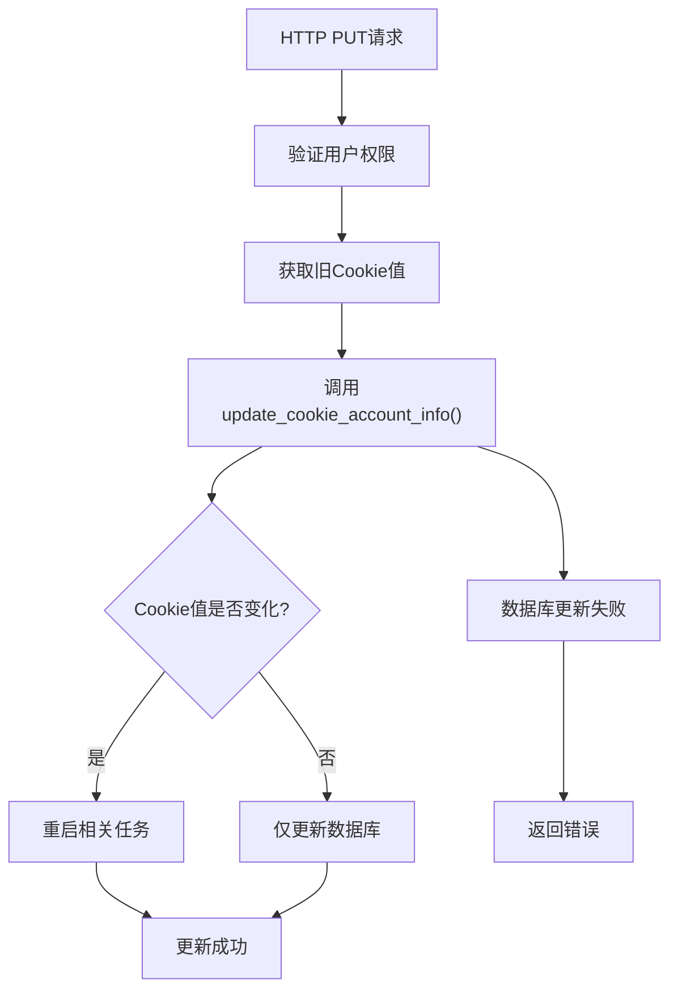
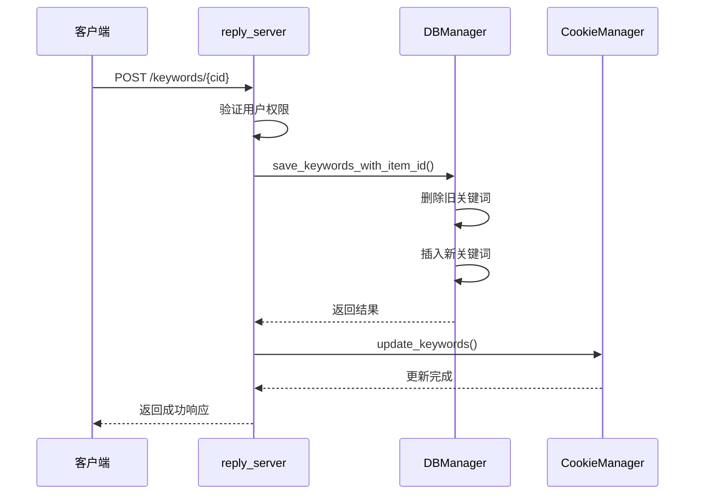
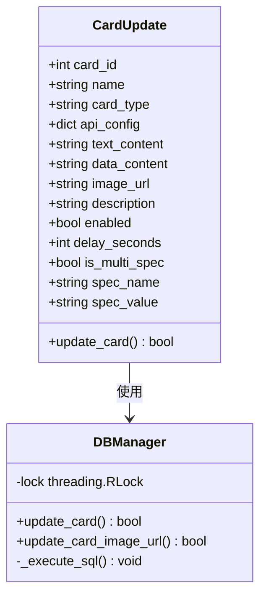
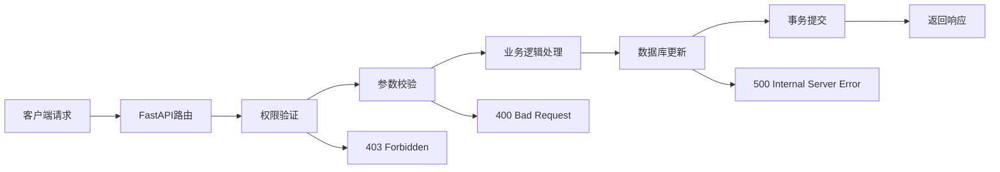
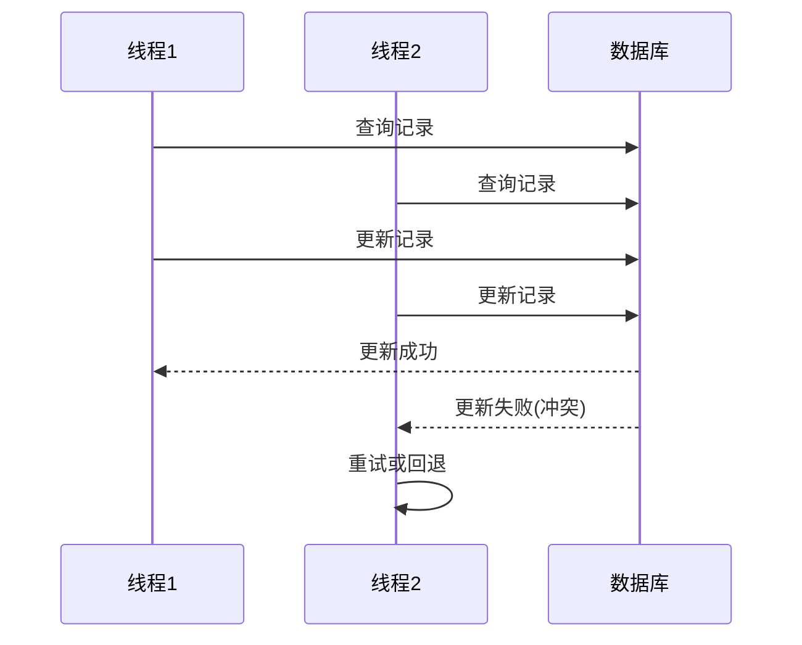
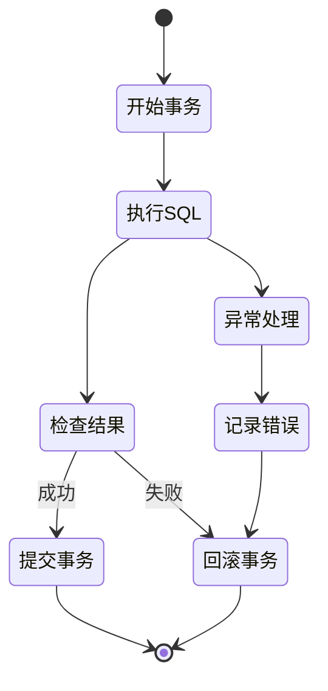
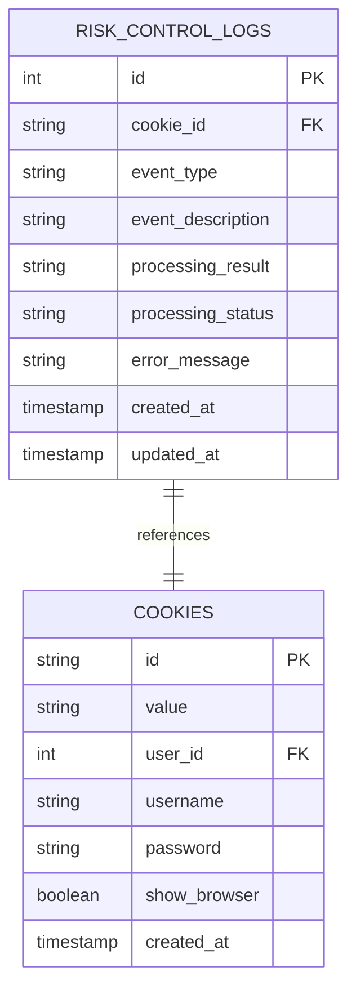
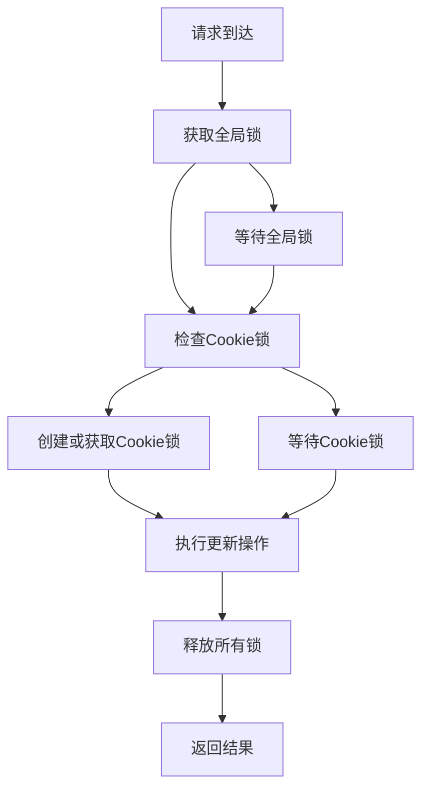

# 更新操作

<cite>
**本文档引用的文件**
- [db_manager.py](file://db_manager.py)
- [reply_server.py](file://reply_server.py)
- [cookie_manager.py](file://cookie_manager.py)
- [config.py](file://config.py)
- [XianyuAutoAsync.py](file://XianyuAutoAsync.py)
- [order_status_handler.py](file://order_status_handler.py)
- [utils/xianyu_slider_stealth.py](file://utils/xianyu_slider_stealth.py)
</cite>

## 目录
1. [概述](#概述)
2. [核心更新方法](#核心更新方法)
3. [HTTP请求处理流程](#http请求处理流程)
4. [乐观锁机制](#乐观锁机制)
5. [事务边界管理](#事务边界管理)
6. [数据变更日志记录](#数据变更日志记录)
7. [并发处理模式](#并发处理模式)
8. [实际代码示例](#实际代码示例)
9. [故障排除指南](#故障排除指南)
10. [最佳实践建议](#最佳实践建议)

## 概述

本文档详细说明了闲鱼自动回复系统中的数据库更新操作机制。系统提供了三个核心更新方法：`update_cookie()`用于修改账号配置，`update_keyword()`用于编辑关键词回复规则，`update_card()`用于更新卡券信息。所有更新操作都采用严格的事务管理、乐观锁机制和完整的日志记录，确保数据一致性和并发安全性。

## 核心更新方法

### update_cookie() 方法详解

`update_cookie()`方法负责更新账号的Cookie值和其他配置信息，支持细粒度的字段更新而不影响其他配置。



**图表来源**
- [reply_server.py](file://reply_server.py#L1217-L1247)
- [db_manager.py](file://db_manager.py#L1400-L1441)

**章节来源**
- [reply_server.py](file://reply_server.py#L1217-L1247)
- [cookie_manager.py](file://cookie_manager.py#L214-L287)

### update_keyword() 方法详解

`update_keyword()`方法提供灵活的关键词管理功能，支持文本和图片两种类型的关键词更新。



**图表来源**
- [reply_server.py](file://reply_server.py#L3077-L3096)
- [db_manager.py](file://db_manager.py#L1464-L1494)

**章节来源**
- [db_manager.py](file://db_manager.py#L1458-L1700)

### update_card() 方法详解

`update_card()`方法支持对卡券信息的全面更新，包括API配置、文本内容、图片URL等多个字段。



**图表来源**
- [db_manager.py](file://db_manager.py#L3009-L3088)
- [reply_server.py](file://reply_server.py#L3674-L3704)

**章节来源**
- [db_manager.py](file://db_manager.py#L3009-L3115)
- [reply_server.py](file://reply_server.py#L3674-L3704)

## HTTP请求处理流程

### 账号设置接口调用流程

系统通过HTTP PUT/PATCH请求触发更新操作，以下是典型的更新流程：



**图表来源**
- [reply_server.py](file://reply_server.py#L1217-L1247)

**章节来源**
- [reply_server.py](file://reply_server.py#L1217-L1247)

### 请求参数验证

系统对每个更新请求都进行严格的参数验证：

| 参数类型 | 验证规则 | 错误处理 |
|---------|---------|---------|
| Cookie ID | 必须存在且属于当前用户 | 返回403错误 |
| 数据完整性 | 所有必需字段验证 | 返回400错误 |
| 并发冲突 | 乐观锁检查 | 返回409错误 |
| 权限验证 | 用户身份确认 | 返回401错误 |

## 乐观锁机制

### 并发更新冲突检测

系统采用乐观锁机制防止并发更新冲突，主要通过以下方式实现：



**图表来源**
- [db_manager.py](file://db_manager.py#L1400-L1441)

### 锁定策略

系统使用多层次的锁定策略：

1. **数据库级锁**：通过`with self.lock:`确保同一时间只有一个线程访问数据库
2. **事务级锁**：使用SQLite的内置事务机制保证原子性
3. **应用级锁**：在CookieManager中为特定Cookie ID创建独立锁

**章节来源**
- [db_manager.py](file://db_manager.py#L483-L4175)

## 事务边界管理

### 事务生命周期

系统严格管理事务边界，确保数据一致性：



**图表来源**
- [db_manager.py](file://db_manager.py#L4034-L4117)

### 批量操作事务管理

对于批量操作，系统使用显式事务管理：

```python
# 批量保存商品信息的事务处理示例
cursor.execute('BEGIN TRANSACTION')
try:
    for item_data in items_data:
        # 执行批量操作
        cursor.execute(sql, params)
    cursor.execute('COMMIT')
except Exception as e:
    cursor.execute('ROLLBACK')
    raise
```

**章节来源**
- [db_manager.py](file://db_manager.py#L4034-L4117)

## 数据变更日志记录

### 日志记录策略

系统实现了完整的变更日志记录机制：

| 日志类型 | 记录内容 | 触发时机 |
|---------|---------|---------|
| 操作日志 | 用户操作记录 | 每次更新操作 |
| 错误日志 | 异常信息和堆栈 | 操作失败时 |
| 性能日志 | 执行时间和资源消耗 | 所有数据库操作 |
| 审计日志 | 关键数据变更 | 敏感操作 |

### 风控日志管理

系统专门维护风控日志表记录所有风险控制相关的操作：



**图表来源**
- [db_manager.py](file://db_manager.py#L4912-L5047)

**章节来源**
- [db_manager.py](file://db_manager.py#L4912-L5047)

## 并发处理模式

### 线程安全设计

系统采用多种并发控制机制：



**图表来源**
- [cookie_manager.py](file://cookie_manager.py#L214-L287)

### 并发限制机制

系统实现了并发限制防止资源过度消耗：

| 组件 | 并发限制 | 超时处理 |
|------|---------|---------|
| 滑块验证 | 3个并发任务 | 60秒超时 |
| Cookie更新 | 按Cookie ID隔离 | 10秒超时 |
| 数据库操作 | 全局锁保护 | 30秒超时 |

**章节来源**
- [utils/xianyu_slider_stealth.py](file://utils/xianyu_slider_stealth.py#L124-L143)

## 实际代码示例

### 更新账号配置示例

以下是更新账号配置的完整代码示例：

```python
# HTTP PUT /cookies/{cid} 请求处理
@app.put('/cookies/{cid}')
def update_cookie(cid: str, item: CookieIn, current_user: Dict[str, Any] = Depends(get_current_user)):
    # 验证权限和获取旧值
    old_cookie_details = db_manager.get_cookie_details(cid)
    old_cookie_value = old_cookie_details.get('value') if old_cookie_details else None
    
    # 更新数据库
    success = db_manager.update_cookie_account_info(cid, cookie_value=item.value)
    
    # 重启相关任务（如果Cookie值变化）
    if item.value != old_cookie_value:
        cookie_manager.manager.update_cookie(cid, item.value, save_to_db=False)
    
    return {'msg': 'updated'}
```

### 更新关键词规则示例

```python
# 更新关键词规则的批量操作
def update_keywords(cid: str, keywords: List[Tuple[str, str]]):
    # 保存新关键词（先删除旧的）
    success = db_manager.save_keywords_with_item_id(cid, keywords)
    
    # 更新内存中的关键词缓存
    if success:
        cookie_manager.manager.update_keywords(cid, keywords)
    
    return success
```

### 更新卡券信息示例

```python
# 更新卡券信息的完整流程
def update_card(card_id: int, card_data: dict):
    # 验证多规格字段
    if card_data.get('is_multi_spec'):
        if not card_data.get('spec_name') or not card_data.get('spec_value'):
            raise ValueError("多规格卡券必须提供规格名称和规格值")
    
    # 执行更新
    success = db_manager.update_card(
        card_id=card_id,
        name=card_data.get('name'),
        card_type=card_data.get('type'),
        text_content=card_data.get('text_content'),
        image_url=card_data.get('image_url'),
        enabled=card_data.get('enabled', True)
    )
    
    return success
```

**章节来源**
- [reply_server.py](file://reply_server.py#L1217-L1247)
- [reply_server.py](file://reply_server.py#L3077-L3096)
- [reply_server.py](file://reply_server.py#L3674-L3704)

## 故障排除指南

### 常见更新失败场景

| 错误类型 | 可能原因 | 解决方案 |
|---------|---------|---------|
| 403 Forbidden | 权限不足 | 检查用户认证和Cookie所有权 |
| 409 Conflict | 并发冲突 | 实现重试机制或提示用户稍后重试 |
| 500 Internal Error | 数据库异常 | 检查数据库连接和事务状态 |
| 400 Bad Request | 参数验证失败 | 验证请求参数的完整性和格式 |

### 调试和监控

系统提供了完善的调试和监控功能：

```python
# 启用SQL日志记录
db_manager.sql_log_enabled = True
db_manager.sql_log_level = 'DEBUG'

# 监控更新性能
def monitor_update_performance(operation, duration):
    logger.info(f"更新操作耗时: {operation} - {duration:.3f}秒")
```

**章节来源**
- [db_manager.py](file://db_manager.py#L483-L4175)

## 最佳实践建议

### 更新操作最佳实践

1. **事务完整性**：始终使用事务包装数据库更新操作
2. **错误处理**：实现完善的异常处理和回滚机制
3. **并发控制**：合理使用锁机制避免竞态条件
4. **日志记录**：记录所有关键操作的详细日志
5. **参数验证**：在业务逻辑层进行充分的参数验证

### 性能优化建议

1. **批量操作**：对于大量数据更新，使用批量操作减少事务开销
2. **索引优化**：确保查询经常使用的字段上有适当的索引
3. **连接池**：使用数据库连接池提高并发性能
4. **缓存策略**：对频繁读取的数据实施缓存机制

### 安全考虑

1. **输入验证**：对所有用户输入进行严格验证
2. **权限控制**：确保用户只能操作自己的数据
3. **审计追踪**：记录所有敏感操作的审计日志
4. **数据加密**：对敏感数据进行适当的加密存储