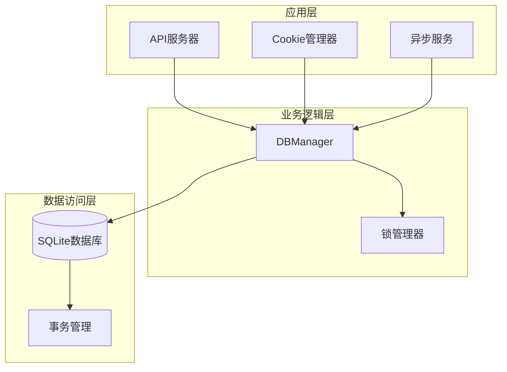
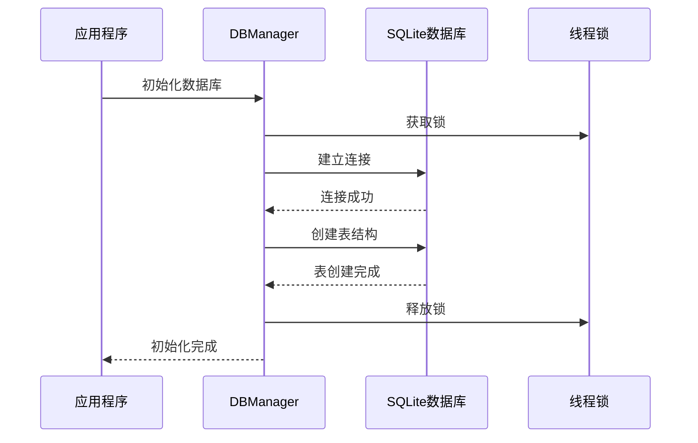
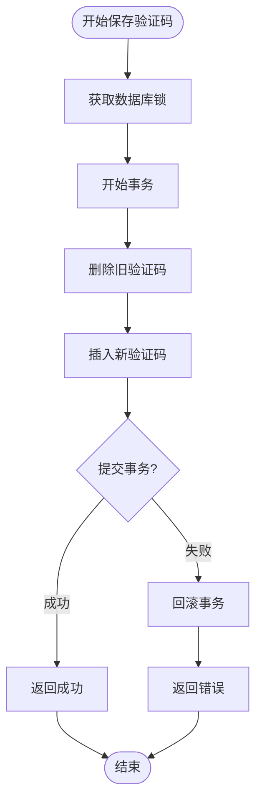
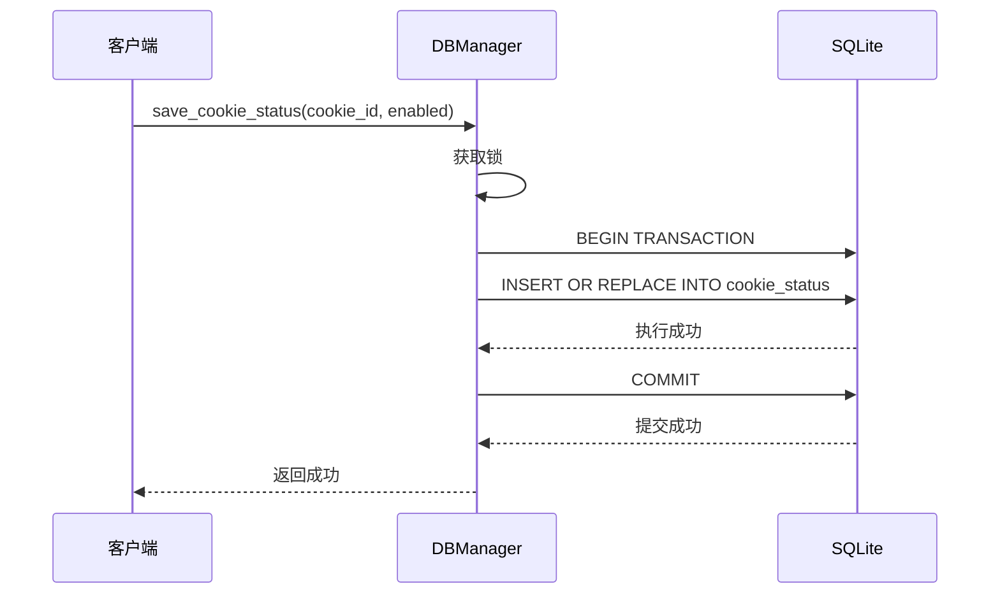
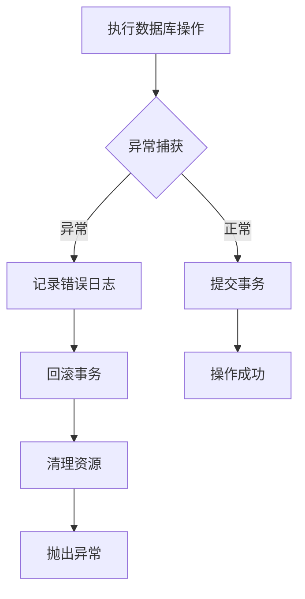
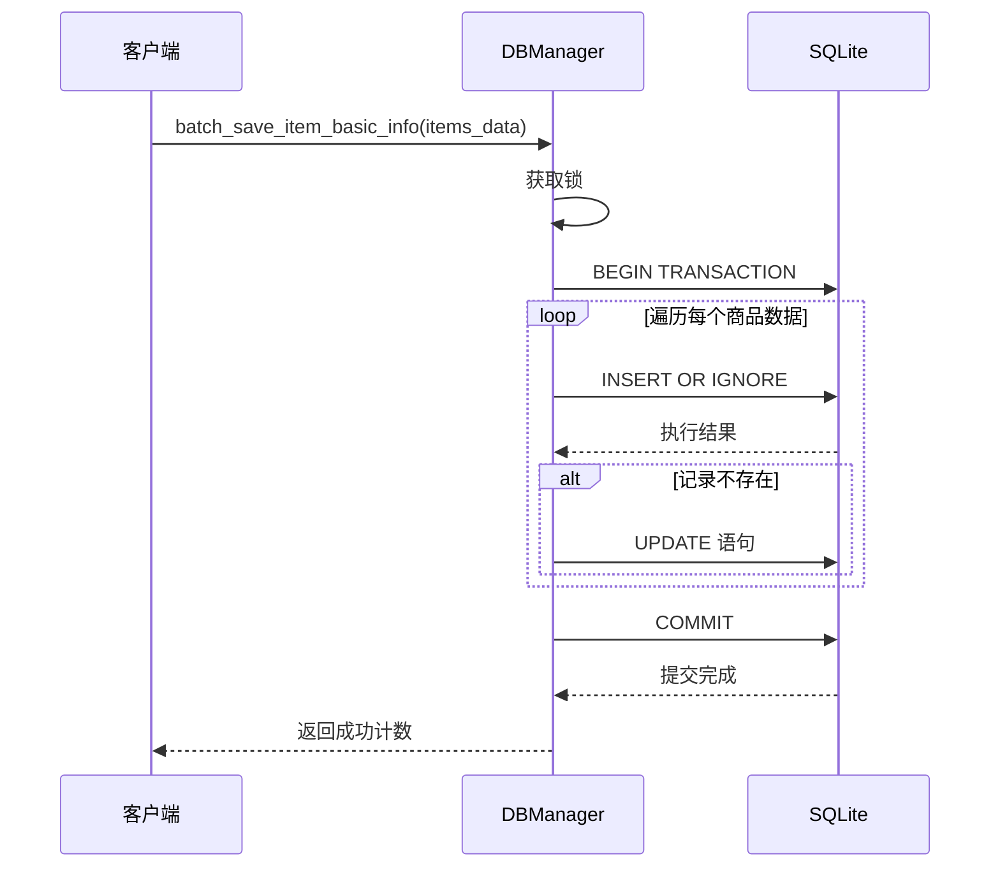
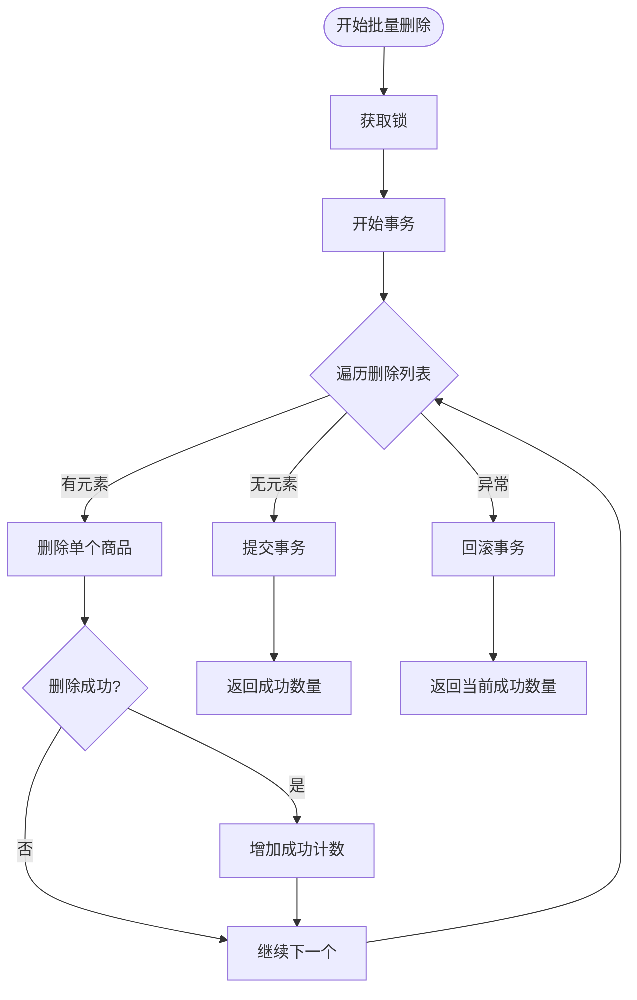
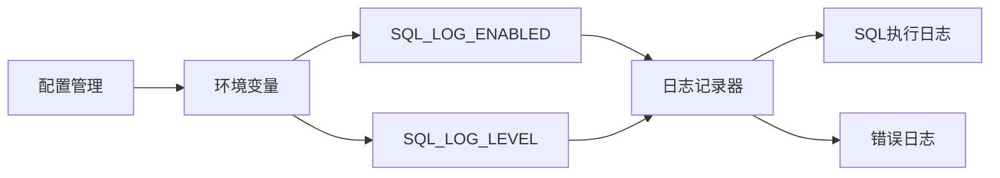
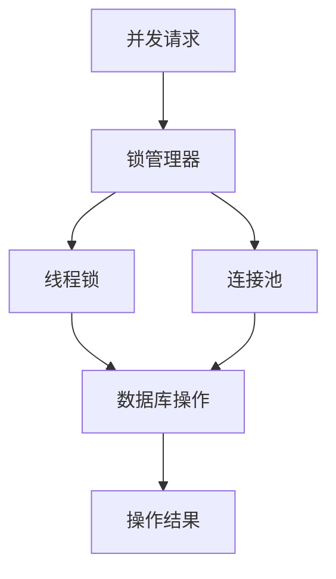

# 事务处理

<cite>
**本文档引用的文件**
- [db_manager.py](file://db_manager.py)
- [config.py](file://config.py)
- [cookie_manager.py](file://cookie_manager.py)
- [reply_server.py](file://reply_server.py)
- [XianyuAutoAsync.py](file://XianyuAutoAsync.py)
</cite>

## 目录
1. [简介](#简介)
2. [项目架构概览](#项目架构概览)
3. [数据库连接与事务管理](#数据库连接与事务管理)
4. [核心事务处理方法](#核心事务处理方法)
5. [事务边界定义原则](#事务边界定义原则)
6. [异常处理与回滚机制](#异常处理与回滚机制)
7. [批量操作事务处理](#批量操作事务处理)
8. [事务日志与监控](#事务日志与监控)
9. [性能优化与最佳实践](#性能优化与最佳实践)
10. [故障排除指南](#故障排除指南)

## 简介

本文档详细阐述了基于 `db_manager.py` 中实现的数据库事务处理机制。该系统采用 SQLite 数据库存储用户数据、Cookie、关键词、AI 设置等核心业务数据，通过精心设计的事务处理策略确保数据一致性和完整性。

事务处理是数据库操作的核心组件，它保证了在复杂业务场景下的数据一致性，特别是在涉及多个表的关联操作时。本系统实现了完整的事务生命周期管理，包括事务的开始、提交、回滚以及异常处理机制。

## 项目架构概览

系统采用分层架构设计，数据库管理层负责所有数据持久化操作：

**图表来源**
- [db_manager.py](file://db_manager.py#L16-L52)
- [cookie_manager.py](file://cookie_manager.py#L1-L50)

**章节来源**
- [db_manager.py](file://db_manager.py#L16-L52)

## 数据库连接与事务管理

### 初始化与连接管理

系统在初始化时建立数据库连接，并配置相应的事务控制策略：

**图表来源**
- [db_manager.py](file://db_manager.py#L65-L72)

### 自动提交模式禁用

系统通过 `check_same_thread=False` 参数禁用了 SQLite 的自动提交模式，确保所有操作都在显式事务控制下进行：

- **连接配置**：`sqlite3.connect(self.db_path, check_same_thread=False)`
- **事务控制**：所有写操作都需要显式调用 `conn.commit()` 或 `conn.rollback()`
- **线程安全**：使用可重入锁 (`threading.RLock`) 保护并发访问

**章节来源**
- [db_manager.py](file://db_manager.py#L65-L72)

## 核心事务处理方法

### 图形验证码保存事务

`save_captcha` 方法展示了标准的事务处理模式：

**图表来源**
- [db_manager.py](file://db_manager.py#L2605-L2626)

### Cookie状态更新事务

`save_cookie_status` 方法演示了简单的事务处理：

**图表来源**
- [db_manager.py](file://db_manager.py#L1722-L1735)

**章节来源**
- [db_manager.py](file://db_manager.py#L2605-L2626)
- [db_manager.py](file://db_manager.py#L1722-L1735)

## 事务边界定义原则

### 写操作方法的事务边界

系统中所有写操作都遵循统一的事务边界定义原则：

| 方法类型 | 事务范围 | 异常处理 | 回滚策略 |
|---------|---------|---------|---------|
| 单记录写入 | 单个操作 | 立即回滚 | 操作失败即回滚 |
| 批量操作 | 整个批次 | 整体回滚 | 任一失败全部回滚 |
| 关联删除 | 级联操作 | 分阶段回滚 | 依赖关系回滚 |
| 系统设置 | 原子操作 | 异常传播 | 设置失败不影响其他 |

### 事务边界的确定原则

1. **原子性原则**：每个事务应该是一个不可分割的操作单元
2. **一致性原则**：事务执行前后数据库应保持一致性状态
3. **隔离性原则**：事务执行期间其他并发操作不应干扰
4. **持久性原则**：事务一旦提交，其结果应永久保存

**章节来源**
- [db_manager.py](file://db_manager.py#L1156-L1211)
- [db_manager.py](file://db_manager.py#L1722-L1735)

## 异常处理与回滚机制

### 异常捕获与回滚流程

系统实现了完善的异常处理机制，确保在任何情况下都能维护数据一致性：

**图表来源**
- [db_manager.py](file://db_manager.py#L449-L451)
- [db_manager.py](file://db_manager.py#L1191-L1193)

### 异常处理模式

系统采用统一的异常处理模式：

1. **捕获所有异常**：使用 `try-except` 块捕获所有数据库操作异常
2. **记录详细日志**：记录异常详情和上下文信息
3. **执行回滚**：确保事务状态恢复到初始状态
4. **资源清理**：释放数据库连接和其他资源
5. **异常传播**：向上层调用者传播异常信息

**章节来源**
- [db_manager.py](file://db_manager.py#L449-L451)
- [db_manager.py](file://db_manager.py#L1191-L1193)

## 批量操作事务处理

### 批量商品信息处理

系统提供了高效的批量操作事务处理机制：

**图表来源**
- [db_manager.py](file://db_manager.py#L4051-L4117)

### 批量删除操作

批量删除操作同样采用事务控制：

**图表来源**
- [db_manager.py](file://db_manager.py#L4163-L4195)

**章节来源**
- [db_manager.py](file://db_manager.py#L4051-L4117)
- [db_manager.py](file://db_manager.py#L4163-L4195)

## 事务日志与监控

### SQL日志记录策略

系统实现了全面的SQL日志记录机制：

| 日志级别 | 记录内容 | 性能影响 | 使用场景 |
|---------|---------|---------|---------|
| DEBUG | 详细SQL语句和参数 | 高 | 开发调试 |
| INFO | 主要SQL操作 | 中 | 生产监控 |
| WARNING | 异常SQL操作 | 低 | 错误排查 |
| ERROR | 完整错误信息 | 低 | 故障诊断 |

### 日志配置与控制

**图表来源**
- [db_manager.py](file://db_manager.py#L53-L62)

**章节来源**
- [db_manager.py](file://db_manager.py#L53-L62)
- [db_manager.py](file://db_manager.py#L1108-L1141)

## 性能优化与最佳实践

### 事务大小控制

系统通过合理控制事务大小来平衡性能和一致性：

1. **小事务优先**：尽可能将大操作拆分为多个小事务
2. **批量操作**：对于相似操作使用批量处理减少事务开销
3. **超时控制**：设置合理的事务超时时间防止长时间锁定
4. **连接池管理**：合理管理数据库连接避免连接泄漏

### 死锁预防措施

虽然SQLite的事务模型相对简单，但仍采取以下预防措施：

1. **固定顺序**：按照固定的顺序访问表和记录
2. **短事务**：尽量缩短事务持续时间
3. **重试机制**：对死锁情况实施指数退避重试
4. **监控告警**：监控事务执行时间和锁等待情况

### 并发控制策略

**图表来源**
- [db_manager.py](file://db_manager.py#L51-L52)

**章节来源**
- [db_manager.py](file://db_manager.py#L51-L52)

## 故障排除指南

### 常见事务问题及解决方案

| 问题类型 | 症状 | 可能原因 | 解决方案 |
|---------|------|---------|---------|
| 事务超时 | 操作长时间挂起 | 事务持有时间过长 | 缩短事务范围，优化查询 |
| 死锁 | 操作被阻塞 | 事务间相互等待 | 按固定顺序访问资源 |
| 数据不一致 | 查询结果异常 | 事务未正确提交 | 检查异常处理逻辑 |
| 连接泄漏 | 连接数耗尽 | 未正确关闭连接 | 确保finally块正确执行 |

### 诊断工具和技巧

1. **启用详细日志**：设置 `SQL_LOG_LEVEL=DEBUG` 获取详细信息
2. **监控连接状态**：定期检查数据库连接使用情况
3. **性能分析**：使用SQLite的EXPLAIN QUERY PLAN分析慢查询
4. **压力测试**：模拟高并发场景测试事务处理能力

### 最佳实践总结

1. **始终使用事务**：所有写操作都应在事务中执行
2. **合理控制事务范围**：避免长时间持有事务
3. **完善异常处理**：确保异常情况下正确回滚
4. **监控事务性能**：定期检查事务执行效率
5. **备份重要数据**：定期备份数据库防止数据丢失

**章节来源**
- [db_manager.py](file://db_manager.py#L449-L451)
- [db_manager.py](file://db_manager.py#L1191-L1193)