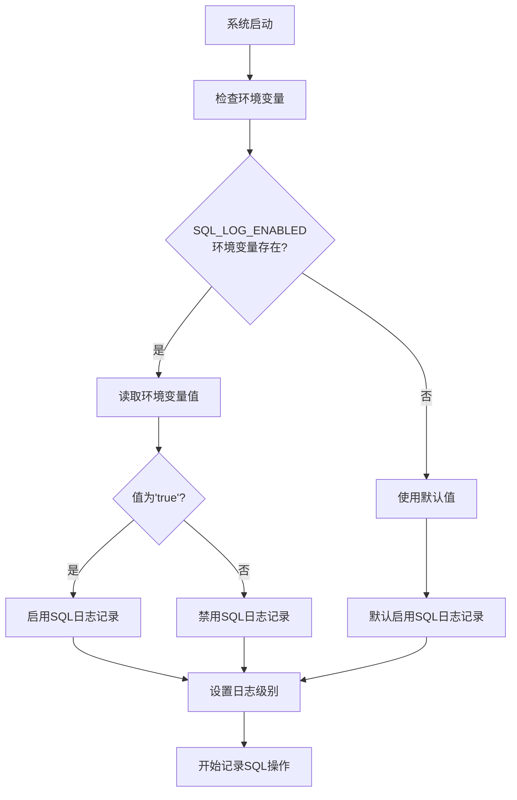
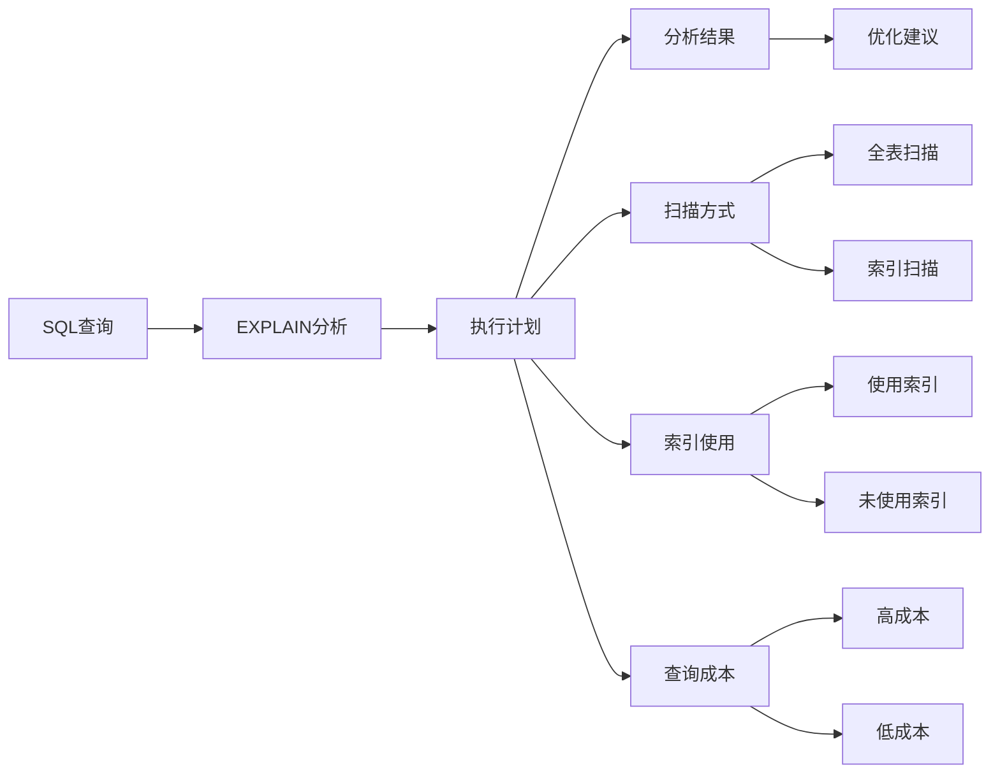
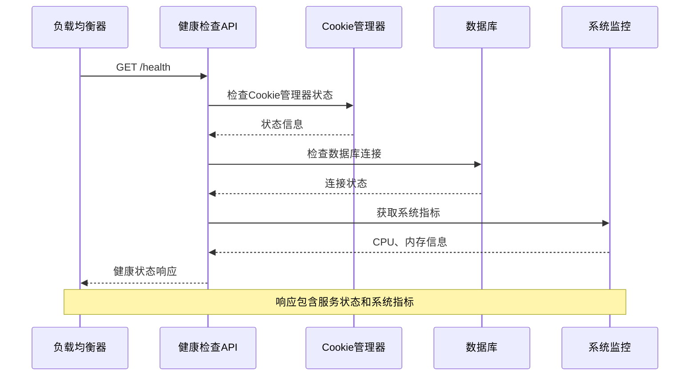
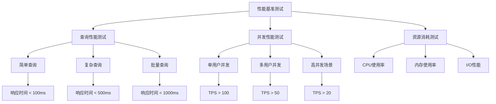
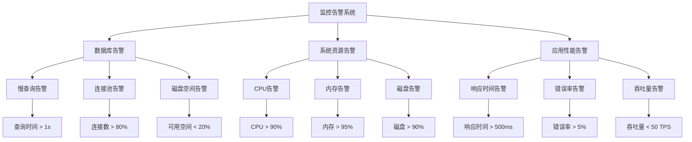
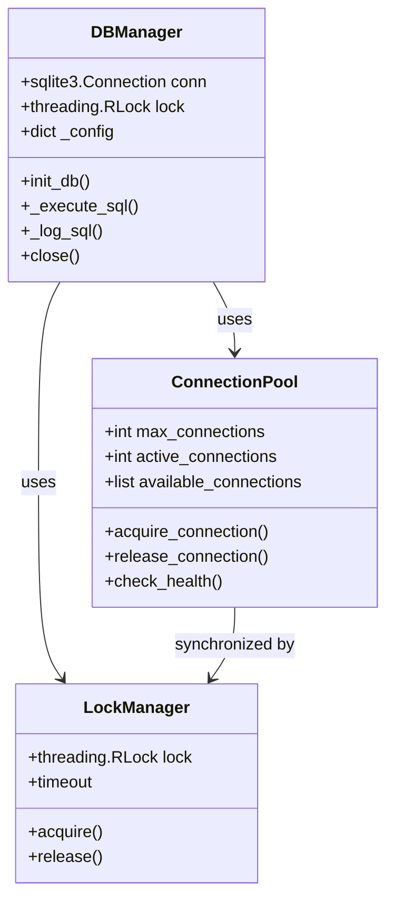
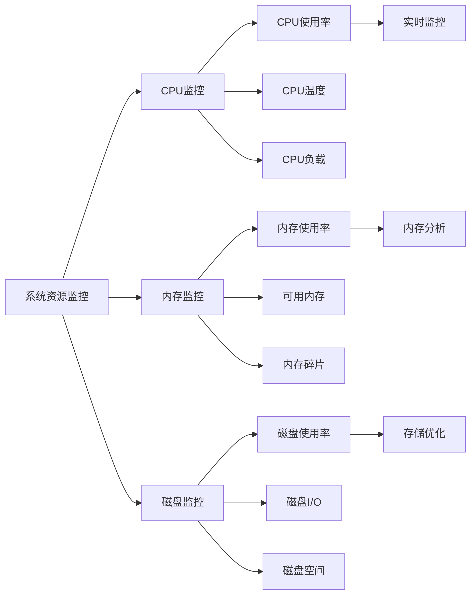
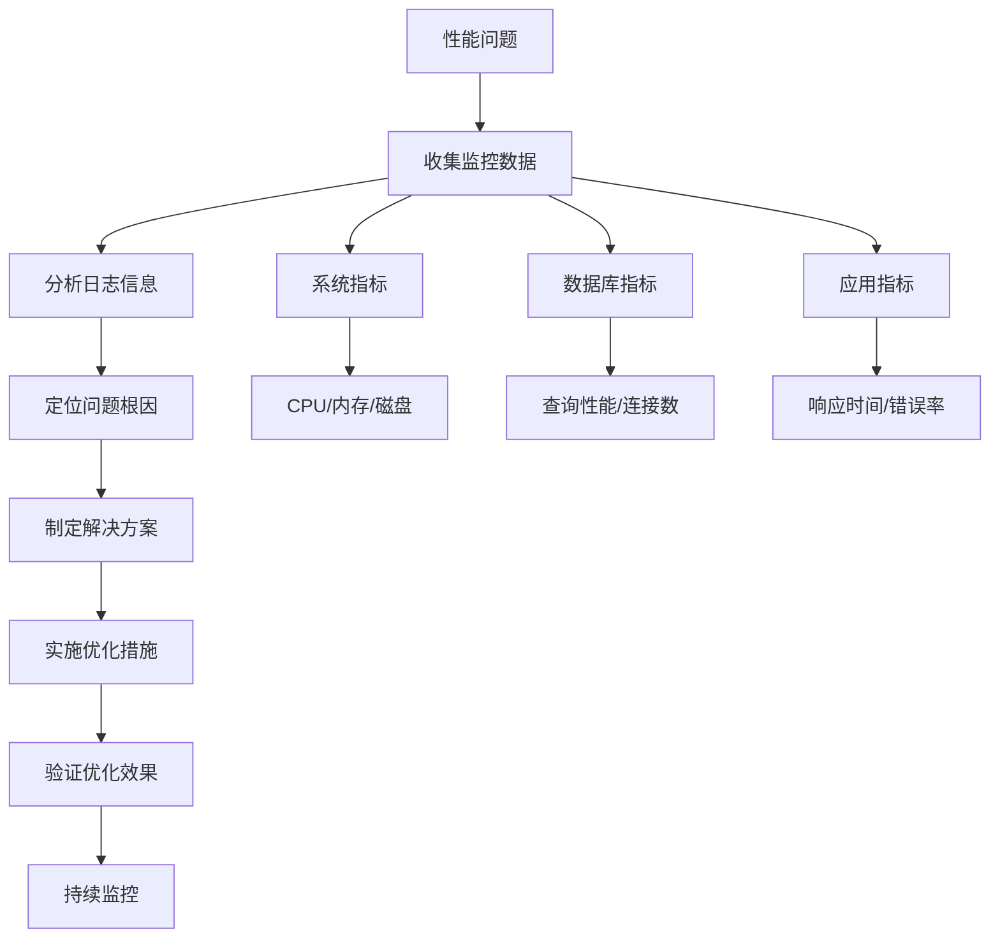

# 性能监控

<cite>
**本文档中引用的文件**
- [db_manager.py](file://db_manager.py)
- [reply_server.py](file://reply_server.py)
- [config.py](file://config.py)
- [global_config.yml](file://global_config.yml)
- [requirements.txt](file://requirements.txt)
- [usage_statistics.py](file://usage_statistics.py)
- [simple_stats_server.py](file://simple_stats_server.py)
</cite>

## 目录
1. [简介](#简介)
2. [SQL日志记录配置](#sql日志记录配置)
3. [数据库索引优化策略](#数据库索引优化策略)
4. [查询执行计划分析](#查询执行计划分析)
5. [系统级监控](#系统级监控)
6. [性能基准测试](#性能基准测试)
7. [监控告警配置](#监控告警配置)
8. [连接使用情况监控](#连接使用情况监控)
9. [资源消耗分析](#资源消耗分析)
10. [最佳实践建议](#最佳实践建议)

## 简介

闲鱼自动回复系统采用SQLite数据库作为主要数据存储方案，通过完善的性能监控机制确保系统的高效运行。本文档详细介绍了系统的性能监控策略，包括SQL日志记录、数据库优化、系统监控等关键方面。

## SQL日志记录配置

### 启用SQL日志记录

系统提供了灵活的SQL日志记录配置，通过`db_manager.py`中的`sql_log_enabled`配置项控制SQL语句的日志记录功能。



**图表来源**
- [db_manager.py](file://db_manager.py#L53-L62)

### 配置选项

| 配置项 | 默认值 | 环境变量 | 说明 |
|--------|--------|----------|------|
| `sql_log_enabled` | `True` | `SQL_LOG_ENABLED` | 控制是否启用SQL日志记录 |
| `sql_log_level` | `'INFO'` | `SQL_LOG_LEVEL` | SQL日志的输出级别 |

### SQL日志级别配置

系统支持多种日志级别：
- `DEBUG`: 输出详细的SQL执行信息
- `INFO`: 输出标准的SQL操作日志  
- `WARNING`: 输出警告级别的SQL操作

**章节来源**
- [db_manager.py](file://db_manager.py#L53-L62)
- [db_manager.py](file://db_manager.py#L1132-L1141)

## 数据库索引优化策略

### 常用查询字段索引

基于系统的核心业务需求，以下字段应建立索引来提升查询效率：

```mermaid
erDiagram
COOKIES {
string id PK
text value
integer user_id FK
integer auto_confirm
text remark
integer pause_duration
text username
text password
integer show_browser
timestamp created_at
}
KEYWORDS {
string cookie_id FK
text keyword
text reply
text item_id
text type
text image_url
foreign key (cookie_id) references COOKIES(id)
}
ORDERS {
string order_id PK
string item_id
string buyer_id
text spec_name
text spec_value
text quantity
text amount
text order_status
string cookie_id FK
timestamp created_at
timestamp updated_at
foreign key (cookie_id) references COOKIES(id)
}
ITEM_INFO {
integer id PK
string cookie_id FK
string item_id
text item_title
text item_description
text item_category
text item_price
text item_detail
boolean is_multi_spec
timestamp created_at
timestamp updated_at
foreign key (cookie_id) references COOKIES(id)
}
COOKIES ||--o{ KEYWORDS : contains
COOKIES ||--o{ ORDERS : generates
COOKIES ||--o{ ITEM_INFO : manages
```

**图表来源**
- [db_manager.py](file://db_manager.py#L110-L280)

### 推荐索引策略

| 表名 | 字段 | 索引类型 | 用途 |
|------|------|----------|------|
| `cookies` | `id` | 主键索引 | 唯一标识 |
| `cookies` | `user_id` | 普通索引 | 用户关联查询 |
| `keywords` | `cookie_id` | 普通索引 | 关键字查询 |
| `keywords` | `(cookie_id, keyword)` | 复合索引 | 关键字匹配优化 |
| `orders` | `cookie_id` | 普通索引 | 订单查询 |
| `orders` | `item_id` | 普通索引 | 商品关联查询 |
| `item_info` | `cookie_id` | 普通索引 | 商品信息查询 |
| `item_info` | `(cookie_id, item_id)` | 复合索引 | 商品唯一性查询 |

### 索引创建示例

```sql
-- 为cookies表的user_id字段创建索引
CREATE INDEX IF NOT EXISTS idx_cookies_user_id ON cookies(user_id);

-- 为keywords表创建复合索引
CREATE INDEX IF NOT EXISTS idx_keywords_cookie_keyword ON keywords(cookie_id, keyword);

-- 为orders表创建索引
CREATE INDEX IF NOT EXISTS idx_orders_cookie_id ON orders(cookie_id);
CREATE INDEX IF NOT EXISTS idx_orders_item_id ON orders(item_id);

-- 为item_info表创建索引
CREATE INDEX IF NOT EXISTS idx_item_info_cookie_id ON item_info(cookie_id);
CREATE UNIQUE INDEX IF NOT EXISTS idx_item_info_unique ON item_info(cookie_id, item_id);
```

**章节来源**
- [db_manager.py](file://db_manager.py#L243-L244)
- [db_manager.py](file://db_manager.py#L1039-L1080)

## 查询执行计划分析

### 使用EXPLAIN分析查询

系统支持通过SQLite的EXPLAIN功能分析查询执行计划，帮助识别性能瓶颈。



### EXPLAIN分析示例

对于常见的查询模式，可以使用以下EXPLAIN语句进行分析：

```sql
-- 分析获取用户所有Cookie的查询
EXPLAIN QUERY PLAN 
SELECT * FROM cookies WHERE user_id = ?;

-- 分析获取关键词的查询
EXPLAIN QUERY PLAN 
SELECT * FROM keywords WHERE cookie_id = ? AND keyword LIKE ?;

-- 分析获取订单的查询
EXPLAIN QUERY PLAN 
SELECT * FROM orders WHERE cookie_id = ? ORDER BY created_at DESC LIMIT 100;
```

### 性能优化检查清单

| 检查项目 | 正常状态 | 异常状态 | 优化建议 |
|----------|----------|----------|----------|
| 索引使用 | `SEARCH TABLE cookies USING INDEX idx_cookies_user_id` | `SCAN TABLE cookies` | 为查询字段创建索引 |
| 扫描方式 | 使用索引扫描 | 全表扫描 | 优化WHERE条件和索引设计 |
| 查询成本 | 成本较低 | 成本较高 | 重新评估查询逻辑和索引策略 |
| 结果集大小 | 符合预期 | 结果集过大 | 添加LIMIT或优化WHERE条件 |

## 系统级监控

### 健康检查端点

系统提供了全面的健康检查功能，通过`/health`端点监控系统状态。



**图表来源**
- [reply_server.py](file://reply_server.py#L374-L406)

### 监控指标

| 指标类别 | 监控项目 | 正常阈值 | 告警条件 |
|----------|----------|----------|----------|
| 服务状态 | Cookie管理器 | `ok` | `error` |
| 服务状态 | 数据库连接 | `ok` | 连接失败 |
| 系统资源 | CPU使用率 | < 80% | > 90% |
| 系统资源 | 内存使用率 | < 85% | > 95% |
| 系统资源 | 可用内存 | > 1GB | < 512MB |

### 健康检查响应格式

```json
{
    "status": "healthy",
    "timestamp": 1640995200.123,
    "services": {
        "cookie_manager": "ok",
        "database": "ok"
    },
    "system": {
        "cpu_percent": 15.5,
        "memory_percent": 45.2,
        "memory_available": 2147483648
    }
}
```

**章节来源**
- [reply_server.py](file://reply_server.py#L374-L406)

## 性能基准测试

### 基准测试场景

推荐的性能基准测试场景包括：



### 性能指标定义

| 测试类型 | 指标名称 | 目标值 | 测试方法 |
|----------|----------|--------|----------|
| 查询性能 | 响应时间 | < 500ms | 基准查询执行时间 |
| 并发性能 | 吞吐量 | > 100 TPS | 并发用户同时访问 |
| 资源消耗 | CPU使用率 | < 80% | 系统资源监控 |
| 资源消耗 | 内存使用率 | < 85% | 内存占用监控 |

### 测试工具推荐

- **压力测试**: Apache Bench (ab)、wrk、JMeter
- **性能分析**: SQLite Profiler、System Monitor
- **监控工具**: Prometheus、Grafana、psutil

## 监控告警配置

### 告警规则设置

基于系统运行特点，建议设置以下监控告警：



### 告警配置示例

| 告警类型 | 触发条件 | 告警级别 | 处理建议 |
|----------|----------|----------|----------|
| 数据库慢查询 | 查询时间 > 1秒 | 警告 | 分析查询计划，优化索引 |
| 数据库连接池耗尽 | 连接数 > 80% | 严重 | 增加连接池大小或优化查询 |
| CPU使用率过高 | CPU > 90% | 严重 | 检查系统负载，优化代码 |
| 内存使用率过高 | 内存 > 95% | 警告 | 检查内存泄漏，优化缓存 |
| 响应时间过长 | 响应时间 > 500ms | 警告 | 优化查询，增加缓存 |

## 连接使用情况监控

### 数据库连接管理

系统采用连接池和锁机制来管理数据库连接：



**图表来源**
- [db_manager.py](file://db_manager.py#L50-L51)

### 连接监控指标

| 监控指标 | 说明 | 正常范围 | 异常阈值 |
|----------|------|----------|----------|
| 活跃连接数 | 当前使用的数据库连接数 | < 80% | > 90% |
| 连接等待时间 | 获取可用连接的平均等待时间 | < 100ms | > 500ms |
| 连接超时次数 | 连接获取超时的次数 | 0 | > 0 |
| 连接池利用率 | 连接池使用百分比 | < 80% | > 90% |

**章节来源**
- [db_manager.py](file://db_manager.py#L50-L51)

## 资源消耗分析

### 系统资源监控

系统集成了psutil库来监控系统资源使用情况：



### 资源监控实现

系统通过以下方式监控资源消耗：

```python
# CPU使用率监控
cpu_percent = psutil.cpu_percent(interval=1)

# 内存使用情况监控  
memory_info = psutil.virtual_memory()

# 磁盘使用情况监控
disk_info = psutil.disk_usage('/')
```

### 资源优化建议

| 资源类型 | 优化方向 | 实施方法 |
|----------|----------|----------|
| CPU | 查询优化 | 添加索引，优化复杂查询 |
| CPU | 并发控制 | 限制并发连接数 |
| 内存 | 缓存管理 | 合理设置缓存大小 |
| 内存 | 对象回收 | 及时释放不用的对象 |
| 磁盘 | 数据清理 | 定期清理历史数据 |
| 磁盘 | 索引维护 | 执行VACUUM操作 |

**章节来源**
- [reply_server.py](file://reply_server.py#L391-L392)

## 最佳实践建议

### 数据库优化最佳实践

1. **定期维护**
   - 定期执行VACUUM操作清理碎片
   - 监控数据库文件大小，及时备份
   - 定期分析查询性能，优化索引

2. **查询优化**
   - 使用EXPLAIN分析查询计划
   - 避免SELECT *，明确指定字段
   - 合理使用LIMIT限制结果集大小
   - 避免在WHERE子句中使用函数

3. **索引策略**
   - 为频繁查询的字段创建索引
   - 使用复合索引优化多字段查询
   - 定期分析索引使用情况
   - 避免过度索引导致写入性能下降

### 监控配置建议

1. **日志配置**
   - 生产环境使用INFO级别日志
   - 开发环境可启用DEBUG级别
   - 设置合理的日志轮转策略

2. **性能监控**
   - 设置关键指标的告警阈值
   - 建立性能基线，定期对比
   - 监控趋势变化，提前发现问题

3. **资源管理**
   - 监控系统资源使用趋势
   - 设置资源使用上限
   - 建立资源扩容机制

### 故障排查流程



通过以上全面的性能监控策略，可以确保闲鱼自动回复系统在高负载环境下保持稳定高效的运行，为用户提供优质的自动回复服务。