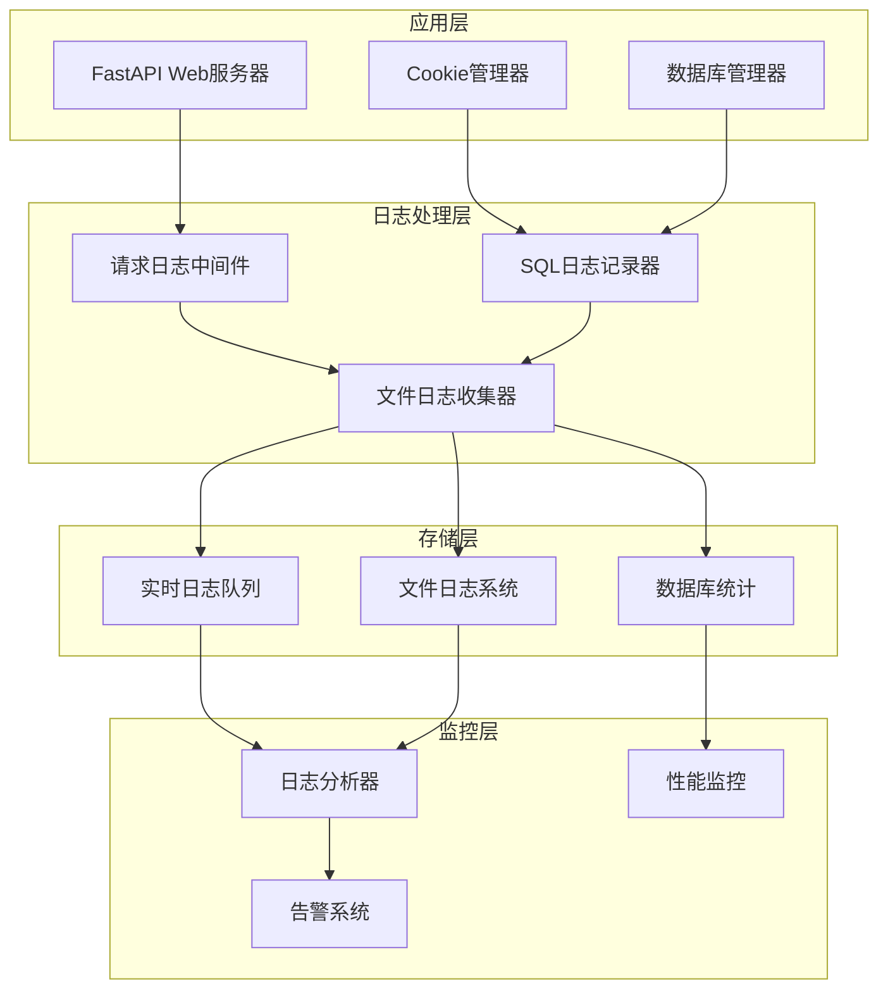
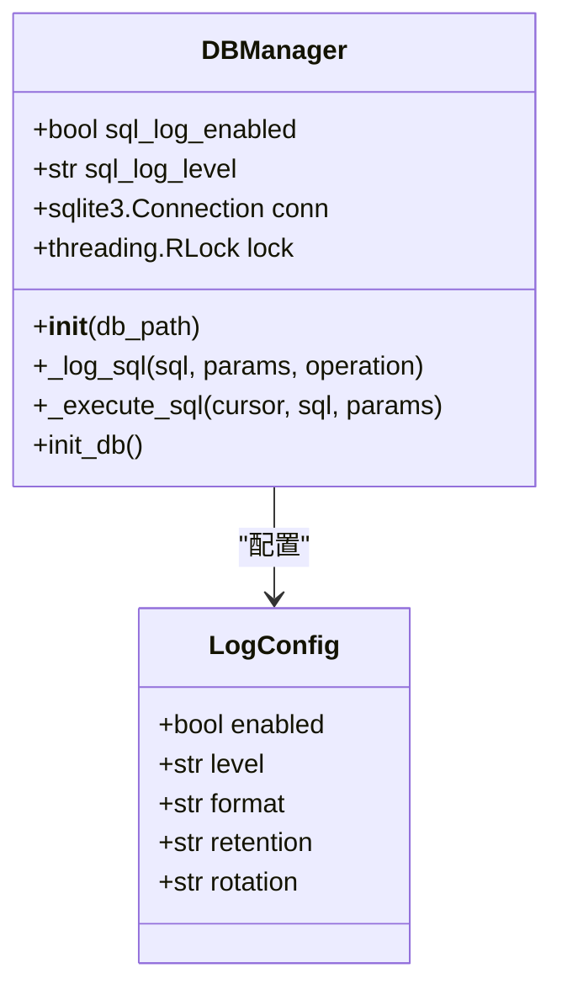
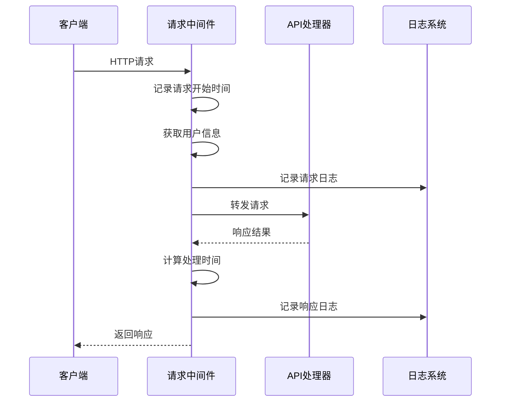
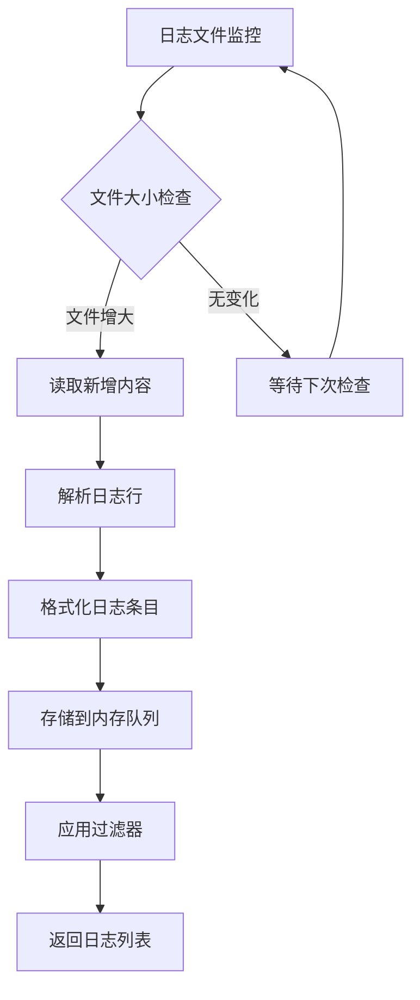
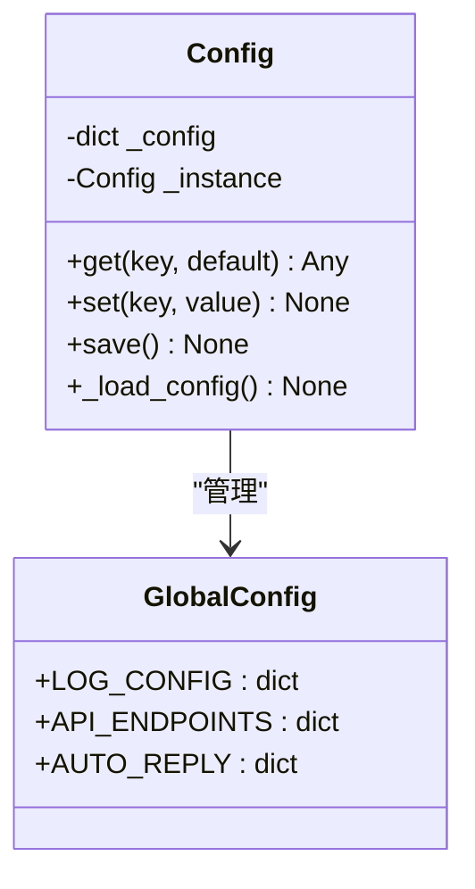
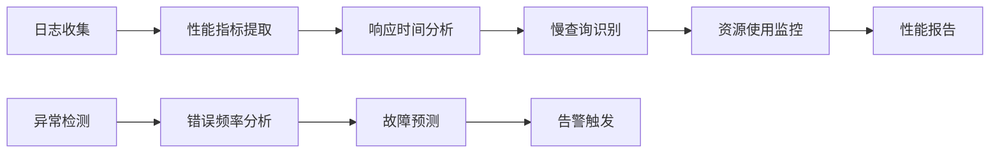
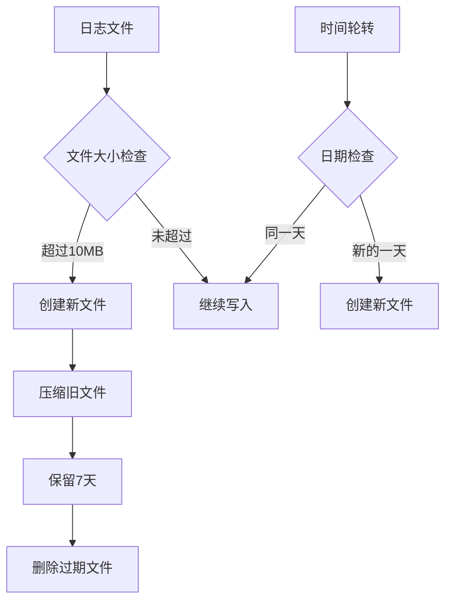

# 日志监控

<cite>
**本文档引用的文件**
- [db_manager.py](file://db_manager.py)
- [reply_server.py](file://reply_server.py)
- [file_log_collector.py](file://file_log_collector.py)
- [config.py](file://config.py)
- [global_config.yml](file://global_config.yml)
- [Start.py](file://Start.py)
- [simple_stats_server.py](file://simple_stats_server.py)
</cite>

## 目录
1. [简介](#简介)
2. [系统架构概览](#系统架构概览)
3. [SQL日志记录系统](#sql日志记录系统)
4. [API请求日志系统](#api请求日志系统)
5. [文件日志收集器](#文件日志收集器)
6. [日志配置管理](#日志配置管理)
7. [日志分析与性能监控](#日志分析与性能监控)
8. [日志轮转与存储策略](#日志轮转与存储策略)
9. [故障排除指南](#故障排除指南)
10. [最佳实践建议](#最佳实践建议)

## 简介

闲鱼自动回复系统采用多层次的日志监控架构，通过SQL日志记录、API请求日志、文件日志收集器等组件，实现了全面的系统监控和性能分析能力。该系统支持多种日志级别、灵活的配置选项和智能的日志轮转机制，确保系统在生产环境中的稳定运行和可维护性。

## 系统架构概览

系统日志监控架构采用分层设计，包含以下核心组件：



**图表来源**
- [reply_server.py](file://reply_server.py#L330-L365)
- [db_manager.py](file://db_manager.py#L53-L62)
- [file_log_collector.py](file://file_log_collector.py#L15-L50)

## SQL日志记录系统

### SQL日志配置

系统通过`DBManager`类实现了强大的SQL日志记录功能，支持动态配置和多种日志级别。



**图表来源**
- [db_manager.py](file://db_manager.py#L53-L62)
- [global_config.yml](file://global_config.yml#L49-L56)

### SQL日志级别控制

系统支持以下SQL日志级别配置：

| 日志级别 | 描述 | 使用场景 |
|---------|------|----------|
| DEBUG | 详细SQL执行信息 | 开发调试阶段 |
| INFO | 标准SQL操作记录 | 生产环境监控 |
| WARNING | SQL执行警告信息 | 性能问题预警 |
| ERROR | SQL执行错误记录 | 故障诊断 |

### SQL日志格式

SQL日志采用统一格式，包含以下信息：
- 时间戳
- 操作类型（查询、插入、更新、删除）
- SQL语句
- 参数信息
- 执行耗时

**章节来源**
- [db_manager.py](file://db_manager.py#L1113-L1148)

### SQL日志启用配置

通过环境变量或配置文件控制SQL日志：

```bash
# 启用SQL日志
export SQL_LOG_ENABLED=true
export SQL_LOG_LEVEL=INFO

# 禁用SQL日志
export SQL_LOG_ENABLED=false
```

**章节来源**
- [db_manager.py](file://db_manager.py#L58-L61)

## API请求日志系统

### 请求日志中间件

系统在`reply_server.py`中实现了完整的HTTP请求日志中间件，记录所有API请求和响应信息。



**图表来源**
- [reply_server.py](file://reply_server.py#L330-L357)

### 请求日志内容

每次API请求都会记录以下信息：

| 字段 | 描述 | 示例 |
|------|------|------|
| 时间戳 | 请求发生时间 | 2024-01-15 10:30:45.123 |
| 用户信息 | 认证用户标识 | 【admin#1】 |
| 请求方法 | HTTP方法 | GET, POST, PUT, DELETE |
| 请求路径 | API端点 | /api/login |
| 响应状态码 | HTTP状态码 | 200, 401, 500 |
| 处理耗时 | 请求处理时间 | 0.123s |

### 异常请求识别

系统能够自动识别和记录异常请求模式：
- 超时请求
- 频繁失败的请求
- 异常的请求频率
- 错误的认证尝试

**章节来源**
- [reply_server.py](file://reply_server.py#L330-L357)

## 文件日志收集器

### 实时日志监控

`FileLogCollector`类提供了高效的文件日志监控功能，支持实时日志收集和分析。



**图表来源**
- [file_log_collector.py](file://file_log_collector.py#L78-L101)

### 日志收集特性

| 特性 | 描述 | 配置参数 |
|------|------|----------|
| 实时监控 | 持续监控日志文件变化 | 0.5秒检查间隔 |
| 内存缓存 | 最多缓存2000条日志 | max_logs=2000 |
| 自动轮转 | 支持日志文件轮转 | rotation="10 MB" |
| 多格式支持 | 支持多种日志格式 | 自动解析 |
| 过滤功能 | 支持级别和源过滤 | level_filter, source_filter |

### 日志解析机制

系统能够自动解析不同格式的日志行：

```python
# 日志格式示例
pattern = r'(\d{4}-\d{2}-\d{2} \d{2}:\d{2}:\d{2}\.\d{3}) \| (\w+) \| ([^:]+):([^:]+):(\d+) - (.*)'
```

**章节来源**
- [file_log_collector.py](file://file_log_collector.py#L102-L146)

## 日志配置管理

### 配置文件结构

系统通过`global_config.yml`文件集中管理日志配置：

```yaml
LOG_CONFIG:
  compression: zip
  format: '<green>{time:YYYY-MM-DD HH:mm:ss.SSS}</green> | <level>{level: <8}</level> | <cyan>{name}</cyan>:<cyan>{function}</cyan>:<cyan>{line}</cyan> - <level>{message}</level>'
  level: INFO
  retention: 7 days
  rotation: 1 day
```

### 动态配置更新

通过`Config`类实现配置的动态加载和保存：



**图表来源**
- [config.py](file://config.py#L5-L87)
- [global_config.yml](file://global_config.yml#L49-L56)

**章节来源**
- [config.py](file://config.py#L34-L68)
- [global_config.yml](file://global_config.yml#L49-L56)

## 日志分析与性能监控

### 性能瓶颈识别

系统通过日志分析识别性能瓶颈：



### 关键性能指标

| 指标 | 计算方法 | 告警阈值 |
|------|----------|----------|
| 平均响应时间 | 所有请求处理时间平均值 | >500ms |
| 错误率 | 错误响应/总请求数 | >5% |
| QPS | 每秒请求数 | 根据业务需求设定 |
| 数据库连接数 | 活跃数据库连接数 | >80%最大连接数 |

### 慢查询识别

通过SQL日志识别慢查询：
- 执行时间超过阈值的SQL语句
- 频繁执行的低效查询
- 数据库锁等待情况

**章节来源**
- [db_manager.py](file://db_manager.py#L1113-L1148)

## 日志轮转与存储策略

### 日志轮转配置

系统采用多层日志轮转策略：



**图表来源**
- [file_log_collector.py](file://file_log_collector.py#L67-L70)

### 存储策略配置

| 参数 | 默认值 | 描述 |
|------|--------|------|
| rotation | 10 MB | 文件大小达到此值时轮转 |
| retention | 3 days | 保留日志文件的时间 |
| compression | zip | 日志文件压缩格式 |
| buffering | 1 | 缓冲模式（行缓冲） |

### 存储优化

- **内存管理**：使用固定大小的队列限制内存使用
- **磁盘空间**：定期清理过期日志文件
- **压缩存储**：自动压缩历史日志文件
- **异步写入**：非阻塞的日志写入机制

**章节来源**
- [file_log_collector.py](file://file_log_collector.py#L67-L70)

## 故障排除指南

### 常见日志问题

| 问题 | 症状 | 解决方案 |
|------|------|----------|
| 日志丢失 | 部分请求无日志记录 | 检查中间件配置和权限 |
| 日志过大 | 磁盘空间不足 | 调整轮转配置和保留时间 |
| 性能下降 | 系统响应变慢 | 检查日志级别设置 |
| 格式错误 | 日志解析失败 | 验证日志格式配置 |

### 调试步骤

1. **检查日志配置**：验证`global_config.yml`中的日志设置
2. **确认中间件加载**：确保请求日志中间件已正确注册
3. **检查文件权限**：验证日志文件的读写权限
4. **监控资源使用**：检查CPU、内存和磁盘使用情况

### 性能优化建议

- **调整日志级别**：生产环境中使用INFO级别
- **优化轮转策略**：根据存储容量调整轮转配置
- **启用异步写入**：避免阻塞主线程
- **定期清理**：建立自动化清理机制

**章节来源**
- [file_log_collector.py](file://file_log_collector.py#L102-L146)

## 最佳实践建议

### 日志配置最佳实践

1. **分级配置**：开发环境使用DEBUG级别，生产环境使用INFO级别
2. **合理轮转**：根据业务需求设置合适的轮转策略
3. **安全考虑**：避免在日志中记录敏感信息
4. **监控集成**：将日志系统与监控工具集成

### 性能监控建议

1. **定期分析**：建立定期的日志分析流程
2. **告警设置**：配置关键指标的告警阈值
3. **趋势分析**：关注日志数据的趋势变化
4. **容量规划**：根据日志增长趋势规划存储容量

### 运维管理建议

1. **备份策略**：定期备份重要日志数据
2. **访问控制**：限制日志文件的访问权限
3. **审计跟踪**：记录日志系统的变更操作
4. **文档维护**：保持日志配置文档的更新

通过以上全面的日志监控体系，系统能够提供可靠的运行状态监控、性能分析和故障诊断能力，确保闲鱼自动回复系统在各种环境下的稳定高效运行。