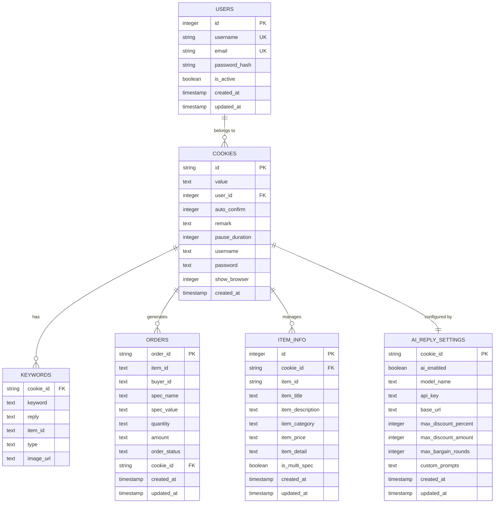
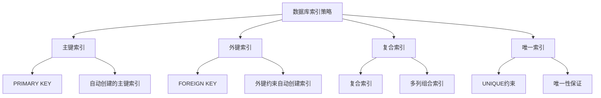
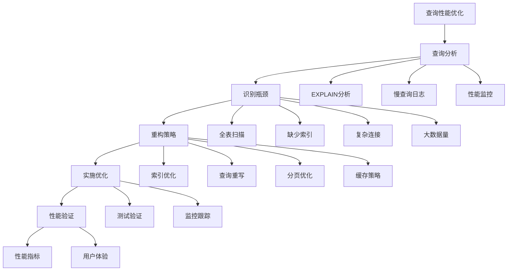
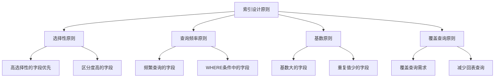

# 查询优化

<cite>
**本文档引用的文件**
- [db_manager.py](file://db_manager.py)
- [config.py](file://config.py)
- [simple_stats_server.py](file://simple_stats_server.py)
</cite>

## 目录
1. [简介](#简介)
2. [数据库架构概述](#数据库架构概述)
3. [常见查询模式分析](#常见查询模式分析)
4. [EXPLAIN语句分析查询执行计划](#explain语句分析查询执行计划)
5. [索引优化策略](#索引优化策略)
6. [复杂查询优化示例](#复杂查询优化示例)
7. [查询重构与性能优化](#查询重构与性能优化)
8. [性能监控与诊断](#性能监控与诊断)
9. [最佳实践建议](#最佳实践建议)
10. [总结](#总结)

## 简介

本文档基于`db_manager.py`中的实际查询方法，深入分析数据库查询性能优化技术。通过分析项目中的具体查询场景，提供实用的优化策略和最佳实践，帮助开发者识别性能瓶颈并提升数据库查询效率。

## 数据库架构概述

该项目采用SQLite数据库，主要包含以下核心表结构：



**图表来源**
- [db_manager.py](file://db_manager.py#L74-L234)

**节来源**
- [db_manager.py](file://db_manager.py#L74-L234)

## 常见查询模式分析

### 通过cookie_id进行数据检索

项目中最频繁的查询模式是基于cookie_id的数据检索，主要用于：

#### 1. 获取Cookie详细信息
```python
# 查询示例：获取单个Cookie的详细信息
cursor.execute("SELECT id, value, user_id, auto_confirm, remark, pause_duration FROM cookies WHERE id = ?", (cookie_id,))
```

#### 2. 获取关键字列表
```python
# 查询示例：获取特定Cookie的所有关键字
cursor.execute("SELECT keyword, reply, item_id, type FROM keywords WHERE cookie_id = ?", (cookie_id,))
```

#### 3. 获取订单信息
```python
# 查询示例：获取特定Cookie的订单列表
cursor.execute("SELECT order_id, item_id, buyer_id, spec_name, spec_value FROM orders WHERE cookie_id = ? ORDER BY created_at DESC LIMIT ?", (cookie_id, limit))
```

### 通过user_id进行数据检索

```python
# 查询示例：获取用户的所有Cookie
cursor.execute("SELECT id, value FROM cookies WHERE user_id = ?", (user_id,))
```

**节来源**
- [db_manager.py](file://db_manager.py#L1213-L1237)
- [db_manager.py](file://db_manager.py#L3885-L3918)
- [db_manager.py](file://db_manager.py#L4507-L4538)

## EXPLAIN语句分析查询执行计划

### SQLite EXPLAIN QUERY PLAN

SQLite提供了`EXPLAIN QUERY PLAN`语句来分析查询执行计划：

```sql
EXPLAIN QUERY PLAN SELECT * FROM cookies WHERE id = 'some_cookie_id';
```

### 查询执行计划分析要点

1. **全表扫描识别**：当执行计划显示`SCAN TABLE`时，表示进行了全表扫描
2. **索引使用情况**：检查是否使用了适当的索引来加速查询
3. **查询成本估算**：关注SQLite估算的查询成本值

### 实际查询分析示例

#### 低效查询（无索引）
```sql
-- 低效查询：没有索引的WHERE条件
EXPLAIN QUERY PLAN SELECT * FROM cookies WHERE user_id = 1;
```

#### 高效查询（使用索引）
```sql
-- 高效查询：使用了idx_cards_user_id索引
EXPLAIN QUERY PLAN SELECT * FROM cards WHERE user_id = 1;
```

**节来源**
- [db_manager.py](file://db_manager.py#L243-L245)

## 索引优化策略

### 现有索引分析

项目中已经实现了多个关键索引：



### 关键索引实现

#### 1. 用户ID索引
```python
# 在cards表上创建user_id索引
self._execute_sql(cursor, "CREATE INDEX IF NOT EXISTS idx_cards_user_id ON cards(user_id)")
```

#### 2. 关键字唯一索引
```python
# 创建复合唯一索引
cursor.execute('''
CREATE UNIQUE INDEX idx_keywords_unique_with_item
ON keywords(cookie_id, keyword, item_id)
WHERE item_id IS NOT NULL AND item_id != ''
''')
```

#### 3. 统计服务索引
```python
# 在统计服务中创建的索引
cursor.execute('CREATE INDEX IF NOT EXISTS idx_anonymous_id ON user_stats(anonymous_id)')
cursor.execute('CREATE INDEX IF NOT EXISTS idx_last_seen ON user_stats(last_seen)')
```

### 索引优化建议

#### 1. 添加缺失索引
```sql
-- 为频繁查询的字段添加索引
CREATE INDEX idx_cookies_user_id ON cookies(user_id);
CREATE INDEX idx_keywords_cookie_id ON keywords(cookie_id);
CREATE INDEX idx_orders_cookie_id ON orders(cookie_id);
CREATE INDEX idx_item_info_cookie_id ON item_info(cookie_id);
```

#### 2. 复合索引设计
```sql
-- 设计复合索引以支持多条件查询
CREATE INDEX idx_orders_status_created ON orders(order_status, created_at);
CREATE INDEX idx_ai_conversations_chat_item ON ai_conversations(chat_id, item_id);
```

**节来源**
- [db_manager.py](file://db_manager.py#L243-L245)
- [db_manager.py](file://db_manager.py#L1078-L1083)
- [simple_stats_server.py](file://simple_stats_server.py#L48-L49)

## 复杂查询优化示例

### 多表连接查询优化

#### 优化前：嵌套子查询
```sql
-- 低效查询：多次嵌套子查询
SELECT c.id, c.value, k.keyword, k.reply
FROM cookies c
LEFT JOIN keywords k ON c.id = k.cookie_id
WHERE c.user_id = ?
AND k.keyword LIKE ?
ORDER BY c.created_at DESC
LIMIT 100;
```

#### 优化后：合理使用索引和连接
```sql
-- 高效查询：利用索引和适当连接
SELECT c.id, c.value, k.keyword, k.reply
FROM cookies c
LEFT JOIN keywords k ON c.id = k.cookie_id
WHERE c.user_id = ?
AND k.keyword LIKE ?
AND c.id IN (SELECT cookie_id FROM keywords WHERE keyword LIKE ?)
ORDER BY c.created_at DESC
LIMIT 100;
```

### 分页查询优化

#### 传统分页问题
```sql
-- 传统分页：随着偏移量增大性能下降
SELECT * FROM orders 
WHERE cookie_id = ? 
ORDER BY created_at DESC 
LIMIT 100 OFFSET 10000;
```

#### 优化方案：基于游标的分页
```sql
-- 基于游标的分页：性能稳定
SELECT * FROM orders 
WHERE cookie_id = ? 
AND created_at < ? 
ORDER BY created_at DESC 
LIMIT 100;
```

### 大数据量查询优化

#### 场景：获取大量订单数据
```python
# 优化前：一次性加载所有数据
def get_all_orders_old(cookie_id: str):
    cursor.execute("SELECT * FROM orders WHERE cookie_id = ?", (cookie_id,))
    return cursor.fetchall()

# 优化后：分批加载数据
def get_orders_paginated(cookie_id: str, page_size: int = 1000):
    offset = 0
    while True:
        cursor.execute("""
            SELECT * FROM orders 
            WHERE cookie_id = ? 
            ORDER BY created_at DESC 
            LIMIT ? OFFSET ?
        """, (cookie_id, page_size, offset))
        
        batch = cursor.fetchall()
        if not batch:
            break
            
        yield batch
        offset += page_size
```

**节来源**
- [db_manager.py](file://db_manager.py#L4507-L4538)

## 查询重构与性能优化

### 查询重构原则



### 具体优化案例

#### 1. Cookie状态查询优化
```python
# 优化前：多次查询
def get_cookie_status_old(cookie_id: str):
    # 查询Cookie基本信息
    cursor.execute("SELECT * FROM cookies WHERE id = ?", (cookie_id,))
    cookie = cursor.fetchone()
    
    # 查询Cookie状态
    cursor.execute("SELECT enabled FROM cookie_status WHERE cookie_id = ?", (cookie_id,))
    status = cursor.fetchone()
    
    return {"cookie": cookie, "status": status}

# 优化后：单次连接查询
def get_cookie_status_optimized(cookie_id: str):
    cursor.execute("""
        SELECT c.*, cs.enabled 
        FROM cookies c 
        LEFT JOIN cookie_status cs ON c.id = cs.cookie_id 
        WHERE c.id = ?
    """, (cookie_id,))
    return cursor.fetchone()
```

#### 2. AI设置查询优化
```python
# 优化前：多个字段分别查询
def get_ai_settings_old(cookie_id: str):
    cursor.execute("SELECT ai_enabled FROM ai_reply_settings WHERE cookie_id = ?", (cookie_id,))
    enabled = cursor.fetchone()
    
    cursor.execute("SELECT model_name FROM ai_reply_settings WHERE cookie_id = ?", (cookie_id,))
    model = cursor.fetchone()
    
    # ... 其他字段查询
    
    return {"enabled": enabled, "model": model, ...}

# 优化后：单次查询获取所有字段
def get_ai_settings_optimized(cookie_id: str):
    cursor.execute("""
        SELECT ai_enabled, model_name, api_key, base_url,
               max_discount_percent, max_discount_amount, max_bargain_rounds,
               custom_prompts
        FROM ai_reply_settings WHERE cookie_id = ?
    """, (cookie_id,))
    result = cursor.fetchone()
    # 返回字典结构
```

### 缓存策略

#### Redis缓存集成
```python
import redis
import json

# 缓存管理器
class QueryCache:
    def __init__(self):
        self.redis_client = redis.Redis(host='localhost', port=6379, db=0)
    
    def get_cached_query(self, cache_key: str, ttl: int = 300):
        cached_data = self.redis_client.get(cache_key)
        if cached_data:
            return json.loads(cached_data)
        return None
    
    def set_cached_query(self, cache_key: str, data: dict, ttl: int = 300):
        self.redis_client.setex(cache_key, ttl, json.dumps(data))
```

**节来源**
- [db_manager.py](file://db_manager.py#L1796-L1843)
- [db_manager.py](file://db_manager.py#L1240-L1264)

## 性能监控与诊断

### SQL日志配置

项目内置了详细的SQL日志功能：

```python
# SQL日志配置
self.sql_log_enabled = True  # 默认启用SQL日志
self.sql_log_level = 'INFO'  # 默认使用INFO级别

# 日志记录函数
def _log_sql(self, sql: str, params: tuple = None, operation: str = "EXECUTE"):
    if not self.sql_log_enabled:
        return
        
    # 格式化SQL和参数
    formatted_sql = ' '.join(sql.split())
    params_str = f" | 参数: [{', '.join(formatted_params)}]" if params else ""
    
    log_message = f"🗄️ SQL {operation}: {formatted_sql}{params_str}"
    
    # 根据配置的日志级别输出
    if self.sql_log_level == 'DEBUG':
        logger.debug(log_message)
    elif self.sql_log_level == 'INFO':
        logger.info(log_message)
    elif self.sql_log_level == 'WARNING':
        logger.warning(log_message)
```

### 性能监控指标

#### 1. 查询执行时间监控
```python
import time

class PerformanceMonitor:
    def __init__(self):
        self.query_times = []
    
    def timed_query(self, sql: str, params=None):
        start_time = time.time()
        
        try:
            result = self._execute_sql(sql, params)
            execution_time = time.time() - start_time
            
            # 记录慢查询
            if execution_time > 1.0:  # 超过1秒的查询
                logger.warning(f"慢查询警告: {sql} 执行时间: {execution_time:.2f}s")
            
            self.query_times.append(execution_time)
            return result
        except Exception as e:
            logger.error(f"查询执行失败: {sql} - {e}")
            raise
```

#### 2. 数据库统计信息
```python
def get_database_stats():
    """获取数据库统计信息"""
    stats = {}
    
    # 获取表大小
    cursor.execute("SELECT name FROM sqlite_master WHERE type='table'")
    tables = cursor.fetchall()
    
    for table in tables:
        cursor.execute(f"SELECT COUNT(*) FROM {table[0]}")
        stats[table[0]] = {"row_count": cursor.fetchone()[0]}
    
    return stats
```

### 慢查询识别

#### 慢查询阈值设置
```python
# 慢查询阈值配置
SLOW_QUERY_THRESHOLD = {
    'read': 1.0,      # 读操作超过1秒
    'write': 5.0,     # 写操作超过5秒
    'complex': 10.0   # 复杂查询超过10秒
}

# 慢查询监控装饰器
def monitor_slow_queries(threshold: float = 1.0):
    def decorator(func):
        def wrapper(*args, **kwargs):
            start_time = time.time()
            result = func(*args, **kwargs)
            execution_time = time.time() - start_time
            
            if execution_time > threshold:
                logger.warning(f"慢查询检测: {func.__name__} 执行时间 {execution_time:.2f}s")
            
            return result
        return wrapper
    return decorator
```

**节来源**
- [db_manager.py](file://db_manager.py#L1108-L1148)

## 最佳实践建议

### 1. 查询设计原则

#### 单一职责原则
```python
# 好的做法：每个查询专注于单一任务
def get_cookie_details(cookie_id: str):
    """获取Cookie详细信息"""
    cursor.execute("""
        SELECT id, value, user_id, auto_confirm, remark, pause_duration, 
               username, password, show_browser, created_at 
        FROM cookies 
        WHERE id = ?
    """, (cookie_id,))
    return cursor.fetchone()

def get_cookie_keywords(cookie_id: str):
    """获取Cookie相关关键字"""
    cursor.execute("""
        SELECT keyword, reply, item_id, type 
        FROM keywords 
        WHERE cookie_id = ?
    """, (cookie_id,))
    return cursor.fetchall()
```

#### 避免N+1查询问题
```python
# 错误做法：循环查询
def get_cookies_with_keywords_old(user_id: int):
    cookies = get_user_cookies(user_id)
    for cookie in cookies:
        cookie['keywords'] = get_cookie_keywords(cookie['id'])
    return cookies

# 正确做法：批量查询
def get_cookies_with_keywords_optimized(user_id: int):
    # 获取所有Cookie
    cookies = get_user_cookies(user_id)
    cookie_ids = [c['id'] for c in cookies]
    
    # 批量获取关键字
    cursor.execute("""
        SELECT cookie_id, keyword, reply 
        FROM keywords 
        WHERE cookie_id IN ({})
    """.format(','.join(['?']*len(cookie_ids))), cookie_ids)
    
    keywords_map = defaultdict(list)
    for row in cursor.fetchall():
        keywords_map[row[0]].append({'keyword': row[1], 'reply': row[2]})
    
    # 组装结果
    for cookie in cookies:
        cookie['keywords'] = keywords_map.get(cookie['id'], [])
    
    return cookies
```

### 2. 索引设计最佳实践

#### 索引选择原则


#### 索引维护策略
```python
class IndexMaintenance:
    def __init__(self, db_manager):
        self.db_manager = db_manager
    
    def analyze_table(self, table_name: str):
        """分析表统计信息"""
        cursor = self.db_manager.conn.cursor()
        cursor.execute(f"ANALYZE {table_name}")
        return cursor.fetchall()
    
    def rebuild_index(self, table_name: str, index_name: str):
        """重建索引以优化碎片"""
        cursor = self.db_manager.conn.cursor()
        cursor.execute(f"REINDEX {index_name}")
        return cursor.rowcount
    
    def optimize_database(self):
        """数据库优化综合措施"""
        cursor = self.db_manager.conn.cursor()
        
        # 1. 分析表统计信息
        cursor.execute("SELECT name FROM sqlite_master WHERE type='table'")
        tables = cursor.fetchall()
        
        for table in tables:
            self.analyze_table(table[0])
        
        # 2. 重建主要索引
        indices_to_rebuild = [
            'idx_cards_user_id',
            'idx_keywords_cookie_id',
            'idx_orders_cookie_id'
        ]
        
        for index in indices_to_rebuild:
            self.rebuild_index('main', index)
        
        # 3. 清理数据库
        cursor.execute("VACUUM")
```

### 3. 连接池和事务管理

#### 连接池实现
```python
import threading
from queue import Queue

class ConnectionPool:
    def __init__(self, db_path: str, pool_size: int = 5):
        self.db_path = db_path
        self.pool_size = pool_size
        self.connection_queue = Queue()
        self.lock = threading.Lock()
        
        # 初始化连接池
        for _ in range(pool_size):
            conn = sqlite3.connect(db_path, check_same_thread=False)
            self.connection_queue.put(conn)
    
    def get_connection(self):
        return self.connection_queue.get()
    
    def release_connection(self, conn):
        self.connection_queue.put(conn)
    
    def close_all_connections(self):
        while not self.connection_queue.empty():
            conn = self.connection_queue.get()
            conn.close()
```

#### 事务优化
```python
class OptimizedTransaction:
    def __init__(self, db_manager):
        self.db_manager = db_manager
    
    @contextmanager
    def transaction(self):
        """优化的事务管理"""
        cursor = self.db_manager.conn.cursor()
        try:
            # 设置延迟提交
            cursor.execute("BEGIN IMMEDIATE")
            
            yield cursor
            
            # 批量提交
            self.db_manager.conn.commit()
            
        except Exception as e:
            self.db_manager.conn.rollback()
            logger.error(f"事务执行失败: {e}")
            raise
    
    def bulk_insert(self, table: str, data_list: list, columns: list):
        """批量插入优化"""
        if not data_list:
            return
        
        placeholders = ','.join(['?' for _ in columns])
        columns_str = ','.join(columns)
        
        sql = f"INSERT INTO {table} ({columns_str}) VALUES ({placeholders})"
        
        with self.transaction() as cursor:
            cursor.executemany(sql, [tuple(item[col] for col in columns) for item in data_list])
```

### 4. 数据库配置优化

#### SQLite配置优化
```python
def optimize_sqlite_config(conn):
    """SQLite数据库配置优化"""
    
    # WAL模式提高并发性能
    conn.execute("PRAGMA journal_mode = WAL")
    
    # 同步模式优化
    conn.execute("PRAGMA synchronous = NORMAL")
    
    # 缓冲区大小优化
    conn.execute("PRAGMA cache_size = -64000")  # 64MB缓存
    
    # 自动清理优化
    conn.execute("PRAGMA temp_store = MEMORY")
    
    # 编译选项优化
    conn.execute("PRAGMA compile_options")
```

**节来源**
- [db_manager.py](file://db_manager.py#L1108-L1148)

## 总结

本文档通过分析`db_manager.py`中的实际查询实现，提供了全面的数据库查询优化指南。主要内容包括：

### 核心优化技术
1. **索引策略**：合理设计和使用索引，特别是复合索引和覆盖索引
2. **查询重构**：避免N+1查询问题，优化多表连接查询
3. **分页优化**：使用基于游标的分页替代OFFSET分页
4. **缓存策略**：结合Redis等缓存技术提升查询性能

### 性能监控体系
1. **SQL日志**：内置的SQL执行日志系统
2. **慢查询监控**：自动识别和记录慢查询
3. **性能指标**：建立完善的性能监控指标体系

### 最佳实践
1. **查询设计原则**：遵循单一职责和避免N+1查询
2. **索引设计**：基于查询模式和数据分布设计索引
3. **事务管理**：优化事务处理和连接池管理
4. **数据库配置**：针对SQLite特性进行配置优化

通过实施这些优化策略，可以显著提升数据库查询性能，改善系统的整体响应时间和用户体验。建议在实际应用中结合具体的业务场景和数据特征，持续监控和优化查询性能。