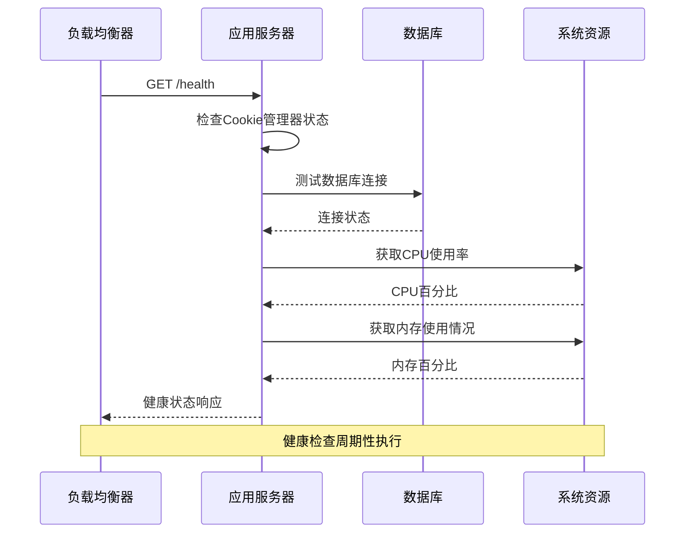
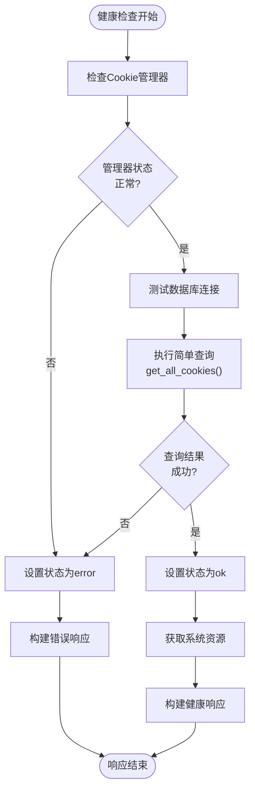
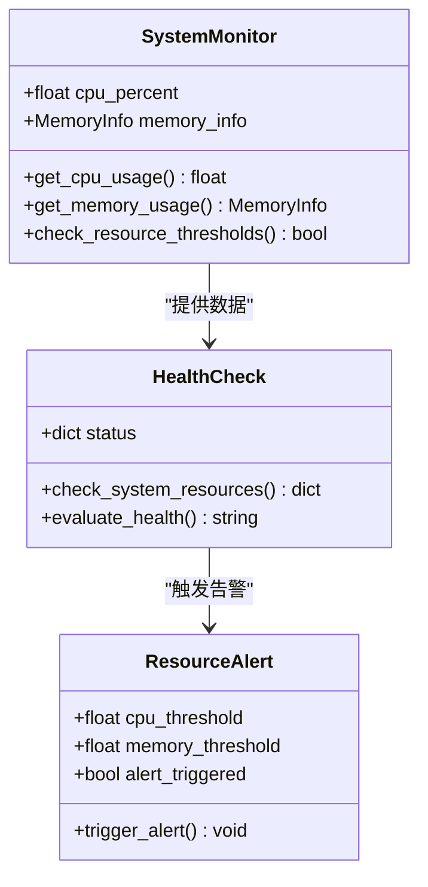
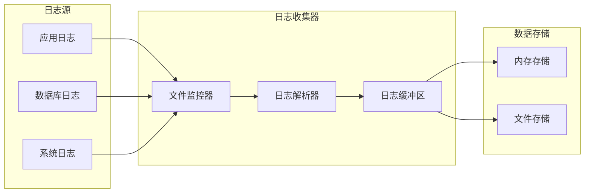
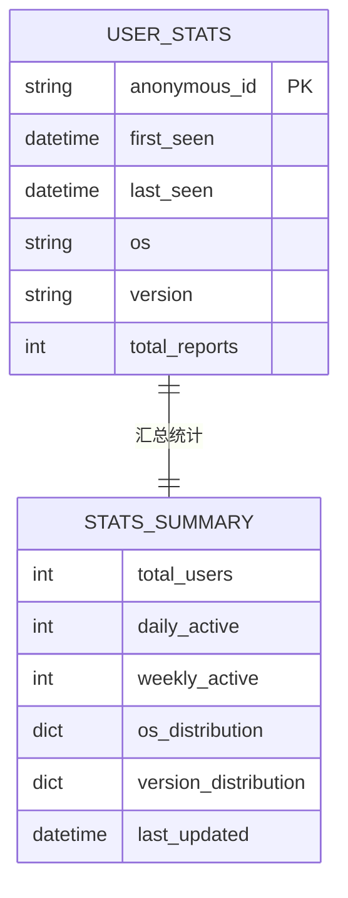

# 系统集成监控文档

<cite>
**本文档引用的文件**
- [reply_server.py](file://reply_server.py)
- [db_manager.py](file://db_manager.py)
- [config.py](file://config.py)
- [simple_stats_server.py](file://simple_stats_server.py)
- [file_log_collector.py](file://file_log_collector.py)
- [global_config.yml](file://global_config.yml)
- [docker-compose.yml](file://docker-compose.yml)
- [usage_statistics.py](file://usage_statistics.py)
</cite>

## 目录
1. [概述](#概述)
2. [健康检查系统](#健康检查系统)
3. [数据库性能监控](#数据库性能监控)
4. [系统资源监控](#系统资源监控)
5. [监控数据收集](#监控数据收集)
6. [告警配置](#告警配置)
7. [部署场景](#部署场景)
8. [最佳实践](#最佳实践)

## 概述

闲鱼自动回复系统采用多层次的监控架构，通过健康检查端点、数据库性能监控、系统资源监控和日志收集等组件，实现全面的系统状态监控和性能分析。本文档详细说明了这些监控组件如何协同工作，以及如何配置和优化监控系统。

## 健康检查系统

### 健康检查端点设计

系统提供了专门的健康检查端点 `/health`，用于监控整个系统的运行状态。该端点不仅检查应用本身的健康状态，还深度集成了数据库连接和系统资源监控。



**图表来源**
- [reply_server.py](file://reply_server.py#L373-L418)

### 健康检查逻辑

健康检查端点实现了以下核心功能：

1. **Cookie管理器状态检查**：验证Cookie管理器是否正常初始化
2. **数据库连接测试**：执行简单的数据库查询验证连接可用性
3. **系统资源监控**：实时获取CPU和内存使用情况
4. **综合状态评估**：根据各组件状态计算整体健康状态

**节来源**
- [reply_server.py](file://reply_server.py#L373-L418)

### 健康检查响应格式

健康检查返回标准化的JSON响应，包含详细的系统状态信息：

| 字段 | 类型 | 描述 |
|------|------|------|
| status | string | 健康状态：healthy/unhealthy |
| timestamp | float | 时间戳 |
| services.cookie_manager | string | Cookie管理器状态：ok/error |
| services.database | string | 数据库连接状态：ok/error |
| system.cpu_percent | float | CPU使用百分比 |
| system.memory_percent | float | 内存使用百分比 |
| system.memory_available | int | 可用内存字节数 |

## 数据库性能监控

### 数据库连接监控

系统通过多种方式监控数据库性能和连接状态：



**图表来源**
- [reply_server.py](file://reply_server.py#L373-L418)

### SQL执行监控

数据库管理器实现了详细的SQL执行监控机制：

1. **SQL日志记录**：可配置的SQL执行日志记录
2. **执行时间监控**：跟踪SQL语句执行时间
3. **错误捕获**：捕获和记录SQL执行错误
4. **性能分析**：分析慢查询和性能瓶颈

**节来源**
- [db_manager.py](file://db_manager.py#L1142-L1148)

### 数据库连接池管理

系统使用SQLite数据库，通过连接池管理实现高效的数据库访问：

- **连接复用**：避免频繁建立和断开数据库连接
- **并发控制**：通过锁机制保证线程安全
- **自动重连**：在网络异常时自动尝试重新连接

**节来源**
- [db_manager.py](file://db_manager.py#L19-L70)

## 系统资源监控

### CPU和内存监控

系统利用psutil库实现实时的系统资源监控：



**图表来源**
- [reply_server.py](file://reply_server.py#L389-L405)

### 资源使用阈值

系统预设了合理的资源使用阈值：

| 资源类型 | 阈值 | 描述 |
|----------|------|------|
| CPU使用率 | 80% | 超过此值触发警告 |
| 内存使用率 | 85% | 超过此值触发警告 |
| 可用内存 | 512MB | 最低可用内存要求 |

**节来源**
- [reply_server.py](file://reply_server.py#L390-L391)

### 容器化资源限制

在Docker环境中，系统设置了明确的资源限制：

- **内存限制**：2048MB（可配置）
- **CPU限制**：2.0核（可配置）
- **内存预留**：512MB
- **CPU预留**：0.5核

**节来源**
- [docker-compose.yml](file://docker-compose.yml#L70-L77)

## 监控数据收集

### 日志收集系统

系统实现了基于文件监控的日志收集机制：



**图表来源**
- [file_log_collector.py](file://file_log_collector.py#L15-L56)

### 实时日志监控

日志收集器提供实时监控功能：

1. **文件监控**：持续监控日志文件变化
2. **增量读取**：只读取新增的日志内容
3. **格式解析**：解析标准的loguru格式日志
4. **实时推送**：支持实时日志推送和查询

**节来源**
- [file_log_collector.py](file://file_log_collector.py#L78-L101)

### 用户统计监控

系统集成了用户使用统计功能：



**图表来源**
- [simple_stats_server.py](file://simple_stats_server.py#L22-L46)

**节来源**
- [simple_stats_server.py](file://simple_stats_server.py#L158-L171)

## 告警配置

### 健康检查告警

基于健康检查端点的状态变化配置告警：

```mermaid
stateDiagram-v2
[*] --> Healthy
Healthy --> Unhealthy : 健康检查失败
Unhealthy --> Healthy : 健康检查恢复
Unhealthy --> Critical : 连续失败
Critical --> Unhealthy : 部分恢复
Critical --> [*] : 系统重启
note right of Healthy : 状态 : healthy
note left of Unhealthy : 状态 : unhealthy
note right of Critical : 需要人工干预
```

### 数据库连接告警

数据库连接失败的告警规则：

| 告警条件 | 告警级别 | 触发动作 |
|----------|----------|----------|
| 数据库连接超时 | Warning | 记录日志，发送通知 |
| 连接池耗尽 | Critical | 系统降级，限制功能 |
| 查询执行时间 > 5秒 | Warning | 性能告警，优化建议 |

### 系统资源告警

系统资源使用超过阈值时的告警配置：

- **CPU使用率 > 80%**：发送警告通知
- **内存使用率 > 85%**：发送严重警告
- **可用内存 < 512MB**：触发紧急告警

**节来源**
- [docker-compose.yml](file://docker-compose.yml#L63-L68)

## 部署场景

### Docker容器化部署

系统支持Docker容器化部署，包含完整的监控配置：

```yaml
# Docker健康检查配置示例
healthcheck:
  test: ["CMD", "curl", "-f", "http://localhost:8080/health"]
  interval: 30s
  timeout: 10s
  retries: 3
  start_period: 40s
```

**节来源**
- [docker-compose.yml](file://docker-compose.yml#L63-L68)

### 生产环境监控

生产环境推荐的监控配置：

1. **健康检查频率**：每30秒执行一次
2. **超时设置**：10秒超时时间
3. **重试次数**：最多3次重试
4. **启动等待**：40秒启动期

### 监控数据可视化

推荐的监控数据可视化方案：

- **Prometheus + Grafana**：集成系统指标监控
- **ELK Stack**：集中化日志分析和可视化
- **自定义仪表板**：基于Simple Stats Server的数据展示

## 最佳实践

### 监控配置优化

1. **合理设置阈值**：根据系统负载调整资源使用阈值
2. **分级告警**：区分不同级别的告警，避免告警疲劳
3. **定期审查**：定期审查监控配置的有效性
4. **性能基准**：建立系统性能基准，识别性能退化

### 故障排查指南

当系统出现健康检查失败时的排查步骤：

1. **检查数据库连接**：验证数据库服务是否正常运行
2. **监控系统资源**：检查CPU和内存使用情况
3. **查看应用日志**：分析应用层面的错误信息
4. **网络连通性**：验证各组件间的网络连接

### 性能调优建议

1. **数据库优化**：定期分析慢查询，优化索引
2. **连接池配置**：根据并发需求调整连接池大小
3. **资源分配**：合理分配CPU和内存资源
4. **缓存策略**：实施适当的缓存策略提升性能

通过以上监控体系的实施，可以全面掌握系统的运行状态，及时发现和解决问题，确保系统的稳定性和高性能运行。