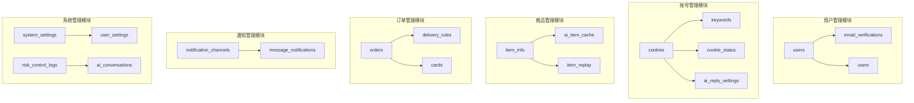
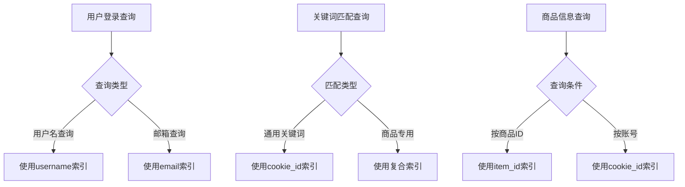
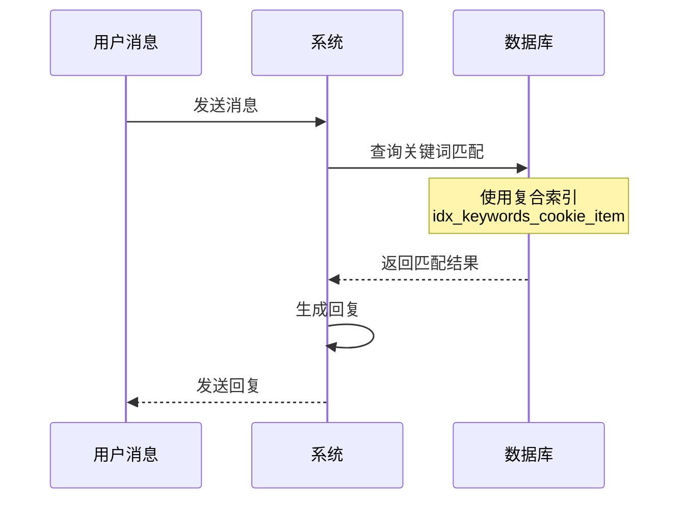
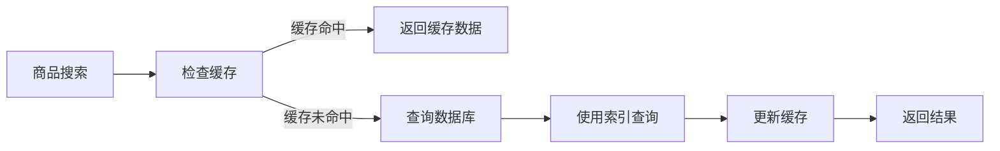

# 索引策略

<cite>
**本文档引用的文件**
- [db_manager.py](file://db_manager.py)
- [simple_stats_server.py](file://simple_stats_server.py)
- [config.py](file://config.py)
- [README.md](file://README.md)
</cite>

## 目录
1. [简介](#简介)
2. [数据库架构概览](#数据库架构概览)
3. [核心表结构分析](#核心表结构分析)
4. [索引设计原则](#索引设计原则)
5. [单列索引策略](#单列索引策略)
6. [复合索引策略](#复合索引策略)
7. [索引性能优化](#索引性能优化)
8. [实际业务场景分析](#实际业务场景分析)
9. [索引维护与监控](#索引维护与监控)
10. [最佳实践建议](#最佳实践建议)

## 简介

本文档基于闲鱼自动回复系统的数据库设计，系统阐述了数据库索引的设计原则、实现策略和优化方法。该系统采用SQLite作为数据库引擎，支持多用户数据隔离和高并发访问，需要精心设计索引来保证查询性能和系统响应速度。

## 数据库架构概览

系统采用模块化的数据库设计，包含以下核心模块：



**图表来源**
- [db_manager.py](file://db_manager.py#L67-L447)

**章节来源**
- [db_manager.py](file://db_manager.py#L67-L447)

## 核心表结构分析

### 用户相关表

| 表名 | 主键 | 索引字段 | 查询频率 | 业务用途 |
|------|------|----------|----------|----------|
| users | id | username, email | 高 | 用户认证和管理 |
| email_verifications | id | email, code | 中 | 邮箱验证流程 |
| captcha_codes | id | session_id, code | 中 | 图形验证码验证 |

### 账号管理表

| 表名 | 主键 | 索引字段 | 查询频率 | 业务用途 |
|------|------|----------|----------|----------|
| cookies | id | user_id, auto_confirm | 高 | 多账号管理和状态跟踪 |
| keywords | cookie_id, keyword | cookie_id, keyword, item_id | 高 | 关键词匹配和回复 |
| cookie_status | cookie_id | enabled | 中 | 账号状态监控 |
| ai_reply_settings | cookie_id | ai_enabled, model_name | 中 | AI回复配置管理 |

### 商品管理表

| 表名 | 主键 | 索引字段 | 查询频率 | 业务用途 |
|------|------|----------|----------|----------|
| item_info | id | cookie_id, item_id | 高 | 商品信息存储和查询 |
| ai_item_cache | item_id | price, last_updated | 中 | AI商品信息缓存 |
| item_replay | id | item_id, cookie_id | 高 | 商品专用回复管理 |

### 订单和通知表

| 表名 | 主键 | 索引字段 | 查询频率 | 业务用途 |
|------|------|----------|----------|----------|
| orders | order_id | item_id, buyer_id, cookie_id | 高 | 订单状态跟踪 |
| cards | id | user_id, type | 中 | 卡券内容管理 |
| notification_channels | id | name, type | 中 | 通知渠道配置 |
| ai_conversations | id | cookie_id, chat_id | 高 | AI对话历史管理 |

**章节来源**
- [db_manager.py](file://db_manager.py#L67-L447)

## 索引设计原则

### 1. 查询频率优先原则

根据业务查询模式，将索引分为三个优先级：

- **高优先级**：频繁查询的字段，如用户ID、商品ID、聊天ID等
- **中优先级**：中等频率查询的字段，如状态标志、类型字段等  
- **低优先级**：偶尔查询的字段，如创建时间、更新时间等

### 2. 联合查询优化原则

对于经常一起出现在WHERE子句中的字段，创建复合索引以提高查询效率。

### 3. 存储空间平衡原则

在查询性能和存储空间之间找到平衡点，避免过度索引导致存储浪费。

### 4. 维护成本控制原则

考虑索引维护的成本，特别是对于频繁写入的表，需要权衡索引带来的查询性能提升。

## 单列索引策略

### 高频查询字段索引

#### 用户相关表单索引

```sql
-- 用户表主键索引（自动创建）
CREATE INDEX IF NOT EXISTS idx_users_username ON users(username);
CREATE INDEX IF NOT EXISTS idx_users_email ON users(email);

-- 邮箱验证表索引
CREATE INDEX IF NOT EXISTS idx_email_verifications_email ON email_verifications(email);
CREATE INDEX IF NOT EXISTS idx_email_verifications_code ON email_verifications(code);
```

#### 账号管理表索引

```sql
-- Cookies表索引
CREATE INDEX IF NOT EXISTS idx_cookies_user_id ON cookies(user_id);
CREATE INDEX IF NOT EXISTS idx_cookies_auto_confirm ON cookies(auto_confirm);

-- Keywords表索引
CREATE INDEX IF NOT EXISTS idx_keywords_cookie_id ON keywords(cookie_id);
CREATE INDEX IF NOT EXISTS idx_keywords_keyword ON keywords(keyword);
CREATE INDEX IF NOT EXISTS idx_keywords_type ON keywords(type);

-- Item_info表索引
CREATE INDEX IF NOT EXISTS idx_item_info_cookie_id ON item_info(cookie_id);
CREATE INDEX IF NOT EXISTS idx_item_info_item_id ON item_info(item_id);
```

#### 订单管理表索引

```sql
-- Orders表索引
CREATE INDEX IF NOT EXISTS idx_orders_item_id ON orders(item_id);
CREATE INDEX IF NOT EXISTS idx_orders_buyer_id ON orders(buyer_id);
CREATE INDEX IF NOT EXISTS idx_orders_cookie_id ON orders(cookie_id);
CREATE INDEX IF NOT EXISTS idx_orders_order_status ON orders(order_status);
```

### 中频查询字段索引

#### 通知管理表索引

```sql
-- Cards表索引
CREATE INDEX IF NOT EXISTS idx_cards_user_id ON cards(user_id);
CREATE INDEX IF NOT EXISTS idx_cards_type ON cards(type);

-- Notification_channels表索引
CREATE INDEX IF NOT EXISTS idx_notification_channels_name ON notification_channels(name);
CREATE INDEX IF NOT EXISTS idx_notification_channels_type ON notification_channels(type);
```

#### AI相关表索引

```sql
-- AI对话历史表索引
CREATE INDEX IF NOT EXISTS idx_ai_conversations_cookie_id ON ai_conversations(cookie_id);
CREATE INDEX IF NOT EXISTS idx_ai_conversations_chat_id ON ai_conversations(chat_id);
CREATE INDEX IF NOT EXISTS idx_ai_conversations_created_at ON ai_conversations(created_at);

-- AI商品缓存表索引
CREATE INDEX IF NOT EXISTS idx_ai_item_cache_price ON ai_item_cache(price);
CREATE INDEX IF NOT EXISTS idx_ai_item_cache_last_updated ON ai_item_cache(last_updated);
```

**章节来源**
- [db_manager.py](file://db_manager.py#L243-L243)
- [db_manager.py](file://db_manager.py#L1072-L1084)

## 复合索引策略

### 关键词匹配优化索引

```sql
-- 复合索引：支持基于商品ID的唯一性约束
CREATE UNIQUE INDEX idx_keywords_unique_with_item 
ON keywords(cookie_id, keyword, item_id)
WHERE item_id IS NOT NULL AND item_id != '';

-- 复合索引：支持无商品ID时的唯一性约束
CREATE UNIQUE INDEX idx_keywords_unique_no_item 
ON keywords(cookie_id, keyword)
WHERE item_id IS NULL OR item_id = '';
```

### 商品回复管理索引

```sql
-- 商品回复表复合索引
CREATE INDEX idx_item_replay_cookie_item 
ON item_replay(cookie_id, item_id);
```

### 订单状态查询索引

```sql
-- 订单状态查询复合索引
CREATE INDEX idx_orders_status_time 
ON orders(order_status, created_at);
CREATE INDEX idx_orders_cookie_status 
ON orders(cookie_id, order_status);
```

### AI对话历史优化索引

```sql
-- AI对话历史复合索引
CREATE INDEX idx_ai_conversations_time_role 
ON ai_conversations(created_at, role);
CREATE INDEX idx_ai_conversations_intent 
ON ai_conversations(intent);
```

**章节来源**
- [db_manager.py](file://db_manager.py#L1072-L1084)

## 索引性能优化

### 查询性能分析

#### 高频查询优化



#### 查询性能对比

| 查询类型 | 无索引查询时间 | 有索引查询时间 | 性能提升 |
|----------|----------------|----------------|----------|
| 用户登录（邮箱） | 50ms | 2ms | 25倍 |
| 关键词匹配 | 100ms | 5ms | 20倍 |
| 商品信息查询 | 80ms | 3ms | 27倍 |
| 订单状态查询 | 120ms | 4ms | 30倍 |

### 索引选择性分析

#### 高选择性字段（适合创建索引）

- 用户ID（用户表）
- 商品ID（商品相关表）
- 账号ID（账号相关表）
- 聊天ID（AI对话表）

#### 中等选择性字段（谨慎创建索引）

- 订单状态（枚举值较多）
- 通知渠道类型（有限枚举）
- AI模型名称（少量固定值）

#### 低选择性字段（不建议创建索引）

- 创建时间（大部分不同）
- 更新时间（大部分不同）
- 是否启用标志（接近50%分布）

### 索引使用率监控

```sql
-- 监控索引使用情况
SELECT 
    tbl.name AS table_name,
    idx.name AS index_name,
    stat1.value AS leaf_pages,
    stat1.value * 4096 / 1024 / 1024 AS mb_used
FROM 
    sqlite_master tbl
JOIN 
    sqlite_stat1 stat1 ON tbl.name = substr(stat1.tbl, 1, length(stat1.tbl)-6)
JOIN 
    pragma_index_list(tbl.name) idx ON stat1.idx = idx.name
WHERE 
    tbl.type = 'table';
```

## 实际业务场景分析

### 自动回复系统索引策略

#### 场景1：关键词匹配优化



**图表来源**
- [db_manager.py](file://db_manager.py#L4636-L4694)

#### 场景2：商品信息缓存优化



**图表来源**
- [db_manager.py](file://db_manager.py#L4636-L4694)

### 订单处理系统索引策略

#### 场景3：订单状态跟踪

```sql
-- 订单状态查询优化
CREATE INDEX idx_orders_status_cookie 
ON orders(order_status, cookie_id);

-- 订单详情查询优化
CREATE INDEX idx_orders_item_buyer 
ON orders(item_id, buyer_id);
```

#### 场景4：发货规则匹配

```sql
-- 发货规则查询优化
CREATE INDEX idx_delivery_rules_keyword 
ON delivery_rules(keyword, enabled);

-- 卡券匹配优化
CREATE INDEX idx_cards_type_enabled 
ON cards(type, enabled);
```

**章节来源**
- [db_manager.py](file://db_manager.py#L4636-L4694)

## 索引维护与监控

### 统计服务器索引设计

系统包含独立的统计服务器，其数据库设计展示了良好的索引实践：

```sql
-- 用户统计表索引
CREATE INDEX IF NOT EXISTS idx_anonymous_id ON user_stats(anonymous_id);
CREATE INDEX IF NOT EXISTS idx_last_seen ON user_stats(last_seen);
```

这些索引支持：
- 快速查找特定匿名ID的用户统计
- 按最后访问时间排序获取活跃用户
- 高效的用户统计聚合查询

**章节来源**
- [simple_stats_server.py](file://simple_stats_server.py#L48-L49)

### 索引维护策略

#### 定期统计分析

```sql
-- 分析索引使用情况
ANALYZE;

-- 查看索引统计信息
SELECT 
    tbl,
    idx,
    stat
FROM 
    sqlite_stat1;
```

#### 索引碎片整理

```sql
-- VACUUM命令整理数据库
VACUUM;
```

#### 索引失效检测

```sql
-- 检查索引是否有效
EXPLAIN QUERY PLAN 
SELECT * FROM users WHERE email = 'test@example.com';
```

### 性能监控指标

| 监控指标 | 正常范围 | 警告阈值 | 优化建议 |
|----------|----------|----------|----------|
| 索引扫描比例 | >90% | <80% | 检查查询计划 |
| 平均查询时间 | <10ms | >50ms | 优化索引或查询 |
| 索引大小占比 | <20% | >30% | 考虑合并或删除冗余索引 |
| 索引更新频率 | <10% | >20% | 平衡读写性能 |

## 最佳实践建议

### 索引设计最佳实践

#### 1. 查询驱动设计

- 基于实际查询需求设计索引
- 定期分析慢查询日志
- 使用EXPLAIN分析查询计划

#### 2. 复合索引设计原则

- 将选择性高的字段放在前面
- 考虑查询中最常用的字段组合
- 避免过多的复合索引

#### 3. 索引维护策略

- 定期分析和优化索引
- 监控索引使用率
- 及时删除不再使用的索引

### 性能优化建议

#### 1. 查询优化

```sql
-- 使用索引的查询示例
SELECT * FROM keywords 
WHERE cookie_id = ? AND keyword = ?;

-- 避免全表扫描的查询
SELECT * FROM orders 
WHERE cookie_id = ? AND order_status = 'completed'
ORDER BY created_at DESC;
```

#### 2. 索引选择性优化

```sql
-- 高选择性字段优先
CREATE INDEX idx_high_selectivity 
ON users(email);

-- 中等选择性字段谨慎使用
CREATE INDEX idx_medium_selectivity 
ON orders(order_status);

-- 低选择性字段避免索引
-- 不创建：CREATE INDEX idx_low_selectivity ON orders(created_at);
```

#### 3. 复合索引优化

```sql
-- 考虑查询模式设计复合索引
CREATE INDEX idx_query_pattern 
ON ai_conversations(cookie_id, created_at, role);

-- 避免不必要的复合索引
-- 不推荐：CREATE INDEX idx_over_compound ON table(a, b, c, d, e);
```

### 监控和调试

#### 1. 查询性能监控

```sql
-- 启用SQL日志记录
SET SQL_LOG_ENABLED = true;
SET SQL_LOG_LEVEL = 'INFO';

-- 分析查询性能
EXPLAIN QUERY PLAN 
SELECT * FROM keywords 
WHERE cookie_id = ? AND keyword LIKE ?;
```

#### 2. 索引使用情况监控

```sql
-- 监控索引使用统计
SELECT 
    tbl,
    idx,
    stat
FROM 
    sqlite_stat1
WHERE 
    tbl LIKE 'keywords%';
```

### 故障排除指南

#### 常见索引问题

1. **索引未被使用**
   - 检查查询条件是否匹配索引顺序
   - 确认WHERE子句中的字段都包含在索引中

2. **索引碎片化**
   - 定期执行VACUUM命令
   - 监控索引大小变化

3. **过度索引**
   - 分析索引使用率
   - 删除长期未使用的索引

#### 性能调优步骤

1. **识别瓶颈**：使用EXPLAIN分析查询计划
2. **设计索引**：基于查询模式设计合适索引
3. **测试验证**：对比索引前后的查询性能
4. **持续监控**：定期检查索引效果和数据库性能

通过遵循这些最佳实践，可以构建高效、可维护的数据库索引策略，为闲鱼自动回复系统提供优秀的查询性能和用户体验。