# 数据访问模式

<cite>
**本文档中引用的文件**
- [db_manager.py](file://db_manager.py)
- [reply_server.py](file://reply_server.py)
- [config.py](file://config.py)
- [Start.py](file://Start.py)
- [XianyuAutoAsync.py](file://XianyuAutoAsync.py)
- [global_config.yml](file://global_config.yml)
</cite>

## 目录
1. [简介](#简介)
2. [数据库架构概览](#数据库架构概览)
3. [核心数据访问组件](#核心数据访问组件)
4. [CRUD操作模式](#crud操作模式)
5. [数据库连接管理](#数据库连接管理)
6. [事务处理机制](#事务处理机制)
7. [查询优化策略](#查询优化策略)
8. [API端点与数据库交互](#api端点与数据库交互)
9. [数据库迁移机制](#数据库迁移机制)
10. [错误处理策略](#错误处理策略)
11. [性能监控与优化](#性能监控与优化)
12. [最佳实践建议](#最佳实践建议)

## 简介

本文档详细描述了闲鱼自动回复系统中的数据访问模式。该系统采用SQLite作为主要数据库，通过DBManager类提供统一的数据访问接口，支持多用户隔离、事务处理、查询优化等功能。系统设计遵循RESTful API原则，通过FastAPI框架暴露HTTP接口，实现了完整的CRUD操作和复杂业务逻辑的数据持久化。

## 数据库架构概览

系统采用关系型数据库设计，包含多个业务相关的表结构，支持用户管理、Cookie管理、关键词规则、AI回复配置等核心功能。

```mermaid
erDiagram
USERS {
integer id PK
string username UK
string email UK
string password_hash
boolean is_active
timestamp created_at
timestamp updated_at
}
COOKIES {
string id PK
string value
integer user_id FK
integer auto_confirm
string remark
integer pause_duration
string username
string password
integer show_browser
timestamp created_at
}
KEYWORDS {
string cookie_id FK
string keyword
string reply
string item_id
string type
string image_url
}
AI_REPLY_SETTINGS {
string cookie_id PK FK
boolean ai_enabled
string model_name
string api_key
string base_url
integer max_discount_percent
integer max_discount_amount
integer max_bargain_rounds
string custom_prompts
timestamp created_at
timestamp updated_at
}
CARDS {
integer id PK
string name
string type
string api_config
string text_content
string data_content
string image_url
string description
boolean enabled
integer delay_seconds
boolean is_multi_spec
string spec_name
string spec_value
integer user_id FK
timestamp created_at
timestamp updated_at
}
DELIVERY_RULES {
integer id PK
string keyword
integer card_id FK
integer delivery_count
boolean enabled
string description
integer delivery_times
timestamp created_at
timestamp updated_at
}
NOTIFICATION_CHANNELS {
integer id PK
string name
string type
string config
boolean enabled
timestamp created_at
timestamp updated_at
}
MESSAGE_NOTIFICATIONS {
integer id PK
string cookie_id FK
integer channel_id FK
boolean enabled
timestamp created_at
timestamp updated_at
}
USER_SETTINGS {
integer id PK
integer user_id FK
string key
string value
string description
timestamp created_at
timestamp updated_at
}
SYSTEM_SETTINGS {
string key PK
string value
string description
timestamp updated_at
}
USERS ||--o{ COOKIES : owns
USERS ||--o{ CARDS : owns
USERS ||--o{ USER_SETTINGS : owns
COOKIES ||--o{ KEYWORDS : contains
COOKIES ||--|| AI_REPLY_SETTINGS : configured_for
COOKIES ||--o{ MESSAGE_NOTIFICATIONS : receives
CARDS ||--o{ DELIVERY_RULES : triggers
NOTIFICATION_CHANNELS ||--o{ MESSAGE_NOTIFICATIONS : sends_to
```

**图表来源**
- [db_manager.py](file://db_manager.py#L67-L439)

**章节来源**
- [db_manager.py](file://db_manager.py#L67-L439)

## 核心数据访问组件

### DBManager类架构

DBManager是系统的核心数据访问组件，负责管理数据库连接、执行SQL操作、处理事务和提供业务逻辑接口。

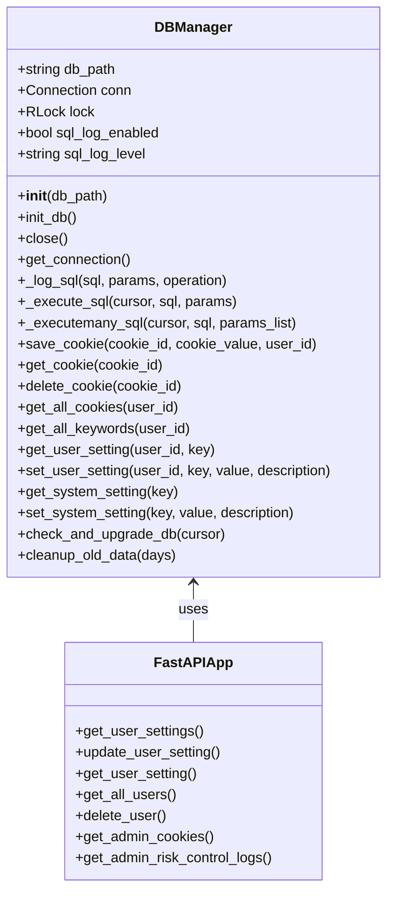

**图表来源**
- [db_manager.py](file://db_manager.py#L16-L1102)
- [reply_server.py](file://reply_server.py#L1-L50)

### 线程安全机制

系统采用可重入锁(RLock)确保数据库操作的线程安全：

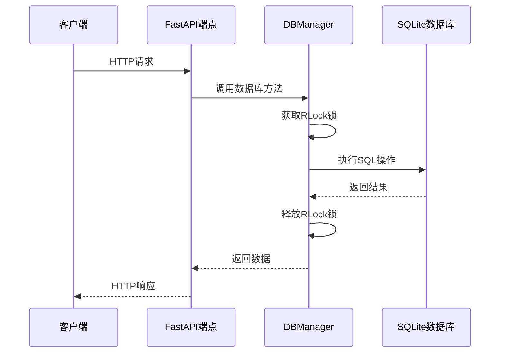

**图表来源**
- [db_manager.py](file://db_manager.py#L51)
- [db_manager.py](file://db_manager.py#L1156-L1194)

**章节来源**
- [db_manager.py](file://db_manager.py#L16-L1102)

## CRUD操作模式

### GET操作模式

GET操作主要用于查询数据，支持多种查询场景和用户隔离。

#### get_cookie()方法 - 通过ID查询账号信息

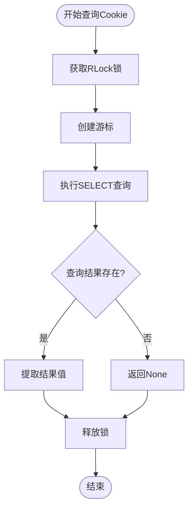

**图表来源**
- [db_manager.py](file://db_manager.py#L1212-L1222)

#### get_all_keywords()方法 - 获取所有关键词规则

该方法支持用户隔离查询，返回按Cookie ID分组的关键词列表。

**章节来源**
- [db_manager.py](file://db_manager.py#L1212-L1222)
- [db_manager.py](file://db_manager.py#L1694-L1719)

### CREATE操作模式

CREATE操作通过save_cookie()方法实现，支持插入或替换现有记录。

### UPDATE操作模式

UPDATE操作通过各种设置方法实现，如set_user_setting()和set_system_setting()。

### DELETE操作模式

DELETE操作通过delete_cookie()和delete_user_and_data()等方法实现，支持级联删除和数据清理。

**章节来源**
- [db_manager.py](file://db_manager.py#L1156-L1194)
- [db_manager.py](file://db_manager.py#L4223-L4245)

## 数据库连接管理

### 连接池与生命周期管理

系统采用单例模式管理数据库连接，确保资源的有效利用和生命周期控制。

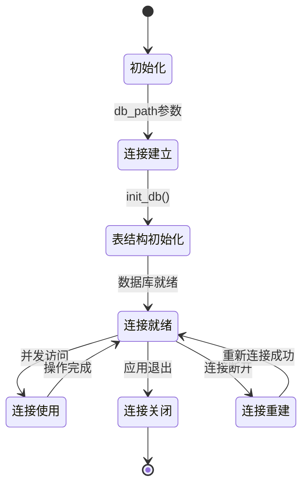

**图表来源**
- [db_manager.py](file://db_manager.py#L19-L1106)

### 目录权限管理

系统具备完善的目录权限检查和错误处理机制：

| 检查项目 | 处理策略 | 备用方案 |
|---------|---------|---------|
| 数据目录存在性 | 自动创建目录 | 使用当前目录 |
| 写入权限检查 | 权限警告 | 使用当前目录 |
| 权限不足处理 | 自动降级 | 记录错误日志 |

**章节来源**
- [db_manager.py](file://db_manager.py#L25-L47)
- [db_manager.py](file://db_manager.py#L1096-L1106)

## 事务处理机制

### COMMIT与ROLLBACK模式

系统在所有修改操作中都实现了完整的事务处理机制，确保数据一致性。

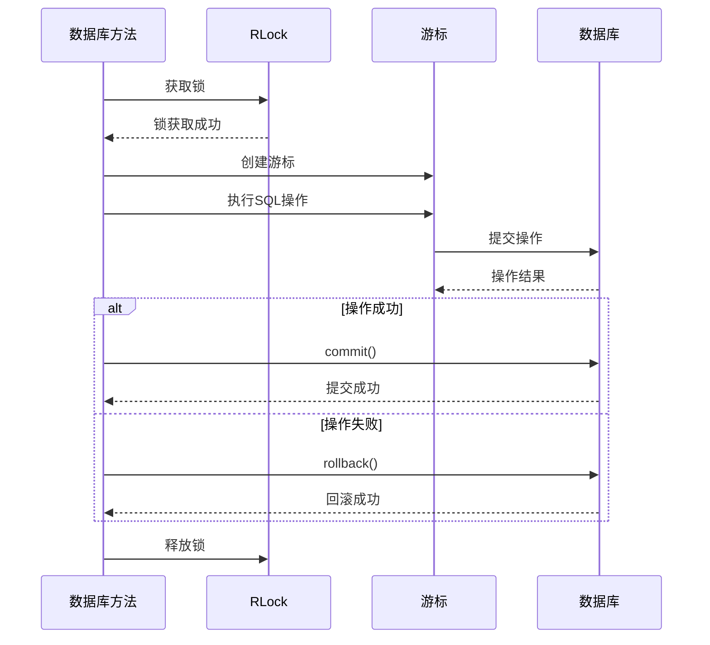

**图表来源**
- [db_manager.py](file://db_manager.py#L4025-L4032)
- [db_manager.py](file://db_manager.py#L4143-L4146)

### 批量操作事务处理

对于批量操作，系统采用显式事务管理：

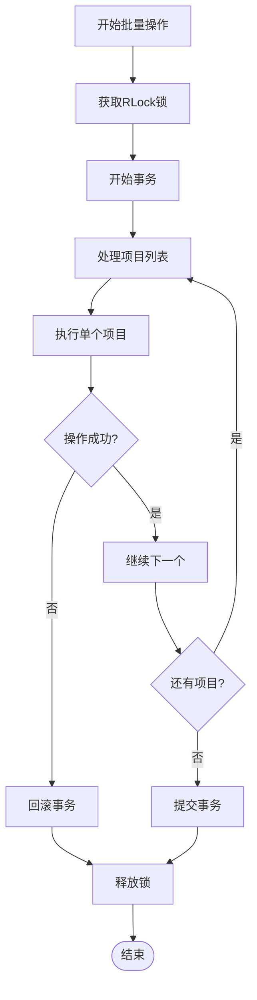

**图表来源**
- [db_manager.py](file://db_manager.py#L4043-L4067)

**章节来源**
- [db_manager.py](file://db_manager.py#L4025-L4032)
- [db_manager.py](file://db_manager.py#L4043-L4067)

## 查询优化策略

### 索引设计原则

系统在关键查询字段上建立了适当的索引：

| 表名 | 索引字段 | 索引类型 | 用途 |
|------|---------|---------|------|
| cookies | user_id | 普通索引 | 用户隔离查询 |
| keywords | cookie_id | 外键索引 | 关联查询优化 |
| keywords | (cookie_id, keyword) | 唯一索引 | 关键词去重 |
| keywords | (cookie_id, keyword, item_id) | 唯一索引 | 商品级关键词去重 |
| user_settings | (user_id, key) | 唯一索引 | 用户设置去重 |
| ai_conversations | cookie_id | 外键索引 | AI对话查询 |

### 查询性能优化

系统采用多种查询优化策略：

1. **用户隔离查询**：通过user_id字段实现多租户隔离
2. **复合索引使用**：针对复杂查询条件建立复合索引
3. **查询结果缓存**：对频繁查询的数据进行内存缓存
4. **批量查询优化**：使用IN子句减少查询次数

**章节来源**
- [db_manager.py](file://db_manager.py#L1071-L1083)

## API端点与数据库交互

### HTTP请求到数据库操作的映射

系统通过FastAPI框架将HTTP请求映射到相应的数据库操作：

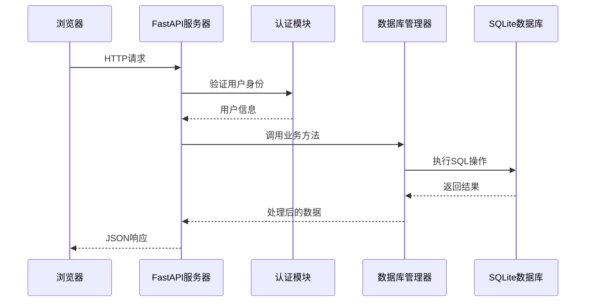

**图表来源**
- [reply_server.py](file://reply_server.py#L4622-L4666)

### 关键API端点示例

#### 获取用户设置的API

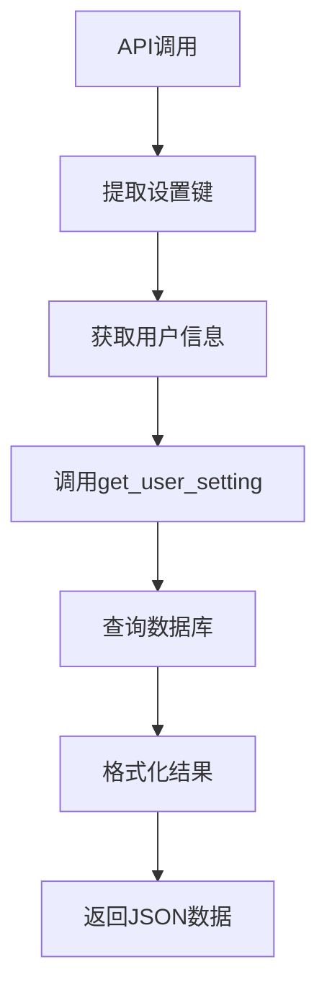

**图表来源**
- [reply_server.py](file://reply_server.py#L4655-L4666)

**章节来源**
- [reply_server.py](file://reply_server.py#L4622-L4666)

## 数据库迁移机制

### 版本检查与升级流程

系统实现了完整的数据库版本管理和自动升级机制：

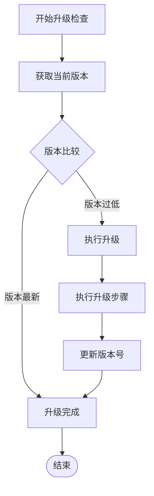

**图表来源**
- [db_manager.py](file://db_manager.py#L558-L611)

### 迁移策略

系统采用渐进式升级策略，支持向后兼容：

| 升级阶段 | 功能特性 | 实现方式 |
|---------|---------|---------|
| v1.0 | 基础表结构 | 创建核心业务表 |
| v1.1 | 通知渠道扩展 | 扩展notification_channels表 |
| v1.2 | 支持更多渠道 | 更新CHECK约束 |
| v1.3 | 图片支持 | 添加image_url字段 |
| v1.4 | 账号登录 | 添加用户名密码字段 |
| v1.5 | 多规格支持 | 添加多规格字段 |

**章节来源**
- [db_manager.py](file://db_manager.py#L558-L611)
- [db_manager.py](file://db_manager.py#L819-L917)

## 错误处理策略

### 分层错误处理

系统实现了多层次的错误处理机制：

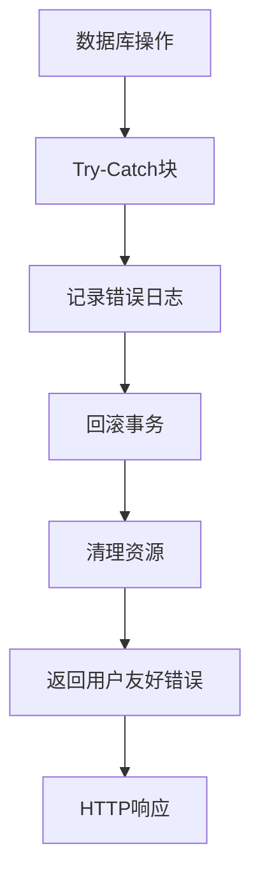

**图表来源**
- [db_manager.py](file://db_manager.py#L4029-L4032)

### 错误分类与处理

| 错误类型 | 处理策略 | 用户反馈 |
|---------|---------|---------|
| 连接错误 | 重试机制 | 服务暂时不可用 |
| SQL语法错误 | 参数验证 | 请求格式错误 |
| 约束违反 | 数据验证 | 重复记录错误 |
| 权限错误 | 认证检查 | 未授权访问 |
| 系统错误 | 详细日志 | 内部服务器错误 |

**章节来源**
- [db_manager.py](file://db_manager.py#L4029-L4032)
- [db_manager.py](file://db_manager.py#L4843-L4858)

## 性能监控与优化

### SQL日志监控

系统提供了完整的SQL执行日志记录功能：

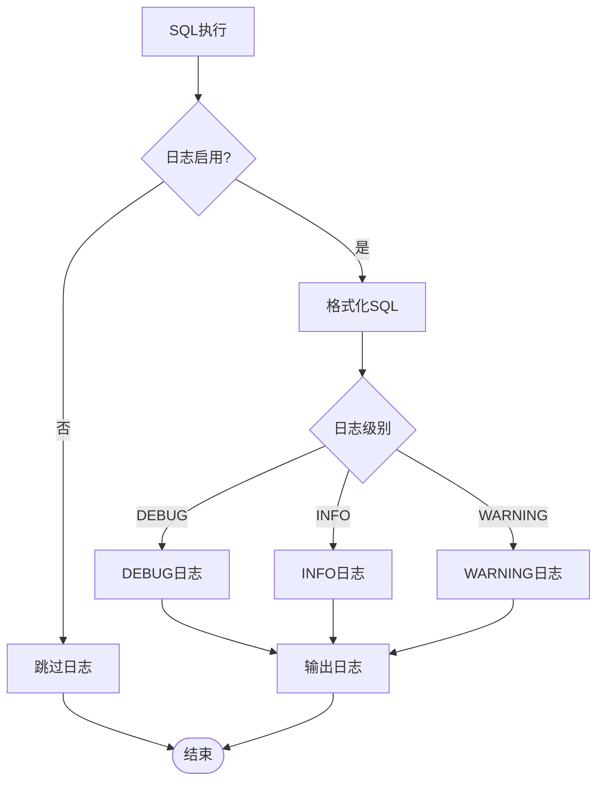

**图表来源**
- [db_manager.py](file://db_manager.py#L1108-L1141)

### 性能监控指标

系统监控以下关键性能指标：

| 监控指标 | 监控方法 | 告警阈值 |
|---------|---------|---------|
| SQL执行时间 | 日志分析 | >100ms |
| 连接池使用率 | 连接统计 | >80% |
| 数据库大小 | 文件监控 | >1GB |
| 错误率 | 异常统计 | >5% |
| 查询频率 | 访问日志 | 异常峰值 |

### 慢查询识别

系统通过SQL日志功能识别和分析慢查询：

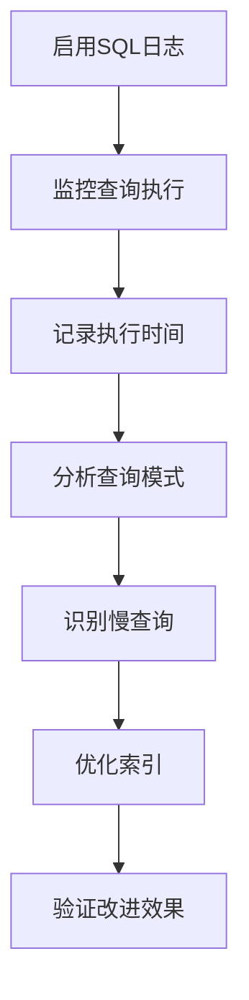

**图表来源**
- [db_manager.py](file://db_manager.py#L54-L62)

**章节来源**
- [db_manager.py](file://db_manager.py#L1108-L1141)
- [db_manager.py](file://db_manager.py#L54-L62)

## 最佳实践建议

### 数据库设计最佳实践

1. **规范化设计**：采用第三范式设计表结构，减少数据冗余
2. **外键约束**：合理使用外键保证数据完整性
3. **索引策略**：在查询频繁的字段上建立适当索引
4. **数据类型选择**：选择合适的数据类型优化存储

### 性能优化建议

1. **连接管理**：使用连接池减少连接开销
2. **批量操作**：对大量数据操作使用批量处理
3. **查询优化**：避免SELECT *，只查询需要的字段
4. **定期维护**：定期执行VACUUM清理碎片

### 安全性考虑

1. **输入验证**：对所有用户输入进行严格验证
2. **权限控制**：实现细粒度的用户权限管理
3. **数据加密**：敏感数据采用加密存储
4. **审计日志**：记录所有重要操作的审计信息

### 可维护性建议

1. **文档化**：保持数据库结构和API文档的同步
2. **版本控制**：使用迁移脚本管理数据库变更
3. **测试覆盖**：建立完整的单元测试和集成测试
4. **监控告警**：建立完善的监控和告警机制

通过遵循这些最佳实践，可以确保系统的稳定性、性能和可维护性，为用户提供可靠的数据服务。