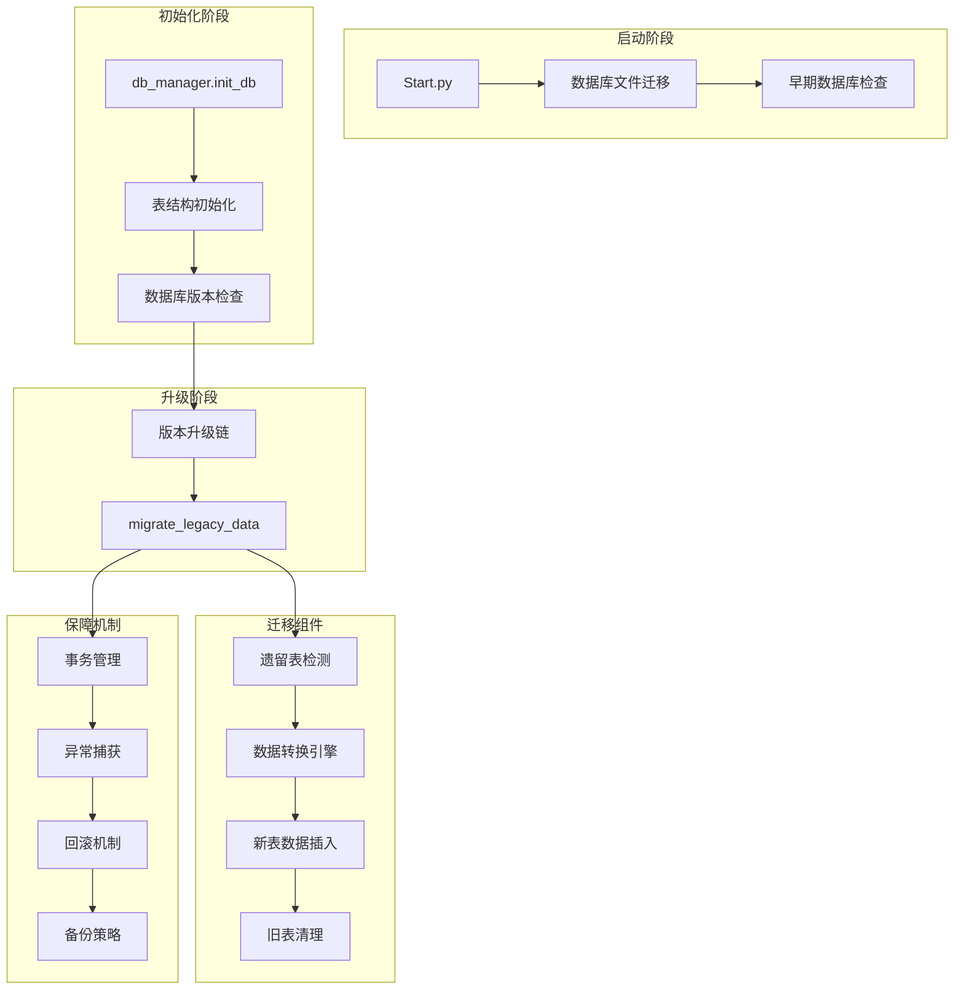
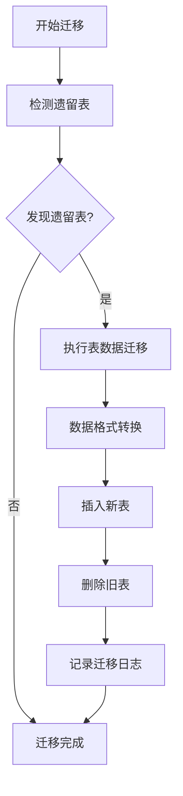
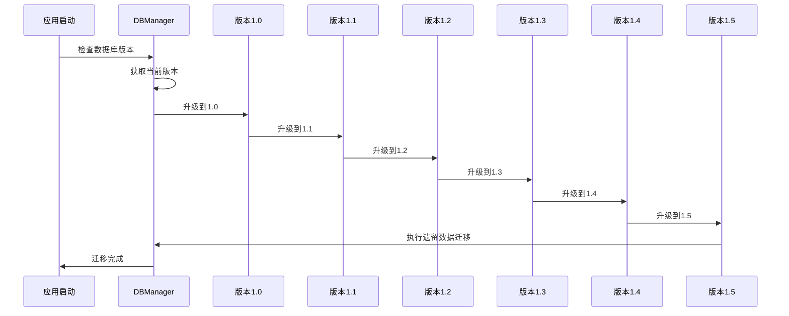
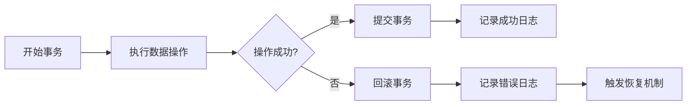
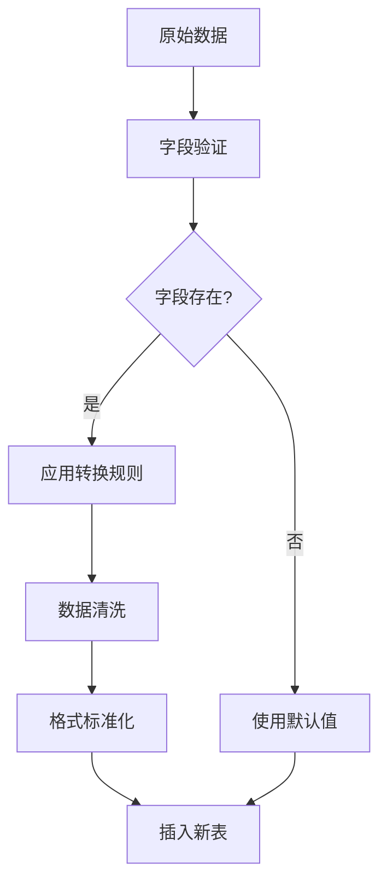
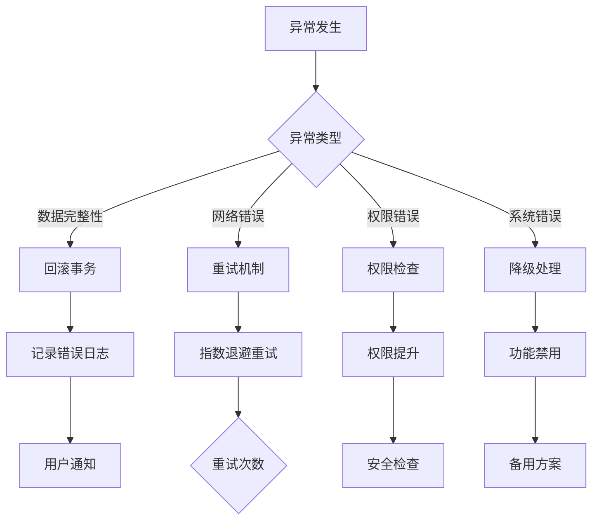
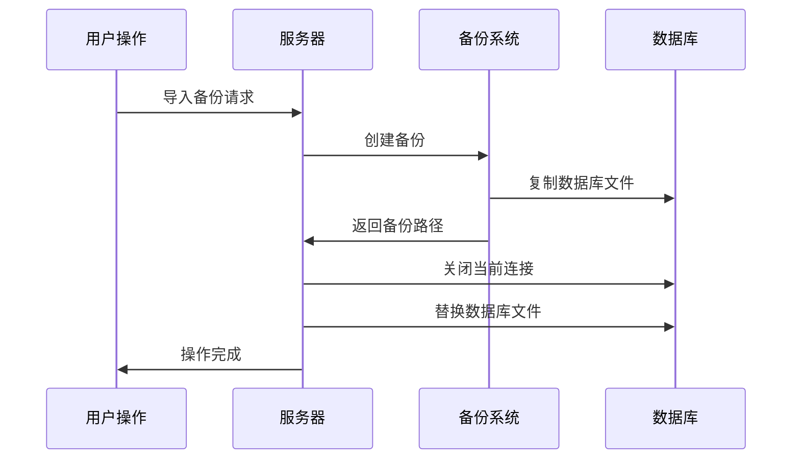
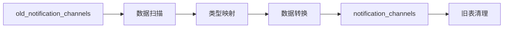

# 数据迁移过程文档

<cite>
**本文档引用的文件**
- [db_manager.py](file://db_manager.py)
- [Start.py](file://Start.py)
- [config.py](file://config.py)
- [reply_server.py](file://reply_server.py)
- [order_status_handler.py](file://order_status_handler.py)
</cite>

## 目录
1. [概述](#概述)
2. [迁移架构设计](#迁移架构设计)
3. [migrate_legacy_data()方法详解](#migratelagacydata方法详解)
4. [版本升级流程](#版本升级流程)
5. [事务管理策略](#事务管理策略)
6. [数据转换机制](#数据转换机制)
7. [异常处理与恢复](#异常处理与恢复)
8. [备份与恢复机制](#备份与恢复机制)
9. [实际迁移案例](#实际迁移案例)
10. [最佳实践指南](#最佳实践指南)

## 概述

本系统采用渐进式数据迁移策略，在版本升级过程中确保数据的完整性和一致性。核心迁移机制围绕`migrate_legacy_data()`方法展开，该方法负责识别和转换遗留数据结构，将其适配到新的数据库模式中。

### 核心特性

- **非破坏性迁移**：迁移过程不会丢失现有数据
- **版本化升级**：支持多版本链式升级
- **事务安全保障**：关键操作采用事务管理
- **智能数据转换**：自动识别和转换数据格式
- **完善的异常处理**：提供多层次的错误恢复机制

## 迁移架构设计

**图表来源**
- [Start.py](file://Start.py#L120-L144)
- [db_manager.py](file://db_manager.py#L440-L608)

## migrate_legacy_data()方法详解

### 方法签名与职责

`migrate_legacy_data()`方法是数据迁移的核心入口，负责扫描和处理所有遗留数据结构。

**图表来源**
- [db_manager.py](file://db_manager.py#L958-L981)

### 遗留表识别机制

系统维护了一个遗留表清单，用于识别需要迁移的数据结构：

| 遗留表名称 | 用途 | 迁移目标 |
|------------|------|----------|
| `old_notification_channels` | 旧的通知渠道配置 | `notification_channels` |
| `legacy_delivery_rules` | 旧的自动发货规则 | `delivery_rules` |
| `old_keywords` | 旧的关键字配置 | `keywords` |
| `backup_cookies` | 备份的Cookie数据 | `cookies` |

### 数据迁移流程

迁移过程遵循严格的步骤序列，确保数据完整性：

1. **表存在性检查**：验证遗留表是否存在
2. **数据备份**：在迁移前备份原始数据
3. **格式转换**：应用字段映射和数据清洗
4. **新表插入**：将转换后的数据插入新表
5. **依赖关系处理**：更新相关联的数据引用
6. **旧表清理**：删除已迁移的遗留表

**章节来源**
- [db_manager.py](file://db_manager.py#L958-L981)
- [db_manager.py](file://db_manager.py#L984-L1017)

## 版本升级流程

### 版本链式升级机制

系统采用版本化的升级策略，每个版本都定义了特定的升级路径：

**图表来源**
- [db_manager.py](file://db_manager.py#L558-L608)

### 版本升级步骤详解

每个版本升级都包含特定的数据库结构调整：

#### 版本1.0 - 基础用户系统
- 创建用户表结构
- 初始化管理员账户
- 设置基础系统配置

#### 版本1.1 - 通知系统增强
- 扩展通知渠道表结构
- 支持更多通知类型
- 更新约束条件

#### 版本1.2 - 多渠道支持
- 增加飞书、Bark等通知渠道
- 优化类型映射机制
- 改进数据验证规则

#### 版本1.3 - 图片支持扩展
- 为关键词表添加图片URL字段
- 支持图片类型的卡片
- 优化媒体内容处理

#### 版本1.4 - 通知系统完善
- 统一钉钉通知类型
- 增强Webhook支持
- 改进配置兼容性

#### 版本1.5 - 账号登录功能
- 为Cookie表添加账号字段
- 支持用户名密码登录
- 增强认证安全性

**章节来源**
- [db_manager.py](file://db_manager.py#L564-L604)

## 事务管理策略

### 事务边界定义

系统在关键数据操作中采用严格的事务管理，确保数据一致性：

**图表来源**
- [db_manager.py](file://db_manager.py#L2295-L2374)

### 事务应用场景

#### 备份导入事务
在导入系统备份时，整个过程被包裹在一个事务中：

- **开始事务**：标记备份导入开始
- **数据清理**：清空目标表数据
- **数据插入**：批量插入备份数据
- **提交/回滚**：根据操作结果决定最终状态

#### 系统设置事务
系统设置的修改采用原子性操作：

- **检查现有值**：验证当前设置状态
- **更新操作**：执行设置修改
- **验证结果**：确认更新成功
- **异常处理**：回滚到初始状态

### 锁机制与并发控制

系统使用可重入锁（`threading.RLock`）来保护数据库操作：

- **全局锁**：防止并发访问冲突
- **细粒度控制**：仅在必要时锁定
- **死锁预防**：避免嵌套锁操作

**章节来源**
- [db_manager.py](file://db_manager.py#L2286-L2374)
- [db_manager.py](file://db_manager.py#L50-L51)

## 数据转换机制

### 字段映射策略

数据转换过程涉及复杂的字段映射和格式转换：

**图表来源**
- [db_manager.py](file://db_manager.py#L996-L1008)

### 通知渠道类型转换

通知渠道类型的转换是最复杂的转换场景之一：

| 旧类型 | 新类型 | 转换规则 |
|--------|--------|----------|
| `dingtalk` | `dingtalk` | 直接映射 |
| `ding_talk` | `dingtalk` | 统一格式 |
| `email` | `qq` | 临时映射 |
| `webhook` | `qq` | 临时映射 |
| `wechat` | `wechat` | 直接映射 |
| `telegram` | `telegram` | 直接映射 |

### 数据清洗规则

系统实现了多层次的数据清洗机制：

#### 空值处理
- **字符串字段**：使用空字符串替代NULL
- **数值字段**：使用默认值替代NULL
- **布尔字段**：使用FALSE替代NULL

#### 格式标准化
- **日期时间**：统一ISO格式
- **JSON数据**：验证并格式化
- **枚举值**：映射到有效选项

#### 数据验证
- **长度限制**：截断过长文本
- **类型检查**：强制类型转换
- **约束验证**：确保符合新约束

**章节来源**
- [db_manager.py](file://db_manager.py#L1019-L1034)
- [db_manager.py](file://db_manager.py#L776-L805)

## 异常处理与恢复

### 异常分类与处理策略

系统对不同类型的异常采用差异化的处理策略：

**图表来源**
- [order_status_handler.py](file://order_status_handler.py#L272-L290)

### 错误恢复机制

#### 自动恢复策略
- **事务回滚**：自动回滚失败的操作
- **状态重置**：恢复到一致的状态
- **资源清理**：释放占用的系统资源

#### 手动干预机制
- **错误报告**：详细的错误信息
- **恢复指导**：提供恢复步骤
- **数据验证**：检查数据完整性

### 日志记录与监控

系统提供了完整的日志记录机制：

- **操作日志**：记录所有数据变更
- **错误日志**：详细记录异常信息
- **性能日志**：监控迁移性能指标
- **审计日志**：跟踪重要操作

**章节来源**
- [order_status_handler.py](file://order_status_handler.py#L259-L306)
- [db_manager.py](file://db_manager.py#L483-L486)

## 备份与恢复机制

### 自动备份策略

系统在关键操作前自动创建数据库备份：

**图表来源**
- [reply_server.py](file://reply_server.py#L5261-L5281)

### 备份文件管理

#### 备份文件命名规范
- 格式：`xianyu_data_backup_YYYYMMDD_HHMMSS.db`
- 时间戳精确到秒
- 包含完整的日期信息

#### 备份文件验证
- **文件完整性**：检查SQLite文件格式
- **表结构验证**：确认必需表存在
- **数据量检查**：验证备份数据量

### 恢复操作流程

#### 系统级恢复
1. **停止服务**：确保数据库无活动连接
2. **备份当前数据**：创建恢复前备份
3. **替换数据库文件**：使用备份文件
4. **重启服务**：恢复正常运行

#### 用户级恢复
- **选择性恢复**：仅恢复指定用户数据
- **数据隔离**：避免影响其他用户
- **权限保持**：维持原有用户权限

**章节来源**
- [reply_server.py](file://reply_server.py#L5223-L5281)
- [db_manager.py](file://db_manager.py#L2274-L2305)

## 实际迁移案例

### 案例1：通知渠道迁移

#### 背景
旧版本使用简化的通知渠道结构，新版本需要支持更多渠道类型。

#### 迁移过程

#### 关键转换规则
- `dingtalk` → `dingtalk`
- `email` → `qq`（临时映射）
- 缺失字段使用默认值

### 案例2：Cookie表升级

#### 背景
从单一Cookie字段扩展到支持用户名密码登录。

#### 迁移步骤
1. **字段添加**：添加username、password字段
2. **数据迁移**：从旧格式提取用户名
3. **安全处理**：加密敏感信息
4. **兼容性保证**：保持向后兼容

### 案例3：关键词表重构

#### 背景
支持图片类型关键词和商品ID关联。

#### 迁移策略
- **字段扩展**：添加image_url、item_id字段
- **约束调整**：更新唯一性约束
- **数据验证**：确保数据完整性

**章节来源**
- [db_manager.py](file://db_manager.py#L984-L1017)
- [db_manager.py](file://db_manager.py#L727-L916)

## 最佳实践指南

### 迁移前准备

#### 环境检查
- **数据库版本**：确认当前版本号
- **磁盘空间**：确保有足够的存储空间
- **权限验证**：检查数据库写入权限
- **备份验证**：确认备份功能正常

#### 数据预处理
- **数据清理**：移除明显无效数据
- **格式标准化**：统一数据格式
- **依赖检查**：验证数据完整性

### 迁移执行策略

#### 分批处理
- **小批量操作**：避免长时间锁定
- **进度监控**：实时跟踪迁移进度
- **资源控制**：限制内存和CPU使用

#### 性能优化
- **索引管理**：合理使用数据库索引
- **批量操作**：使用批量插入提高效率
- **连接池**：复用数据库连接

### 迁移后验证

#### 数据完整性检查
- **记录数量对比**：验证迁移前后记录数
- **字段值验证**：检查关键字段值
- **关联关系检查**：验证外键关系

#### 功能测试
- **核心功能**：验证主要业务功能
- **边界条件**：测试极端情况
- **性能回归**：检查性能指标

### 故障排除指南

#### 常见问题及解决方案

| 问题类型 | 症状 | 解决方案 |
|----------|------|----------|
| 迁移失败 | 数据库锁定 | 检查并发连接，重启服务 |
| 数据丢失 | 记录数量减少 | 检查备份文件，恢复数据 |
| 性能下降 | 查询响应慢 | 重建索引，优化查询 |
| 格式错误 | 数据验证失败 | 检查转换规则，修正数据 |

#### 监控指标
- **迁移进度**：已完成百分比
- **错误率**：失败操作比例
- **性能指标**：平均处理时间
- **资源使用**：CPU、内存、磁盘使用率

### 文档与培训

#### 操作手册
- **详细步骤**：完整的迁移操作指南
- **故障排除**：常见问题解决方案
- **最佳实践**：经验总结和建议

#### 团队培训
- **技术培训**：迁移工具使用
- **应急演练**：故障处理流程
- **知识分享**：经验交流平台

通过遵循这些最佳实践，可以确保数据迁移过程的安全、可靠和高效，最大程度地降低业务中断风险。