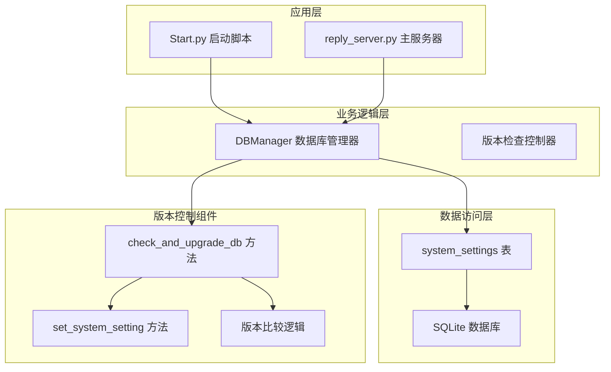
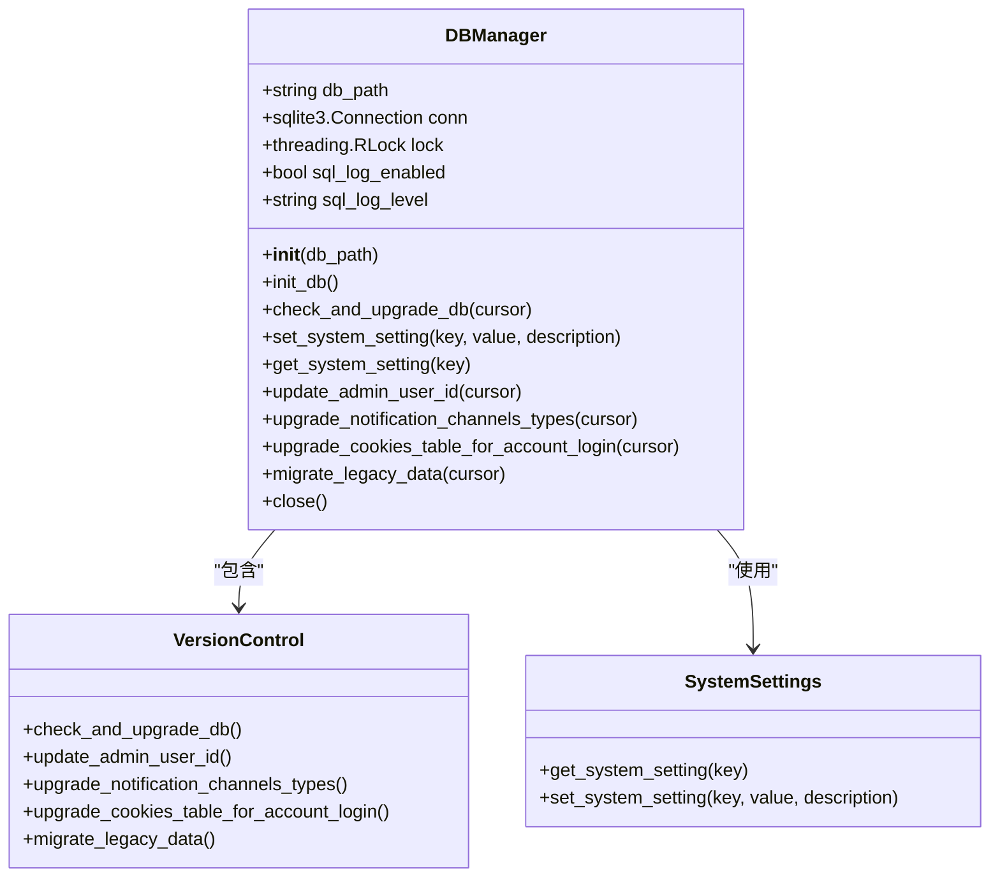
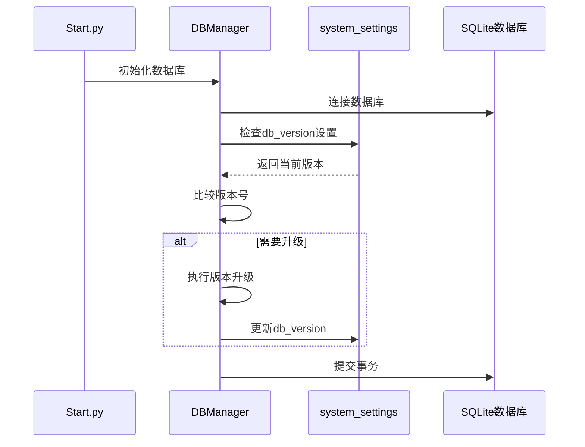
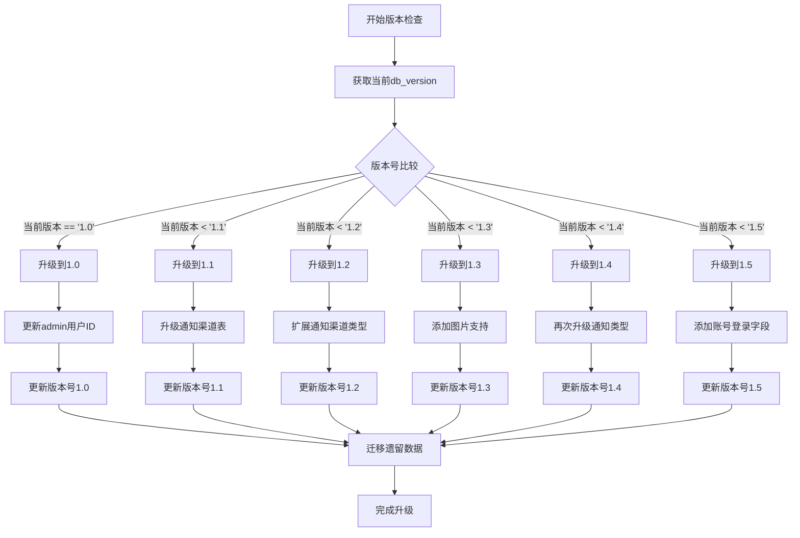
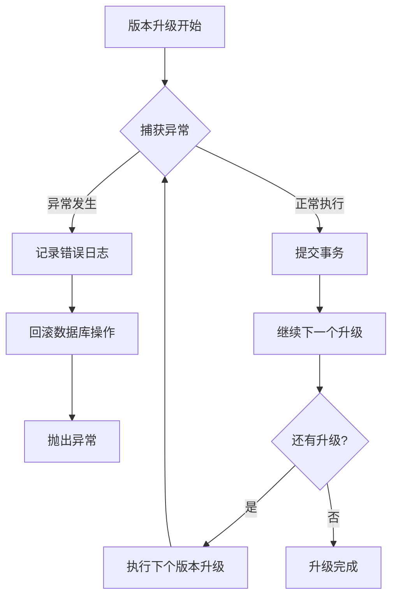
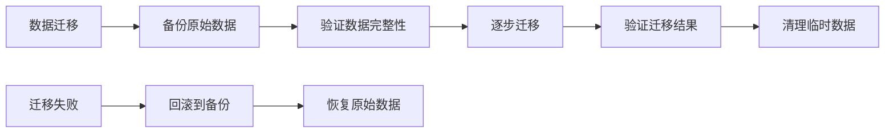

# 数据库版本控制

<cite>
**本文档引用的文件**
- [db_manager.py](file://db_manager.py)
- [Start.py](file://Start.py)
- [reply_server.py](file://reply_server.py)
- [XianyuAutoAsync.py](file://XianyuAutoAsync.py)
</cite>

## 目录
1. [简介](#简介)
2. [系统架构概述](#系统架构概述)
3. [核心组件分析](#核心组件分析)
4. [版本控制机制](#版本控制机制)
5. [版本升级流程](#版本升级流程)
6. [错误处理与恢复](#错误处理与恢复)
7. [版本回滚指导](#版本回滚指导)
8. [最佳实践建议](#最佳实践建议)
9. [故障排除指南](#故障排除指南)
10. [总结](#总结)

## 简介

本系统采用基于 `system_settings` 表的 `db_version` 字段实现数据库版本控制机制，确保应用程序在不同版本间平滑升级。该机制通过语义化版本命名规则（如1.0、1.1等）跟踪数据库结构变更，并在系统启动时自动执行必要的升级操作。

## 系统架构概述

系统采用分层架构设计，核心版本控制功能集中在数据库管理层：



**图表来源**
- [db_manager.py](file://db_manager.py#L16-L50)
- [Start.py](file://Start.py#L139-L144)

## 核心组件分析

### DBManager 类

DBManager 是系统的核心数据库管理类，负责维护整个数据库连接和版本控制功能：



**图表来源**
- [db_manager.py](file://db_manager.py#L16-L50)
- [db_manager.py](file://db_manager.py#L557-L608)

### system_settings 表结构

系统设置表是版本控制的核心存储机制：

| 字段名 | 数据类型 | 约束 | 描述 |
|--------|----------|------|------|
| key | TEXT | PRIMARY KEY | 设置键名，如 "db_version" |
| value | TEXT | NOT NULL | 设置值，如 "1.5" |
| description | TEXT | - | 设置描述信息 |
| updated_at | TIMESTAMP | DEFAULT CURRENT_TIMESTAMP | 更新时间戳 |

**节来源**
- [db_manager.py](file://db_manager.py#L369-L376)

## 版本控制机制

### 版本号语义化命名规则

系统采用语义化版本命名规则，版本号格式为 `主版本号.次版本号`：

- **1.0**: 基础功能版本，包含核心数据库结构
- **1.1**: 添加通知渠道表升级功能
- **1.2**: 支持更多通知渠道类型
- **1.3**: 添加关键词类型和图片URL字段
- **1.4**: 再次升级通知渠道类型支持
- **1.5**: 为cookies表添加账号登录字段

### 版本检查执行时机

版本检查在以下场景自动触发：

1. **数据库初始化时**: 在 `init_db()` 方法中调用 `check_and_upgrade_db()`
2. **应用启动时**: 通过 `Start.py` 脚本确保数据库迁移优先执行
3. **系统设置更新时**: 通过 `set_system_setting()` 方法更新版本号



**图表来源**
- [db_manager.py](file://db_manager.py#L440-L447)
- [Start.py](file://Start.py#L139-L144)

**节来源**
- [db_manager.py](file://db_manager.py#L440-L447)
- [db_manager.py](file://db_manager.py#L557-L608)

## 版本升级流程

### check_and_upgrade_db() 方法详解

该方法是版本控制的核心，负责检查当前版本并执行必要的升级：



**图表来源**
- [db_manager.py](file://db_manager.py#L557-L608)

### 版本升级方法列表

| 版本号 | 升级方法 | 功能描述 |
|--------|----------|----------|
| 1.0 | update_admin_user_id() | 创建默认admin用户，绑定历史数据 |
| 1.1 | upgrade_notification_channels_table() | 升级通知渠道表结构 |
| 1.2 | upgrade_notification_channels_types() | 支持更多通知渠道类型 |
| 1.3 | upgrade_keywords_table_for_image_support() | 添加关键词图片支持 |
| 1.4 | upgrade_notification_channels_types() | 再次扩展通知渠道类型 |
| 1.5 | upgrade_cookies_table_for_account_login() | 添加账号登录功能 |

**节来源**
- [db_manager.py](file://db_manager.py#L557-L608)
- [db_manager.py](file://db_manager.py#L818-L957)

## 错误处理与恢复

### 异常处理策略

系统采用多层次的异常处理机制：



**图表来源**
- [db_manager.py](file://db_manager.py#L609-L611)

### 错误恢复机制

1. **自动回滚**: 发生异常时自动回滚数据库操作
2. **日志记录**: 详细记录错误信息便于诊断
3. **优雅降级**: 迁移失败不影响系统启动

**节来源**
- [db_manager.py](file://db_manager.py#L448-L451)
- [db_manager.py](file://db_manager.py#L609-L611)

## 版本回滚指导

### 回滚原则

数据库版本升级具有不可逆性，一旦升级完成，无法直接回滚到之前的版本。这是由以下因素决定的：

1. **数据结构变更**: 升级过程中可能添加新字段、修改约束等
2. **数据迁移**: 历史数据可能被转换或重新组织
3. **依赖关系**: 新版本功能可能依赖于升级后的数据结构

### 回滚注意事项

#### 预防措施
- **定期备份**: 在升级前创建数据库备份
- **测试环境验证**: 在测试环境中先行验证升级
- **监控升级过程**: 密切关注升级日志

#### 应急处理
如果升级出现问题：
1. **停止服务**: 立即停止应用程序
2. **恢复备份**: 从最近的数据库备份恢复
3. **分析原因**: 查看升级日志确定问题原因
4. **重新规划**: 根据问题重新制定升级计划

### 数据迁移安全

系统提供了多种数据迁移安全机制：



**图表来源**
- [db_manager.py](file://db_manager.py#L958-L1017)

**节来源**
- [db_manager.py](file://db_manager.py#L958-L1017)

## 最佳实践建议

### 版本升级最佳实践

1. **渐进式升级**: 按版本顺序逐步升级，避免跳跃式升级
2. **充分测试**: 在生产环境升级前进行充分测试
3. **监控告警**: 设置升级监控和告警机制
4. **文档记录**: 详细记录每次升级的操作步骤和结果

### 开发阶段建议

1. **版本规划**: 在开发新功能时明确对应的版本号
2. **向后兼容**: 确保新版本能够兼容旧版本的数据
3. **自动化测试**: 编写版本升级的自动化测试用例

### 生产环境部署

1. **蓝绿部署**: 使用蓝绿部署策略降低升级风险
2. **灰度发布**: 分批次进行版本升级
3. **快速回滚**: 准备快速回滚方案

## 故障排除指南

### 常见问题及解决方案

#### 问题1: 版本升级失败
**症状**: 应用启动时报版本升级错误
**解决步骤**:
1. 检查数据库连接权限
2. 查看详细错误日志
3. 验证数据库完整性
4. 必要时恢复数据库备份

#### 问题2: 版本号不匹配
**症状**: 系统报告版本号不一致
**解决步骤**:
1. 检查 `system_settings` 表中的 `db_version` 值
2. 验证版本升级逻辑
3. 手动设置正确的版本号

#### 问题3: 数据迁移中断
**症状**: 部分数据迁移不完整
**解决步骤**:
1. 检查迁移日志
2. 验证数据完整性
3. 手动修复损坏的数据
4. 重新执行迁移

### 调试工具

系统提供了多个调试接口帮助排查版本问题：

```python
# 获取数据库版本信息
cursor.execute("SELECT value FROM system_settings WHERE key = 'db_version'")
db_version = cursor.fetchone()[0]

# 检查表结构
cursor.execute("PRAGMA table_info(keywords)")
columns = cursor.fetchall()
```

**节来源**
- [reply_server.py](file://reply_server.py#L3580-L3600)

## 总结

本系统的数据库版本控制机制通过以下特性确保了系统的稳定性和可维护性：

1. **自动化升级**: 在系统启动时自动检查和执行版本升级
2. **语义化版本**: 使用清晰的版本命名规则便于理解和维护
3. **安全升级**: 提供多层安全保障防止数据丢失
4. **错误恢复**: 完善的异常处理和回滚机制
5. **可追溯性**: 详细的日志记录便于问题诊断

该版本控制机制为系统的持续演进提供了坚实的基础，确保了在功能迭代过程中数据的完整性和系统的稳定性。开发者应当遵循既定的最佳实践，在升级过程中保持谨慎，确保系统的可靠运行。