# 结构演变

<cite>
**本文档引用的文件**
- [db_manager.py](file://db_manager.py)
- [config.py](file://config.py)
- [Start.py](file://Start.py)
- [reply_server.py](file://reply_server.py)
- [static/js/app.js](file://static/js/app.js)
</cite>

## 目录
1. [简介](#简介)
2. [项目结构概览](#项目结构概览)
3. [核心数据库组件](#核心数据库组件)
4. [架构概览](#架构概览)
5. [详细组件分析](#详细组件分析)
6. [依赖关系分析](#依赖关系分析)
7. [性能考虑](#性能考虑)
8. [故障排除指南](#故障排除指南)
9. [结论](#结论)

## 简介

本文档深入解析了Xianyu Auto Reply系统中数据库结构的演变过程，重点关注`upgrade_notification_channels_table()`、`upgrade_keywords_table_for_image_support()`等关键升级方法的实现细节。通过分析ALTER TABLE操作、表重建策略、索引优化以及向后兼容性维护等技术要点，阐述了如何在保持数据完整性的同时实现功能扩展。

该系统采用SQLite作为底层数据库，通过精心设计的数据库迁移机制，实现了从基础功能到高级特性的平滑演进。每个结构变更都经过深思熟虑，既满足业务需求又确保系统的稳定性和可维护性。

## 项目结构概览

Xianyu Auto Reply系统采用模块化的数据库管理架构，主要包含以下核心组件：

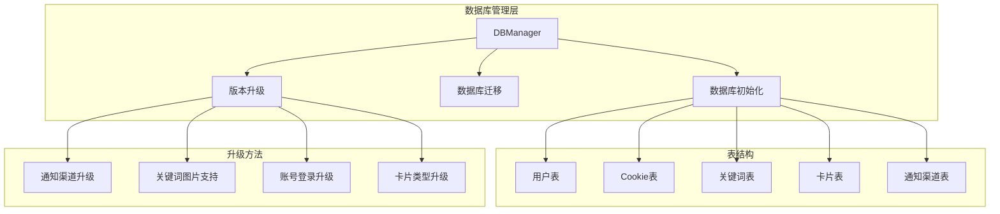

**图表来源**
- [db_manager.py](file://db_manager.py#L16-L100)

**章节来源**
- [db_manager.py](file://db_manager.py#L1-L100)

## 核心数据库组件

### DBManager类架构

DBManager类是整个数据库管理系统的核心，负责维护与SQLite数据库的所有交互。该类采用单例模式设计，确保数据库连接的一致性和安全性。

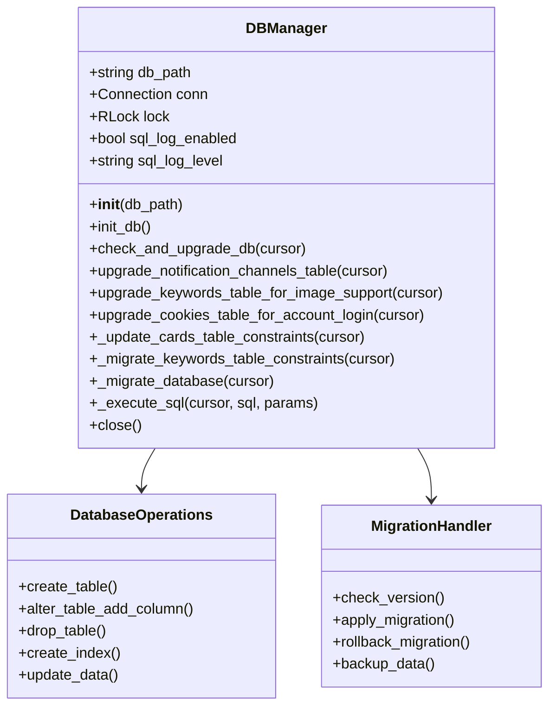

**图表来源**
- [db_manager.py](file://db_manager.py#L16-L100)

### 数据库初始化流程

系统启动时的数据库初始化遵循严格的顺序，确保所有表结构正确建立并应用必要的迁移：

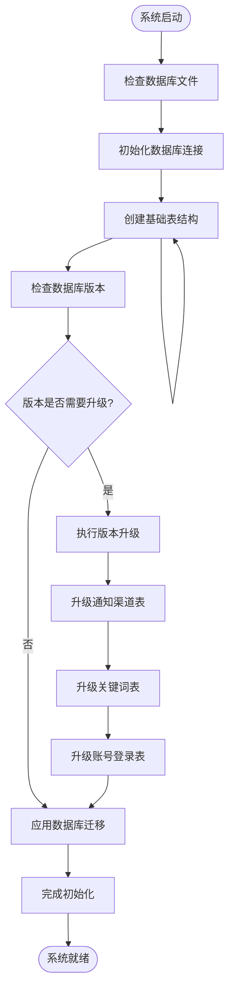

**图表来源**
- [db_manager.py](file://db_manager.py#L67-L447)

**章节来源**
- [db_manager.py](file://db_manager.py#L67-L447)

## 架构概览

### 数据库版本控制机制

系统采用基于版本号的数据库升级机制，通过`system_settings`表维护当前数据库版本信息：

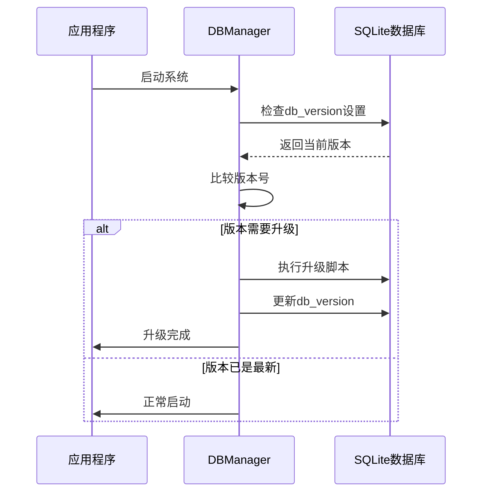

**图表来源**
- [db_manager.py](file://db_manager.py#L558-L608)

### 表结构演进策略

系统采用渐进式表结构调整策略，每次升级只涉及必要的变更，最小化对现有数据的影响：

| 升级阶段 | 功能特性 | 结构变更 | 影响范围 |
|---------|---------|---------|---------|
| 基础版本 | 核心功能 | 创建基础表结构 | 全局 |
| 版本1.0 | 用户管理 | 添加用户表、权限控制 | 用户系统 |
| 版本1.1 | 通知增强 | 扩展通知渠道类型 | 通知系统 |
| 版本1.2 | 图片支持 | 关键词表添加图片字段 | 关键词系统 |
| 版本1.3 | 账号登录 | Cookie表添加认证字段 | 登录系统 |
| 版本1.4 | 多规格支持 | 卡片表添加多规格字段 | 商品系统 |

**章节来源**
- [db_manager.py](file://db_manager.py#L558-L608)

## 详细组件分析

### upgrade_notification_channels_table() 方法详解

该方法专门处理通知渠道表的结构升级，支持从有限的通知类型扩展到完整的多渠道支持。

#### 核心实现逻辑

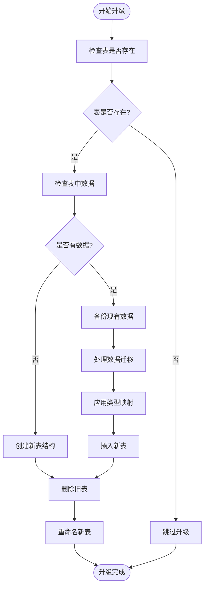

**图表来源**
- [db_manager.py](file://db_manager.py#L727-L815)

#### 类型映射策略

系统实现了智能的类型映射机制，确保现有数据在升级过程中不会丢失：

| 原始类型 | 映射目标 | 处理方式 | 影响 |
|---------|---------|---------|------|
| `dingtalk` | `dingtalk` | 直接映射 | 保持兼容 |
| `ding_talk` | `dingtalk` | 统一规范化 | 规范化处理 |
| `email` | `qq` | 临时映射 | 后续支持 |
| `webhook` | `qq` | 临时映射 | 后续支持 |
| `wechat` | `qq` | 临时映射 | 后续支持 |
| `telegram` | `qq` | 临时映射 | 后续支持 |

**章节来源**
- [db_manager.py](file://db_manager.py#L727-L815)

### upgrade_keywords_table_for_image_support() 方法详解

该方法实现了关键词表对图片支持的功能升级，通过添加新的字段来扩展原有功能。

#### 升级流程分析

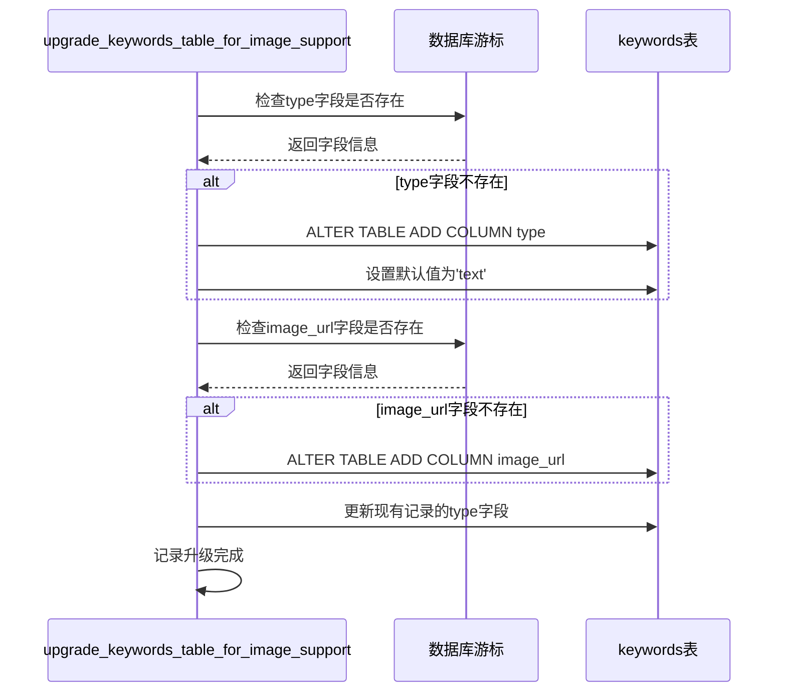

**图表来源**
- [db_manager.py](file://db_manager.py#L4609-L4634)

#### 字段添加策略

关键词表的升级采用了保守的字段添加策略，确保现有数据的完整性：

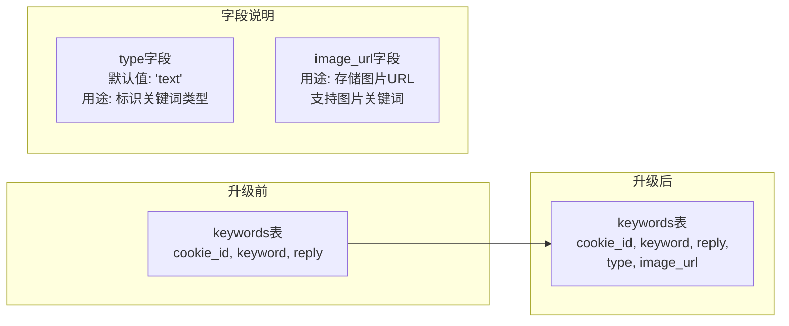

**图表来源**
- [db_manager.py](file://db_manager.py#L4609-L4634)

**章节来源**
- [db_manager.py](file://db_manager.py#L4609-L4634)

### cookies表结构演进

cookies表经历了多次重要的结构变更，反映了系统功能的逐步完善：

#### pause_duration字段添加

该字段的添加是为了支持更精细的自动化控制：

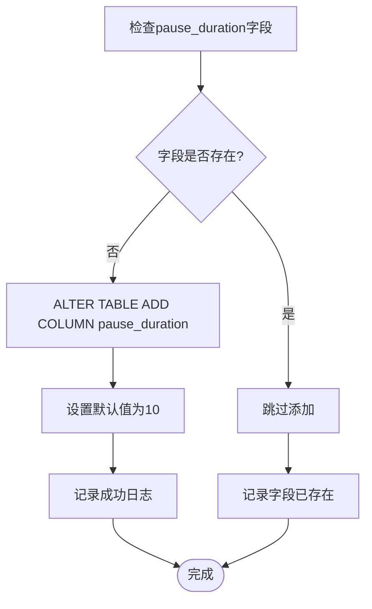

**图表来源**
- [db_manager.py](file://db_manager.py#L478-L481)

#### 账号登录功能升级

cookies表的账号登录功能升级包含了三个关键字段的添加：

| 字段名称 | 数据类型 | 默认值 | 功能描述 |
|---------|---------|--------|---------|
| `username` | TEXT | '' | 用于密码登录的用户名 |
| `password` | TEXT | '' | 用于密码登录的密码 |
| `show_browser` | INTEGER | 0 | 登录时是否显示浏览器（0=隐藏，1=显示） |

**章节来源**
- [db_manager.py](file://db_manager.py#L918-L957)

### cards表约束重建

cards表的约束重建是最复杂的结构变更之一，涉及到CHECK约束的更新以支持新的image类型：

#### 约束重建流程

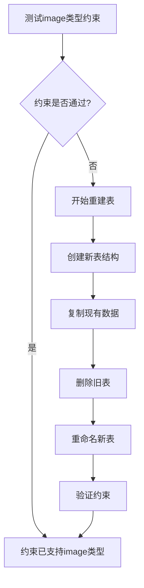

**图表来源**
- [db_manager.py](file://db_manager.py#L488-L556)

#### 表重建的安全机制

系统实现了完善的表重建安全机制，确保数据不会在重建过程中丢失：

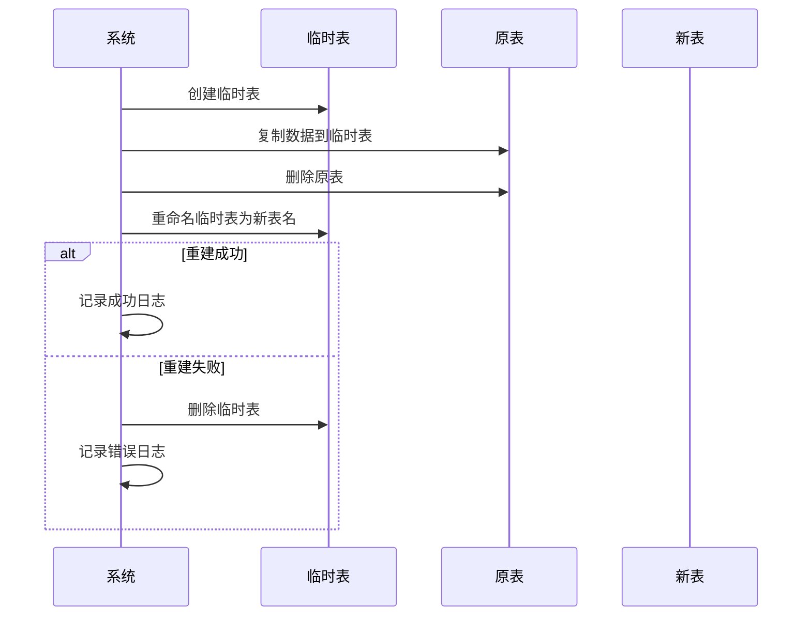

**图表来源**
- [db_manager.py](file://db_manager.py#L504-L556)

**章节来源**
- [db_manager.py](file://db_manager.py#L488-L556)

### keywords表唯一约束迁移

keywords表的唯一约束迁移是一个创新性的解决方案，解决了SQLite不支持直接修改约束的问题：

#### 复合唯一索引策略

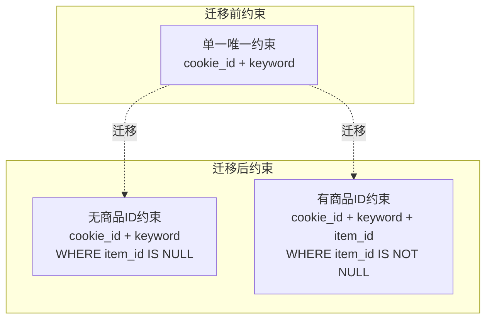

**图表来源**
- [db_manager.py](file://db_manager.py#L1036-L1086)

#### 索引创建策略

系统通过创建两个条件索引来实现复杂的唯一性约束：

| 索引名称 | 约束条件 | 适用场景 |
|---------|---------|---------|
| `idx_keywords_unique_no_item` | `WHERE item_id IS NULL OR item_id = ''` | 普通关键词 |
| `idx_keywords_unique_with_item` | `WHERE item_id IS NOT NULL AND item_id != ''` | 商品特定关键词 |

**章节来源**
- [db_manager.py](file://db_manager.py#L1036-L1086)

## 依赖关系分析

### 数据库迁移依赖图

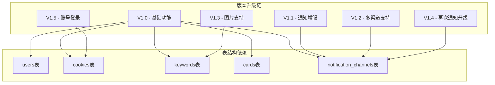

**图表来源**
- [db_manager.py](file://db_manager.py#L558-L608)

### 向后兼容性策略

系统在设计时充分考虑了向后兼容性，主要体现在以下几个方面：

1. **默认值设置**：所有新增字段都设置了合理的默认值
2. **渐进式升级**：每次升级只影响必要的部分
3. **数据保护**：升级过程中都有完整的数据备份机制
4. **版本控制**：通过版本号严格控制升级顺序

**章节来源**
- [db_manager.py](file://db_manager.py#L558-L608)

## 性能考虑

### 索引优化策略

系统在多个表上实施了索引优化策略，以提升查询性能：

| 表名 | 索引名称 | 索引字段 | 优化效果 |
|------|---------|---------|---------|
| cards | idx_cards_user_id | user_id | 加速用户相关查询 |
| keywords | idx_keywords_unique_no_item | cookie_id, keyword | 优化普通关键词查询 |
| keywords | idx_keywords_unique_with_item | cookie_id, keyword, item_id | 优化商品特定查询 |

### 查询性能监控

系统内置了SQL日志功能，支持不同级别的性能监控：

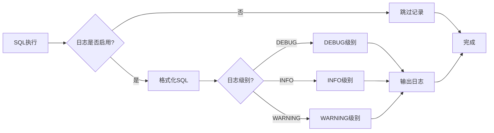

**图表来源**
- [db_manager.py](file://db_manager.py#L1108-L1141)

## 故障排除指南

### 常见升级问题

#### 表重建失败

当表重建过程中出现错误时，系统会自动回滚到原始状态：

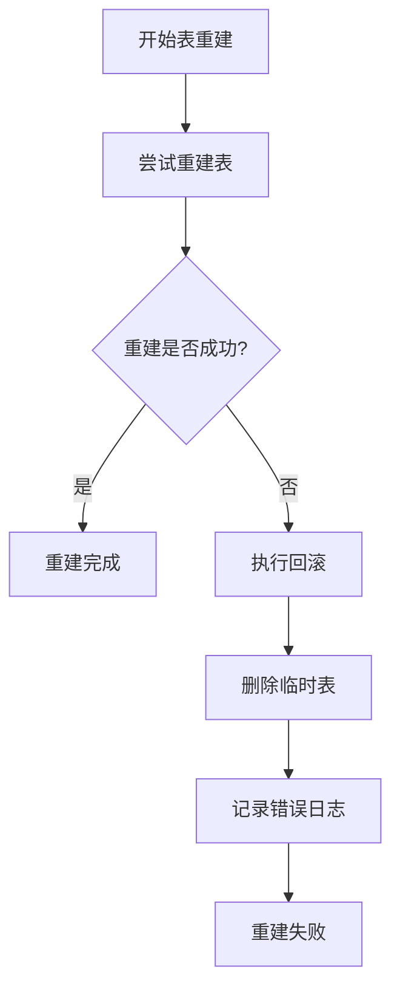

**图表来源**
- [db_manager.py](file://db_manager.py#L547-L556)

#### 数据迁移冲突

当数据迁移过程中遇到冲突时，系统采用以下策略：

1. **类型转换**：自动将不兼容的类型转换为兼容类型
2. **数据截断**：对于过长的数据自动截断
3. **默认值填充**：为缺失的字段填充默认值

**章节来源**
- [db_manager.py](file://db_manager.py#L547-L556)

### 升级最佳实践

#### 安全操作指南

1. **备份优先**：在执行任何升级前，确保已有完整的数据备份
2. **测试环境验证**：在生产环境升级前，先在测试环境中验证升级脚本
3. **分步执行**：避免一次性执行多个升级，降低风险
4. **监控日志**：密切关注升级过程中的日志输出，及时发现问题

#### 自定义结构变更指南

当需要添加自定义的数据库结构变更时，建议遵循以下模式：

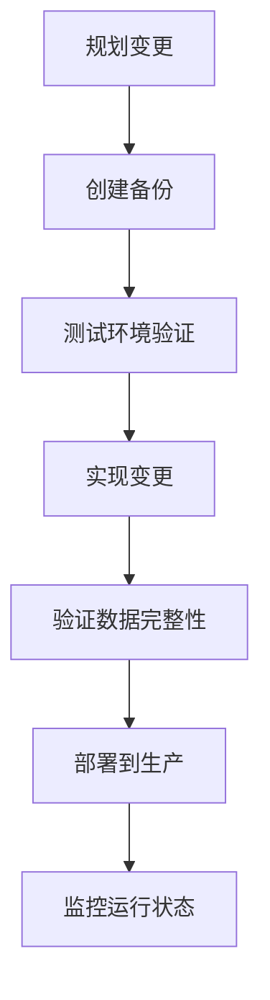

## 结论

Xianyu Auto Reply系统的数据库结构演变展现了现代软件开发中数据库迁移的最佳实践。通过精心设计的升级机制，系统实现了从基础功能到高级特性的平滑演进，同时保持了良好的向后兼容性和数据完整性。

### 关键成功因素

1. **渐进式升级**：每次升级只涉及必要的变更，最小化风险
2. **完善的备份机制**：确保在升级失败时能够快速恢复
3. **智能的数据迁移**：自动处理类型转换和数据兼容性问题
4. **严格的版本控制**：通过版本号精确控制升级顺序
5. **全面的性能监控**：内置的日志系统帮助识别和解决性能问题

### 技术创新点

- **复合唯一索引**：解决了SQLite不支持复杂约束的问题
- **智能类型映射**：自动处理不同类型间的转换
- **安全的表重建**：确保数据在结构变更过程中的安全
- **灵活的字段添加**：支持向现有表添加新字段而不影响现有数据

这套数据库结构演变方案不仅满足了当前的功能需求，也为未来的功能扩展奠定了坚实的基础。通过持续的优化和改进，系统将继续适应不断变化的业务需求，为用户提供更加稳定和高效的服务。