# 数据库迁移升级文档

<cite>
**本文档引用的文件**
- [db_manager.py](file://db_manager.py)
- [config.py](file://config.py)
- [reply_server.py](file://reply_server.py)
</cite>

## 目录
1. [概述](#概述)
2. [版本控制系统](#版本控制系统)
3. [核心迁移机制](#核心迁移机制)
4. [表结构升级详解](#表结构升级详解)
5. [向后兼容性策略](#向后兼容性策略)
6. [错误处理与恢复机制](#错误处理与恢复机制)
7. [日志记录系统](#日志记录系统)
8. [自定义迁移脚本指南](#自定义迁移脚本指南)
9. [最佳实践建议](#最佳实践建议)

## 概述

本系统采用基于版本控制的数据库迁移升级机制，通过 `system_settings` 表存储数据库版本信息，确保应用程序能够安全地升级表结构并维护数据完整性。迁移系统支持增量升级，每个版本都有明确的升级路径和回滚机制。

## 版本控制系统

### 版本存储机制

系统使用 `system_settings` 表中的 `db_version` 字段来跟踪数据库版本：

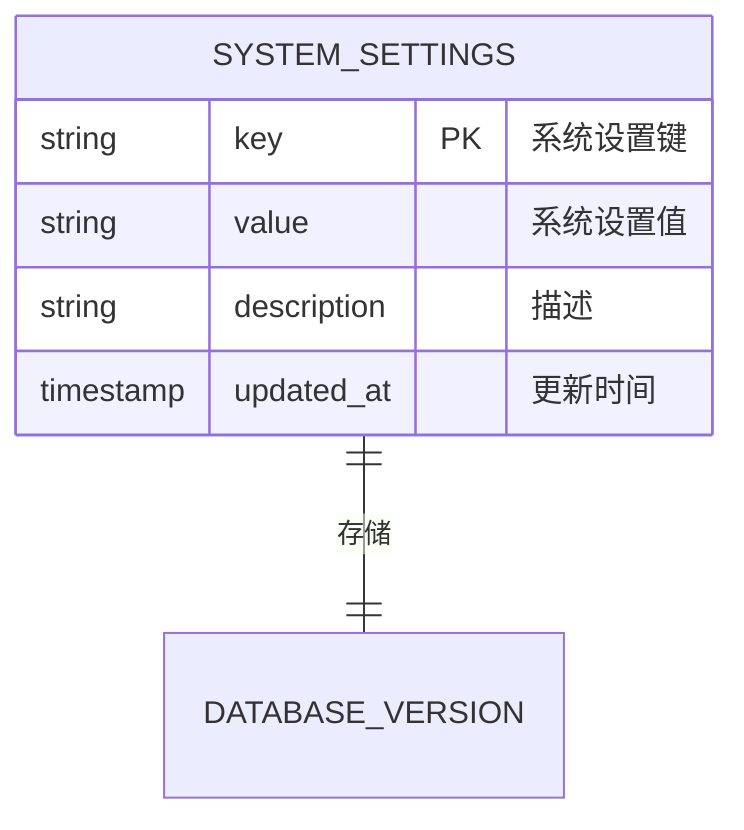

**图表来源**
- [db_manager.py](file://db_manager.py#L369-L376)
- [db_manager.py](file://db_manager.py#L2376-L2404)

### 版本检查流程

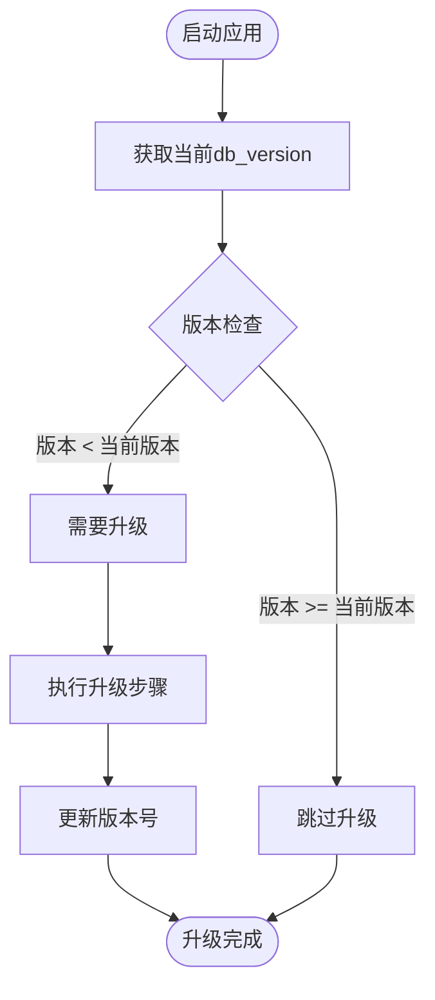

**图表来源**
- [db_manager.py](file://db_manager.py#L557-L611)

**章节来源**
- [db_manager.py](file://db_manager.py#L557-L611)
- [db_manager.py](file://db_manager.py#L2376-L2404)

## 核心迁移机制

### check_and_upgrade_db() 方法

这是数据库迁移的核心入口方法，负责协调整个升级过程：

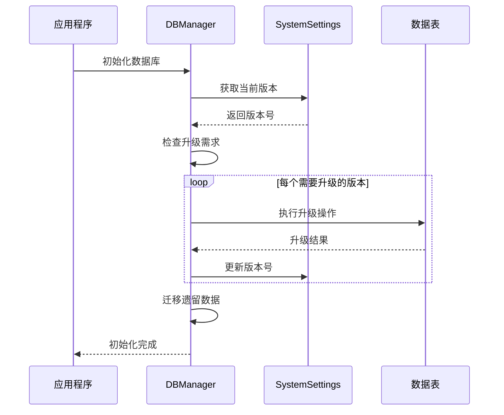

**图表来源**
- [db_manager.py](file://db_manager.py#L557-L611)

### 迁移版本列表

系统支持以下版本升级：

| 版本 | 功能特性 | 升级内容 |
|------|----------|----------|
| 1.0 | 基础功能 | 用户管理、Cookie存储、关键词管理 |
| 1.1 | 通知渠道升级 | 扩展通知渠道类型支持 |
| 1.2 | 更多通知渠道 | 支持钉钉、飞书、Bark等 |
| 1.3 | 图片关键词支持 | 添加type和image_url字段 |
| 1.4 | 通知渠道增强 | 再次扩展支持更多渠道 |
| 1.5 | 账号登录功能 | 添加用户名、密码、浏览器显示字段 |

**章节来源**
- [db_manager.py](file://db_manager.py#L564-L604)

## 表结构升级详解

### upgrade_notification_channels_table() 方法

此方法专门处理通知渠道表的升级，采用重建表的方式确保约束一致性：

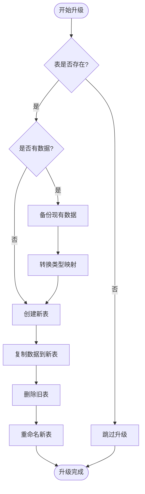

**图表来源**
- [db_manager.py](file://db_manager.py#L727-L817)

### upgrade_keywords_table_for_image_support() 方法

为关键词表添加图片支持功能：

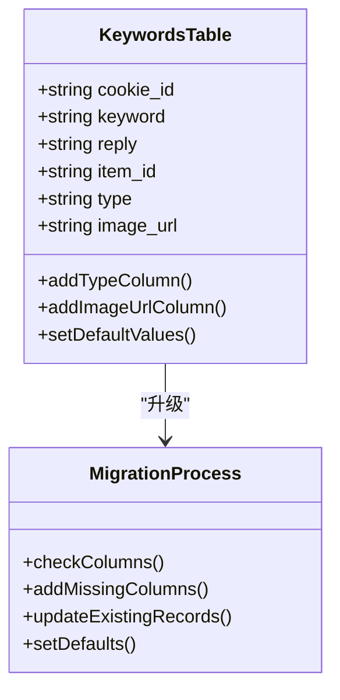

**图表来源**
- [db_manager.py](file://db_manager.py#L4609-L4634)

### _migrate_keywords_table_constraints() 方法

处理关键词表的复杂约束迁移：

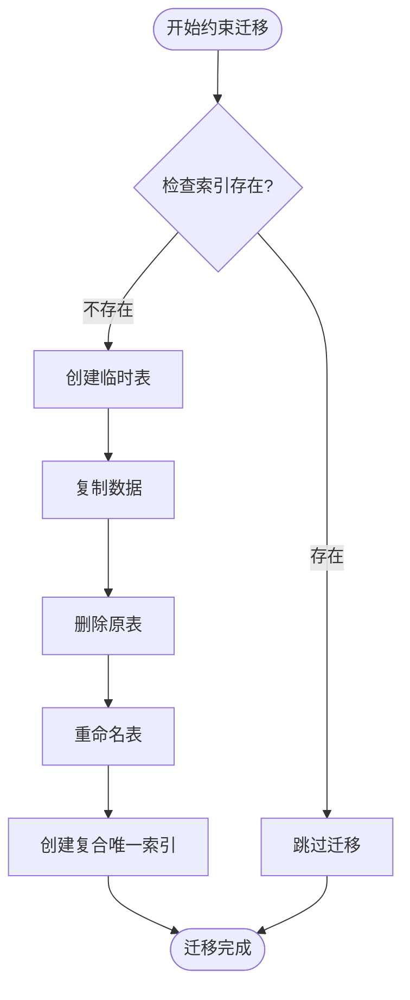

**图表来源**
- [db_manager.py](file://db_manager.py#L1035-L1095)

**章节来源**
- [db_manager.py](file://db_manager.py#L727-L817)
- [db_manager.py](file://db_manager.py#L4609-L4634)
- [db_manager.py](file://db_manager.py#L1035-L1095)

## 向后兼容性策略

### 数据迁移策略

系统采用多种策略确保向后兼容性：

1. **字段添加策略**：使用默认值确保新字段不会破坏现有数据
2. **类型转换策略**：将旧类型映射到新类型，避免数据丢失
3. **约束迁移策略**：通过重建表确保约束一致性

### 兼容性映射表

| 旧类型 | 新类型 | 映射策略 |
|--------|--------|----------|
| `dingtalk` | `dingtalk` | 直接映射 |
| `email` | `qq` | 降级映射 |
| `webhook` | `qq` | 降级映射 |
| `wechat` | `wechat` | 直接映射 |
| `telegram` | `telegram` | 直接映射 |

### 数据完整性保证

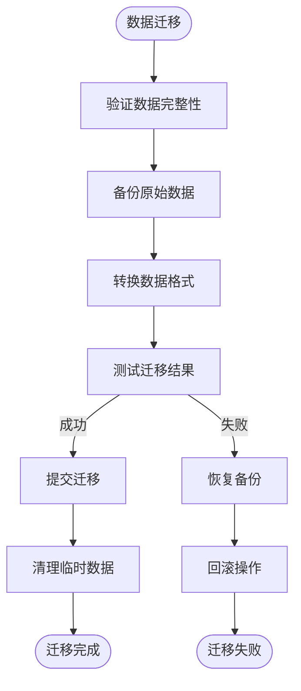

**图表来源**
- [db_manager.py](file://db_manager.py#L727-L817)

**章节来源**
- [db_manager.py](file://db_manager.py#L727-L817)
- [db_manager.py](file://db_manager.py#L1035-L1095)

## 错误处理与恢复机制

### 异常处理架构

系统实现了多层次的异常处理机制：

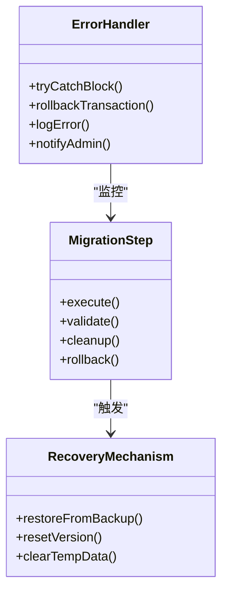

**图表来源**
- [db_manager.py](file://db_manager.py#L483-L486)
- [db_manager.py](file://db_manager.py#L609-L611)

### 回滚策略

1. **事务回滚**：使用数据库事务确保原子性
2. **备份恢复**：在关键步骤前创建数据备份
3. **版本回退**：保持旧版本信息以便回退

### 错误恢复流程

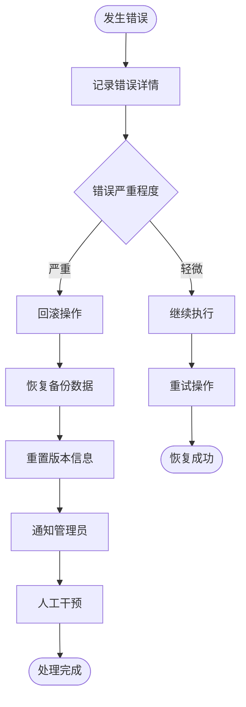

**图表来源**
- [db_manager.py](file://db_manager.py#L483-L486)
- [db_manager.py](file://db_manager.py#L609-L611)

**章节来源**
- [db_manager.py](file://db_manager.py#L483-L486)
- [db_manager.py](file://db_manager.py#L609-L611)

## 日志记录系统

### 日志级别配置

系统支持灵活的日志配置：

| 配置项 | 默认值 | 说明 |
|--------|--------|------|
| `SQL_LOG_ENABLED` | `true` | 是否启用SQL日志 |
| `SQL_LOG_LEVEL` | `INFO` | SQL日志级别 |

### 日志记录模式

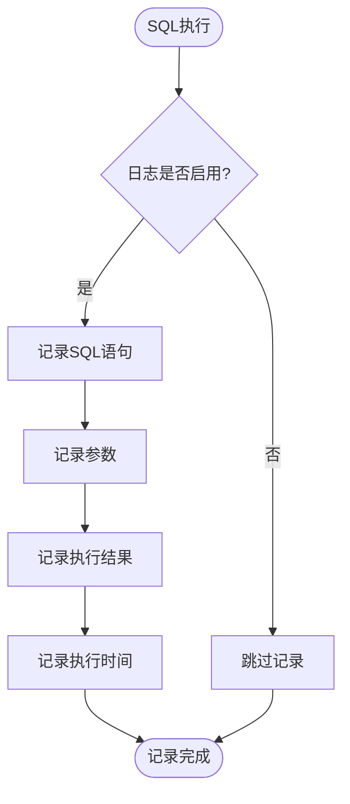

**图表来源**
- [db_manager.py](file://db_manager.py#L53-L62)
- [db_manager.py](file://db_manager.py#L1108-L1111)

### 关键事件日志

系统记录以下关键事件：

1. **版本检查**：记录当前版本和目标版本
2. **升级步骤**：记录每个升级步骤的执行情况
3. **数据迁移**：记录数据迁移的进度和结果
4. **错误事件**：记录所有错误和异常

**章节来源**
- [db_manager.py](file://db_manager.py#L53-L62)
- [db_manager.py](file://db_manager.py#L1108-L1111)

## 自定义迁移脚本指南

### 创建自定义迁移方法

开发者可以通过以下步骤创建自定义迁移方法：

1. **定义迁移方法**：
```python
def upgrade_custom_feature(self, cursor):
    """升级自定义功能"""
    try:
        # 检查是否需要升级
        if not self._needs_upgrade(cursor, 'custom_feature_version'):
            return True
            
        # 执行升级操作
        self._add_custom_columns(cursor)
        self._populate_default_data(cursor)
        
        # 更新版本信息
        self.set_system_setting('custom_feature_version', '1.0', '自定义功能版本')
        return True
        
    except Exception as e:
        logger.error(f"自定义功能升级失败: {e}")
        raise
```

2. **集成到主升级流程**：
```python
# 在 check_and_upgrade_db 方法中添加调用
if current_version < "1.6":
    logger.info("开始升级数据库到版本1.6...")
    self.upgrade_custom_feature(cursor)
    self.set_system_setting("db_version", "1.6", "数据库版本号")
    logger.info("数据库升级到版本1.6完成")
```

### 迁移脚本最佳实践

1. **幂等性**：确保迁移方法可以多次执行而不产生副作用
2. **原子性**：使用事务确保操作的原子性
3. **向后兼容**：保持对旧版本数据的支持
4. **错误处理**：完善的异常处理和恢复机制
5. **日志记录**：详细的执行日志便于调试

### 迁移测试策略

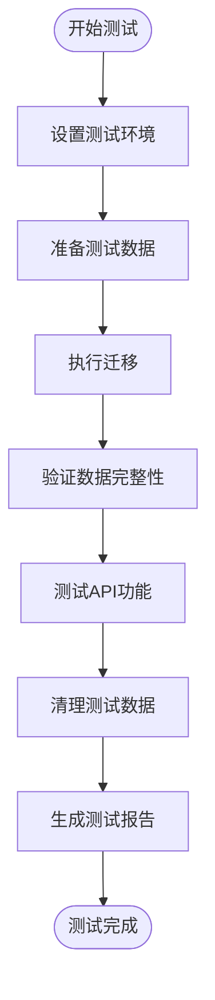

**章节来源**
- [db_manager.py](file://db_manager.py#L557-L611)

## 最佳实践建议

### 迁移开发最佳实践

1. **版本规划**：合理规划版本升级路径，避免过于频繁的版本变更
2. **渐进式升级**：将复杂的升级分解为多个小步骤
3. **充分测试**：在生产环境部署前进行充分测试
4. **备份策略**：每次升级前创建数据库备份
5. **监控告警**：建立升级过程的监控和告警机制

### 性能优化建议

1. **批量操作**：对于大量数据的迁移，使用批量处理提高效率
2. **索引优化**：在迁移过程中注意索引的维护
3. **内存管理**：避免在内存中加载过多数据
4. **并发控制**：合理控制并发访问，避免锁竞争

### 安全考虑

1. **权限控制**：确保只有授权用户才能执行数据库升级
2. **审计日志**：记录所有升级操作的审计信息
3. **数据加密**：敏感数据在迁移过程中应保持加密状态
4. **访问控制**：限制对数据库结构的直接修改权限

### 维护和监控

1. **定期检查**：定期检查数据库健康状况
2. **性能监控**：监控数据库性能指标
3. **容量规划**：根据数据增长趋势进行容量规划
4. **故障演练**：定期进行故障恢复演练

通过遵循这些最佳实践，可以确保数据库迁移升级过程的安全、可靠和高效，为系统的稳定运行提供坚实保障。