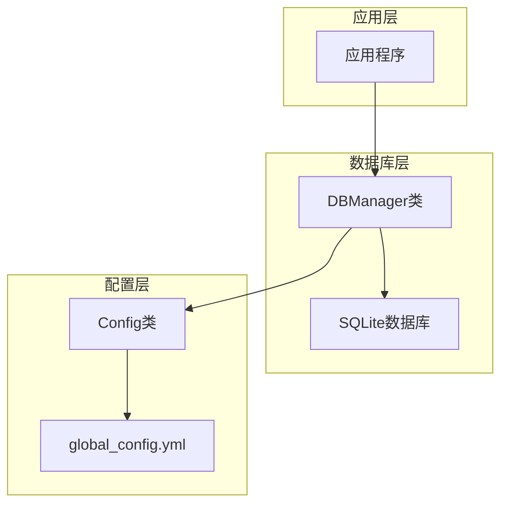
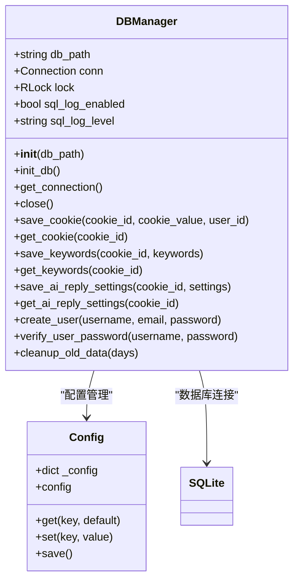
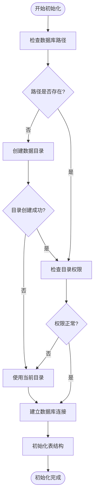
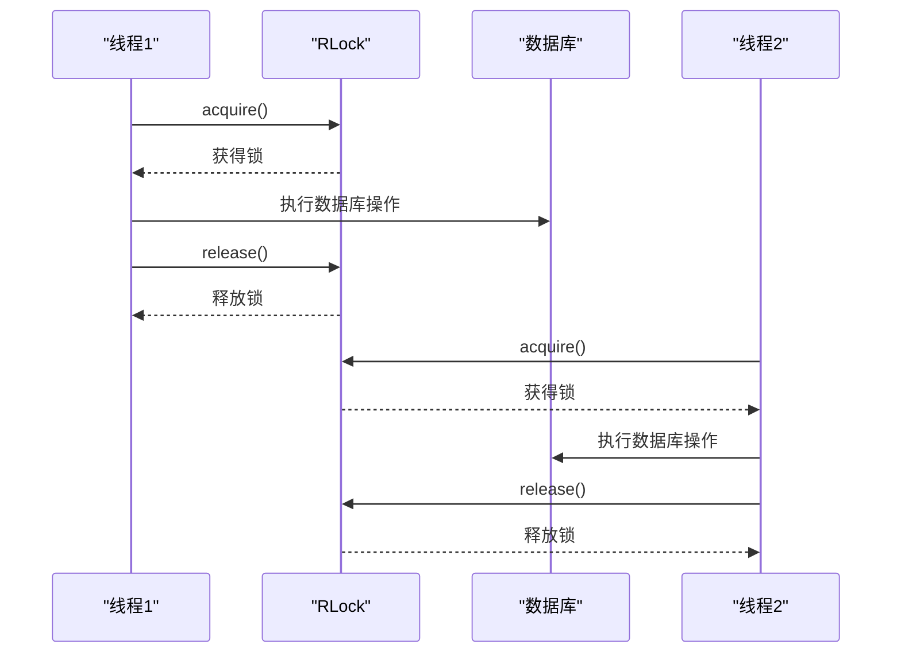
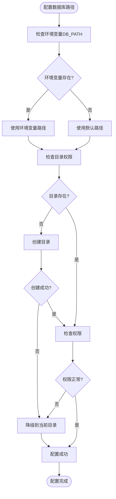
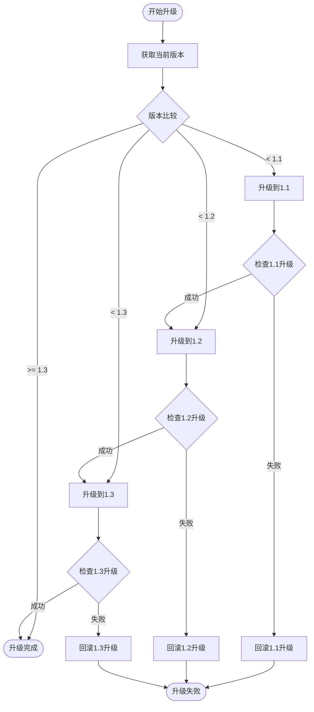
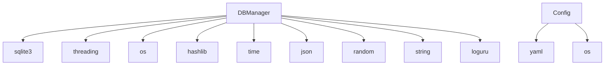
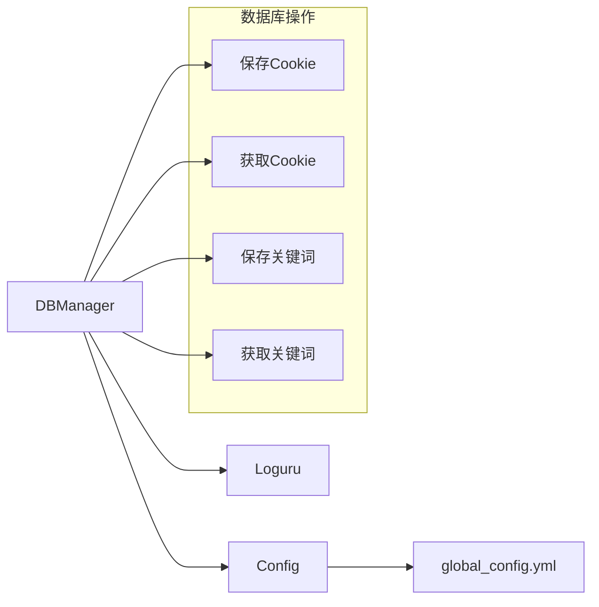

# 连接管理

<cite>
**本文档引用的文件**
- [db_manager.py](file://db_manager.py)
- [config.py](file://config.py)
- [global_config.yml](file://global_config.yml)
</cite>

## 目录
1. [简介](#简介)
2. [项目结构](#项目结构)
3. [核心组件](#核心组件)
4. [架构概览](#架构概览)
5. [详细组件分析](#详细组件分析)
6. [依赖关系分析](#依赖关系分析)
7. [性能考虑](#性能考虑)
8. [故障排除指南](#故障排除指南)
9. [结论](#结论)

## 简介

本文档详细说明了闲鱼自动回复系统中的数据库连接管理机制。该系统采用SQLite数据库作为主要数据存储方案，通过`DBManager`类实现了完整的数据库连接管理功能，包括连接建立、多线程安全控制、异常处理和生命周期管理。

## 项目结构



**图表来源**
- [db_manager.py](file://db_manager.py#L16-L52)
- [config.py](file://config.py#L5-L126)

**章节来源**
- [db_manager.py](file://db_manager.py#L1-L52)
- [config.py](file://config.py#L1-L126)

## 核心组件

### DBManager类

`DBManager`类是整个数据库连接管理的核心组件，负责：

- **数据库连接管理**：通过`sqlite3.connect()`建立连接，设置`check_same_thread=False`以支持多线程访问
- **多线程安全**：使用`threading.RLock()`可重入锁保护数据库操作
- **连接生命周期**：管理连接的初始化、使用和关闭
- **异常处理**：提供完善的异常处理和降级策略
- **配置管理**：支持环境变量和配置文件的数据库路径配置

### 连接配置机制

系统提供了灵活的数据库路径配置方式：

1. **环境变量优先**：通过`DB_PATH`环境变量指定数据库路径
2. **默认路径**：使用`data/xianyu_data.db`作为默认路径
3. **动态调整**：运行时可通过配置文件调整数据库路径

**章节来源**
- [db_manager.py](file://db_manager.py#L16-L52)

## 架构概览



**图表来源**
- [db_manager.py](file://db_manager.py#L16-L52)
- [config.py](file://config.py#L5-L126)

## 详细组件分析

### 数据库连接建立

#### sqlite3.connect()配置

系统通过以下方式建立数据库连接：

```python
self.conn = sqlite3.connect(self.db_path, check_same_thread=False)
```

关键配置参数：
- **check_same_thread=False**：允许在多线程环境中使用同一个连接
- **路径配置**：支持动态路径配置和环境变量覆盖

#### 连接初始化流程



**图表来源**
- [db_manager.py](file://db_manager.py#L19-L51)

**章节来源**
- [db_manager.py](file://db_manager.py#L19-L51)

### 多线程安全机制

#### RLock锁机制

系统使用`threading.RLock()`实现多线程安全：

```python
self.lock = threading.RLock()  # 使用可重入锁保护数据库操作
```

**锁机制特点**：
- **可重入性**：同一线程可以多次获取锁而不会死锁
- **线程安全**：确保多个线程同时访问数据库时的安全性
- **细粒度控制**：对每个数据库操作都进行锁定

#### 锁使用模式



**图表来源**
- [db_manager.py](file://db_manager.py#L1156-L1194)

**章节来源**
- [db_manager.py](file://db_manager.py#L1156-L1194)

### 连接生命周期管理

#### 初始化阶段

```python
def __init__(self, db_path: str = None):
    """初始化数据库连接和表结构"""
    # 路径配置
    if db_path is None:
        db_path = os.getenv('DB_PATH', 'data/xianyu_data.db')
    
    # 目录权限检查和创建
    db_dir = os.path.dirname(db_path)
    if db_dir and not os.path.exists(db_dir):
        try:
            os.makedirs(db_dir, mode=0o755, exist_ok=True)
        except PermissionError as e:
            db_path = os.path.basename(db_path)
    
    # 连接建立
    self.conn = None
    self.lock = threading.RLock()
    
    # 表结构初始化
    self.init_db()
```

#### 连接获取和管理

```python
def get_connection(self):
    """获取数据库连接，如果已关闭则重新连接"""
    if self.conn is None:
        self.conn = sqlite3.connect(self.db_path, check_same_thread=False)
    return self.conn
```

#### 连接关闭

```python
def close(self):
    """关闭数据库连接"""
    if self.conn:
        self.conn.close()
        self.conn = None
```

**章节来源**
- [db_manager.py](file://db_manager.py#L16-L1101)

### 数据库路径配置

#### 配置优先级

系统采用以下配置优先级：

1. **环境变量**：`DB_PATH`环境变量
2. **配置文件**：`global_config.yml`中的数据库路径
3. **默认值**：`data/xianyu_data.db`

#### 异常处理和降级



**图表来源**
- [db_manager.py](file://db_manager.py#L19-L51)

**章节来源**
- [db_manager.py](file://db_manager.py#L19-L51)

### SQL日志配置

系统提供了可配置的SQL日志功能：

```python
# 默认启用SQL日志
self.sql_log_enabled = True
self.sql_log_level = 'INFO'

# 支持环境变量覆盖
if os.getenv('SQL_LOG_ENABLED'):
    self.sql_log_enabled = os.getenv('SQL_LOG_ENABLED', 'true').lower() == 'true'
if os.getenv('SQL_LOG_LEVEL'):
    self.sql_log_level = os.getenv('SQL_LOG_LEVEL', 'INFO').upper()
```

**章节来源**
- [db_manager.py](file://db_manager.py#L53-L62)

### 数据库表结构管理

#### 初始化流程

```mermaid
flowchart TD
Start([开始初始化]) --> CreateConn["创建数据库连接"]
CreateConn --> CreateTable["创建用户表"]
CreateTable --> CreateEmail["创建邮箱验证表"]
CreateEmail --> CreateCaptcha["创建图形验证码表"]
CreateCaptcha --> CreateCookies["创建Cookie表"]
CreateCookies --> CreateKeywords["创建关键词表"]
CreateKeywords --> CreateStatus["创建Cookie状态表"]
CreateStatus --> CreateAI["创建AI回复设置表"]
CreateAI --> CreateConv["创建AI对话历史表"]
CreateConv --> CreateCache["创建AI商品缓存表"]
CreateCache --> CreateCards["创建卡券表"]
CreateCards --> CreateOrders["创建订单表"]
CreateOrders --> CreateItemInfo["创建商品信息表"]
CreateItemInfo --> CreateDelivery["创建自动发货规则表"]
CreateDelivery --> CreateDefault["创建默认回复表"]
CreateDefault --> CreateItemReply["创建指定商品回复表"]
CreateItemReply --> CreateRecords["创建默认回复记录表"]
CreateRecords --> CreateChannels["创建通知渠道表"]
CreateChannels --> CreateSettings["创建系统设置表"]
CreateSettings --> CreateNotifications["创建消息通知配置表"]
CreateNotifications --> CreateUsers["创建用户设置表"]
CreateUsers --> CreateRiskLogs["创建风控日志表"]
CreateRiskLogs --> InsertDefaults["插入默认系统设置"]
InsertDefaults --> CheckUpgrade["检查数据库升级"]
CheckUpgrade --> Migrate["执行数据库迁移"]
Migrate --> Commit["提交事务"]
Commit --> Complete([初始化完成])
```



**图表来源**
- [db_manager.py](file://db_manager.py#L67-L447)

**章节来源**
- [db_manager.py](file://db_manager.py#L67-L447)

### 数据库升级和迁移

#### 版本检查和升级

系统实现了完整的数据库版本管理和升级机制：

```python
def check_and_upgrade_db(self, cursor):
    """检查数据库版本并执行必要的升级"""
    current_version = self.get_system_setting("db_version") or "1.0"
    
    if current_version < "1.1":
        self.upgrade_notification_channels_table(cursor)
        self.set_system_setting("db_version", "1.1", "数据库版本号")
    
    if current_version < "1.2":
        self.upgrade_notification_channels_types(cursor)
        self.set_system_setting("db_version", "1.2", "数据库版本号")
```

#### 迁移策略



**图表来源**
- [db_manager.py](file://db_manager.py#L557-L611)

**章节来源**
- [db_manager.py](file://db_manager.py#L557-L611)

### 连接池优化建议

虽然当前实现使用单连接模式，但可以扩展为连接池架构：

#### 当前单连接模式

```python
# 当前实现：单连接
self.conn = sqlite3.connect(self.db_path, check_same_thread=False)
```

#### 连接池改进方案

```python
# 推荐的连接池实现
class PoolDBManager(DBManager):
    def __init__(self, pool_size=5, **kwargs):
        super().__init__(**kwargs)
        self.pool_size = pool_size
        self.connection_pool = []
        self.pool_lock = threading.Lock()
        
        # 初始化连接池
        for _ in range(pool_size):
            conn = sqlite3.connect(self.db_path, check_same_thread=False)
            self.connection_pool.append(conn)
    
    def get_connection(self):
        with self.pool_lock:
            if not self.connection_pool:
                # 如果池为空，创建新连接
                return sqlite3.connect(self.db_path, check_same_thread=False)
            return self.connection_pool.pop()
    
    def release_connection(self, conn):
        with self.pool_lock:
            if len(self.connection_pool) < self.pool_size:
                self.connection_pool.append(conn)
```

#### 性能优化建议

1. **连接复用**：减少连接建立和销毁的开销
2. **负载均衡**：在多个连接间分配请求
3. **连接健康检查**：定期检查连接有效性
4. **超时处理**：设置合理的连接超时时间

**章节来源**
- [db_manager.py](file://db_manager.py#L1102-L1106)

## 依赖关系分析

### 外部依赖



**图表来源**
- [db_manager.py](file://db_manager.py#L1-L15)
- [config.py](file://config.py#L1-L5)

### 内部模块依赖



**图表来源**
- [db_manager.py](file://db_manager.py#L1-L15)
- [config.py](file://config.py#L1-L5)

**章节来源**
- [db_manager.py](file://db_manager.py#L1-L15)
- [config.py](file://config.py#L1-L5)

## 性能考虑

### 连接性能优化

1. **连接复用**：当前使用单连接，适合低并发场景
2. **批量操作**：支持批量插入和更新操作
3. **索引优化**：关键查询字段建立了适当的索引
4. **事务管理**：使用事务确保数据一致性

### 内存管理

1. **连接池**：可扩展为连接池模式
2. **垃圾回收**：及时释放不用的连接
3. **内存监控**：定期清理过期数据

### 磁盘I/O优化

1. **WAL模式**：SQLite默认使用WAL模式提高并发性能
2. **定期清理**：自动清理过期的历史数据
3. **VACUUM操作**：定期整理数据库碎片

## 故障排除指南

### 常见问题和解决方案

#### 1. 权限不足错误

**症状**：数据库目录创建失败或写入权限不足

**解决方案**：
```python
# 自动降级到当前目录
if not os.access(db_dir, os.W_OK):
    db_path = os.path.basename(db_path)
    logger.warning(f"使用当前目录作为数据库路径: {db_path}")
```

#### 2. 多线程访问冲突

**症状**：多线程环境下出现数据库锁定错误

**解决方案**：
```python
# 使用RLock确保线程安全
with self.lock:
    # 数据库操作
    cursor = self.conn.cursor()
    cursor.execute(sql, params)
```

#### 3. 数据库文件损坏

**症状**：数据库连接失败或查询异常

**解决方案**：
```python
# 检查数据库完整性
try:
    cursor.execute("PRAGMA integrity_check")
    result = cursor.fetchone()
    if result[0] != "ok":
        logger.error(f"数据库完整性检查失败: {result}")
except sqlite3.DatabaseError as e:
    logger.error(f"数据库损坏: {e}")
```

#### 4. 连接超时问题

**症状**：长时间运行后连接失效

**解决方案**：
```python
# 实现连接重连机制
def get_connection(self):
    if self.conn is None or not self.conn:
        try:
            self.conn = sqlite3.connect(self.db_path, check_same_thread=False)
        except sqlite3.Error as e:
            logger.error(f"数据库连接失败: {e}")
            return None
    return self.conn
```

**章节来源**
- [db_manager.py](file://db_manager.py#L25-L51)
- [db_manager.py](file://db_manager.py#L1102-L1106)

## 结论

闲鱼自动回复系统的数据库连接管理实现了以下关键特性：

1. **多线程安全**：通过RLock锁机制确保并发访问安全
2. **灵活配置**：支持环境变量和配置文件的数据库路径配置
3. **异常处理**：完善的异常捕获和降级策略
4. **版本管理**：自动化的数据库升级和迁移机制
5. **性能优化**：支持批量操作和定期清理机制

该设计为系统提供了稳定可靠的数据库访问能力，支持高并发场景下的数据操作需求。通过合理的架构设计和异常处理机制，确保了系统的稳定性和可维护性。