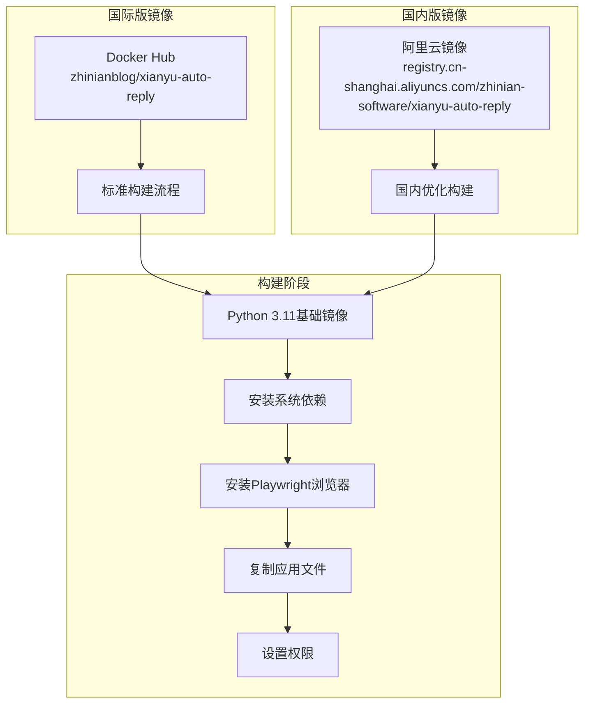

# 商品搜索功能

<cite>
**本文档中引用的文件**
- [utils/item_search.py](file://utils/item_search.py)
- [utils/xianyu_slider_stealth.py](file://utils/xianyu_slider_stealth.py)
- [utils/captcha_remote_control.py](file://utils/captcha_remote_control.py)
- [config.py](file://config.py)
- [Dockerfile](file://Dockerfile)
- [Dockerfile-cn](file://Dockerfile-cn)
- [README.md](file://README.md)
</cite>

## 目录
1. [简介](#简介)
2. [系统架构概览](#系统架构概览)
3. [核心组件分析](#核心组件分析)
4. [滑块验证码处理机制](#滑块验证码处理机制)
5. [商品数据解析与提取](#商品数据解析与提取)
6. [Docker环境配置](#docker环境配置)
7. [使用指南](#使用指南)
8. [故障排除](#故障排除)
9. [总结](#总结)

## 简介

闲鱼商品搜索功能是一个基于Playwright技术的自动化商品搜索系统，能够真实模拟用户行为访问闲鱼搜索页面，通过模拟输入关键词、点击搜索按钮等操作获取真实的商品数据。该系统具备强大的验证码处理能力，支持标准滑块验证和刮刮乐滑块验证两种类型，并能够解析复杂的搜索结果页面，提取商品标题、价格、图片等关键信息。

### 主要特性

- **真实数据获取**：基于Playwright技术获取真实的闲鱼商品数据
- **智能排序**：按照"人想要"数量自动倒序排列商品
- **多页搜索**：支持一次性获取多页商品数据
- **验证码处理**：自动检测并处理滑块验证码
- **Docker部署**：完整的Docker环境支持
- **多用户隔离**：支持多账号独立运行

## 系统架构概览


**架构图来源**
- [utils/item_search.py](file://utils/item_search.py#L42-L80)
- [utils/xianyu_slider_stealth.py](file://utils/xianyu_slider_stealth.py#L244-L300)

## 核心组件分析

### XianyuSearcher类

XianyuSearcher是商品搜索功能的核心类，负责整个搜索流程的协调和管理。


**类图来源**
- [utils/item_search.py](file://utils/item_search.py#L42-L100)

#### 初始化与浏览器管理

系统通过`init_browser()`方法初始化浏览器环境，支持持久化上下文以保留缓存和cookies信息：


**序列图来源**
- [utils/item_search.py](file://utils/item_search.py#L685-L767)

**章节来源**
- [utils/item_search.py](file://utils/item_search.py#L685-L767)

### 搜索流程实现

商品搜索的核心流程包括页面导航、关键词输入、搜索执行和结果处理：

```mermaid
flowchart TD
Start([开始搜索]) --> InitBrowser[初始化浏览器]
InitBrowser --> SetCookies[设置Cookie登录]
SetCookies --> NavigatePage[访问闲鱼首页]
NavigatePage --> WaitLoad[等待页面加载]
WaitLoad --> FillKeyword[填写搜索关键词]
FillKeyword --> RegisterListener[注册API监听器]
RegisterListener --> ClickSearch[点击搜索按钮]
ClickSearch --> WaitResponse[等待API响应]
WaitResponse --> DetectCaptcha{检测滑块验证}
DetectCaptcha --> |有滑块| HandleCaptcha[处理滑块验证]
DetectCaptcha --> |无滑块| ParseResults[解析搜索结果]
HandleCaptcha --> ManualMode{人工处理?}
ManualMode --> |是| RemoteControl[启动远程控制]
ManualMode --> |否| AutoSolve[自动破解滑块]
RemoteControl --> WaitCompletion[等待用户完成]
AutoSolve --> ParseResults
WaitCompletion --> ParseResults
ParseResults --> SortResults[按"人想要"排序]
SortResults --> ReturnResults[返回搜索结果]
ReturnResults --> CloseBrowser[关闭浏览器]
CloseBrowser --> End([结束])
```

**流程图来源**
- [utils/item_search.py](file://utils/item_search.py#L768-L935)

**章节来源**
- [utils/item_search.py](file://utils/item_search.py#L768-L935)

## 滑块验证码处理机制

系统具备强大的验证码处理能力，能够自动检测并处理两种类型的滑块验证码。

### 验证码类型识别

系统通过多种策略识别不同类型的滑块验证码：


**流程图来源**
- [utils/item_search.py](file://utils/item_search.py#L411-L623)

### 标准滑块处理

对于标准滑块验证，系统使用XianyuSliderStealth类进行自动化破解：


**类图来源**
- [utils/xianyu_slider_stealth.py](file://utils/xianyu_slider_stealth.py#L244-L300)

### 刮刮乐滑块处理

刮刮乐滑块需要人工干预，系统提供远程控制功能：


**序列图来源**
- [utils/captcha_remote_control.py](file://utils/captcha_remote_control.py#L17-L65)

**章节来源**
- [utils/item_search.py](file://utils/item_search.py#L411-L623)
- [utils/xianyu_slider_stealth.py](file://utils/xianyu_slider_stealth.py#L244-L800)
- [utils/captcha_remote_control.py](file://utils/captcha_remote_control.py#L17-L369)

## 商品数据解析与提取

系统能够从复杂的HTML页面中提取结构化商品数据：

### 数据提取流程

```mermaid
flowchart TD
ReceiveHTML[接收HTML内容] --> ParseAPIResponse[解析API响应]
ParseAPIResponse --> ExtractMainData[提取主数据]
ExtractMainData --> ParseTitle[解析商品标题]
ParseTitle --> ParsePrice[解析商品价格]
ParsePrice --> ParseSeller[解析卖家信息]
ParseSeller --> ParseImages[解析商品图片]
ParseImages --> ParsePublishTime[解析发布时间]
ParsePublishTime --> ExtractWantCount[提取"人想要"数量]
ExtractWantCount --> FormatResult[格式化结果]
FormatResult --> ReturnData[返回结构化数据]
```

**流程图来源**
- [utils/item_search.py](file://utils/item_search.py#L977-L1096)

### 商品信息字段解析

系统提取以下关键字段：

| 字段名称 | 数据来源 | 解析方法 | 示例 |
|---------|---------|---------|------|
| item_id | clickParams.item_id | 直接提取 | "item_123456" |
| title | mainData.title | 文本提取 | "iPhone 13 Pro Max" |
| price | mainData.price | 文本拼接 | "¥5999" |
| seller_name | mainData.userNickName | 直接提取 | "闲鱼卖家" |
| item_url | mainData.targetUrl | URL转换 | "https://..." |
| main_image | mainData.picUrl | URL处理 | "https://..." |
| publish_time | clickParams.publishTime | 时间戳转换 | "2025-07-28 14:30" |
| want_count | fishTags.tagList | 数字提取 | 1234 |
| area | mainData.area | 直接提取 | "北京" |

### 价格处理逻辑

系统具备智能的价格处理能力，能够处理各种价格格式：


**流程图来源**
- [utils/item_search.py](file://utils/item_search.py#L986-L1012)

**章节来源**
- [utils/item_search.py](file://utils/item_search.py#L977-L1096)

## Docker环境配置

系统提供了完整的Docker部署解决方案，支持多种部署场景。

### Docker镜像构建

系统提供两个版本的Docker镜像：



**架构图来源**
- [Dockerfile](file://Dockerfile#L1-L138)
- [Dockerfile-cn](file://Dockerfile-cn#L1-L131)

### 环境变量配置

系统支持通过环境变量进行配置：

| 环境变量 | 默认值 | 描述 |
|---------|--------|------|
| WEB_PORT | 8080 | Web服务端口 |
| API_HOST | 0.0.0.0 | API服务主机 |
| TZ | Asia/Shanghai | 时区设置 |
| DOCKER_ENV | true | Docker环境标识 |
| PLAYWRIGHT_BROWSERS_PATH | /ms-playwright | Playwright浏览器路径 |

### Docker Compose配置

系统提供完整的Docker Compose配置文件：

```yaml
version: '3.8'
services:
  xianyu-auto-reply:
    image: zhinianblog/xianyu-auto-reply:latest
    ports:
      - "8080:8080"
    volumes:
      - ./data:/app/data
      - ./logs:/app/logs
    restart: always
    environment:
      - DOCKER_ENV=true
      - TZ=Asia/Shanghai
```

### Playwright在Docker中的配置要点

在Docker环境中运行Playwright需要特别注意以下配置：


**流程图来源**
- [utils/item_search.py](file://utils/item_search.py#L699-L719)
- [Dockerfile](file://Dockerfile#L115-L116)

**章节来源**
- [Dockerfile](file://Dockerfile#L1-L138)
- [Dockerfile-cn](file://Dockerfile-cn#L1-L131)
- [utils/item_search.py](file://utils/item_search.py#L699-L719)

## 使用指南

### 基本搜索操作

1. **访问搜索页面**：登录系统后访问商品搜索功能
2. **填写搜索条件**：
   - 输入关键词
   - 选择页数（支持多页搜索）
   - 设置每页显示数量
3. **执行搜索**：点击搜索按钮开始搜索
4. **查看结果**：系统自动获取真实数据并按"人想要"数量排序

### 配置搜索参数

系统提供灵活的搜索参数配置：

```javascript
// 搜索参数示例
const searchParams = {
    keyword: "iPhone 13",      // 搜索关键词
    page: 1,                   // 当前页码
    pageSize: 20,              // 每页数量
    totalPages: 3              // 总页数
};
```

### 处理验证码

当遇到滑块验证码时：

1. **标准滑块**：系统自动尝试破解，通常不需要人工干预
2. **刮刮乐滑块**：系统会启动远程控制会话
   - 访问提供的控制链接
   - 在网页上手动完成滑块验证
   - 系统会自动检测验证完成状态

### 解析结果处理

搜索结果包含以下信息：

```json
{
    "items": [
        {
            "item_id": "item_123456",
            "title": "iPhone 13 Pro Max 128GB",
            "price": "¥5999",
            "seller_name": "闲鱼卖家",
            "item_url": "https://...",
            "main_image": "https://...",
            "publish_time": "2025-07-28 14:30",
            "want_count": 1234,
            "area": "北京"
        }
    ],
    "total": 100,
    "is_real_data": true,
    "source": "playwright"
}
```

**章节来源**
- [utils/item_search.py](file://utils/item_search.py#L1514-L1572)

## 故障排除

### 常见问题及解决方案

#### 1. Playwright浏览器安装问题

**问题描述**：浏览器未安装或启动失败

**解决方案**：
```bash
# 在Docker容器中安装浏览器
docker exec -it xianyu-auto-reply bash
playwright install chromium
playwright install-deps chromium
```

**错误信息**：
- "Executable doesn't exist"
- "playwright install"
- "BrowserType.launch"

#### 2. 滑块验证失败

**问题描述**：滑块验证无法自动通过

**解决方案**：
- 检查网络连接稳定性
- 确认浏览器版本兼容性
- 手动处理刮刮乐滑块验证

#### 3. Docker环境问题

**问题描述**：Docker容器中运行异常

**解决方案**：
- 检查Docker资源限制
- 确认端口映射配置
- 验证数据卷挂载

#### 4. 搜索结果为空

**问题描述**：搜索后没有返回商品数据

**解决方案**：
- 检查关键词是否过于具体
- 确认Cookie是否有效
- 验证网络连接状态

### 调试技巧

1. **启用详细日志**：设置日志级别为DEBUG
2. **检查浏览器状态**：确认浏览器正常启动
3. **验证网络连接**：确保能够访问闲鱼网站
4. **测试Cookie有效性**：确认登录状态正常

**章节来源**
- [utils/item_search.py](file://utils/item_search.py#L920-L935)
- [utils/item_search.py](file://utils/item_search.py#L1446-L1467)

## 总结

闲鱼商品搜索功能是一个功能完整、技术先进的自动化搜索系统。它通过Playwright技术实现了真实的浏览器行为模拟，能够自动处理复杂的验证码挑战，并提供高质量的商品数据提取能力。

### 技术亮点

1. **智能验证码处理**：支持标准滑块和刮刮乐两种类型
2. **真实数据获取**：基于真实浏览器环境获取原始数据
3. **强大的解析能力**：能够处理复杂的HTML结构和多样的数据格式
4. **完善的错误处理**：提供重试机制和降级方案
5. **Docker友好设计**：完整的容器化部署支持

### 应用价值

该系统为企业和个人提供了高效的商品信息获取解决方案，特别适用于：
- 商品市场调研
- 竞品分析
- 价格监控
- 库存管理

通过合理配置和使用，该系统能够在保证稳定性的前提下，提供高质量的商品搜索服务。