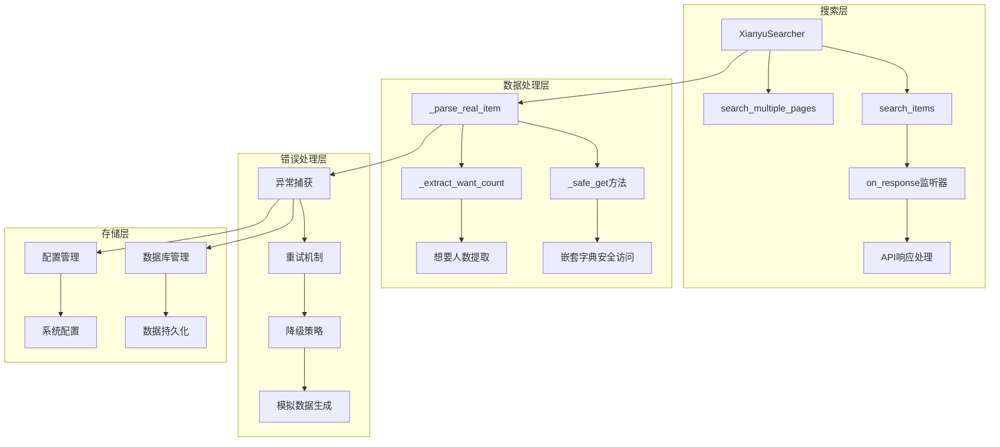
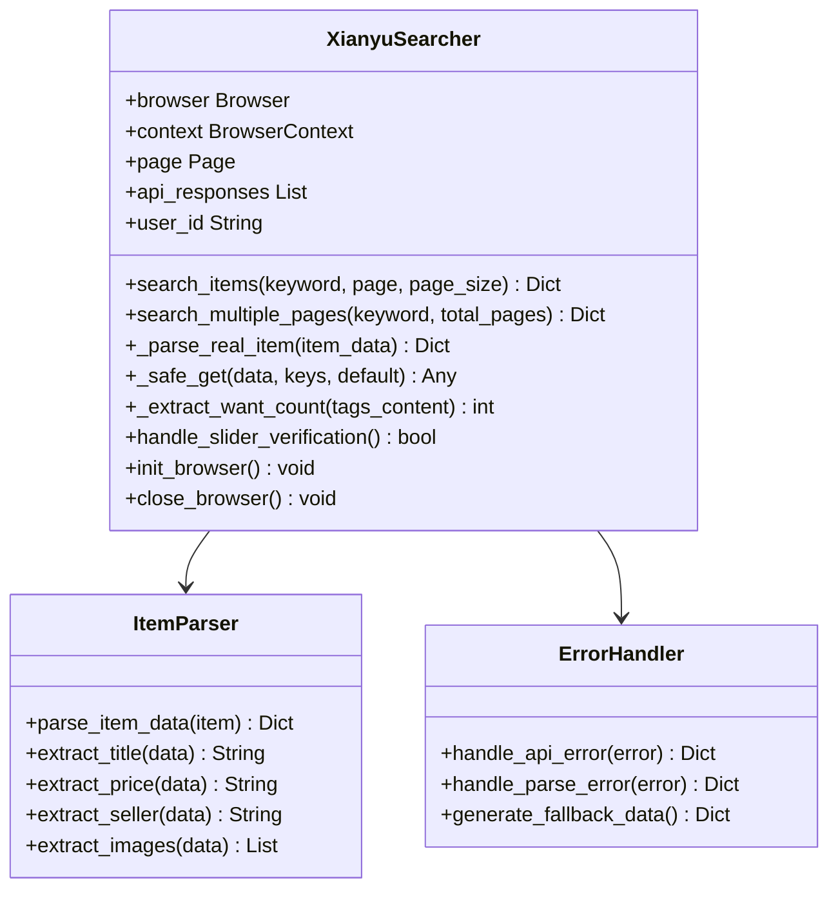
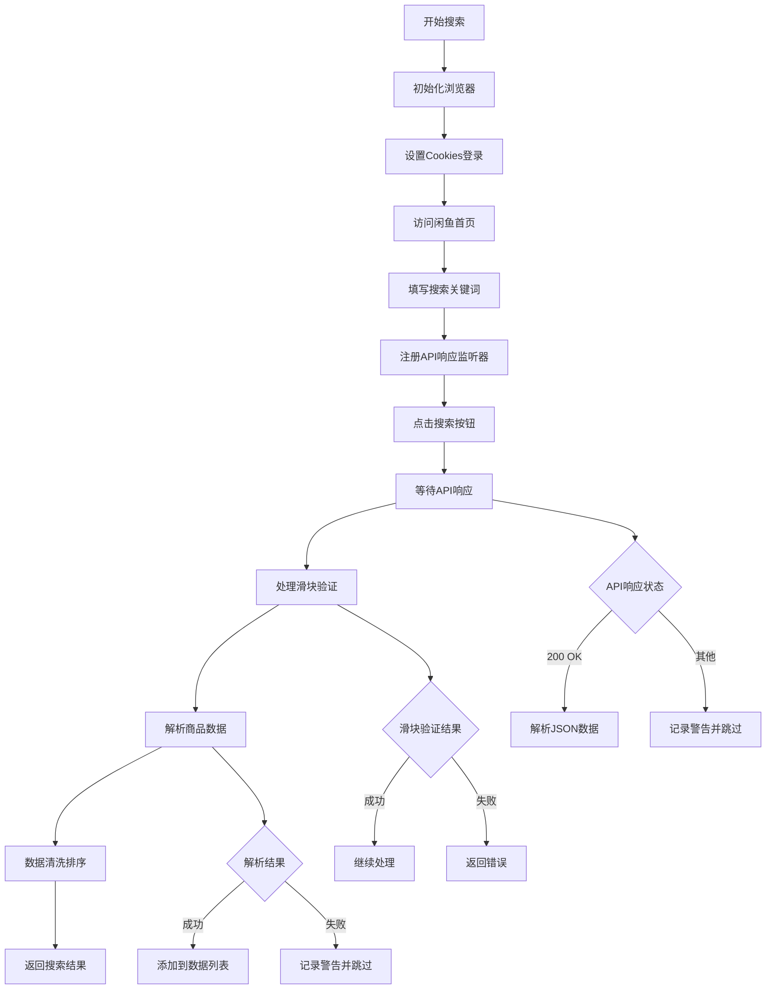
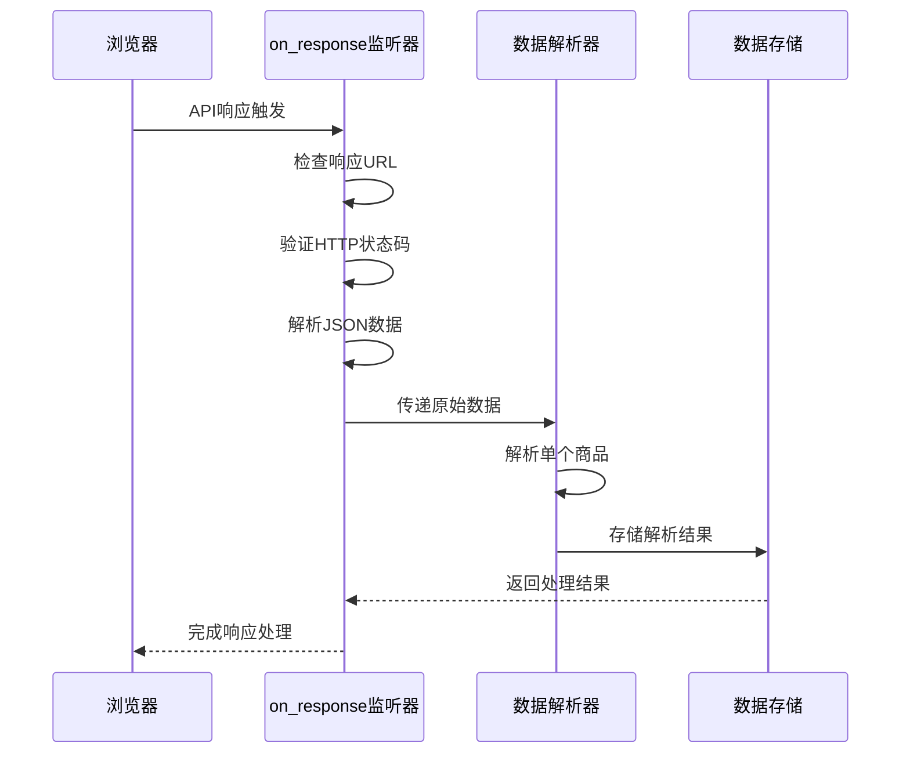
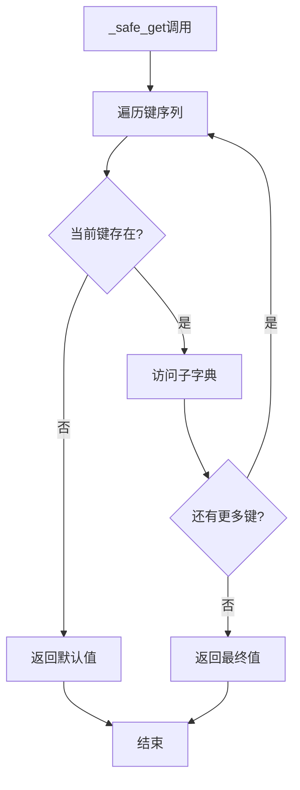
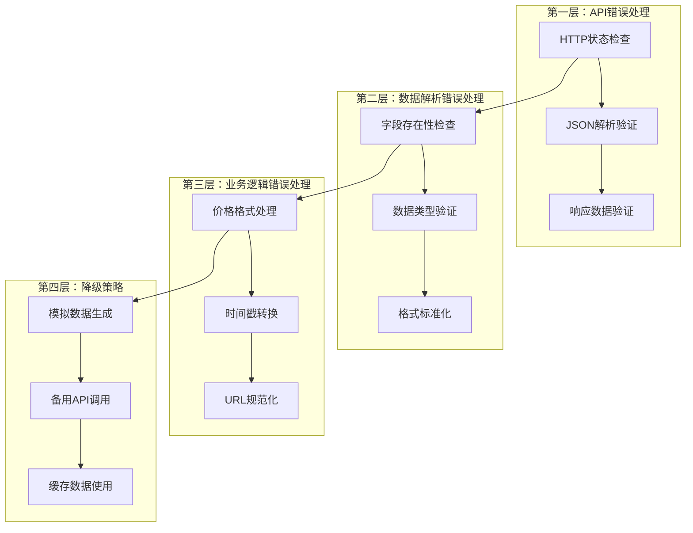

# 搜索结果解析

<cite>
**本文档中引用的文件**
- [item_search.py](file://utils/item_search.py)
- [XianyuAutoAsync.py](file://XianyuAutoAsync.py)
- [xianyu_utils.py](file://utils/xianyu_utils.py)
- [config.py](file://config.py)
- [db_manager.py](file://db_manager.py)
- [slider_patch.py](file://utils/slider_patch.py)
</cite>

## 目录
1. [简介](#简介)
2. [项目架构概览](#项目架构概览)
3. [核心组件分析](#核心组件分析)
4. [search_items方法详解](#search_items方法详解)
5. [on_response监听器机制](#on_response监听器机制)
6. [_safe_get方法的安全访问](#_safe_get方法的安全访问)
7. [_extract_want_count方法解析](#_extract_want_count方法解析)
8. [数据处理与错误处理](#数据处理与错误处理)
9. [最佳实践指南](#最佳实践指南)
10. [故障排除](#故障排除)

## 简介

本文档详细介绍闲鱼自动回复系统中搜索结果解析的核心功能。该系统基于Playwright技术实现实时商品搜索，通过解析API响应和HTML内容提取商品关键信息，为自动回复引擎提供高质量的商品数据。

系统采用异步架构设计，具备强大的错误处理能力和数据清洗机制，能够有效应对反爬虫策略和数据格式异常。

## 项目架构概览



**图表来源**
- [item_search.py](file://utils/item_search.py#L42-L80)
- [XianyuAutoAsync.py](file://XianyuAutoAsync.py#L158-L200)

## 核心组件分析

### XianyuSearcher类

XianyuSearcher是搜索功能的核心类，负责管理Playwright浏览器实例、处理API响应和解析商品数据。



**图表来源**
- [item_search.py](file://utils/item_search.py#L42-L100)

**章节来源**
- [item_search.py](file://utils/item_search.py#L42-L100)

## search_items方法详解

search_items方法是系统的核心入口，实现了完整的商品搜索流程。

### 方法执行流程



**图表来源**
- [item_search.py](file://utils/item_search.py#L768-L935)

### 关键实现细节

1. **浏览器初始化**: 使用持久化上下文确保缓存和cookies的持久化
2. **API监听**: 注册on_response回调函数捕获搜索API响应
3. **滑块处理**: 自动检测并处理各种类型的滑块验证
4. **数据解析**: 逐个解析API响应中的商品数据
5. **结果排序**: 按"想要人数"倒序排列商品

**章节来源**
- [item_search.py](file://utils/item_search.py#L768-L935)

## on_response监听器机制

on_response监听器是系统捕获API响应的核心机制，负责实时解析搜索结果。

### 监听器工作原理



**图表来源**
- [item_search.py](file://utils/item_search.py#L798-L831)

### API响应处理逻辑

监听器主要处理以下步骤：

1. **URL过滤**: 只处理特定的搜索API端点
2. **状态验证**: 确保HTTP状态码为200
3. **JSON解析**: 安全地解析响应体为JSON格式
4. **数据提取**: 从响应中提取商品列表
5. **逐项解析**: 调用解析器处理每个商品

**章节来源**
- [item_search.py](file://utils/item_search.py#L798-L831)

## _safe_get方法的安全访问

_safe_get方法提供了安全访问嵌套字典结构的能力，避免因数据缺失导致的解析异常。

### 方法实现原理



**图表来源**
- [item_search.py](file://utils/item_search.py#L625-L632)

### 错误处理机制

_safe_get方法能够优雅地处理以下异常情况：

- **KeyError**: 字典键不存在
- **TypeError**: 访问非字典类型的对象
- **IndexError**: 数组索引越界

### 使用示例场景

```python
# 安全访问嵌套结构
title = await self.safe_get(item_data, "data", "item", "main", "exContent", "title", default="未知标题")

# 处理可选字段
price_parts = await self.safe_get(main_data, "price", default=[])
price = "".join([str(p.get("text", "")) for p in price_parts if isinstance(p, dict)])
```

**章节来源**
- [item_search.py](file://utils/item_search.py#L625-L632)

## _extract_want_count方法解析

_extract_want_count方法专门用于从商品标签内容中提取"想要人数"信息。

### 解析算法

```mermaid
flowchart TD
A[输入标签内容] --> B{包含"人想要"?}
B --> |否| C[返回0]
B --> |是| D[正则表达式匹配]
D --> E{匹配成功?}
E --> |否| C
E --> |是| F[提取数字部分]
F --> G{包含"万"?}
G --> |是| H[转换为数值×10000]
G --> |否| I[转换为整数]
H --> J[返回结果]
I --> J
```

**图表来源**
- [item_search.py](file://utils/item_search.py#L1072-L1096)

### 正则表达式模式

方法使用以下正则表达式模式提取数字：

```
(\d+(?:\.\d+)?(?:万)?)\s*人想要
```

该模式能够匹配：
- "123人想要"
- "1.2万人想要"
- "123 人想要"（带空格）

### 异常处理

方法包含完善的异常处理机制，确保即使解析失败也不会影响整体流程。

**章节来源**
- [item_search.py](file://utils/item_search.py#L1072-L1096)

## 数据处理与错误处理

### 多层错误处理架构



**图表来源**
- [item_search.py](file://utils/item_search.py#L1446-L1467)

### 数据清洗策略

系统实施多层次的数据清洗：

1. **格式标准化**: 统一价格格式，添加货币符号
2. **缺失值处理**: 使用默认值替代缺失字段
3. **异常值检测**: 识别并处理异常的商品数据
4. **编码处理**: 确保文本数据的正确编码

### 重试机制

系统实现了智能重试机制：

- **指数退避**: 重试间隔逐渐增加
- **最大重试次数**: 防止无限重试
- **条件重试**: 仅在可恢复错误时重试

**章节来源**
- [item_search.py](file://utils/item_search.py#L1446-L1467)

## 最佳实践指南

### 数据结构设计

推荐的数据结构应包含以下字段：

| 字段名 | 类型 | 描述 | 示例 |
|--------|------|------|------|
| item_id | String | 商品唯一标识 | "item_123456" |
| title | String | 商品标题 | "二手手机" |
| price | String | 商品价格 | "¥1999" |
| seller_name | String | 卖家昵称 | "闲鱼达人" |
| item_url | String | 商品链接 | "https://..." |
| main_image | String | 主图URL | "https://..." |
| publish_time | String | 发布时间 | "2024-01-15 14:30" |
| want_count | Integer | 想要人数 | 156 |
| area | String | 地区信息 | "北京" |

### 性能优化建议

1. **并发控制**: 限制同时进行的搜索请求数量
2. **缓存策略**: 缓存热门商品的详细信息
3. **批量处理**: 批量处理多个商品数据
4. **资源管理**: 及时释放浏览器资源

### 反爬虫应对策略

1. **请求频率控制**: 避免过于频繁的请求
2. **User-Agent轮换**: 使用不同的浏览器标识
3. **IP代理池**: 使用代理服务器分散请求
4. **行为模拟**: 模拟真实用户操作行为

## 故障排除

### 常见问题及解决方案

#### 1. 滑块验证失败

**症状**: 搜索过程中出现滑块验证，但无法自动通过

**解决方案**:
- 检查浏览器安装状态：`playwright install chromium`
- 验证网络连接稳定性
- 调整滑块验证超时时间
- 启用人工验证模式

#### 2. API响应解析失败

**症状**: 无法解析API返回的JSON数据

**解决方案**:
- 检查网络连接状态
- 验证API端点的有效性
- 检查响应数据格式
- 使用降级数据源

#### 3. 商品数据缺失

**症状**: 搜索结果中某些字段为空

**解决方案**:
- 检查数据清洗规则
- 验证默认值设置
- 检查网络请求完整性
- 使用备用解析方法

#### 4. 浏览器资源泄漏

**症状**: 长时间运行后内存占用过高

**解决方案**:
- 确保正确关闭浏览器实例
- 实施资源清理策略
- 监控内存使用情况
- 定期重启浏览器进程

### 调试技巧

1. **启用详细日志**: 设置日志级别为DEBUG
2. **截图保存**: 在关键节点保存页面截图
3. **数据导出**: 导出中间数据用于分析
4. **性能监控**: 监控各项操作的执行时间

**章节来源**
- [item_search.py](file://utils/item_search.py#L1446-L1467)

## 结论

闲鱼搜索结果解析系统通过精心设计的架构和完善的错误处理机制，实现了高效、稳定的商品数据提取功能。系统的核心优势包括：

1. **可靠性**: 多层错误处理确保系统稳定性
2. **灵活性**: 支持多种数据源和解析策略
3. **可扩展性**: 模块化设计便于功能扩展
4. **易维护性**: 清晰的代码结构和完善的注释

通过遵循本文档提供的最佳实践和故障排除指南，开发者可以充分利用系统的强大功能，构建高质量的闲鱼自动回复解决方案。