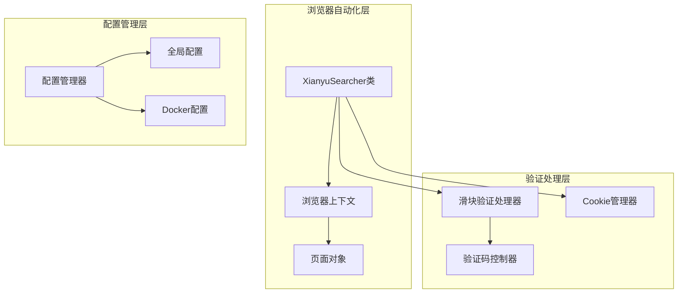
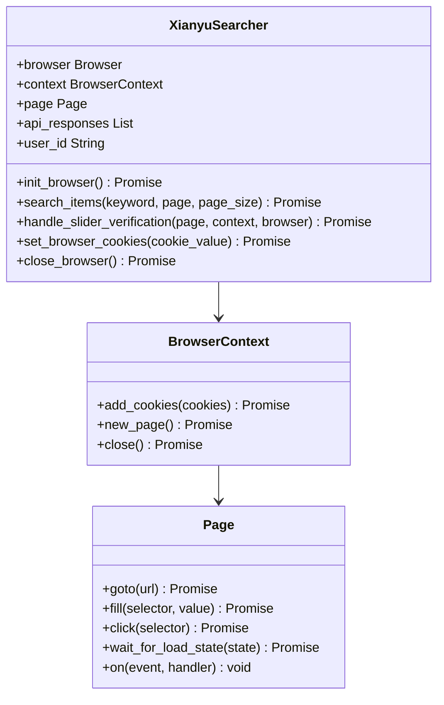
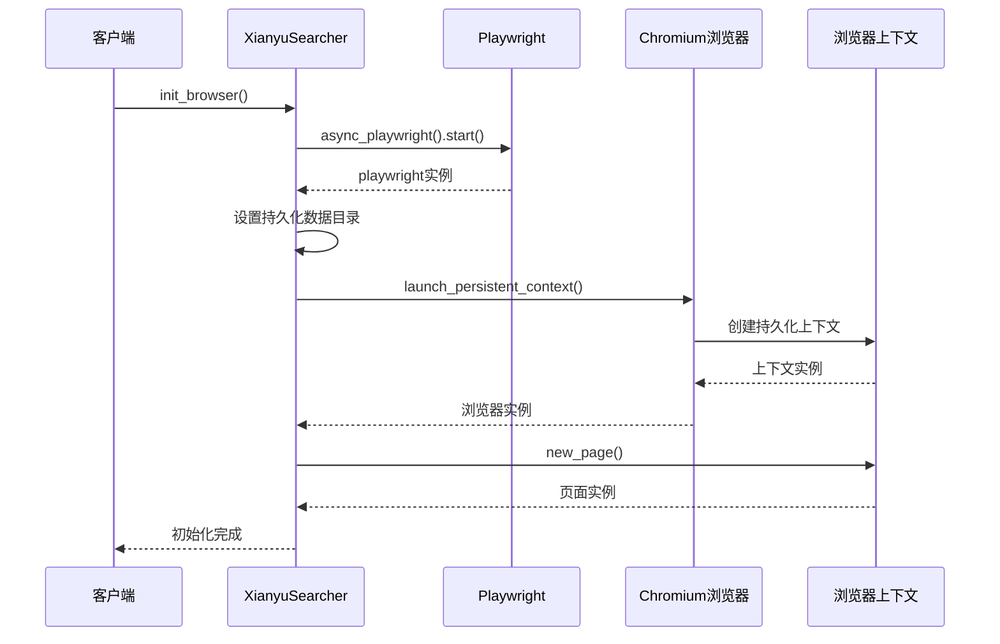
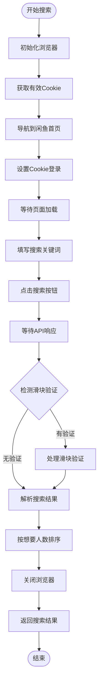
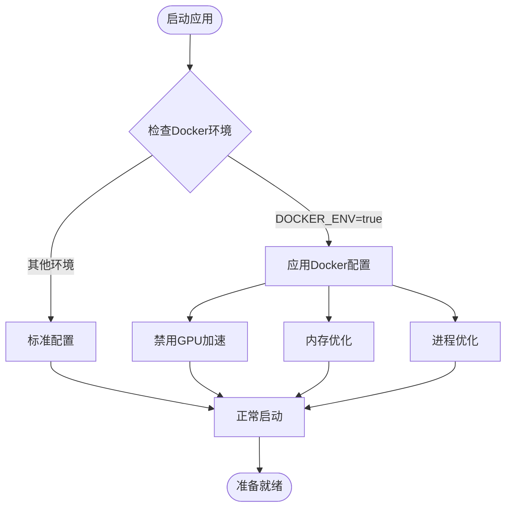
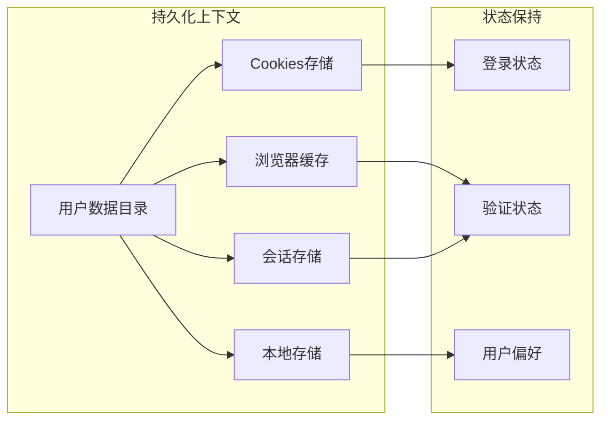
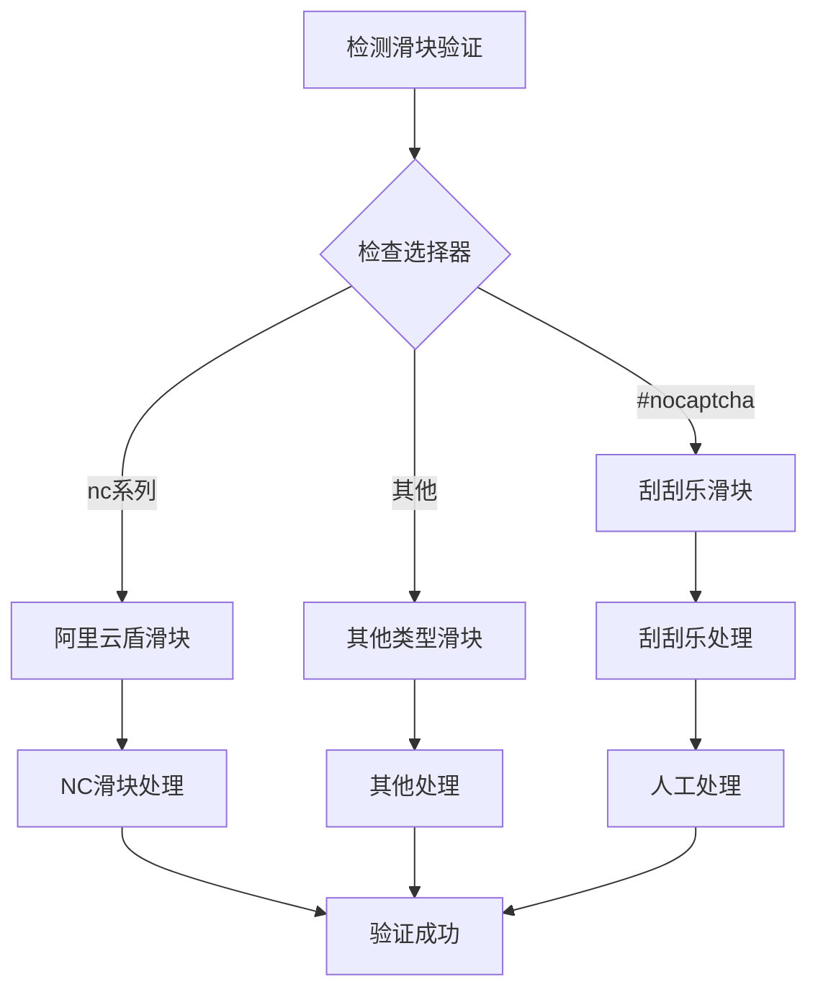
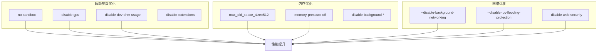

# 浏览器自动化流程

<cite>
**本文档中引用的文件**
- [item_search.py](file://utils/item_search.py)
- [xianyu_slider_stealth.py](file://utils/xianyu_slider_stealth.py)
- [config.py](file://config.py)
- [cookie_manager.py](file://cookie_manager.py)
- [global_config.yml](file://global_config.yml)
- [docker-compose.yml](file://docker-compose.yml)
</cite>

## 目录
1. [简介](#简介)
2. [项目架构概览](#项目架构概览)
3. [XianyuSearcher类详解](#xianyusearcher类详解)
4. [init_browser方法深度分析](#init_browser方法深度分析)
5. [search_items方法实现](#search_items方法实现)
6. [Docker环境特殊处理](#docker环境特殊处理)
7. [持久化上下文的重要性](#持久化上下文的重要性)
8. [滑块验证处理机制](#滑块验证处理机制)
9. [性能优化策略](#性能优化策略)
10. [故障排除指南](#故障排除指南)
11. [总结](#总结)

## 简介

本文档详细阐述了XianyuSearcher类如何利用Playwright库实现浏览器自动化，重点说明了如何通过持久化上下文保存缓存和Cookies来减少重复验证，以及在Docker环境中的特殊配置和优化策略。

## 项目架构概览

该项目采用模块化设计，主要包含以下核心组件：



**图表来源**
- [item_search.py](file://utils/item_search.py#L42-L51)
- [xianyu_slider_stealth.py](file://utils/xianyu_slider_stealth.py#L244-L270)

## XianyuSearcher类详解

XianyuSearcher类是整个浏览器自动化系统的核心，负责管理Playwright浏览器实例和执行搜索操作。

### 类结构设计



**图表来源**
- [item_search.py](file://utils/item_search.py#L42-L51)

**章节来源**
- [item_search.py](file://utils/item_search.py#L42-L51)

## init_browser方法深度分析

init_browser方法是浏览器自动化的入口点，负责创建持久化上下文以保存缓存和Cookies。

### 初始化流程



**图表来源**
- [item_search.py](file://utils/item_search.py#L685-L764)

### 关键配置参数

init_browser方法中的关键配置参数及其作用：

| 参数 | 值 | 作用 |
|------|-----|------|
| `headless` | `True` | 无头模式运行，后台执行 |
| `user_agent` | Windows Chrome UA | 模拟真实浏览器环境 |
| `viewport` | 1280x720 | 设置视口尺寸，平衡性能和兼容性 |
| `locale` | `zh-CN` | 设置语言为中文 |
| `args` | 多个启动参数 | 优化性能和稳定性 |

### 持久化数据目录

```python
# 设置持久化数据目录（保存缓存、cookies等）
import tempfile
user_data_dir = os.path.join(tempfile.gettempdir(), 'xianyu_browser_cache')
os.makedirs(user_data_dir, exist_ok=True)
logger.info(f"使用持久化数据目录（保留缓存）: {user_data_dir}")
```

**章节来源**
- [item_search.py](file://utils/item_search.py#L685-L764)

## search_items方法实现

search_items方法实现了完整的搜索流程，从初始化浏览器到执行搜索操作。

### 搜索流程



**图表来源**
- [item_search.py](file://utils/item_search.py#L768-L935)

### API响应处理

search_items方法通过监听API响应来获取真实数据：

```python
# 注册响应监听器
self.page.on("response", on_response)

# 处理特定API响应
if "h5api.m.goofish.com/h5/mtop.taobao.idlemtopsearch.pc.search" in response.url:
    # 解析JSON响应
    result_json = await response.json()
    # 处理搜索结果
    items = result_json.get("data", {}).get("resultList", [])
```

**章节来源**
- [item_search.py](file://utils/item_search.py#L768-L935)

## Docker环境特殊处理

在Docker环境中，系统进行了多项特殊配置以确保稳定运行。

### 环境检测与配置



**图表来源**
- [item_search.py](file://utils/item_search.py#L16-L32)

### Docker专用参数

Docker环境中的关键配置参数：

| 参数 | 作用 | 重要性 |
|------|------|--------|
| `--disable-gpu` | 禁用GPU加速，避免Docker环境问题 | 高 |
| `--no-sandbox` | 禁用沙盒模式 | 高 |
| `--disable-dev-shm-usage` | 避免/dev/shm空间不足 | 高 |
| `--memory-pressure-off` | 禁用内存压力检测 | 中 |
| `--max_old_space_size=512` | 限制JavaScript堆内存 | 中 |

### 事件循环优化

```python
# Docker环境中的事件循环策略
if sys.platform.startswith('linux') or os.getenv('DOCKER_ENV'):
    try:
        asyncio.set_event_loop_policy(asyncio.DefaultEventLoopPolicy())
    except Exception as e:
        logger.warning(f"设置事件循环策略失败: {e}")

# 强制使用SelectorEventLoop（在Docker中更稳定）
if os.getenv('DOCKER_ENV'):
    try:
        if hasattr(asyncio, 'SelectorEventLoop'):
            loop = asyncio.SelectorEventLoop()
            asyncio.set_event_loop(loop)
    except Exception as e:
        logger.warning(f"设置SelectorEventLoop失败: {e}")
```

**章节来源**
- [item_search.py](file://utils/item_search.py#L16-L32)

## 持久化上下文的重要性

持久化上下文是减少重复验证的关键技术，它允许浏览器在多次会话间保持状态。

### 缓存持久化机制



**图表来源**
- [item_search.py](file://utils/item_search.py#L725-L738)

### 滑块验证复用

持久化上下文使得滑块验证状态得以保存和复用：

```python
# launch_persistent_context会自动保存和加载：
# - Cookies
# - 缓存
# - LocalStorage
# - SessionStorage
# - 其他浏览器状态
```

这种设计的优势：
1. **减少验证频率**：首次验证后，后续搜索无需再次验证
2. **提升性能**：避免重复的页面加载和验证过程
3. **改善用户体验**：减少等待时间
4. **降低检测风险**：减少频繁的验证请求

**章节来源**
- [item_search.py](file://utils/item_search.py#L725-L738)

## 滑块验证处理机制

系统实现了复杂的滑块验证处理机制，支持多种类型的滑块验证。

### 验证类型识别



**图表来源**
- [item_search.py](file://utils/item_search.py#L411-L623)

### 刮刮乐验证处理

对于刮刮乐类型的滑块验证，系统提供了两种处理方式：

1. **人工处理模式**：通过远程控制界面让用户手动完成验证
2. **自动处理模式**：使用预设算法模拟人类滑动行为

```python
# 刮刮乐验证处理示例
if is_scratch_captcha:
    logger.warning("🎨 检测到刮刮乐类型滑块")
    slider_success = await self._handle_scratch_captcha_manual(
        page, max_retries=3, wait_for_completion=True
    )
```

### 验证成功率统计

系统内置了验证成功率统计机制，用于优化验证策略：

```python
# 策略统计管理器
strategy_stats.record_attempt(attempt, strategy_type, success)
stats_summary = strategy_stats.get_stats_summary()
```

**章节来源**
- [item_search.py](file://utils/item_search.py#L411-L623)

## 性能优化策略

系统采用了多层次的性能优化策略，确保高效稳定的运行。

### 浏览器启动优化



**图表来源**
- [item_search.py](file://utils/item_search.py#L699-L719)

### 并发控制

系统实现了智能的并发控制机制：

```python
# 并发管理器配置
SLIDER_MAX_CONCURRENT = 3  # 最大并发数
SLIDER_WAIT_TIMEOUT = 60   # 等待超时时间
```

### 缓存策略

```python
# 多级缓存策略
# 1. 浏览器缓存（持久化）
# 2. API响应缓存
# 3. 结果数据缓存
# 4. Cookie缓存
```

**章节来源**
- [config.py](file://config.py#L100-L103)

## 故障排除指南

### 常见问题及解决方案

| 问题类型 | 症状 | 解决方案 |
|----------|------|----------|
| 浏览器启动失败 | `Executable doesn't exist` | 运行 `playwright install chromium` |
| Docker权限问题 | 权限拒绝错误 | 检查Docker用户权限设置 |
| 内存不足 | 进程被杀死 | 调整Docker内存限制 |
| 验证失败 | 滑块验证频繁出现 | 检查Cookie有效性 |
| 网络超时 | 请求超时错误 | 增加超时时间配置 |

### 日志分析

系统提供了详细的日志记录，便于问题诊断：

```python
# 关键日志级别
logger.info("浏览器启动成功")
logger.warning("检测到滑块验证")
logger.error("滑块验证失败")
```

### 性能监控

```python
# 性能指标监控
# - 浏览器启动时间
# - 搜索响应时间
# - 验证成功率
# - 错误率统计
```

**章节来源**
- [item_search.py](file://utils/item_search.py#L920-L935)

## 总结

XianyuSearcher类通过Playwright库实现了高效的浏览器自动化，主要特点包括：

1. **持久化上下文**：通过保存缓存和Cookies显著减少重复验证
2. **Docker优化**：针对容器环境进行了专门的配置和优化
3. **智能验证处理**：支持多种类型的滑块验证，包括人工和自动处理
4. **性能优化**：多层次的性能优化策略确保高效运行
5. **故障恢复**：完善的错误处理和恢复机制

这种设计不仅提高了系统的稳定性和效率，还降低了被检测的风险，为闲鱼商品搜索提供了可靠的技术支撑。