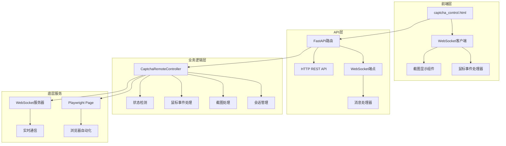
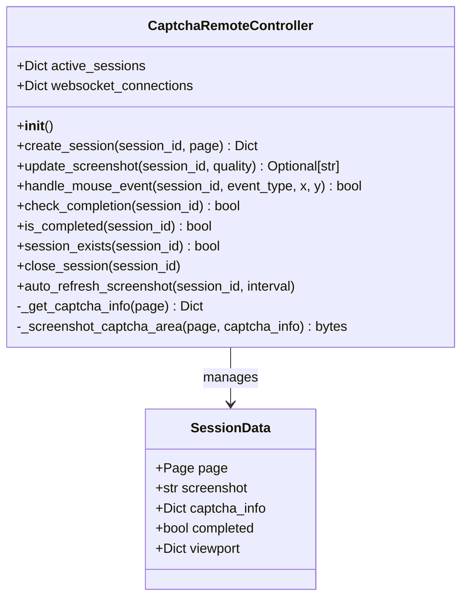
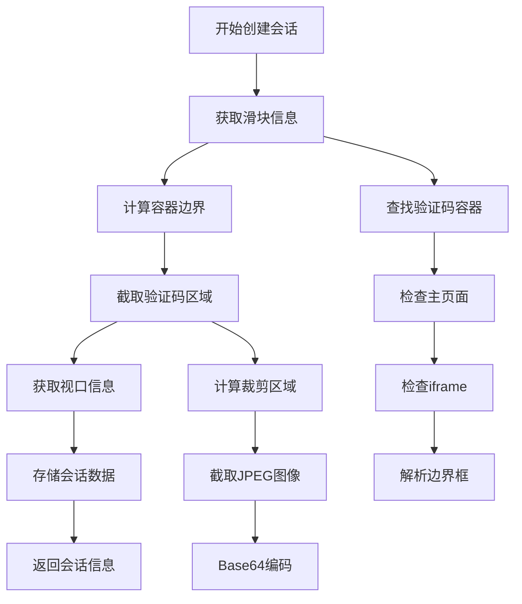
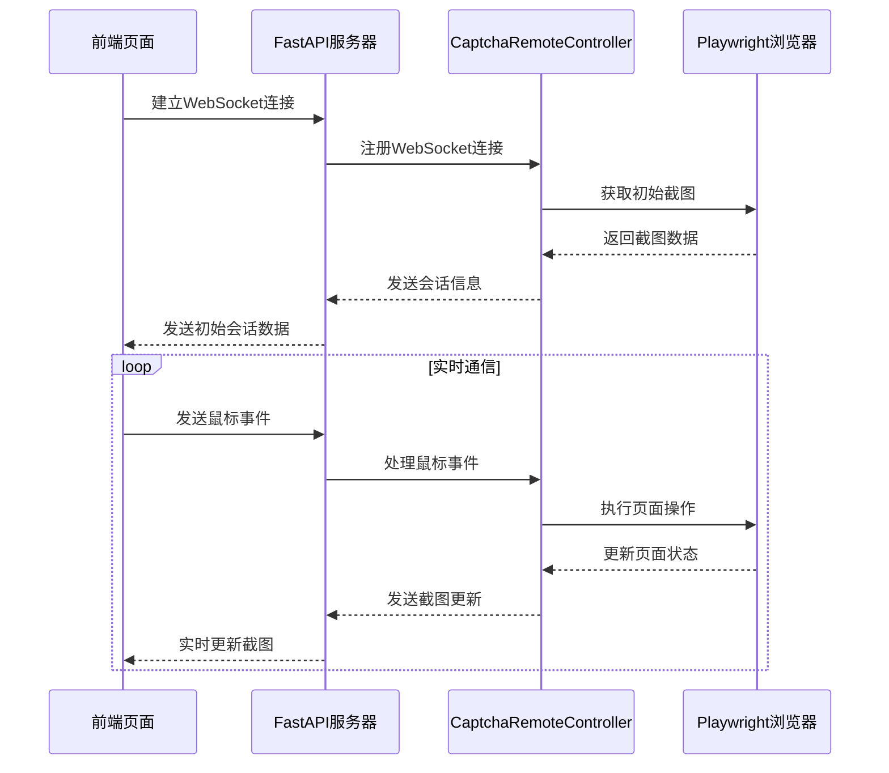
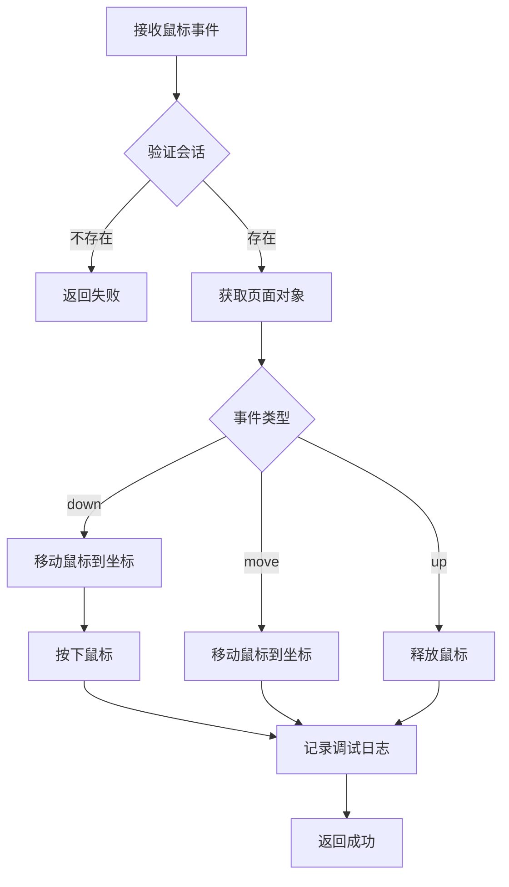
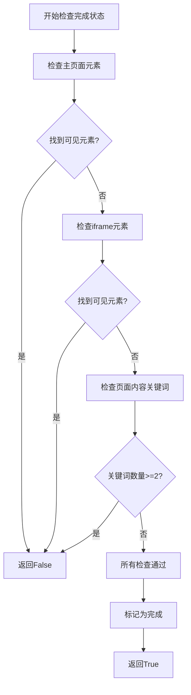
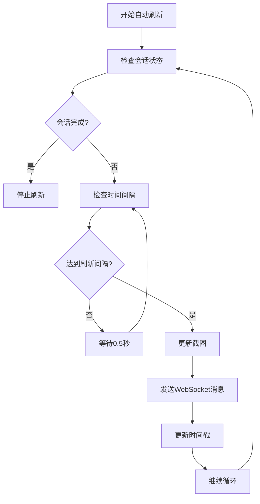
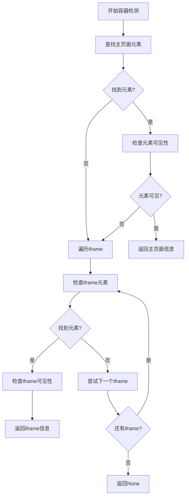

# 刮刮乐人工验证系统详细文档

<cite>
**本文档引用的文件**
- [utils/captcha_remote_control.py](file://utils/captcha_remote_control.py)
- [api_captcha_remote.py](file://api_captcha_remote.py)
- [captcha_control.html](file://captcha_control.html)
- [utils/ws_utils.py](file://utils/ws_utils.py)
- [XianyuAutoAsync.py](file://XianyuAutoAsync.py)
- [config.py](file://config.py)
- [Start.py](file://Start.py)
</cite>

## 目录
1. [系统概述](#系统概述)
2. [核心架构](#核心架构)
3. [CaptchaRemoteController类详解](#captcharemotecontroller类详解)
4. [会话管理系统](#会话管理系统)
5. [WebSocket实时通信](#websocket实时通信)
6. [鼠标事件处理机制](#鼠标事件处理机制)
7. [验证码完成状态检测](#验证码完成状态检测)
8. [性能优化策略](#性能优化策略)
9. [错误处理与最佳实践](#错误处理与最佳实践)
10. [部署与配置](#部署与配置)

## 系统概述

刮刮乐人工验证系统是一个基于Web的远程验证码控制系统，通过WebSocket实现实时通信，允许人工操作Playwright浏览器中的滑块验证码。该系统采用前后端分离架构，前端提供直观的图形界面，后端负责页面自动化和会话管理。

### 主要特性

- **实时截图传输**：通过WebSocket将页面截图实时传输到前端
- **精确鼠标映射**：将前端鼠标操作精确映射到Playwright页面对象
- **智能状态检测**：通过多选择器轮询和页面内容分析判断验证状态
- **性能优化**：采用自适应刷新策略和iframe兼容性检测
- **错误恢复**：完善的会话管理和超时处理机制

## 核心架构

系统采用模块化设计，主要包含以下核心组件：

**图表来源**
- [utils/captcha_remote_control.py](file://utils/captcha_remote_control.py#L14-L369)
- [api_captcha_remote.py](file://api_captcha_remote.py#L1-L319)
- [captcha_control.html](file://captcha_control.html#L1-L572)

## CaptchaRemoteController类详解

CaptchaRemoteController是系统的核心控制器类，负责管理所有远程验证码会话的生命周期。

### 类结构概览

**图表来源**
- [utils/captcha_remote_control.py](file://utils/captcha_remote_control.py#L14-L369)

### 核心属性说明

| 属性名 | 类型 | 描述 |
|--------|------|------|
| active_sessions | Dict[str, Dict] | 存储活跃会话的数据，键为session_id，值为会话详细信息 |
| websocket_connections | Dict[str, WebSocket] | 存储活跃WebSocket连接，键为session_id |

**章节来源**
- [utils/captcha_remote_control.py](file://utils/captcha_remote_control.py#L17-L19)

## 会话管理系统

### create_session方法详解

create_session方法是会话创建的核心入口，负责捕获滑块容器的精确位置并生成包含截图和坐标信息的会话数据。

#### 执行流程

**图表来源**
- [utils/captcha_remote_control.py](file://utils/captcha_remote_control.py#L21-L64)

#### 关键实现细节

1. **滑块容器定位**：通过多个CSS选择器优先查找验证码容器
2. **边界计算**：为验证码容器添加10像素边距以确保完整性
3. **截图优化**：仅截取验证码相关区域而非整个页面
4. **视口适配**：动态获取页面视口信息用于坐标转换

**章节来源**
- [utils/captcha_remote_control.py](file://utils/captcha_remote_control.py#L21-L64)

### 会话数据结构

每个会话包含以下关键信息：

| 字段名 | 类型 | 描述 |
|--------|------|------|
| page | Page | Playwright页面对象 |
| screenshot | str | Base64编码的截图 |
| captcha_info | Dict | 验证码容器信息（坐标、尺寸等） |
| completed | bool | 验证完成状态 |
| viewport | Dict | 页面视口信息 |

**章节来源**
- [utils/captcha_remote_control.py](file://utils/captcha_remote_control.py#L48-L55)

## WebSocket实时通信

### 连接建立与消息处理

系统通过WebSocket实现实时双向通信，前端通过control_url接入并接收实时截图更新。

#### 连接流程

**图表来源**
- [api_captcha_remote.py](file://api_captcha_remote.py#L38-L156)
- [captcha_control.html](file://captcha_control.html#L380-L418)

### 消息类型定义

系统支持多种消息类型：

| 消息类型 | 方向 | 描述 |
|----------|------|------|
| session_info | 服务器→客户端 | 初始会话信息 |
| mouse_event | 客户端→服务器 | 鼠标操作事件 |
| screenshot_update | 服务器→客户端 | 截图更新通知 |
| completed | 服务器→客户端 | 验证完成通知 |
| error | 服务器→客户端 | 错误信息 |
| pong | 客户端→服务器 | 心跳响应 |

**章节来源**
- [api_captcha_remote.py](file://api_captcha_remote.py#L38-L156)

## 鼠标事件处理机制

### handle_mouse_event方法实现

handle_mouse_event方法将前端的鼠标操作精确映射回Playwright的page.mouse操作，支持down、move、up三种事件类型。

#### 事件映射流程

**图表来源**
- [utils/captcha_remote_control.py](file://utils/captcha_remote_control.py#L197-L238)

#### 坐标转换机制

前端鼠标坐标需要转换为页面实际坐标：

1. **相对坐标计算**：根据canvas边界框计算相对坐标
2. **偏移量应用**：加上验证码容器的页面偏移量
3. **精度保证**：使用Math.round确保坐标精度

**章节来源**
- [utils/captcha_remote_control.py](file://utils/captcha_remote_control.py#L197-L238)

### 性能优化措施

- **事件节流**：前端使用5毫秒节流间隔避免过度发送
- **条件更新**：仅在鼠标按下或移动时更新截图
- **质量优化**：根据操作类型调整截图质量

**章节来源**
- [captcha_control.html](file://captcha_control.html#L514-L567)

## 验证码完成状态检测

### check_completion方法详解

check_completion方法通过多选择器轮询和页面内容分析来智能判断验证是否成功，采用多重检查机制确保准确性。

#### 检测策略

**图表来源**
- [utils/captcha_remote_control.py](file://utils/captcha_remote_control.py#L240-L316)

#### 多选择器检测

系统使用多个CSS选择器进行检测：

| 选择器 | 用途 |
|--------|------|
| #nocaptcha | 主页面验证码容器 |
| #scratch-captcha-btn | 刮刮乐按钮 |
| .scratch-captcha-container | 刮刮乐容器 |
| .scratch-captcha-slider | 刮刮乐滑块 |

#### 页面内容分析

除了元素检测，系统还会分析页面内容：

- **关键词匹配**：检查页面中是否包含滑块相关关键词
- **数量统计**：统计关键词出现次数，避免误判
- **内容过滤**：排除无关内容，专注于验证相关元素

**章节来源**
- [utils/captcha_remote_control.py](file://utils/captcha_remote_control.py#L240-L316)

## 性能优化策略

### 自动刷新截图优化

系统实现了智能的自动刷新策略，根据会话状态动态调整刷新频率。

#### 优化算法

**图表来源**
- [utils/captcha_remote_control.py](file://utils/captcha_remote_control.py#L334-L364)

#### 性能优化措施

1. **自适应刷新**：空闲时降低刷新频率，活动时提高频率
2. **质量调节**：根据操作类型调整截图质量
3. **按需更新**：仅在必要时触发截图更新
4. **资源清理**：及时清理无效连接和会话

**章节来源**
- [utils/captcha_remote_control.py](file://utils/captcha_remote_control.py#L334-L364)

### iframe兼容性检测

系统具备强大的iframe兼容性检测能力：

#### 检测流程

**图表来源**
- [utils/captcha_remote_control.py](file://utils/captcha_remote_control.py#L98-L158)

**章节来源**
- [utils/captcha_remote_control.py](file://utils/captcha_remote_control.py#L98-L158)

## 错误处理与最佳实践

### 会话超时处理

系统提供了完善的会话超时和错误恢复机制：

#### 超时检测

| 场景 | 超时时间 | 处理策略 |
|------|----------|----------|
| WebSocket连接 | 无固定超时 | 心跳检测 |
| 验证等待 | 3分钟 | 强制中断 |
| 页面操作 | 无固定超时 | 异常捕获 |
| 截图获取 | 无固定超时 | 降级处理 |

#### 错误恢复策略

1. **连接重试**：WebSocket连接断开时自动重连
2. **降级方案**：截图失败时使用全页面截图
3. **状态清理**：异常情况下清理相关资源
4. **日志记录**：详细记录错误信息便于调试

**章节来源**
- [api_captcha_remote.py](file://api_captcha_remote.py#L142-L156)
- [utils/captcha_remote_control.py](file://utils/captcha_remote_control.py#L334-L364)

### 最佳实践建议

#### 开发者指南

1. **会话管理**
   - 始终检查会话存在性
   - 及时清理完成的会话
   - 处理并发会话冲突

2. **错误处理**
   - 捕获所有异步异常
   - 提供有意义的错误信息
   - 实现优雅降级

3. **性能优化**
   - 合理设置刷新频率
   - 使用适当的截图质量
   - 及时释放不需要的资源

4. **安全性考虑**
   - 验证会话ID合法性
   - 限制并发连接数
   - 实施适当的访问控制

**章节来源**
- [utils/captcha_remote_control.py](file://utils/captcha_remote_control.py#L318-L333)

## 部署与配置

### 系统要求

- Python 3.8+
- Playwright浏览器
- FastAPI框架
- WebSocket支持

### 配置选项

系统通过global_config.yml文件进行配置，主要配置项包括：

| 配置项 | 默认值 | 描述 |
|--------|--------|------|
| SLIDER_VERIFICATION.max_concurrent | 3 | 最大并发验证数 |
| SLIDER_VERIFICATION.wait_timeout | 60 | 等待超时时间（秒） |
| API_ENDPOINTS | {} | API端点配置 |
| APP_CONFIG | {} | 应用程序配置 |

**章节来源**
- [config.py](file://config.py#L1-L126)
- [Start.py](file://Start.py#L1-L200)

### 启动流程

系统启动时会执行以下步骤：

1. **数据库迁移**：检查并迁移数据库文件
2. **Playwright检查**：验证浏览器安装状态
3. **FastAPI启动**：启动Web服务器
4. **服务注册**：注册各种服务组件

**章节来源**
- [Start.py](file://Start.py#L62-L200)

### 前端部署

前端页面通过FastAPI静态文件服务提供：

- **控制页面**：`/api/captcha/control`
- **会话页面**：`/api/captcha/control/{session_id}`
- **API接口**：RESTful API和WebSocket端点

**章节来源**
- [api_captcha_remote.py](file://api_captcha_remote.py#L278-L319)

## 总结

刮刮乐人工验证系统是一个功能完善、性能优化的远程验证码控制系统。通过CaptchaRemoteController类的精心设计，系统实现了：

- **精确的会话管理**：完整的生命周期管理和状态跟踪
- **高效的实时通信**：基于WebSocket的低延迟交互
- **智能的状态检测**：多维度验证完成判断
- **优秀的性能表现**：自适应优化和资源管理
- **可靠的错误处理**：完善的异常恢复机制

该系统为自动化测试和人工验证提供了强大而灵活的解决方案，特别适用于复杂的Web应用程序验证码处理场景。