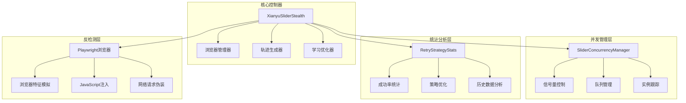
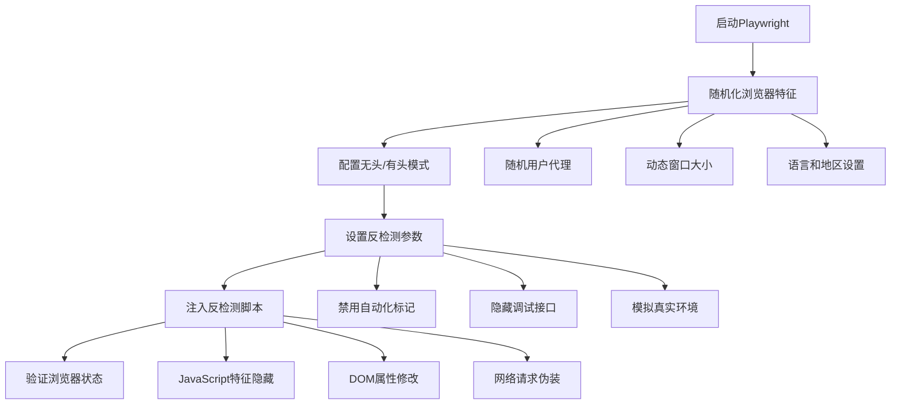
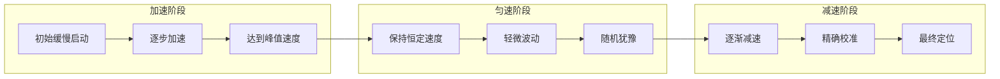
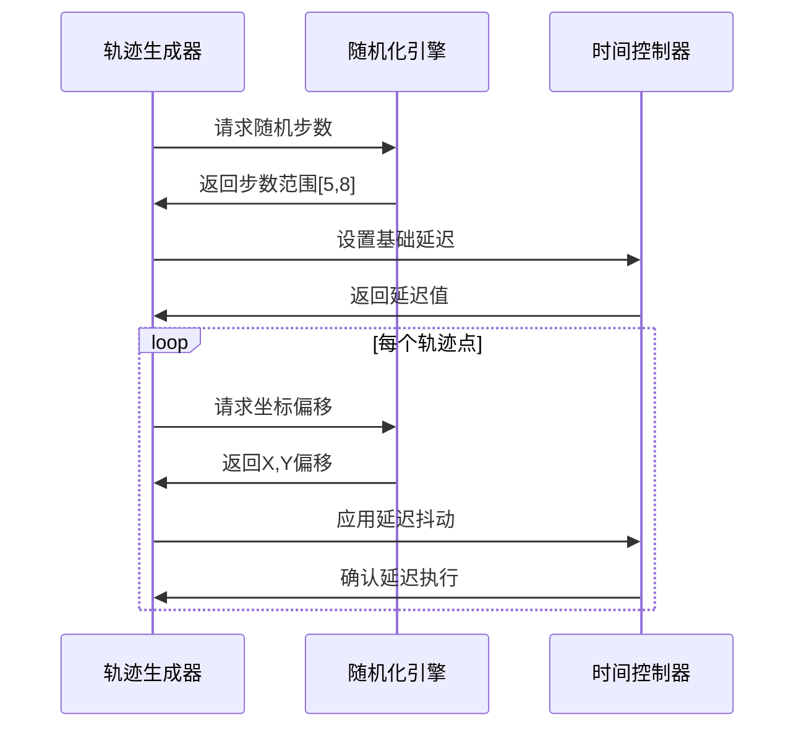
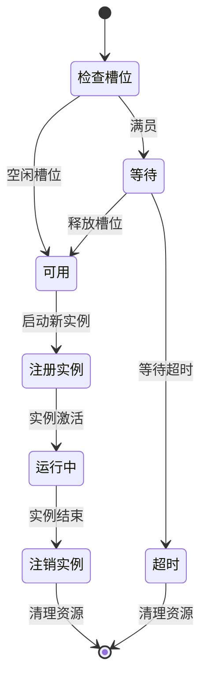
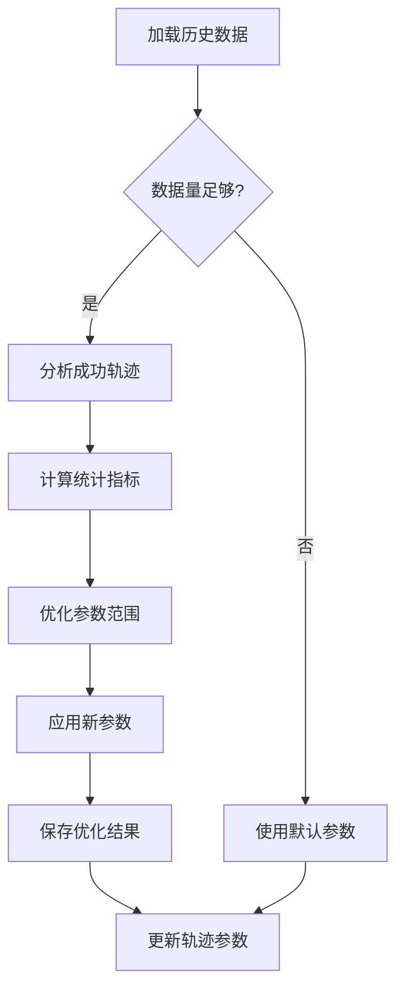
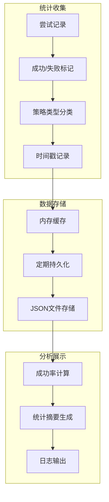
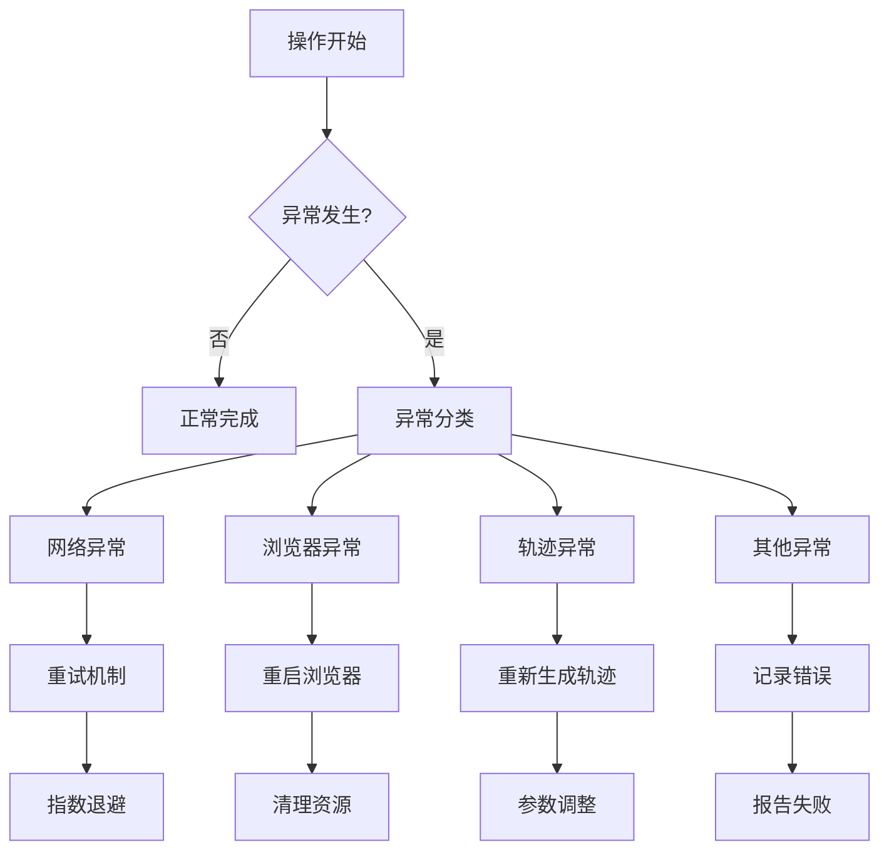

# 标准滑块自动化破解技术详解

<cite>
**本文档引用的文件**
- [xianyu_slider_stealth.py](file://utils/xianyu_slider_stealth.py)
- [slider_patch.py](file://utils/slider_patch.py)
- [config.py](file://config.py)
- [refresh_util.py](file://utils/refresh_util.py)
</cite>

## 目录
1. [项目概述](#项目概述)
2. [核心架构设计](#核心架构设计)
3. [浏览器初始化与反检测](#浏览器初始化与反检测)
4. [轨迹生成算法](#轨迹生成算法)
5. [并发管理机制](#并发管理机制)
6. [学习模式与参数优化](#学习模式与参数优化)
7. [策略统计与成功率分析](#策略统计与成功率分析)
8. [异常处理与恢复机制](#异常处理与恢复机制)
9. [参数调优指南](#参数调优指南)
10. [最佳实践与故障排除](#最佳实践与故障排除)

## 项目概述

XianyuSliderStealth是一个专为闲鱼、淘宝、阿里平台设计的滑块验证码自动化破解解决方案。该系统采用基于Playwright同步API的浏览器自动化技术，结合先进的反检测算法和机器学习优化策略，实现了高成功率的滑块验证自动化。

### 核心特性

- **多层反检测技术**：模拟真实浏览器环境，隐藏自动化特征
- **智能轨迹生成**：基于物理模型和人类行为学的轨迹算法
- **自适应学习模式**：基于历史成功数据的参数优化
- **并发控制管理**：防止触发平台风控系统的并发限制
- **策略统计分析**：实时监控和优化破解成功率

## 核心架构设计

系统采用模块化架构设计，主要包含以下核心组件：

**图表来源**
- [xianyu_slider_stealth.py](file://utils/xianyu_slider_stealth.py#L244-L298)
- [slider_patch.py](file://utils/slider_patch.py#L166-L240)

**章节来源**
- [xianyu_slider_stealth.py](file://utils/xianyu_slider_stealth.py#L244-L298)

## 浏览器初始化与反检测

### 无头模式配置与反检测参数

系统通过精心设计的浏览器配置实现高度逼真的浏览器模拟：

**图表来源**
- [xianyu_slider_stealth.py](file://utils/xianyu_slider_stealth.py#L325-L452)

### 关键反检测技术实现

系统实现了多层次的反检测机制：

1. **浏览器特征随机化**：动态生成不同的浏览器配置
2. **自动化标记隐藏**：彻底移除所有自动化检测特征
3. **JavaScript环境模拟**：创建真实的浏览器运行环境
4. **网络请求伪装**：模拟正常的网络行为模式

**章节来源**
- [xianyu_slider_stealth.py](file://utils/xianyu_slider_stealth.py#L325-L452)

## 轨迹生成算法

### 多阶段滑动策略

系统采用先进的多阶段轨迹生成算法，模拟真实人类的滑动行为：

**图表来源**
- [xianyu_slider_stealth.py](file://utils/xianyu_slider_stealth.py#L1200-L1235)

### 核心算法参数

系统提供了丰富的参数控制选项：

| 参数类别 | 参数名称 | 默认范围 | 优化目标 |
|---------|---------|---------|---------|
| 时间控制 | 基础延迟 | 0.0002-0.0005秒 | 极速模式 |
| 步数控制 | 总步数 | 5-8步 | 减少轨迹点 |
| 抖动控制 | X轴抖动 | 0-1像素 | 极小抖动 |
| 抖动控制 | Y轴抖动 | 0-1像素 | 极小抖动 |
| 加速因子 | 加速系数 | 10-15倍 | 超快加速 |

### 随机步数控制与延迟抖动

系统实现了精密的随机化控制机制：

**图表来源**
- [xianyu_slider_stealth.py](file://utils/xianyu_slider_stealth.py#L1200-L1235)

**章节来源**
- [xianyu_slider_stealth.py](file://utils/xianyu_slider_stealth.py#L1200-L1235)

## 并发管理机制

### SliderConcurrencyManager设计

系统实现了高效的并发控制机制，防止触发平台风控：

**图表来源**
- [xianyu_slider_stealth.py](file://utils/xianyu_slider_stealth.py#L35-L142)

### 信号量控制与全局并发限制

系统通过信号量机制严格控制全局并发实例数量：

- **最大并发数**：默认3个实例，可通过配置调整
- **等待超时**：默认60秒，防止无限等待
- **队列管理**：先进先出的等待队列机制
- **动态调整**：支持运行时调整并发限制

**章节来源**
- [xianyu_slider_stealth.py](file://utils/xianyu_slider_stealth.py#L35-L142)

## 学习模式与参数优化

### 基于历史数据的参数优化

系统实现了智能的学习模式，能够基于历史成功轨迹自动优化参数：

**图表来源**
- [xianyu_slider_stealth.py](file://utils/xianyu_slider_stealth.py#L553-L646)

### 参数优化策略

系统采用统计学方法进行参数优化：

1. **步数范围优化**：基于成功轨迹的步数分布
2. **延迟参数调整**：计算最优的延迟范围
3. **抖动参数优化**：确定合适的抖动范围
4. **加速因子调节**：优化加速和减速参数

**章节来源**
- [xianyu_slider_stealth.py](file://utils/xianyu_slider_stealth.py#L553-L646)

## 策略统计与成功率分析

### RetryStrategyStats实现机制

系统提供了完善的策略统计功能，实时监控破解成功率：

**图表来源**
- [xianyu_slider_stealth.py](file://utils/xianyu_slider_stealth.py#L146-L241)

### 成功率统计功能

系统支持多种策略的成功率统计：

| 策略类型 | 尝试次数 | 成功率阈值 | 优化目标 |
|---------|---------|-----------|---------|
| 默认策略 | 1次 | 基础成功率 | 快速验证 |
| 谨慎策略 | 2次 | 中等成功率 | 稳定验证 |
| 急躁策略 | 3次 | 较高成功率 | 高效验证 |
| 缓慢策略 | 3次 | 最高成功率 | 精确验证 |

**章节来源**
- [xianyu_slider_stealth.py](file://utils/xianyu_slider_stealth.py#L146-L241)

## 异常处理与恢复机制

### 多层次异常处理

系统实现了完善的异常处理和恢复机制：

**图表来源**
- [xianyu_slider_stealth.py](file://utils/xianyu_slider_stealth.py#L2400-L2411)

### 资源清理与保护机制

系统确保在异常情况下正确清理资源：

1. **浏览器资源清理**：自动关闭浏览器实例
2. **临时文件管理**：清理临时目录和文件
3. **并发实例注销**：及时释放并发槽位
4. **异常捕获保护**：防止异常传播影响系统稳定性

**章节来源**
- [xianyu_slider_stealth.py](file://utils/xianyu_slider_stealth.py#L2400-L2411)

## 参数调优指南

### 核心参数配置建议

根据不同的使用场景，推荐以下参数配置：

#### 高速模式（默认）
- **最大并发数**：3-5个实例
- **等待超时**：30-60秒
- **轨迹步数**：5-8步
- **基础延迟**：0.0002-0.0005秒

#### 稳定模式（生产环境）
- **最大并发数**：1-2个实例
- **等待超时**：60-120秒
- **轨迹步数**：110-130步
- **基础延迟**：0.022-0.027秒

#### 学习模式（优化阶段）
- **启用学习**：True
- **历史记录**：保存最近100条成功记录
- **参数调整**：基于统计学方法自动优化

### 性能优化建议

1. **网络环境优化**：使用稳定的网络连接
2. **硬件配置**：确保足够的CPU和内存资源
3. **并发控制**：根据平台限制调整并发数
4. **监控告警**：建立成功率监控机制

## 最佳实践与故障排除

### 常见问题解决

#### 滑块验证失败
- **检查网络连接**：确保网络稳定
- **调整并发数**：降低并发实例数量
- **更新浏览器**：使用最新版本的Chrome浏览器
- **检查参数**：验证轨迹参数设置

#### 浏览器启动失败
- **检查依赖**：确保Playwright依赖正确安装
- **权限问题**：检查文件系统权限
- **资源限制**：增加系统资源限制
- **清理缓存**：删除浏览器缓存数据

#### 学习模式失效
- **数据完整性**：检查历史数据文件
- **参数范围**：验证参数范围合理性
- **统计样本**：确保有足够的成功样本
- **文件权限**：检查文件读写权限

### 监控与维护

建议建立以下监控指标：

1. **成功率监控**：实时跟踪破解成功率
2. **并发使用率**：监控并发实例使用情况
3. **异常率统计**：跟踪各类异常的发生频率
4. **性能指标**：监控响应时间和资源使用

通过合理的参数配置和持续的优化，XianyuSliderStealth能够实现高成功率的滑块验证码自动化破解，为自动化业务提供可靠的技术支撑。