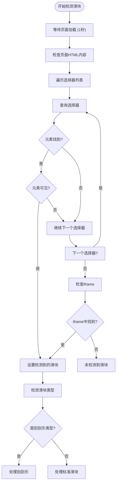
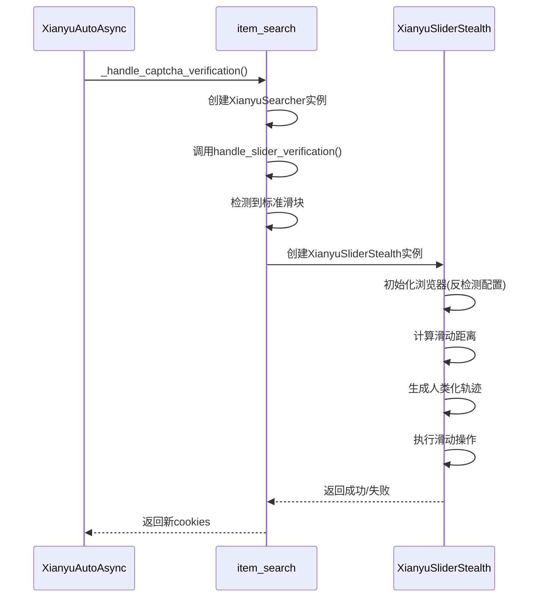
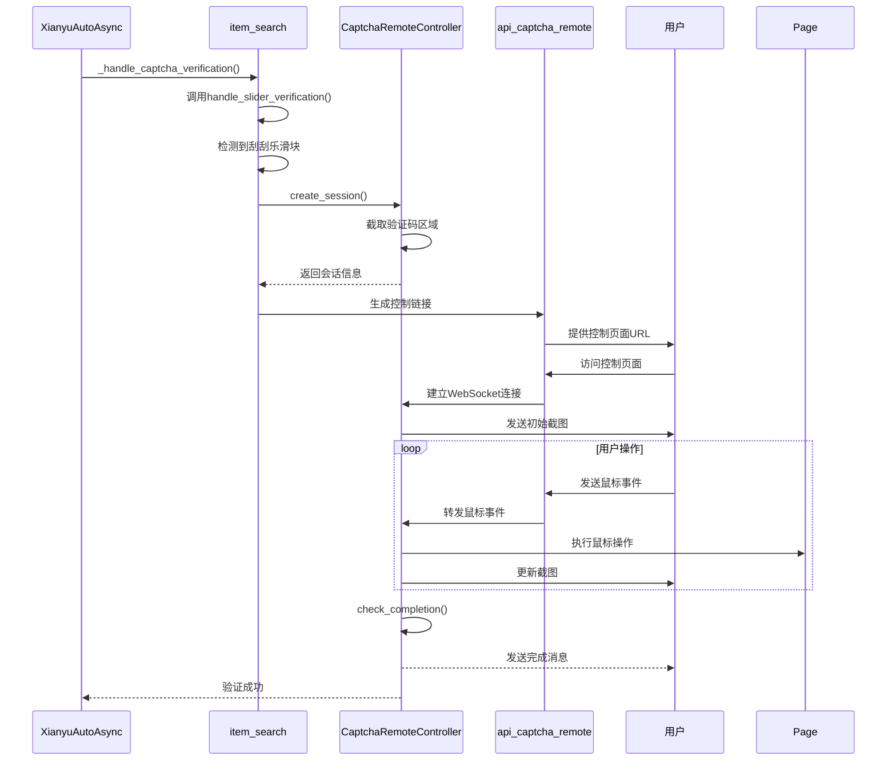
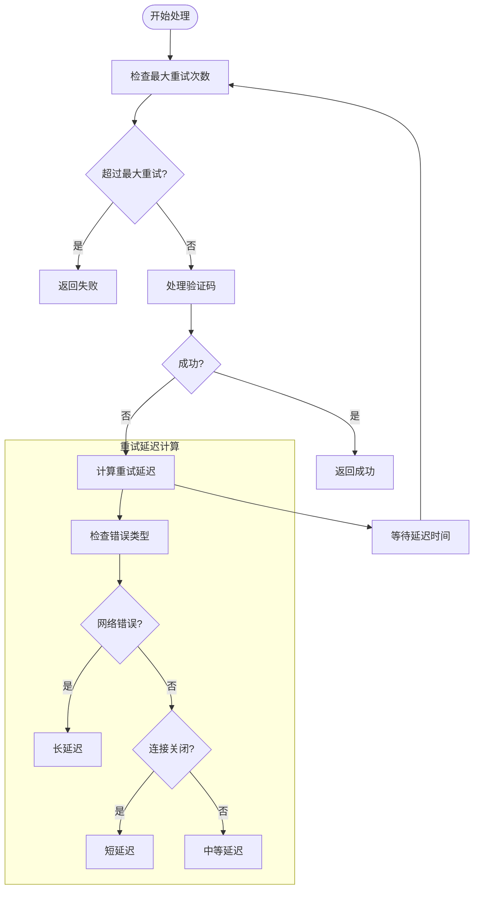
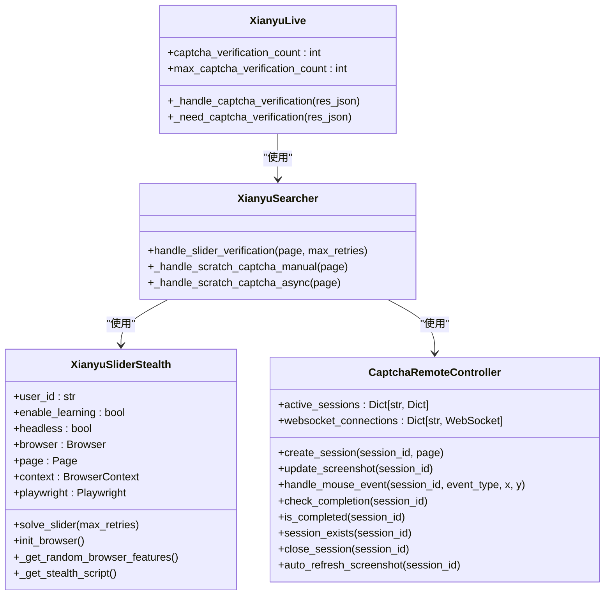
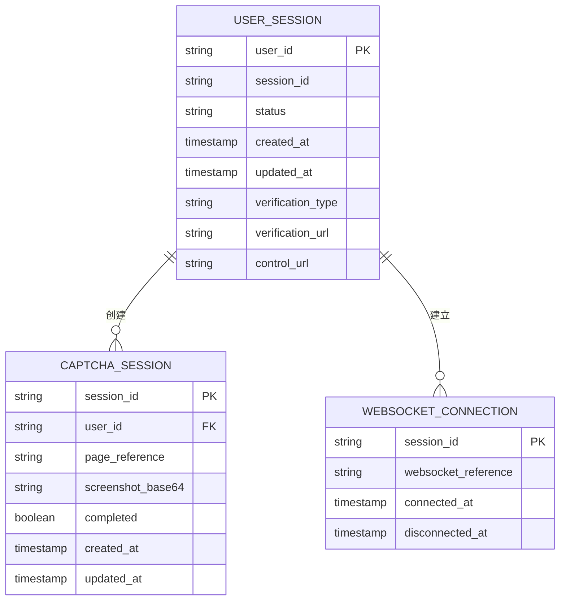

# 验证码处理机制

<cite>
**本文档引用的文件**   
- [xianyu_slider_stealth.py](file://utils/xianyu_slider_stealth.py)
- [captcha_remote_control.py](file://utils/captcha_remote_control.py)
- [api_captcha_remote.py](file://api_captcha_remote.py)
- [item_search.py](file://utils/item_search.py)
- [XianyuAutoAsync.py](file://XianyuAutoAsync.py)
</cite>

## 目录
1. [引言](#引言)
2. [验证码检测与类型识别](#验证码检测与类型识别)
3. [标准滑块处理机制](#标准滑块处理机制)
4. [刮刮乐滑块处理机制](#刮刮乐滑块处理机制)
5. [重试机制与超时处理](#重试机制与超时处理)
6. [状态监控与会话管理](#状态监控与会话管理)
7. [扩展与分布式环境](#扩展与分布式环境)

## 引言
本系统设计了一套完整的验证码处理机制，旨在应对闲鱼平台上的两种主要滑块验证码：标准滑块和刮刮乐滑块。系统通过多选择器策略和iframe检测来精确识别验证码类型，并采用不同的处理策略。对于标准滑块，系统集成了XianyuSliderStealth进行自动化破解；对于刮刮乐滑块，系统通过远程控制会话生成控制链接，支持用户在网页上手动完成验证。该机制结合了重试、超时处理和状态监控，确保了高可靠性和用户体验。

## 验证码检测与类型识别
系统通过`handle_slider_verification`方法实现对两种滑块验证码的检测和处理。该方法首先使用多选择器策略在主页面和iframe中搜索滑块元素，以确保不遗漏任何可能的验证码。

**图源**
- [item_search.py](file://utils/item_search.py#L411-L623)

**本节源**
- [item_search.py](file://utils/item_search.py#L411-L623)

## 标准滑块处理机制
对于标准滑块，系统集成XianyuSliderStealth进行自动化破解。XianyuSliderStealth是一个增强反检测版本的滑块验证工具，它通过模拟人类行为来绕过平台的检测机制。

**图源**
- [xianyu_slider_stealth.py](file://utils/xianyu_slider_stealth.py#L244-L703)
- [item_search.py](file://utils/item_search.py#L569-L593)

**本节源**
- [xianyu_slider_stealth.py](file://utils/xianyu_slider_stealth.py#L244-L703)
- [item_search.py](file://utils/item_search.py#L569-L593)

## 刮刮乐滑块处理机制
对于刮刮乐滑块，系统采用远程控制会话的方式，通过WebSocket实时传输页面截图到前端，支持用户手动完成验证。

**图源**
- [captcha_remote_control.py](file://utils/captcha_remote_control.py#L14-L368)
- [api_captcha_remote.py](file://api_captcha_remote.py#L38-L156)
- [item_search.py](file://utils/item_search.py#L52-L150)

**本节源**
- [captcha_remote_control.py](file://utils/captcha_remote_control.py#L14-L368)
- [api_captcha_remote.py](file://api_captcha_remote.py#L38-L156)
- [item_search.py](file://utils/item_search.py#L52-L150)

## 重试机制与超时处理
系统实现了完善的重试机制和超时处理，确保在各种异常情况下都能正确处理。

**图源**
- [XianyuAutoAsync.py](file://XianyuAutoAsync.py#L453-L465)
- [XianyuAutoAsync.py](file://XianyuAutoAsync.py#L1302-L1306)

**本节源**
- [XianyuAutoAsync.py](file://XianyuAutoAsync.py#L453-L465)
- [XianyuAutoAsync.py](file://XianyuAutoAsync.py#L1302-L1306)

## 状态监控与会话管理
系统通过多种机制实现状态监控和会话管理，确保系统的稳定运行。

**图源**
- [captcha_remote_control.py](file://utils/captcha_remote_control.py#L14-L368)
- [xianyu_slider_stealth.py](file://utils/xianyu_slider_stealth.py#L244-L703)
- [XianyuAutoAsync.py](file://XianyuAutoAsync.py#L711-L713)
- [item_search.py](file://utils/item_search.py#L411-L623)

**本节源**
- [captcha_remote_control.py](file://utils/captcha_remote_control.py#L14-L368)
- [xianyu_slider_stealth.py](file://utils/xianyu_slider_stealth.py#L244-L703)
- [XianyuAutoAsync.py](file://XianyuAutoAsync.py#L711-L713)
- [item_search.py](file://utils/item_search.py#L411-L623)

## 扩展与分布式环境
系统设计考虑了扩展性和分布式环境下的会话管理。通过全局实例管理和并发控制，确保在多用户环境下稳定运行。

**图源**
- [XianyuAutoAsync.py](file://XianyuAutoAsync.py#L172-L185)
- [captcha_remote_control.py](file://utils/captcha_remote_control.py#L18-L19)

**本节源**
- [XianyuAutoAsync.py](file://XianyuAutoAsync.py#L172-L185)
- [captcha_remote_control.py](file://utils/captcha_remote_control.py#L18-L19)