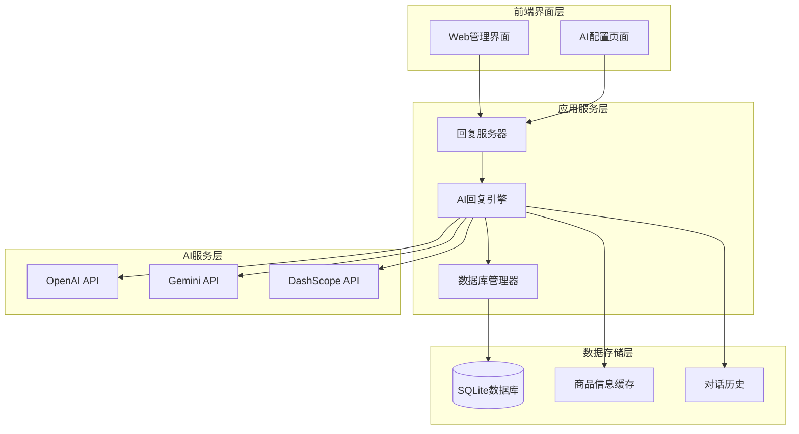
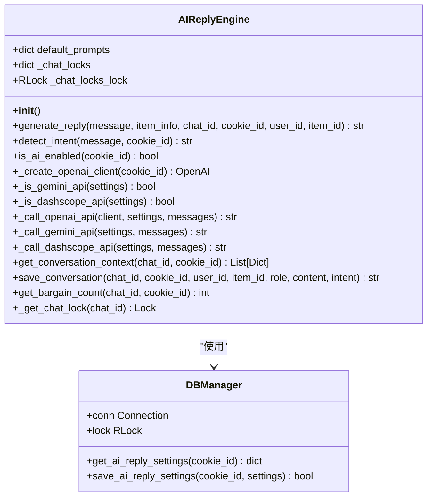
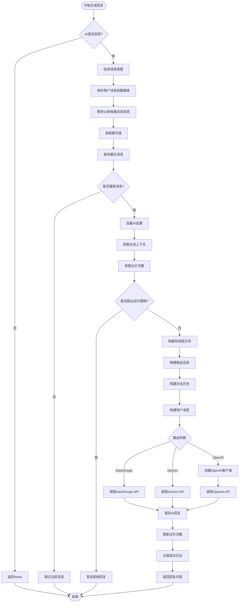
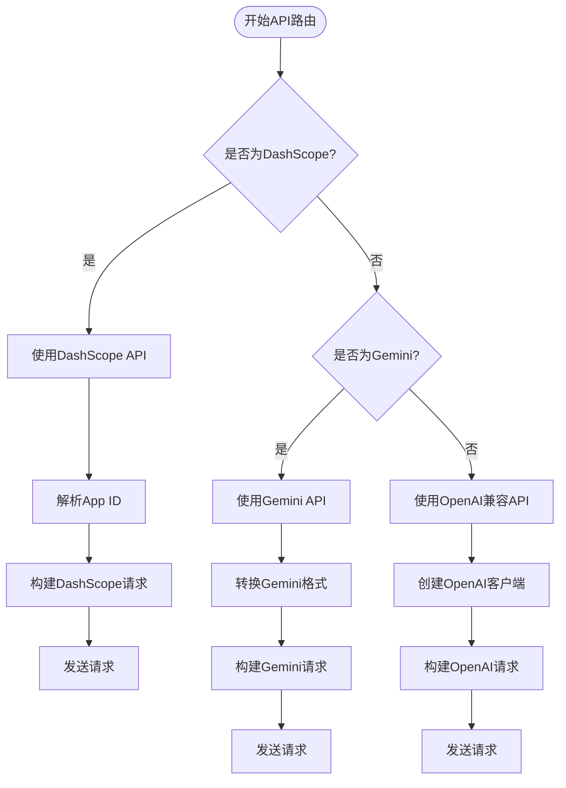
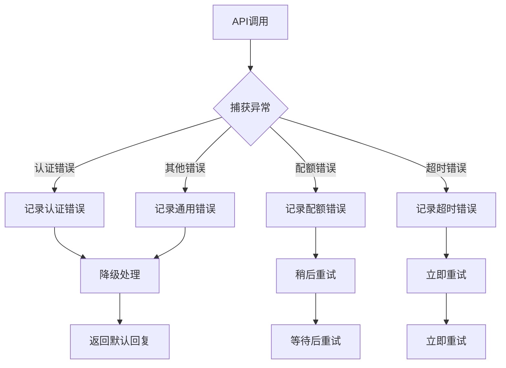

# AI回复生成核心流程文档

<cite>
**本文档中引用的文件**
- [ai_reply_engine.py](file://ai_reply_engine.py)
- [config.py](file://config.py)
- [XianyuAutoAsync.py](file://XianyuAutoAsync.py)
- [global_config.yml](file://global_config.yml)
- [db_manager.py](file://db_manager.py)
- [app.js](file://static/js/app.js)
- [index.html](file://static/index.html)
</cite>

## 目录
1. [简介](#简介)
2. [系统架构概览](#系统架构概览)
3. [核心组件分析](#核心组件分析)
4. [AI回复生成流程详解](#ai回复生成流程详解)
5. [多API模型支持机制](#多api模型支持机制)
6. [配置管理系统](#配置管理系统)
7. [错误处理与故障排除](#错误处理与故障排除)
8. [性能优化策略](#性能优化策略)
9. [最佳实践指南](#最佳实践指南)
10. [总结](#总结)

## 简介

本文档全面解析了闲鱼自动回复系统中的AI回复生成核心流程。该系统采用模块化设计，支持多种AI模型（OpenAI兼容API、Gemini、DashScope），通过智能路由机制选择最适合的API服务，为用户提供高效、个性化的智能回复功能。

系统的核心设计理念是"无状态部署"和"上下文感知"，通过动态客户端创建、对话历史管理和意图检测等机制，确保在多进程环境下的一致性和可靠性。

## 系统架构概览



**图表来源**
- [ai_reply_engine.py](file://ai_reply_engine.py#L24-L544)
- [db_manager.py](file://db_manager.py#L16-L200)

**章节来源**
- [ai_reply_engine.py](file://ai_reply_engine.py#L1-L50)
- [db_manager.py](file://db_manager.py#L150-L200)

## 核心组件分析

### AI回复引擎 (AIReplyEngine)

AI回复引擎是系统的核心组件，负责协调整个AI回复流程。其主要职责包括：

#### 主要特性
- **无状态设计**: 移除了有状态的缓存机制，支持多进程部署
- **意图检测**: 基于关键词的本地意图识别，降低AI调用成本
- **对话管理**: 维护聊天锁机制，确保同一对话的消息串行处理
- **多模型支持**: 通过路由判断支持OpenAI、Gemini、DashScope三种API

#### 核心方法架构



**图表来源**
- [ai_reply_engine.py](file://ai_reply_engine.py#L24-L544)
- [db_manager.py](file://db_manager.py#L16-L200)

**章节来源**
- [ai_reply_engine.py](file://ai_reply_engine.py#L24-L100)

### 数据库管理器 (DBManager)

数据库管理器负责AI回复相关的配置存储和对话历史管理：

#### AI回复设置表结构
| 字段名 | 类型 | 默认值 | 描述 |
|--------|------|--------|------|
| cookie_id | TEXT | PRIMARY KEY | 账号唯一标识 |
| ai_enabled | BOOLEAN | FALSE | 是否启用AI回复 |
| model_name | TEXT | 'qwen-plus' | AI模型名称 |
| api_key | TEXT | NULL | API密钥 |
| base_url | TEXT | 'https://dashscope.aliyuncs.com/compatible-mode/v1' | API基础URL |
| max_discount_percent | INTEGER | 10 | 最大优惠百分比 |
| max_discount_amount | INTEGER | 100 | 最大优惠金额 |
| max_bargain_rounds | INTEGER | 3 | 最大议价轮数 |
| custom_prompts | TEXT | '' | 自定义提示词 |

#### 对话历史表结构
| 字段名 | 类型 | 描述 |
|--------|------|------|
| id | INTEGER | 主键ID |
| cookie_id | TEXT | 账号标识 |
| chat_id | TEXT | 聊天会话ID |
| user_id | TEXT | 用户ID |
| item_id | TEXT | 商品ID |
| role | TEXT | 角色（user/assistant） |
| content | TEXT | 消息内容 |
| intent | TEXT | 意图分类 |
| created_at | TIMESTAMP | 创建时间 |

**章节来源**
- [db_manager.py](file://db_manager.py#L150-L200)
- [db_manager.py](file://db_manager.py#L1766-L1844)

## AI回复生成流程详解

### generate_reply 方法核心流程

`generate_reply`方法是AI回复生成的核心入口，其执行流程如下：



**图表来源**
- [ai_reply_engine.py](file://ai_reply_engine.py#L283-L420)

### 意图检测机制

系统采用基于关键词的本地意图检测，支持三种主要意图类型：

#### 价格相关意图检测
```python
price_keywords = [
    '便宜', '优惠', '刀', '降价', '包邮', '价格', '多少钱', '能少', '还能', '最低', '底价',
    '实诚价', '到100', '能到', '包个邮', '给个价', '什么价'
]
```

#### 技术相关意图检测
```python
tech_keywords = [
    '怎么用', '参数', '坏了', '故障', '设置', '说明书', '功能', '用法', '教程', '驱动'
]
```

#### 意图检测流程
1. **关键词匹配**: 将消息转换为小写后与关键词列表进行匹配
2. **优先级判断**: 价格关键词优先级最高，其次是技术关键词
3. **默认处理**: 未匹配到关键词时返回'default'意图

**章节来源**
- [ai_reply_engine.py](file://ai_reply_engine.py#L237-L274)

### 对话历史管理

系统通过多层机制管理对话历史，确保上下文的准确性和时效性：

#### 时间窗口查询机制
- **内部防抖模式**: 查询最近25秒内的消息（10秒等待 + 10秒消息间隔 + 5秒缓冲）
- **外部防抖模式**: 查询最近6秒内的消息（1秒防抖 + 5秒缓冲）

#### 对话上下文构建
系统从数据库中获取最近的对话记录，最多10条消息，按时间顺序排列，为AI模型提供完整的上下文信息。

**章节来源**
- [ai_reply_engine.py](file://ai_reply_engine.py#L436-L449)
- [ai_reply_engine.py](file://ai_reply_engine.py#L312-L316)

### 议价次数控制

系统实现了智能的议价次数控制机制：

#### 控制逻辑
1. **计数查询**: 通过SQL COUNT(*)统计用户发送的价格相关消息
2. **轮次限制**: 根据配置的`max_bargain_rounds`参数设置最大议价轮数
3. **拒绝机制**: 达到上限后返回固定拒绝回复："抱歉，这个价格已经是最优惠的了，不能再便宜了哦！"

#### 配置参数
- **max_bargain_rounds**: 默认3轮，可在配置中调整
- **max_discount_percent**: 最大优惠百分比，默认10%
- **max_discount_amount**: 最大优惠金额，默认100元

**章节来源**
- [ai_reply_engine.py](file://ai_reply_engine.py#L477-L488)
- [ai_reply_engine.py](file://ai_reply_engine.py#L337-L343)

## 多API模型支持机制

### API路由判断系统

系统通过智能路由判断选择最适合的API服务：



**图表来源**
- [ai_reply_engine.py](file://ai_reply_engine.py#L386-L401)

### DashScope API集成

#### 特殊处理逻辑
1. **App ID提取**: 从base_url中解析出App ID
2. **URL构建**: 动态构建API请求URL
3. **消息格式转换**: 将标准消息格式转换为DashScope格式

#### 请求格式示例
```json
{
    "input": {
        "prompt": "系统指令\n\n用户问题：用户消息\n\n请直接回答用户的问题："
    },
    "parameters": {
        "max_tokens": 100,
        "temperature": 0.7
    }
}
```

**章节来源**
- [ai_reply_engine.py](file://ai_reply_engine.py#L100-L151)

### Gemini API集成

#### REST API特性
1. **格式转换**: 将标准消息格式转换为Gemini v1beta格式
2. **系统指令**: 支持system instruction和user content分离
3. **响应解析**: 解析复杂的候选者结构

#### 消息格式转换
```python
# 输入格式
[
    {"role": "system", "content": "系统指令"},
    {"role": "user", "content": "用户消息"}
]

# 输出格式
{
    "contents": [{
        "role": "user",
        "parts": [{"text": "合并后的用户消息"}]
    }],
    "generationConfig": {
        "temperature": 0.7,
        "maxOutputTokens": 100
    }
}
```

**章节来源**
- [ai_reply_engine.py](file://ai_reply_engine.py#L153-L221)

### OpenAI兼容API集成

#### 无状态客户端创建
系统采用动态客户端创建模式，每次调用都创建新的OpenAI客户端实例：

```python
def _create_openai_client(self, cookie_id: str) -> Optional[OpenAI]:
    settings = db_manager.get_ai_reply_settings(cookie_id)
    if not settings['ai_enabled'] or not settings['api_key']:
        return None
    
    client = OpenAI(
        api_key=settings['api_key'],
        base_url=settings['base_url']
    )
    return client
```

#### 优势特性
- **无状态部署**: 支持多进程环境下的并发调用
- **配置隔离**: 每个账号使用独立的API配置
- **资源管理**: 避免客户端连接池导致的资源泄漏

**章节来源**
- [ai_reply_engine.py](file://ai_reply_engine.py#L62-L81)

## 配置管理系统

### 前端配置界面

系统提供了完整的Web配置界面，支持实时配置和测试：

#### 配置页面布局
1. **基础设置**: 启用开关、账号选择
2. **模型配置**: 模型选择、API密钥、基础URL
3. **议价设置**: 最大优惠、最大轮数、自定义提示词
4. **测试功能**: 实时测试AI回复效果

#### 模型选择机制
```javascript
const presetModels = ['qwen-plus', 'qwen-turbo', 'qwen-max', 'gpt-3.5-turbo', 'gpt-4'];
if (presetModels.includes(modelName)) {
    modelSelect.value = modelName;
    customModelInput.style.display = 'none';
} else {
    modelSelect.value = 'custom';
    customModelInput.style.display = 'block';
}
```

**章节来源**
- [app.js](file://static/js/app.js#L2330-L2354)
- [index.html](file://static/index.html#L3312-L3337)

### 后端配置管理

#### 配置数据结构
```python
settings = {
    'ai_enabled': True,
    'model_name': 'qwen-plus',
    'api_key': 'sk-...',
    'base_url': 'https://dashscope.aliyuncs.com/compatible-mode/v1',
    'max_discount_percent': 10,
    'max_discount_amount': 100,
    'max_bargain_rounds': 3,
    'custom_prompts': '{"price": "...", "tech": "...", "default": "..."}'
}
```

#### 配置验证机制
1. **必填字段检查**: API密钥不能为空
2. **JSON格式验证**: 自定义提示词必须是有效的JSON
3. **模型名称验证**: 支持预设模型和自定义模型

**章节来源**
- [db_manager.py](file://db_manager.py#L1766-L1795)

### 全局配置系统

系统通过YAML配置文件管理全局设置：

#### 关键配置项
- **API_ENDPOINTS**: API端点配置
- **AUTO_REPLY**: 自动回复设置
- **WEBSOCKET_URL**: WebSocket连接地址
- **LOG_CONFIG**: 日志配置
- **SLIDER_VERIFICATION**: 滑块验证配置

**章节来源**
- [global_config.yml](file://global_config.yml#L1-L77)
- [config.py](file://config.py#L1-L126)

## 错误处理与故障排除

### 常见错误类型

#### API调用错误
1. **认证失败**: API密钥无效或过期
2. **配额限制**: 超出API调用配额
3. **网络超时**: 网络连接不稳定
4. **请求格式错误**: 消息格式不符合API要求

#### 系统错误
1. **数据库连接失败**: SQLite数据库无法访问
2. **配置缺失**: AI设置配置不完整
3. **并发冲突**: 多进程间的资源竞争

### 错误处理策略

#### 分层错误处理


**图表来源**
- [ai_reply_engine.py](file://ai_reply_engine.py#L414-L420)

#### 具体错误处理实现

##### API调用超时处理
```python
try:
    response = requests.post(url, headers=headers, json=data, timeout=30)
    if response.status_code != 200:
        logger.error(f"API请求失败: {response.status_code} - {response.text}")
        raise Exception(f"API请求失败: {response.status_code} - {response.text}")
except requests.Timeout:
    logger.error(f"API调用超时: {url}")
    return None
```

##### 认证失败处理
```python
if not settings['ai_enabled'] or not settings['api_key']:
    logger.warning(f"AI回复未启用或API密钥为空: {cookie_id}")
    return None
```

##### 配额限制处理
```python
try:
    # API调用逻辑
    pass
except Exception as e:
    if "quota" in str(e).lower() or "rate" in str(e).lower():
        logger.warning(f"API配额限制: {e}")
        # 切换到备用API或降级处理
```

**章节来源**
- [ai_reply_engine.py](file://ai_reply_engine.py#L139-L151)
- [ai_reply_engine.py](file://ai_reply_engine.py#L70-L81)

### 故障排除指南

#### 配置问题排查
1. **检查API密钥**: 确认密钥格式正确且未过期
2. **验证基础URL**: 确认API端点地址正确
3. **测试网络连接**: 确认网络可达性

#### 性能问题排查
1. **监控API响应时间**: 记录各API的响应时间
2. **检查并发限制**: 确认没有超出API的并发限制
3. **优化消息长度**: 控制单次请求的消息长度

#### 数据库问题排查
1. **检查表结构**: 确认ai_reply_settings和ai_conversations表存在
2. **验证数据完整性**: 检查配置数据是否完整
3. **清理过期数据**: 定期清理对话历史数据

## 性能优化策略

### 并发控制机制

#### 聊天锁机制
系统为每个chat_id维护独立的锁，确保同一对话的消息串行处理：

```python
def _get_chat_lock(self, chat_id: str) -> threading.Lock:
    with self._chat_locks_lock:
        if chat_id not in self._chat_locks:
            self._chat_locks[chat_id] = threading.Lock()
        return self._chat_locks[chat_id]
```

#### 消息防抖机制
1. **内部防抖**: 默认等待10秒收集后续消息
2. **外部防抖**: 支持调用方实现的防抖机制
3. **时间窗口**: 根据防抖模式调整查询时间窗口

**章节来源**
- [ai_reply_engine.py](file://ai_reply_engine.py#L276-L281)
- [ai_reply_engine.py](file://ai_reply_engine.py#L298-L304)

### 缓存策略

#### 商品信息缓存
系统维护商品信息的内存缓存，减少重复的API调用：

```python
# 缓存结构示例
_item_detail_cache = {
    item_id: {
        'detail': 商品详情文本,
        'timestamp': 创建时间戳,
        'access_time': 最后访问时间
    }
}
```

#### 缓存管理策略
- **TTL机制**: 24小时自动过期
- **LRU淘汰**: 超出最大容量时淘汰最久未访问的项
- **并发安全**: 使用异步锁保护缓存操作

**章节来源**
- [XianyuAutoAsync.py](file://XianyuAutoAsync.py#L171-L176)

### 异步处理优化

#### 异步包装器
系统提供异步版本的回复生成方法：

```python
async def generate_reply_async(self, message: str, item_info: dict, chat_id: str,
                             cookie_id: str, user_id: str, item_id: str,
                             skip_wait: bool = False) -> Optional[str]:
    return await asyncio.to_thread(self.generate_reply, message, item_info, chat_id, 
                                 cookie_id, user_id, item_id, skip_wait)
```

#### 线程池利用
通过`asyncio.to_thread()`将CPU密集型的同步操作转移到独立线程池中执行，避免阻塞事件循环。

**章节来源**
- [ai_reply_engine.py](file://ai_reply_engine.py#L422-L434)

### 资源管理优化

#### 无状态客户端
每次API调用都创建新的客户端实例，避免连接池导致的资源泄漏：

```python
# 修复P0-2: 移除了有状态的缓存管理
def _create_openai_client(self, cookie_id: str) -> Optional[OpenAI]:
    settings = db_manager.get_ai_reply_settings(cookie_id)
    if not settings['ai_enabled'] or not settings['api_key']:
        return None
    
    client = OpenAI(
        api_key=settings['api_key'],
        base_url=settings['base_url']
    )
    return client
```

#### 连接复用控制
对于支持连接池的API，系统通过配置控制连接复用行为，平衡性能和资源消耗。

**章节来源**
- [ai_reply_engine.py](file://ai_reply_engine.py#L62-L81)

## 最佳实践指南

### API密钥配置最佳实践

#### 安全配置原则
1. **最小权限原则**: 为每个账号分配独立的API密钥
2. **定期轮换**: 建立API密钥定期更换机制
3. **环境隔离**: 开发、测试、生产环境使用不同的API密钥
4. **加密存储**: 在数据库中对API密钥进行加密存储

#### 配置示例
```yaml
# 生产环境配置
AI_API_KEYS:
  account1: sk-proj-xxxxxxxxxxxxxxxxxxxxxxxxxxxxxxxx
  account2: sk-proj-yyyyyyyyyyyyyyyyyyyyyyyyyyyyyyyyyy
  account3: sk-proj-zzzzzzzzzzzzzzzzzzzzzzzzzzzzzzzzzz
```

### 模型选择指南

#### 不同场景的模型推荐
1. **价格谈判**: 推荐使用通义千问系列（qwen-plus/qwen-max）
2. **技术支持**: 推荐使用GPT-3.5或通义千问Turbo
3. **通用客服**: 推荐使用GPT-4或通义千问Max

#### 自定义模型配置
```json
{
    "price": "你是一位经验丰富的销售专家，擅长议价。\n语言要求：简短直接，每句≤10字，总字数≤40字。",
    "tech": "你是一位技术专家，专业解答产品相关问题。\n语言要求：简短专业，每句≤10字，总字数≤40字。",
    "default": "你是一位资深电商卖家，提供优质客服。\n语言要求：简短友好，每句≤10字，总字数≤40字。"
}
```

### 提示词优化策略

#### 系统提示词设计原则
1. **明确角色定位**: 清晰定义AI的角色和职责
2. **约束输出格式**: 限制回复长度和格式
3. **提供具体指导**: 给出具体的回复策略和技巧
4. **考虑文化背景**: 考虑目标用户的语言习惯

#### 示例提示词模板
```python
# 价格谈判提示词
price_prompt = '''
你是一位经验丰富的销售专家，擅长议价。
语言要求：简短直接，每句≤10字，总字数≤40字。
议价策略：
1. 根据议价次数递减优惠：第1次小幅优惠，第2次中等优惠，第3次最大优惠
2. 接近最大议价轮数时要坚持底线，强调商品价值
3. 优惠不能超过设定的最大百分比和金额
4. 语气要友好但坚定，突出商品优势
'''

# 技术支持提示词
tech_prompt = '''
你是一位技术专家，专业解答产品相关问题。
语言要求：简短专业，每句≤10字，总字数≤40字。
回答重点：产品功能、使用方法、注意事项。
注意：基于商品信息回答，避免过度承诺。
'''
```

**章节来源**
- [ai_reply_engine.py](file://ai_reply_engine.py#L39-L60)

### 监控和日志最佳实践

#### 关键指标监控
1. **API调用成功率**: 监控各API的成功率
2. **响应时间分布**: 记录API响应时间统计
3. **错误类型分析**: 分类统计各种错误类型
4. **资源使用情况**: 监控内存和CPU使用情况

#### 日志配置建议
```yaml
LOG_CONFIG:
  level: INFO
  rotation: 1 day
  retention: 30 days
  compression: zip
  format: '<green>{time:YYYY-MM-DD HH:mm:ss.SSS}</green> | <level>{level: <8}</level> | <cyan>{name}</cyan>:<cyan>{function}</cyan>:<cyan>{line}</cyan> - <level>{message}</level>'
```

#### 告警机制
1. **成功率告警**: API成功率低于95%时告警
2. **响应时间告警**: 平均响应时间超过2秒时告警
3. **错误频率告警**: 连续错误达到阈值时告警

### 故障恢复策略

#### 自动恢复机制
1. **API切换**: 主API失败时自动切换到备用API
2. **降级处理**: API不可用时使用本地回复逻辑
3. **指数退避**: 失败后采用指数退避策略重试

#### 手动干预机制
1. **紧急停用**: 支持手动停用有问题的账号
2. **配置热更新**: 支持在线修改配置而无需重启
3. **状态监控**: 提供实时状态监控界面

## 总结

闲鱼自动回复系统的AI回复生成核心流程展现了现代AI应用的最佳实践。通过模块化设计、多API支持、智能路由和完善的错误处理机制，系统实现了高效、可靠、可扩展的智能回复功能。

### 核心优势

1. **架构设计**: 无状态部署支持多进程环境，提高了系统的可扩展性和稳定性
2. **多模型支持**: 通过智能路由机制支持多种AI模型，满足不同场景需求
3. **上下文感知**: 通过对话历史管理和意图检测，提供个性化的回复体验
4. **错误处理**: 完善的错误处理和故障恢复机制，确保系统稳定性
5. **性能优化**: 并发控制、缓存策略和异步处理优化了系统性能

### 技术创新点

1. **动态客户端创建**: 每次API调用都创建新的客户端实例，避免状态问题
2. **智能路由判断**: 基于模型名称和URL的智能API选择机制
3. **消息防抖机制**: 通过时间窗口控制减少重复处理
4. **并发锁管理**: 为每个聊天会话维护独立的锁，确保消息顺序

### 应用价值

该系统不仅为闲鱼平台提供了智能化的客服解决方案，也为其他电商平台的AI客服系统建设提供了宝贵的参考经验。其设计理念和技术实现对于构建高质量的AI应用具有重要的指导意义。

通过持续的优化和改进，该系统将继续为用户提供更加智能、高效、可靠的回复服务，推动AI技术在电商领域的深度应用。