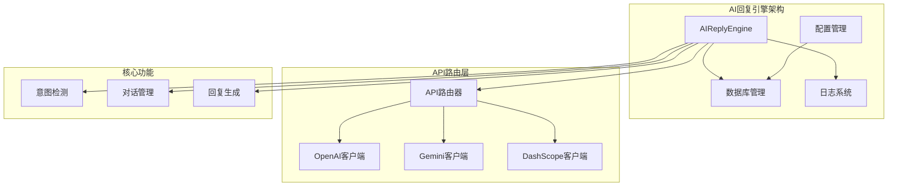
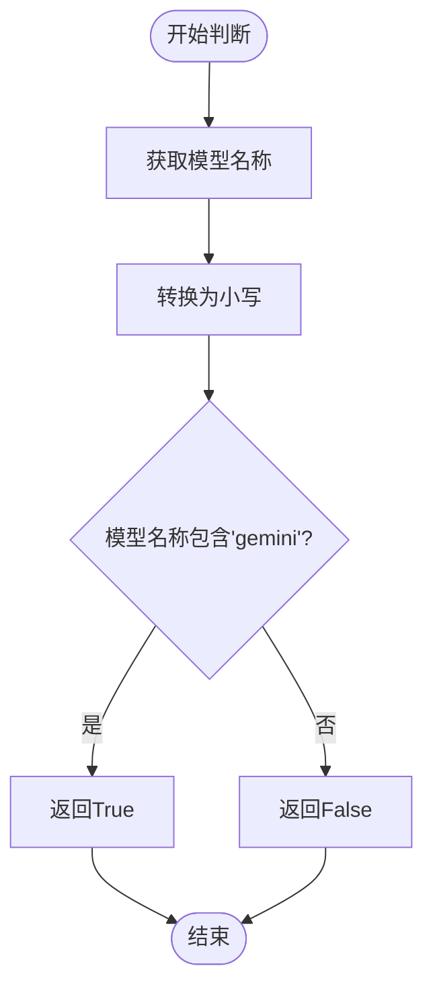
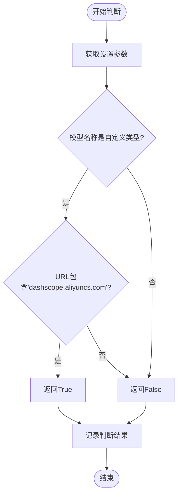
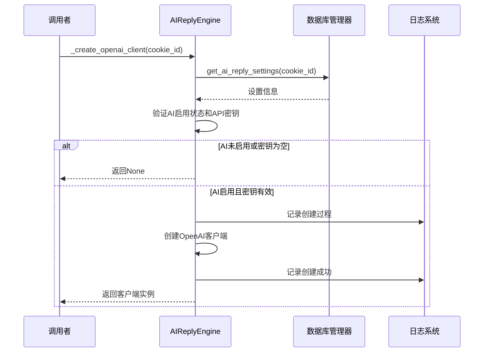
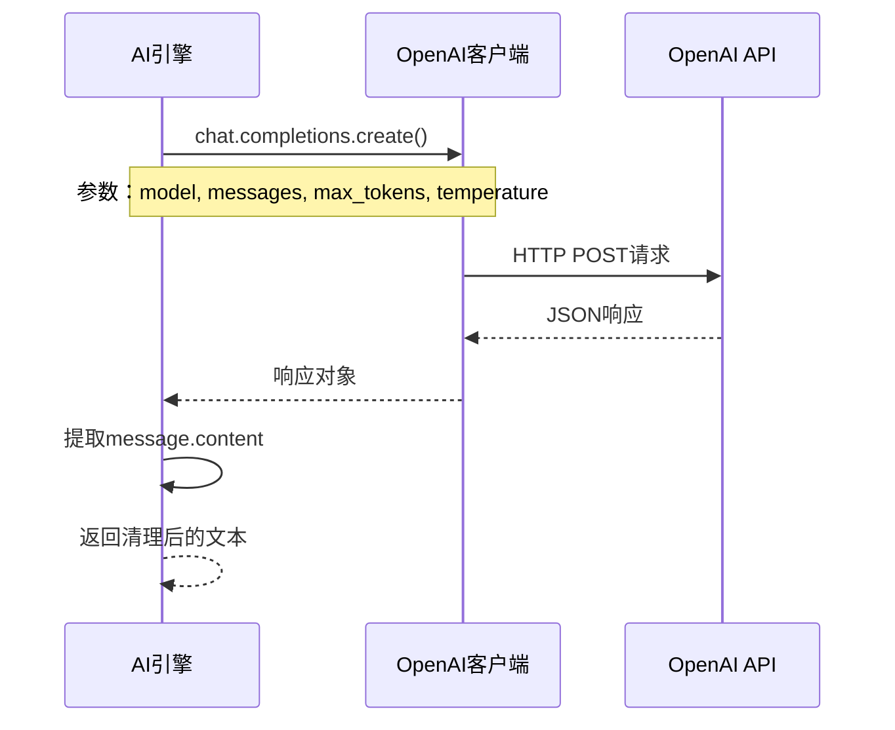
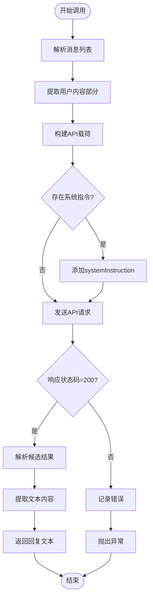
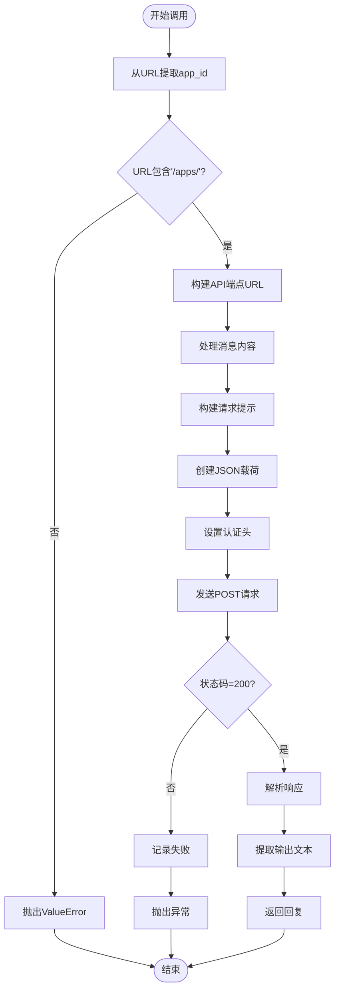
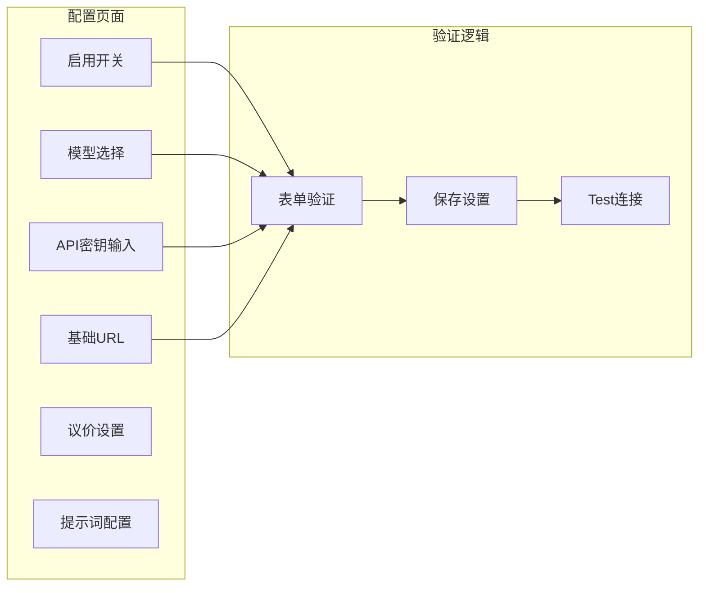
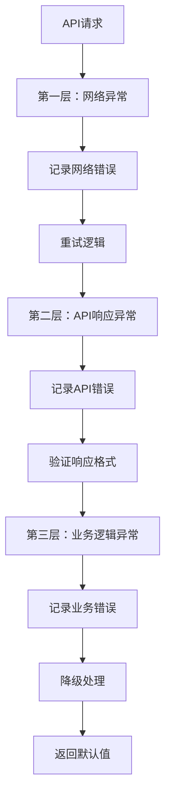

# AI模型支持与API调用

<cite>
**本文档引用的文件**
- [ai_reply_engine.py](file://ai_reply_engine.py)
- [db_manager.py](file://db_manager.py)
- [config.py](file://config.py)
- [global_config.yml](file://global_config.yml)
- [static/index.html](file://static/index.html)
- [static/js/app.js](file://static/js/app.js)
</cite>

## 目录
1. [简介](#简介)
2. [项目架构概览](#项目架构概览)
3. [API类型识别机制](#api类型识别机制)
4. [无状态客户端创建](#无状态客户端创建)
5. [核心API调用方法](#核心api调用方法)
6. [配置管理](#配置管理)
7. [错误处理与日志](#错误处理与日志)
8. [常见问题排查](#常见问题排查)
9. [最佳实践](#最佳实践)
10. [总结](#总结)

## 简介

本文档详细解析了XianyuAutoAgent项目中的AI回复引擎对多模型的支持机制。该引擎实现了智能的API路由系统，能够根据不同的模型名称和基础URL自动识别并调用相应的AI服务，包括OpenAI兼容API、Google Gemini REST API和阿里云DashScope API。

核心特性包括：
- **智能API路由**：基于模型名称和URL的自动识别机制
- **无状态设计**：支持多进程部署，避免缓存导致的并发问题
- **多模型支持**：统一接口支持OpenAI、Gemini、DashScope等多种AI服务
- **健壮性增强**：完善的错误处理和日志记录机制

## 项目架构概览

AI回复引擎采用模块化设计，主要组件包括：



**图表来源**
- [ai_reply_engine.py](file://ai_reply_engine.py#L24-L544)
- [db_manager.py](file://db_manager.py#L1766-L1846)

**章节来源**
- [ai_reply_engine.py](file://ai_reply_engine.py#L24-L544)

## API类型识别机制

### `_is_gemini_api` 方法详解

该方法通过检查模型名称来判断是否为Gemini API：



**图表来源**
- [ai_reply_engine.py](file://ai_reply_engine.py#L95-L99)

实现特点：
- **大小写不敏感**：将模型名称转换为小写后进行匹配
- **简单高效**：仅通过字符串包含关系判断，性能优异
- **扩展性强**：支持各种Gemini模型变体

### `_is_dashscope_api` 方法详解

该方法采用双重条件判断来确认DashScope API：



**图表来源**
- [ai_reply_engine.py](file://ai_reply_engine.py#L83-L94)

判断逻辑：
1. **模型名称检查**：验证是否为自定义模型（'custom', '自定义', 'dashscope', 'qwen-custom'）
2. **URL验证**：确认基础URL包含特定域名
3. **双重验证**：只有两个条件都满足才认定为DashScope API

**章节来源**
- [ai_reply_engine.py](file://ai_reply_engine.py#L83-L99)

## 无状态客户端创建

### `_create_openai_client` 方法

该方法实现了无状态的客户端创建机制，解决了多进程部署中的缓存问题：



**图表来源**
- [ai_reply_engine.py](file://ai_reply_engine.py#L62-L81)

设计亮点：
- **无状态设计**：每次调用都创建新的客户端实例
- **即时验证**：在创建前验证AI启用状态和API密钥有效性
- **详细日志**：记录完整的创建过程和最终URL

### 缓存移除策略

项目修复了P0-2问题，完全移除了有状态的缓存管理：

```python
# 修复前的缓存实现（已移除）
self.clients = {}
self.agents = {}
self.client_last_used = {}

# 修复后的无状态实现
# 不再维护任何客户端缓存
```

这种设计的优势：
- **多进程兼容**：每个进程都有独立的客户端实例
- **内存安全**：避免长期持有大量客户端实例
- **简化维护**：无需复杂的缓存清理逻辑

**章节来源**
- [ai_reply_engine.py](file://ai_reply_engine.py#L62-L81)

## 核心API调用方法

### OpenAI兼容API调用

OpenAI API采用标准化的Chat Completions接口：



**图表来源**
- [ai_reply_engine.py](file://ai_reply_engine.py#L222-L230)

### Gemini REST API调用

Gemini API需要特殊的格式转换：



**图表来源**
- [ai_reply_engine.py](file://ai_reply_engine.py#L153-L221)

格式转换要点：
- **消息结构**：将传统角色消息转换为Gemini的contents格式
- **系统指令**：单独的systemInstruction字段
- **内容组织**：parts数组中的文本内容

### DashScope API调用

DashScope API具有独特的URL结构和参数格式：



**图表来源**
- [ai_reply_engine.py](file://ai_reply_engine.py#L100-L152)

特殊处理：
- **app_id提取**：从URL路径中解析应用标识符
- **提示格式**：将系统指令和用户消息组合成单一提示
- **参数封装**：使用input.parameters结构组织请求参数

**章节来源**
- [ai_reply_engine.py](file://ai_reply_engine.py#L100-L230)

## 配置管理

### 数据库配置结构

AI回复设置存储在SQLite数据库中，包含以下字段：

| 字段名 | 类型 | 默认值 | 描述 |
|--------|------|--------|------|
| ai_enabled | Boolean | False | 是否启用AI回复 |
| model_name | String | qwen-plus | 使用的AI模型名称 |
| api_key | String | '' | API密钥 |
| base_url | String | https://dashscope.aliyuncs.com/compatible-mode/v1 | API基础URL |
| max_discount_percent | Integer | 10 | 最大折扣百分比 |
| max_discount_amount | Integer | 100 | 最大折扣金额 |
| max_bargain_rounds | Integer | 3 | 最大议价轮数 |
| custom_prompts | JSON | '{}' | 自定义提示词 |

### 前端配置界面

系统提供了完整的Web配置界面：



**图表来源**
- [static/index.html](file://static/index.html#L3292-L3317)
- [static/js/app.js](file://static/js/app.js#L2329-L2458)

配置选项说明：
- **模型选择**：支持预设模型（qwen-plus, gpt-3.5-turbo等）和自定义模型
- **API密钥**：支持多种服务商的密钥格式
- **基础URL**：允许自定义API端点
- **议价设置**：控制AI的议价行为

**章节来源**
- [db_manager.py](file://db_manager.py#L1766-L1846)
- [static/js/app.js](file://static/js/app.js#L2329-L2458)

## 错误处理与日志

### 错误处理层次

系统采用多层错误处理机制：



### 日志记录策略

系统实现了详细的日志记录：

| 日志级别 | 记录内容 | 示例 |
|----------|----------|------|
| INFO | API调用开始 | "使用OpenAI兼容API生成回复" |
| DEBUG | 请求详情 | "请求数据: {...}" |
| WARNING | 警告信息 | "未在消息中找到用户内容" |
| ERROR | 错误信息 | "DashScope API请求失败: 401 - Unauthorized" |

### 网络超时处理

各API调用都设置了合理的超时时间：

- **OpenAI/DashScope**：30秒超时
- **Gemini**：30秒超时
- **重试机制**：指数退避算法

**章节来源**
- [ai_reply_engine.py](file://ai_reply_engine.py#L414-L420)
- [ai_reply_engine.py](file://ai_reply_engine.py#L139-L143)
- [ai_reply_engine.py](file://ai_reply_engine.py#L206-L210)

## 常见问题排查

### API密钥无效

**症状**：收到401 Unauthorized错误

**排查步骤**：
1. 检查API密钥格式是否正确
2. 验证密钥是否已过期
3. 确认密钥权限是否足够
4. 查看日志中的密钥截断信息

**解决方案**：
```python
# 检查密钥有效性
if not settings['api_key']:
    logger.error("API密钥为空，请检查配置")
    return None
```

### 模型名称不匹配

**症状**：API调用失败或返回意外结果

**排查步骤**：
1. 确认模型名称拼写正确
2. 检查模型是否在对应服务商可用
3. 验证基础URL是否匹配模型类型

**解决方案**：
```python
# Gemini模型验证
if 'gemini' not in settings['model_name'].lower():
    logger.warning(f"模型名称不符合Gemini格式: {settings['model_name']}")
```

### 网络连接超时

**症状**：请求长时间无响应

**排查步骤**：
1. 检查网络连接状态
2. 验证防火墙设置
3. 确认API端点可达性

**解决方案**：
```python
# 设置合理的超时时间
response = requests.post(url, headers=headers, json=data, timeout=30)
```

### 日志定位调用失败

**定位方法**：
1. **查看日志级别**：使用DEBUG级别获取详细信息
2. **搜索关键字**：查找"API请求失败"、"创建客户端失败"等关键词
3. **检查时间戳**：按时间顺序分析错误发生的上下文

**日志示例**：
```
2024-01-15 10:30:45.123 | ERROR    | AIReplyEngine:_call_dashscope_api - DashScope API请求失败: 400 - Invalid request
2024-01-15 10:30:45.124 | ERROR    | AIReplyEngine:generate_reply - AI回复生成失败: DashScope API请求失败: 400 - Invalid request
```

**章节来源**
- [ai_reply_engine.py](file://ai_reply_engine.py#L414-L420)

## 最佳实践

### 配置优化建议

1. **模型选择**：
   - 生产环境推荐使用稳定的基础模型
   - 测试环境可尝试最新模型版本
   - 根据业务需求选择合适的模型规格

2. **API密钥管理**：
   - 使用环境变量存储敏感信息
   - 定期轮换API密钥
   - 实施最小权限原则

3. **网络配置**：
   - 配置适当的超时时间
   - 实施重试机制
   - 监控网络延迟

### 性能优化

1. **并发控制**：
   - 使用线程锁防止重复调用
   - 实施请求队列管理
   - 控制同时活跃的API请求数量

2. **资源管理**：
   - 及时释放不需要的资源
   - 监控内存使用情况
   - 实施优雅的关闭流程

### 监控与维护

1. **健康检查**：
   - 定期测试API连通性
   - 监控响应时间和成功率
   - 设置告警阈值

2. **日志分析**：
   - 分析错误模式
   - 识别性能瓶颈
   - 优化配置参数

## 总结

XianyuAutoAgent的AI回复引擎展现了优秀的多模型支持能力。通过智能的API路由机制、无状态的客户端设计和健壮的错误处理，系统能够可靠地支持OpenAI、Gemini和DashScope等多种AI服务。

关键技术亮点：
- **智能路由**：基于模型名称和URL的精确API识别
- **无状态设计**：支持大规模分布式部署
- **格式转换**：统一接口适配不同API的特殊要求
- **完善监控**：详细的日志记录和错误追踪

这套设计模式为其他AI集成项目提供了宝贵的参考价值，特别是在多模型支持和生产环境稳定性方面。