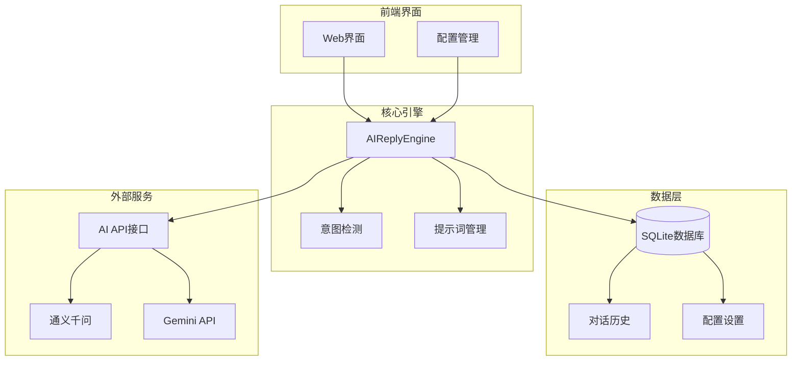
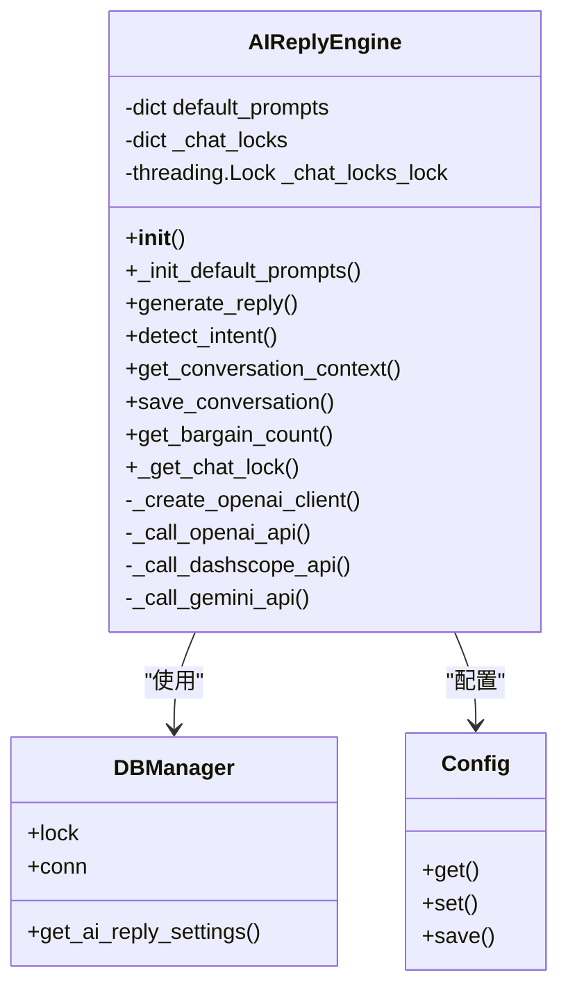
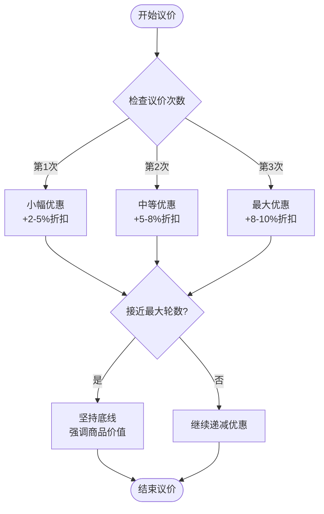
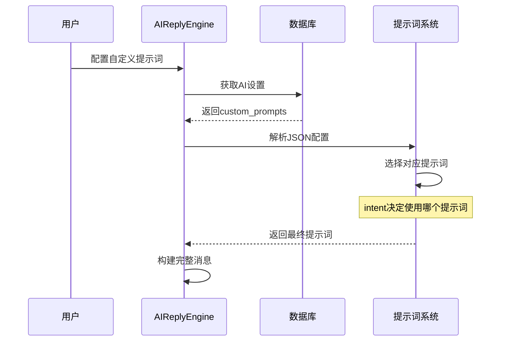
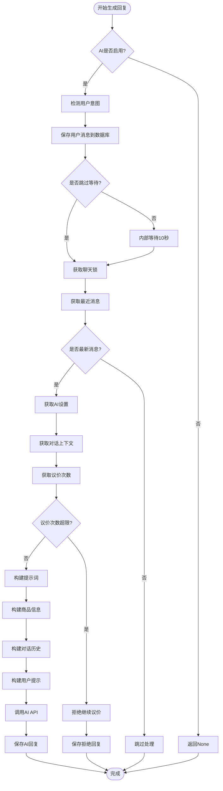
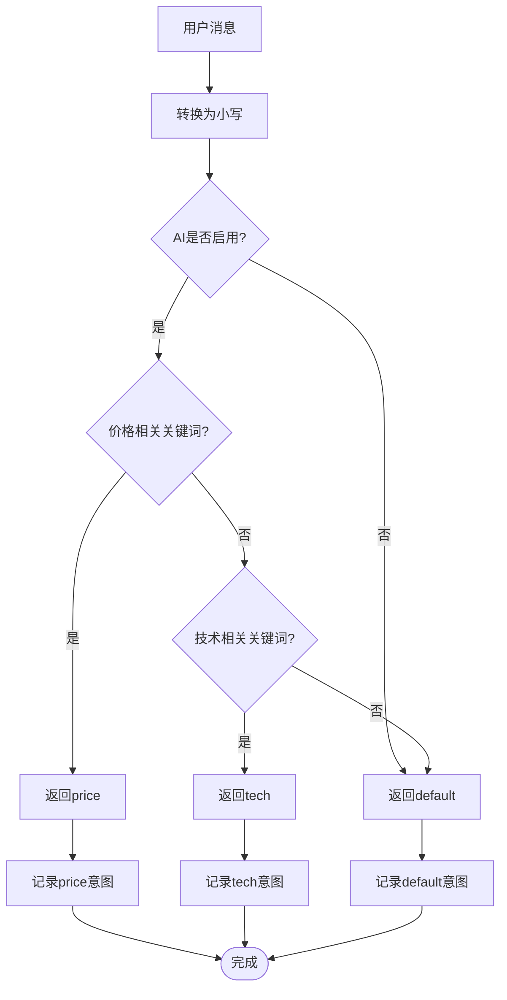
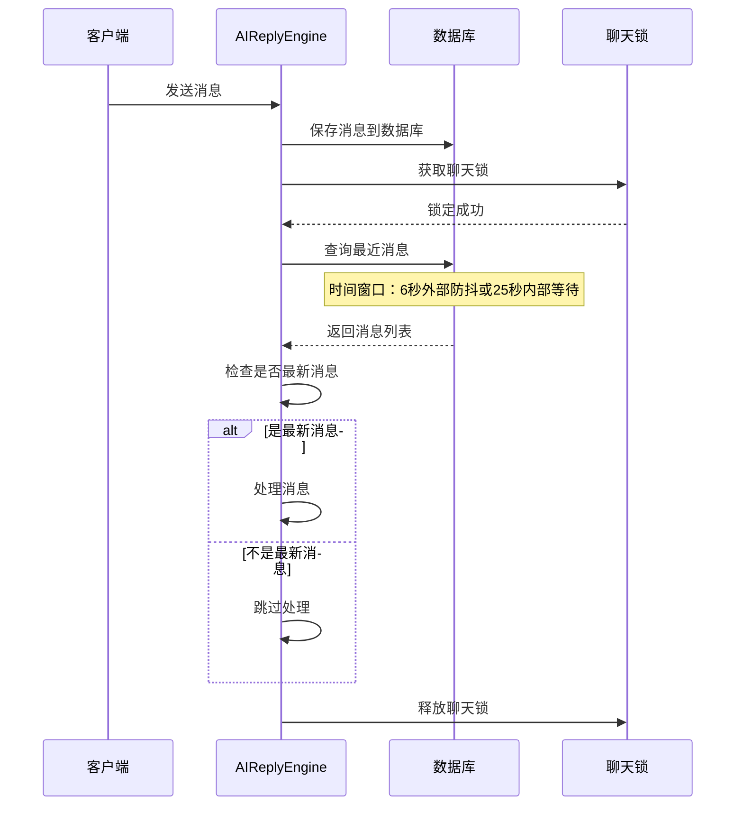
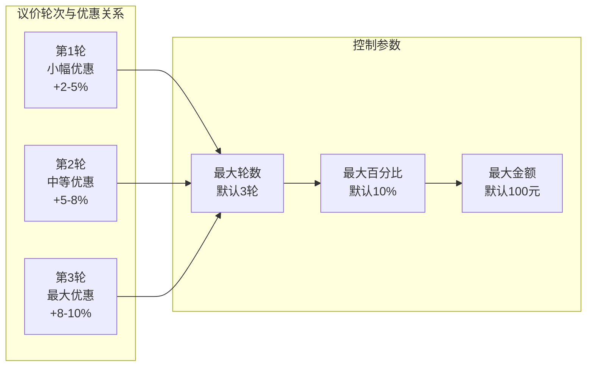

# 提示词工程与回复生成

<cite>
**本文档引用的文件**
- [ai_reply_engine.py](file://ai_reply_engine.py)
- [config.py](file://config.py)
- [db_manager.py](file://db_manager.py)
- [XianyuAutoAsync.py](file://XianyuAutoAsync.py)
- [reply_server.py](file://reply_server.py)
- [global_config.yml](file://global_config.yml)
</cite>

## 目录
1. [简介](#简介)
2. [项目架构概览](#项目架构概览)
3. [核心组件分析](#核心组件分析)
4. [提示词工程实现](#提示词工程实现)
5. [回复生成流程](#回复生成流程)
6. [意图检测机制](#意图检测机制)
7. [对话历史管理](#对话历史管理)
8. [议价策略实现](#议价策略实现)
9. [数据库表结构](#数据库表结构)
10. [优化建议与最佳实践](#优化建议与最佳实践)
11. [总结](#总结)

## 简介

本文档深入解析了Xianyu Auto Reply项目中AI回复生成过程中的提示词工程实现。该项目采用低成本的关键词匹配意图检测，结合结构化的提示词设计，实现了高效的智能客服回复系统。系统通过`AIReplyEngine`类为核心，提供了完整的AI回复生成流水线，包括提示词管理、对话历史处理、议价策略控制等功能。

## 项目架构概览

系统采用模块化设计，主要包含以下核心模块：



**图表来源**
- [ai_reply_engine.py](file://ai_reply_engine.py#L24-L544)
- [db_manager.py](file://db_manager.py#L16-L200)

## 核心组件分析

### AIReplyEngine类设计

`AIReplyEngine`类是整个AI回复系统的核心，负责协调各个子系统的协作。该类采用了无状态设计，支持多进程部署，移除了原有的客户端缓存机制。



**图表来源**
- [ai_reply_engine.py](file://ai_reply_engine.py#L24-L544)
- [db_manager.py](file://db_manager.py#L16-L200)

**章节来源**
- [ai_reply_engine.py](file://ai_reply_engine.py#L24-L544)

## 提示词工程实现

### 默认提示词初始化

系统在`_init_default_prompts`方法中预设了三种类型的提示词，每种都针对特定的业务场景进行了优化设计：

#### 1. 议价提示词（price）

议价提示词是系统中最复杂的提示词，专门用于处理价格谈判场景：



**图表来源**
- [ai_reply_engine.py](file://ai_reply_engine.py#L42-L49)

#### 2. 技术提示词（tech）

技术提示词专注于产品相关问题的解答，要求简洁专业：

- **语言要求**：每句≤10字，总字数≤40字
- **回答重点**：产品功能、使用方法、注意事项
- **设计原则**：基于商品信息回答，避免过度承诺

#### 3. 默认提示词（default）

默认提示词适用于一般性客服场景：

- **语言要求**：简短友好，每句≤10字，总字数≤40字
- **回答重点**：商品介绍、物流、售后等常见问题
- **设计原则**：结合商品信息，给出实用建议

**章节来源**
- [ai_reply_engine.py](file://ai_reply_engine.py#L37-L60)

### 用户自定义提示词覆盖机制

系统提供了灵活的提示词覆盖机制，允许用户通过`custom_prompts`配置来自定义提示词：



**图表来源**
- [ai_reply_engine.py](file://ai_reply_engine.py#L346-L347)

**章节来源**
- [ai_reply_engine.py](file://ai_reply_engine.py#L346-L347)

## 回复生成流程

### generate_reply方法详解

`generate_reply`方法是整个回复生成的核心流程，包含了完整的上下文构建和AI调用过程：



**图表来源**
- [ai_reply_engine.py](file://ai_reply_engine.py#L283-L420)

### 结构化上下文构建

系统通过多个步骤构建结构化的上下文提示：

1. **商品信息构建**：提取商品标题、价格、描述等关键信息
2. **对话历史截取**：最多保留最近10条消息
3. **议价设置整合**：包含当前议价次数、最大轮数、优惠限制等
4. **用户消息封装**：将所有信息整合为结构化提示

**章节来源**
- [ai_reply_engine.py](file://ai_reply_engine.py#L283-L420)

## 意图检测机制

### 基于关键词的低成本检测

系统采用关键词匹配的方式进行意图检测，避免了AI调用的成本和延迟：



**图表来源**
- [ai_reply_engine.py](file://ai_reply_engine.py#L237-L274)

### 关键词匹配策略

系统维护了两类关键词列表：

#### 价格相关关键词
- 基础词汇：便宜、优惠、刀、降价、包邮、价格、多少钱
- 口语化表达：能少、还能、最低、底价、实诚价、到100、能到
- 特殊表达：包个邮、给个价、什么价

#### 技术相关关键词
- 功能查询：怎么用、参数、坏了、故障、设置、说明书
- 技术支持：功能、用法、教程、驱动

**章节来源**
- [ai_reply_engine.py](file://ai_reply_engine.py#L237-L274)

## 对话历史管理

### 截取策略与去重机制

系统实现了智能的对话历史管理机制：



**图表来源**
- [ai_reply_engine.py](file://ai_reply_engine.py#L306-L325)

### 消息去重机制

系统通过时间戳和聊天锁确保消息处理的串行性：

- **时间窗口控制**：根据防抖机制动态调整查询时间窗口
- **最新消息检查**：确保只处理最新的消息，避免重复处理
- **串行处理保证**：通过`_chat_locks`确保同一聊天ID的消息串行处理

**章节来源**
- [ai_reply_engine.py](file://ai_reply_engine.py#L306-L325)

## 议价策略实现

### 动态优惠递减逻辑

系统实现了基于议价次数的动态优惠递减策略：



**图表来源**
- [ai_reply_engine.py](file://ai_reply_engine.py#L337-L343)

### 议价控制机制

系统通过多个层面控制议价行为：

1. **轮次限制**：通过`max_bargain_rounds`控制最大议价轮数
2. **优惠限制**：通过`max_discount_percent`和`max_discount_amount`限制优惠幅度
3. **自动拒绝**：达到限制后自动拒绝继续议价

**章节来源**
- [ai_reply_engine.py](file://ai_reply_engine.py#L337-L343)

## 数据库表结构

### ai_conversations表设计

系统使用专门的对话历史表来存储AI交互记录：

| 字段名 | 类型 | 约束 | 描述 |
|--------|------|------|------|
| id | INTEGER | PRIMARY KEY AUTOINCREMENT | 主键ID |
| cookie_id | TEXT | NOT NULL | 账号标识 |
| chat_id | TEXT | NOT NULL | 聊天会话ID |
| user_id | TEXT | NOT NULL | 用户ID |
| item_id | TEXT | NOT NULL | 商品ID |
| role | TEXT | NOT NULL | 角色：user/assistant |
| content | TEXT | NOT NULL | 消息内容 |
| intent | TEXT | | 意图分类 |
| bargain_count | INTEGER | DEFAULT 0 | 议价次数 |
| created_at | TIMESTAMP | DEFAULT CURRENT_TIMESTAMP | 创建时间 |

### AI回复设置表

系统通过`ai_reply_settings`表管理AI回复的各种配置：

| 字段名 | 类型 | 默认值 | 描述 |
|--------|------|--------|------|
| cookie_id | TEXT | PRIMARY KEY | 账号标识 |
| ai_enabled | BOOLEAN | FALSE | 是否启用AI回复 |
| model_name | TEXT | 'qwen-plus' | AI模型名称 |
| api_key | TEXT | NULL | API密钥 |
| base_url | TEXT | 'https://dashscope.aliyuncs.com/compatible-mode/v1' | API基础URL |
| max_discount_percent | INTEGER | 10 | 最大优惠百分比 |
| max_discount_amount | INTEGER | 100 | 最大优惠金额 |
| max_bargain_rounds | INTEGER | 3 | 最大议价轮数 |
| custom_prompts | TEXT | NULL | 自定义提示词JSON |

**章节来源**
- [db_manager.py](file://db_manager.py#L168-L183)
- [db_manager.py](file://db_manager.py#L151-L166)

## 优化建议与最佳实践

### 提示词优化策略

#### 1. 语言风格调整
- **简洁性**：严格控制每句长度和总字数
- **一致性**：保持统一的语言风格和语气
- **目标导向**：明确每个提示词的应用场景

#### 2. 回复长度约束
- **字数限制**：设置严格的字数上限（如40字）
- **句数控制**：限制句子数量，避免冗长回复
- **结构化输出**：使用清晰的段落分隔

#### 3. 商品价值强化
- **价值突出**：在提示词中强调商品的独特卖点
- **对比优势**：与其他同类商品进行对比
- **使用场景**：展示商品的实际应用场景

### 自定义提示词配置

#### JSON格式规范
```json
{
    "price": "你是一位经验丰富的销售专家，擅长议价。\n语言要求：简短直接，每句≤10字，总字数≤40字。",
    "tech": "你是一位技术专家，专业解答产品相关问题。\n语言要求：简短专业，每句≤10字，总字数≤40字。",
    "default": "你是一位资深电商卖家，提供优质客服。\n语言要求：简短友好，每句≤10字，总字数≤40字。"
}
```

#### 配置验证
- **语法检查**：确保JSON格式正确
- **字段验证**：验证必需字段的存在性
- **内容审核**：检查提示词内容的适当性

### 性能优化建议

#### 1. 数据库优化
- **索引建立**：为频繁查询的字段建立索引
- **查询优化**：使用LIMIT限制查询结果数量
- **连接池**：合理配置数据库连接池

#### 2. 缓存策略
- **配置缓存**：缓存AI设置配置减少数据库访问
- **商品信息缓存**：缓存商品基本信息
- **对话历史缓存**：缓存常用的对话历史片段

#### 3. 并发控制
- **锁粒度**：细化锁的粒度，提高并发性能
- **超时设置**：设置合理的操作超时时间
- **重试机制**：实现智能的重试策略

### 监控与调试

#### 1. 日志记录
- **详细日志**：记录关键操作的详细信息
- **性能监控**：监控各环节的执行时间
- **错误追踪**：记录和分析错误信息

#### 2. 数据验证
- **数据库验证**：定期检查数据库表结构和数据完整性
- **配置验证**：验证AI配置的有效性
- **性能基准**：建立性能基准和监控指标

#### 3. A/B测试
- **提示词测试**：对比不同提示词的效果
- **参数调优**：测试不同的配置参数
- **用户反馈**：收集和分析用户反馈数据

## 总结

Xianyu Auto Reply项目的提示词工程实现展现了现代AI客服系统的设计精髓。通过精心设计的提示词体系、智能的意图检测机制、完善的对话历史管理和灵活的配置系统，该系统实现了高效、低成本的智能客服解决方案。

### 核心优势

1. **低成本设计**：基于关键词的意图检测避免了昂贵的AI调用
2. **灵活性**：支持用户自定义提示词，适应不同业务需求
3. **稳定性**：无状态设计支持多进程部署，提高系统可靠性
4. **可扩展性**：模块化设计便于功能扩展和维护

### 技术创新

1. **动态优惠策略**：基于议价次数的智能优惠递减
2. **智能对话管理**：通过时间窗口和消息去重确保对话质量
3. **多API支持**：兼容多种AI服务提供商
4. **实时配置**：支持在线配置和热更新

### 应用价值

该系统为电商平台提供了完整的AI客服解决方案，不仅降低了人工客服成本，还提高了响应速度和客户满意度。通过持续的优化和迭代，该系统能够适应不断变化的业务需求，为用户提供更加智能和个性化的服务体验。