# 对话上下文管理

<cite>
**本文档中引用的文件**
- [ai_reply_engine.py](file://ai_reply_engine.py)
- [db_manager.py](file://db_manager.py)
- [XianyuAutoAsync.py](file://XianyuAutoAsync.py)
- [config.py](file://config.py)
- [global_config.yml](file://global_config.yml)
</cite>

## 目录
1. [简介](#简介)
2. [系统架构概览](#系统架构概览)
3. [核心组件分析](#核心组件分析)
4. [数据库设计](#数据库设计)
5. [对话上下文管理机制](#对话上下文管理机制)
6. [防抖机制详解](#防抖机制详解)
7. [并发控制与线程安全](#并发控制与线程安全)
8. [性能优化策略](#性能优化策略)
9. [故障排除指南](#故障排除指南)
10. [最佳实践建议](#最佳实践建议)

## 简介

对话上下文管理是闲鱼自动回复系统的核心功能之一，负责维护和管理用户与AI之间的对话历史记录。该系统通过SQLite数据库持久化存储对话内容，实现智能的上下文感知回复，并通过多种机制确保系统的稳定性和性能。

本文档深入解析了对话上下文的管理机制，包括数据持久化、上下文检索、防抖控制、并发处理等关键技术点，为开发者提供全面的技术指导。

## 系统架构概览

对话上下文管理系统采用分层架构设计，主要包含以下几个层次：

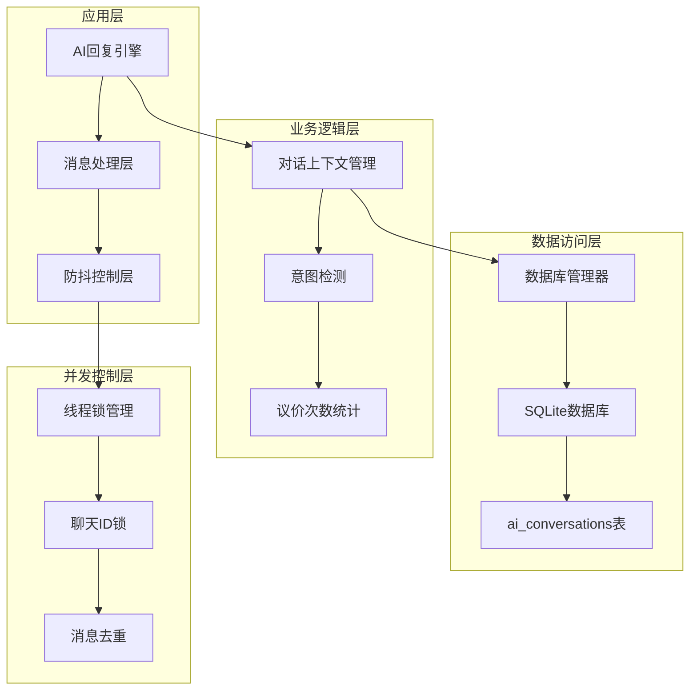

**图表来源**
- [ai_reply_engine.py](file://ai_reply_engine.py#L24-L45)
- [db_manager.py](file://db_manager.py#L16-L52)

## 核心组件分析

### AI回复引擎

AI回复引擎是对话上下文管理的主要协调者，负责整个对话流程的控制和管理。

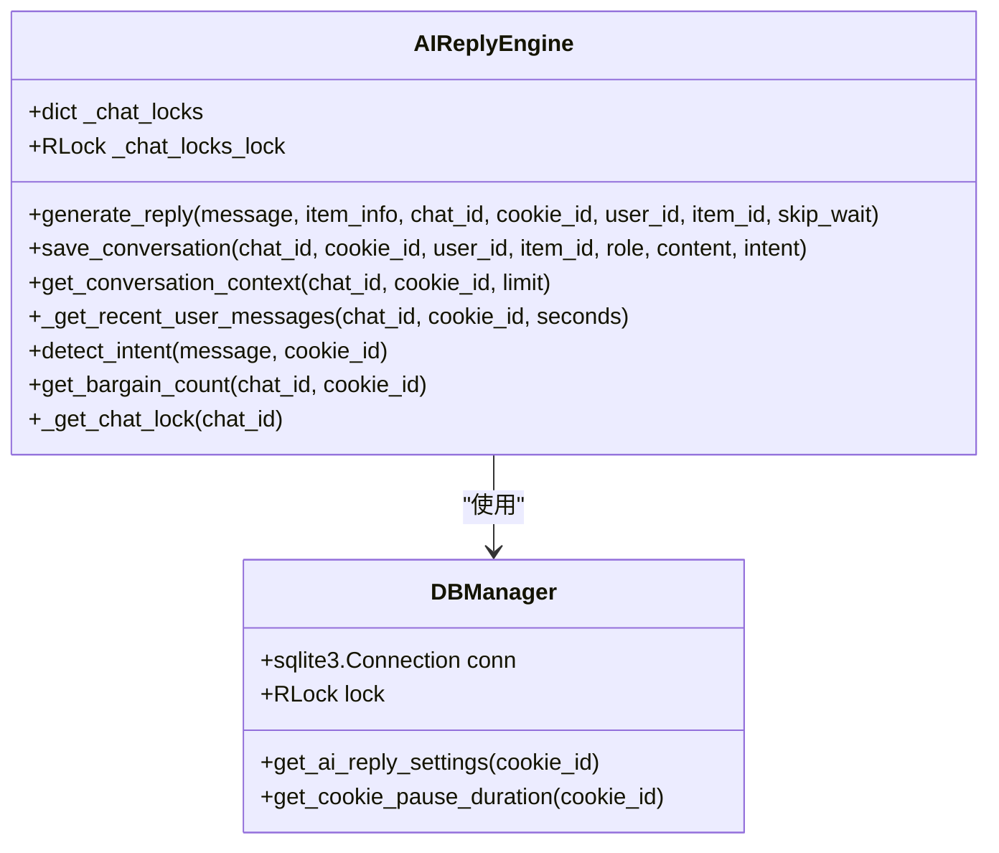

**图表来源**
- [ai_reply_engine.py](file://ai_reply_engine.py#L24-L45)
- [db_manager.py](file://db_manager.py#L16-L52)

**章节来源**
- [ai_reply_engine.py](file://ai_reply_engine.py#L24-L45)
- [db_manager.py](file://db_manager.py#L16-L52)

### 消息处理系统

消息处理系统负责接收、处理和转发聊天消息，同时维护消息的去重和防抖机制。

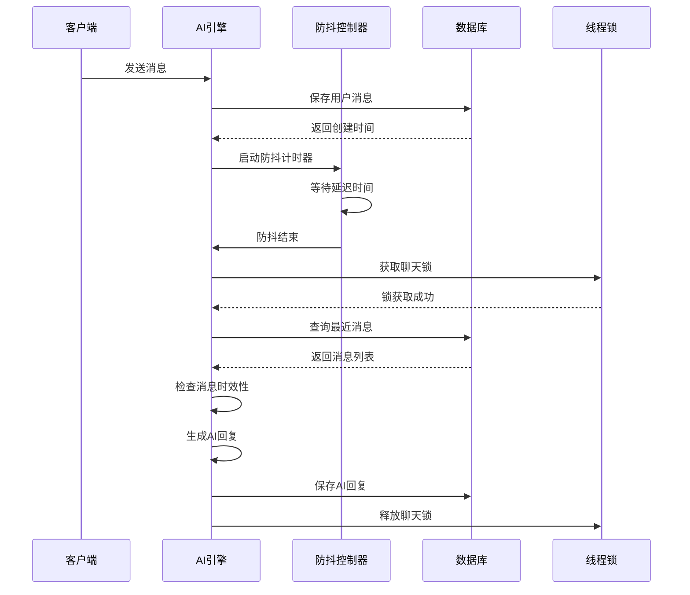

**图表来源**
- [ai_reply_engine.py](file://ai_reply_engine.py#L283-L412)
- [XianyuAutoAsync.py](file://XianyuAutoAsync.py#L6922-L7067)

**章节来源**
- [ai_reply_engine.py](file://ai_reply_engine.py#L283-L412)
- [XianyuAutoAsync.py](file://XianyuAutoAsync.py#L6922-L7067)

## 数据库设计

### ai_conversations表结构

对话历史数据存储在`ai_conversations`表中，该表设计支持完整的对话记录管理：

| 字段名 | 数据类型 | 约束 | 描述 |
|--------|----------|------|------|
| id | INTEGER | PRIMARY KEY AUTOINCREMENT | 主键ID |
| cookie_id | TEXT | NOT NULL | 账号标识符 |
| chat_id | TEXT | NOT NULL | 聊天会话ID |
| user_id | TEXT | NOT NULL | 用户ID |
| item_id | TEXT | NOT NULL | 商品ID |
| role | TEXT | NOT NULL | 角色类型（user/assistant） |
| content | TEXT | NOT NULL | 消息内容 |
| intent | TEXT | NULL | 意图标签 |
| bargain_count | INTEGER | DEFAULT 0 | 议价次数 |
| created_at | TIMESTAMP | DEFAULT CURRENT_TIMESTAMP | 创建时间 |

**章节来源**
- [db_manager.py](file://db_manager.py#L168-L182)

### 数据库连接管理

数据库管理器使用线程安全的连接管理和锁机制：

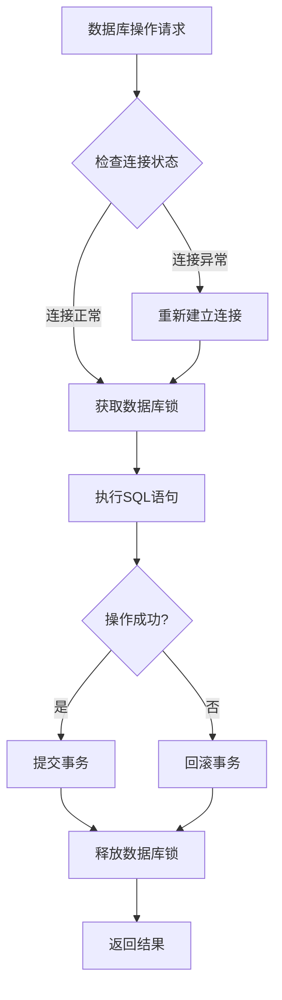

**图表来源**
- [db_manager.py](file://db_manager.py#L16-L52)

**章节来源**
- [db_manager.py](file://db_manager.py#L16-L52)

## 对话上下文管理机制

### save_conversation方法

`save_conversation`方法负责将对话消息持久化到数据库中，确保对话历史的完整性。

#### 方法实现特点

1. **原子性操作**：使用数据库事务确保操作的原子性
2. **时间戳管理**：自动记录消息创建时间
3. **完整性验证**：验证所有必填字段的完整性

#### 数据库操作流程

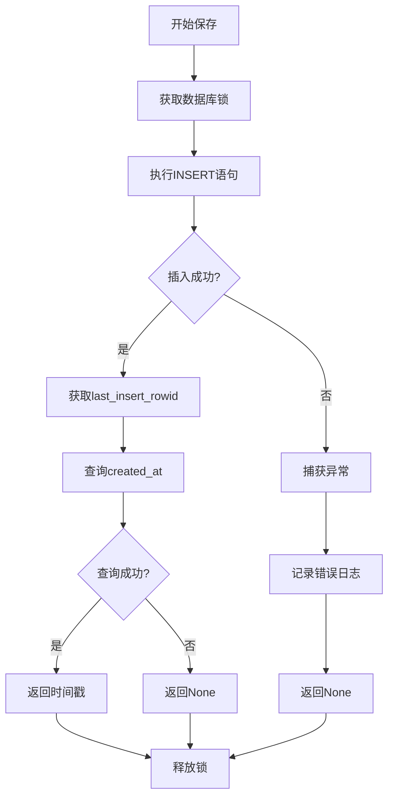

**图表来源**
- [ai_reply_engine.py](file://ai_reply_engine.py#L454-L476)

**章节来源**
- [ai_reply_engine.py](file://ai_reply_engine.py#L454-L476)

### get_conversation_context方法

`get_conversation_context`方法按时间倒序查询最近的对话记录，形成正确的上下文顺序。

#### 查询逻辑分析

1. **时间排序**：按`created_at`降序排列确保最新消息在前
2. **限制数量**：通过LIMIT子句控制返回的消息数量
3. **顺序反转**：在Python层面反转结果列表形成自然阅读顺序

#### 查询优化策略

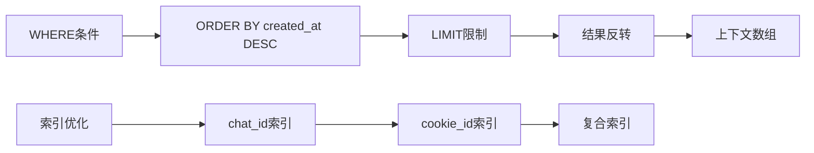

**图表来源**
- [ai_reply_engine.py](file://ai_reply_engine.py#L436-L449)

**章节来源**
- [ai_reply_engine.py](file://ai_reply_engine.py#L436-L449)

### _get_recent_user_messages方法

该方法实现基于时间窗口的消息过滤，是防抖机制的核心组件。

#### 时间窗口算法

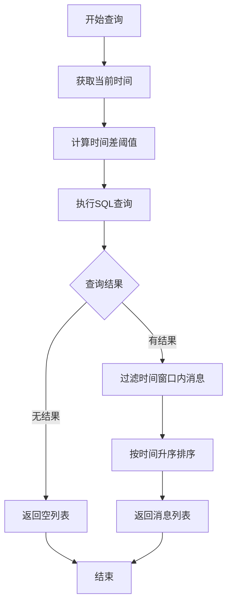

**图表来源**
- [ai_reply_engine.py](file://ai_reply_engine.py#L493-L520)

#### 时间计算机制

系统使用SQLite的`julianday()`函数进行精确的时间计算：

- **时间差计算**：`(julianday('now') - julianday(created_at)) * 86400.0`
- **精度控制**：毫秒级精度确保时间比较的准确性
- **灵活配置**：支持不同时间窗口的动态调整

**章节来源**
- [ai_reply_engine.py](file://ai_reply_engine.py#L493-L520)

## 防抖机制详解

### 防抖原理与实现

防抖机制防止用户连续发送消息时产生过多的AI回复请求，通过延迟处理最后一条消息来优化系统性能。

#### 防抖配置参数

| 参数名 | 默认值 | 描述 | 调整建议 |
|--------|--------|------|----------|
| message_debounce_delay | 1秒 | 防抖延迟时间 | 根据网络状况调整 |
| query_seconds | 6/25秒 | 查询时间窗口 | 外部防抖时使用6秒 |
| message_expire_time | 3600秒 | 消息过期时间 | 根据业务需求调整 |

#### 防抖执行流程

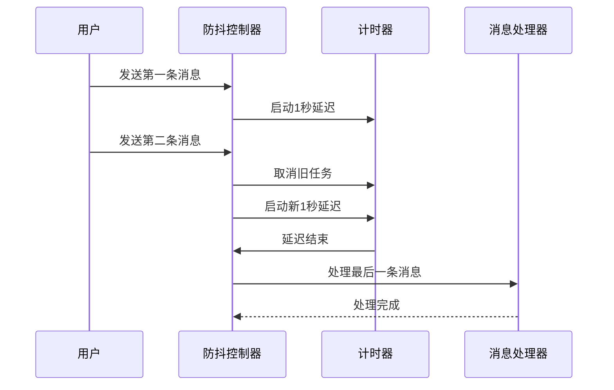

**图表来源**
- [XianyuAutoAsync.py](file://XianyuAutoAsync.py#L6922-L7067)

**章节来源**
- [XianyuAutoAsync.py](file://XianyuAutoAsync.py#L6922-L7067)

### 时间窗口控制

防抖机制通过两个不同的时间窗口实现内外两种防抖策略：

#### 内部防抖（skip_wait=False）

- **等待时间**：10秒固定等待
- **查询窗口**：25秒（10秒等待 + 10秒消息间隔 + 5秒缓冲）
- **适用场景**：系统内部实现的防抖控制

#### 外部防抖（skip_wait=True）

- **等待时间**：1秒固定等待
- **查询窗口**：6秒（1秒防抖 + 5秒缓冲）
- **适用场景**：调用方已实现防抖控制

**章节来源**
- [ai_reply_engine.py](file://ai_reply_engine.py#L310-L316)

### 消息时效性检查

系统通过时间戳比较确保处理的是最新的消息：

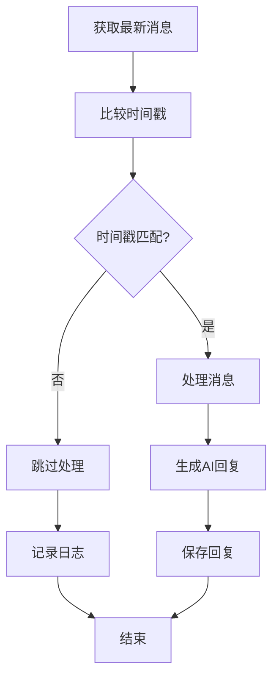

**图表来源**
- [ai_reply_engine.py](file://ai_reply_engine.py#L318-L325)

**章节来源**
- [ai_reply_engine.py](file://ai_reply_engine.py#L318-L325)

## 并发控制与线程安全

### _chat_locks机制

系统使用基于聊天ID的线程锁确保同一对话的消息串行处理，防止并发冲突。

#### 锁管理架构

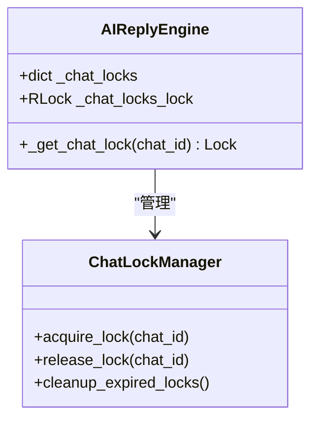

**图表来源**
- [ai_reply_engine.py](file://ai_reply_engine.py#L276-L281)

#### 锁获取流程

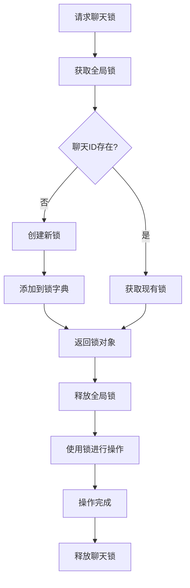

**图表来源**
- [ai_reply_engine.py](file://ai_reply_engine.py#L276-L281)

**章节来源**
- [ai_reply_engine.py](file://ai_reply_engine.py#L276-L281)

### 消息去重机制

系统维护消息ID去重字典防止重复处理相同消息：

#### 去重策略

1. **时间戳记录**：记录每个消息的处理时间
2. **定期清理**：清理过期的消息ID记录
3. **容量控制**：限制去重字典的最大容量

#### 内存管理

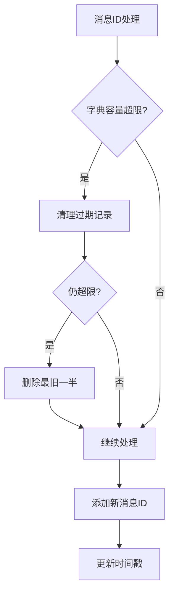

**图表来源**
- [XianyuAutoAsync.py](file://XianyuAutoAsync.py#L6971-L6994)

**章节来源**
- [XianyuAutoAsync.py](file://XianyuAutoAsync.py#L6971-L6994)

### 数据库锁机制

数据库操作使用可重入锁确保线程安全：

#### 锁层级设计

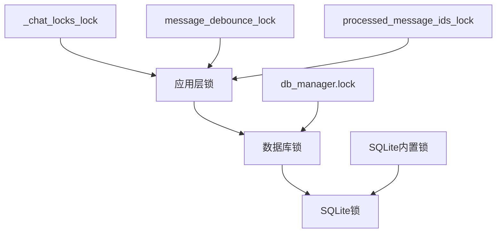

**图表来源**
- [ai_reply_engine.py](file://ai_reply_engine.py#L35-L36)
- [db_manager.py](file://db_manager.py#L51)

**章节来源**
- [ai_reply_engine.py](file://ai_reply_engine.py#L35-L36)
- [db_manager.py](file://db_manager.py#L51)

## 性能优化策略

### 查询性能优化

#### 索引策略

为了提高查询性能，系统在关键字段上建立了适当的索引：

| 表名 | 索引字段 | 索引类型 | 用途 |
|------|----------|----------|------|
| ai_conversations | chat_id | 单列索引 | 聊天会话查询 |
| ai_conversations | cookie_id | 单列索引 | 账号查询 |
| ai_conversations | (chat_id, cookie_id) | 复合索引 | 组合查询优化 |
| ai_conversations | created_at | 单列索引 | 时间范围查询 |

#### 查询优化技巧

1. **LIMIT限制**：避免返回过多数据
2. **时间窗口过滤**：减少不必要的数据扫描
3. **索引选择**：优先使用复合索引

### 内存优化

#### 缓存策略

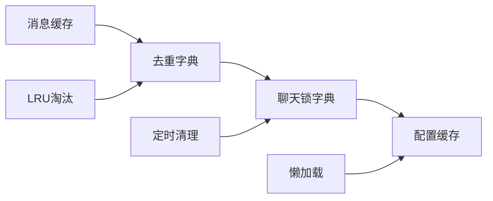

#### 内存使用控制

- **去重字典大小**：限制为10000条记录
- **聊天锁清理**：定期清理过期的锁对象
- **缓存失效**：基于时间的缓存失效机制

### 数据库连接优化

#### 连接池管理

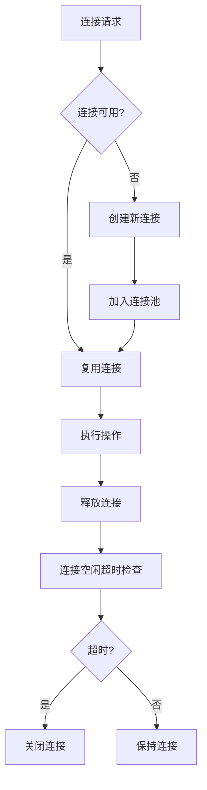

**图表来源**
- [db_manager.py](file://db_manager.py#L16-L52)

**章节来源**
- [db_manager.py](file://db_manager.py#L16-L52)

## 故障排除指南

### 常见问题及解决方案

#### 数据库锁竞争问题

**问题现象**：
- 系统响应缓慢
- 出现数据库锁定错误
- 消息处理延迟

**诊断方法**：
1. 检查数据库连接状态
2. 监控锁等待时间
3. 分析慢查询日志

**解决方案**：
```python
# 优化数据库操作
with db_manager.lock:
    # 批量操作
    cursor.executemany(sql, params)
    db_manager.conn.commit()

# 设置合理的超时时间
db_manager.conn.execute('PRAGMA busy_timeout = 30000')
```

#### 消息丢失问题

**问题现象**：
- 某些消息未得到回复
- 对话历史不完整
- AI回复不准确

**排查步骤**：
1. 检查消息去重机制
2. 验证防抖配置
3. 确认数据库插入状态

**预防措施**：
```python
# 增强消息处理的可靠性
def robust_save_conversation(self, *args, **kwargs):
    try:
        return self.save_conversation(*args, **kwargs)
    except sqlite3.Error as e:
        logger.error(f"保存对话记录失败: {e}")
        # 尝试重新保存
        time.sleep(1)
        return self.save_conversation(*args, **kwargs)
```

#### 并发冲突问题

**问题现象**：
- 线程安全异常
- 数据不一致
- 死锁现象

**解决策略**：
1. 使用适当的锁粒度
2. 实现锁超时机制
3. 避免嵌套锁

**章节来源**
- [ai_reply_engine.py](file://ai_reply_engine.py#L454-L476)
- [db_manager.py](file://db_manager.py#L16-L52)

### 性能监控指标

#### 关键性能指标

| 指标名称 | 正常范围 | 监控方法 | 优化目标 |
|----------|----------|----------|----------|
| 消息处理延迟 | < 5秒 | 日志时间戳对比 | 减少防抖延迟 |
| 数据库查询时间 | < 100ms | SQL执行时间 | 优化查询索引 |
| 内存使用率 | < 80% | 系统监控 | 控制缓存大小 |
| 锁等待时间 | < 1秒 | 锁监控日志 | 减少锁竞争 |

#### 监控告警设置

```python
# 性能监控示例
def monitor_performance():
    metrics = {
        'db_query_time': db_query_timer.elapsed,
        'message_processing_time': process_timer.elapsed,
        'memory_usage': memory_tracker.get_usage(),
        'lock_wait_time': lock_monitor.get_wait_time()
    }
    
    # 告警阈值检查
    if metrics['db_query_time'] > 1.0:
        logger.warning(f"数据库查询时间过长: {metrics['db_query_time']}秒")
    
    return metrics
```

## 最佳实践建议

### 配置优化建议

#### 防抖时间配置

根据业务场景调整防抖参数：

```yaml
# 高频聊天场景
message_debounce_delay: 0.5  # 更快响应
query_seconds: 3           # 较短查询窗口

# 低频聊天场景  
message_debounce_delay: 2.0  # 更保守的防抖
query_seconds: 10          # 较长查询窗口
```

#### 数据库性能调优

```python
# 数据库连接优化
db_manager.conn.execute('PRAGMA journal_mode = WAL')
db_manager.conn.execute('PRAGMA synchronous = NORMAL')
db_manager.conn.execute('PRAGMA cache_size = 10000')

# 查询优化
db_manager.conn.execute('''
    CREATE INDEX IF NOT EXISTS idx_ai_conv_chat_cookie 
    ON ai_conversations (chat_id, cookie_id, created_at DESC)
''')
```

### 开发规范建议

#### 错误处理规范

```python
def safe_database_operation(func):
    """数据库操作装饰器，提供统一的错误处理"""
    @wraps(func)
    def wrapper(*args, **kwargs):
        try:
            return func(*args, **kwargs)
        except sqlite3.Error as e:
            logger.error(f"数据库操作失败: {e}")
            # 根据错误类型决定是否重试
            if "database is locked" in str(e):
                time.sleep(0.1)
                return func(*args, **kwargs)
            raise
    return wrapper
```

#### 日志记录规范

```python
# 详细的日志记录
logger.info(f"保存对话记录: chat_id={chat_id}, "
           f"role={role}, length={len(content)}")
logger.debug(f"查询最近消息: chat_id={chat_id}, "
            f"seconds={seconds}, count={len(messages)}")
```

### 部署运维建议

#### 监控配置

1. **数据库健康检查**：定期检查连接状态
2. **性能指标监控**：跟踪查询时间和锁等待
3. **资源使用监控**：监控内存和CPU使用率

#### 备份策略

```python
# 定期备份对话历史
def backup_conversation_data():
    backup_path = f"data/backup/conversations_{time.strftime('%Y%m%d_%H%M%S')}.db"
    shutil.copy2(db_manager.db_path, backup_path)
    logger.info(f"创建对话历史备份: {backup_path}")
```

通过遵循这些最佳实践，可以确保对话上下文管理系统的稳定性、性能和可维护性，为用户提供优质的AI对话体验。