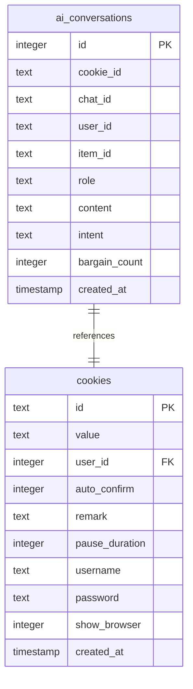
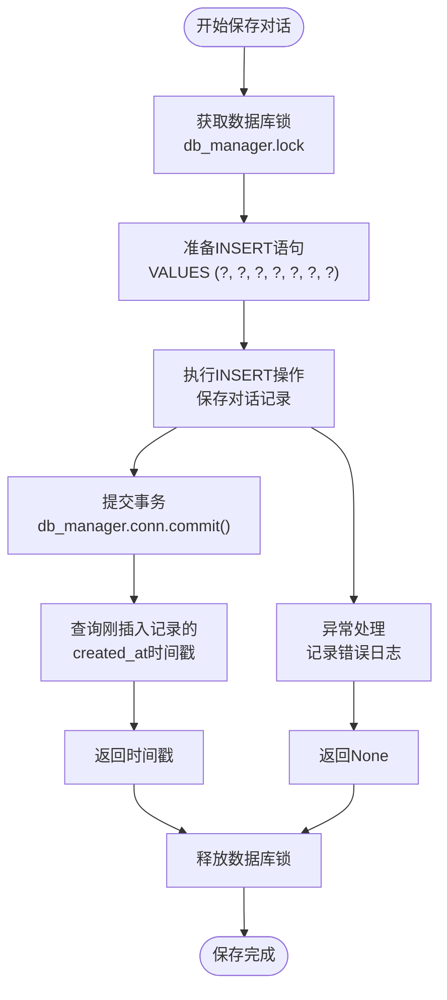
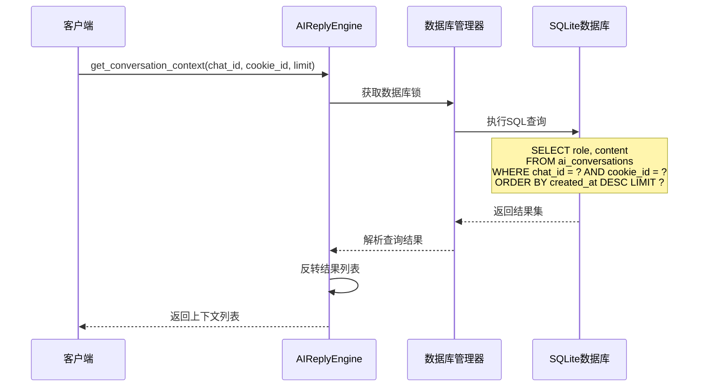
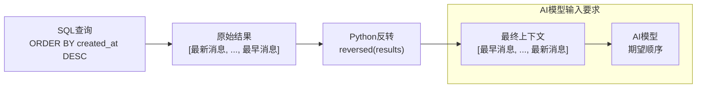
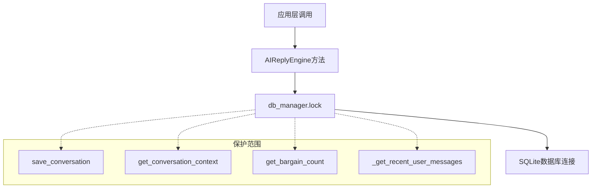
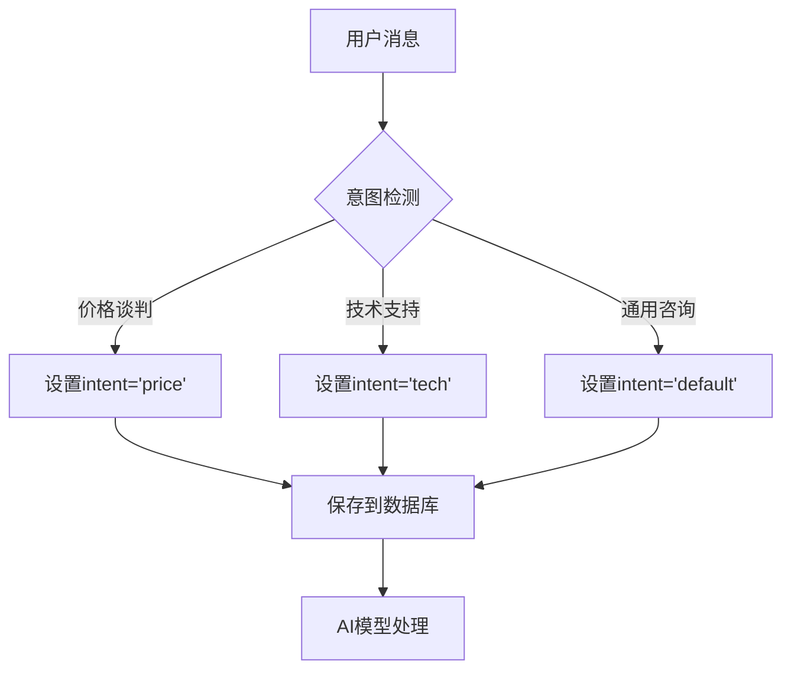
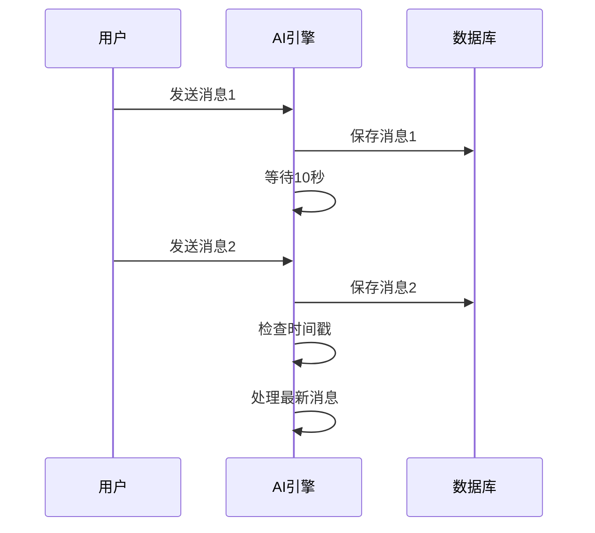

# 对话历史管理

<cite>
**本文档中引用的文件**
- [db_manager.py](file://db_manager.py)
- [ai_reply_engine.py](file://ai_reply_engine.py)
</cite>

## 目录
1. [简介](#简介)
2. [数据库架构](#数据库架构)
3. [对话历史存储机制](#对话历史存储机制)
4. [对话历史检索机制](#对话历史检索机制)
5. [线程安全保护](#线程安全保护)
6. [性能优化建议](#性能优化建议)
7. [最佳实践](#最佳实践)
8. [总结](#总结)

## 简介

对话历史管理是本项目中AI回复引擎的核心功能之一，负责记录和检索用户与AI助手之间的交互历史。系统通过SQLite数据库的`ai_conversations`表实现对话历史的持久化存储，并提供了高效的检索机制来支持AI模型的上下文理解。

## 数据库架构

### ai_conversations表结构

`ai_conversations`表是对话历史管理的核心数据结构，包含以下字段：

| 字段名 | 类型 | 约束 | 描述 |
|--------|------|------|------|
| id | INTEGER | PRIMARY KEY AUTOINCREMENT | 自增主键 |
| cookie_id | TEXT | NOT NULL | 用户会话标识符 |
| chat_id | TEXT | NOT NULL | 对话标识符 |
| user_id | TEXT | NOT NULL | 用户标识符 |
| item_id | TEXT | NOT NULL | 商品标识符 |
| role | TEXT | NOT NULL | 消息角色（user/assistant） |
| content | TEXT | NOT NULL | 消息内容 |
| intent | TEXT | NULLABLE | 消息意图分类 |
| bargain_count | INTEGER | DEFAULT 0 | 议价计数 |
| created_at | TIMESTAMP | DEFAULT CURRENT_TIMESTAMP | 创建时间 |



**图表来源**
- [db_manager.py](file://db_manager.py#L169-L182)

**章节来源**
- [db_manager.py](file://db_manager.py#L169-L182)

## 对话历史存储机制

### save_conversation方法详解

`save_conversation`方法负责将单条对话记录持久化到数据库中，其核心实现包含以下关键步骤：

#### 方法签名与参数
- **参数**：`chat_id`, `cookie_id`, `user_id`, `item_id`, `role`, `content`, `intent`
- **返回值**：创建时间戳字符串，用于后续消息排序和验证

#### 存储流程



**图表来源**
- [ai_reply_engine.py](file://ai_reply_engine.py#L454-L476)

#### 关键实现细节

1. **原子性操作**：使用数据库事务确保插入操作的原子性
2. **时间戳获取**：通过`last_insert_rowid()`函数获取刚插入记录的创建时间
3. **异常处理**：完善的错误处理机制，确保系统稳定性

#### 字段映射关系

| 参数名 | 数据库字段 | 类型 | 必填 | 描述 |
|--------|------------|------|------|------|
| cookie_id | cookie_id | TEXT | 是 | 用户会话标识符 |
| chat_id | chat_id | TEXT | 是 | 对话标识符 |
| user_id | user_id | TEXT | 是 | 用户标识符 |
| item_id | item_id | TEXT | 是 | 商品标识符 |
| role | role | TEXT | 是 | 消息角色 |
| content | content | TEXT | 是 | 消息内容 |
| intent | intent | TEXT | 否 | 消息意图分类 |

**章节来源**
- [ai_reply_engine.py](file://ai_reply_engine.py#L454-L476)

## 对话历史检索机制

### get_conversation_context方法详解

`get_conversation_context`方法实现了高效的对话历史检索功能，支持按时间倒序获取最近的N条消息。

#### 检索策略



**图表来源**
- [ai_reply_engine.py](file://ai_reply_engine.py#L436-L449)

#### 查询语句分析

```sql
SELECT role, content 
FROM ai_conversations 
WHERE chat_id = ? AND cookie_id = ? 
ORDER BY created_at DESC LIMIT ?
```

#### 关键特性

1. **时间倒序排列**：使用`ORDER BY created_at DESC`确保最新消息在前
2. **限制结果数量**：通过`LIMIT ?`参数控制返回的消息数量
3. **结果反转**：使用`reversed(results)`将结果从最新到最旧的顺序返回

#### 上下文构建过程



**图表来源**
- [ai_reply_engine.py](file://ai_reply_engine.py#L448)

#### 性能考虑

- **索引优化**：建议为`chat_id`和`cookie_id`字段创建复合索引
- **LIMIT参数**：合理设置`limit`参数平衡上下文质量和API成本
- **内存使用**：对于大量历史消息，考虑分页加载策略

**章节来源**
- [ai_reply_engine.py](file://ai_reply_engine.py#L436-L449)

## 线程安全保护

### 数据库连接保护机制

系统采用多层次的线程安全保护机制，确保并发访问的安全性：

#### 锁机制层次



**图表来源**
- [ai_reply_engine.py](file://ai_reply_engine.py#L458-L459)
- [ai_reply_engine.py](file://ai_reply_engine.py#L439-L440)

#### 锁的具体应用

1. **可重入锁**：使用`threading.RLock()`支持嵌套锁定
2. **作用域明确**：仅在数据库操作期间持有锁
3. **异常安全**：确保异常情况下锁能够正确释放

#### 并发控制策略

| 方法 | 锁持有时间 | 并发安全性 | 性能影响 |
|------|------------|------------|----------|
| save_conversation | 写操作期间 | 完全隔离 | 中等 |
| get_conversation_context | 读操作期间 | 读写互斥 | 较低 |
| get_bargain_count | 统计查询 | 读读并发 | 很低 |

**章节来源**
- [db_manager.py](file://db_manager.py#L51)
- [ai_reply_engine.py](file://ai_reply_engine.py#L458-L459)

## 性能优化建议

### 数据库索引优化

#### 推荐索引方案

```sql
-- 复合索引：提高聊天历史查询效率
CREATE INDEX idx_ai_conversations_chat_cookie ON ai_conversations(chat_id, cookie_id);

-- 时间索引：加速时间范围查询
CREATE INDEX idx_ai_conversations_created_at ON ai_conversations(created_at);
```

#### 索引选择原则

1. **查询频率**：优先为高频查询字段创建索引
2. **选择性**：选择性高的字段更适合创建索引
3. **维护成本**：平衡查询性能提升与索引维护开销

### 查询性能优化

#### LIMIT参数调优

| limit值 | 上下文长度 | API成本 | 性能影响 | 适用场景 |
|---------|------------|---------|----------|----------|
| 5-10 | 短上下文 | 低 | 极快 | 简单对话 |
| 15-25 | 中等上下文 | 中等 | 快 | 复杂对话 |
| 30-50 | 长上下文 | 高 | 慢 | 详细讨论 |

#### 分页策略

对于历史消息较多的对话，建议采用分页加载：

```python
def get_conversation_paginated(chat_id, cookie_id, page=1, page_size=20):
    offset = (page - 1) * page_size
    cursor.execute('''
        SELECT role, content FROM ai_conversations 
        WHERE chat_id = ? AND cookie_id = ? 
        ORDER BY created_at DESC LIMIT ? OFFSET ?
    ''', (chat_id, cookie_id, page_size, offset))
```

### 内存优化

#### 对象池化

```python
# 缓存常用查询结果
conversation_cache = {}

def get_cached_context(chat_id, cookie_id, limit=20):
    cache_key = f"{chat_id}:{cookie_id}:{limit}"
    if cache_key not in conversation_cache:
        conversation_cache[cache_key] = get_conversation_context(chat_id, cookie_id, limit)
    return conversation_cache[cache_key]
```

#### 垃圾回收优化

定期清理过期的对话历史：

```python
def cleanup_old_conversations(days=30):
    cursor.execute('''
        DELETE FROM ai_conversations 
        WHERE created_at < datetime('now', ? || ' days')
    ''', (-days,))
```

## 最佳实践

### 对话历史管理最佳实践

#### 1. 消息分类与意图识别



**图表来源**
- [ai_reply_engine.py](file://ai_reply_engine.py#L237-L274)

#### 2. 议价次数控制

系统通过`get_bargain_count`方法实现议价轮次控制：

```python
def check_bargain_limit(chat_id, cookie_id, settings):
    bargain_count = get_bargain_count(chat_id, cookie_id)
    max_rounds = settings.get('max_bargain_rounds', 3)
    
    if bargain_count >= max_rounds:
        return True  # 达到上限
    return False     # 可继续议价
```

#### 3. 消息去重与防抖



**图表来源**
- [ai_reply_engine.py](file://ai_reply_engine.py#L300-L325)

#### 4. 错误处理与恢复

```python
def robust_save_conversation(*args, **kwargs):
    try:
        return save_conversation(*args, **kwargs)
    except sqlite3.Error as e:
        logger.error(f"数据库错误: {e}")
        # 尝试重新连接
        db_manager.reconnect()
        return save_conversation(*args, **kwargs)
    except Exception as e:
        logger.error(f"未知错误: {e}")
        return None
```

### 监控与维护

#### 关键指标监控

| 指标 | 监控方法 | 告警阈值 | 处理措施 |
|------|----------|----------|----------|
| 数据库连接数 | 连接池监控 | >80% | 扩容或优化查询 |
| 查询响应时间 | SQL日志分析 | >100ms | 优化索引或查询 |
| 存储空间使用率 | 文件系统监控 | >80% | 清理历史数据 |
| 错误率 | 日志统计 | >5% | 检查数据库状态 |

#### 定期维护任务

```python
def maintenance_tasks():
    # 清理过期数据
    cleanup_old_conversations(days=90)
    
    # 优化数据库
    cursor.execute('VACUUM')
    cursor.execute('ANALYZE')
    
    # 备份重要数据
    export_backup(['ai_conversations', 'ai_reply_settings'])
```

## 总结

对话历史管理系统通过SQLite数据库的`ai_conversations`表实现了高效、可靠的对话记录和检索功能。系统具备以下核心优势：

1. **完整的数据模型**：涵盖用户、对话、商品等多维度信息
2. **高效的检索机制**：基于时间倒序的快速查询
3. **完善的线程安全**：多层次的并发控制保护
4. **灵活的扩展性**：支持多种消息类型和意图分类
5. **良好的性能特征**：可通过索引和参数优化满足不同需求

通过合理的索引设计、查询参数调优和定期维护，系统能够在保证数据完整性的同时，提供优秀的用户体验和系统性能。开发者可以根据具体业务需求，在性能、成本和功能之间找到最佳平衡点。