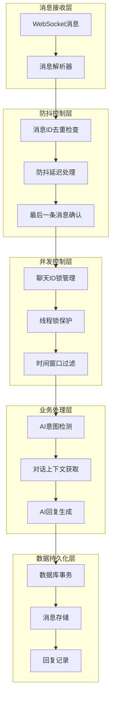
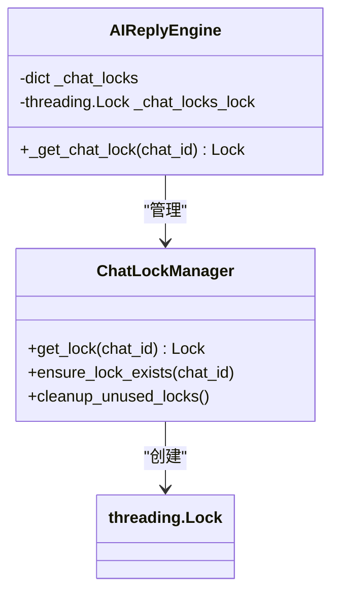
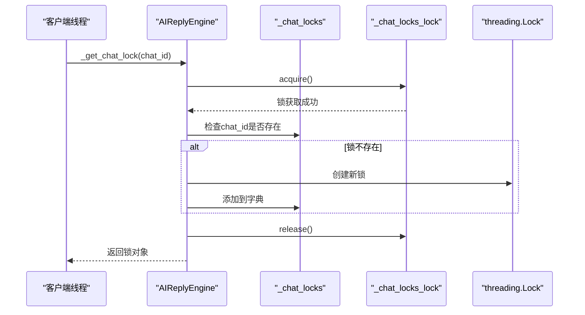
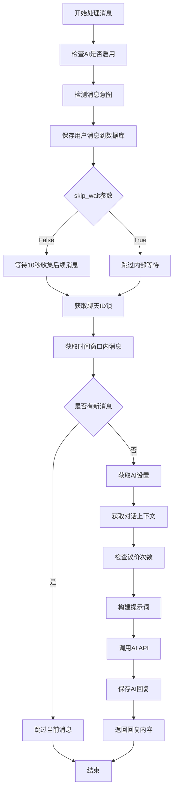
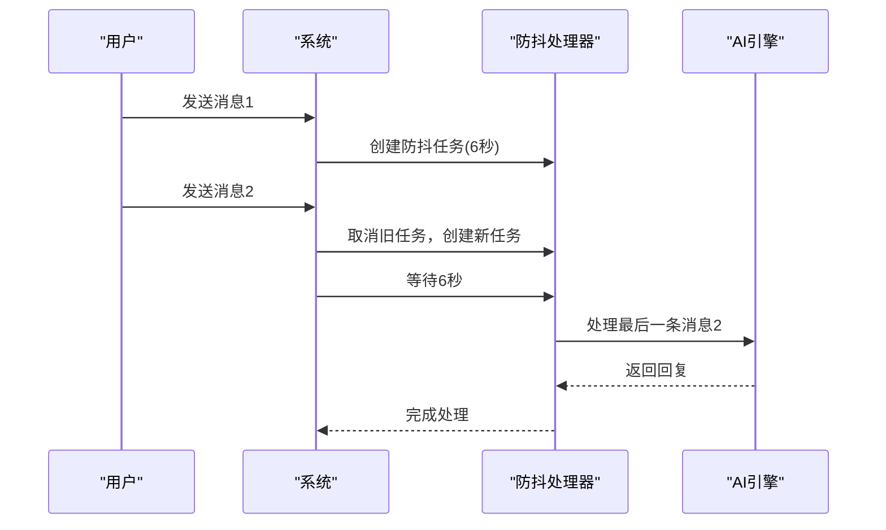
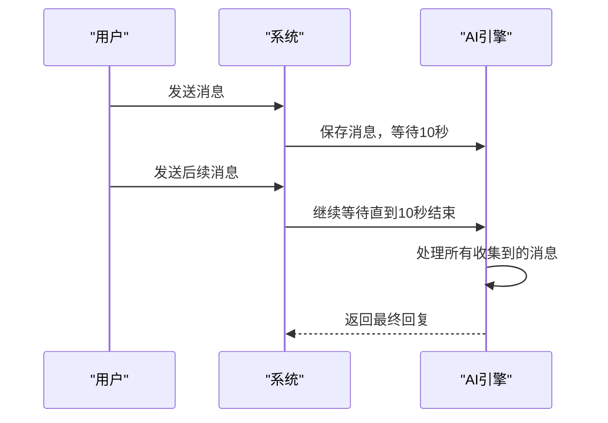
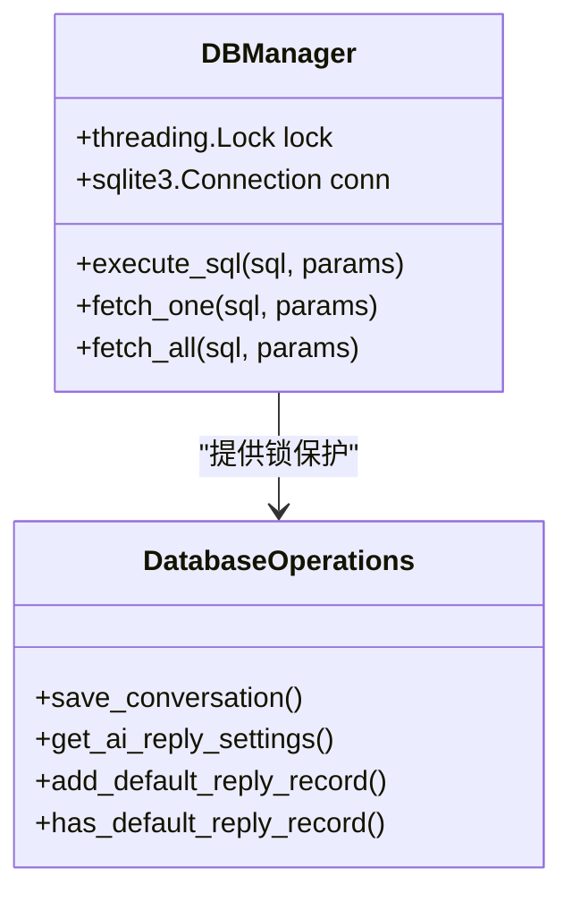

# 防抖与并发控制

<cite>
**本文档引用的文件**
- [ai_reply_engine.py](file://ai_reply_engine.py)
- [XianyuAutoAsync.py](file://XianyuAutoAsync.py)
- [db_manager.py](file://db_manager.py)
- [config.py](file://config.py)
- [global_config.yml](file://global_config.yml)
</cite>

## 目录
1. [简介](#简介)
2. [系统架构概览](#系统架构概览)
3. [_get_recent_user_messages方法详解](#_get_recent_user_messages方法详解)
4. [_chat_locks并发控制机制](#_chat_locks并发控制机制)
5. [generate_reply方法流程分析](#generate_reply方法流程分析)
6. [防抖机制实现](#防抖机制实现)
7. [数据库锁竞争处理](#数据库锁竞争处理)
8. [配置建议与最佳实践](#配置建议与最佳实践)
9. [常见问题与解决方案](#常见问题与解决方案)
10. [总结](#总结)

## 简介

本系统采用多层次的防抖与并发控制机制，确保在高并发场景下能够正确处理用户消息，避免重复回复和消息丢失。系统通过SQLite的`julianday`函数计算时间差，结合Python的线程锁机制，实现了高效的消息去重和串行化处理。

## 系统架构概览

系统采用分层架构设计，包含消息处理层、防抖控制层、并发控制层和数据库访问层：



**图表来源**
- [XianyuAutoAsync.py](file://XianyuAutoAsync.py#L6922-L7067)
- [ai_reply_engine.py](file://ai_reply_engine.py#L283-L413)

## _get_recent_user_messages方法详解

### SQLite julianday函数的应用

`_get_recent_user_messages`方法是系统防抖机制的核心，它利用SQLite的`julianday`函数精确计算时间差：

```mermaid
flowchart TD
A[开始查询] --> B[获取数据库锁]
B --> C[调试查询: 最近10条消息]
C --> D[正式查询: 时间窗口内消息]
D --> E[julianday('now') - julianday(created_at) 计算时间差]
E --> F[转换为秒: × 86400.0]
F --> G[SQL条件: < (? / 86400.0)]
G --> H[按时间升序排序]
H --> I[返回消息列表]
I --> J[结束]
```

**图表来源**
- [ai_reply_engine.py](file://ai_reply_engine.py#L493-L520)

### 时间窗口计算原理

系统使用`julianday`函数进行时间差计算，其核心公式为：

- **时间差天数**: `julianday('now') - julianday(created_at)`
- **转换为秒**: `(julianday('now') - julianday(created_at)) * 86400.0`

这种计算方式具有以下优势：
1. **跨平台一致性**: SQLite的`julianday`函数在不同平台上表现一致
2. **精度可控**: 基于儒略日计算，避免时区问题
3. **性能优化**: 数据库存储在索引上，查询效率高

### 查询参数配置

方法接受两个关键参数：
- `chat_id`: 聊天会话标识符
- `seconds`: 时间窗口大小（默认2秒）

**节来源**
- [ai_reply_engine.py](file://ai_reply_engine.py#L493-L520)

## _chat_locks并发控制机制

### 动态锁管理架构

系统通过`_chat_locks`字典为每个`chat_id`动态创建独立的`threading.Lock`对象：



**图表来源**
- [ai_reply_engine.py](file://ai_reply_engine.py#L276-L281)

### 线程安全的锁获取

`_get_chat_lock`方法确保锁的创建和访问都是线程安全的：



**图表来源**
- [ai_reply_engine.py](file://ai_reply_engine.py#L276-L281)

### _chat_locks_lock的作用

`_chat_locks_lock`是一个全局锁，专门用于保护对`_chat_locks`字典本身的线程安全访问：

1. **字典操作保护**: 确保多个线程同时访问不同`chat_id`时不会冲突
2. **内存泄漏防护**: 防止因竞态条件导致的锁对象泄漏
3. **性能平衡**: 相比于为每个`chat_id`都创建锁，这种方式更节省内存

**节来源**
- [ai_reply_engine.py](file://ai_reply_engine.py#L33-L35)

## generate_reply方法流程分析

### 主流程控制

`generate_reply`方法是整个回复生成的核心入口，实现了完整的防抖和并发控制流程：



**图表来源**
- [ai_reply_engine.py](file://ai_reply_engine.py#L283-L413)

### 时间窗口配置策略

系统根据`skip_wait`参数动态调整时间窗口大小：

| 参数值 | 时间窗口 | 适用场景 | 缓冲时间 |
|--------|----------|----------|----------|
| False | 25秒 | 内部防抖模式 | 10秒等待 + 10秒消息间隔 + 5秒缓冲 |
| True | 6秒 | 外部防抖模式 | 1秒防抖 + 5秒缓冲 |

这种设计允许调用方根据具体需求灵活选择防抖策略。

### 消息时效性验证

系统通过比较消息创建时间和最新消息的时间戳来确保处理的是最新消息：

```python
# 核心验证逻辑路径
if message_created_at != latest_message['created_at']:
    logger.info(f"检测到有更新的消息，跳过当前消息")
    return None
```

**节来源**
- [ai_reply_engine.py](file://ai_reply_engine.py#L283-L413)

## 防抖机制实现

### 外部防抖vs内部等待

系统提供了两种防抖策略，分别适用于不同的应用场景：

#### 外部防抖（skip_wait=True）



**图表来源**
- [XianyuAutoAsync.py](file://XianyuAutoAsync.py#L6922-L7067)

#### 内部等待（skip_wait=False）



### 防抖延迟配置

系统通过`message_debounce_delay`参数控制防抖延迟时间：

```python
# 防抖延迟配置示例
self.message_debounce_delay = 1.0  # 1秒防抖延迟
```

这个配置决定了系统等待用户停止输入的时间长度。

**节来源**
- [XianyuAutoAsync.py](file://XianyuAutoAsync.py#L6922-L7067)

## 数据库锁竞争处理

### 数据库连接管理

系统通过`db_manager.lock`确保数据库操作的线程安全：



**图表来源**
- [db_manager.py](file://db_manager.py#L1935-L1972)

### 锁竞争预防策略

1. **最小化锁持有时间**: 所有数据库操作都在锁保护下快速完成
2. **避免嵌套锁**: 不在持有锁的情况下调用外部函数
3. **及时释放锁**: 操作完成后立即释放锁

### 并发写入处理

对于高并发场景，系统采用了以下策略：

- **乐观锁**: 使用SQLite的内置事务机制
- **重试机制**: 对于短暂的锁竞争，系统会自动重试
- **超时控制**: 设置合理的数据库操作超时时间

**节来源**
- [db_manager.py](file://db_manager.py#L1935-L1972)

## 配置建议与最佳实践

### 时间窗口调优

根据业务场景调整时间窗口配置：

| 场景类型 | 推荐时间窗口 | 说明 |
|----------|--------------|------|
| 快速回复 | 6秒 | 外部防抖+实时处理 |
| 稳定回复 | 25秒 | 内部等待+消息收集 |
| 高并发 | 3-5秒 | 减少延迟，提高响应速度 |
| 低延迟 | 1-2秒 | 实时交互场景 |

### 防抖延迟优化

```yaml
# global_config.yml 配置示例
MESSAGE_DEBOUNCE_DELAY: 1.0  # 防抖延迟时间（秒）
MESSAGE_EXPIRE_TIME: 300000  # 消息过期时间（毫秒）
```

### 锁资源管理

- **监控锁使用情况**: 定期检查`_chat_locks`字典的大小
- **清理无用锁**: 实现定期清理机制，避免内存泄漏
- **合理设置超时**: 为数据库操作设置适当的超时时间

## 常见问题与解决方案

### 问题1: 消息重复发送

**现象**: 用户收到多条相同的回复

**原因分析**:
1. 多个异步任务同时处理同一消息
2. 防抖机制失效
3. 数据库锁竞争导致消息被多次处理

**解决方案**:
```python
# 在generate_reply方法中添加消息ID去重检查
message_id = hashlib.md5(f"{chat_id}_{message}".encode()).hexdigest()
if self._processed_messages.get(message_id):
    logger.info(f"消息已处理过，跳过: {message_id}")
    return None
self._processed_messages[message_id] = True
```

### 问题2: 数据库锁超时

**现象**: 数据库操作频繁出现超时错误

**原因分析**:
1. 数据库连接池配置不当
2. 长时间持有的数据库锁
3. 高并发场景下的锁竞争

**解决方案**:
```python
# 增加数据库超时时间
db_manager.set_timeout(30)  # 30秒超时

# 优化数据库操作，减少锁持有时间
with db_manager.lock:
    # 快速执行的数据库操作
    cursor.execute("INSERT ...")
    db_manager.conn.commit()
```

### 问题3: 内存泄漏

**现象**: `_chat_locks`字典持续增长，占用大量内存

**原因分析**:
1. 聊天会话结束后未清理锁
2. 异常情况下锁未正确释放
3. 长时间运行导致锁累积

**解决方案**:
```python
# 实现定期清理机制
def cleanup_unused_locks(self, max_age_seconds=3600):
    current_time = time.time()
    expired_keys = [
        chat_id for chat_id, lock_info in self._chat_locks.items()
        if current_time - lock_info['last_access'] > max_age_seconds
    ]
    for key in expired_keys:
        del self._chat_locks[key]
```

### 问题4: 性能瓶颈

**现象**: 系统响应变慢，消息处理延迟增加

**原因分析**:
1. 锁竞争过于激烈
2. 数据库查询效率低下
3. 防抖机制影响用户体验

**解决方案**:
```python
# 优化查询性能
cursor.execute('''
    SELECT content, created_at FROM ai_conversations 
    WHERE chat_id = ? AND cookie_id = ? AND role = 'user' 
    AND julianday('now') - julianday(created_at) < (? / 86400.0)
    ORDER BY created_at ASC
''', (chat_id, cookie_id, seconds))

# 添加索引加速查询
cursor.execute('CREATE INDEX IF NOT EXISTS idx_chat_time ON ai_conversations (chat_id, created_at)')
```

## 总结

本系统通过多层次的防抖与并发控制机制，实现了高效、可靠的消息处理系统：

1. **SQLite julianday函数**: 精确计算时间差，实现智能防抖
2. **动态锁管理**: 为每个聊天会话创建独立锁，确保消息串行化处理
3. **双重防抖机制**: 支持外部防抖和内部等待两种策略
4. **数据库锁保护**: 确保数据一致性和线程安全
5. **性能优化**: 通过索引、缓存和异步处理提升系统性能

这套机制不仅有效防止了重复回复和消息丢失，还为高并发场景提供了可靠的解决方案。开发者可以根据具体业务需求，灵活调整各项配置参数，以达到最佳的系统性能和用户体验。