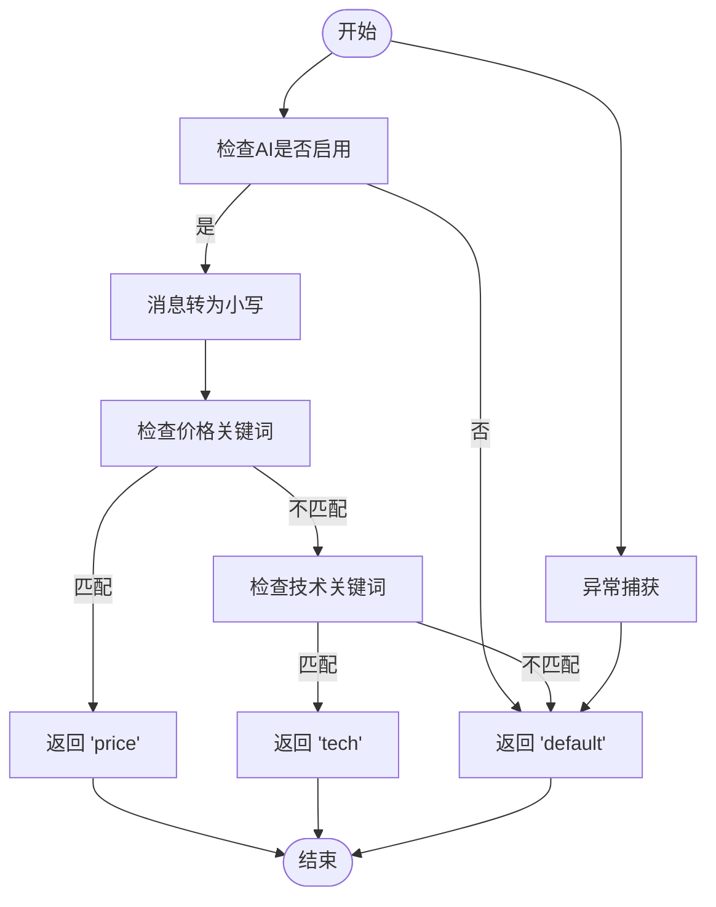
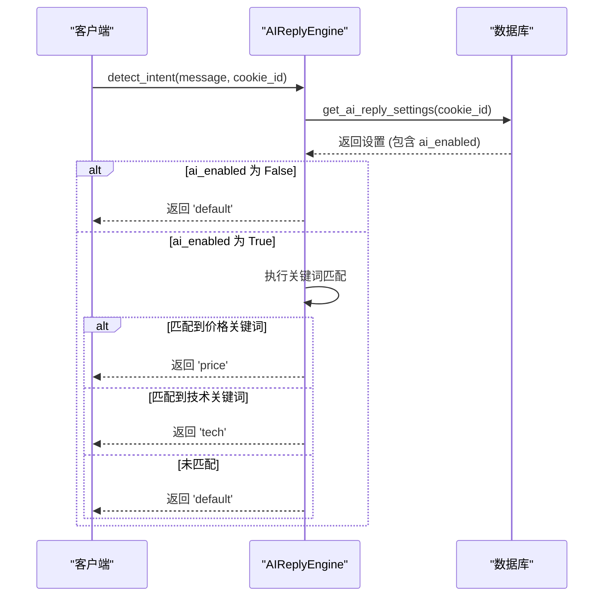
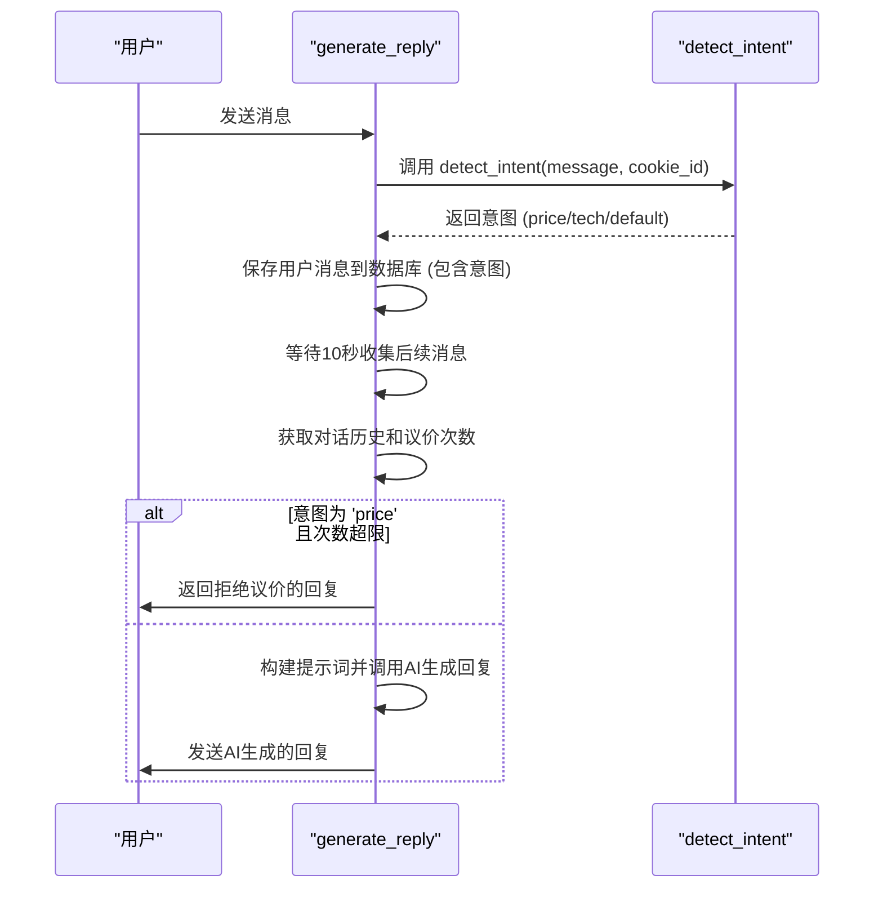

# 意图识别

<cite>
**本文档引用的文件**   
- [ai_reply_engine.py](file://ai_reply_engine.py)
- [db_manager.py](file://db_manager.py)
</cite>

## 目录
1. [简介](#简介)
2. [意图识别机制](#意图识别机制)
3. [系统支持的意图类型](#系统支持的意图类型)
4. [`detect_intent` 方法详解](#detect_intent-方法详解)
5. [AI功能启用状态检查](#ai功能启用状态检查)
6. [在 `generate_reply` 流程中的调用](#在-generate_reply-流程中的调用)
7. [扩展自定义意图和关键词](#扩展自定义意图和关键词)
8. [常见问题及解决方案](#常见问题及解决方案)

## 简介
本系统通过本地关键词匹配机制实现用户消息的意图识别，避免了调用AI模型，从而有效降低了成本和响应延迟。该机制在 `ai_reply_engine.py` 文件中的 `AIReplyEngine` 类中实现，核心方法为 `detect_intent`。该方法根据预定义的关键词列表对用户消息进行分类，支持议价、技术咨询和默认咨询三类意图。

## 意图识别机制
系统的意图识别机制完全基于本地关键词匹配，不依赖外部AI模型。当用户发送消息时，系统会将消息内容与预设的关键词列表进行比对，一旦发现匹配的关键词，即判定为相应的意图。这种设计确保了意图识别的快速响应和低成本运行。

**Section sources**
- [ai_reply_engine.py](file://ai_reply_engine.py#L237-L274)

## 系统支持的意图类型
系统目前支持以下三类意图：

1. **议价 (price)**：与价格、优惠、降价等相关的咨询。
2. **技术咨询 (tech)**：与产品使用、功能、故障等相关的咨询。
3. **默认咨询 (default)**：不属于上述两类的其他所有咨询。

每类意图都关联一个关键词列表，用于匹配用户消息。

**Section sources**
- [ai_reply_engine.py](file://ai_reply_engine.py#L251-L267)

## `detect_intent` 方法详解
`detect_intent` 方法是意图识别的核心，其逻辑如下：

1. 首先检查该账号的AI回复功能是否启用，若未启用则直接返回 `'default'`。
2. 将用户消息转换为小写，以实现不区分大小写的匹配。
3. 定义两个关键词列表：`price_keywords` 和 `tech_keywords`。
4. 使用 `any()` 函数检查用户消息中是否包含任一价格相关关键词，若包含则返回 `'price'`。
5. 若不匹配价格意图，则检查是否包含任一技术相关关键词，若包含则返回 `'tech'`。
6. 若以上均不匹配，则返回默认意图 `'default'`。
7. 在匹配过程中，使用 `logger.debug` 记录匹配结果，便于调试。
8. 整个方法被包裹在 `try-except` 块中，任何异常都会被捕获，并返回 `'default'` 以保证系统稳定。

**Diagram sources **
- [ai_reply_engine.py](file://ai_reply_engine.py#L237-L274)

**Section sources**
- [ai_reply_engine.py](file://ai_reply_engine.py#L237-L274)

## AI功能启用状态检查
`detect_intent` 方法在执行意图匹配前，会通过 `db_manager.get_ai_reply_settings(cookie_id)` 从数据库获取该账号的AI设置。此设置存储在 `ai_reply_settings` 表中，包含 `ai_enabled` 字段，用于判断AI回复功能是否开启。如果未启用，方法会立即返回 `'default'`，避免进行不必要的匹配操作。这一检查也作为 `generate_reply` 方法中检查的第二道防线。

**Diagram sources **
- [ai_reply_engine.py](file://ai_reply_engine.py#L244-L247)
- [db_manager.py](file://db_manager.py#L1797-L1813)

**Section sources**
- [ai_reply_engine.py](file://ai_reply_engine.py#L244-L247)
- [db_manager.py](file://db_manager.py#L1797-L1813)

## 在 `generate_reply` 流程中的调用
`detect_intent` 方法在 `generate_reply` 流程中扮演着关键角色。当 `generate_reply` 被调用时，它首先会调用 `detect_intent` 来确定用户消息的意图。这个意图结果有多个用途：
1. 用于后续构建AI回复的提示词（prompt），不同的意图会触发不同的回复策略。
2. 用于保存到对话历史记录中，以便后续分析和审计。
3. 用于控制特定意图的逻辑，例如，当意图为 `'price'` 时，会检查议价次数是否达到上限。

**Diagram sources **
- [ai_reply_engine.py](file://ai_reply_engine.py#L283-L292)

**Section sources**
- [ai_reply_engine.py](file://ai_reply_engine.py#L283-L292)

## 扩展自定义意图和关键词
开发者可以通过修改 `ai_reply_engine.py` 文件中的 `detect_intent` 方法来扩展自定义意图和关键词。具体步骤如下：
1. 在方法内部定义新的关键词列表，例如 `service_keywords = ['发货', '快递', '物流']`。
2. 添加新的 `if` 语句来检查新关键词列表，例如 `if any(kw in msg_lower for kw in service_keywords): return 'service'`。
3. 确保在 `default_prompts` 字典中为新意图添加对应的提示词。
4. 如果需要，可以在前端界面添加相应的配置选项。

**Section sources**
- [ai_reply_engine.py](file://ai_reply_engine.py#L251-L267)

## 常见问题及解决方案
### 关键词误匹配
**问题**：关键词过于宽泛，导致误匹配。
**解决方案**：使用更具体的关键词，或在匹配逻辑中增加上下文判断，例如检查关键词是否为独立词汇。

### 多意图冲突
**问题**：一条消息可能同时包含多个意图的关键词。
**解决方案**：系统采用顺序匹配，先检查的意图优先级更高。例如，`price_keywords` 在 `tech_keywords` 之前检查，因此价格意图的优先级高于技术意图。开发者可以通过调整检查顺序来改变优先级。

**Section sources**
- [ai_reply_engine.py](file://ai_reply_engine.py#L259-L265)