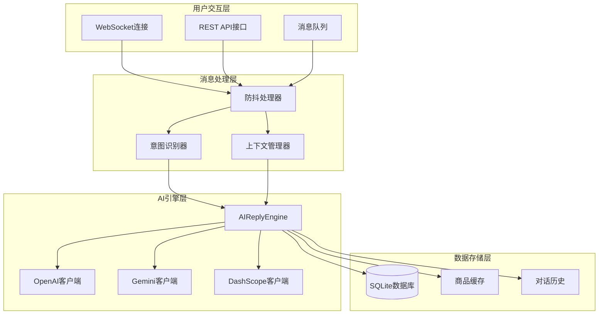
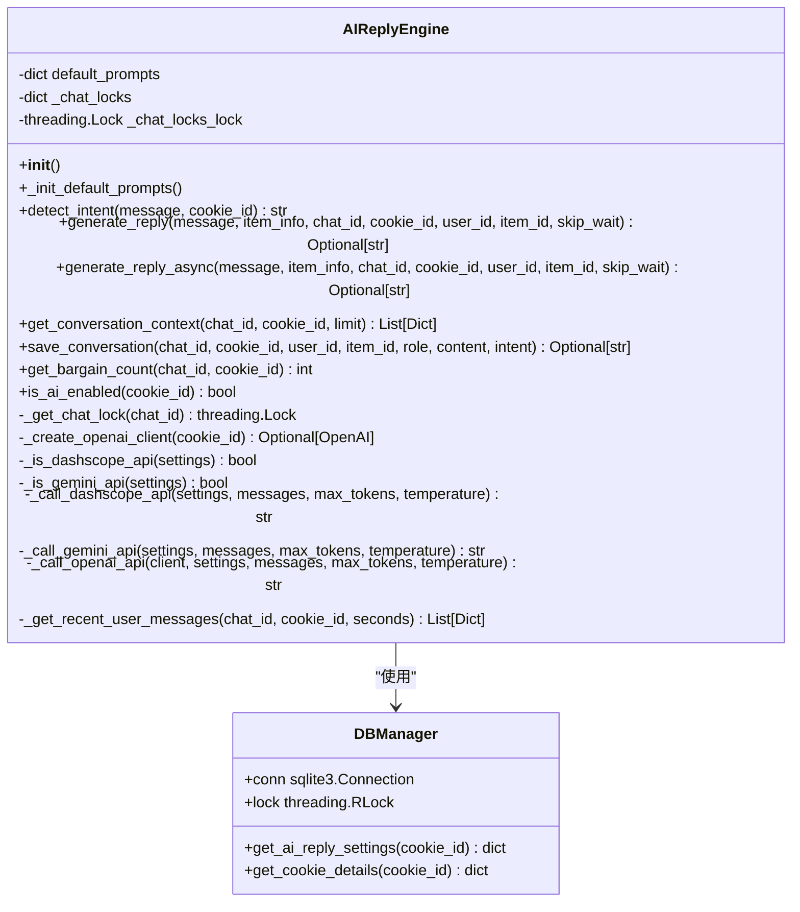
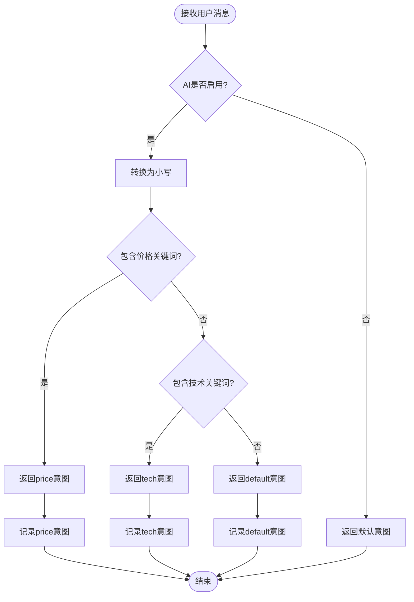
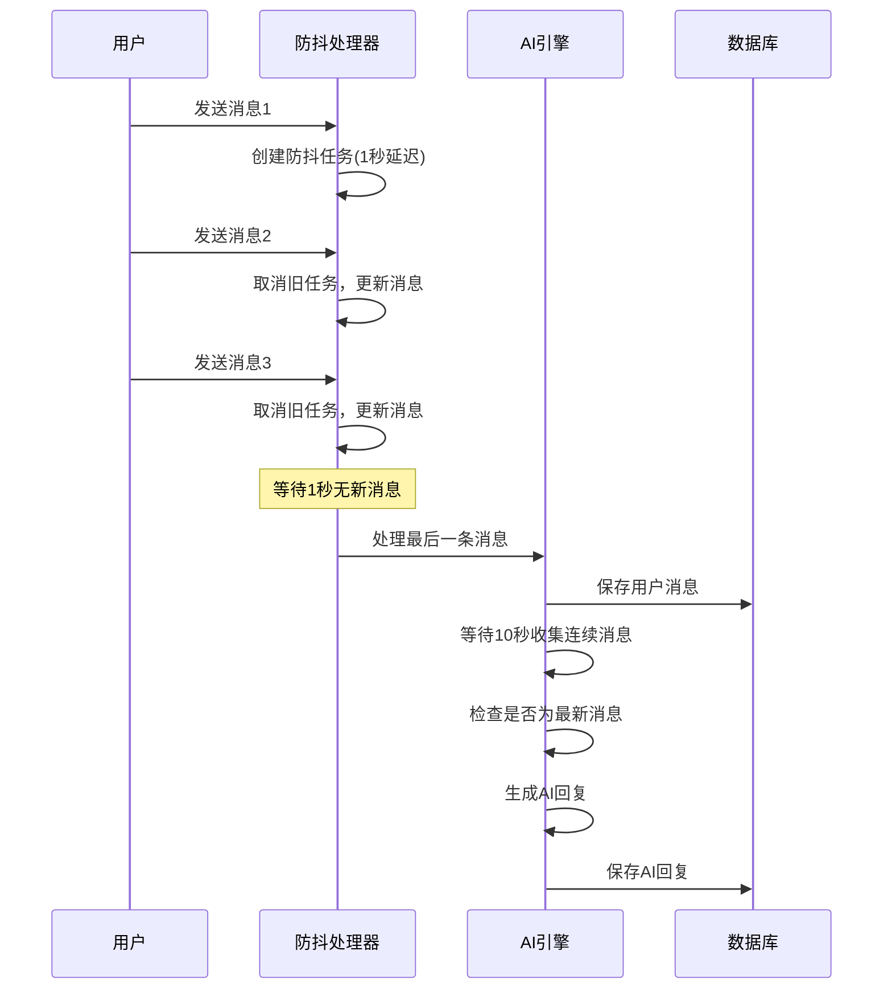
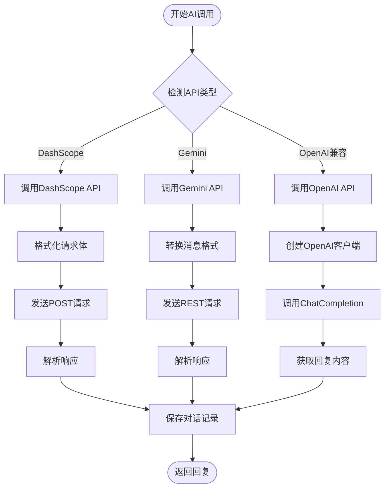
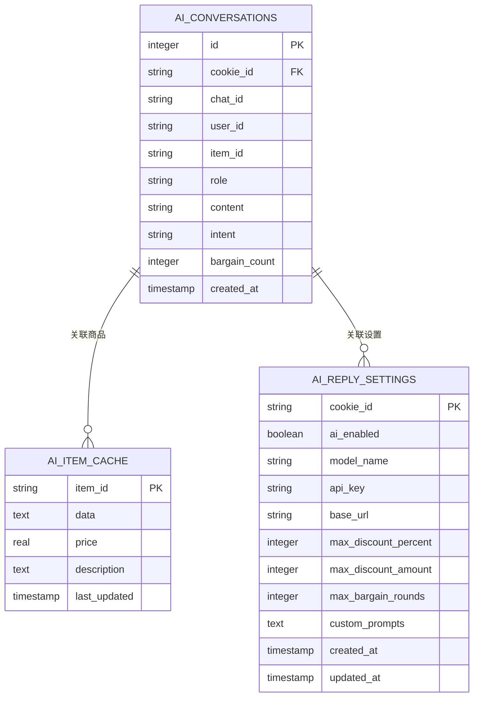
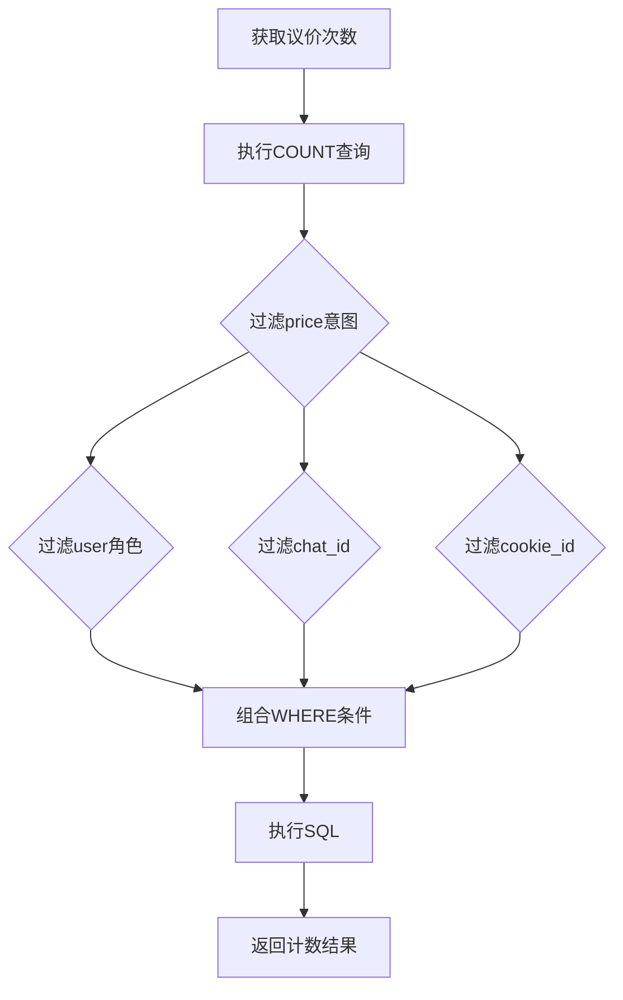
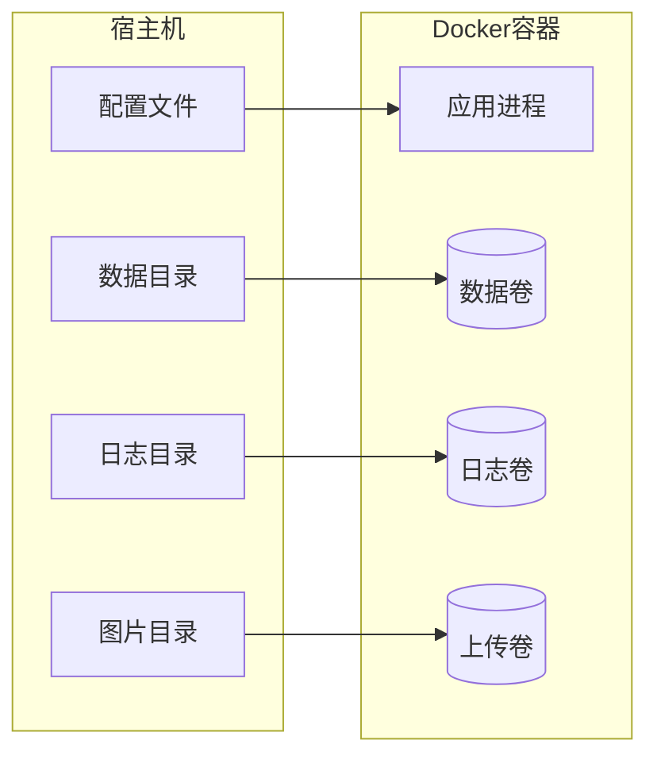
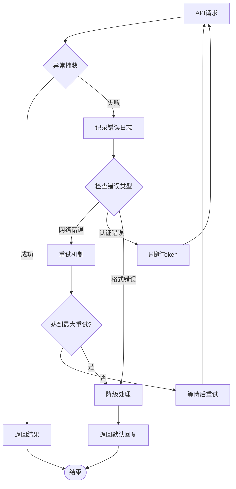

# 智能回复系统

<cite>
**本文档中引用的文件**
- [ai_reply_engine.py](file://ai_reply_engine.py)
- [config.py](file://config.py)
- [reply_server.py](file://reply_server.py)
- [XianyuAutoAsync.py](file://XianyuAutoAsync.py)
- [db_manager.py](file://db_manager.py)
- [global_config.yml](file://global_config.yml)
- [Start.py](file://Start.py)
</cite>

## 目录
1. [简介](#简介)
2. [系统架构概览](#系统架构概览)
3. [AIReplyEngine核心组件](#aireplyengine核心组件)
4. [意图识别机制](#意图识别机制)
5. [防抖机制详解](#防抖机制详解)
6. [多AI模型支持](#多ai模型支持)
7. [对话上下文管理](#对话上下文管理)
8. [配置与部署](#配置与部署)
9. [错误处理与性能优化](#错误处理与性能优化)
10. [开发者指南](#开发者指南)
11. [常见问题与解决方案](#常见问题与解决方案)

## 简介

智能回复系统是一个基于AI技术的自动化闲鱼聊天回复解决方案，通过本地关键词匹配识别用户意图，并结合商品信息、对话历史和议价次数生成上下文感知的回复。系统支持多种AI模型（OpenAI兼容API、Gemini、DashScope），具备强大的防抖机制和对话上下文管理能力。

### 主要特性

- **本地意图识别**：基于关键词的低成本意图检测
- **多AI模型支持**：兼容OpenAI、Gemini、DashScope等多种API
- **智能防抖机制**：通过等待10秒收集用户连续消息确保回复准确性
- **上下文感知回复**：维护对话历史和议价轮次跟踪
- **无状态设计**：支持多进程部署，移除客户端缓存
- **实时消息处理**：支持WebSocket消息流和防抖处理

## 系统架构概览

**图表来源**
- [ai_reply_engine.py](file://ai_reply_engine.py#L24-L544)
- [XianyuAutoAsync.py](file://XianyuAutoAsync.py#L6922-L7067)
- [db_manager.py](file://db_manager.py#L16-L800)

## AIReplyEngine核心组件

### 类结构设计

AIReplyEngine类是整个智能回复系统的核心，采用无状态设计以支持多进程部署。主要组件包括：

**图表来源**
- [ai_reply_engine.py](file://ai_reply_engine.py#L24-L544)
- [db_manager.py](file://db_manager.py#L16-L800)

### 初始化与配置

系统初始化时会：
1. 加载默认提示词模板
2. 初始化聊天锁字典
3. 配置多进程安全的数据库连接

**章节来源**
- [ai_reply_engine.py](file://ai_reply_engine.py#L27-L36)

## 意图识别机制

### 本地关键词匹配算法

系统采用基于关键词的本地意图识别，替代传统的AI调用以降低成本和延迟：

**图表来源**
- [ai_reply_engine.py](file://ai_reply_engine.py#L237-L274)

### 关键词配置

系统预设了三类关键词集合：

| 意图类型 | 关键词示例 | 用途 |
|---------|-----------|------|
| 价格意向 | 便宜、优惠、刀、降价、包邮、多少钱、能少、还能、最低、底价 | 识别议价需求 |
| 技术咨询 | 怎么用、参数、坏了、故障、设置、说明书、功能、用法、教程、驱动 | 识别技术问题 |
| 默认咨询 | 通用客服问题 | 处理常规咨询 |

**章节来源**
- [ai_reply_engine.py](file://ai_reply_engine.py#L251-L268)

## 防抖机制详解

### 防抖工作原理

系统实现了双重防抖机制，确保回复的准确性和用户体验：

**图表来源**
- [XianyuAutoAsync.py](file://XianyuAutoAsync.py#L6922-L7067)
- [ai_reply_engine.py](file://ai_reply_engine.py#L283-L328)

### 防抖参数配置

| 参数 | 默认值 | 说明 |
|-----|-------|------|
| 内部等待时间 | 10秒 | 等待用户连续消息的时间 |
| 外部防抖延迟 | 1秒 | 用户停止发送后的处理延迟 |
| 查询窗口 | 6-25秒 | 根据防抖模式调整的消息查询范围 |
| 缓冲时间 | 5秒 | 防抖任务的额外缓冲时间 |

**章节来源**
- [ai_reply_engine.py](file://ai_reply_engine.py#L299-L316)

## 多AI模型支持

### API类型检测与调用

系统支持三种主流AI模型，通过智能检测确定使用哪种API：

**图表来源**
- [ai_reply_engine.py](file://ai_reply_engine.py#L83-L402)

### API配置参数

| API类型 | 模型名称 | 基础URL | 特殊配置 |
|---------|---------|---------|----------|
| OpenAI兼容 | qwen-plus等 | https://dashscope.aliyuncs.com/compatible-mode/v1 | 标准OpenAI格式 |
| DashScope | custom/qwen-custom | dashscope.aliyuncs.com | 需要app_id |
| Gemini | gemini-pro等 | generativelanguage.googleapis.com | 需要特殊格式转换 |

**章节来源**
- [ai_reply_engine.py](file://ai_reply_engine.py#L83-L98)

## 对话上下文管理

### 上下文获取与维护

系统通过多层次的上下文管理确保回复的连贯性：

**图表来源**
- [db_manager.py](file://db_manager.py#L169-L182)
- [db_manager.py](file://db_manager.py#L150-L165)

### 议价轮次跟踪

系统通过SQL查询精确跟踪议价轮次：

**图表来源**
- [ai_reply_engine.py](file://ai_reply_engine.py#L477-L489)

**章节来源**
- [ai_reply_engine.py](file://ai_reply_engine.py#L436-L452)
- [ai_reply_engine.py](file://ai_reply_engine.py#L477-L489)

## 配置与部署

### 全局配置结构

系统通过YAML配置文件管理全局设置：

| 配置项 | 默认值 | 说明 |
|-------|-------|------|
| API_ENDPOINTS | - | API端点配置 |
| AUTO_REPLY.api.enabled | false | 是否启用API回复 |
| AUTO_REPLY.api.host | 0.0.0.0 | 绑定主机地址 |
| AUTO_REPLY.api.port | 8080 | 服务端口 |
| LOG_CONFIG.level | INFO | 日志级别 |
| TOKEN_REFRESH_INTERVAL | 72000 | Token刷新间隔(20小时) |
| MESSAGE_EXPIRE_TIME | 300000 | 消息过期时间(5分钟) |

**章节来源**
- [global_config.yml](file://global_config.yml#L1-L77)

### Docker部署配置

系统提供完整的Docker部署方案：

**图表来源**
- [entrypoint.sh](file://entrypoint.sh#L1-L49)

**章节来源**
- [Start.py](file://Start.py#L446-L602)

## 错误处理与性能优化

### 异常处理机制

系统实现了多层次的错误处理：

**图表来源**
- [ai_reply_engine.py](file://ai_reply_engine.py#L414-L420)

### 性能优化策略

1. **无状态设计**：移除客户端缓存，支持水平扩展
2. **连接池管理**：复用OpenAI客户端连接
3. **异步处理**：使用线程池处理AI调用
4. **数据库优化**：使用R锁保护并发访问
5. **缓存机制**：商品信息缓存减少API调用

**章节来源**
- [ai_reply_engine.py](file://ai_reply_engine.py#L62-L82)

## 开发者指南

### 配置AI模型

1. **启用AI回复**：在数据库中设置`ai_enabled=true`
2. **配置API密钥**：填写有效的API密钥
3. **选择模型**：设置目标模型名称
4. **自定义提示词**：配置特定意图的提示词

### 设置提示词模板

系统提供四种默认提示词模板：

| 模板类型 | 文件位置 | 主要功能 |
|---------|---------|----------|
| price | AIReplyEngine.default_prompts['price'] | 议价策略回复 |
| tech | AIReplyEngine.default_prompts['tech'] | 技术问题解答 |
| default | AIReplyEngine.default_prompts['default'] | 通用客服回复 |
| classify | AIReplyEngine.default_prompts['classify'] | 已废弃 |

### 自定义回复逻辑

开发者可以通过以下方式自定义回复行为：

1. **修改关键词**：在`detect_intent`方法中添加新的关键词
2. **调整提示词**：在数据库中配置`custom_prompts`字段
3. **扩展API支持**：添加新的API调用方法
4. **优化防抖参数**：调整防抖延迟和查询窗口

**章节来源**
- [ai_reply_engine.py](file://ai_reply_engine.py#L37-L60)

## 常见问题与解决方案

### API调用失败

**问题**：AI模型调用失败
**原因**：网络问题、API密钥无效、配额超限
**解决方案**：
1. 检查网络连接
2. 验证API密钥有效性
3. 查看错误日志定位具体问题
4. 实施重试机制

### 高并发场景处理

**问题**：大量用户同时发送消息导致性能下降
**解决方案**：
1. 使用防抖机制减少重复处理
2. 实现消息队列缓冲
3. 优化数据库查询性能
4. 启用异步处理模式

### 议价竞争条件

**问题**：多个议价请求同时处理导致竞态条件
**现状**：系统保留了潜在的竞争条件风险点
**建议**：考虑引入分布式锁或数据库事务

### 对话上下文丢失

**问题**：对话历史不连续
**解决方案**：
1. 确保数据库连接稳定
2. 检查聊天ID的唯一性
3. 验证消息时间戳的准确性

**章节来源**
- [ai_reply_engine.py](file://ai_reply_engine.py#L336-L344)
- [ai_reply_engine.py](file://ai_reply_engine.py#L414-L420)

## 结论

智能回复系统通过精心设计的架构实现了高效、可靠的AI聊天回复功能。其本地意图识别、智能防抖、多模型支持和上下文管理等特性，为闲鱼平台提供了强大的自动化客服解决方案。系统的无状态设计和异步处理能力确保了良好的可扩展性和稳定性，是现代AI应用开发的优秀实践案例。