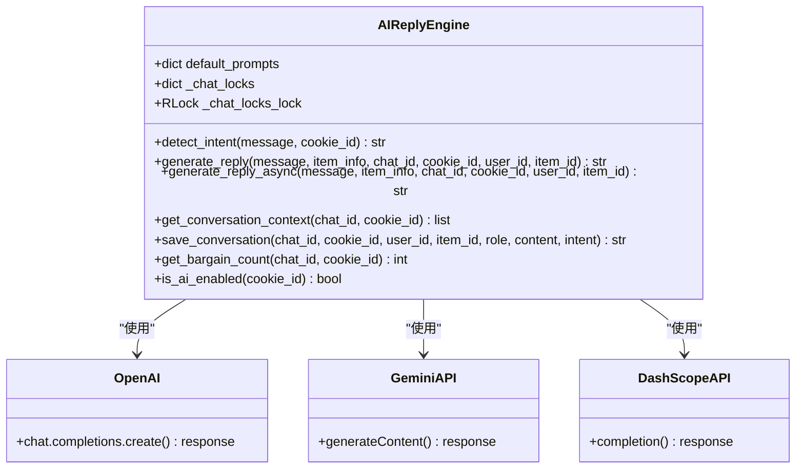
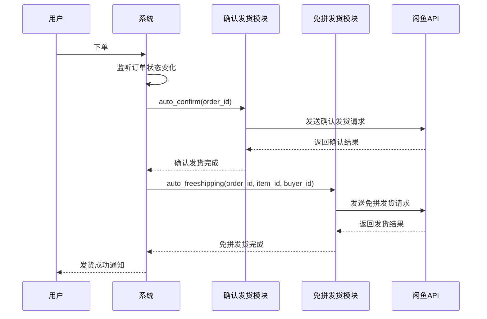
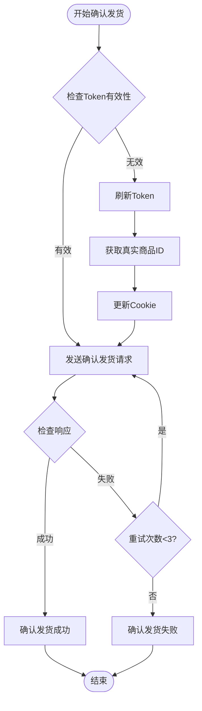
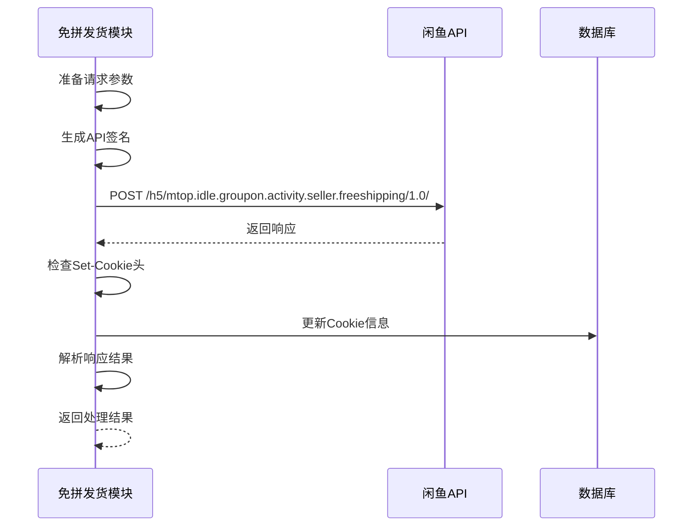
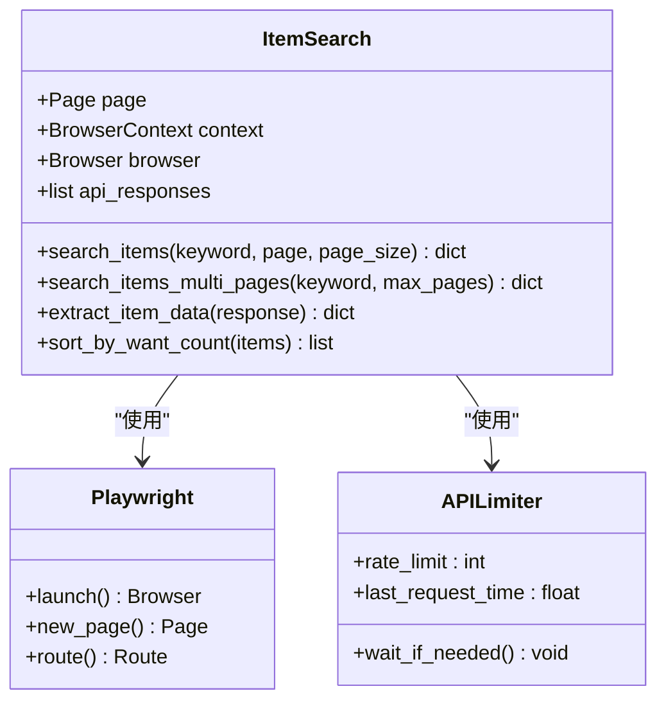
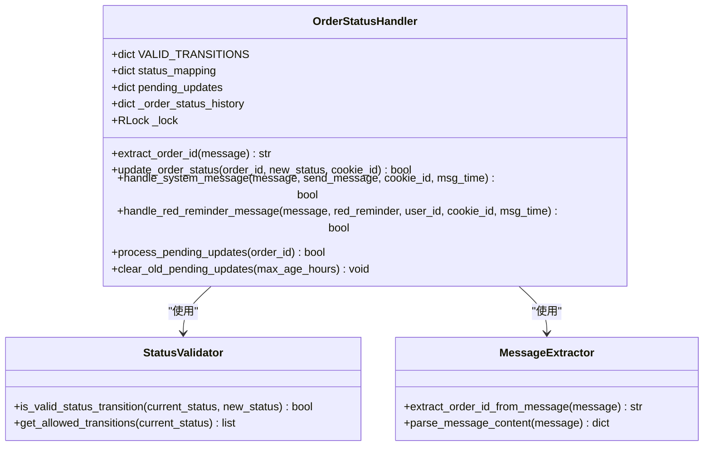
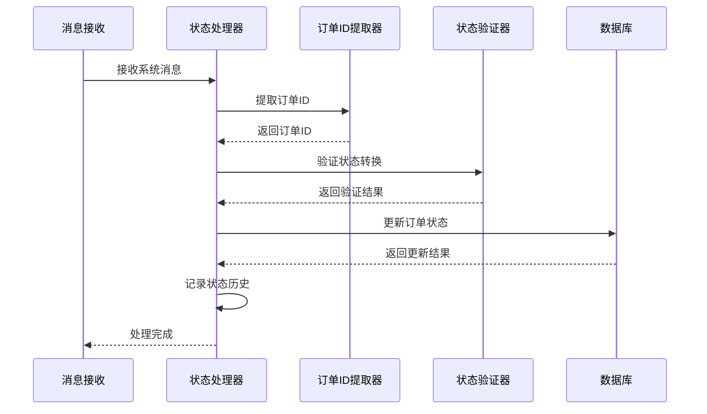
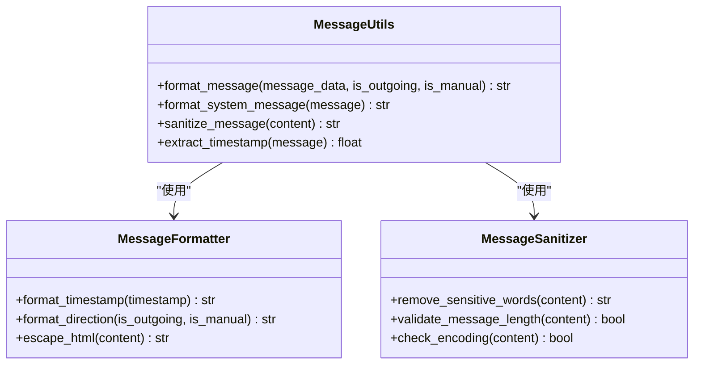
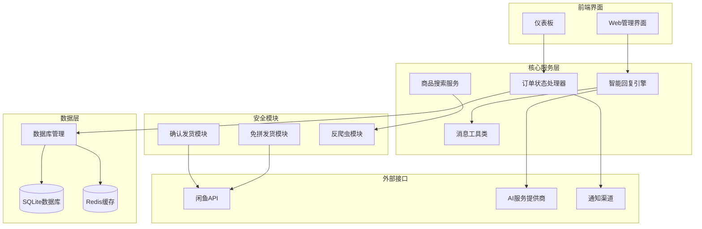

# 核心功能详解

<cite>
**本文档引用的文件**
- [ai_reply_engine.py](file://ai_reply_engine.py)
- [secure_confirm_ultra.py](file://secure_confirm_ultra.py)
- [secure_freeshipping_ultra.py](file://secure_freeshipping_ultra.py)
- [secure_confirm_decrypted.py](file://secure_confirm_decrypted.py)
- [secure_freeshipping_decrypted.py](file://secure_freeshipping_decrypted.py)
- [item_search.py](file://utils/item_search.py)
- [order_status_handler.py](file://order_status_handler.py)
- [message_utils.py](file://utils/message_utils.py)
- [db_manager.py](file://db_manager.py)
- [config.py](file://config.py)
</cite>

## 目录
1. [简介](#简介)
2. [智能回复系统](#智能回复系统)
3. [自动发货系统](#自动发货系统)
4. [商品搜索功能](#商品搜索功能)
5. [订单状态处理器](#订单状态处理器)
6. [消息工具类](#消息工具类)
7. [系统架构概览](#系统架构概览)
8. [配置与部署](#配置与部署)
9. [使用案例与最佳实践](#使用案例与最佳实践)
10. [总结](#总结)

## 简介

闲鱼自动回复系统是一个综合性的自动化解决方案，集成了智能回复、自动发货、商品搜索、订单管理和消息处理等多个核心功能模块。该系统采用模块化设计，支持多种AI模型，具备完善的安全验证机制和高效的并发处理能力。

## 智能回复系统

### 系统概述

智能回复系统（AIReplyEngine）是系统的核心交互模块，负责处理用户消息并生成智能化的回复内容。该系统结合了关键词匹配算法和AI大模型生成技术，支持上下文理解和多轮对话。



**图表来源**
- [ai_reply_engine.py](file://ai_reply_engine.py#L24-L544)

### 关键特性

#### 1. 多模态AI支持
系统支持多种AI服务提供商：
- **OpenAI兼容API**：支持GPT系列模型
- **Google Gemini API**：支持Google的生成式AI
- **阿里云DashScope API**：支持通义千问系列模型

#### 2. 智能意图检测
采用本地关键词匹配算法，无需调用AI即可快速识别用户意图：
- **价格谈判**：通过关键词如"便宜"、"优惠"、"刀"等识别
- **技术支持**：通过"怎么用"、"参数"、"故障"等关键词识别
- **通用咨询**：默认处理其他类型的询问

#### 3. 上下文理解与多轮对话
- **对话历史管理**：保存和检索最近10条对话记录
- **议价轮次控制**：最多支持3轮议价，默认拒绝继续议价
- **智能等待机制**：内置10秒消息收集窗口，避免过早回复

#### 4. 安全与性能优化
- **无状态设计**：移除客户端缓存，支持多进程部署
- **串行处理**：确保同一对话的消息按顺序处理
- **异常处理**：完善的错误捕获和重试机制

**章节来源**
- [ai_reply_engine.py](file://ai_reply_engine.py#L24-L544)

### 使用示例

#### 基础配置
```python
# 初始化AI回复引擎
from ai_reply_engine import ai_reply_engine

# 检查AI是否启用
if ai_reply_engine.is_ai_enabled(cookie_id):
    # 生成回复
    reply = ai_reply_engine.generate_reply(
        message="这个商品多少钱？",
        item_info={"title": "iPhone 14", "price": "5999"},
        chat_id="chat_123",
        cookie_id="cookie_456",
        user_id="user_789",
        item_id="item_101"
    )
```

#### 自定义提示词
```python
# 设置自定义提示词
custom_prompts = {
    "price": "你是一位经验丰富的销售专家，擅长议价。\n语言要求：简短直接，每句≤10字，总字数≤40字。",
    "tech": "你是一位技术专家，专业解答产品相关问题。\n语言要求：简短专业，每句≤10字，总字数≤40字。",
    "default": "你是一位资深电商卖家，提供优质客服。\n语言要求：简短友好，每句≤10字，总字数≤40字。"
}

# 应用自定义提示词
db_manager.update_ai_reply_settings(cookie_id, custom_prompts=json.dumps(custom_prompts))
```

## 自动发货系统

### 系统架构

自动发货系统包含两个核心模块：确认发货模块和免拼发货模块。这两个模块均采用超级混淆技术保护源代码，同时提供解密版本便于维护。



**图表来源**
- [secure_confirm_decrypted.py](file://secure_confirm_decrypted.py#L87-L181)
- [secure_freeshipping_decrypted.py](file://secure_freeshipping_decrypted.py#L38-L131)

### 确认发货模块

#### 功能特性
- **Token自动刷新**：基于真实商品ID动态刷新_m_h5_tk token
- **Cookie管理**：自动更新和同步Cookie信息
- **重试机制**：最多3次重试，网络异常时自动重试
- **签名验证**：使用闲鱼API签名算法确保请求安全性

#### 安全验证流程



**图表来源**
- [secure_confirm_decrypted.py](file://secure_confirm_decrypted.py#L87-L181)

### 免拼发货模块

#### 核心功能
- **免拼团发货**：支持闲鱼免拼团活动的自动发货
- **参数验证**：订单ID、商品ID、买家ID的完整性检查
- **批量处理**：支持多个订单的连续处理

#### API调用流程



**图表来源**
- [secure_freeshipping_decrypted.py](file://secure_freeshipping_decrypted.py#L38-L131)

**章节来源**
- [secure_confirm_ultra.py](file://secure_confirm_ultra.py#L1-L43)
- [secure_freeshipping_ultra.py](file://secure_freeshipping_ultra.py#L1-L44)
- [secure_confirm_decrypted.py](file://secure_confirm_decrypted.py#L1-L181)
- [secure_freeshipping_decrypted.py](file://secure_freeshipping_decrypted.py#L1-L131)

### 配置建议

#### 确认发货配置
```yaml
# 自动确认发货配置
auto_confirm:
  enabled: true
  delay_seconds: 10  # 确认发货延迟时间（秒）
  retry_count: 3     # 最大重试次数
```

#### 免拼发货配置
```yaml
# 免拼发货配置
free_shipping:
  enabled: true
  auto_enable: false  # 是否自动启用免拼发货
  item_threshold: 10  # 商品库存阈值
```

## 商品搜索功能

### 系统设计

商品搜索功能通过Playwright框架实现真实的网页爬取，获取闲鱼平台的实时商品数据。该功能支持多页爬取和智能排序，为用户提供准确的商品信息。



**图表来源**
- [item_search.py](file://utils/item_search.py#L746-L1435)

### 核心特性

#### 1. 真实数据获取
- **Playwright爬虫**：模拟真实浏览器行为，获取JavaScript渲染后的数据
- **API拦截**：监控并解析闲鱼API响应，提取商品信息
- **反爬虫对抗**：使用随机延迟和用户代理伪装

#### 2. 智能排序算法
- **"人想要"数量排序**：按照商品的"想要"数量进行降序排列
- **多维度筛选**：支持价格区间、商品类别等筛选条件
- **实时更新**：获取最新的商品状态和价格信息

#### 3. 多页爬取支持
- **无限滚动检测**：自动检测页面是否还有更多数据
- **分页处理**：支持最多10页的数据爬取
- **增量加载**：只获取新增的商品数据

### 数据处理流程

```mermaid
flowchart TD
Start([开始搜索]) --> InitBrowser[初始化浏览器]
InitBrowser --> SetupRoute[设置API路由拦截]
SetupRoute --> Navigate[导航到搜索页面]
Navigate --> WaitLoad[等待页面加载]
WaitLoad --> InterceptAPI[拦截API响应]
InterceptAPI --> ParseData[解析商品数据]
ParseData --> CheckMore{还有更多页面?}
CheckMore --> |是| ClickNext[点击下一页]
ClickNext --> WaitLoad
CheckMore --> |否| SortData[按"想要"数量排序]
SortData --> FilterData[过滤无效数据]
FilterData --> Return[返回结果]
Return --> CloseBrowser[关闭浏览器]
CloseBrowser --> End([结束])
```

**图表来源**
- [item_search.py](file://utils/item_search.py#L746-L1435)

### 使用示例

#### 基础搜索
```python
from utils.item_search import ItemSearch

# 创建搜索器实例
searcher = ItemSearch()

# 搜索商品
results = await searcher.search_items(
    keyword="iPhone 14",
    page=1,
    page_size=20
)

# 处理结果
for item in results['items']:
    print(f"标题: {item['title']}")
    print(f"价格: {item['price']}")
    print(f"想要人数: {item['want_count']}")
```

#### 多页搜索
```python
# 搜索多页数据
multi_results = await searcher.search_items_multi_pages(
    keyword="二手手机",
    max_pages=5
)

print(f"总共获取到 {multi_results['total']} 条商品信息")
```

**章节来源**
- [item_search.py](file://utils/item_search.py#L746-L1435)

## 订单状态处理器

### 系统架构

订单状态处理器负责监听和处理闲鱼平台的订单状态变化，自动更新本地数据库中的订单状态，并触发相应的业务逻辑。



**图表来源**
- [order_status_handler.py](file://order_status_handler.py#L26-L800)

### 状态转换规则

系统定义了严格的订单状态转换规则，确保订单状态的合法性：

| 当前状态 | 允许转换到的状态 | 说明 |
|---------|----------------|------|
| processing | pending_ship, shipped, completed, cancelled | 已拍下，待付款 |
| pending_ship | shipped, completed, cancelled, refunding | 已付款，等待发货 |
| shipped | completed, cancelled, refunding | 已发货 |
| completed | cancelled, refunding | 已完成 |
| refunding | completed, cancelled, refund_cancelled | 退款中 |
| refund_cancelled | 上一状态 | 退款撤销 |
| cancelled | 无 | 已关闭 |

### 核心功能

#### 1. 消息解析与订单ID提取
系统能够从复杂的闲鱼消息结构中提取订单ID，支持多种消息格式：
- **系统消息**：如"[买家确认收货，交易成功]"
- **红色提醒**：如"交易关闭"
- **退款消息**：如"我发起了退款申请"

#### 2. 待处理队列管理
- **延迟处理**：支持消息延迟处理，避免重复状态更新
- **队列清理**：自动清理过期的待处理更新
- **状态历史**：记录订单状态变更历史，支持退款撤销

#### 3. 并发安全处理
- **线程安全**：使用可重入锁保护并发访问
- **状态验证**：严格验证状态转换的合理性
- **异常恢复**：完善的错误处理和状态恢复机制

### 处理流程



**图表来源**
- [order_status_handler.py](file://order_status_handler.py#L633-L800)

**章节来源**
- [order_status_handler.py](file://order_status_handler.py#L26-L800)

## 消息工具类

### 功能概述

消息工具类提供了统一的消息格式化和处理功能，确保系统内消息的一致性和可读性。



**图表来源**
- [message_utils.py](file://utils/message_utils.py#L1-L29)

### 核心功能

#### 1. 消息格式化
- **时间戳处理**：将Unix时间戳转换为易读的时间格式
- **消息方向标识**：区分发送消息和接收消息
- **手动消息标记**：特殊标识手动发送的消息

#### 2. 敏感词过滤
- **内容净化**：移除潜在的敏感信息
- **HTML转义**：防止XSS攻击
- **长度验证**：确保消息长度符合平台限制

#### 3. 统一日志格式
- **结构化输出**：统一的日志格式便于分析
- **错误处理**：优雅处理格式化过程中的异常
- **编码兼容**：支持多种字符编码

### 使用示例

#### 基础消息格式化
```python
from utils.message_utils import format_message

# 接收消息格式化
received_msg = {
    'content': '你好，请问这个商品还有吗？',
    'time': 1640995200000
}
formatted_received = format_message(received_msg)
# 输出: "2022-01-01 00:00:00 【收到】 你好，请问这个商品还有吗？"

# 发送消息格式化
sent_msg = {
    'content': '有的，价格是5999元。',
    'time': 1640995260000
}
formatted_sent = format_message(sent_msg, is_outgoing=True)
# 输出: "2022-01-01 00:01:00 【发出】 有的，价格是5999元。"
```

#### 系统消息格式化
```python
from utils.message_utils import format_system_message

# 系统消息格式化
system_msg = "订单状态已更新为已发货"
formatted_system = format_system_message(system_msg)
# 输出: "2022-01-01 00:00:00 【系统】 订单状态已更新为已发货"
```

**章节来源**
- [message_utils.py](file://utils/message_utils.py#L1-L29)

## 系统架构概览

### 整体架构设计



### 模块间通信

#### 1. 消息传递机制
- **WebSocket连接**：实时接收闲鱼消息
- **事件驱动**：基于事件的异步处理
- **队列管理**：消息队列确保处理的可靠性

#### 2. 数据共享
- **全局配置**：统一的配置管理系统
- **状态同步**：各模块间的状态同步机制
- **缓存策略**：多级缓存提升性能

#### 3. 错误处理
- **异常传播**：完善的异常处理和传播机制
- **降级策略**：服务不可用时的降级方案
- **监控告警**：实时监控和告警机制

## 配置与部署

### 环境要求

#### 系统要求
- **操作系统**：Windows 10+/Linux/ macOS
- **Python版本**：3.8+
- **内存**：至少2GB RAM
- **磁盘空间**：至少1GB可用空间

#### 依赖安装
```bash
# 安装核心依赖
pip install -r requirements.txt

# 安装Playwright浏览器
playwright install chromium

# 安装数据库依赖
pip install sqlite3
```

### 配置文件说明

#### global_config.yml
```yaml
# WebSocket配置
WEBSOCKET_URL: "wss://wss-goofish.dingtalk.com/"
HEARTBEAT_INTERVAL: 15
HEARTBEAT_TIMEOUT: 30

# Cookie配置
COOKIES:
  value: "your_cookie_string_here"
  last_update_time: "2024-01-01 00:00:00"

# 自动回复配置
AUTO_REPLY:
  enabled: true
  default_message: "亲爱的老板你好！所有宝贝都可以拍，秒发货的哈~"
  
# AI回复配置
AI_REPLY:
  enabled: true
  model_name: "qwen-plus"
  api_key: "your_api_key_here"
  base_url: "https://dashscope.aliyuncs.com/compatible-mode/v1"

# 数据库配置
DATABASE:
  path: "data/xianyu_data.db"
  backup_interval: 86400  # 24小时
```

### 部署方式

#### 1. 本地部署
```bash
# 启动主程序
python Start.py

# 启动API服务器
python reply_server.py

# 启动统计服务
python simple_stats_server.py
```

#### 2. Docker部署
```dockerfile
FROM python:3.9-slim

WORKDIR /app

COPY requirements.txt .
RUN pip install -r requirements.txt

COPY . .

EXPOSE 8080

CMD ["python", "Start.py"]
```

#### 3. 生产环境配置
```yaml
# 生产环境配置
production:
  debug: false
  log_level: "INFO"
  max_workers: 4
  database:
    path: "/var/lib/xianyu/data.db"
    pool_size: 10
  redis:
    host: "redis.prod.local"
    port: 6379
```

## 使用案例与最佳实践

### 案例1：电商店铺自动化运营

#### 场景描述
某二手电子产品店铺需要处理大量询价和订单，希望通过自动化系统提升运营效率。

#### 实施方案
1. **智能回复配置**
```python
# 设置商品关键词回复
keywords = [
    {"keyword": "iPhone", "reply": "这款iPhone目前价格是¥5999，支持分期付款哦！"},
    {"keyword": "电脑", "reply": "笔记本电脑有多种配置可选，具体价格请私聊咨询。"},
    {"keyword": "手机壳", "reply": "手机壳款式很多，可以看看我们的主页展示。"}
]

for keyword in keywords:
    db_manager.save_keyword(
        cookie_id="shop_001",
        keyword=keyword["keyword"],
        reply=keyword["reply"]
    )
```

2. **自动发货配置**
```python
# 配置自动发货规则
rules = [
    {"keyword": "包邮", "card_id": 1, "delivery_count": 1},
    {"keyword": "秒发", "card_id": 2, "delivery_count": 1},
    {"keyword": "现货", "card_id": 3, "delivery_count": 1}
]

for rule in rules:
    db_manager.save_delivery_rule(**rule)
```

3. **订单监控**
```python
# 监控订单状态变化
def on_order_status_changed(order_id, new_status):
    if new_status == "pending_ship":
        # 自动确认发货
        asyncio.create_task(auto_confirm_order(order_id))
    elif new_status == "completed":
        # 发送感谢消息
        send_thank_you_message(order_id)
```

### 案例2：批量商品上架

#### 场景描述
需要批量上架大量商品，同时保持价格竞争力和及时响应客户询价。

#### 实施方案
1. **商品搜索与定价**
```python
# 批量搜索类似商品
search_terms = ["二手手机", "平板电脑", "笔记本"]

for term in search_terms:
    results = await item_search.search_items_multi_pages(
        keyword=term,
        max_pages=3
    )
    
    # 智能定价策略
    for item in results['items']:
        competitive_price = calculate_competitive_price(item)
        update_product_price(item['item_id'], competitive_price)
```

2. **批量回复配置**
```python
# 设置批量回复模板
templates = {
    "电子产品": "亲，您看中的{title}目前价格是¥{price}，{stock}库存充足哦！支持七天无理由退换。",
    "服装": "您好，{title}现在¥{price}包邮，{color}颜色有{size}尺码可选。",
    "家居": "亲，{title}¥{price}包邮，{spec}规格有货，欢迎下单！"
}

# 应用模板
for category, template in templates.items():
    db_manager.save_default_reply(
        cookie_id="seller_001",
        enabled=True,
        reply_content=template
    )
```

### 最佳实践建议

#### 1. 性能优化
- **并发控制**：限制同时处理的消息数量，避免系统过载
- **缓存策略**：缓存频繁访问的商品信息和回复模板
- **异步处理**：使用异步编程提升系统响应速度

#### 2. 安全防护
- **API限流**：对闲鱼API调用进行频率限制
- **异常监控**：实时监控系统异常并自动恢复
- **数据备份**：定期备份数据库和重要配置

#### 3. 用户体验
- **个性化回复**：根据用户历史记录提供个性化服务
- **多语言支持**：支持不同地区的语言需求
- **响应时间**：确保消息回复在合理时间内完成

#### 4. 运维管理
- **日志管理**：完善的日志记录和分析系统
- **监控告警**：实时监控系统状态和关键指标
- **版本管理**：建立完善的版本发布和回滚机制

## 总结

闲鱼自动回复系统是一个功能完备、架构合理的自动化解决方案。通过智能回复系统的人工智能技术和自然语言处理能力，配合自动发货系统的安全验证机制和高效处理流程，以及商品搜索功能的真实数据获取能力和订单状态处理器的精确状态管理，系统能够为用户提供全方位的自动化服务。

### 系统优势

1. **智能化程度高**：支持多种AI模型，具备上下文理解和多轮对话能力
2. **安全性强**：采用多层安全验证和混淆技术保护核心功能
3. **扩展性强**：模块化设计便于功能扩展和定制
4. **稳定性好**：完善的错误处理和重试机制确保系统稳定运行
5. **易于部署**：支持多种部署方式，配置简单

### 应用前景

该系统特别适合以下应用场景：
- **电商店铺自动化运营**：处理大量客户咨询和订单
- **批量商品管理**：提高商品上架和管理效率
- **客户服务自动化**：提供24/7的客户服务支持
- **数据分析与优化**：基于历史数据优化运营策略

通过持续的功能优化和性能提升，该系统将成为闲鱼平台自动化运营的重要工具，帮助商家提升运营效率和服务质量。