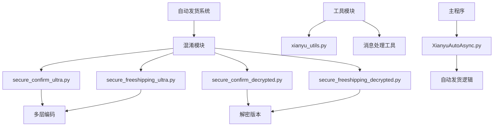
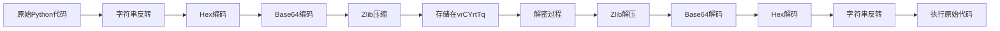
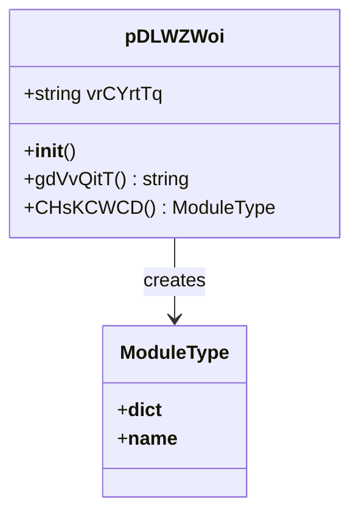
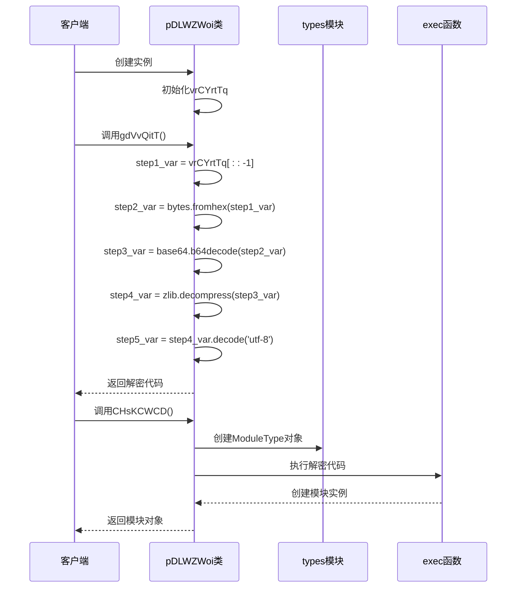
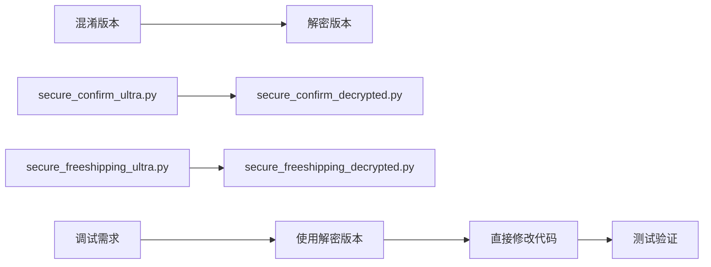

# 代码混淆机制

<cite>
**本文档引用的文件**
- [secure_confirm_ultra.py](file://secure_confirm_ultra.py)
- [secure_freeshipping_ultra.py](file://secure_freeshipping_ultra.py)
- [secure_confirm_decrypted.py](file://secure_confirm_decrypted.py)
- [secure_freeshipping_decrypted.py](file://secure_freeshipping_decrypted.py)
- [README.md](file://README.md)
- [XianyuAutoAsync.py](file://XianyuAutoAsync.py)
- [utils/xianyu_utils.py](file://utils/xianyu_utils.py)
</cite>

## 目录
1. [引言](#引言)
2. [项目结构概览](#项目结构概览)
3. [核心混淆技术](#核心混淆技术)
4. [pDLWZWoi类深度分析](#pDLWZWoi类深度分析)
5. [多层编码解码流程](#多层编码解码流程)
6. [别名导入策略](#别名导入策略)
7. [解密与调试技巧](#解密与调试技巧)
8. [安全边界与风险评估](#安全边界与风险评估)
9. [维护与更新指南](#维护与更新指南)
10. [总结](#总结)

## 引言

闲鱼自动回复系统采用了先进的多层代码混淆技术，通过字符串反转、Hex编码、Base64编码和Zlib压缩的组合方式对核心Python源码进行深度混淆。这种混淆机制不仅有效防止逆向工程和静态分析，还为系统的知识产权保护提供了强有力的保障。

本文档深入解析了系统中采用的代码混淆技术，详细说明了其工作原理、安全边界以及在合法维护场景下的应对策略。

## 项目结构概览

系统的核心混淆文件位于项目根目录，主要包括：



**图表来源**
- [secure_confirm_ultra.py](file://secure_confirm_ultra.py#L1-L43)
- [secure_freeshipping_ultra.py](file://secure_freeshipping_ultra.py#L1-L44)
- [secure_confirm_decrypted.py](file://secure_confirm_decrypted.py#L1-L181)
- [secure_freeshipping_decrypted.py](file://secure_freeshipping_decrypted.py#L1-L131)

**章节来源**
- [README.md](file://README.md#L556-L570)

## 核心混淆技术

### 多层编码组合

系统采用四层编码技术对核心代码进行混淆：

1. **字符串反转**：将原始字符串进行完全反转
2. **Hex编码**：将反转后的字符串转换为十六进制表示
3. **Base64编码**：对Hex编码后的数据进行Base64编码
4. **Zlib压缩**：最后使用Zlib算法对数据进行压缩

### 字符串存储结构

混淆后的字符串存储在`vrCYrtTq`字段中，该字段包含了经过多层编码处理的原始Python代码：



**图表来源**
- [secure_confirm_ultra.py](file://secure_confirm_ultra.py#L16-L23)
- [secure_freeshipping_ultra.py](file://secure_freeshipping_ultra.py#L16-L24)

**章节来源**
- [secure_confirm_ultra.py](file://secure_confirm_ultra.py#L15-L23)
- [secure_freeshipping_ultra.py](file://secure_freeshipping_ultra.py#L14-L24)

## pDLWZWoi类深度分析

### 类结构设计

`pDLWZWoi`类是整个混淆系统的核心，包含以下关键方法：



**图表来源**
- [secure_confirm_ultra.py](file://secure_confirm_ultra.py#L11-L42)
- [secure_freeshipping_ultra.py](file://secure_freeshipping_ultra.py#L11-L43)

### vrCYrtTq字段详解

`vrCYrtTq`字段存储的是经过多层编码处理的混淆字符串，其结构特点：

1. **长度特征**：字段内容通常非常长，包含大量十六进制字符
2. **编码层次**：从内到外依次为Zlib压缩、Base64编码、Hex编码、字符串反转
3. **完整性**：包含完整的Python模块代码，可以直接执行

### 方法功能分析

#### gdVvQitT()方法
该方法实现了完整的解密流程：

1. **step1_var**：字符串反转操作
2. **step2_var**：十六进制解码
3. **step3_var**：Base64解码
4. **step4_var**：Zlib解压
5. **step5_var**：UTF-8解码

#### CHsKCWCD()方法
该方法负责创建动态模块：

1. **模块创建**：使用`types.ModuleType`创建新模块
2. **代码执行**：通过`exec()`函数执行解密后的代码
3. **模块返回**：返回包含原始功能的模块对象

**章节来源**
- [secure_confirm_ultra.py](file://secure_confirm_ultra.py#L11-L42)
- [secure_freeshipping_ultra.py](file://secure_freeshipping_ultra.py#L11-L43)

## 多层编码解码流程

### 完整解密流程



**图表来源**
- [secure_confirm_ultra.py](file://secure_confirm_ultra.py#L16-L30)
- [secure_freeshipping_ultra.py](file://secure_freeshipping_ultra.py#L16-L30)

### 编码步骤详解

#### 第一步：字符串反转
```python
step1_var = self.vrCYrtTq[::-1]
```
将存储的混淆字符串进行完全反转，这是解密的第一步。

#### 第二步：Hex解码
```python
step2_var = bytes.fromhex(step1_var)
```
将反转后的十六进制字符串转换为字节序列。

#### 第三步：Base64解码
```python
step3_var = LsWYPXmT.b64decode(step2_var)
```
使用别名`LsWYPXmT`进行Base64解码，得到压缩的字节数据。

#### 第四步：Zlib解压
```python
step4_var = oxWwRTDp.decompress(step3_var)
```
使用别名`oxWwRTDp`进行Zlib解压，还原原始的Python代码。

#### 第五步：UTF-8解码
```python
step5_var = step4_var.decode('utf-8')
```
将解压后的字节数据转换为字符串形式。

**章节来源**
- [secure_confirm_ultra.py](file://secure_confirm_ultra.py#L16-L23)
- [secure_freeshipping_ultra.py](file://secure_freeshipping_ultra.py#L16-L24)

## 别名导入策略

### 导入别名设计

系统采用精心设计的导入别名来进一步隐藏导入意图：

| 原始模块 | 别名 | 用途 |
|---------|------|------|
| `base64` | `LsWYPXmT` | Base64编码解码 |
| `zlib` | `oxWwRTDp` | Zlib压缩解压 |
| `types` | `AUdcGvRk` | 动态模块创建 |
| `binascii` | `qKAaznVW` | 二进制数据处理 |

### 别名选择原则

1. **随机性**：别名选择没有明显规律，增加分析难度
2. **长度**：使用较长的随机字符串，避免被静态分析发现
3. **唯一性**：每个模块使用不同的别名，避免关联分析
4. **混淆性**：别名看起来像是正常的变量名而非模块名

### 安全考虑

这种别名策略具有以下安全优势：

1. **静态分析防护**：传统的静态分析工具难以识别真实的模块导入
2. **动态行为隐藏**：运行时才能发现实际的模块功能
3. **混淆效果**：即使代码被反编译，也难以理解模块的真实用途

**章节来源**
- [secure_confirm_ultra.py](file://secure_confirm_ultra.py#L4-L8)
- [secure_freeshipping_ultra.py](file://secure_freeshipping_ultra.py#L4-L8)

## 解密与调试技巧

### 解密流程实现

系统提供了对应的解密版本文件，便于理解和调试：



**图表来源**
- [secure_confirm_decrypted.py](file://secure_confirm_decrypted.py#L1-L181)
- [secure_freeshipping_decrypted.py](file://secure_freeshipping_decrypted.py#L1-L131)

### 调试技巧

#### 1. 分步解密测试
```python
# 分步测试解密过程
step1 = original_string[::-1]
step2 = bytes.fromhex(step1)
step3 = base64.b64decode(step2)
step4 = zlib.decompress(step3)
step5 = step4.decode('utf-8')
print(step5)  # 输出解密后的代码
```

#### 2. 模块导入调试
```python
# 测试模块创建过程
from types import ModuleType
module_obj = ModuleType('test_module')
exec(decrypted_code, module_obj.__dict__)
print(module_obj.__dict__.keys())  # 查看模块内容
```

#### 3. 错误处理调试
```python
# 添加调试输出
try:
    # 解密和执行代码
    pass
except Exception as e:
    print(f"解密失败: {e}")
    print(f"错误位置: {sys.exc_info()[2].tb_lineno}")
```

### 开发环境配置

为了便于调试，建议在开发环境中：

1. **使用解密版本**：在开发阶段使用解密版本进行功能开发
2. **添加调试信息**：在混淆版本中添加适当的调试输出
3. **版本控制**：分别管理混淆版本和解密版本
4. **自动化测试**：编写单元测试验证混淆和解密的正确性

**章节来源**
- [secure_confirm_decrypted.py](file://secure_confirm_decrypted.py#L1-L181)
- [secure_freeshipping_decrypted.py](file://secure_freeshipping_decrypted.py#L1-L131)

## 安全边界与风险评估

### 当前安全边界

#### 技术防护能力

1. **静态分析防护**：多层编码有效防止静态代码分析
2. **逆向工程难度**：复杂的解密流程增加了逆向工程难度
3. **知识产权保护**：有效保护核心算法和业务逻辑

#### 防护效果评估

| 防护层面 | 效果 | 难度等级 |
|---------|------|----------|
| 静态分析 | 优秀 | 高 |
| 动态调试 | 良好 | 中 |
| 逆向工程 | 优秀 | 高 |
| 代码理解 | 良好 | 中 |

### 潜在绕过风险

#### 1. 动态分析绕过
攻击者可能通过：
- **动态调试**：在运行时断点分析
- **内存dump**：提取解密后的代码
- **API监控**：监控模块创建过程

#### 2. 社会工程学攻击
- **内部人员**：利用内部人员获取解密版本
- **供应链攻击**：通过第三方组件植入恶意代码

#### 3. 技术演进风险
随着分析技术的发展，现有防护可能失效：
- **机器学习分析**：AI辅助的代码分析
- **自动化工具**：专业化的反混淆工具

### 风险缓解措施

#### 短期缓解
1. **定期更新混淆策略**：改变编码顺序或添加新的混淆层
2. **增加动态检测**：在运行时验证代码完整性
3. **环境检测**：检测是否在沙箱环境中运行

#### 长期规划
1. **多层防护**：结合静态混淆和动态保护
2. **行为分析**：监控异常访问模式
3. **法律保护**：配合法律手段保护知识产权

**章节来源**
- [XianyuAutoAsync.py](file://XianyuAutoAsync.py#L4338-L4353)

## 维护与更新指南

### 合法维护原则

在合法维护场景下更新被混淆的源码需要遵循以下原则：

#### 1. 使用解密版本
```python
# 正确做法：使用解密版本进行修改
from secure_confirm_decrypted import SecureConfirm
# 修改解密版本代码
```

#### 2. 保持功能一致性
```python
# 确保修改后功能与原混淆版本一致
# 对比解密版本和混淆版本的功能差异
```

#### 3. 完整测试验证
```python
# 修改后进行全面测试
# 包括功能测试、性能测试和兼容性测试
```

### 更新流程

#### 步骤1：获取解密版本
```python
# 从解密版本文件中获取原始代码
from secure_confirm_decrypted import SecureConfirm
```

#### 步骤2：功能修改
```python
# 在解密版本上进行必要的功能修改
class SecureConfirmModified(SecureConfirm):
    def new_method(self):
        # 新增功能
        pass
```

#### 步骤3：重新混淆
```python
# 将修改后的代码重新进行多层编码
modified_code = compile_to_bytes(modified_class)
encoded_code = encode_multilayer(modified_code)
```

#### 步骤4：测试验证
```python
# 验证混淆后的代码功能正常
test_instance = create_and_test_confirmed(encoded_code)
```

### 版本管理策略

#### 1. 分支管理
- **master分支**：维护解密版本
- **release分支**：维护混淆版本
- **feature分支**：开发新功能

#### 2. 自动化流程
```yaml
# CI/CD流程示例
stages:
  - develop
  - test
  - release
  
develop:
  script:
    - python -m pytest tests/
    - python build_confusion.py
```

#### 3. 文档维护
- **变更记录**：记录每次修改的内容和原因
- **测试报告**：保存测试结果和验证信息
- **部署指南**：提供清晰的部署和更新指南

**章节来源**
- [secure_confirm_decrypted.py](file://secure_confirm_decrypted.py#L1-L181)
- [secure_freeshipping_decrypted.py](file://secure_freeshipping_decrypted.py#L1-L131)

## 总结

闲鱼自动回复系统的代码混淆机制体现了现代软件保护技术的先进水平。通过多层编码、别名导入和动态模块创建等技术，系统实现了有效的知识产权保护和安全防护。

### 技术亮点

1. **多层编码组合**：字符串反转、Hex编码、Base64编码和Zlib压缩的完美结合
2. **智能别名策略**：精心设计的导入别名增加了分析难度
3. **动态模块创建**：运行时解密和执行，有效防止静态分析
4. **解密版本支持**：为合法维护提供了便利的调试环境

### 应用价值

该混淆机制不仅保护了系统的知识产权，还为类似项目提供了宝贵的技术参考。在实际应用中，可以根据具体需求调整混淆策略，在安全性和可维护性之间找到最佳平衡点。

### 发展趋势

随着安全技术的不断发展，代码混淆技术也在不断演进。未来的趋势可能包括：
- **人工智能辅助混淆**：利用AI生成更复杂的混淆模式
- **硬件保护结合**：与硬件安全模块结合提供更强保护
- **动态演化**：根据威胁环境动态调整保护策略

通过深入理解和合理应用这些技术，可以为软件产品提供更加全面和有效的安全保障。