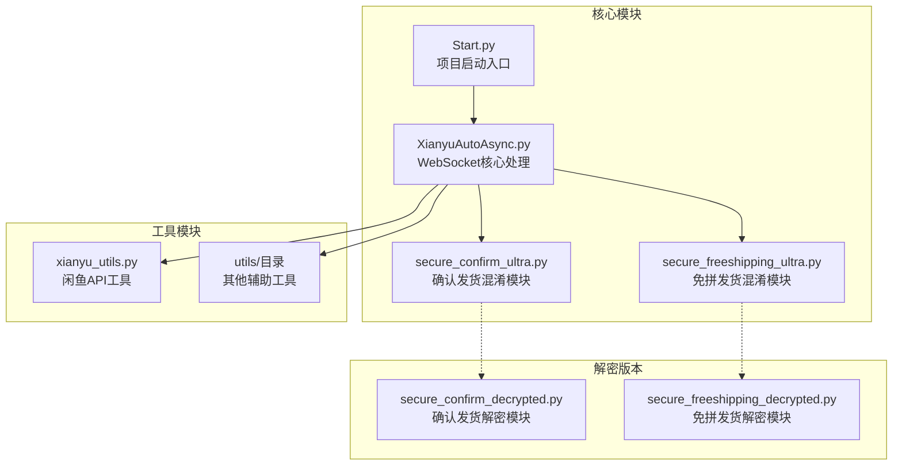
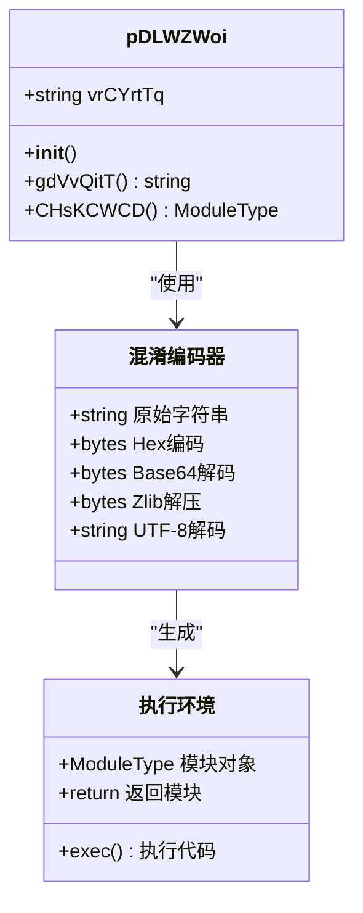
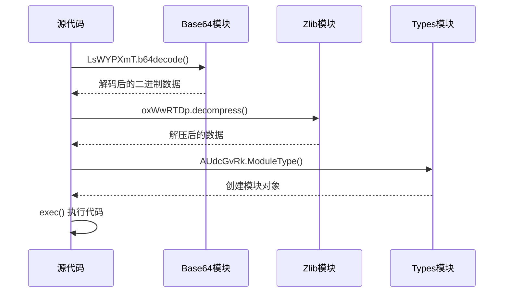

# 混淆编码原理

<cite>
**本文档引用的文件**
- [secure_confirm_ultra.py](file://secure_confirm_ultra.py)
- [secure_freeshipping_ultra.py](file://secure_freeshipping_ultra.py)
- [secure_confirm_decrypted.py](file://secure_confirm_decrypted.py)
- [secure_freeshipping_decrypted.py](file://secure_freeshipping_decrypted.py)
- [XianyuAutoAsync.py](file://XianyuAutoAsync.py)
- [README.md](file://README.md)
</cite>

## 目录
1. [引言](#引言)
2. [项目结构概览](#项目结构概览)
3. [核心混淆机制](#核心混淆机制)
4. [多层编码流程详解](#多层编码流程详解)
5. [别名导入的安全作用](#别名导入的安全作用)
6. [解码执行机制](#解码执行机制)
7. [调试与还原指南](#调试与还原指南)
8. [安全防护分析](#安全防护分析)
9. [风险评估与建议](#风险评估与建议)
10. [结论](#结论)

## 引言

本文档深入分析闲鱼自动回复系统中实现的多层代码混淆编码机制。该系统采用了先进的加密保护技术，通过字符串反转、Hex编码、Base64编码与Zlib压缩的嵌套组合，为关键功能模块提供了强大的安全防护。这种设计不仅能够有效防止恶意逆向工程，还能保护核心业务逻辑不被轻易窃取。

## 项目结构概览

该项目采用模块化架构设计，其中混淆编码模块位于核心功能区域：



**图表来源**
- [Start.py](file://Start.py#L1-L50)
- [XianyuAutoAsync.py](file://XianyuAutoAsync.py#L2239-L4364)

**章节来源**
- [README.md](file://README.md#L111-L192)

## 核心混淆机制

### 基础架构设计

混淆编码模块的核心设计理念是通过多层加密保护关键功能代码，确保即使被获取也无法直接理解其业务逻辑。系统采用以下核心组件：



**图表来源**
- [secure_confirm_ultra.py](file://secure_confirm_ultra.py#L11-L43)
- [secure_freeshipping_ultra.py](file://secure_freeshipping_ultra.py#L11-L44)

### 字符串存储机制

混淆字符串通过`vrCYrtTq`字段存储，该字段包含了经过多层编码的原始Python代码。这种设计具有以下优势：

1. **静态分析难度增加**：字符串本身看起来是随机的十六进制数据
2. **动态加载机制**：只有在运行时才会解码和执行
3. **内存中短暂存在**：解码后立即执行，减少被截获的风险

**章节来源**
- [secure_confirm_ultra.py](file://secure_confirm_ultra.py#L13-L14)
- [secure_freeshipping_ultra.py](file://secure_freeshipping_ultra.py#L14-L15)

## 多层编码流程详解

### 编码顺序与原理

系统采用严格的四层编码顺序，每层都承担着不同的安全职责：

```mermaid
flowchart TD
A[原始Python代码] --> B[字符串反转<br/>step1_var = self.vrCYrtTq[::-1]]
B --> C[Hex解码<br/>bytes.fromhex(step1_var)]
C --> D[Base64解码<br/>LsWYPXmT.b64decode(step2_var)]
D --> E[Zlib解压<br/>oxWwRTDp.decompress(step3_var)]
E --> F[UTF-8解码<br/>step4_var.decode('utf-8')]
F --> G[可执行Python代码]
style A fill:#e1f5fe
style G fill:#e8f5e8
style B fill:#fff3e0
style C fill:#fff3e0
style D fill:#fff3e0
style E fill:#fff3e0
style F fill:#fff3e0
```

**图表来源**
- [secure_confirm_ultra.py](file://secure_confirm_ultra.py#L16-L23)
- [secure_freeshipping_ultra.py](file://secure_freeshipping_ultra.py#L16-L24)

### 各层编码的具体作用

#### 第一层：字符串反转
- **目的**：增加静态分析难度
- **实现**：`step1_var = self.vrCYrtTq[::-1]`
- **效果**：使原始字符串在存储时呈现完全不同的形态

#### 第二层：Hex编码
- **目的**：将二进制数据转换为可打印字符
- **实现**：`bytes.fromhex(step1_var)`
- **效果**：确保字符串可以在各种环境中安全传输

#### 第三层：Base64编码
- **目的**：进一步混淆数据结构
- **实现**：`LsWYPXmT.b64decode(step2_var)`
- **效果**：将二进制数据转换为标准的Base64格式

#### 第四层：Zlib压缩
- **目的**：减小文件体积并增加解码复杂度
- **实现**：`oxWwRTDp.decompress(step3_var)`
- **效果**：在解码过程中完成数据还原

**章节来源**
- [secure_confirm_ultra.py](file://secure_confirm_ultra.py#L16-L23)
- [secure_freeshipping_ultra.py](file://secure_freeshipping_ultra.py#L16-L24)

## 别名导入的安全作用

### 导入语句分析

系统使用了特殊的别名导入方式，这不仅仅是简单的代码风格选择：

```python
import base64 as LsWYPXmT
import zlib as oxWwRTDp
import types as AUdcGvRk
import binascii as qKAaznVW
```

### 安全防护机制

#### 1. 静态分析混淆
- **目的**：增加静态代码分析的难度
- **效果**：即使分析者发现了导入语句，也无法直接识别其用途

#### 2. 运行时动态解析
- **目的**：防止基于导入路径的检测
- **实现**：通过别名间接访问标准库功能

#### 3. 模糊化攻击目标
- **目的**：分散分析者的注意力
- **效果**：使得恶意分析者难以确定真正的攻击目标

### 实际应用场景

在解码过程中，这些别名被用来执行关键操作：



**图表来源**
- [secure_confirm_ultra.py](file://secure_confirm_ultra.py#L5-L8)
- [secure_freeshipping_ultra.py](file://secure_freeshipping_ultra.py#L5-L8)

**章节来源**
- [secure_confirm_ultra.py](file://secure_confirm_ultra.py#L5-L8)
- [secure_freeshipping_ultra.py](file://secure_freeshipping_ultra.py#L5-L8)

## 解码执行机制

### 模块创建流程

解码后的代码通过动态模块创建机制执行：

```mermaid
flowchart TD
A[gdVvQitT方法] --> B[执行解码流程]
B --> C[生成可执行代码]
C --> D[创建模块对象<br/>AUdcGvRk.ModuleType]
D --> E[执行代码<br/>exec(decoded_code, module_obj.__dict__)]
E --> F[返回模块实例]
G[CHsKCWCD方法] --> H[调用gdVvQitT]
H --> I[创建模块]
I --> J[返回SecureConfirm/SafeFreeshipping]
style A fill:#e3f2fd
style F fill:#e8f5e8
style G fill:#e3f2fd
style J fill:#e8f5e8
```

**图表来源**
- [secure_confirm_ultra.py](file://secure_confirm_ultra.py#L25-L32)
- [secure_freeshipping_ultra.py](file://secure_freeshipping_ultra.py#L26-L33)

### 内存清理机制

为防止代码残留，系统实现了严格的内存清理：

```python
# 清理所有变量
del OhPXQtOT
del amBCLCwC
del pDLWZWoi
```

这种设计确保：
1. **内存安全**：防止敏感信息在内存中长期存在
2. **调试困难**：增加了逆向工程的难度
3. **性能优化**：及时释放不需要的变量

**章节来源**
- [secure_confirm_ultra.py](file://secure_confirm_ultra.py#L39-L43)
- [secure_freeshipping_ultra.py](file://secure_freeshipping_ultra.py##40-L44)

## 调试与还原指南

### 合法调试方法

对于开发者而言，系统提供了对应的解密版本模块，允许合法调试和分析：

#### 1. 使用解密版本模块
```python
# 正确的调试方式
from secure_confirm_decrypted import SecureConfirm
from secure_freeshipping_decrypted import SecureFreeshipping
```

#### 2. 开发环境配置
- **IDE支持**：使用Python IDE的调试功能
- **断点设置**：在解密版本中设置断点进行逐步调试
- **日志记录**：利用系统的日志功能跟踪执行流程

### 还原步骤详解

#### 步骤1：获取混淆字符串
```python
# 从混淆模块中提取原始字符串
original_string = secure_confirm_ultra.pDLWZWoi().vrCYrtTq
```

#### 步骤2：执行解码流程
```python
# 按照原始编码顺序进行解码
step1 = original_string[::-1]           # 字符串反转
step2 = bytes.fromhex(step1)            # Hex解码
step3 = base64.b64decode(step2)         # Base64解码
step4 = zlib.decompress(step3)          # Zlib解压
step5 = step4.decode('utf-8')           # UTF-8解码
```

#### 步骤3：分析解码结果
- **语法检查**：验证解码后的代码语法正确性
- **功能分析**：理解模块的功能和业务逻辑
- **安全评估**：检查是否存在安全隐患

**章节来源**
- [secure_confirm_decrypted.py](file://secure_confirm_decrypted.py#L1-L181)
- [secure_freeshipping_decrypted.py](file://secure_freeshipping_decrypted.py#L1-L131)

## 安全防护分析

### 防护机制有效性评估

#### 1. 静态分析防护
- **效果**：显著增加静态代码分析的难度
- **局限性**：无法防止有经验的逆向工程师
- **改进建议**：结合动态混淆技术

#### 2. 动态执行保护
- **效果**：只有在运行时才能获取原始代码
- **优势**：有效防止内存转储攻击
- **挑战**：需要确保解码过程的安全性

#### 3. 内存管理保护
- **效果**：及时清理敏感数据
- **重要性**：防止数据泄露和二次攻击
- **最佳实践**：配合垃圾回收机制

### 防御策略对比

| 防御层次 | 技术手段 | 防护效果 | 实现难度 |
|---------|---------|---------|---------|
| 静态混淆 | 字符串反转+编码 | 中等 | 低 |
| 动态保护 | 运行时解码 | 高 | 中等 |
| 内存清理 | 及时销毁变量 | 高 | 低 |
| 多层加密 | 多种编码组合 | 很高 | 中等 |

**章节来源**
- [secure_confirm_ultra.py](file://secure_confirm_ultra.py#L1-L43)
- [secure_freeshipping_ultra.py](file://secure_freeshipping_ultra.py#L1-L44)

## 风险评估与建议

### 潜在风险点

#### 1. 解码漏洞风险
- **风险描述**：如果解码算法存在漏洞，可能导致代码泄露
- **缓解措施**：定期更新编码算法，加强代码审查

#### 2. 内存转储攻击
- **风险描述**：攻击者可能通过内存转储获取解码后的代码
- **缓解措施**：结合硬件安全模块（HSM）

#### 3. 侧信道攻击
- **风险描述**：通过执行时间分析推断内部逻辑
- **缓解措施**：引入时间混淆机制

### 安全改进建议

#### 1. 增强动态保护
```python
# 示例：引入时间混淆
import random
import time

def safe_sleep(duration):
    # 引入随机时间偏移
    offset = random.uniform(0.001, 0.01)
    time.sleep(duration + offset)
```

#### 2. 多维度混淆
- **代码混淆**：变量名、函数名混淆
- **控制流混淆**：引入虚假分支
- **数据混淆**：加密关键数据结构

#### 3. 定期安全审计
- **频率**：每季度进行一次全面安全审计
- **范围**：包括所有混淆模块和加密算法
- **工具**：使用专业的安全分析工具

### 设计边界说明

#### 1. 性能考虑
- **平衡点**：在安全性和性能之间找到最佳平衡
- **优化策略**：缓存解码结果，减少重复计算

#### 2. 兼容性保证
- **Python版本**：确保在目标Python版本上正常运行
- **依赖管理**：最小化外部依赖，降低兼容性风险

#### 3. 可维护性
- **文档完善**：提供详细的混淆机制文档
- **测试覆盖**：建立完善的测试体系

**章节来源**
- [XianyuAutoAsync.py](file://XianyuAutoAsync.py#L2239-L4364)

## 结论

闲鱼自动回复系统中的混淆编码机制代表了现代软件保护技术的发展方向。通过多层编码、别名导入、动态执行和内存清理等技术的综合运用，该系统实现了对核心功能的有效保护。

### 技术亮点
1. **多层编码组合**：字符串反转、Hex编码、Base64编码和Zlib压缩的完美结合
2. **动态执行机制**：运行时解码，有效防止静态分析
3. **内存安全设计**：及时清理敏感数据，防止内存泄露
4. **合法调试支持**：提供解密版本便于开发者调试

### 应用价值
- **商业保护**：有效保护核心业务逻辑不被窃取
- **技术示范**：展示了现代软件保护的最佳实践
- **安全教育**：为安全研究人员提供了宝贵的学习案例

### 发展趋势
随着攻击技术的不断演进，软件保护技术也需要持续创新。未来的保护机制可能会更加注重：
- **硬件辅助保护**：利用TPM、SGX等硬件安全特性
- **人工智能对抗**：结合AI技术提升保护效果
- **零信任架构**：在零信任安全模型下重新设计保护机制

这种多层次的混淆编码技术不仅为当前的软件保护提供了有效解决方案，也为未来的技术发展奠定了坚实基础。