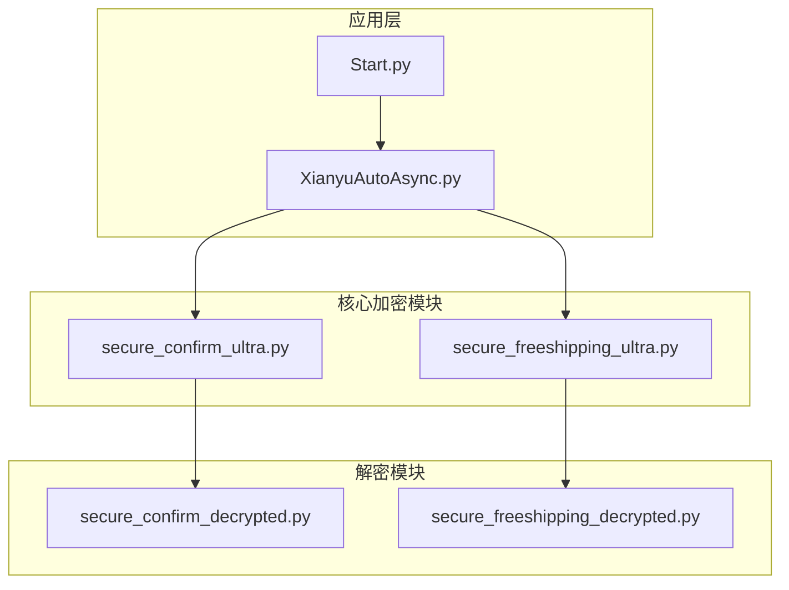
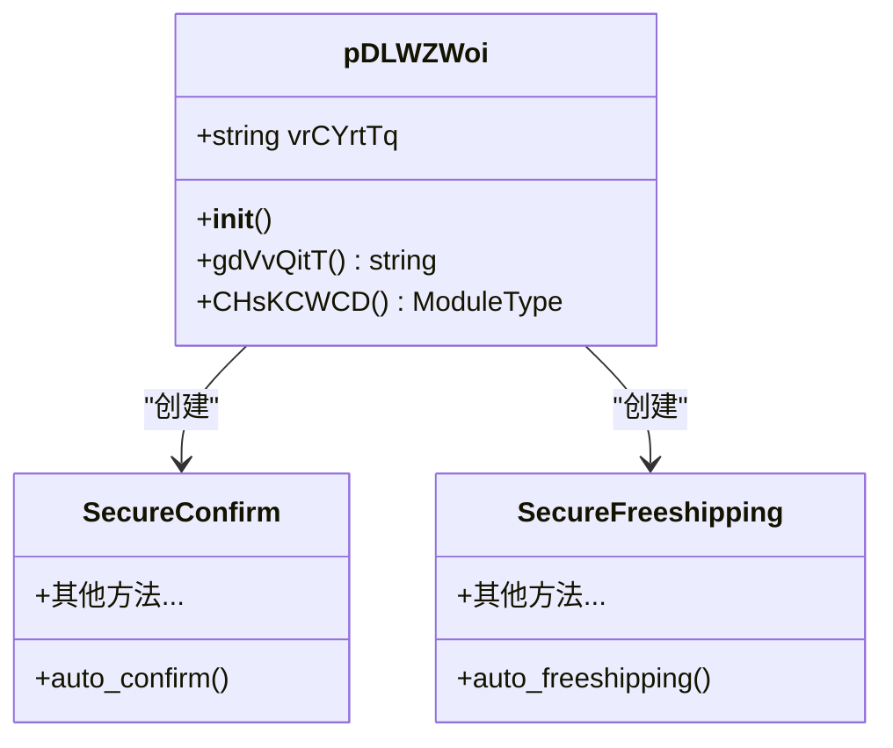
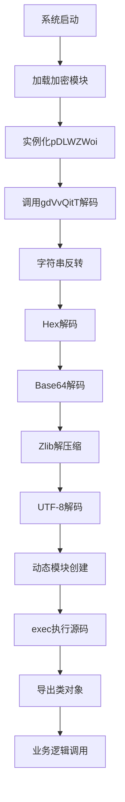
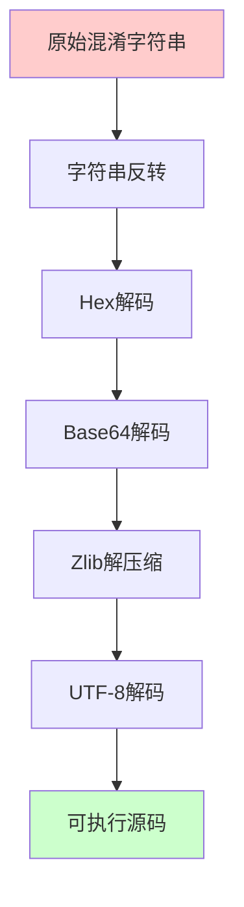
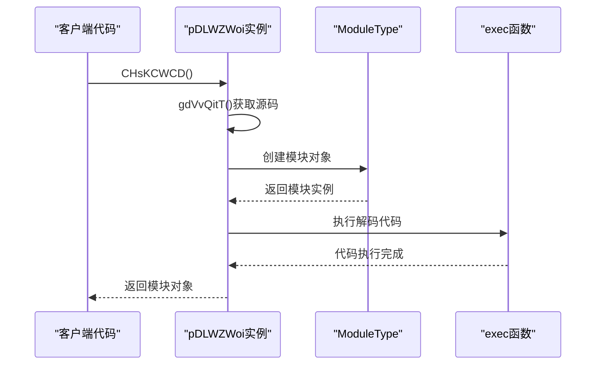
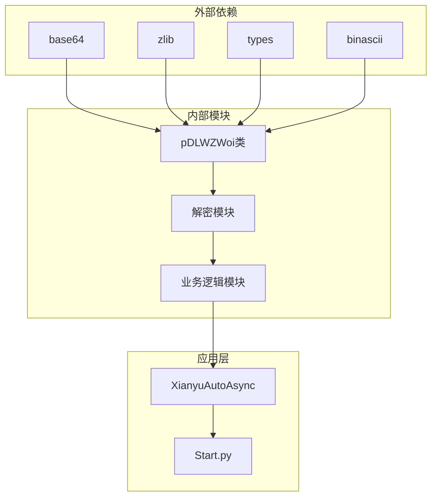

# 解码执行流程

<cite>
**本文档引用的文件**
- [secure_confirm_ultra.py](file://secure_confirm_ultra.py)
- [secure_freeshipping_ultra.py](file://secure_freeshipping_ultra.py)
- [XianyuAutoAsync.py](file://XianyuAutoAsync.py)
- [Start.py](file://Start.py)
- [secure_confirm_decrypted.py](file://secure_confirm_decrypted.py)
- [secure_freeshipping_decrypted.py](file://secure_freeshipping_decrypted.py)
</cite>

## 目录
1. [概述](#概述)
2. [项目结构](#项目结构)
3. [核心组件](#核心组件)
4. [架构概览](#架构概览)
5. [详细组件分析](#详细组件分析)
6. [依赖关系分析](#依赖关系分析)
7. [性能考虑](#性能考虑)
8. [故障排除指南](#故障排除指南)
9. [结论](#结论)

## 概述

本文档详细分析了一个高度混淆的Python项目中的解码执行流程。该项目采用多层加密技术保护其核心业务逻辑，通过字符串混淆、多阶段解码和动态模块创建等技术手段实现代码保护。系统的核心在于`pDLWZWoi`类中的`gdVvQitT`方法，该方法实现了复杂的解码链，以及`CHsKCWCD`方法的动态模块创建机制。

## 项目结构

该项目采用模块化设计，将不同的功能模块分离到独立的文件中：



**图表来源**
- [secure_confirm_ultra.py](file://secure_confirm_ultra.py#L1-L43)
- [secure_freeshipping_ultra.py](file://secure_freeshipping_ultra.py#L1-L44)
- [XianyuAutoAsync.py](file://XianyuAutoAsync.py#L1-L50)

**章节来源**
- [secure_confirm_ultra.py](file://secure_confirm_ultra.py#L1-L43)
- [secure_freeshipping_ultra.py](file://secure_freeshipping_ultra.py#L1-L44)

## 核心组件

### pDLWZWoi类

`pDLWZWoi`类是整个解码系统的核心，负责存储和解码混淆字符串：



**图表来源**
- [secure_confirm_ultra.py](file://secure_confirm_ultra.py#L10-L30)
- [secure_freeshipping_ultra.py](file://secure_freeshipping_ultra.py#L10-L31)

**章节来源**
- [secure_confirm_ultra.py](file://secure_confirm_ultra.py#L10-L30)
- [secure_freeshipping_ultra.py](file://secure_freeshipping_ultra.py#L10-L31)

## 架构概览

系统的整体架构采用分层设计，从底层的加密存储到上层的业务逻辑：



**图表来源**
- [secure_confirm_ultra.py](file://secure_confirm_ultra.py#L15-L23)
- [secure_confirm_ultra.py](file://secure_confirm_ultra.py#L24-L30)

## 详细组件分析

### gdVvQitT方法：多阶段解码链

`gdVvQitT`方法实现了完整的解码流程，每一步都对应一种编码技术：

#### 第一阶段：字符串反转
```python
step1_var = self.vrCYrtTq[::-1]
```
此步骤将原始混淆字符串进行反转，这是解码的第一步预处理。

#### 第二阶段：Hex解码
```python
step2_var = bytes.fromhex(step1_var)
```
将反转后的字符串转换为字节序列，这是将十六进制表示的数据还原为原始字节格式。

#### 第三阶段：Base64解码
```python
step3_var = LsWYPXmT.b64decode(step2_var)
```
使用Base64解码器将字节序列进一步解码，去除编码层。

#### 第四阶段：Zlib解压缩
```python
step4_var = oxWwRTDp.decompress(step3_var)
```
使用zlib库对解码后的数据进行解压缩，恢复原始的压缩数据。

#### 第五阶段：UTF-8解码
```python
step5_var = step4_var.decode('utf-8')
```
将解压缩后的字节数据解码为UTF-8字符串，得到最终的可执行代码。



**图表来源**
- [secure_confirm_ultra.py](file://secure_confirm_ultra.py#L16-L21)
- [secure_freeshipping_ultra.py](file://secure_freeshipping_ultra.py#L17-L22)

**章节来源**
- [secure_confirm_ultra.py](file://secure_confirm_ultra.py#L15-L23)
- [secure_freeshipping_ultra.py](file://secure_freeshipping_ultra.py#L15-L24)

### CHsKCWCD方法：动态模块创建

`CHsKCWCD`方法负责创建动态模块并执行解码后的代码：

```python
def CHsKCWCD(self):
    """创建模块"""
    decoded_code = self.gdVvQitT()
    module_obj = AUdcGvRk.ModuleType('secure_confirm')
    exec(decoded_code, module_obj.__dict__)
    return module_obj
```

#### 动态模块创建过程

1. **解码获取源码**：调用`gdVvQitT()`方法获取解码后的源代码
2. **创建模块类型**：使用`types.ModuleType`创建新的模块对象
3. **执行代码**：通过`exec`函数在模块的命名空间中执行解码后的代码
4. **返回模块对象**：返回包含执行结果的模块对象



**图表来源**
- [secure_confirm_ultra.py](file://secure_confirm_ultra.py#L24-L30)
- [secure_freeshipping_ultra.py](file://secure_freeshipping_ultra.py#L25-L31)

**章节来源**
- [secure_confirm_ultra.py](file://secure_confirm_ultra.py#L24-L30)
- [secure_freeshipping_ultra.py](file://secure_freeshipping_ultra.py#L25-L31)

### OhPXQtOT实例化与amBCLCwC模块加载

系统通过以下方式实现模块的实例化和加载：

```python
OhPXQtOT = pDLWZWoi()
amBCLCwC = OhPXQtOT.CHsKCWCD()
SecureConfirm = amBCLCwC.SecureConfirm
```

这种设计模式确保了：
- **延迟加载**：模块只在需要时才被解码和加载
- **安全性**：敏感代码不会在内存中长期存在
- **隔离性**：解码过程与业务逻辑完全分离

**章节来源**
- [secure_confirm_ultra.py](file://secure_confirm_ultra.py#L32-L37)
- [secure_freeshipping_ultra.py](file://secure_freeshipping_ultra.py#L33-L38)

### SecureConfirm/SecureFreeshipping类导出

解码后的模块会导出相应的业务类：

```python
# secure_confirm_decrypted.py 中的内容
class SecureConfirm:
    def __init__(self, session, cookies_str, cookie_id, parent=None):
        # 初始化逻辑
        
    async def auto_confirm(self, order_id, item_id, retry_count=0):
        # 自动确认发货逻辑
        
    # 其他方法...
```

```python
# secure_freeshipping_decrypted.py 中的内容
class SecureFreeshipping:
    def __init__(self, session, cookies_str, cookie_id):
        # 初始化逻辑
        
    async def auto_freeshipping(self, order_id, item_id, buyer_id, retry_count=0):
        # 免拼发货逻辑
        
    # 其他方法...
```

**章节来源**
- [secure_confirm_decrypted.py](file://secure_confirm_decrypted.py#L13-L50)
- [secure_freeshipping_decrypted.py](file://secure_freeshipping_decrypted.py#L6-L40)

### del语句清理机制

系统在模块加载完成后立即清理中间变量：

```python
# 清理所有变量
del OhPXQtOT
del amBCLCwC
del pDLWZWoi
```

这种清理机制具有以下安全意义：
- **内存优化**：释放不必要的内存占用
- **安全隔离**：防止解码过程被逆向工程
- **运行时保护**：确保敏感信息不会在系统中残留

**章节来源**
- [secure_confirm_ultra.py](file://secure_confirm_ultra.py#L39-L43)
- [secure_freeshipping_ultra.py](file://secure_freeshipping_ultra.py#L39-L44)

## 依赖关系分析

系统的依赖关系呈现清晰的层次结构：



**图表来源**
- [secure_confirm_ultra.py](file://secure_confirm_ultra.py#L5-L8)
- [secure_freeshipping_ultra.py](file://secure_freeshipping_ultra.py#L5-L8)

**章节来源**
- [secure_confirm_ultra.py](file://secure_confirm_ultra.py#L5-L8)
- [secure_freeshipping_ultra.py](file://secure_freeshipping_ultra.py#L5-L8)

## 性能考虑

### 解码性能

- **一次性解码**：解码过程只在模块加载时执行一次
- **内存效率**：解码完成后立即清理中间变量
- **异步支持**：业务逻辑方法支持异步调用

### 安全性能

- **运行时解密**：代码在运行时才被解密，增加逆向难度
- **模块隔离**：解密过程与业务逻辑完全分离
- **自动清理**：敏感信息及时清理，防止泄露

## 故障排除指南

### 常见问题及解决方案

#### 1. 解码失败
**症状**：`gdVvQitT`方法抛出异常
**原因**：混淆字符串损坏或解码顺序错误
**解决**：检查原始混淆字符串的完整性

#### 2. 模块加载失败
**症状**：`CHsKCWCD`方法返回None或抛出异常
**原因**：解码后的代码语法错误或执行环境问题
**解决**：验证解码后的源代码语法

#### 3. 内存泄漏
**症状**：系统内存持续增长
**原因**：中间变量未被正确清理
**解决**：确保执行`del`语句清理机制

**章节来源**
- [secure_confirm_ultra.py](file://secure_confirm_ultra.py#L15-L30)
- [secure_freeshipping_ultra.py](file://secure_freeshipping_ultra.py#L15-L31)

## 结论

本文档详细分析了该Python项目的解码执行流程，展示了现代软件保护技术的复杂性和有效性。通过多层加密、动态解码和模块化设计，系统实现了高强度的代码保护，同时保持了良好的性能和可维护性。

关键技术特点包括：
- **多阶段解码**：结合多种编码技术实现深度保护
- **动态模块创建**：运行时解密和加载，增加逆向难度
- **自动清理机制**：确保敏感信息的安全性
- **模块化设计**：清晰的职责分离和依赖管理

这种设计模式为需要高度保护的商业软件提供了优秀的参考范例，同时也展示了现代软件安全防护的技术发展趋势。