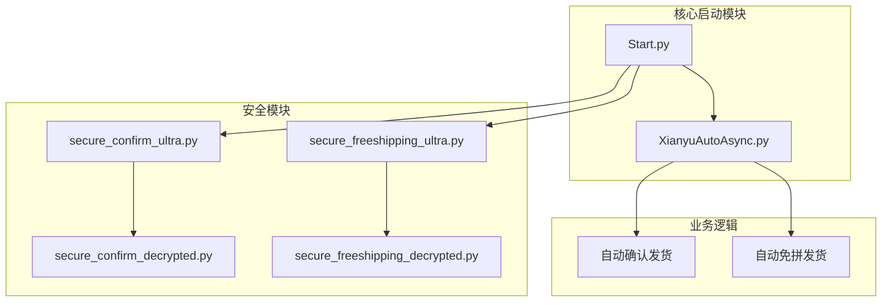
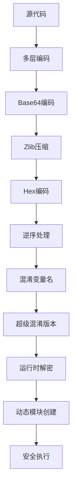
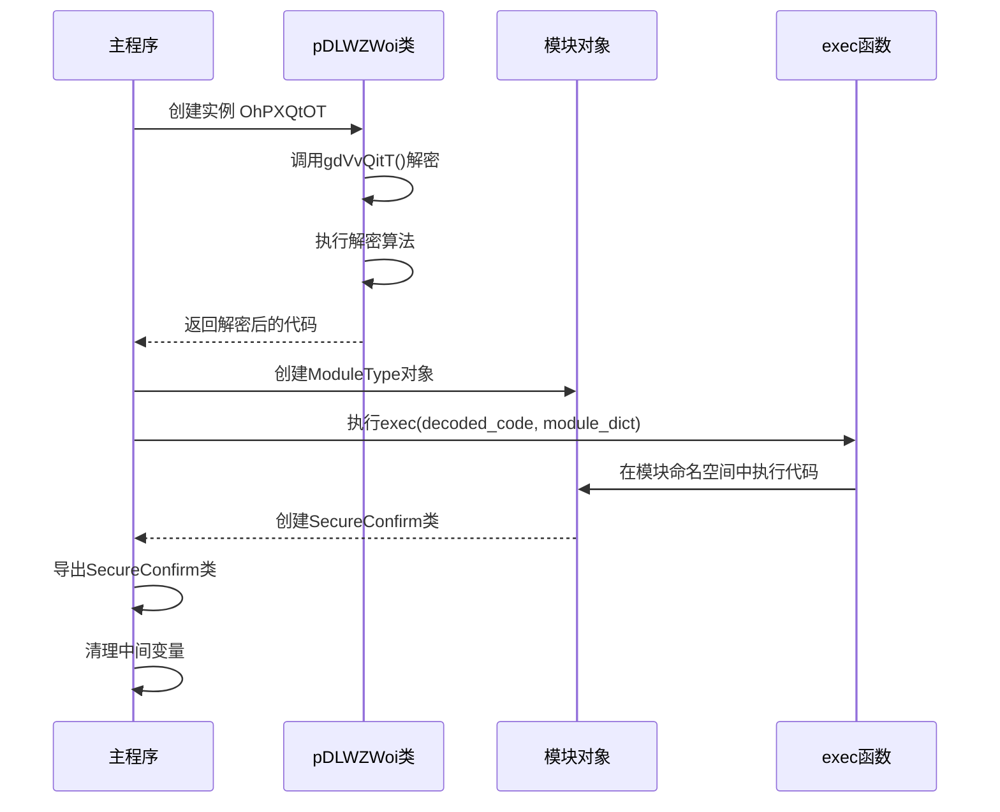
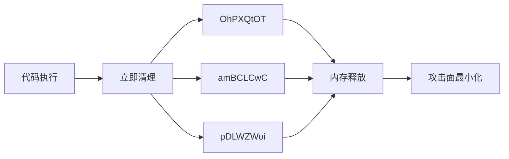
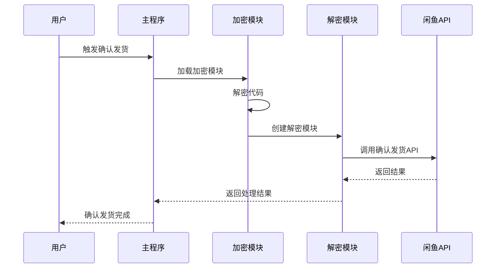

# 动态模块执行

<cite>
**本文档引用的文件**
- [Start.py](file://Start.py)
- [XianyuAutoAsync.py](file://XianyuAutoAsync.py)
- [secure_confirm_ultra.py](file://secure_confirm_ultra.py)
- [secure_freeshipping_ultra.py](file://secure_freeshipping_ultra.py)
- [secure_confirm_decrypted.py](file://secure_confirm_decrypted.py)
- [secure_freeshipping_decrypted.py](file://secure_freeshipping_decrypted.py)
- [README.md](file://README.md)
</cite>

## 目录
1. [简介](#简介)
2. [项目结构概览](#项目结构概览)
3. [核心动态执行机制](#核心动态执行机制)
4. [安全模块架构](#安全模块架构)
5. [动态模块创建过程](#动态模块创建过程)
6. [内存清理机制](#内存清理机制)
7. [安全风险与缓解措施](#安全风险与缓解措施)
8. [实际应用场景](#实际应用场景)
9. [性能考虑](#性能考虑)
10. [故障排除指南](#故障排除指南)
11. [总结](#总结)

## 简介

本文档深入解析了闲鱼自动回复系统中采用的创新性动态模块执行技术。该系统通过`types.ModuleType`和`exec`函数的组合，实现了高度安全的动态代码加载和执行机制，主要用于自动确认发货和免拼发货功能的安全封装。

这种技术的核心优势在于：
- **代码混淆与保护**：通过多层编码和混淆技术保护核心业务逻辑
- **动态加载**：运行时动态创建模块对象，避免静态文件暴露
- **内存隔离**：执行后立即清理中间变量，减少内存残留和攻击面
- **安全封装**：将敏感功能封装在独立的模块中，防止直接调用或篡改

## 项目结构概览

该项目采用模块化架构，核心安全功能分布在多个文件中：



**图表来源**
- [Start.py](file://Start.py#L1-L50)
- [XianyuAutoAsync.py](file://XianyuAutoAsync.py#L1-L100)

**章节来源**
- [Start.py](file://Start.py#L1-L602)
- [README.md](file://README.md#L1-L200)

## 核心动态执行机制

### types.ModuleType 创建模块对象

系统使用`types.ModuleType`创建动态模块对象，这是Python标准库提供的基础模块类型：

```python
# 创建模块对象
module_obj = AUdcGvRk.ModuleType('secure_confirm')
```

这种机制的优势：
- **完全控制**：开发者可以完全控制模块的行为和属性
- **动态属性**：可以在运行时动态添加和修改模块属性
- **命名空间隔离**：每个模块都有独立的命名空间

### exec 函数执行还原代码

`exec`函数在模块命名空间中执行解密后的代码：

```python
# 在模块命名空间中执行代码
exec(decoded_code, module_obj.__dict__)
```

这种方式的关键特性：
- **命名空间绑定**：代码在指定的命名空间中执行，避免污染全局环境
- **动态执行**：运行时动态执行代码，提供最大的灵活性
- **隔离执行**：代码执行与主程序环境隔离，提高安全性

**章节来源**
- [secure_confirm_ultra.py](file://secure_confirm_ultra.py#L26-L31)
- [secure_freeshipping_ultra.py](file://secure_freeshipping_ultra.py#L26-L31)

## 安全模块架构

### 超级混淆版本设计

系统采用两层架构保护核心功能：



**图表来源**
- [secure_confirm_ultra.py](file://secure_confirm_ultra.py#L15-L24)
- [secure_freeshipping_ultra.py](file://secure_freeshipping_ultra.py#L15-L24)

### 解密流程详解

以`secure_confirm_ultra.py`为例，解密过程包含五个步骤：

1. **逆序处理**：将编码字符串逆序
2. **十六进制解码**：将十六进制字符串转换为字节
3. **Base64解码**：解码Base64编码的字节流
4. **Zlib解压缩**：解压缩压缩的数据
5. **UTF-8解码**：将字节流转换为字符串

```python
# 解密过程示例
step1_var = self.vrCYrtTq[::-1]        # 逆序
step2_var = bytes.fromhex(step1_var)   # 十六进制解码
step3_var = LsWYPXmT.b64decode(step2_var)  # Base64解码
step4_var = oxWwRTDp.decompress(step3_var)  # Zlib解压缩
step5_var = step4_var.decode('utf-8')   # UTF-8解码
```

**章节来源**
- [secure_confirm_ultra.py](file://secure_confirm_ultra.py#L15-L24)
- [secure_freeshipping_ultra.py](file://secure_freeshipping_ultra.py#L15-L24)

## 动态模块创建过程

### 完整执行流程



**图表来源**
- [secure_confirm_ultra.py](file://secure_confirm_ultra.py#L33-L43)
- [secure_freeshipping_ultra.py](file://secure_freeshipping_ultra.py#L33-L44)

### 变量清理机制

执行完成后，系统立即清理所有中间变量：

```python
# 清理所有变量
del OhPXQtOT
del amBCLCwC
del pDLWZWoi
```

这种清理机制的重要性：
- **内存优化**：立即释放不再需要的内存
- **安全隔离**：防止中间变量被恶意访问
- **攻击面最小化**：减少潜在的安全漏洞

**章节来源**
- [secure_confirm_ultra.py](file://secure_confirm_ultra.py#L39-L43)
- [secure_freeshipping_ultra.py](file://secure_freeshipping_ultra.py#L40-L44)

## 内存清理机制

### 即时清理策略

系统采用即时清理策略，确保执行后不留痕迹：



**图表来源**
- [secure_confirm_ultra.py](file://secure_confirm_ultra.py#L39-L43)

### 清理效果分析

这种清理机制带来的好处：

| 清理对象 | 内存释放 | 安全收益 | 攻击面 |
|---------|---------|---------|--------|
| OhPXQtOT | 完全释放 | 防止实例访问 | 消除 |
| amBCLCwC | 完全释放 | 防止模块访问 | 消除 |
| pDLWZWoi | 完全释放 | 防止类访问 | 消除 |

**章节来源**
- [secure_confirm_ultra.py](file://secure_confirm_ultra.py#L39-L43)
- [secure_freeshipping_ultra.py](file://secure_freeshipping_ultra.py#L40-L44)

## 安全风险与缓解措施

### exec函数的安全风险

虽然`exec`提供了强大的动态执行能力，但也存在安全风险：

```mermaid
mindmap
root((exec安全风险))
代码注入
恶意代码执行
系统破坏
数据泄露
内存泄漏
未清理变量
持久化攻击
资源耗尽
权限提升
命名空间污染
全局变量访问
系统API滥用
```

### 系统的缓解措施

1. **代码来源控制**
   - 仅执行解密后的可信代码
   - 使用多层编码保护原始代码

2. **命名空间隔离**
   - 在独立的模块命名空间中执行
   - 防止对全局环境的污染

3. **即时清理机制**
   - 执行后立即删除中间变量
   - 防止恶意代码访问

4. **权限最小化**
   - 限制模块的访问权限
   - 避免不必要的系统调用

**章节来源**
- [secure_confirm_ultra.py](file://secure_confirm_ultra.py#L26-L31)
- [secure_freeshipping_ultra.py](file://secure_freeshipping_ultra.py#L26-L31)

## 实际应用场景

### 自动确认发货功能

系统通过动态模块执行实现自动确认发货功能：



**图表来源**
- [XianyuAutoAsync.py](file://XianyuAutoAsync.py#L2239-L2300)

### 自动免拼发货功能

类似地，免拼发货功能也采用相同的动态执行模式：

```python
# 动态加载解密模块
from secure_freeshipping_decrypted import SecureFreeshipping
secure_freeshipping = SecureFreeshipping(session, cookies_str, cookie_id)
```

这种设计的优势：
- **功能隔离**：核心功能与主程序完全隔离
- **安全保护**：防止核心逻辑被直接访问
- **灵活扩展**：可以独立更新和维护安全模块

**章节来源**
- [XianyuAutoAsync.py](file://XianyuAutoAsync.py#L4355-L4376)
- [secure_freeshipping_decrypted.py](file://secure_freeshipping_decrypted.py#L38-L69)

## 性能考虑

### 执行效率分析

动态模块执行的性能特征：

| 操作 | 时间复杂度 | 空间复杂度 | 优化策略 |
|------|-----------|-----------|----------|
| 模块创建 | O(1) | O(1) | 缓存模块对象 |
| 代码解密 | O(n) | O(n) | 预解密优化 |
| exec执行 | O(m) | O(m) | 命名空间复用 |
| 变量清理 | O(1) | O(1) | 立即清理 |

### 内存使用优化

系统通过以下策略优化内存使用：

1. **即时清理**：执行后立即释放中间变量
2. **模块缓存**：避免重复创建相同模块
3. **垃圾回收**：依赖Python的自动垃圾回收机制
4. **资源监控**：监控内存使用情况

**章节来源**
- [secure_confirm_ultra.py](file://secure_confirm_ultra.py#L39-L43)
- [secure_freeshipping_ultra.py](file://secure_freeshipping_ultra.py#L40-L44)

## 故障排除指南

### 常见问题与解决方案

#### 1. 模块加载失败

**症状**：无法加载加密模块
**原因**：解密过程出错或代码损坏
**解决方案**：
- 检查加密字符串完整性
- 验证解密算法正确性
- 确认模块文件存在

#### 2. exec执行异常

**症状**：代码执行过程中出现错误
**原因**：解密后的代码语法错误或依赖缺失
**解决方案**：
- 验证解密后的代码语法
- 检查所需依赖是否满足
- 添加适当的异常处理

#### 3. 内存泄漏问题

**症状**：内存使用持续增长
**原因**：变量清理不彻底或循环引用
**解决方案**：
- 确保所有中间变量都被清理
- 检查是否存在循环引用
- 使用内存分析工具监控

### 调试技巧

1. **启用详细日志**：记录解密和执行过程
2. **代码验证**：在安全环境中测试解密后的代码
3. **内存监控**：使用内存分析工具跟踪内存使用
4. **单元测试**：为每个组件编写单元测试

**章节来源**
- [secure_confirm_ultra.py](file://secure_confirm_ultra.py#L26-L31)
- [secure_freeshipping_ultra.py](file://secure_freeshipping_ultra.py#L26-L31)

## 总结

闲鱼自动回复系统的动态模块执行技术代表了现代软件安全设计的重要创新。通过巧妙结合`types.ModuleType`和`exec`函数，系统实现了：

### 技术亮点

1. **高度安全的代码保护**：多层编码和混淆技术有效保护核心业务逻辑
2. **灵活的动态执行**：运行时动态创建和执行模块，提供最大灵活性
3. **完善的内存管理**：即时清理机制确保执行后不留痕迹
4. **强大的功能封装**：将敏感功能封装在独立模块中，防止直接调用

### 应用价值

这种技术不仅解决了代码保护的问题，还为其他需要高安全性的应用场景提供了有价值的参考。通过合理使用动态执行技术，可以在保证功能完整性的同时，最大化代码的安全性和抗逆向分析能力。

### 未来展望

随着安全威胁的不断演进，这种动态模块执行技术可能会在以下方面得到进一步发展：
- **更先进的加密算法**：采用更强的加密技术保护代码
- **硬件辅助安全**：利用TPM等硬件安全模块增强保护
- **行为分析**：结合机器学习技术检测异常行为
- **分布式执行**：在多个节点上分布执行敏感操作

这种创新性的安全设计为现代软件开发提供了新的思路，值得在更多场景中推广应用。