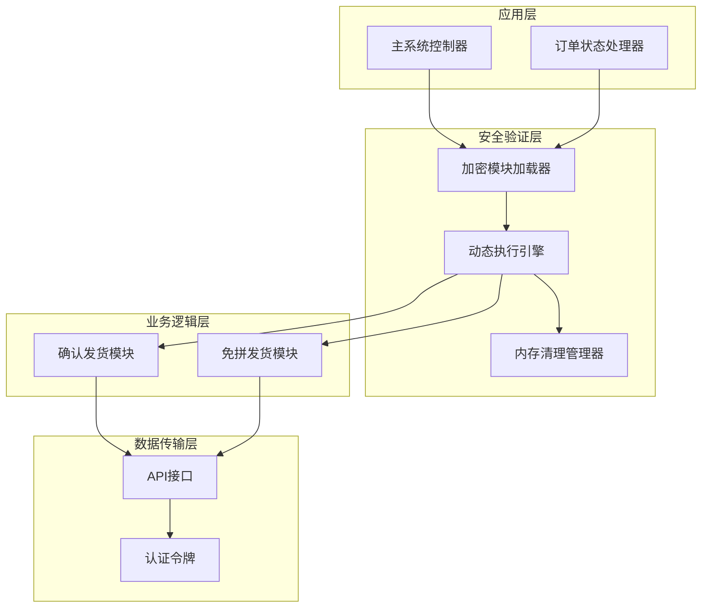
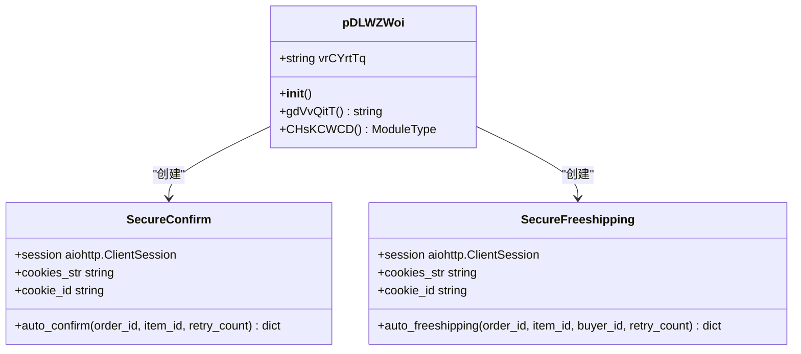
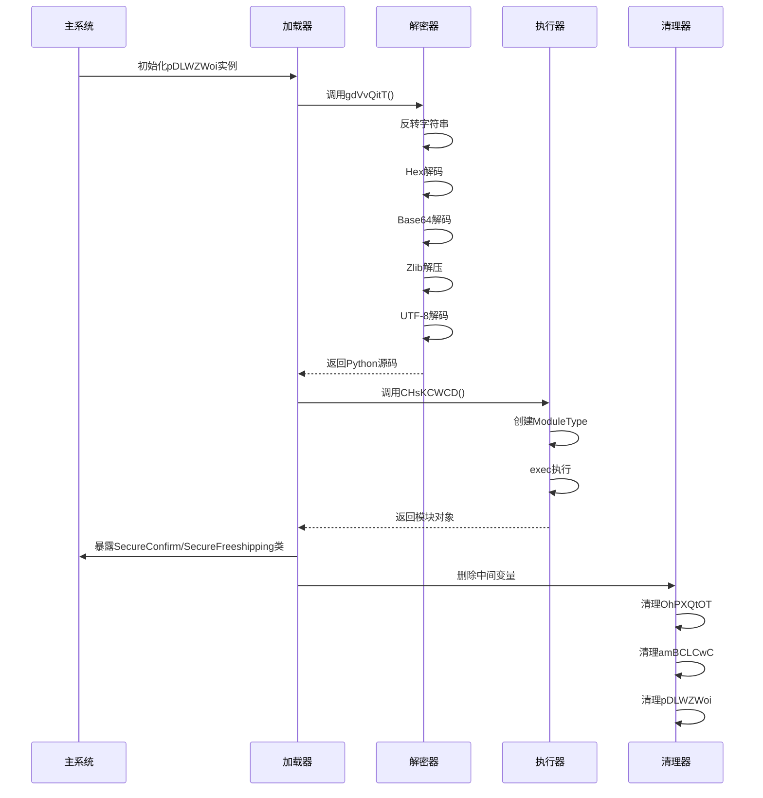
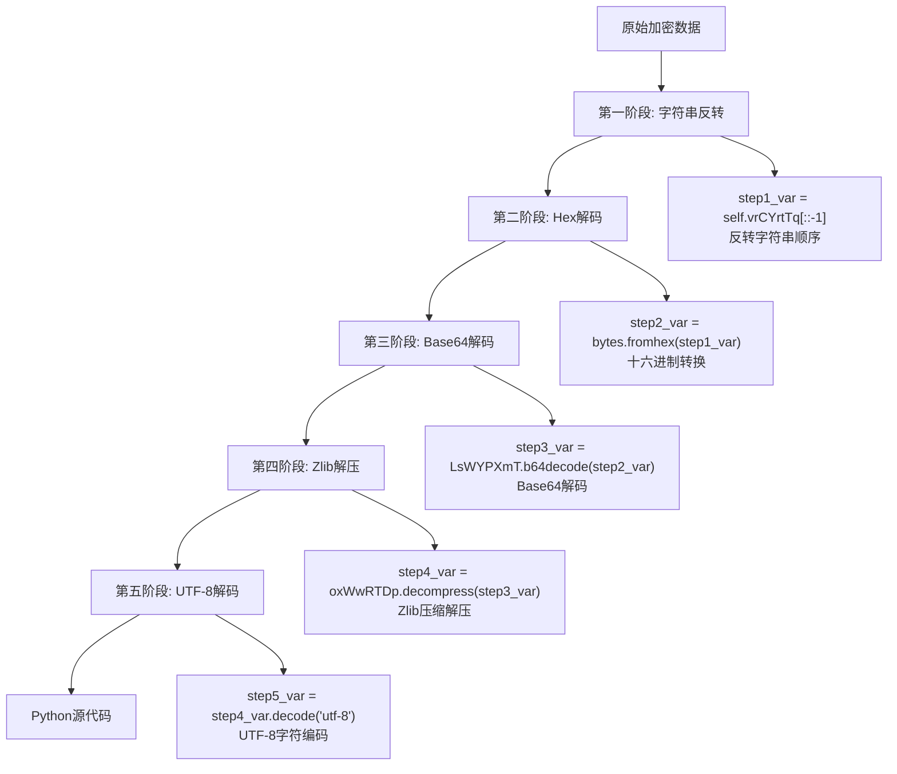
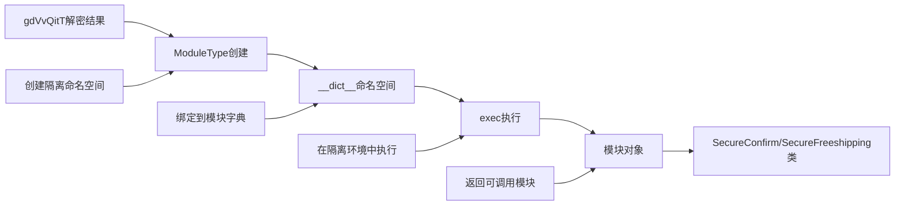
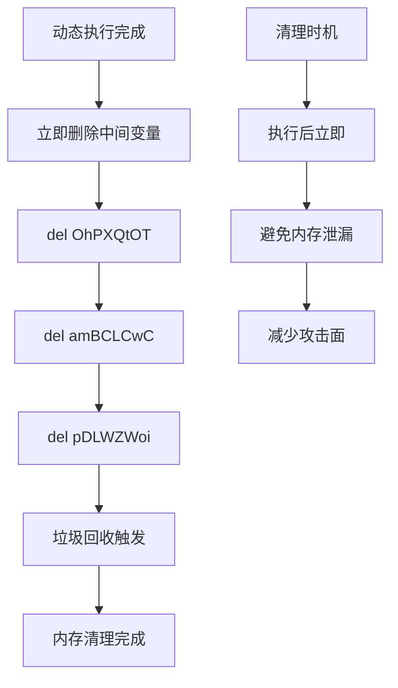

# 安全验证执行流程

<cite>
**本文档引用的文件**
- [secure_confirm_ultra.py](file://secure_confirm_ultra.py)
- [secure_freeshipping_ultra.py](file://secure_freeshipping_ultra.py)
- [secure_confirm_decrypted.py](file://secure_confirm_decrypted.py)
- [secure_freeshipping_decrypted.py](file://secure_freeshipping_decrypted.py)
- [XianyuAutoAsync.py](file://XianyuAutoAsync.py)
- [order_status_handler.py](file://order_status_handler.py)
- [Start.py](file://Start.py)
</cite>

## 目录
1. [引言](#引言)
2. [系统架构概览](#系统架构概览)
3. [安全验证模块核心组件](#安全验证模块核心组件)
4. [动态执行流程详解](#动态执行流程详解)
5. [多阶段解密机制](#多阶段解密机制)
6. [动态模块创建与执行](#动态模块创建与执行)
7. [内存清理机制](#内存清理机制)
8. [安全性优势分析](#安全性优势分析)
9. [最佳实践指南](#最佳实践指南)
10. [故障排除](#故障排除)

## 引言

自动发货系统采用了一套高度安全的验证机制，通过动态执行流程确保敏感操作（如确认收货、免拼发货）的安全性和完整性。该系统的核心创新在于使用多层混淆编码和动态模块执行技术，在保证功能正常运行的同时，最大程度地防止恶意篡改和滥用。

## 系统架构概览

系统采用分层架构设计，主要包含以下核心层次：



**图表来源**
- [XianyuAutoAsync.py](file://XianyuAutoAsync.py#L4320-L4380)
- [order_status_handler.py](file://order_status_handler.py#L26-L80)

## 安全验证模块核心组件

### pDLWZWoi类的设计理念

`pDLWZWoi`类是整个安全验证系统的核心，采用了独特的命名混淆策略来增加逆向工程的难度。该类实现了完整的多阶段解密流程，确保只有授权的系统能够正确执行敏感操作。



**图表来源**
- [secure_confirm_ultra.py](file://secure_confirm_ultra.py#L11-L42)
- [secure_freeshipping_ultra.py](file://secure_freeshipping_ultra.py#L11-L43)

**章节来源**
- [secure_confirm_ultra.py](file://secure_confirm_ultra.py#L11-L42)
- [secure_freeshipping_ultra.py](file://secure_freeshipping_ultra.py#L11-L43)

## 动态执行流程详解

### 执行流程架构

系统采用严格的三阶段执行模式，确保每个阶段都有明确的安全边界：



**图表来源**
- [secure_confirm_ultra.py](file://secure_confirm_ultra.py#L16-L30)
- [secure_freeshipping_ultra.py](file://secure_freeshipping_ultra.py#L16-L30)

### 关键执行点分析

系统在多个关键点设置了安全检查和验证机制：

1. **实例化阶段**：创建`pDLWZWoi`实例时加载加密数据
2. **解密阶段**：通过`gdVvQitT`方法完成多阶段解密
3. **模块创建阶段**：使用`types.ModuleType`创建隔离命名空间
4. **执行阶段**：通过`exec`函数在隔离环境中执行代码
5. **暴露阶段**：仅暴露必要的类接口给主系统
6. **清理阶段**：立即删除所有中间变量和类定义

**章节来源**
- [secure_confirm_ultra.py](file://secure_confirm_ultra.py#L33-L42)
- [secure_freeshipping_ultra.py](file://secure_freeshipping_ultra.py#L34-L43)

## 多阶段解密机制

### 解密算法详解

系统实现了严格的五阶段解密流程，每阶段都有特定的安全作用：



**图表来源**
- [secure_confirm_ultra.py](file://secure_confirm_ultra.py#L16-L23)
- [secure_freeshipping_ultra.py](file://secure_freeshipping_ultra.py#L16-L23)

### 解密安全性分析

每个解密阶段都具有重要的安全意义：

1. **字符串反转**：增加静态分析难度，使加密数据难以直接识别
2. **Hex解码**：将十六进制字符串转换为二进制数据
3. **Base64解码**：处理可能的编码变体和填充问题
4. **Zlib解压**：去除可能的压缩干扰
5. **UTF-8解码**：确保最终得到可执行的Python代码

**章节来源**
- [secure_confirm_ultra.py](file://secure_confirm_ultra.py#L16-L23)
- [secure_freeshipping_ultra.py](file://secure_freeshipping_ultra.py#L16-L23)

## 动态模块创建与执行

### 模块创建机制

系统使用Python的`types.ModuleType`来创建隔离的执行环境：



**图表来源**
- [secure_confirm_ultra.py](file://secure_confirm_ultra.py#L27-L30)
- [secure_freeshipping_ultra.py](file://secure_freeshipping_ultra.py#L27-L30)

### 执行环境隔离

通过以下机制确保执行环境的安全隔离：

1. **命名空间隔离**：使用`module_obj.__dict__`作为执行上下文
2. **权限限制**：仅暴露必要的类和方法
3. **资源限制**：执行完成后立即释放资源
4. **访问控制**：通过中间变量间接访问最终类

**章节来源**
- [secure_confirm_ultra.py](file://secure_confirm_ultra.py#L27-L30)
- [secure_freeshipping_ultra.py](file://secure_freeshipping_ultra.py#L27-L30)

## 内存清理机制

### 清理策略设计

系统实现了严格的内存清理机制，确保敏感数据不会在内存中残留：



**图表来源**
- [secure_confirm_ultra.py](file://secure_confirm_ultra.py#L39-L42)
- [secure_freeshipping_ultra.py](file://secure_freeshipping_ultra.py#L39-L43)

### 清理效果分析

这种清理机制具有以下安全优势：

1. **即时清理**：在执行完成后立即删除所有中间变量
2. **不可恢复**：删除操作后无法通过常规手段恢复
3. **内存保护**：减少敏感数据在内存中的暴露时间
4. **攻击防护**：降低内存扫描攻击的成功率

**章节来源**
- [secure_confirm_ultra.py](file://secure_confirm_ultra.py#L39-L42)
- [secure_freeshipping_ultra.py](file://secure_freeshipping_ultra.py#L39-L43)

## 安全性优势分析

### 防护能力评估

该安全验证系统在以下几个方面提供了强大的防护能力：

| 防护维度 | 技术实现 | 安全效果 |
|---------|---------|---------|
| 代码混淆 | 多层编码和混淆 | 增加逆向工程难度 |
| 动态执行 | 运行时解密和执行 | 防止静态分析 |
| 内存保护 | 立即清理敏感数据 | 减少内存攻击风险 |
| 权限控制 | 严格的访问路径 | 限制恶意访问 |
| 环境隔离 | 独立的执行命名空间 | 防止代码污染 |

### 攻击防护分析

系统针对常见的攻击模式提供了针对性的防护：

1. **静态分析防护**：通过多层混淆使静态分析变得极其困难
2. **动态调试防护**：运行时解密机制防止动态调试
3. **内存攻击防护**：及时清理机制减少内存攻击成功率
4. **代码注入防护**：严格的执行环境隔离防止代码注入

**章节来源**
- [secure_confirm_ultra.py](file://secure_confirm_ultra.py#L1-L10)
- [secure_freeshipping_ultra.py](file://secure_freeshipping_ultra.py#L1-L10)

## 最佳实践指南

### 集成调用建议

为了充分发挥安全验证模块的优势，建议遵循以下最佳实践：

#### 1. 模块导入规范

```python
# 推荐的导入方式
try:
    # 导入解密后的模块
    from secure_confirm_decrypted import SecureConfirm
    from secure_freeshipping_decrypted import SecureFreeshipping
except ImportError:
    # 回退到加密版本（不推荐）
    from secure_confirm_ultra import SecureConfirm
    from secure_freeshipping_ultra import SecureFreeshipping
```

#### 2. 错误处理策略

```python
# 建议的错误处理模式
async def safe_auto_confirm(order_id, item_id):
    try:
        # 调用确认发货
        result = await secure_confirm.auto_confirm(order_id, item_id)
        return result
    except Exception as e:
        logger.error(f"确认发货失败: {e}")
        # 实施适当的降级策略
        return {"error": "确认发货失败", "retryable": True}
```

#### 3. 资源管理建议

```python
# 建议的资源管理模式
class AutoDeliveryManager:
    def __init__(self):
        self.secure_confirm = None
        self.secure_freeshipping = None
    
    async def initialize_modules(self):
        """延迟初始化模块，优化启动性能"""
        from secure_confirm_decrypted import SecureConfirm
        from secure_freeshipping_decrypted import SecureFreeshipping
        
        self.secure_confirm = SecureConfirm(...)
        self.secure_freeshipping = SecureFreeshipping(...)
    
    async def cleanup(self):
        """清理资源，确保内存安全"""
        if self.secure_confirm:
            del self.secure_confirm
        if self.secure_freeshipping:
            del self.secure_freeshipping
```

### 性能优化建议

1. **模块缓存**：对于频繁使用的模块，考虑实现缓存机制
2. **异步处理**：充分利用异步特性提高并发性能
3. **连接池管理**：合理管理HTTP连接池，避免资源浪费
4. **重试策略**：实施指数退避等智能重试机制

**章节来源**
- [XianyuAutoAsync.py](file://XianyuAutoAsync.py#L4320-L4380)
- [secure_confirm_decrypted.py](file://secure_confirm_decrypted.py#L13-L181)

## 故障排除

### 常见问题诊断

#### 1. 模块加载失败

**症状**：ImportError或ModuleNotFoundError

**原因分析**：
- 文件路径配置错误
- Python版本不兼容
- 依赖包缺失

**解决方案**：
```python
# 检查文件存在性
import os
if not os.path.exists('secure_confirm_decrypted.py'):
    print("解密模块文件不存在")

# 检查Python版本
import sys
print(f"Python版本: {sys.version}")

# 检查依赖包
try:
    import aiohttp
    print("aiohttp可用")
except ImportError:
    print("缺少aiohttp依赖")
```

#### 2. 解密失败

**症状**：UnicodeDecodeError或ValueError

**原因分析**：
- 加密数据损坏
- 解密算法不匹配
- 编码问题

**解决方案**：
```python
# 添加解密失败的调试信息
try:
    decoded_code = pDLWZWoi_instance.gdVvQitT()
    print(f"解密成功，长度: {len(decoded_code)}")
except Exception as e:
    print(f"解密失败: {e}")
    # 检查中间变量
    step1_var = pDLWZWoi_instance.vrCYrtTq[::-1]
    print(f"第一步结果长度: {len(step1_var)}")
```

#### 3. 执行环境问题

**症状**：AttributeError或NameError

**原因分析**：
- 执行上下文污染
- 模块定义错误
- 依赖关系缺失

**解决方案**：
```python
# 检查模块定义
if hasattr(module_obj, 'SecureConfirm'):
    print("SecureConfirm类定义正常")
else:
    print("SecureConfirm类定义缺失")

# 检查执行上下文
print(f"模块字典内容: {list(module_obj.__dict__.keys())}")
```

### 调试技巧

1. **日志记录**：启用详细的日志记录来跟踪执行流程
2. **断点调试**：在关键节点设置断点进行逐步调试
3. **单元测试**：为每个组件编写单元测试
4. **压力测试**：进行高并发场景的压力测试

**章节来源**
- [secure_confirm_decrypted.py](file://secure_confirm_decrypted.py#L170-L181)
- [secure_freeshipping_decrypted.py](file://secure_freeshipping_decrypted.py#L120-L131)

## 结论

自动发货系统的安全验证模块通过精心设计的多层安全机制，实现了对敏感操作的全面保护。其独特的动态执行流程、严格的内存清理机制和强大的防护能力，为系统的安全运行提供了坚实保障。通过遵循本文档提供的最佳实践和故障排除指南，开发者可以更好地理解和维护这一复杂的安全系统。

该系统的设计理念不仅适用于当前的应用场景，也为其他需要高级安全保护的系统提供了宝贵的参考价值。随着安全威胁的不断演进，这套安全验证机制还将持续优化和完善，以应对未来可能出现的各种挑战。