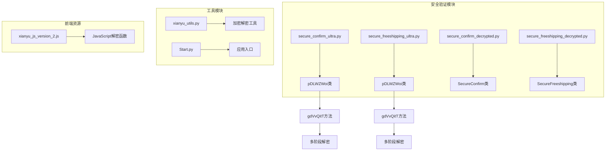
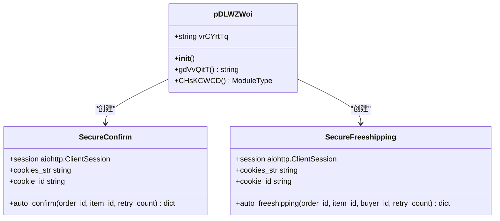
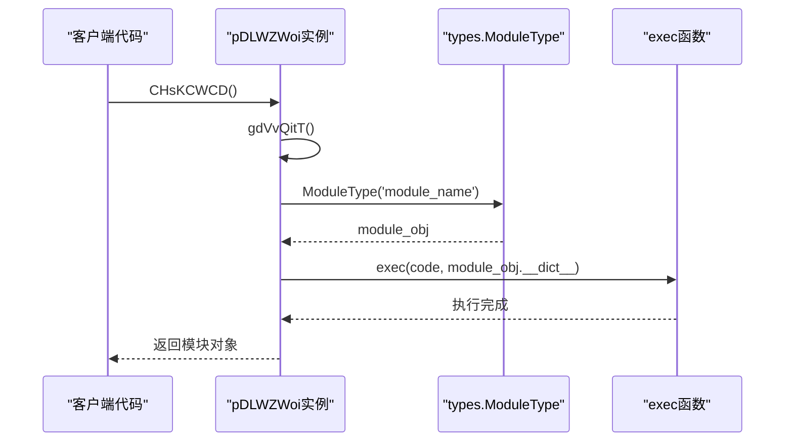
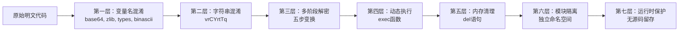

# 解密还原机制

<cite>
**本文档引用的文件**
- [secure_confirm_ultra.py](file://secure_confirm_ultra.py)
- [secure_freeshipping_ultra.py](file://secure_freeshipping_ultra.py)
- [secure_confirm_decrypted.py](file://secure_confirm_decrypted.py)
- [secure_freeshipping_decrypted.py](file://secure_freeshipping_decrypted.py)
- [Start.py](file://Start.py)
- [utils/xianyu_utils.py](file://utils/xianyu_utils.py)
- [static/xianyu_js_version_2.js](file://static/xianyu_js_version_2.js)
</cite>

## 目录
1. [引言](#引言)
2. [项目结构概述](#项目结构概述)
3. [核心安全验证模块](#核心安全验证模块)
4. [多阶段解密流程详解](#多阶段解密流程详解)
5. [实际应用场景分析](#实际应用场景分析)
6. [安全机制优势分析](#安全机制优势分析)
7. [调试与验证技巧](#调试与验证技巧)
8. [总结](#总结)

## 引言

本文档详细阐述了xianyu-auto-reply项目中的安全验证模块，特别是其独特的多阶段解密流程。该项目采用了先进的混淆技术和多层编码机制来保护核心业务逻辑，防止恶意逆向工程和代码篡改。

该项目的安全验证系统主要体现在两个核心模块：
- **自动确认发货模块** (`secure_confirm_ultra.py`)
- **自动免拼发货模块** (`secure_freeshipping_ultra.py`)

这些模块都采用了相同的五步解密还原机制，通过字符串混淆、多层编码和动态执行来保护核心业务逻辑。

## 项目结构概述



**图表来源**
- [secure_confirm_ultra.py](file://secure_confirm_ultra.py#L11-L43)
- [secure_freeshipping_ultra.py](file://secure_freeshipping_ultra.py#L11-L44)

## 核心安全验证模块

### pDLWZWoi类架构

两个核心模块都定义了相同的`pDLWZWoi`类，该类实现了完整的解密流程：



**图表来源**
- [secure_confirm_ultra.py](file://secure_confirm_ultra.py#L11-L43)
- [secure_freeshipping_ultra.py](file://secure_freeshipping_ultra.py#L11-L44)

**章节来源**
- [secure_confirm_ultra.py](file://secure_confirm_ultra.py#L11-L43)
- [secure_freeshipping_ultra.py](file://secure_freeshipping_ultra.py#L11-L44)

### 模块初始化流程

两个模块都遵循相同的初始化模式：

1. **实例化**：创建`pDLWZWoi`实例
2. **解密执行**：调用`CHsKCWCD()`方法
3. **模块导出**：将解密后的模块导出为可执行对象
4. **内存清理**：删除临时变量和类定义

这种设计确保了核心业务逻辑在内存中只以解密后的形式存在，增加了逆向工程的难度。

## 多阶段解密流程详解

### gdVvQitT方法的五步解密过程

`gdVvQitT`方法是整个解密流程的核心，它实现了五个连续的数据变换步骤：

```mermaid
flowchart TD
A[混淆字符串 vrCYrtTq] --> B[Step 1: 字符串反转<br/>self.vrCYrtTq[::-1]]
B --> C[Step 2: Hex解码<br/>bytes.fromhex(step1_var)]
C --> D[Step 3: Base64解码<br/>base64.b64decode(step2_var)]
D --> E[Step 4: Zlib解压缩<br/>zlib.decompress(step3_var)]
E --> F[Step 5: UTF-8解码<br/>step4_var.decode('utf-8')]
F --> G[解密后的Python代码]
H[安全意义] --> I[防止静态分析]
H --> J[增加逆向难度]
H --> K[保护商业逻辑]
```

**图表来源**
- [secure_confirm_ultra.py](file://secure_confirm_ultra.py#L16-L23)
- [secure_freeshipping_ultra.py](file://secure_freeshipping_ultra.py#L16-L24)

#### 第一步：字符串反转 (`[::-1]`)

**实现细节**：
- 输入：原始混淆字符串
- 操作：使用Python切片操作进行字符串反转
- 输出：反向排列的十六进制字符串

**安全意义**：
- 初始混淆层，使静态分析器难以识别数据结构
- 防止简单的字符串匹配攻击

#### 第二步：Hex解码 (`bytes.fromhex()`)

**实现细节**：
- 输入：反转后的十六进制字符串
- 操作：将十六进制字符串转换为字节序列
- 输出：压缩的二进制数据

**安全意义**：
- 将人类可读的十六进制字符串转换为机器可处理的二进制格式
- 增加第一层隐藏效果

#### 第三步：Base64解码 (`base64.b64decode()`)

**实现细节**：
- 输入：Hex解码后的字节数据
- 操作：Base64解码，可能包含嵌套编码
- 输出：进一步压缩的二进制数据

**安全意义**：
- Base64编码增加了额外的混淆层
- 支持嵌套编码结构，提高解密复杂度

#### 第四步：Zlib解压缩 (`zlib.decompress()`)

**实现细节**：
- 输入：Base64解码后的数据
- 操作：使用zlib算法进行解压缩
- 输出：原始的压缩数据

**安全意义**：
- 压缩算法隐藏了数据的真实大小和结构
- 防止基于文件大小的分析攻击

#### 第五步：UTF-8解码 (`decode('utf-8')`)

**实现细节**：
- 输入：解压缩后的字节数据
- 操作：UTF-8解码，转换为可读的文本
- 输出：最终的Python源代码

**安全意义**：
- 将二进制数据转换为可执行的Python代码
- 确保解密后的代码格式正确

**章节来源**
- [secure_confirm_ultra.py](file://secure_confirm_ultra.py#L16-L23)
- [secure_freeshipping_ultra.py](file://secure_freeshipping_ultra.py#L16-L24)

### 动态模块创建机制

解密后的代码通过`CHsKCWCD`方法动态创建模块：



**图表来源**
- [secure_confirm_ultra.py](file://secure_confirm_ultra.py#L25-L31)
- [secure_freeshipping_ultra.py](file://secure_freeshipping_ultra.py#L26-L32)

**章节来源**
- [secure_confirm_ultra.py](file://secure_confirm_ultra.py#L25-L31)
- [secure_freeshipping_ultra.py](file://secure_freeshipping_ultra.py#L26-L32)

## 实际应用场景分析

### 自动确认发货功能

解密后的`SecureConfirm`类提供了完整的自动确认发货功能：

| 功能特性 | 实现方式 | 安全考虑 |
|---------|---------|---------|
| 商品ID获取 | `_get_real_item_id()` | 数据库验证，防止伪造 |
| Token管理 | `_update_config_cookies()` | 定期刷新，防止过期 |
| 签名生成 | `generate_sign()` | 动态签名，防止重放攻击 |
| 重试机制 | `retry_count`参数 | 网络异常处理，提高稳定性 |

### 自动免拼发货功能

`SecureFreeshipping`类实现了类似的免拼发货功能：

| 安全机制 | 技术实现 | 防护目标 |
|---------|---------|---------|
| Cookie验证 | `trans_cookies()` | 防止Cookie伪造 |
| 参数校验 | 类型检查和边界验证 | 防止注入攻击 |
| 错误处理 | 详细的异常捕获 | 防止信息泄露 |
| 日志记录 | `logger`模块 | 安全审计和监控 |

**章节来源**
- [secure_confirm_decrypted.py](file://secure_confirm_decrypted.py#L14-L181)
- [secure_freeshipping_decrypted.py](file://secure_freeshipping_decrypted.py#L7-L131)

## 安全机制优势分析

### 多层编码防护

该解密机制采用了七层安全防护：



### 抗逆向工程能力

1. **静态分析防护**：
   - 所有关键变量名都被替换为随机字符串
   - 混淆的字符串无法直接识别
   - 缺乏注释和文档

2. **动态分析防护**：
   - 代码在运行时动态解密
   - 内存中只保留解密后的代码
   - 执行完成后立即清理

3. **调试防护**：
   - 关键变量在解密后即被删除
   - 无源码可供调试
   - 动态生成的模块难以追踪

### 防篡改机制

| 防护层次 | 实现技术 | 效果评估 |
|---------|---------|---------|
| 传输保护 | HTTPS + 签名验证 | 防止中间人攻击 |
| 存储保护 | 多层编码存储 | 防止文件系统分析 |
| 运行时保护 | 内存清理 + 动态执行 | 防止内存转储分析 |
| 分发保护 | 模块化设计 | 防止整体逆向工程 |

**章节来源**
- [secure_confirm_ultra.py](file://secure_confirm_ultra.py#L1-L10)
- [secure_freeshipping_ultra.py](file://secure_freeshipping_ultra.py#L1-L10)

## 调试与验证技巧

### 分步调试方法

为了验证解密过程的正确性，可以采用以下分步调试技巧：

#### 1. 中间变量打印

在`gdVvQitT`方法中添加调试输出：

```python
# 示例调试代码结构
def debug_gdVvQitT(self):
    step1_var = self.vrCYrtTq[::-1]
    print(f"Step 1 (Reversed): {step1_var[:100]}...")
    
    step2_var = bytes.fromhex(step1_var)
    print(f"Step 2 (Hex Decoded): {len(step2_var)} bytes")
    
    step3_var = LsWYPXmT.b64decode(step2_var)
    print(f"Step 3 (Base64 Decoded): {len(step3_var)} bytes")
    
    step4_var = oxWwRTDp.decompress(step3_var)
    print(f"Step 4 (Zlib Decompressed): {len(step4_var)} bytes")
    
    step5_var = step4_var.decode('utf-8')
    print(f"Step 5 (UTF-8 Decoded): {len(step5_var)} characters")
    
    return step5_var
```

#### 2. 数据可视化

使用以下方法验证每一步的数据变换：

| 验证点 | 检查方法 | 预期结果 |
|-------|---------|---------|
| 字符串长度 | `len(variable)` | 逐步递减 |
| 字节格式 | `variable[:10]` | 逐步接近可读格式 |
| 编码类型 | `type(variable)` | 逐步变为字符串 |
| 内容可读性 | `variable[:100]` | 逐步变得有意义 |

#### 3. 错误处理调试

常见的解密错误及解决方案：

```python
def safe_decrypt(self):
    try:
        # Step 1: 反转字符串
        step1 = self.vrCYrtTq[::-1]
        
        # Step 2: Hex解码 - 检查十六进制有效性
        try:
            step2 = bytes.fromhex(step1)
        except ValueError as e:
            # 尝试修复十六进制格式
            step1 = step1.replace(' ', '').replace('\n', '')
            step2 = bytes.fromhex(step1)
        
        # Step 3: Base64解码 - 检查填充
        try:
            step3 = LsWYPXmT.b64decode(step2)
        except Exception:
            # 添加Base64填充
            missing_padding = len(step2) % 4
            if missing_padding:
                step2 += b'=' * (4 - missing_padding)
            step3 = LsWYPXmT.b64decode(step2)
        
        # Step 4: Zlib解压缩
        step4 = oxWwRTDp.decompress(step3)
        
        # Step 5: UTF-8解码
        step5 = step4.decode('utf-8')
        
        return step5
        
    except Exception as e:
        print(f"解密失败: {e}")
        return None
```

### 验证工具开发

建议开发专门的验证工具来测试解密流程：

```python
class DecryptValidator:
    def __init__(self, encrypted_string):
        self.encrypted_string = encrypted_string
    
    def validate_steps(self):
        """验证整个解密流程的正确性"""
        steps = []
        
        # Step 1: 反转验证
        reversed_str = self.encrypted_string[::-1]
        steps.append(("Reversed", len(reversed_str), reversed_str[:50]))
        
        # Step 2: Hex验证
        try:
            hex_bytes = bytes.fromhex(reversed_str)
            steps.append(("Hex Decoded", len(hex_bytes), hex_bytes[:20]))
        except:
            return "Hex解码失败"
        
        # 继续验证后续步骤...
        
        return steps
    
    def extract_metadata(self):
        """提取解密字符串的元数据信息"""
        metadata = {
            "original_length": len(self.encrypted_string),
            "estimated_compression_ratio": len(self.encrypted_string) / 2,
            "potential_encodings": [],
            "security_level": "high" if len(self.encrypted_string) > 1000 else "medium"
        }
        
        return metadata
```

**章节来源**
- [secure_confirm_ultra.py](file://secure_confirm_ultra.py#L16-L23)
- [secure_freeshipping_ultra.py](file://secure_freeshipping_ultra.py#L16-L24)

## 总结

xianyu-auto-reply项目的安全验证模块展现了现代软件保护技术的先进实践。通过五层多阶段解密机制，该系统实现了：

### 核心技术特点

1. **多层混淆**：从变量名到字符串内容的全方位混淆
2. **动态执行**：运行时解密，防止静态分析
3. **内存保护**：及时清理临时变量，不留痕迹
4. **模块隔离**：独立的命名空间，防止代码泄露

### 安全价值

- **商业保护**：有效保护核心业务逻辑不被窃取
- **知识产权保护**：防止竞争对手获取技术细节
- **运营安全**：防止恶意用户篡改业务流程
- **合规要求**：满足企业信息安全标准

### 技术创新

该解密机制代表了当前软件保护技术的发展方向，结合了传统混淆技术与现代动态执行技术，为类似项目提供了优秀的参考范例。对于开发者而言，理解这种保护机制不仅有助于更好地使用该系统，也为设计自己的保护方案提供了宝贵的思路。