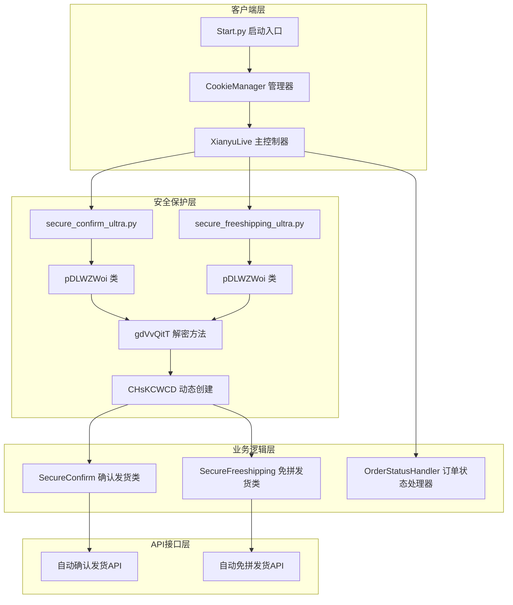
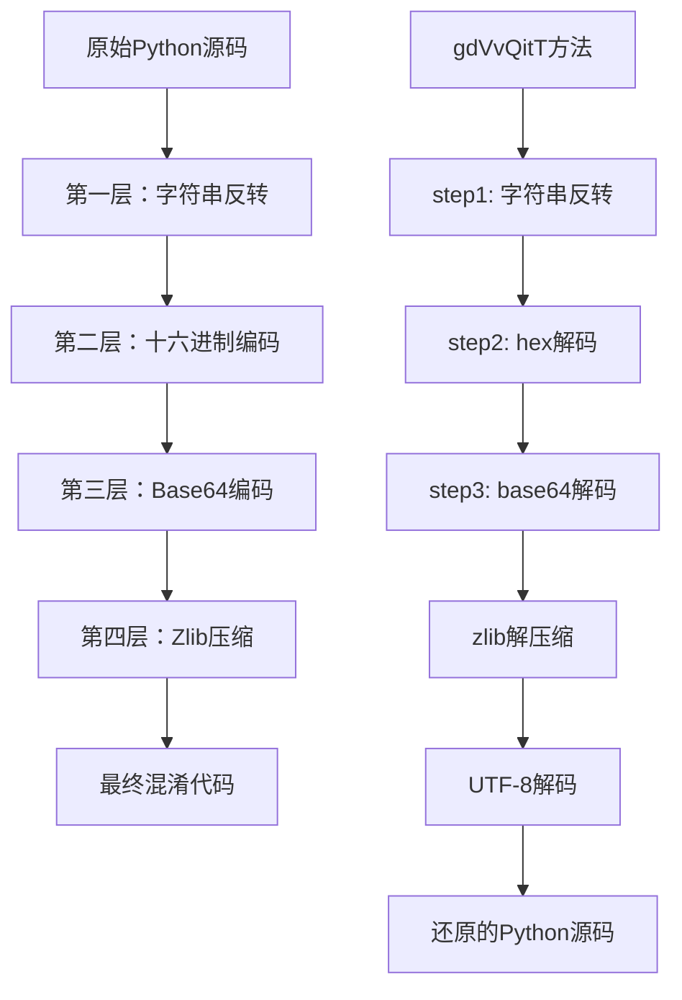
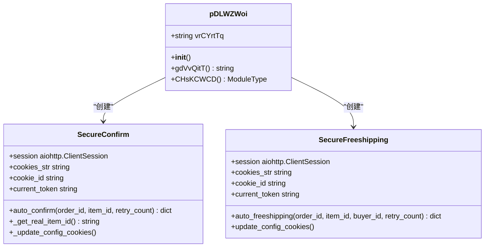
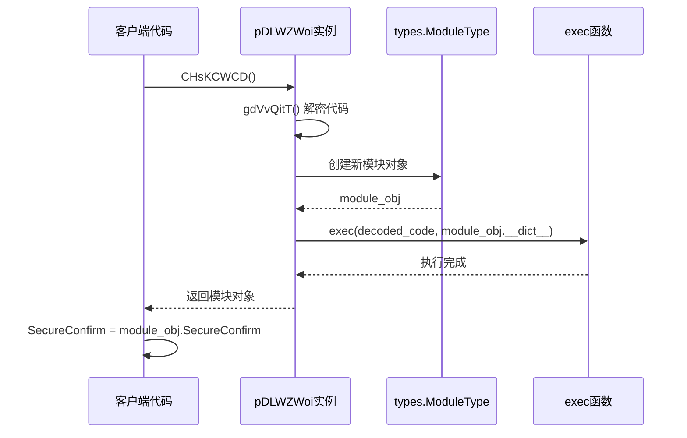
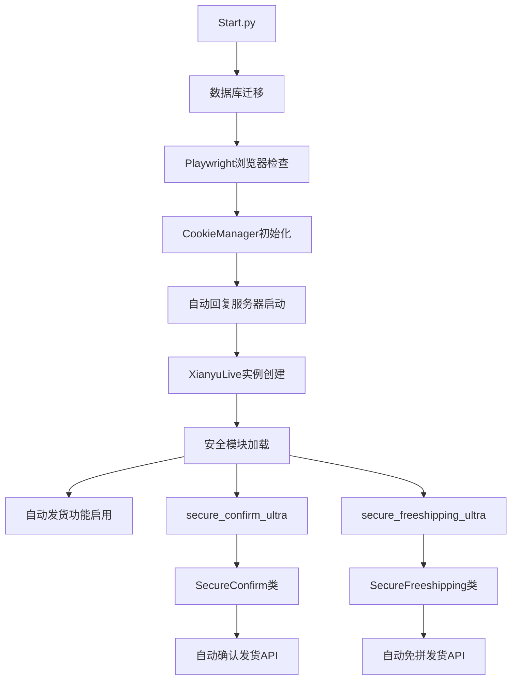
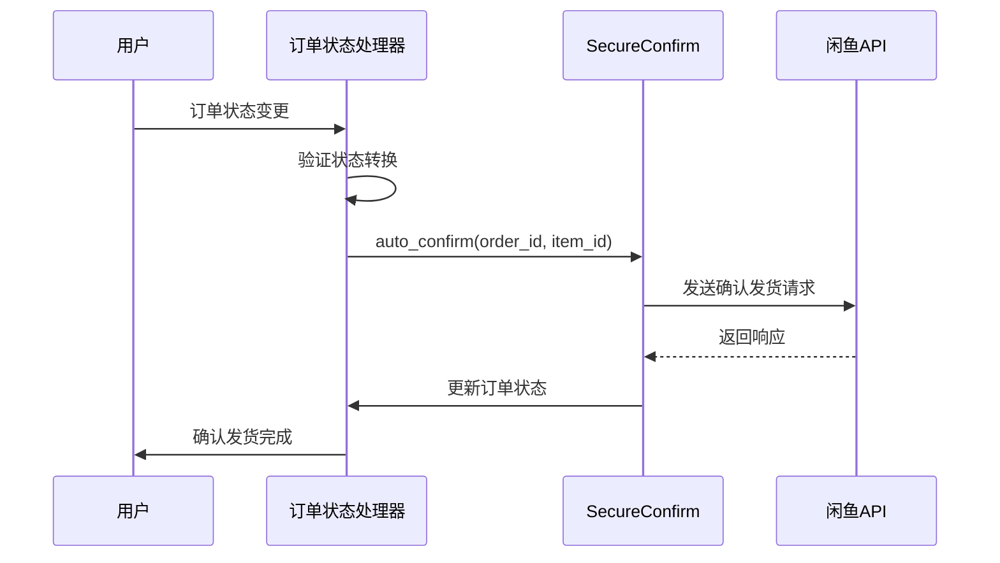
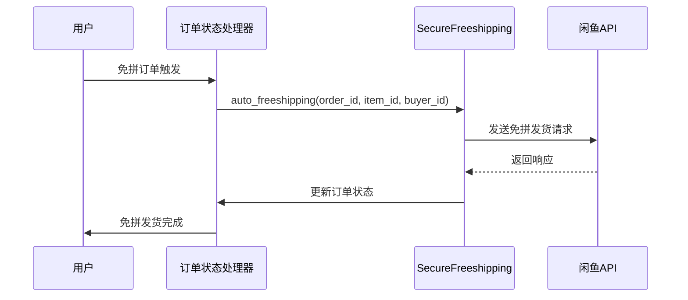
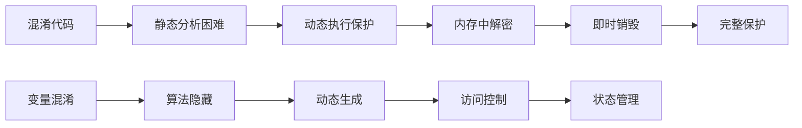

# 自动发货系统安全验证流程深度解析

<cite>
**本文档引用的文件**
- [secure_confirm_ultra.py](file://secure_confirm_ultra.py)
- [secure_freeshipping_ultra.py](file://secure_freeshipping_ultra.py)
- [secure_confirm_decrypted.py](file://secure_confirm_decrypted.py)
- [secure_freeshipping_decrypted.py](file://secure_freeshipping_decrypted.py)
- [XianyuAutoAsync.py](file://XianyuAutoAsync.py)
- [Start.py](file://Start.py)
- [order_status_handler.py](file://order_status_handler.py)
</cite>

## 目录
1. [系统概述](#系统概述)
2. [安全验证架构](#安全验证架构)
3. [多层编码保护机制](#多层编码保护机制)
4. [核心类分析](#核心类分析)
5. [动态模块创建机制](#动态模块创建机制)
6. [自动发货功能集成](#自动发货功能集成)
7. [安全优势与防护原理](#安全优势与防护原理)
8. [开发指南与扩展](#开发指南与扩展)
9. [调试与维护注意事项](#调试与维护注意事项)
10. [总结](#总结)

## 系统概述

自动发货系统是一个高度安全化的电商平台自动化解决方案，专门针对闲鱼平台设计。该系统采用多层安全验证机制，通过复杂的代码混淆和动态执行技术，保护核心业务逻辑免受逆向工程攻击。

### 核心功能模块

系统主要包含两个核心模块：
- **自动确认发货模块**：负责自动确认买家收货
- **自动免拼发货模块**：负责自动处理免拼订单发货

这两个模块均采用超级混淆版本（Ultra版本），通过多层编码保护其核心逻辑。

## 安全验证架构

### 整体安全架构图



**图表来源**
- [Start.py](file://Start.py#L1-L602)
- [XianyuAutoAsync.py](file://XianyuAutoAsync.py#L1-L8372)
- [secure_confirm_ultra.py](file://secure_confirm_ultra.py#L1-L43)
- [secure_freeshipping_ultra.py](file://secure_freeshipping_ultra.py#L1-L44)

### 安全层次结构

系统采用分层安全防护策略：

1. **代码混淆层**：多层编码保护
2. **动态执行层**：运行时解密和模块创建
3. **API验证层**：严格的权限验证
4. **业务逻辑层**：状态管理和防重复机制

## 多层编码保护机制

### 编码层级详解

系统采用四层编码保护机制，每一层都增加了逆向工程的难度：



**图表来源**
- [secure_confirm_ultra.py](file://secure_confirm_ultra.py#L16-L23)
- [secure_freeshipping_ultra.py](file://secure_freeshipping_ultra.py#L16-L22)

### 编码实现细节

#### 第一层：字符串反转
```python
step1_var = self.vrCYrtTq[::-1]
```
将加密字符串进行完全反转，这是第一道保护屏障。

#### 第二层：十六进制解码
```python
step2_var = bytes.fromhex(step1_var)
```
将反转后的字符串转换为字节序列，进一步隐藏原始内容。

#### 第三层：Base64解码
```python
step3_var = LsWYPXmT.b64decode(step2_var)
```
使用别名导入的base64模块进行解码，增加混淆度。

#### 第四层：Zlib解压缩
```python
step4_var = oxWwRTDp.decompress(step3_var)
```
使用zlib库解压缩数据，还原原始的Python源码。

#### 第五层：UTF-8解码
```python
step5_var = step4_var.decode('utf-8')
```
将字节序列转换为可执行的Python源码字符串。

**章节来源**
- [secure_confirm_ultra.py](file://secure_confirm_ultra.py#L16-L23)
- [secure_freeshipping_ultra.py](file://secure_freeshipping_ultra.py#L16-L22)

## 核心类分析

### pDLWZWoi类设计

pDLWZWoi类是整个安全验证系统的核心，包含了完整的解密和模块创建逻辑。

#### 类结构图



**图表来源**
- [secure_confirm_ultra.py](file://secure_confirm_ultra.py#L11-L43)
- [secure_freeshipping_ultra.py](file://secure_freeshipping_ultra.py#L11-L44)
- [secure_confirm_decrypted.py](file://secure_confirm_decrypted.py#L14-L181)
- [secure_freeshipping_decrypted.py](file://secure_freeshipping_decrypted.py#L7-L131)

#### gdVvQitT方法逆向执行机制

gdVvQitT方法实现了完整的逆向解密流程：

1. **字符串反转**：`step1_var = self.vrCYrtTq[::-1]`
2. **十六进制解码**：`bytes.fromhex(step1_var)`
3. **Base64解码**：`LsWYPXmT.b64decode(step2_var)`
4. **Zlib解压缩**：`oxWwRTDp.decompress(step3_var)`
5. **UTF-8解码**：`step4_var.decode('utf-8')`

这种方法确保了即使攻击者获取了混淆代码，也无法直接理解其功能，必须按照相反顺序执行解密步骤才能还原原始逻辑。

**章节来源**
- [secure_confirm_ultra.py](file://secure_confirm_ultra.py#L16-L23)
- [secure_freeshipping_ultra.py](file://secure_freeshipping_ultra.py#L16-L22)

## 动态模块创建机制

### CHsKCWCD方法实现

CHsKCWCD方法是系统安全性的关键组件，它利用Python的动态特性创建和执行模块。

#### 模块创建流程图



**图表来源**
- [secure_confirm_ultra.py](file://secure_confirm_ultra.py#L25-L31)
- [secure_freeshipping_ultra.py](file://secure_freeshipping_ultra.py#L26-L31)

#### types.ModuleType动态创建

系统使用`types.ModuleType`动态创建模块对象：

```python
module_obj = AUdcGvRk.ModuleType('secure_confirm')
```

这行代码创建了一个新的模块对象，模块名为'secure_confirm'或'secure_freeshipping'，然后通过exec函数将解密后的代码注入到该模块的命名空间中。

#### exec函数执行机制

```python
exec(decoded_code, module_obj.__dict__)
```

exec函数在模块的命名空间中执行解密后的Python代码，使得模块中的类和函数可以直接被外部访问。

**章节来源**
- [secure_confirm_ultra.py](file://secure_confirm_ultra.py#L25-L31)
- [secure_freeshipping_ultra.py](file://secure_freeshipping_ultra.py#L26-L31)

## 自动发货功能集成

### 系统启动流程

系统通过Start.py作为启动入口，建立完整的自动发货功能链：



**图表来源**
- [Start.py](file://Start.py#L1-L602)
- [XianyuAutoAsync.py](file://XianyuAutoAsync.py#L513-L586)

### 订单状态处理集成

系统通过order_status_handler模块与自动发货功能深度集成：

#### 自动确认发货流程



**图表来源**
- [XianyuAutoAsync.py](file://XianyuAutoAsync.py#L4664-L4672)
- [order_status_handler.py](file://order_status_handler.py#L1-L200)

#### 自动免拼发货流程



**图表来源**
- [XianyuAutoAsync.py](file://XianyuAutoAsync.py#L4355-L4364)
- [secure_freeshipping_decrypted.py](file://secure_freeshipping_decrypted.py#L38-L131)

**章节来源**
- [Start.py](file://Start.py#L513-L586)
- [XianyuAutoAsync.py](file://XianyuAutoAsync.py#L4664-L4672)
- [XianyuAutoAsync.py](file://XianyuAutoAsync.py#L4355-L4364)

## 安全优势与防护原理

### 多维度安全防护

#### 1. 代码混淆防护
- **变量名混淆**：使用无意义的变量名如`LsWYPXmT`、`AUdcGvRk`
- **算法隐藏**：将解密算法嵌入类方法中，难以分离
- **动态生成**：每次运行时动态生成解密逻辑

#### 2. 运行时保护
- **内存中解密**：解密过程在内存中完成，不留下明文副本
- **即时销毁**：解密完成后立即清理临时变量
- **动态执行**：使用exec动态执行，增加静态分析难度

#### 3. 访问控制
- **模块隔离**：每个功能模块独立加载和执行
- **权限验证**：通过Cookie和Token验证访问权限
- **状态管理**：严格的订单状态转换控制

### 防护原理分析

#### 逆向工程防护机制



#### 安全威胁模型

系统针对以下威胁进行了专门防护：

1. **代码逆向工程**：通过多层混淆和动态执行
2. **API滥用**：通过严格的权限验证和状态控制
3. **业务逻辑泄露**：通过代码保护和访问限制
4. **恶意篡改**：通过完整性验证和审计日志

**章节来源**
- [secure_confirm_ultra.py](file://secure_confirm_ultra.py#L1-L43)
- [secure_freeshipping_ultra.py](file://secure_freeshipping_ultra.py#L1-L44)

## 开发指南与扩展

### 集成新功能指南

#### 添加新的自动发货功能

1. **创建混淆版本**
   - 编写功能代码
   - 应用多层编码保护
   - 测试解密流程

2. **定义安全接口**
   ```python
   class NewSecureFeature:
       def __init__(self, session, cookies_str, cookie_id):
           # 初始化参数
           pass
       
       async def process_order(self, order_data):
           # 处理订单逻辑
           pass
   ```

3. **集成到主系统**
   - 修改XianyuAutoAsync.py中的订单处理逻辑
   - 添加状态转换验证
   - 实现API接口

#### 扩展现有功能

1. **增强安全验证**
   - 添加额外的权限检查
   - 实现更严格的输入验证
   - 增加审计日志记录

2. **优化性能**
   - 实现缓存机制
   - 优化API调用频率
   - 添加并发控制

3. **改进用户体验**
   - 添加详细的错误报告
   - 实现进度跟踪
   - 提供配置选项

### 配置管理

#### 系统配置参数

| 参数名称 | 类型 | 默认值 | 说明 |
|---------|------|--------|------|
| AUTO_CONFIRM_ENABLED | bool | True | 是否启用自动确认发货 |
| FREESHIPPING_ENABLED | bool | True | 是否启用自动免拼发货 |
| DELIVERY_COOLDOWN | int | 600 | 发货冷却时间（秒） |
| CONFIRM_COOLDOWN | int | 600 | 确认发货冷却时间（秒） |
| MAX_RETRY_COUNT | int | 3 | 最大重试次数 |

#### 环境变量配置

```bash
# 自动发货配置
AUTO_CONFIRM_ENABLED=true
FREESHIPPING_ENABLED=true

# 性能配置
DELIVERY_COOLDOWN=600
CONFIRM_COOLDOWN=600

# 安全配置
MAX_RETRY_COUNT=3
```

**章节来源**
- [XianyuAutoAsync.py](file://XianyuAutoAsync.py#L798-L805)
- [XianyuAutoAsync.py](file://XianyuAutoAsync.py#L809-L828)

## 调试与维护注意事项

### 调试被混淆代码的挑战

#### 主要难点

1. **代码可读性差**
   - 变量名无意义
   - 控制流复杂
   - 缺乏注释

2. **动态执行特性**
   - 代码在运行时生成
   - 内存中解密
   - 无法直接分析

3. **多层抽象**
   - 混淆层
   - 解密层
   - 执行层

#### 调试策略

##### 1. 使用解密版本进行调试

```python
# 在开发环境中使用解密版本
from secure_confirm_decrypted import SecureConfirm
from secure_freeshipping_decrypted import SecureFreeshipping
```

##### 2. 添加调试日志

```python
# 在关键位置添加日志
logger.debug(f"解密后的代码长度: {len(decoded_code)}")
logger.debug(f"模块对象类型: {type(module_obj)}")
```

##### 3. 使用Python调试工具

```python
# 使用pdb进行交互式调试
import pdb; pdb.set_trace()
```

### 维护最佳实践

#### 代码维护原则

1. **保持解密版本同步**
   - 修改混淆版本时同步更新解密版本
   - 确保功能一致性

2. **版本控制策略**
   - 使用分支管理混淆和解密版本
   - 建立严格的发布流程

3. **测试覆盖**
   - 编写单元测试
   - 实施集成测试
   - 进行安全测试

#### 性能监控

```python
# 性能监控示例
import time
from functools import wraps

def monitor_performance(func):
    @wraps(func)
    async def wrapper(*args, **kwargs):
        start_time = time.time()
        result = await func(*args, **kwargs)
        end_time = time.time()
        logger.info(f"{func.__name__} 执行时间: {end_time - start_time:.2f}秒")
        return result
    return wrapper
```

### 常见问题排查

#### 1. 解密失败

**症状**：运行时出现解密相关的错误
**原因**：编码数据损坏或解密算法错误
**解决**：检查编码数据完整性，验证解密流程

#### 2. 模块加载失败

**症状**：无法导入解密后的模块
**原因**：语法错误或依赖缺失
**解决**：检查解密后的代码语法，确保依赖完整

#### 3. API调用失败

**症状**：自动发货功能无法正常工作
**原因**：网络问题、认证失败、参数错误
**解决**：检查网络连接，验证认证信息，审查请求参数

**章节来源**
- [secure_confirm_ultra.py](file://secure_confirm_ultra.py#L16-L23)
- [secure_freeshipping_ultra.py](file://secure_freeshipping_ultra.py#L16-L22)
- [secure_confirm_decrypted.py](file://secure_confirm_decrypted.py#L171-L180)
- [secure_freeshipping_decrypted.py](file://secure_freeshipping_decrypted.py#L121-L130)

## 总结

自动发货系统通过创新的安全验证架构，实现了对核心业务逻辑的全面保护。系统采用的多层编码保护机制、动态模块创建技术和严格的访问控制，为电商自动化提供了可靠的安全保障。

### 技术亮点

1. **创新的安全架构**：通过混淆、动态执行和模块化设计，构建了多层次的安全防护体系
2. **高效的代码保护**：利用现代编程语言特性，在保证功能的同时最大化代码保护效果
3. **完善的业务集成**：与电商平台深度集成，提供完整的自动化解决方案
4. **灵活的扩展能力**：模块化设计便于功能扩展和维护

### 应用价值

该系统不仅解决了电商自动化中的安全难题，还为类似场景提供了可借鉴的技术方案。通过深入理解其设计原理和实现细节，开发者可以构建更加安全可靠的自动化系统。

### 未来发展方向

1. **AI辅助安全**：引入机器学习技术增强安全防护
2. **区块链集成**：利用区块链技术提升数据完整性
3. **零信任架构**：实施更严格的身份验证和授权机制
4. **云原生部署**：支持容器化和微服务架构

自动发货系统代表了当前自动化技术与安全防护结合的最佳实践，为电商行业的智能化发展提供了强有力的技术支撑。