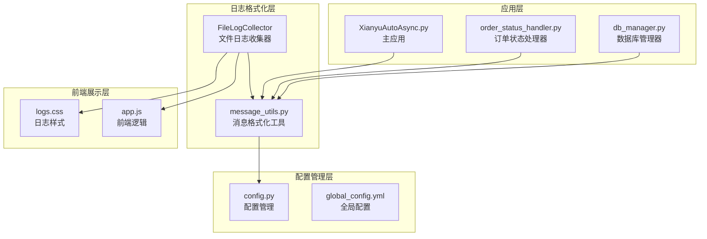
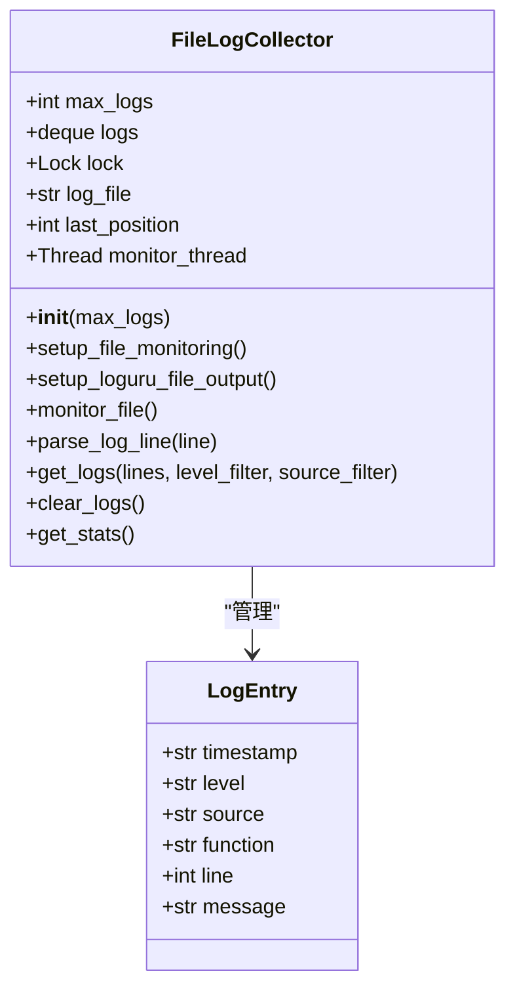
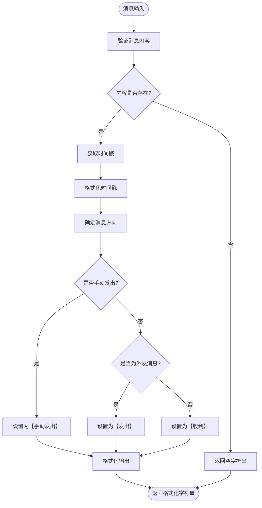
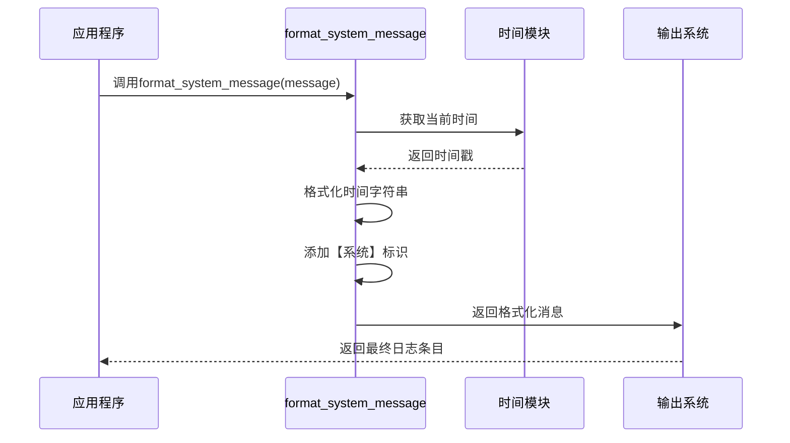
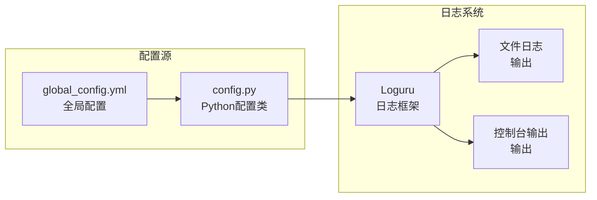
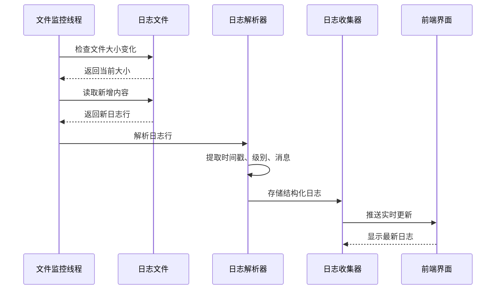
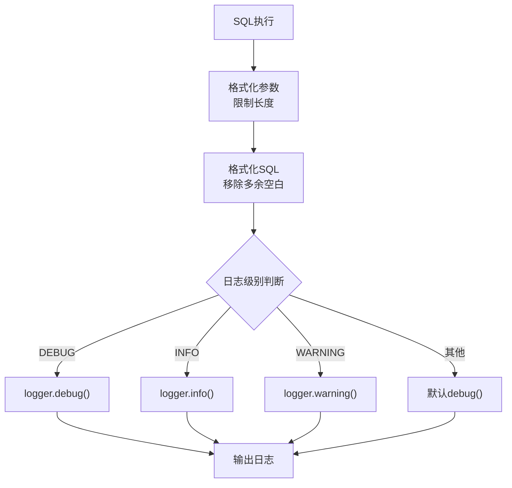

# 日志格式化工具详细文档

<cite>
**本文档中引用的文件**
- [utils/message_utils.py](file://utils/message_utils.py)
- [config.py](file://config.py)
- [global_config.yml](file://global_config.yml)
- [file_log_collector.py](file://file_log_collector.py)
- [XianyuAutoAsync.py](file://XianyuAutoAsync.py)
- [order_status_handler.py](file://order_status_handler.py)
- [db_manager.py](file://db_manager.py)
- [static/css/logs.css](file://static/css/logs.css)
- [static/js/app.js](file://static/js/app.js)
</cite>

## 目录
1. [简介](#简介)
2. [项目架构概览](#项目架构概览)
3. [核心日志格式化组件](#核心日志格式化组件)
4. [详细组件分析](#详细组件分析)
5. [日志配置与管理](#日志配置与管理)
6. [最佳实践指南](#最佳实践指南)
7. [故障排除指南](#故障排除指南)
8. [总结](#总结)

## 简介

本文档详细介绍了闲鱼自动回复系统中的日志与消息格式化工具的实现。该系统采用多层次的日志格式化策略，包括消息格式化、系统日志标准化和实时日志监控，为开发者提供了统一、可读性强的日志格式化解决方案。

系统的核心设计理念是：
- **统一性**：所有日志输出都遵循标准格式
- **可读性**：清晰的时间戳、消息方向标识和内容展示
- **灵活性**：支持多种格式化模板和自定义配置
- **可维护性**：模块化设计，便于扩展和维护

## 项目架构概览

系统采用分层架构设计，包含以下主要组件：



**图表来源**
- [utils/message_utils.py](file://utils/message_utils.py#L1-L29)
- [file_log_collector.py](file://file_log_collector.py#L1-L50)
- [config.py](file://config.py#L1-L126)

## 核心日志格式化组件

### message_utils.py - 消息格式化核心

系统的核心消息格式化功能集中在`message_utils.py`模块中，提供两个关键函数：

#### format_message 函数
负责格式化用户消息，支持区分消息方向和时间戳格式化。

**函数签名**：
```python
def format_message(message_data: Dict[str, Any], is_outgoing: bool = False, is_manual: bool = False) -> str
```

**功能特性**：
- **智能内容检测**：自动检查消息内容是否存在
- **时间戳处理**：支持毫秒级时间戳转换
- **消息方向识别**：自动区分收到、发出和手动发出的消息
- **异常处理**：完善的错误处理机制

**消息方向标识**：
- `【收到】`：系统接收到的消息
- `【发出】`：系统主动发送的消息  
- `【手动发出】`：用户手动触发的消息

#### format_system_message 函数
生成标准化的系统日志条目，用于系统事件记录。

**函数签名**：
```python
def format_system_message(message: str) -> str
```

**特点**：
- 统一的系统消息格式
- 自动时间戳添加
- 固定的"【系统】"标识符

**章节来源**
- [utils/message_utils.py](file://utils/message_utils.py#L4-L29)

### file_log_collector.py - 文件日志收集器

实现了基于文件监控的日志收集和解析功能：



**图表来源**
- [file_log_collector.py](file://file_log_collector.py#L15-L50)

**章节来源**
- [file_log_collector.py](file://file_log_collector.py#L1-L241)

## 详细组件分析

### 消息格式化流程



**图表来源**
- [utils/message_utils.py](file://utils/message_utils.py#L4-L24)

### 系统日志格式化流程



**图表来源**
- [utils/message_utils.py](file://utils/message_utils.py#L26-L29)

### 日志配置管理

系统通过配置文件和代码双重管理日志格式：



**图表来源**
- [config.py](file://config.py#L118-L119)
- [global_config.yml](file://global_config.yml#L49-L56)

**章节来源**
- [config.py](file://config.py#L118-L119)
- [global_config.yml](file://global_config.yml#L49-L56)

### 实时日志监控机制

系统实现了高效的实时日志监控机制：



**图表来源**
- [file_log_collector.py](file://file_log_collector.py#L78-L101)

**章节来源**
- [file_log_collector.py](file://file_log_collector.py#L78-L101)

## 日志配置与管理

### 配置文件结构

系统通过`global_config.yml`文件管理日志配置：

| 配置项 | 类型 | 默认值 | 描述 |
|--------|------|--------|------|
| LOG_CONFIG.level | string | INFO | 日志级别 |
| LOG_CONFIG.format | string | 复杂格式模板 | 日志输出格式 |
| LOG_CONFIG.rotation | string | 1 day | 日志轮转周期 |
| LOG_CONFIG.retention | string | 7 days | 日志保留时间 |
| LOG_CONFIG.compression | string | zip | 压缩格式 |

### 日志级别映射

系统支持多种日志级别，并在前端界面中有对应的视觉标识：

| 级别 | 颜色标识 | 前端样式 | 用途 |
|------|----------|----------|------|
| DEBUG | 蓝色 (#9cdcfe) | log-entry.DEBUG | 详细调试信息 |
| INFO | 青绿色 (#4ec9b0) | log-entry.INFO | 一般信息记录 |
| WARNING | 黄色 (#dcdcaa) | log-entry.WARNING | 警告信息 |
| ERROR | 橙红色 (#f48771) | log-entry.ERROR | 错误信息 |
| CRITICAL | 深红色 (#ff6b6b) | log-entry.CRITICAL | 严重错误 |

**章节来源**
- [global_config.yml](file://global_config.yml#L49-L56)
- [static/css/logs.css](file://static/css/logs.css#L24-L43)

### 数据库日志格式化

数据库操作日志采用特殊的格式化策略：



**图表来源**
- [db_manager.py](file://db_manager.py#L1113-L1140)

**章节来源**
- [db_manager.py](file://db_manager.py#L1113-L1140)

## 最佳实践指南

### 开发者集成指南

#### 1. 统一日志格式使用

在系统各处集成统一的日志格式化：

```python
# 推荐的使用方式
from utils.message_utils import format_message, format_system_message

# 格式化用户消息
message_data = {
    'content': '你好，请问这个商品还有库存吗？',
    'time': time.time() * 1000
}
formatted_msg = format_message(message_data, is_outgoing=False)

# 格式化系统消息
system_msg = format_system_message("系统启动完成")
```

#### 2. 自定义格式化模板

根据业务需求自定义日志格式：

```python
# 扩展格式化功能
def format_custom_message(message_data, context=None):
    """自定义消息格式化"""
    base_format = format_message(message_data)
    if context:
        return f"{base_format} [上下文: {context}]"
    return base_format
```

#### 3. 系统事件日志记录

对于重要的系统事件，使用专门的格式化：

```python
# 订单状态变更日志
def log_order_status_change(order_id, old_status, new_status, context):
    message = f"订单 {order_id} 状态从 {old_status} 变更为 {new_status} ({context})"
    return format_system_message(message)
```

### 性能优化建议

#### 1. 日志级别控制

合理设置日志级别以平衡性能和信息量：

```python
# 生产环境推荐配置
LOG_LEVEL = "INFO"  # 避免过多DEBUG日志
MAX_LOG_LINES = 2000  # 限制内存使用
```

#### 2. 异步日志处理

利用系统的异步特性提高性能：

```python
# 使用异步日志记录
async def async_log_operation(operation_name):
    logger.info(f"开始异步操作: {operation_name}")
    # 异步操作...
    logger.info(f"完成异步操作: {operation_name}")
```

#### 3. 缓存策略

对于频繁的日志记录操作，考虑缓存机制：

```python
# 日志缓存示例
class LogCache:
    def __init__(self, max_size=100):
        self.cache = deque(maxlen=max_size)
        self.lock = threading.Lock()
    
    def add_log(self, log_entry):
        with self.lock:
            self.cache.append(log_entry)
```

### 监控和审计最佳实践

#### 1. 关键事件标记

对重要业务事件进行特殊标记：

```python
# 关键事件日志
def log_critical_event(event_type, details):
    timestamp = time.strftime('%Y-%m-%d %H:%M:%S')
    return f"{timestamp} 【关键事件】 {event_type}: {details}"
```

#### 2. 审计跟踪

实现完整的审计跟踪机制：

```python
# 审计日志格式
def format_audit_log(action, user_id, details):
    return format_system_message(f"审计动作: {action} (用户: {user_id}) - {details}")
```

#### 3. 性能监控

集成性能监控指标：

```python
# 性能日志
def log_performance_metric(operation, duration_ms, success=True):
    status = "成功" if success else "失败"
    return format_system_message(f"性能指标: {operation} - 耗时 {duration_ms}ms ({status})")
```

## 故障排除指南

### 常见问题及解决方案

#### 1. 日志格式化错误

**问题描述**：消息格式化失败，返回错误信息

**可能原因**：
- 消息数据格式不正确
- 时间戳格式异常
- 编码问题

**解决方案**：
```python
# 添加错误处理
try:
    formatted_msg = format_message(message_data)
except Exception as e:
    logger.error(f"消息格式化失败: {e}")
    # 使用备用格式
    formatted_msg = f"格式化错误: {str(message_data)}"
```

#### 2. 日志文件监控失效

**问题描述**：实时日志监控无法正常工作

**诊断步骤**：
1. 检查日志文件路径配置
2. 验证文件权限
3. 确认监控线程状态

**解决方案**：
```python
# 检查监控状态
def check_log_monitoring():
    collector = get_file_log_collector()
    stats = collector.get_stats()
    logger.info(f"日志监控状态: {stats}")
    
    if not collector.log_file:
        logger.error("未找到日志文件，请检查配置")
```

#### 3. 前端日志显示问题

**问题描述**：日志在前端界面显示异常

**常见原因**：
- CSS样式冲突
- JavaScript解析错误
- 字符编码问题

**解决方案**：
```javascript
// 前端日志解析增强
function safeFormatLogMessage(message) {
    try {
        // HTML实体转义
        return escapeHtml(message);
    } catch (e) {
        logger.error(`日志格式化失败: ${e}`);
        return `[格式化错误] ${message}`;
    }
}
```

### 调试技巧

#### 1. 分层调试

```python
# 分层调试示例
def debug_layer(layer_name, debug_info):
    """分层调试辅助函数"""
    logger.debug(f"=== {layer_name} ===")
    logger.debug(f"调试信息: {debug_info}")
    logger.debug("=" * 40)
```

#### 2. 性能分析

```python
# 性能分析装饰器
import time

def log_performance(func):
    def wrapper(*args, **kwargs):
        start_time = time.time()
        result = func(*args, **kwargs)
        end_time = time.time()
        duration = (end_time - start_time) * 1000
        
        logger.info(f"{func.__name__} 执行耗时: {duration:.2f}ms")
        return result
    return wrapper
```

**章节来源**
- [file_log_collector.py](file://file_log_collector.py#L134-L146)

## 总结

闲鱼自动回复系统的日志格式化工具提供了一个完整、灵活且高性能的日志解决方案。通过`message_utils.py`中的核心格式化函数、`file_log_collector.py`的实时监控机制以及完善的配置管理系统，开发者可以轻松实现：

### 主要优势

1. **统一性**：所有日志输出都遵循标准格式，确保一致性
2. **可读性**：清晰的时间戳、消息方向标识和内容展示
3. **灵活性**：支持多种格式化模板和自定义配置
4. **可维护性**：模块化设计，便于扩展和维护
5. **性能**：异步处理和缓存机制确保高效运行

### 应用场景

- **订单状态变更监控**：确保所有订单状态变更都有清晰的日志记录
- **系统事件审计**：提供完整的系统事件审计轨迹
- **实时监控**：通过前端界面实时查看系统运行状态
- **故障排查**：提供详细的日志信息帮助快速定位问题

### 未来发展方向

1. **结构化日志**：考虑引入JSON格式的日志输出
2. **分布式追踪**：集成分布式链路追踪功能
3. **智能分析**：添加日志智能分析和异常检测功能
4. **可视化增强**：改进前端日志展示界面

通过遵循本文档提供的最佳实践和指导原则，开发者可以充分利用这套日志格式化工具，构建更加可靠、可维护和可观测的应用系统。