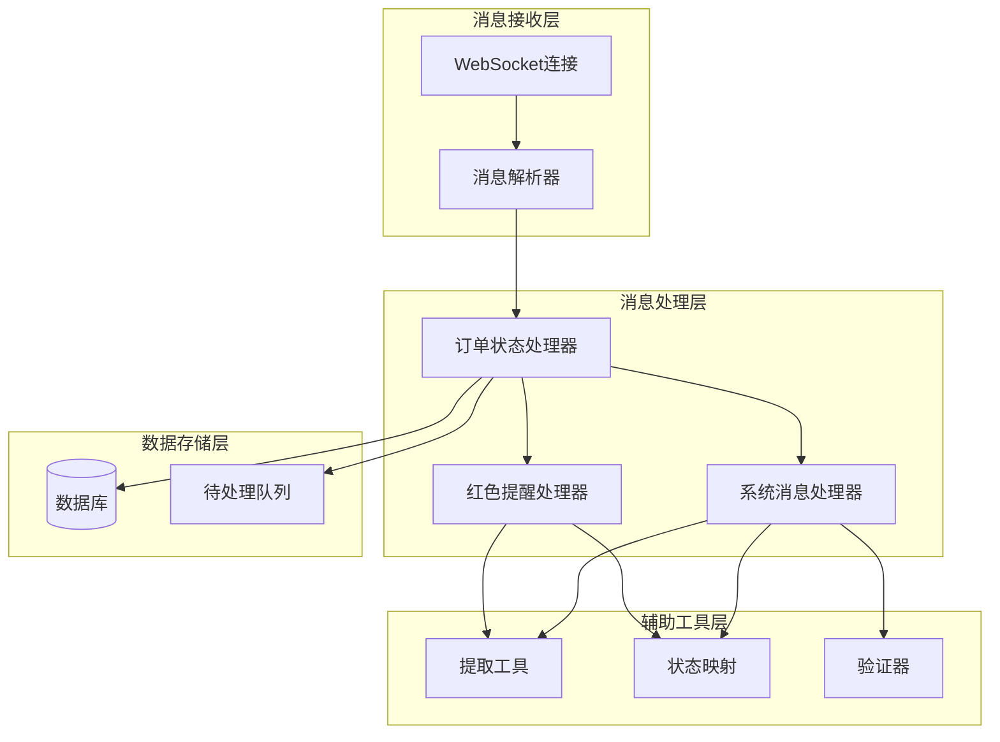
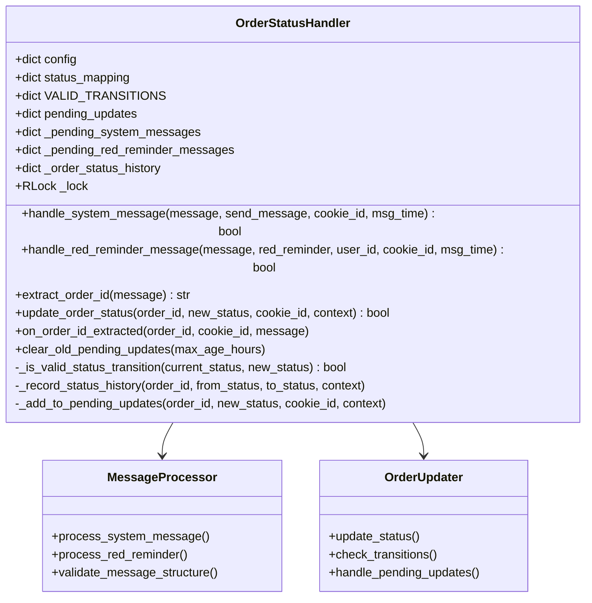
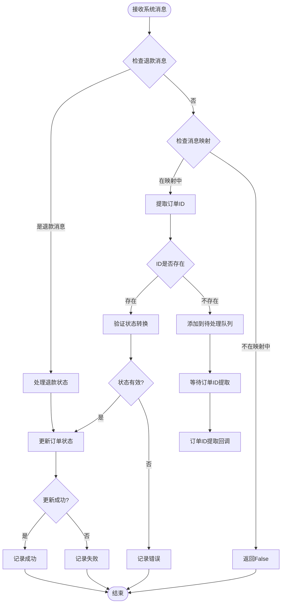
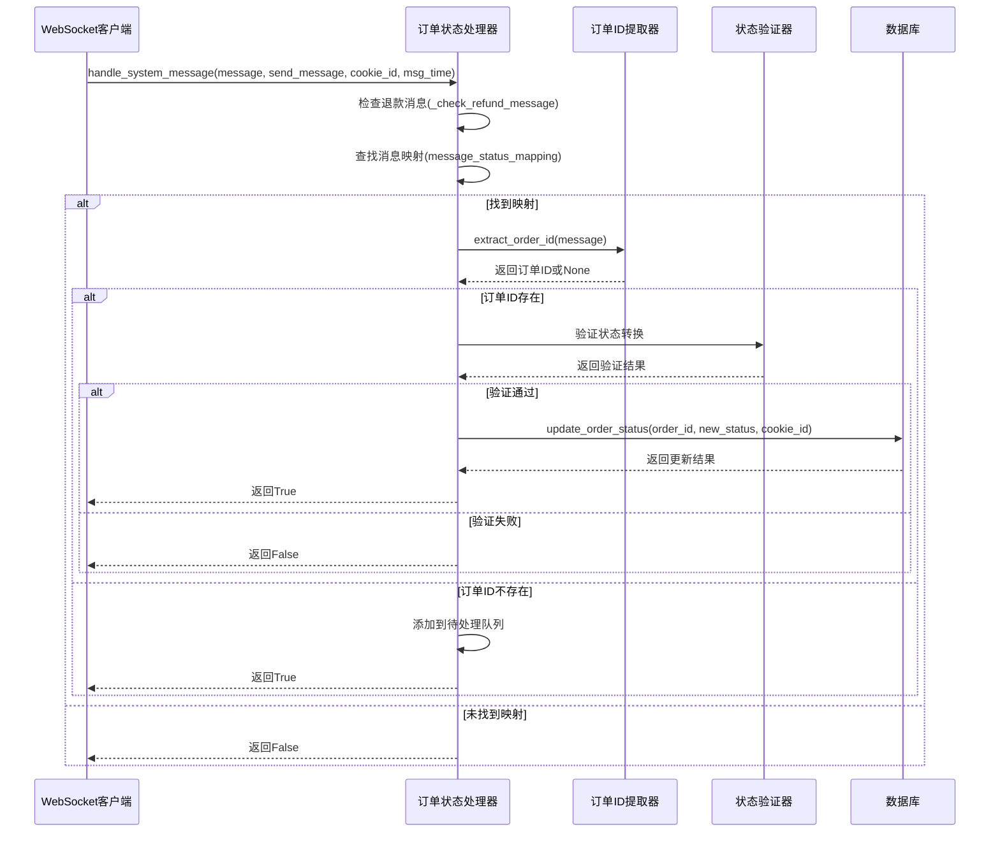
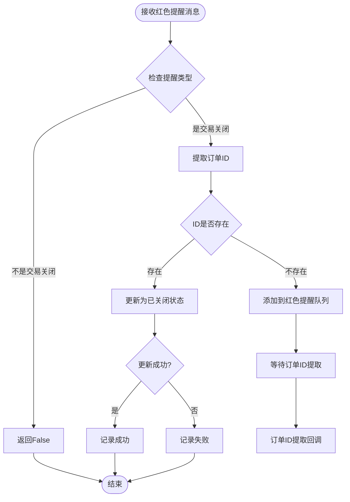
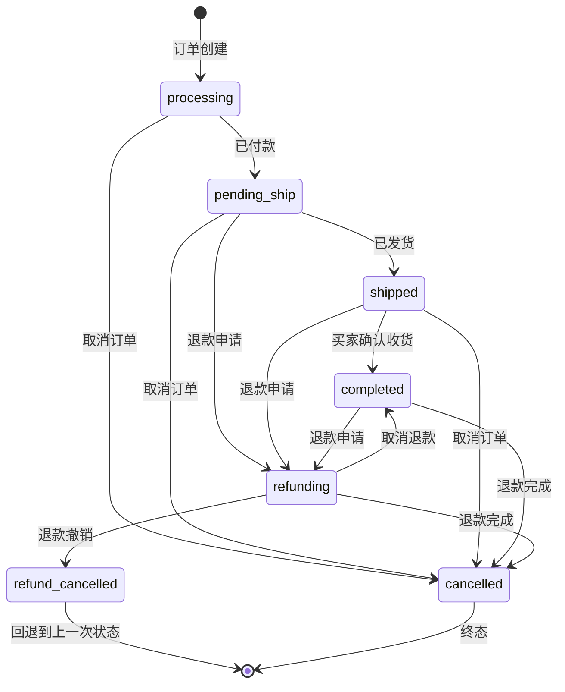
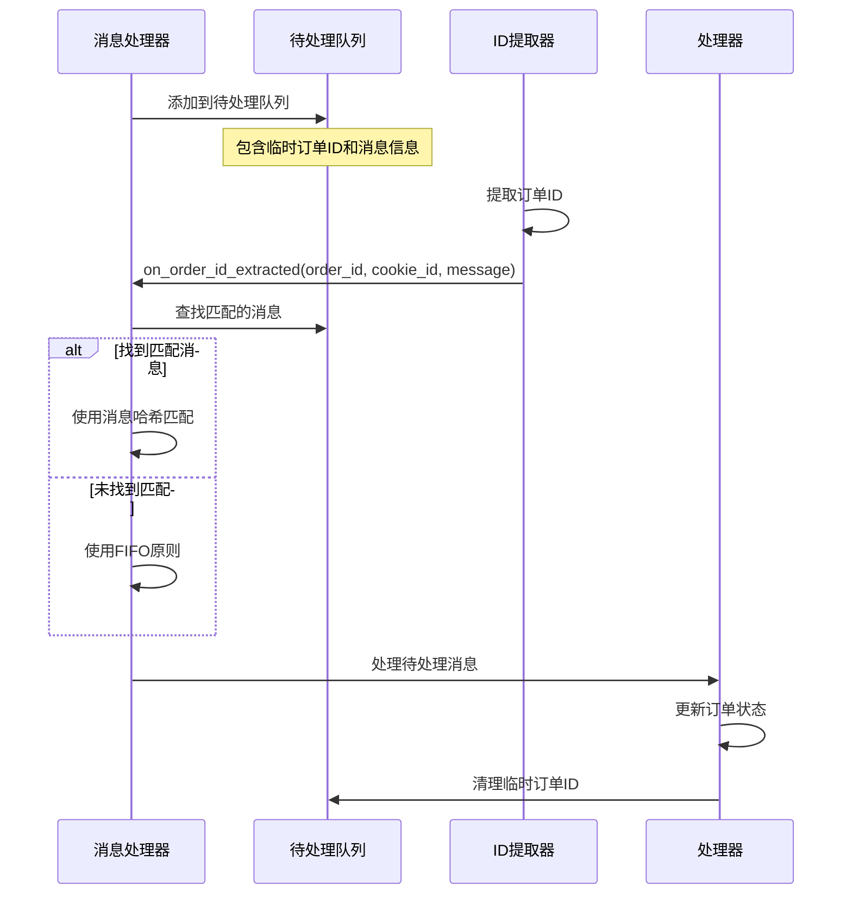
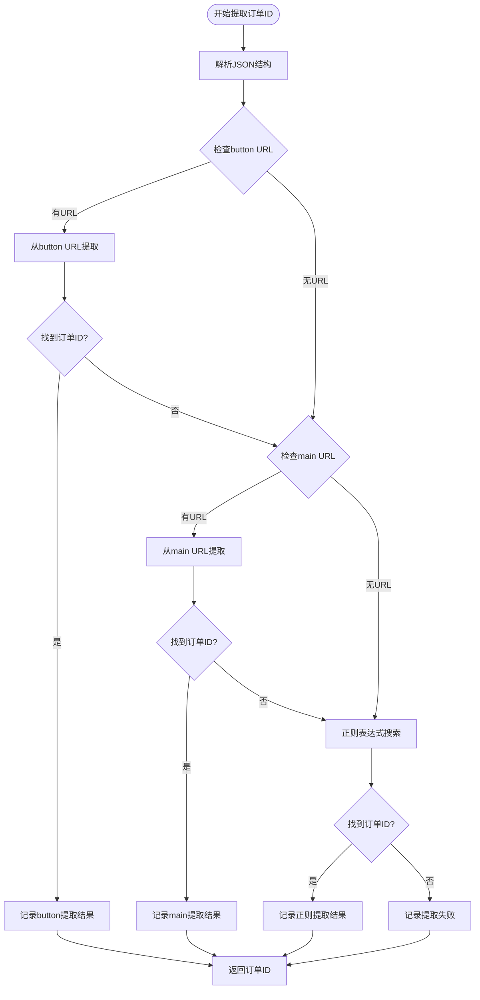

# 系统消息处理

<cite>
**本文档引用的文件**
- [order_status_handler.py](file://order_status_handler.py)
- [XianyuAutoAsync.py](file://XianyuAutoAsync.py)
- [message_utils.py](file://utils/message_utils.py)
</cite>

## 目录
1. [简介](#简介)
2. [系统架构概览](#系统架构概览)
3. [核心组件分析](#核心组件分析)
4. [消息处理流程详解](#消息处理流程详解)
5. [订单状态映射机制](#订单状态映射机制)
6. [延迟处理机制](#延迟处理机制)
7. [扩展指南](#扩展指南)
8. [故障排除](#故障排除)
9. [总结](#总结)

## 简介

闲鱼自动回复系统的核心功能之一是处理来自闲鱼平台的各种系统消息，并根据消息内容自动更新订单状态。该系统通过智能的消息解析和状态映射机制，实现了自动化程度极高的订单管理流程。

本文档深入解析系统消息处理的完整流程，包括`handle_system_message`方法如何解析各类系统消息，`_handle_red_reminder_message`方法如何处理红色提醒消息，以及系统如何通过复杂的订单ID提取算法和延迟处理机制确保消息处理的准确性。

## 系统架构概览

系统采用模块化设计，主要包含以下核心组件：



**图表来源**
- [order_status_handler.py](file://order_status_handler.py#L26-L1074)
- [XianyuAutoAsync.py](file://XianyuAutoAsync.py#L7456-L7493)

## 核心组件分析

### 订单状态处理器(OrderStatusHandler)

订单状态处理器是整个系统的核心组件，负责协调所有消息处理活动。它维护着完整的订单状态生命周期管理能力。



**图表来源**
- [order_status_handler.py](file://order_status_handler.py#L26-L1074)

**章节来源**
- [order_status_handler.py](file://order_status_handler.py#L26-L1074)

### 消息处理流程

系统采用双层处理策略，首先尝试直接处理，如果遇到特殊情况则进入延迟处理机制：



**图表来源**
- [order_status_handler.py](file://order_status_handler.py#L633-L758)
- [order_status_handler.py](file://order_status_handler.py#L760-L834)

## 消息处理流程详解

### handle_system_message方法详解

`handle_system_message`方法是系统消息处理的核心入口，它能够识别并处理多种类型的系统消息：

#### 消息类型识别

系统支持以下消息类型的自动识别和处理：

| 消息内容 | 映射状态 | 描述 |
|---------|---------|------|
| `[买家确认收货，交易成功]` | completed | 买家确认收货，交易完成 |
| `[你已确认收货，交易成功]` | completed | 卖家确认收货，交易完成 |
| `[你已发货]` | shipped | 卖家已发货 |
| `[你已发货，请等待买家确认收货]` | shipped | 已发货，等待确认 |
| `[我已付款，等待你发货]` | pending_ship | 已付款，等待发货 |
| `[我已拍下，待付款]` | processing | 已拍下，待付款 |
| `[买家已付款]` | pending_ship | 买家已付款 |
| `[付款完成]` | pending_ship | 付款完成 |
| `[已付款，待发货]` | pending_ship | 已付款，待发货 |
| `[退款成功，钱款已原路退返]` | cancelled | 退款成功，设置为已关闭 |
| `[你关闭了订单，钱款已原路退返]` | cancelled | 卖家关闭订单 |

#### 处理流程分析



**图表来源**
- [order_status_handler.py](file://order_status_handler.py#L633-L758)

**章节来源**
- [order_status_handler.py](file://order_status_handler.py#L633-L758)

### _handle_red_reminder_message方法详解

红色提醒消息处理专门针对"交易关闭"这类重要状态变更：

#### 处理逻辑



**图表来源**
- [order_status_handler.py](file://order_status_handler.py#L760-L834)

**章节来源**
- [order_status_handler.py](file://order_status_handler.py#L760-L834)

## 订单状态映射机制

### 状态映射表

系统维护了一个完整的订单状态映射表，支持中文和英文状态的双向转换：

| 英文状态 | 中文描述 | 状态优先级 | 允许转换到的状态 |
|---------|---------|-----------|----------------|
| processing | 处理中 | 1 | pending_ship, shipped, completed, cancelled |
| pending_ship | 待发货 | 2 | shipped, completed, cancelled, refunding |
| shipped | 已发货 | 3 | completed, cancelled, refunding |
| completed | 已完成 | 4 | cancelled, refunding |
| refunding | 退款中 | 2 | completed, cancelled, refund_cancelled |
| refund_cancelled | 退款撤销 | 临时状态 | 回退到上一次状态 |
| cancelled | 已关闭 | 5 | 无 |

### 状态转换规则

系统实现了严格的订单状态转换规则，防止不合理的状态回退：



**图表来源**
- [order_status_handler.py](file://order_status_handler.py#L36-L43)

**章节来源**
- [order_status_handler.py](file://order_status_handler.py#L36-L43)

## 延迟处理机制

### 待处理队列系统

当系统无法立即提取订单ID时，会将消息添加到相应的待处理队列中：

#### 队列类型

1. **系统消息队列** (`_pending_system_messages`)
   - 存储无法立即处理的系统消息
   - 包含消息内容、发送时间、临时订单ID等信息
   - 支持消息哈希匹配和FIFO两种处理策略

2. **红色提醒队列** (`_pending_red_reminder_messages`)
   - 专门处理红色提醒消息
   - 包含用户ID、提醒内容、状态等信息
   - 同样支持消息匹配和FIFO处理

#### 延迟处理流程



**图表来源**
- [order_status_handler.py](file://order_status_handler.py#L950-L1070)

**章节来源**
- [order_status_handler.py](file://order_status_handler.py#L950-L1070)

### 订单ID提取算法

系统实现了多层订单ID提取算法，确保最大程度地提取订单信息：

#### 提取策略层次

1. **第一层：JSON结构解析**
   - 从消息的`message['1']['6']['3']['5']`字段解析JSON
   - 提取button的targetUrl中的orderId参数
   - 提取main的targetUrl中的order_detail参数

2. **第二层：动态操作提取**
   - 从dynamicOperation中的changeContent提取URL
   - 从order_detail URL中提取id参数

3. **第三层：正则表达式搜索**
   - 搜索orderId=123456789格式
   - 搜索order_detail?id=123456789格式
   - 搜索"orderId":"123456789"格式
   - 搜索bizOrderId=123456789格式

#### 提取流程图



**图表来源**
- [order_status_handler.py](file://order_status_handler.py#L81-L203)

**章节来源**
- [order_status_handler.py](file://order_status_handler.py#L81-L203)

## 扩展指南

### 添加新的系统消息类型

要添加新的系统消息类型，需要修改`message_status_mapping`字典：

```python
# 在handle_system_message方法中添加新的映射
message_status_mapping = {
    # 现有的映射...
    '[新消息类型]': '新状态',  # 添加新的消息映射
}
```

### 扩展状态转换规则

如果需要扩展状态转换规则，可以修改`VALID_TRANSITIONS`字典：

```python
# 在类定义中添加新的状态转换
VALID_TRANSITIONS = {
    # 现有的转换...
    'new_status': ['allowed_status1', 'allowed_status2'],  # 添加新的状态转换
}
```

### 自定义状态映射

可以根据业务需求自定义状态映射：

```python
# 修改状态映射字典
self.status_mapping = {
    'processing': '新处理中状态',
    'pending_ship': '新待发货状态',
    # 其他状态映射...
}
```

### 配置优化

可以通过修改配置来优化系统行为：

```python
# 修改配置参数
ORDER_STATUS_HANDLER_CONFIG = {
    'use_pending_queue': True,      # 是否使用待处理队列
    'strict_validation': True,      # 是否启用严格的状态转换验证
    'max_pending_age_hours': 24,    # 待处理更新的最大保留时间（小时）
    'enable_status_logging': True,  # 是否启用详细的状态变更日志
}
```

## 故障排除

### 常见问题及解决方案

#### 1. 订单ID提取失败

**症状**: 系统频繁添加消息到待处理队列

**原因分析**:
- 消息结构发生变化
- 提取算法无法识别新的消息格式
- 网络延迟导致消息解析不完整

**解决方案**:
```python
# 在extract_order_id方法中添加调试日志
logger.info(f"完整消息结构: {message}")
logger.info(f"message['1'] 结构: {type(message_1)}, keys: {list(message_1.keys())}")
```

#### 2. 状态转换被拒绝

**症状**: 订单状态更新失败，日志显示状态转换不合理

**原因分析**:
- 状态转换规则过于严格
- 订单当前状态不正确
- 并发更新导致状态冲突

**解决方案**:
```python
# 调整严格验证配置
self.config['strict_validation'] = False  # 临时关闭严格验证
```

#### 3. 待处理队列堆积

**症状**: 系统运行一段时间后出现大量待处理消息

**原因分析**:
- 订单ID提取失败率过高
- 待处理队列清理机制失效
- 系统负载过高导致处理延迟

**解决方案**:
```python
# 清理过期的待处理更新
self.clear_old_pending_updates(max_age_hours=12)  # 设置较短的保留时间
```

#### 4. 红色提醒消息处理失败

**症状**: 交易关闭消息无法正确处理

**原因分析**:
- 红色提醒内容格式变化
- 用户ID提取失败
- 状态映射不完整

**解决方案**:
```python
# 在handle_red_reminder_message方法中添加更多调试信息
logger.info(f"红色提醒内容: {red_reminder}")
logger.info(f"用户ID: {user_id}")
logger.info(f"消息结构: {message}")
```

### 调试技巧

#### 启用详细日志

```python
# 设置更详细的日志级别
import logging
logging.getLogger('order_status_handler').setLevel(logging.DEBUG)
```

#### 消息追踪

```python
# 在关键位置添加消息追踪
logger.info(f"处理消息: {send_message}")
logger.info(f"消息时间: {msg_time}")
logger.info(f"Cookie ID: {cookie_id}")
```

#### 状态监控

```python
# 监控待处理队列状态
logger.info(f"待处理系统消息数量: {len(self._pending_system_messages)}")
logger.info(f"待处理红色提醒数量: {len(self._pending_red_reminder_messages)}")
```

**章节来源**
- [order_status_handler.py](file://order_status_handler.py#L555-L632)

## 总结

闲鱼自动回复系统的消息处理机制是一个高度智能化的订单管理系统，具有以下特点：

### 核心优势

1. **多层消息识别**: 支持多种消息格式和内容的智能识别
2. **灵活的状态映射**: 完整的状态转换规则和映射机制
3. **强大的延迟处理**: 智能的待处理队列管理和订单ID提取回调
4. **严格的验证机制**: 状态转换验证和重复处理防护
5. **完善的错误处理**: 详细的日志记录和错误恢复机制

### 技术亮点

- **并发安全**: 使用线程锁保护共享资源
- **容错设计**: 多种提取策略确保高成功率
- **可扩展性**: 模块化设计便于功能扩展
- **性能优化**: 异步处理和批量操作提升效率

### 应用价值

该系统为闲鱼卖家提供了：
- 自动化的订单状态管理
- 减少人工干预的工作量
- 提高订单处理的准确性和及时性
- 完整的操作记录和审计跟踪

通过深入理解这套消息处理机制，开发者可以更好地维护和扩展系统功能，为闲鱼平台的自动化运营提供强有力的技术支撑。