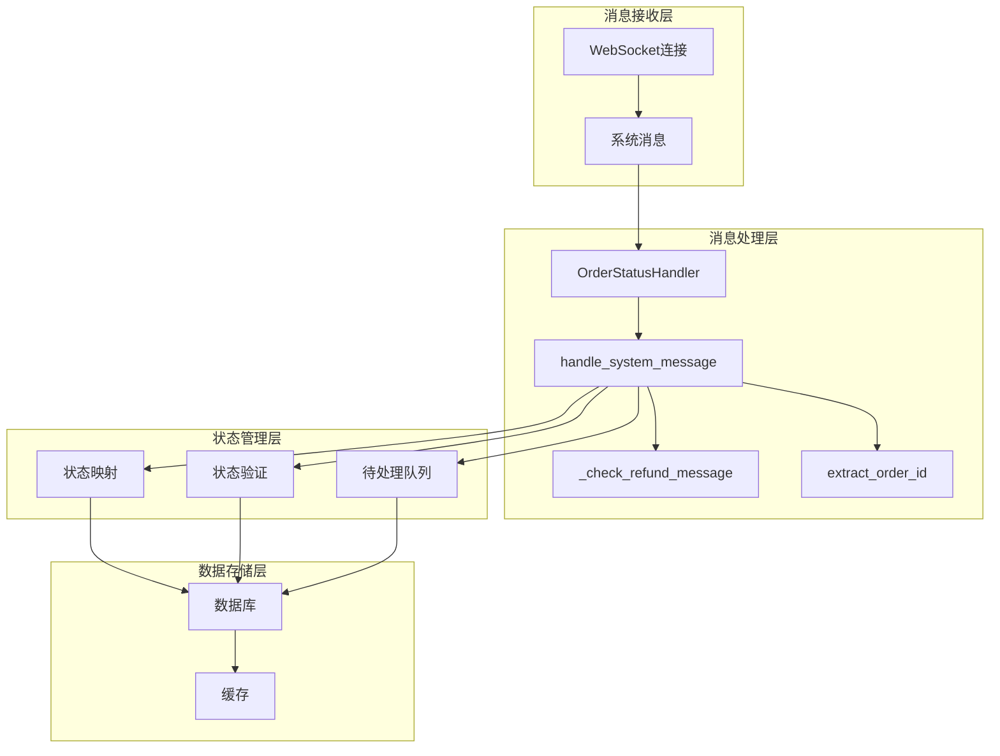
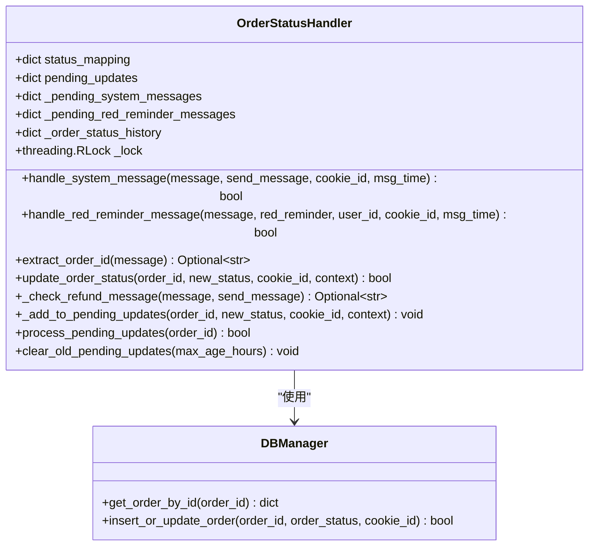
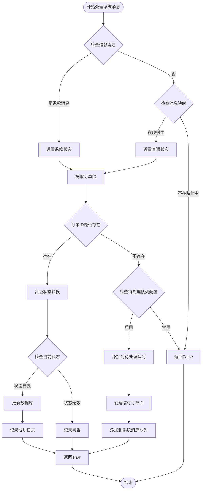
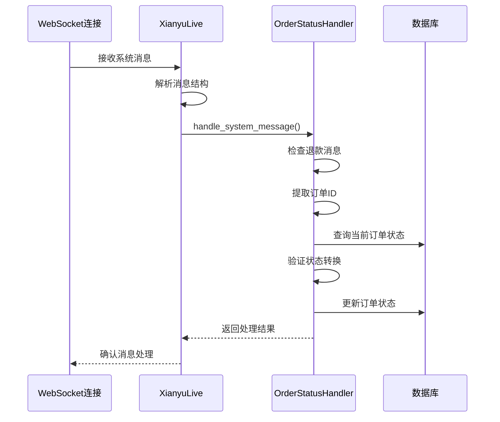
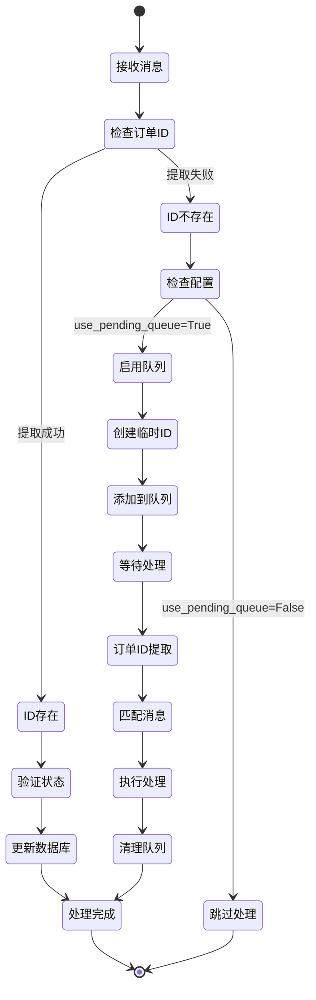
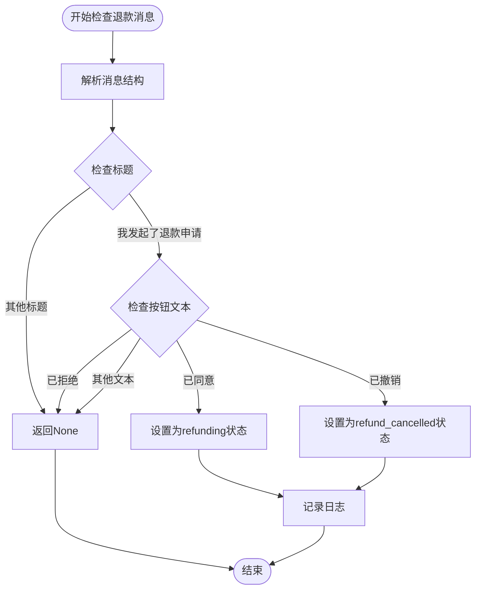

# 系统消息解析机制深度分析

<cite>
**本文档引用的文件**
- [order_status_handler.py](file://order_status_handler.py)
- [XianyuAutoAsync.py](file://XianyuAutoAsync.py)
- [db_manager.py](file://db_manager.py)
- [config.py](file://config.py)
</cite>

## 目录
1. [概述](#概述)
2. [系统架构](#系统架构)
3. [核心组件分析](#核心组件分析)
4. [消息处理流程](#消息处理流程)
5. [待处理队列机制](#待处理队列机制)
6. [退款消息特殊处理](#退款消息特殊处理)
7. [订单ID提取算法](#订单id提取算法)
8. [状态转换验证](#状态转换验证)
9. [配置与扩展指南](#配置与扩展指南)
10. [故障排除与调试](#故障排除与调试)
11. [总结](#总结)

## 概述

系统消息解析机制是闲鱼自动回复系统的核心功能模块，负责处理来自闲鱼平台的各种系统消息（如[你已发货]、[买家确认收货]等），并将这些消息内容映射到对应的订单状态。该机制通过复杂的解析算法、智能的待处理队列管理和严格的验证规则，确保订单状态的准确性和一致性。

### 主要特性

- **智能消息映射**：支持多种消息格式的状态映射
- **待处理队列**：解决订单ID提取失败时的状态更新延迟问题
- **退款消息特殊处理**：通过标题和按钮文本双重验证退款状态
- **状态转换验证**：防止不合理的状态回退
- **高可靠性设计**：多重提取策略和错误处理机制

## 系统架构



**图表来源**
- [order_status_handler.py](file://order_status_handler.py#L632-L757)
- [XianyuAutoAsync.py](file://XianyuAutoAsync.py#L7456-L7493)

## 核心组件分析

### OrderStatusHandler类

OrderStatusHandler是系统消息处理的核心类，负责所有订单状态相关的业务逻辑。



**图表来源**
- [order_status_handler.py](file://order_status_handler.py#L26-L1074)

**章节来源**
- [order_status_handler.py](file://order_status_handler.py#L26-L1074)

### 消息状态映射表

系统定义了完整的消息状态映射表，涵盖各种常见的系统消息类型：

| 消息内容 | 映射状态 | 描述 |
|---------|---------|------|
| `[买家确认收货，交易成功]` | completed | 买家确认收货，交易完成 |
| `[你已确认收货，交易成功]` | completed | 卖家确认收货，交易完成 |
| `[你已发货]` | shipped | 卖家已发货 |
| `[你已发货，请等待买家确认收货]` | shipped | 已发货，等待确认 |
| `[我已付款，等待你发货]` | pending_ship | 买家已付款，等待发货 |
| `[买家已付款]` | pending_ship | 买家已付款 |
| `[付款完成]` | pending_ship | 付款完成 |
| `[已付款，待发货]` | pending_ship | 已付款，待发货 |
| `[退款成功，钱款已原路退返]` | cancelled | 退款成功，设置为已关闭 |
| `[你关闭了订单，钱款已原路退返]` | cancelled | 卖家关闭订单 |

**章节来源**
- [order_status_handler.py](file://order_status_handler.py#L646-L659)

## 消息处理流程

### handle_system_message方法详解

handle_system_message是系统消息处理的主要入口，其处理流程如下：



**图表来源**
- [order_status_handler.py](file://order_status_handler.py#L632-L757)

**章节来源**
- [order_status_handler.py](file://order_status_handler.py#L632-L757)

### 消息接收与分发

系统通过WebSocket连接实时接收消息，并根据消息类型进行分发：



**图表来源**
- [XianyuAutoAsync.py](file://XianyuAutoAsync.py#L7456-L7493)
- [order_status_handler.py](file://order_status_handler.py#L632-L757)

**章节来源**
- [XianyuAutoAsync.py](file://XianyuAutoAsync.py#L7456-L7493)

## 待处理队列机制

### 设计原理

待处理队列机制是系统的重要容错设计，当无法立即提取订单ID时，系统会将消息暂存到队列中，等待后续处理。

### 队列结构

系统维护三种类型的待处理队列：

1. **待处理更新队列** (`pending_updates`)：存储订单状态更新请求
2. **待处理系统消息队列** (`_pending_system_messages`)：存储系统消息及其上下文
3. **待处理红色提醒消息队列** (`_pending_red_reminder_messages`)：存储红色提醒消息

### 生命周期管理



**图表来源**
- [order_status_handler.py](file://order_status_handler.py#L61-L70)
- [order_status_handler.py](file://order_status_handler.py#L950-L1070)

**章节来源**
- [order_status_handler.py](file://order_status_handler.py#L61-L70)
- [order_status_handler.py](file://order_status_handler.py#L950-L1070)

### 清理机制

系统实现了智能的队列清理机制，防止内存泄漏：

- **时间限制**：默认保留24小时
- **容量限制**：限制历史记录数量
- **批量清理**：定期清理过期项目

**章节来源**
- [order_status_handler.py](file://order_status_handler.py#L554-L632)

## 退款消息特殊处理

### _check_refund_message方法

退款消息的处理是最复杂的部分，需要同时识别消息标题和按钮文本才能准确定位状态变更。



**图表来源**
- [order_status_handler.py](file://order_status_handler.py#L345-L416)

### 退款状态处理规则

| 标题 | 按钮文本 | 状态 | 描述 |
|------|---------|------|------|
| 我发起了退款申请 | 已同意 | refunding | 退款申请已同意，进入退款中状态 |
| 我发起了退款申请 | 已撤销 | refund_cancelled | 买家主动撤销退款申请 |
| 我发起了退款申请 | 已拒绝 | - | 退款申请被拒绝，不改变状态 |

**章节来源**
- [order_status_handler.py](file://order_status_handler.py#L345-L416)

## 订单ID提取算法

### 多层次提取策略

extract_order_id方法实现了多层次的订单ID提取算法，确保在各种消息格式下都能准确提取：

```mermaid
flowchart TD
Start([开始提取订单ID]) --> LogStructure[记录完整消息结构]
LogStructure --> CheckMessage1{检查message['1']}
CheckMessage1 --> |字典| CheckMessage1_6{检查message['1']['6']}
CheckMessage1 --> |列表| Skip1[跳过此方法]
CheckMessage1 --> |字符串| Skip1
CheckMessage1 --> |其他类型| Skip1
CheckMessage1_6 --> |字典| ParseJSON[解析JSON内容]
CheckMessage1_6 --> |其他| Skip2[跳过此方法]
ParseJSON --> Method1[方法1: 从button提取]
Method1 --> ExtractFromButton[从targetUrl提取orderId]
ExtractFromButton --> Found1{找到订单ID?}
Found1 --> |是| LogSuccess1[记录成功日志]
Found1 --> |否| Method2[方法2: 从main提取]
Method2 --> ExtractFromMain[从targetUrl提取order_detail id]
ExtractFromMain --> Found2{找到订单ID?}
Found2 --> |是| LogSuccess2[记录成功日志]
Found2 --> |否| Method3[方法3: 正则搜索]
Method3 --> RegexSearch[在消息中搜索订单ID模式]
RegexSearch --> Found3{找到订单ID?}
Found3 --> |是| LogSuccess3[记录成功日志]
Found3 --> |否| LogFailure[记录失败日志]
LogSuccess1 --> Return[返回订单ID]
LogSuccess2 --> Return
LogSuccess3 --> Return
LogFailure --> ReturnNone[返回None]
Return --> End([结束])
ReturnNone --> End
Skip1 --> Method2
Skip2 --> Method3
```

**图表来源**
- [order_status_handler.py](file://order_status_handler.py#L80-L190)

### 提取策略详解

#### 方法1：从按钮链接提取
- **目标URL**：从`content_data['dxCard']['item']['main']['exContent']['button']['targetUrl']`提取
- **正则表达式**：`orderId=(\d+)`

#### 方法2：从主链接提取
- **目标URL**：从`content_data['dxCard']['item']['main']['targetUrl']`提取
- **正则表达式**：`order_detail\?id=(\d+)`

#### 方法3：正则表达式搜索
- **模式1**：`orderId[=:](\d{10,})`
- **模式2**：`order_detail\?id=(\d{10,})`
- **模式3**：`"id"\s*:\s*"?(\d{10,})"?`
- **模式4**：`bizOrderId[=:](\d{10,})`

**章节来源**
- [order_status_handler.py](file://order_status_handler.py#L80-L190)

## 状态转换验证

### 状态优先级系统

系统实现了基于优先级的状态转换验证机制，防止不合理的状态回退：

```mermaid
graph LR
subgraph "状态优先级"
P[processing: 1]
PS[pending_ship: 2]
S[shipped: 3]
C[completed: 4]
R[refunding: 2]
CR[refund_cancelled: 0]
Can[cancelled: 5]
end
P --> PS
PS --> S
PS --> R
S --> C
S --> R
C --> R
R --> C
R --> Can
CR --> [回退到上一次状态]
```

**图表来源**
- [order_status_handler.py](file://order_status_handler.py#L722-L729)

### 验证规则

| 当前状态 | 允许转换到的状态 | 特殊规则 |
|---------|----------------|----------|
| processing | pending_ship, shipped, completed, cancelled | 无 |
| pending_ship | shipped, completed, cancelled, refunding | 已付款，可以退款 |
| shipped | completed, cancelled, refunding | 已发货，可以退款 |
| completed | cancelled, refunding | 已完成，可以退款 |
| refunding | completed, cancelled, refund_cancelled | 退款中，可以完成、关闭或撤销 |
| refund_cancelled | 回退到上一次状态 | 临时状态，会立即回退 |
| cancelled | 无 | 终态，不能转换到其他状态 |

**章节来源**
- [order_status_handler.py](file://order_status_handler.py#L309-L331)

## 配置与扩展指南

### 配置选项

系统提供了丰富的配置选项来适应不同的使用场景：

```python
ORDER_STATUS_HANDLER_CONFIG = {
    'use_pending_queue': True,                    # 是否使用待处理队列
    'strict_validation': True,                    # 是否启用严格的状态转换验证
    'log_level': 'info',                         # 日志级别
    'max_pending_age_hours': 24,                 # 待处理更新的最大保留时间（小时）
    'enable_status_logging': True,               # 是否启用详细的状态变更日志
}
```

### 扩展消息映射规则

要添加新的消息映射规则，可以在`message_status_mapping`字典中添加：

```python
# 在handle_system_message方法中添加
message_status_mapping = {
    # 现有的映射...
    '[新消息内容]': '新状态',  # 添加新的消息映射
}
```

### 自定义提取策略

如果遇到特殊的订单ID格式，可以在`extract_order_id`方法中添加新的提取策略：

```python
# 在方法末尾添加新的正则表达式模式
patterns = [
    # 现有的模式...
    r'new_pattern=(\d{10,})',  # 新的提取模式
]
```

### 扩展退款消息处理

要支持新的退款状态，可以在`_check_refund_message`方法中添加：

```python
# 在适当位置添加新的退款状态检查
if title == '新标题' and button_text == '新按钮文本':
    logger.info(f"✅ 识别到新退款状态消息")
    return 'new_status'
```

**章节来源**
- [order_status_handler.py](file://order_status_handler.py#L16-L23)
- [order_status_handler.py](file://order_status_handler.py#L646-L659)

## 故障排除与调试

### 常见问题诊断

#### 1. 订单ID提取失败

**症状**：日志显示"未能从消息中提取到订单ID"

**诊断步骤**：
1. 检查消息结构是否符合预期
2. 验证JSON解析是否成功
3. 确认正则表达式匹配模式

**解决方案**：
- 添加新的提取模式
- 调整现有正则表达式的优先级
- 检查消息格式的变化

#### 2. 状态转换被拒绝

**症状**：日志显示"状态转换被拒绝"

**诊断步骤**：
1. 检查当前订单状态
2. 验证目标状态是否在允许列表中
3. 检查状态优先级设置

**解决方案**：
- 修改状态转换规则
- 调整严格验证配置
- 检查业务逻辑需求

#### 3. 待处理队列堆积

**症状**：待处理队列持续增长

**诊断步骤**：
1. 检查订单ID提取成功率
2. 验证消息匹配机制
3. 监控队列清理频率

**解决方案**：
- 优化订单ID提取算法
- 调整队列清理策略
- 增加队列监控告警

### 调试技巧

#### 1. 启用详细日志

```python
# 在配置中启用详细日志
ORDER_STATUS_HANDLER_CONFIG['log_level'] = 'debug'
ORDER_STATUS_HANDLER_CONFIG['enable_status_logging'] = True
```

#### 2. 消息结构分析

```python
# 在extract_order_id方法中添加调试输出
logger.info(f"🔍 完整消息结构: {message}")
```

#### 3. 状态历史跟踪

```python
# 检查状态历史记录
logger.info(f"订单状态历史: {self._order_status_history.get(order_id, [])}")
```

#### 4. 队列状态监控

```python
# 监控待处理队列状态
logger.info(f"待处理更新数量: {self.get_pending_updates_count()}")
logger.info(f"系统消息队列大小: {sum(len(v) for v in self._pending_system_messages.values())}")
```

### 性能优化建议

1. **缓存机制**：对频繁查询的订单状态进行缓存
2. **批量处理**：合并相似的状态更新请求
3. **异步处理**：使用异步数据库操作减少阻塞
4. **队列优化**：实现智能的队列清理策略

**章节来源**
- [order_status_handler.py](file://order_status_handler.py#L16-L23)
- [order_status_handler.py](file://order_status_handler.py#L80-L190)

## 总结

系统消息解析机制是一个高度复杂且精密设计的功能模块，它通过以下关键特性确保了系统的可靠性和准确性：

### 核心优势

1. **多层容错设计**：通过待处理队列机制解决了订单ID提取失败的问题
2. **智能状态映射**：支持多种消息格式的状态转换
3. **严格验证机制**：防止不合理的状态回退和转换
4. **灵活扩展能力**：易于添加新的消息类型和处理规则
5. **完善的错误处理**：提供详细的日志和调试信息

### 技术亮点

- **多层次提取算法**：确保在各种消息格式下都能准确提取订单ID
- **双重验证机制**：退款消息需要同时识别标题和按钮文本
- **状态优先级系统**：智能防止状态回退
- **智能队列管理**：自动清理过期项目，防止内存泄漏

### 应用价值

该机制为闲鱼自动回复系统提供了稳定可靠的订单状态管理基础，确保了交易流程的自动化和准确性，大大提升了运营效率和用户体验。

通过深入理解这套机制的设计原理和实现细节，开发者可以更好地维护和扩展系统功能，同时也能为类似项目的开发提供宝贵的参考经验。