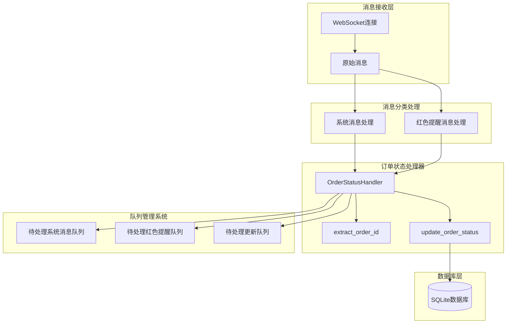
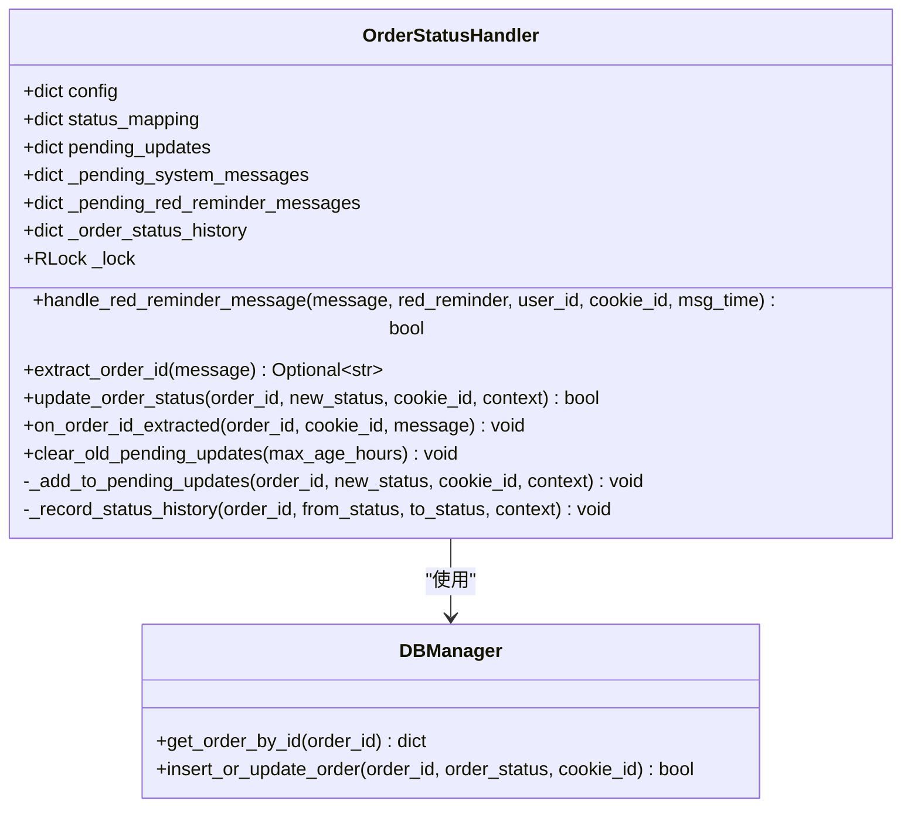
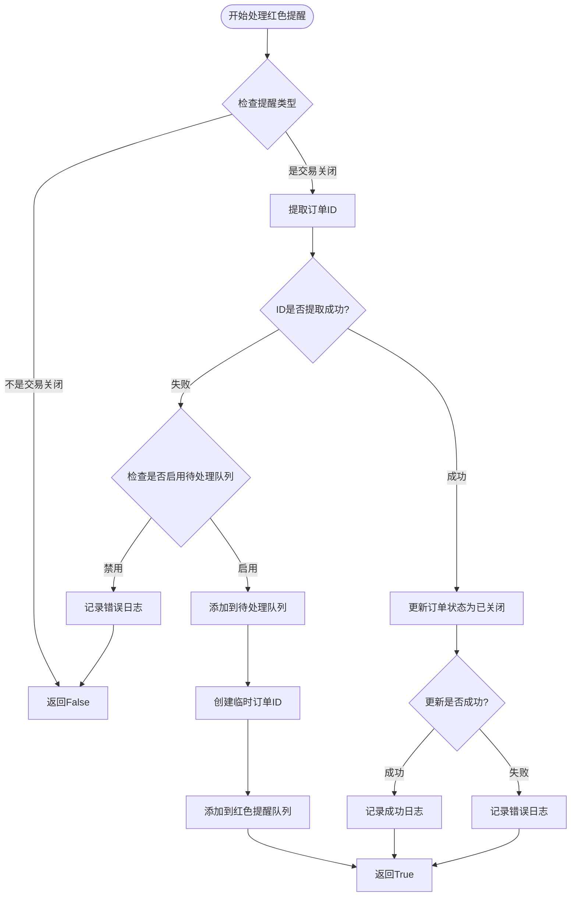
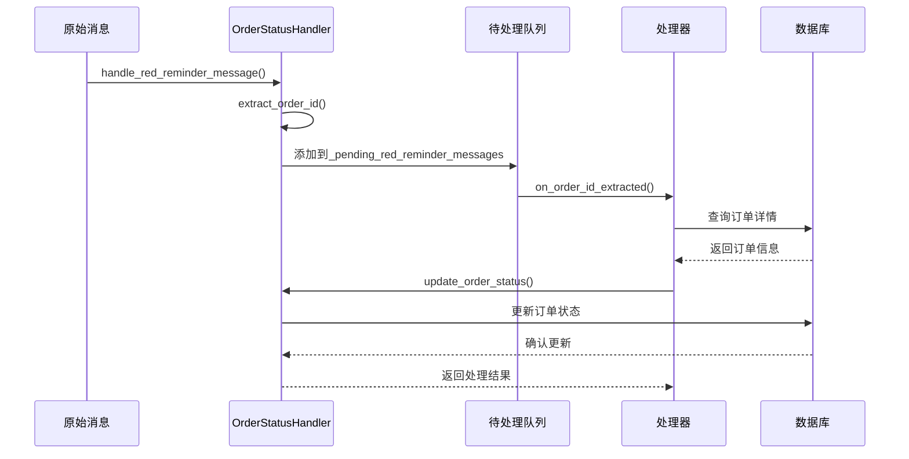
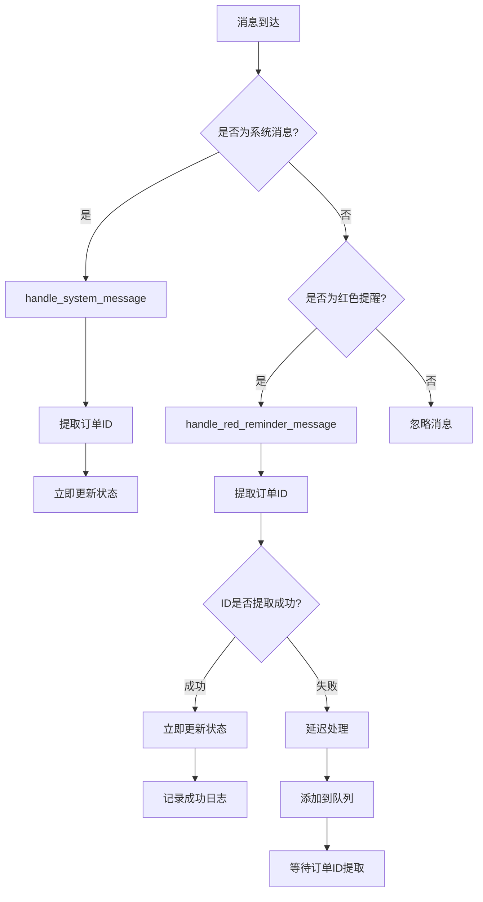

# 红色提醒处理流程详细说明

<cite>
**本文档引用的文件**
- [order_status_handler.py](file://order_status_handler.py)
- [XianyuAutoAsync.py](file://XianyuAutoAsync.py)
- [db_manager.py](file://db_manager.py)
</cite>

## 目录
1. [概述](#概述)
2. [系统架构](#系统架构)
3. [核心组件分析](#核心组件分析)
4. [handle_red_reminder_message方法详解](#handle_red_reminder_message方法详解)
5. [订单ID提取机制](#订单id提取机制)
6. [待处理队列处理](#待处理队列处理)
7. [系统消息处理对比](#系统消息处理对比)
8. [性能优化策略](#性能优化策略)
9. [扩展建议](#扩展建议)
10. [故障排除指南](#故障排除指南)

## 概述

红色提醒消息处理是闲鱼自动回复系统中的关键功能模块，专门负责识别和处理"交易关闭"这一特定类型的红色提醒消息。该系统采用双重处理策略：直接处理和延迟处理，确保订单状态更新的最终一致性。

### 主要特性

- **智能识别**：仅处理"交易关闭"类型的红色提醒
- **灵活提取**：支持多种订单ID提取方式
- **延迟处理**：通过待处理队列保证状态更新的可靠性
- **最终一致性**：确保即使消息丢失也能恢复状态更新
- **高性能**：采用异步处理和队列管理机制

## 系统架构



**图表来源**
- [order_status_handler.py](file://order_status_handler.py#L60-L66)
- [XianyuAutoAsync.py](file://XianyuAutoAsync.py#L7456-L7493)

## 核心组件分析

### OrderStatusHandler类

OrderStatusHandler是订单状态处理的核心类，负责协调各种消息类型的处理流程。



**图表来源**
- [order_status_handler.py](file://order_status_handler.py#L26-L1074)

**章节来源**
- [order_status_handler.py](file://order_status_handler.py#L26-L1074)

### 队列管理结构

系统维护三个主要队列来处理不同类型的消息：

| 队列名称 | 类型 | 用途 | 清理策略 |
|---------|------|------|----------|
| pending_updates | `{order_id: [update_info, ...]}` | 存储待处理的订单状态更新 | 按订单ID分组，支持批量处理 |
| _pending_system_messages | `{cookie_id: [message_info, ...]}` | 存储待处理的系统消息 | 按账号分组，支持消息匹配 |
| _pending_red_reminder_messages | `{cookie_id: [message_info, ...]}` | 存储待处理的红色提醒消息 | 按账号分组，支持延迟处理 |

**章节来源**
- [order_status_handler.py](file://order_status_handler.py#L60-L66)

## handle_red_reminder_message方法详解

### 方法签名与职责

`handle_red_reminder_message`方法是红色提醒处理的核心入口，专门处理"交易关闭"类型的红色提醒消息。

### 处理流程图



**图表来源**
- [order_status_handler.py](file://order_status_handler.py#L760-L833)

### 关键处理步骤

#### 1. 提醒类型过滤
```python
# 只处理交易关闭的情况
if red_reminder != '交易关闭':
    return False
```

#### 2. 订单ID提取
系统采用多层提取策略，优先从消息结构中提取订单ID：

```python
# 提取订单ID
order_id = self.extract_order_id(message)
```

#### 3. ID缺失处理
当无法提取订单ID时，系统根据配置决定处理策略：

```python
if not order_id:
    if self.config.get('use_pending_queue', True):
        logger.info(f'[{msg_time}] 【{cookie_id}】交易关闭，暂时无法提取订单ID，添加到待处理队列')
    else:
        logger.error(f'[{msg_time}] 【{cookie_id}】交易关闭，无法提取订单ID且未启用待处理队列，跳过处理')
    return False
```

#### 4. 状态更新
成功提取订单ID后，系统执行状态更新：

```python
success = self.update_order_status(
    order_id=order_id,
    new_status='cancelled',
    cookie_id=cookie_id,
    context=f"交易关闭 - 用户{user_id} - {msg_time}"
)
```

**章节来源**
- [order_status_handler.py](file://order_status_handler.py#L760-L833)

## 订单ID提取机制

### extract_order_id方法详解

extract_order_id方法实现了复杂的订单ID提取逻辑，支持多种提取方式：

```mermaid
flowchart TD
START_EXTRACT([开始提取订单ID]) --> LOG_MESSAGE[记录完整消息结构]
LOG_MESSAGE --> CHECK_TYPE{检查message['1']类型}
CHECK_TYPE --> |字典| CHECK_1_6{检查message['1']['6']}
CHECK_TYPE --> |列表| SKIP_LIST[跳过列表类型]
CHECK_TYPE --> |字符串| SKIP_STRING[跳过字符串类型]
CHECK_TYPE --> |其他| SKIP_OTHER[跳过其他类型]
CHECK_1_6 --> |字典| PARSE_JSON[解析JSON内容]
CHECK_1_6 --> |非字典| LOG_TYPE[记录类型信息]
PARSE_JSON --> METHOD1[方法1: 从button URL提取]
METHOD1 --> METHOD1A[从targetUrl提取orderId]
METHOD1 --> METHOD1B[从main targetUrl提取]
METHOD1A --> CHECK_METHOD1{方法1是否成功?}
METHOD1B --> CHECK_METHOD1
CHECK_METHOD1 --> |成功| RETURN_ID[返回订单ID]
CHECK_METHOD1 --> |失败| METHOD2[方法2: 从dynamicOperation提取]
METHOD2 --> METHOD2A[从order_detail URL提取]
METHOD2A --> CHECK_METHOD2{方法2是否成功?}
CHECK_METHOD2 --> |成功| RETURN_ID
CHECK_METHOD2 --> |失败| METHOD3[方法3: 正则表达式搜索]
METHOD3 --> SEARCH_PATTERNS[搜索各种订单ID模式]
SEARCH_PATTERNS --> CHECK_METHOD3{方法3是否成功?}
CHECK_METHOD3 --> |成功| RETURN_ID
CHECK_METHOD3 --> |失败| LOG_FAIL[记录提取失败]
SKIP_LIST --> LOG_FAIL
SKIP_STRING --> LOG_FAIL
SKIP_OTHER --> LOG_FAIL
LOG_FAIL --> RETURN_NONE[返回None]
```

**图表来源**
- [order_status_handler.py](file://order_status_handler.py#L80-L189)

### 提取策略详解

#### 方法1: 从Button URL提取
```python
# 从button的targetUrl中提取orderId
target_url = content_data.get('dxCard', {}).get('item', {}).get('main', {}).get('exContent', {}).get('button', {}).get('targetUrl', '')
if target_url:
    order_match = re.search(r'orderId=(\d+)', target_url)
    if order_match:
        order_id = order_match.group(1)
```

#### 方法2: 从Dynamic Operation提取
```python
# 从dynamicOperation中的order_detail URL提取
dynamic_target_url = content_data.get('dynamicOperation', {}).get('changeContent', {}).get('dxCard', {}).get('item', {}).get('main', {}).get('exContent', {}).get('button', {}).get('targetUrl', '')
if dynamic_target_url:
    order_match = re.search(r'order_detail\?id=(\d+)', dynamic_target_url)
    if order_match:
        order_id = order_match.group(1)
```

#### 方法3: 正则表达式搜索
```python
patterns = [
    r'orderId[=:](\d{10,})',  # orderId=123456789
    r'order_detail\?id=(\d{10,})',  # order_detail?id=123456789
    r'"id"\s*:\s*"?(\d{10,})"?',  # "id":"123456789"
    r'bizOrderId[=:](\d{10,})',  # bizOrderId=123456789
]
```

**章节来源**
- [order_status_handler.py](file://order_status_handler.py#L80-L189)

## 待处理队列处理

### 延迟处理机制

当订单ID无法立即提取时，系统会将消息添加到待处理队列，等待后续处理：



**图表来源**
- [order_status_handler.py](file://order_status_handler.py#L950-L1070)

### 队列清理策略

系统实现了智能的队列清理机制：

```python
def clear_old_pending_updates(self, max_age_hours: int = None):
    """清理过期的待处理更新"""
    if max_age_hours is None:
        max_age_hours = self.config.get('max_pending_age_hours', 24)
    
    current_time = time.time()
    max_age_seconds = max_age_hours * 3600
    
    # 清理过期的待处理更新
    expired_orders = []
    for order_id, updates in self.pending_updates.items():
        valid_updates = [
            update for update in updates 
            if current_time - update['timestamp'] < max_age_seconds
        ]
        if not valid_updates:
            expired_orders.append(order_id)
        else:
            self.pending_updates[order_id] = valid_updates
```

**章节来源**
- [order_status_handler.py](file://order_status_handler.py#L555-L631)

## 系统消息处理对比

### 处理流程差异

| 特性 | 系统消息处理 | 红色提醒处理 |
|------|-------------|-------------|
| 消息类型 | `[买家确认收货]`, `[你已发货]`等 | `交易关闭` |
| 订单ID提取时机 | 消息到达时 | 消息到达时 |
| 状态更新优先级 | 高优先级，立即处理 | 低优先级，延迟处理 |
| 队列使用 | 系统消息队列 | 红色提醒队列 |
| 匹配策略 | 文本匹配 | 类型匹配 |
| 错误处理 | 严格验证 | 宽松验证 |

### 处理顺序



**图表来源**
- [XianyuAutoAsync.py](file://XianyuAutoAsync.py#L7456-L7493)

**章节来源**
- [XianyuAutoAsync.py](file://XianyuAutoAsync.py#L7456-L7493)

## 性能优化策略

### 高并发场景优化

#### 1. 锁机制优化
```python
# 使用threading.RLock保护并发访问
self._lock = threading.RLock()

def update_order_status(self, order_id: str, new_status: str, cookie_id: str, context: str = "") -> bool:
    with self._lock:
        # 执行数据库操作
        pass
```

#### 2. 异步处理分离
```python
def _process_updates_outside_lock(self, order_id: str, updates: list):
    """在锁外处理更新，避免死锁"""
    processed_count = 0
    for update_info in updates:
        # 在锁外执行耗时操作
        success = self.update_order_status(...)
        if success:
            processed_count += 1
```

#### 3. 批量处理优化
```python
def process_all_pending_updates(self) -> int:
    """批量处理所有待处理的更新"""
    with self._lock:
        if not self.pending_updates:
            return 0
        order_ids = list(self.pending_updates.keys())
    
    processed_orders = 0
    for order_id in order_ids:
        if self.process_pending_updates(order_id):
            processed_orders += 1
    
    return processed_orders
```

### 内存管理优化

#### 1. 队列大小控制
```python
# 限制历史记录数量，只保留最近10条
if len(self._order_status_history[order_id]) > 10:
    self._order_status_history[order_id] = self._order_status_history[order_id][-10:]
```

#### 2. 定期清理机制
```python
# 定期清理过期的待处理更新
def clear_old_pending_updates(self, max_age_hours: int = None):
    # 清理过期项目
    current_time = time.time()
    max_age_seconds = max_age_hours * 3600
    
    # 批量清理多个队列
    expired_cookies_red = []
    for cookie_id, messages in self._pending_red_reminder_messages.items():
        valid_messages = [
            msg for msg in messages 
            if current_time - msg.get('timestamp', 0) < max_age_seconds
        ]
        if not valid_messages:
            expired_cookies_red.append(cookie_id)
    
    for cookie_id in expired_cookies_red:
        del self._pending_red_reminder_messages[cookie_id]
```

## 扩展建议

### 支持更多红色提醒类型

基于现有的处理框架，可以轻松扩展支持其他类型的红色提醒：

```python
# 扩展消息类型映射
red_reminder_mapping = {
    '交易关闭': 'cancelled',
    '等待买家付款': 'pending_payment',
    '等待卖家发货': 'pending_shipment',
    '退款申请': 'refunding',
    '退款成功': 'refunded'
}

def handle_red_reminder_message(self, message: dict, red_reminder: str, user_id: str, cookie_id: str, msg_time: str) -> bool:
    # 检查是否支持的提醒类型
    if red_reminder not in red_reminder_mapping:
        logger.info(f'[{msg_time}] 【{cookie_id}】不支持的红色提醒类型: {red_reminder}')
        return False
    
    new_status = red_reminder_mapping[red_reminder]
    
    # 继续处理...
```

### 自定义处理策略

```python
# 配置自定义处理策略
CUSTOM_HANDLING_RULES = {
    '交易关闭': {
        'delay_processing': True,
        'retry_attempts': 3,
        'fallback_status': 'cancelled'
    },
    '退款申请': {
        'delay_processing': False,
        'notify_admin': True,
        'audit_required': True
    }
}
```

### 监控和告警

```python
def handle_red_reminder_message(self, message: dict, red_reminder: str, user_id: str, cookie_id: str, msg_time: str) -> bool:
    try:
        # 添加监控指标
        self.metrics.increment('red_reminder.processed')
        
        success = self._handle_red_reminder_internal(...)
        
        if success:
            self.metrics.increment('red_reminder.success')
        else:
            self.metrics.increment('red_reminder.failed')
            self.alert_manager.send_alert('红色提醒处理失败', {
                'red_reminder': red_reminder,
                'user_id': user_id,
                'cookie_id': cookie_id
            })
        
        return success
    except Exception as e:
        self.metrics.increment('red_reminder.error')
        raise
```

## 故障排除指南

### 常见问题及解决方案

#### 1. 订单ID提取失败

**症状**: 红色提醒消息被跳过，未添加到待处理队列

**诊断步骤**:
```python
# 启用详细日志
logger.info(f"🔍 完整消息结构: {message}")
logger.info(f"🔍 message['1'] 结构: {message.get('1', {})}")
```

**解决方案**:
- 检查消息格式是否符合预期
- 验证extract_order_id方法的正则表达式
- 确认消息中的JSON结构

#### 2. 状态更新失败

**症状**: 订单状态未正确更新，但未抛出异常

**诊断步骤**:
```python
# 检查数据库连接
from db_manager import db_manager
current_order = db_manager.get_order_by_id(order_id)
logger.info(f"📊 当前订单状态: {current_order}")

# 检查状态转换规则
valid_transitions = self._get_allowed_transitions(current_status)
logger.info(f"✅ 允许的状态转换: {valid_transitions}")
```

**解决方案**:
- 验证数据库连接和权限
- 检查状态转换规则配置
- 确认订单是否存在

#### 3. 待处理队列积压

**症状**: 队列中的消息长时间未处理

**诊断步骤**:
```python
# 检查队列状态
logger.info(f"📊 待处理队列大小: {len(self._pending_red_reminder_messages)}")
logger.info(f"📊 过期消息数量: {sum(len(msgs) for msgs in self._pending_red_reminder_messages.values())}")
```

**解决方案**:
- 调整队列清理频率
- 增加处理线程数量
- 优化订单ID提取逻辑

### 性能监控指标

| 指标名称 | 描述 | 正常范围 |
|---------|------|----------|
| red_reminder.processed | 处理的红色提醒数量 | 每分钟 > 10 |
| red_reminder.success | 成功处理的数量 | 成功率 > 95% |
| red_reminder.failed | 处理失败的数量 | 失败率 < 5% |
| pending_queue.size | 待处理队列大小 | < 1000 |
| order_id_extraction.time | 订单ID提取耗时 | < 1秒 |

**章节来源**
- [order_status_handler.py](file://order_status_handler.py#L760-L833)

## 总结

红色提醒处理系统通过精心设计的双重处理策略，确保了订单状态更新的可靠性和最终一致性。系统的主要优势包括：

1. **智能识别**：准确识别"交易关闭"类型的红色提醒
2. **灵活提取**：支持多种订单ID提取方式，提高成功率
3. **延迟处理**：通过待处理队列保证状态更新的可靠性
4. **性能优化**：采用锁分离和批量处理提升并发性能
5. **扩展性强**：易于支持新的红色提醒类型和自定义处理策略

该系统为闲鱼自动回复平台提供了稳定可靠的订单状态管理能力，是整个自动化系统的重要组成部分。