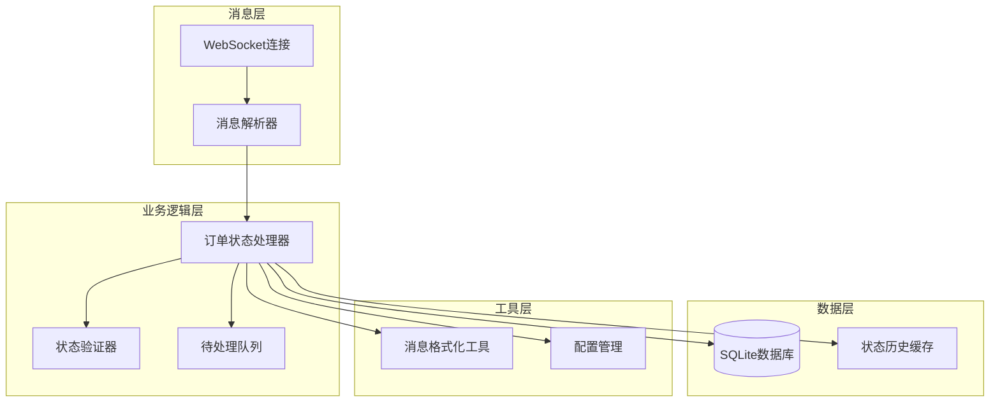
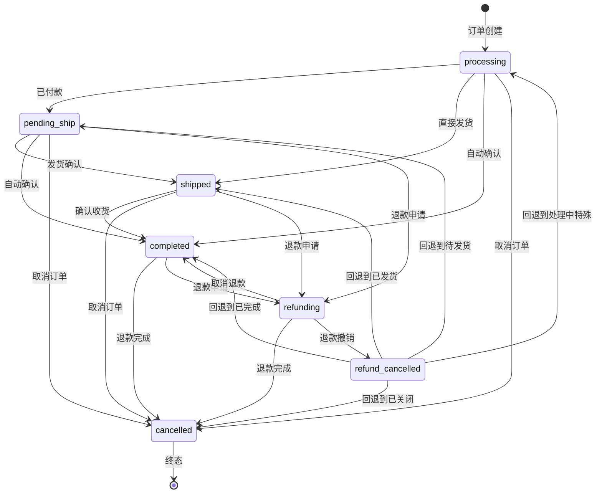
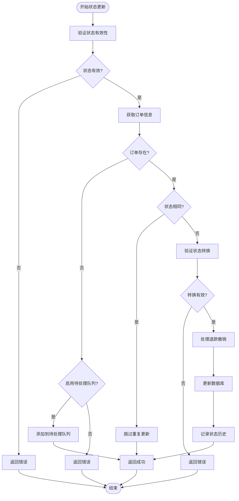
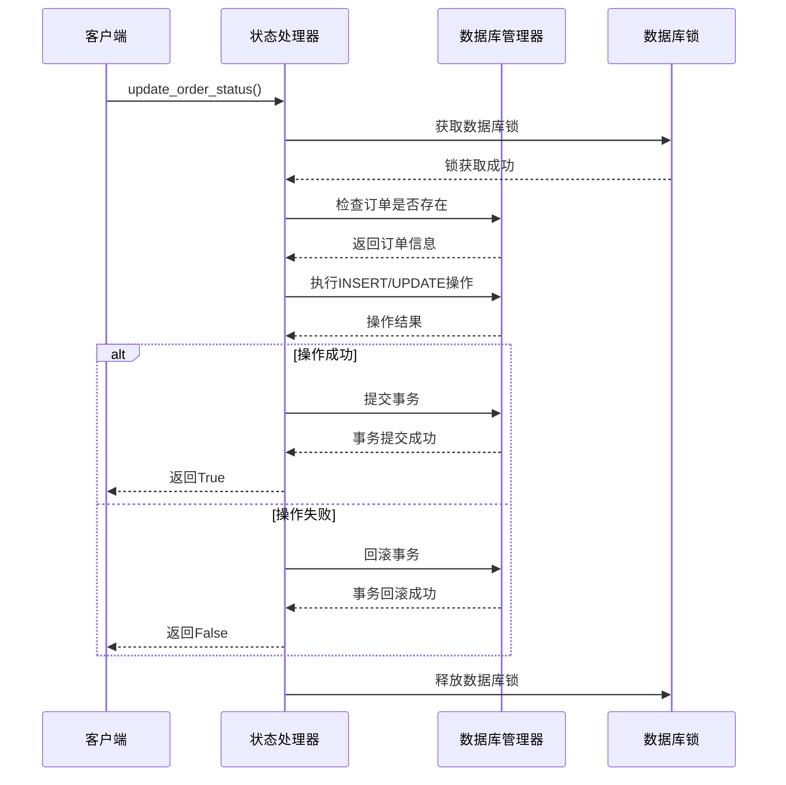
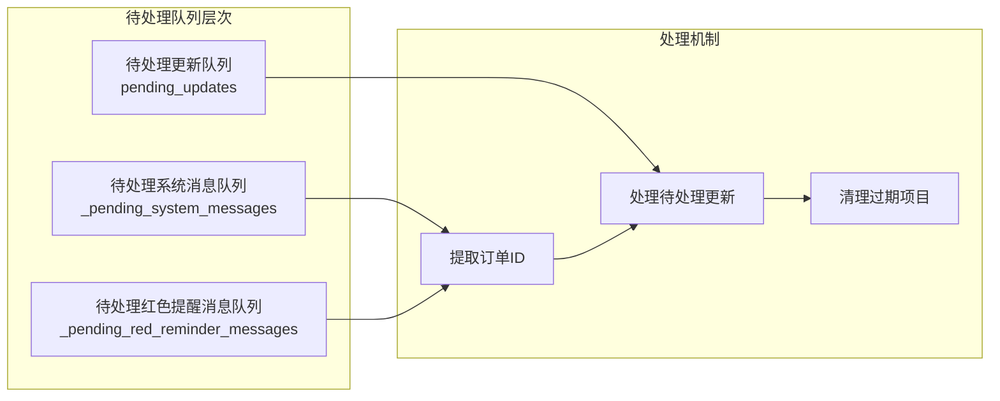

# 订单处理系统状态管理机制

<cite>
**本文档引用的文件**
- [order_status_handler.py](file://order_status_handler.py)
- [utils/message_utils.py](file://utils/message_utils.py)
- [db_manager.py](file://db_manager.py)
- [XianyuAutoAsync.py](file://XianyuAutoAsync.py)
- [config.py](file://config.py)
</cite>

## 目录
1. [系统概述](#系统概述)
2. [核心组件架构](#核心组件架构)
3. [状态转换规则](#状态转换规则)
4. [订单状态处理器详解](#订单状态处理器详解)
5. [消息处理与状态更新](#消息处理与状态更新)
6. [数据库操作与重试机制](#数据库操作与重试机制)
7. [待处理队列管理](#待处理队列管理)
8. [消息格式化工具](#消息格式化工具)
9. [配置与扩展性](#配置与扩展性)
10. [故障排除指南](#故障排除指南)

## 系统概述

订单处理系统是一个高度自动化的企业级解决方案，专门设计用于处理闲鱼平台上的订单状态变更。该系统通过WebSocket实时接收消息，智能解析订单状态，并确保所有状态转换都符合预定义的业务规则。

### 主要特性

- **严格的业务规则验证**：确保订单状态只能按照预设的业务逻辑进行转换
- **原子性状态更新**：通过数据库事务和重试机制保证状态变更的可靠性
- **智能消息解析**：从复杂的WebSocket消息结构中提取订单ID
- **待处理队列机制**：优雅处理数据库中不存在的订单状态更新
- **完善的日志记录**：提供详细的审计跟踪和调试信息

## 核心组件架构



**图表来源**
- [order_status_handler.py](file://order_status_handler.py#L26-L1074)
- [XianyuAutoAsync.py](file://XianyuAutoAsync.py#L158-L8372)

## 状态转换规则

系统定义了一套严格的订单状态转换规则，确保业务逻辑的正确性。

### 状态枚举

| 状态代码 | 中文描述 | 英文描述 |
|---------|---------|---------|
| processing | 处理中 | Processing |
| pending_ship | 待发货 | Pending Ship |
| shipped | 已发货 | Shipped |
| completed | 已完成 | Completed |
| refunding | 退款中 | Refunding |
| refund_cancelled | 退款撤销 | Refund Cancelled |
| cancelled | 已关闭 | Cancelled |

### 状态转换矩阵



**图表来源**
- [order_status_handler.py](file://order_status_handler.py#L36-L43)

### 关键业务规则

1. **禁止状态回退**：已付款的订单和已完成的订单不能回退到处理中状态
2. **退款特殊处理**：退款中的订单可以设置为已完成（取消退款）或已关闭（退款完成）
3. **临时状态**：退款撤销状态（refund_cancelled）是临时状态，会立即回退到上一次状态
4. **终态保护**：已关闭状态（cancelled）不能转换到其他任何状态

**节来源**
- [order_status_handler.py](file://order_status_handler.py#L36-L43)
- [order_status_handler.py](file://order_status_handler.py#L309-L330)

## 订单状态处理器详解

### OrderStatusHandler类核心功能

OrderStatusHandler类是系统的核心组件，负责管理所有订单状态相关的业务逻辑。

#### 初始化配置

系统提供了灵活的配置选项，支持不同的部署需求：

```python
ORDER_STATUS_HANDLER_CONFIG = {
    'use_pending_queue': True,                     # 是否使用待处理队列
    'strict_validation': True,                     # 是否启用严格的状态转换验证
    'log_level': 'info',                          # 日志级别
    'max_pending_age_hours': 24,                  # 待处理更新的最大保留时间
    'enable_status_logging': True,                # 是否启用详细的状态变更日志
}
```

#### 并发控制机制

系统使用threading.RLock确保线程安全：

```python
# 使用threading.RLock保护并发访问
self._lock = threading.RLock()
```

#### 状态映射表

系统维护了一个完整的状态映射表，支持中英文状态描述：

```python
self.status_mapping = {
    'processing': '处理中',
    'pending_ship': '待发货',
    'shipped': '已发货',
    'completed': '已完成',
    'refunding': '退款中',
    'refund_cancelled': '退款撤销',
    'cancelled': '已关闭',
}
```

**节来源**
- [order_status_handler.py](file://order_status_handler.py#L15-L23)
- [order_status_handler.py](file://order_status_handler.py#L46-L75)

### update_order_status方法详解

update_order_status方法是状态更新的核心入口，实现了严格的验证和可靠的数据库操作。

#### 验证流程



**图表来源**
- [order_status_handler.py](file://order_status_handler.py#L192-L307)

#### 数据库重试机制

系统实现了智能的数据库重试机制，确保操作的可靠性：

```python
max_retries = 3
for attempt in range(max_retries):
    try:
        # 数据库操作
        success = db_manager.insert_or_update_order(...)
        break
    except Exception as db_e:
        if attempt == max_retries - 1:
            # 最后一次尝试失败
            return False
        else:
            # 递增延迟重试
            time.sleep(0.1 * (attempt + 1))
```

#### 状态历史记录

系统会记录所有有效的状态变更，用于退款撤销时的回退：

```python
def _record_status_history(self, order_id: str, from_status: str, to_status: str, context: str):
    with self._lock:
        if order_id not in self._order_status_history:
            self._order_status_history[order_id] = []
        
        # 只记录非临时状态的历史
        if to_status != 'refund_cancelled':
            history_entry = {
                'from_status': from_status,
                'to_status': to_status,
                'context': context,
                'timestamp': time.time()
            }
            self._order_status_history[order_id].append(history_entry)
```

**节来源**
- [order_status_handler.py](file://order_status_handler.py#L192-L307)
- [order_status_handler.py](file://order_status_handler.py#L419-L446)

### _is_valid_status_transition方法

该方法实现了严格的状态转换验证逻辑：

```python
def _is_valid_status_transition(self, current_status: str, new_status: str) -> bool:
    # 如果当前状态不在规则中，允许转换（兼容性）
    if current_status not in self.VALID_TRANSITIONS:
        return True
    
    # 特殊规则：已付款的订单和已完成的订单不能回退到处理中
    if new_status == 'processing' and current_status in ['pending_ship', 'shipped', 'completed', 'refunding', 'refund_cancelled']:
        return False
    
    # 检查新状态是否在允许的转换列表中
    allowed_statuses = self.VALID_TRANSITIONS.get(current_status, [])
    return new_status in allowed_statuses
```

**节来源**
- [order_status_handler.py](file://order_status_handler.py#L309-L330)

## 消息处理与状态更新

### extract_order_id方法

系统能够从复杂的WebSocket消息结构中提取订单ID，支持多种提取策略：

#### 提取策略

1. **优先策略**：从button的targetUrl中提取orderId
2. **备用策略**：从main的targetUrl中提取order_detail的id  
3. **兜底策略**：在消息字符串中搜索各种可能的订单ID模式

#### 支持的订单ID模式

```python
patterns = [
    r'orderId[=:](\d{10,})',           # orderId=123456789
    r'order_detail\?id=(\d{10,})',    # order_detail?id=123456789
    r'"id"\s*:\s*"?(\d{10,})"?',      # "id":"123456789" 或 "id":123456789
    r'bizOrderId[=:](\d{10,})',       # bizOrderId=123456789
]
```

#### 消息结构分析

系统会对消息结构进行深度分析，提供详细的调试信息：

```python
# 检查message['1']的结构
message_1 = message.get('1', {})
if isinstance(message_1, dict):
    logger.info(f"🔍 message['1'] 是字典，keys: {list(message_1.keys())}")
```

**节来源**
- [order_status_handler.py](file://order_status_handler.py#L81-L186)
- [order_status_handler.py](file://order_status_handler.py#L163-L176)

### handle_system_message方法

该方法处理系统消息并更新订单状态，实现了智能的状态优先级判断：

#### 状态优先级映射

```python
status_priority = {
    'processing': 1,      # 处理中
    'pending_ship': 2,    # 待发货
    'shipped': 3,         # 已发货
    'completed': 4,       # 已完成
    'refunding': 2,       # 退款中（与待发货同级）
    'cancelled': 5,       # 已取消（终态）
}
```

#### 智能状态过滤

系统会智能地过滤掉不合理的状态回退：

```python
# 如果新状态的优先级低于当前状态，且不是特殊状态（退款、取消），则忽略
if new_priority < current_priority and new_status not in ['refunding', 'cancelled']:
    logger.warning(f'忽略回退到 {new_status}')
    return True  # 返回True表示已处理，但实际上是忽略
```

**节来源**
- [order_status_handler.py](file://order_status_handler.py#L633-L758)
- [order_status_handler.py](file://order_status_handler.py#L722-L739)

## 数据库操作与重试机制

### insert_or_update_order方法

系统提供了原子性的订单数据库操作：

#### 操作流程



**图表来源**
- [db_manager.py](file://db_manager.py#L4400-L4474)

#### 数据完整性保障

1. **外键约束检查**：确保cookie_id存在于cookies表中
2. **事务原子性**：所有数据库操作在一个事务中完成
3. **异常处理**：捕获所有异常并回滚事务

### get_order_by_id方法

提供安全的订单查询接口：

```python
def get_order_by_id(self, order_id: str):
    with self.lock:
        try:
            cursor = self.conn.cursor()
            cursor.execute('''
            SELECT order_id, item_id, buyer_id, spec_name, spec_value,
                   quantity, amount, order_status, cookie_id, created_at, updated_at
            FROM orders WHERE order_id = ?
            ''', (order_id,))
            
            row = cursor.fetchone()
            if row:
                return {
                    'order_id': row[0],
                    'item_id': row[1],
                    'buyer_id': row[2],
                    'spec_name': row[3],
                    'spec_value': row[4],
                    'quantity': row[5],
                    'amount': row[6],
                    'order_status': row[7],
                    'cookie_id': row[8],
                    'created_at': row[9],
                    'updated_at': row[10]
                }
            return None
        except Exception as e:
            logger.error(f"获取订单信息失败: {order_id} - {e}")
            return None
```

**节来源**
- [db_manager.py](file://db_manager.py#L4400-L4474)
- [db_manager.py](file://db_manager.py#L4475-L4505)

## 待处理队列管理

### 队列架构

系统实现了多层次的待处理队列机制：



**图表来源**
- [order_status_handler.py](file://order_status_handler.py#L61-L70)

### _add_to_pending_updates方法

当订单不存在于数据库时，系统会将状态更新请求添加到待处理队列：

```python
def _add_to_pending_updates(self, order_id: str, new_status: str, cookie_id: str, context: str):
    with self._lock:
        if order_id not in self.pending_updates:
            self.pending_updates[order_id] = []
        
        update_info = {
            'new_status': new_status,
            'cookie_id': cookie_id,
            'context': context,
            'timestamp': time.time()
        }
        
        self.pending_updates[order_id].append(update_info)
```

### process_pending_updates方法

系统会定期处理待处理队列中的更新请求：

```python
def process_pending_updates(self, order_id: str) -> bool:
    with self._lock:
        if order_id not in self.pending_updates:
            return False
        
        updates = self.pending_updates.pop(order_id)
        processed_count = 0
    
    for update_info in updates:
        success = self.update_order_status(
            order_id=order_id,
            new_status=update_info['new_status'],
            cookie_id=update_info['cookie_id'],
            context=f"待处理队列: {update_info['context']}"
        )
        
        if success:
            processed_count += 1
    
    return processed_count > 0
```

### 清理机制

系统实现了智能的过期项目清理机制：

```python
def clear_old_pending_updates(self, max_age_hours: int = None):
    current_time = time.time()
    max_age_seconds = max_age_hours * 3600 if max_age_hours else self.config.get('max_pending_age_hours', 24) * 3600
    
    with self._lock:
        # 清理pending_updates
        expired_orders = []
        for order_id, updates in self.pending_updates.items():
            valid_updates = [
                update for update in updates 
                if current_time - update['timestamp'] < max_age_seconds
            ]
            
            if not valid_updates:
                expired_orders.append(order_id)
            else:
                self.pending_updates[order_id] = valid_updates
        
        # 移除完全过期的订单
        for order_id in expired_orders:
            del self.pending_updates[order_id]
```

**节来源**
- [order_status_handler.py](file://order_status_handler.py#L465-L486)
- [order_status_handler.py](file://order_status_handler.py#L488-L525)
- [order_status_handler.py](file://order_status_handler.py#L555-L631)

## 消息格式化工具

### format_message函数

提供统一的消息格式化输出：

```python
def format_message(message_data: Dict[str, Any], is_outgoing: bool = False, is_manual: bool = False) -> str:
    try:
        # 获取消息内容
        content = message_data.get('content', '')
        if not content:
            return ''
            
        # 获取发送时间
        timestamp = message_data.get('time', time.time() * 1000)
        time_str = time.strftime('%Y-%m-%d %H:%M:%S', time.localtime(timestamp / 1000))
        
        # 确定消息方向
        direction = '【发出】' if is_outgoing else '【收到】'
        if is_manual:
            direction = '【手动发出】'
            
        # 格式化输出
        return f"{time_str} {direction} {content}"
    except Exception as e:
        return f"消息格式化错误: {str(e)}"
```

### format_system_message函数

专门用于格式化系统消息：

```python
def format_system_message(message: str) -> str:
    time_str = time.strftime('%Y-%m-%d %H:%M:%S', time.localtime())
    return f"{time_str} 【系统】 {message}"
```

**节来源**
- [utils/message_utils.py](file://utils/message_utils.py#L4-L24)
- [utils/message_utils.py](file://utils/message_utils.py#L26-L29)

## 配置与扩展性

### 配置管理

系统使用Config类提供集中式的配置管理：

```python
class Config:
    """配置管理类"""
    
    def get(self, key: str, default: Any = None) -> Any:
        """获取配置项"""
        keys = key.split('.')
        value = self._config
        for k in keys:
            if isinstance(value, dict):
                value = value.get(k)
            else:
                return default
            if value is None:
                return default
        return value
    
    def set(self, key: str, value: Any) -> None:
        """设置配置项"""
        keys = key.split('.')
        config = self._config
        for k in keys[:-1]:
            if k not in config:
                config[k] = {}
            config = config[k]
        config[keys[-1]] = value
```

### 扩展点

1. **自定义状态转换规则**：可以通过修改VALID_TRANSITIONS常量来扩展状态转换逻辑
2. **消息处理扩展**：可以添加新的消息类型处理器
3. **数据库适配**：可以通过修改db_manager来适配不同的数据库系统
4. **日志级别调整**：可以通过配置调整日志详细程度

**节来源**
- [config.py](file://config.py#L5-L86)

## 故障排除指南

### 常见问题及解决方案

#### 1. 订单状态转换失败

**症状**：状态更新返回False，但没有明确错误信息

**排查步骤**：
1. 检查订单ID是否正确
2. 验证状态转换规则
3. 检查数据库连接状态
4. 查看详细错误日志

**解决方案**：
```python
# 启用详细日志
ORDER_STATUS_HANDLER_CONFIG['log_level'] = 'debug'
ORDER_STATUS_HANDLER_CONFIG['enable_status_logging'] = True
```

#### 2. 订单ID提取失败

**症状**：无法从消息中提取订单ID

**排查步骤**：
1. 检查消息结构是否符合预期
2. 验证正则表达式模式
3. 查看消息解析日志

**解决方案**：
```python
# 增加调试信息
logger.info(f"完整消息结构: {message}")
```

#### 3. 待处理队列堆积

**症状**：待处理队列中的项目持续增长

**排查步骤**：
1. 检查数据库连接是否正常
2. 验证订单ID提取逻辑
3. 查看队列清理日志

**解决方案**：
```python
# 调整清理频率
self.config['max_pending_age_hours'] = 12
```

#### 4. 数据库事务失败

**症状**：状态更新成功但数据库操作失败

**排查步骤**：
1. 检查数据库连接池状态
2. 验证外键约束
3. 查看事务回滚日志

**解决方案**：
```python
# 增加重试次数
max_retries = 5
```

### 监控指标

建议监控以下关键指标：

1. **状态转换成功率**：成功状态转换/总状态转换
2. **待处理队列长度**：pending_updates队列大小
3. **消息处理延迟**：从消息接收到状态更新的时间
4. **数据库连接健康度**：连接池使用率和超时次数

### 性能优化建议

1. **批量处理**：对于大量待处理更新，考虑批量处理
2. **缓存优化**：对频繁查询的状态进行缓存
3. **连接池调优**：根据并发需求调整数据库连接池大小
4. **日志分级**：在高负载时降低日志级别

**节来源**
- [order_status_handler.py](file://order_status_handler.py#L204-L307)
- [order_status_handler.py](file://order_status_handler.py#L555-L631)

## 结论

订单处理系统通过精心设计的状态管理机制，确保了订单状态变更的准确性和可靠性。系统的核心优势包括：

1. **严格的业务规则验证**：通过VALID_TRANSITIONS常量确保状态转换的合法性
2. **可靠的数据库操作**：通过重试机制和事务保证数据一致性
3. **智能的消息处理**：支持复杂的WebSocket消息解析和订单ID提取
4. **优雅的错误处理**：通过待处理队列机制处理临时性错误
5. **完善的监控体系**：提供详细的日志记录和状态跟踪

该系统为企业级应用提供了稳定、可靠、可扩展的订单状态管理解决方案，能够满足复杂业务场景下的各种需求。